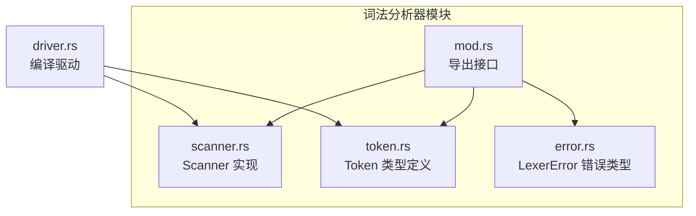
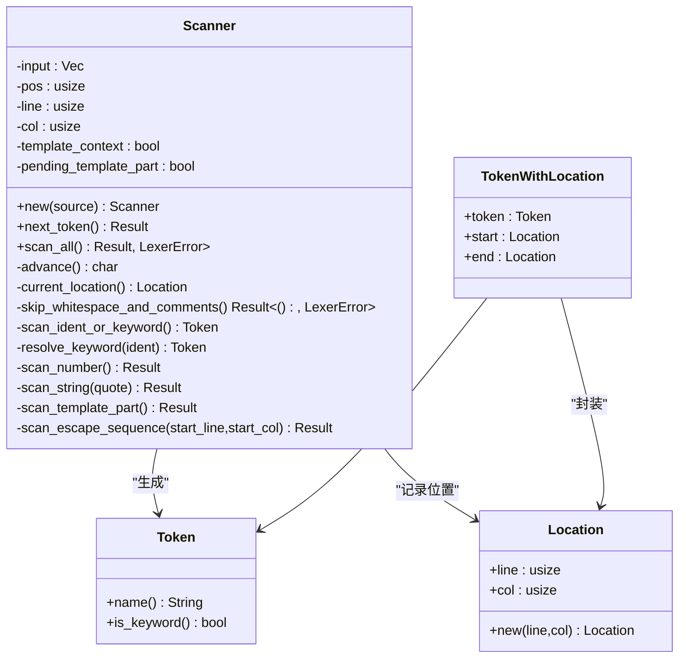
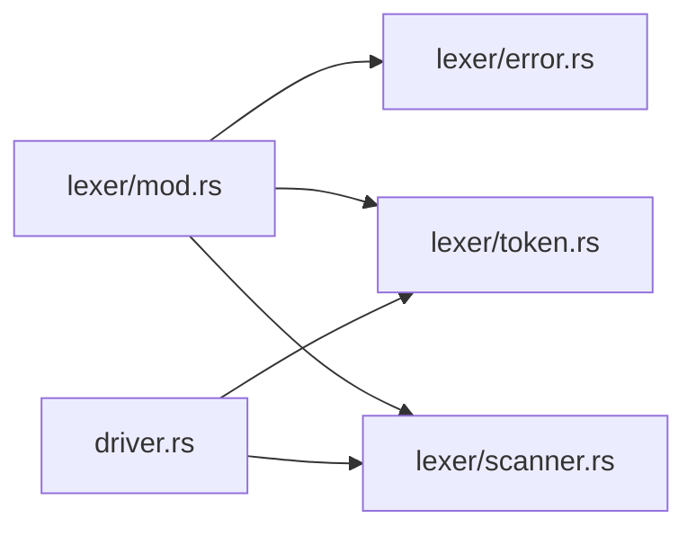

# 词法分析器

<cite>
**本文引用的文件**
- [crates/ruyic/src/lexer/mod.rs](file://crates/ruyic/src/lexer/mod.rs)
- [crates/ruyic/src/lexer/scanner.rs](file://crates/ruyic/src/lexer/scanner.rs)
- [crates/ruyic/src/lexer/token.rs](file://crates/ruyic/src/lexer/token.rs)
- [crates/ruyic/src/lexer/error.rs](file://crates/ruyic/src/lexer/error.rs)
- [crates/ruyic/src/driver.rs](file://crates/ruyic/src/driver.rs)
- [examples/hello.ry](file://examples/hello.ry)
- [examples/control_flow.ry](file://examples/control_flow.ry)
- [examples/functions.ry](file://examples/functions.ry)
- [crates/ruyic/tests/integration/cases/basic/hello_world.ry](file://crates/ruyic/tests/integration/cases/basic/hello_world.ry)
- [crates/ruyic/tests/integration/cases/basic/arithmetic.ry](file://crates/ruyic/tests/integration/cases/basic/arithmetic.ry)
</cite>

## 目录
1. [引言](#引言)
2. [项目结构](#项目结构)
3. [核心组件](#核心组件)
4. [架构总览](#架构总览)
5. [详细组件分析](#详细组件分析)
6. [依赖关系分析](#依赖关系分析)
7. [性能考量](#性能考量)
8. [故障排查指南](#故障排查指南)
9. [结论](#结论)
10. [附录](#附录)

## 引言
本文件为 Ruyi 语言词法分析器的全面技术文档，覆盖字符扫描器（Scanner）的工作机制与状态机设计、标记（Token）类型体系与分类规则、错误处理机制、Unicode 字符处理、注释与字符串字面量解析策略，并给出状态转换图与标记识别算法流程图。文档同时结合仓库中的示例与集成测试用例，展示典型词法分析场景。

## 项目结构
词法分析器位于 ruyi 编译器子项目 crates/ruyic 中，采用模块化组织：
- lexer 模块：导出错误、扫描器、标记三类核心构件
- scanner 实现：基于字符流的线性扫描与状态推进
- token 定义：涵盖关键字、标识符、字面量、运算符、分隔符等
- error 错误：统一的词法错误类型与位置信息
- driver 驱动：在编译管线中调用解析器，间接使用词法分析器



图表来源
- [crates/ruyic/src/lexer/mod.rs:1-8](file://crates/ruyic/src/lexer/mod.rs#L1-L8)
- [crates/ruyic/src/lexer/scanner.rs:1-857](file://crates/ruyic/src/lexer/scanner.rs#L1-L857)
- [crates/ruyic/src/lexer/token.rs:1-438](file://crates/ruyic/src/lexer/token.rs#L1-L438)
- [crates/ruyic/src/lexer/error.rs:1-36](file://crates/ruyic/src/lexer/error.rs#L1-L36)
- [crates/ruyic/src/driver.rs:1-744](file://crates/ruyic/src/driver.rs#L1-L744)

章节来源
- [crates/ruyic/src/lexer/mod.rs:1-8](file://crates/ruyic/src/lexer/mod.rs#L1-L8)
- [crates/ruyic/src/lexer/scanner.rs:1-857](file://crates/ruyic/src/lexer/scanner.rs#L1-L857)
- [crates/ruyic/src/lexer/token.rs:1-438](file://crates/ruyic/src/lexer/token.rs#L1-L438)
- [crates/ruyic/src/lexer/error.rs:1-36](file://crates/ruyic/src/lexer/error.rs#L1-L36)
- [crates/ruyic/src/driver.rs:1-744](file://crates/ruyic/src/driver.rs#L1-L744)

## 核心组件
- Scanner：负责从源码字符串生成 Token 流，维护行/列位置、模板字符串上下文、待处理模板片段等状态
- Token：统一的标记类型，包含关键字、标识符、字面量（整数、浮点、大整数、字符串、模板）、运算符、分隔符、特殊标记（如 EOF）
- LexerError：集中定义词法阶段的错误类型，含无效字符、未终止字符串/注释/模板、非法转义、非法数字字面量、意外 EOF 等
- Location/TokenWithLocation：记录每个 Token 的起止位置，便于诊断与 AST 映射

章节来源
- [crates/ruyic/src/lexer/scanner.rs:4-324](file://crates/ruyic/src/lexer/scanner.rs#L4-L324)
- [crates/ruyic/src/lexer/token.rs:8-263](file://crates/ruyic/src/lexer/token.rs#L8-L263)
- [crates/ruyic/src/lexer/error.rs:9-35](file://crates/ruyic/src/lexer/error.rs#L9-L35)

## 架构总览
词法分析器在编译管线中的角色是“源码 → 标记流”，由解析器在内部使用。驱动程序负责加载源码、解析为 AST 并进入后续阶段。

```mermaid
sequenceDiagram
participant Src as "源文件(.ry)"
participant Drv as "Driver"
participant Lex as "Scanner"
participant Tok as "Token 列表"
participant Par as "Parser"
Src->>Drv : 读取源码
Drv->>Par : 创建解析器并解析
Par->>Lex : 请求下一个 Token
Lex-->>Par : 返回 TokenWithLocation
Par-->>Tok : 逐步消费 Token
Par-->>Drv : 生成 AST
```

图表来源
- [crates/ruyic/src/driver.rs:515-519](file://crates/ruyic/src/driver.rs#L515-L519)
- [crates/ruyic/src/lexer/scanner.rs:25-324](file://crates/ruyic/src/lexer/scanner.rs#L25-L324)

## 详细组件分析

### Scanner：字符扫描器与状态机
Scanner 是一个基于字符数组的线性扫描器，维护以下状态：
- 输入缓冲：Vec<char>
- 当前位置 pos、行 line、列 col
- 模板字符串上下文 template_context 与 pending_template_part
- 提供前进 advance、窥视 peek、当前位置 current_location、跳过空白与注释 skip_whitespace_and_comments 等辅助函数

状态机设计要点：
- 主循环 next_token：跳过空白与注释，根据首字符进行多路匹配，识别关键字/标识符、数字、字符串、模板、运算符/分隔符等
- 运算符识别采用“最长匹配优先”策略（如 ==、===、+=、++、=> 等）
- 注释支持单行 // 与块注释 /* */；块注释未闭合时返回错误
- 字符串支持单引号、双引号与反斜杠转义；换行未闭合字符串报错
- 模板字符串以 ` 开始，内部遇到 ${ 触发模板表达式开始标记，遇到 ` 结束模板；未闭合模板报错
- 数字字面量支持十进制、十六进制（0x）、八进制（0o）、二进制（0b），支持小数与指数，支持后缀 n 表示大整数；非法数字格式报错

```mermaid
flowchart TD
Start(["开始 next_token"]) --> SkipWS["跳过空白与注释"]
SkipWS --> IsEOF{"是否到达文件末尾？"}
IsEOF --> |是且模板上下文| ErrTpl["返回未终止模板错误"]
IsEOF --> |是| RetEOF["返回 EOF 标记"]
IsEOF --> |否| PeekCh["读取当前字符"]
PeekCh --> TplCheck{"模板上下文且当前为'}'？"}
TplCheck --> |是| RetTplEnd["返回模板表达式结束标记并设置待处理模板片段"]
TplCheck --> |否| Dispatch["按首字符分派识别"]
Dispatch --> IdentKW["字母/下划线/$ → 标识符或关键字"]
Dispatch --> Number["数字 → 数字字面量"]
Dispatch --> StrQ1["\" → 双引号字符串"]
Dispatch --> StrQ2["' → 单引号字符串"]
Dispatch --> TplStart["` → 模板字符串开始"]
Dispatch --> Op["运算符/分隔符 → 多字符匹配"]
Dispatch --> Other["其他 → 非法字符错误"]
IdentKW --> Done
Number --> Done
StrQ1 --> Done
StrQ2 --> Done
TplStart --> Done
Op --> Done
Other --> Done
RetEOF --> Done(["结束"])
ErrTpl --> Done
RetTplEnd --> Done
Done
```

图表来源
- [crates/ruyic/src/lexer/scanner.rs:25-324](file://crates/ruyic/src/lexer/scanner.rs#L25-L324)
- [crates/ruyic/src/lexer/scanner.rs:379-420](file://crates/ruyic/src/lexer/scanner.rs#L379-L420)
- [crates/ruyic/src/lexer/scanner.rs:488-572](file://crates/ruyic/src/lexer/scanner.rs#L488-L572)
- [crates/ruyic/src/lexer/scanner.rs:667-696](file://crates/ruyic/src/lexer/scanner.rs#L667-L696)
- [crates/ruyic/src/lexer/scanner.rs:817-855](file://crates/ruyic/src/lexer/scanner.rs#L817-L855)

章节来源
- [crates/ruyic/src/lexer/scanner.rs:4-324](file://crates/ruyic/src/lexer/scanner.rs#L4-L324)
- [crates/ruyic/src/lexer/scanner.rs:379-420](file://crates/ruyic/src/lexer/scanner.rs#L379-L420)
- [crates/ruyic/src/lexer/scanner.rs:488-572](file://crates/ruyic/src/lexer/scanner.rs#L488-L572)
- [crates/ruyic/src/lexer/scanner.rs:667-696](file://crates/ruyic/src/lexer/scanner.rs#L667-L696)
- [crates/ruyic/src/lexer/scanner.rs:817-855](file://crates/ruyic/src/lexer/scanner.rs#L817-L855)

### Token 类型体系与识别规则
Token 定义了完整的词法符号集合，分为：
- 关键字：let、const、fn、class、trait、impl、dyn、match、if/else、for/while、return、throw、try/catch/finally、async/await、import/export、macro、type、true/false/null、self/super/this、in/instanceof/typeof/void/delete/as、extends/static/get/set/new/of/break/continue/yield、下划线通配符等
- 标识符：Ident(String)
- 字面量：Int、BigInt、Float、String、TemplateString、TemplateExprStart/End
- 比较/算术/位运算/逻辑/空安全/访问/赋值/箭头/自增/分隔符等

识别规则：
- 标识符/关键字：以字母、下划线、美元符开头，后续可含数字；通过 is_ident_part 判断，再用 resolve_keyword 决定是关键字还是 Ident
- 数字：十进制、0x/0o/0b 前缀；支持小数点与指数；n 后缀表示大整数；非法格式报错
- 字符串：单/双引号包裹，支持常见转义序列；换行未闭合报错
- 模板字符串：以 ` 开始，内部 ${ 触发表达式插值；遇到 ` 结束；未闭合报错
- 注释：// 单行；/* */ 块注释；块注释未闭合报错



图表来源
- [crates/ruyic/src/lexer/token.rs:8-263](file://crates/ruyic/src/lexer/token.rs#L8-L263)
- [crates/ruyic/src/lexer/scanner.rs:4-324](file://crates/ruyic/src/lexer/scanner.rs#L4-L324)

章节来源
- [crates/ruyic/src/lexer/token.rs:29-437](file://crates/ruyic/src/lexer/token.rs#L29-L437)
- [crates/ruyic/src/lexer/scanner.rs:422-486](file://crates/ruyic/src/lexer/scanner.rs#L422-L486)
- [crates/ruyic/src/lexer/scanner.rs:488-665](file://crates/ruyic/src/lexer/scanner.rs#L488-L665)
- [crates/ruyic/src/lexer/scanner.rs:667-696](file://crates/ruyic/src/lexer/scanner.rs#L667-L696)
- [crates/ruyic/src/lexer/scanner.rs:817-855](file://crates/ruyic/src/lexer/scanner.rs#L817-L855)

### 错误处理机制
LexerError 统一捕获以下错误：
- 非法字符：遇到不在识别规则内的字符
- 未终止字符串：字符串未闭合
- 未终止注释：块注释未闭合
- 未终止模板：模板字符串未闭合
- 非法转义：转义序列不合法
- 非法数字：数字格式不合法（如指数后无数字、十六进制/八进制/二进制缺少有效数字、无法解析等）
- 意外 EOF：在需要更多输入时提前结束

错误携带位置信息（行/列），便于诊断与定位。

章节来源
- [crates/ruyic/src/lexer/error.rs:9-35](file://crates/ruyic/src/lexer/error.rs#L9-L35)
- [crates/ruyic/src/lexer/scanner.rs:379-420](file://crates/ruyic/src/lexer/scanner.rs#L379-L420)
- [crates/ruyic/src/lexer/scanner.rs:488-572](file://crates/ruyic/src/lexer/scanner.rs#L488-L572)
- [crates/ruyic/src/lexer/scanner.rs:667-696](file://crates/ruyic/src/lexer/scanner.rs#L667-L696)
- [crates/ruyic/src/lexer/scanner.rs:817-855](file://crates/ruyic/src/lexer/scanner.rs#L817-L855)

### Unicode 字符处理、注释与字符串字面量
- Unicode 字符处理：Scanner 将源码转换为 Vec<char>，逐字符扫描；标识符字符集包含字母、数字、下划线、美元符；模板与字符串内部转义支持十六进制与 Unicode 码点序列
- 注释解析：单行注释从 // 起到行末；块注释从 /* 起，直到 */；未闭合块注释报错
- 字符串字面量：支持单引号与双引号；转义序列包括常见的控制字符与十六进制 \xHH、Unicode \u{...} 或固定长度 \uHHH；换行未闭合字符串报错

章节来源
- [crates/ruyic/src/lexer/scanner.rs:379-420](file://crates/ruyic/src/lexer/scanner.rs#L379-L420)
- [crates/ruyic/src/lexer/scanner.rs:667-696](file://crates/ruyic/src/lexer/scanner.rs#L667-L696)
- [crates/ruyic/src/lexer/scanner.rs:698-815](file://crates/ruyic/src/lexer/scanner.rs#L698-L815)

### 标记识别算法（流程图）
```mermaid
flowchart TD
A["读取当前字符"] --> B{"是否空白/制表/回车/换页？"}
B --> |是| Adv["advance() 并继续"]
B --> |否| C{"是否'/'且下一个是'/'？"}
C --> |是| SkipLn["跳过至行末"] --> A
C --> |否| D{"是否'/'且下一个是'*'？"}
D --> |是| SkipBlk["跳过块注释直至 '*/'"] --> A
D --> |否| E["根据首字符分派识别"]
E --> F["关键字/标识符：字母/下划线/$ 开头"]
E --> G["数字：0x/0o/0b 或十进制"]
E --> H["字符串：\" 或 '"]
E --> I["模板：` 开始"]
E --> J["运算符/分隔符：+ - * / % = ! < > & | ^ ~ ? . : ; , ( ) [ ] { } @ # $"]
F --> K["返回 Token 并更新位置"]
G --> K
H --> K
I --> K
J --> K
```

图表来源
- [crates/ruyic/src/lexer/scanner.rs:379-420](file://crates/ruyic/src/lexer/scanner.rs#L379-L420)
- [crates/ruyic/src/lexer/scanner.rs:57-311](file://crates/ruyic/src/lexer/scanner.rs#L57-L311)

## 依赖关系分析
- lexer 模块对外仅暴露 error、scanner、token 三个子模块与必要的 re-export
- driver 在编译流程中间接依赖 lexer：解析器内部完成词法阶段，随后进入宏展开、类型检查与代码生成
- 示例与集成测试用例展示了词法分析器在真实场景中的行为（如字符串、注释、控制流、函数声明等）



图表来源
- [crates/ruyic/src/lexer/mod.rs:1-8](file://crates/ruyic/src/lexer/mod.rs#L1-L8)
- [crates/ruyic/src/lexer/error.rs:1-36](file://crates/ruyic/src/lexer/error.rs#L1-L36)
- [crates/ruyic/src/lexer/token.rs:1-438](file://crates/ruyic/src/lexer/token.rs#L1-L438)
- [crates/ruyic/src/lexer/scanner.rs:1-857](file://crates/ruyic/src/lexer/scanner.rs#L1-L857)
- [crates/ruyic/src/driver.rs:1-744](file://crates/ruyic/src/driver.rs#L1-L744)

章节来源
- [crates/ruyic/src/lexer/mod.rs:1-8](file://crates/ruyic/src/lexer/mod.rs#L1-L8)
- [crates/ruyic/src/driver.rs:515-519](file://crates/ruyic/src/driver.rs#L515-L519)

## 性能考量
- 线性扫描：Scanner 以 O(n) 线性遍历字符，时间复杂度与源码长度成正比
- 常量开销：多路匹配与最长匹配策略在常数时间内完成，整体仍保持线性
- 字符数组存储：将字符串转为 Vec<char> 便于随机访问与位置追踪，内存开销与源码长度成正比
- 优化建议：
  - 对于超长字符串与模板，避免不必要的中间字符串拼接
  - 在高频路径上减少分支判断层级
  - 对数字解析可考虑预分配与批量解析策略（需权衡复杂度）

## 故障排查指南
- 非法字符错误：检查输入中是否存在未支持的符号或编码问题
- 未终止字符串/注释/模板：确认配对引号、注释与模板定界符是否完整
- 非法转义：检查转义序列是否符合规范（如 \x 需两位十六进制，\u 需合法码点）
- 非法数字：检查进制前缀与后续字符合法性（如 0x 后必须为十六进制，e/E 后必须为数字）
- 意外 EOF：在需要更多输入时提前结束，检查文件完整性与编码

章节来源
- [crates/ruyic/src/lexer/error.rs:9-35](file://crates/ruyic/src/lexer/error.rs#L9-L35)
- [crates/ruyic/src/lexer/scanner.rs:379-420](file://crates/ruyic/src/lexer/scanner.rs#L379-L420)
- [crates/ruyic/src/lexer/scanner.rs:488-572](file://crates/ruyic/src/lexer/scanner.rs#L488-L572)
- [crates/ruyic/src/lexer/scanner.rs:667-696](file://crates/ruyic/src/lexer/scanner.rs#L667-L696)
- [crates/ruyic/src/lexer/scanner.rs:817-855](file://crates/ruyic/src/lexer/scanner.rs#L817-L855)

## 结论
Ruyi 词法分析器采用简洁高效的线性扫描与最长匹配策略，覆盖关键字、标识符、字面量、运算符与分隔符等全部语言要素。其错误类型统一、位置信息完备，便于在编译管线中与其他阶段协同工作。通过模板字符串、注释与字符串转义的完善支持，能够满足现代脚本语言的表达需求。

## 附录
- 示例与测试用例展示了词法分析器在真实场景中的行为：
  - hello.ry：基本打印语句
  - control_flow.ry：if/else、for、while、break/continue 等控制流
  - functions.ry：函数声明、箭头函数、默认参数等
  - 集成测试：hello_world.ry、arithmetic.ry 展示了变量声明与算术运算

章节来源
- [examples/hello.ry:1-2](file://examples/hello.ry#L1-L2)
- [examples/control_flow.ry:1-160](file://examples/control_flow.ry#L1-L160)
- [examples/functions.ry:1-114](file://examples/functions.ry#L1-L114)
- [crates/ruyic/tests/integration/cases/basic/hello_world.ry:1-1](file://crates/ruyic/tests/integration/cases/basic/hello_world.ry#L1-L1)
- [crates/ruyic/tests/integration/cases/basic/arithmetic.ry:1-11](file://crates/ruyic/tests/integration/cases/basic/arithmetic.ry#L1-L11)