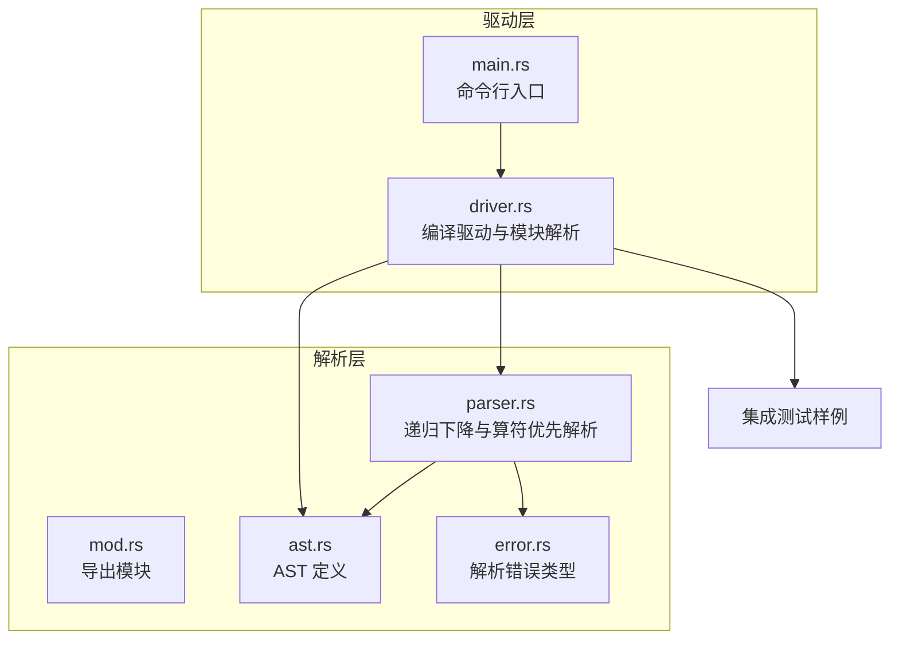
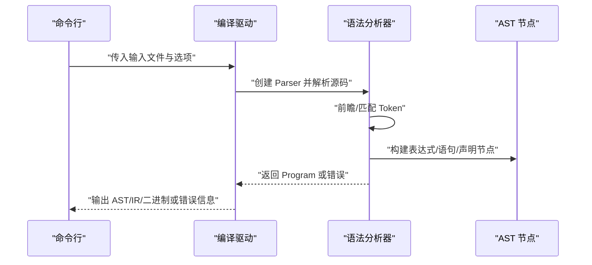
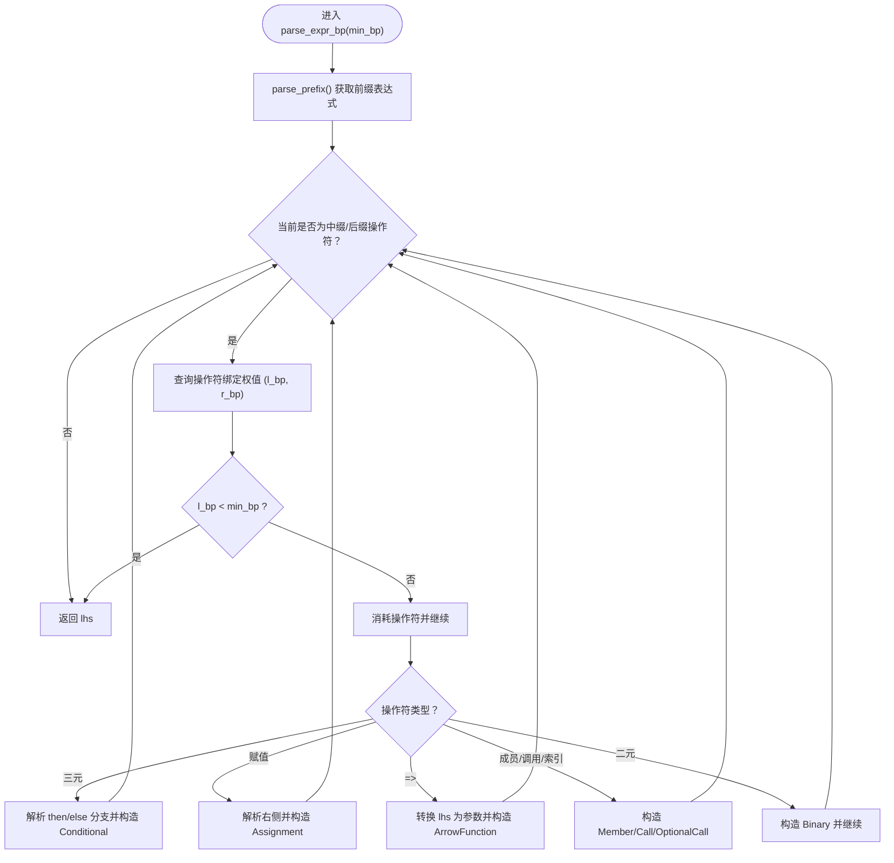
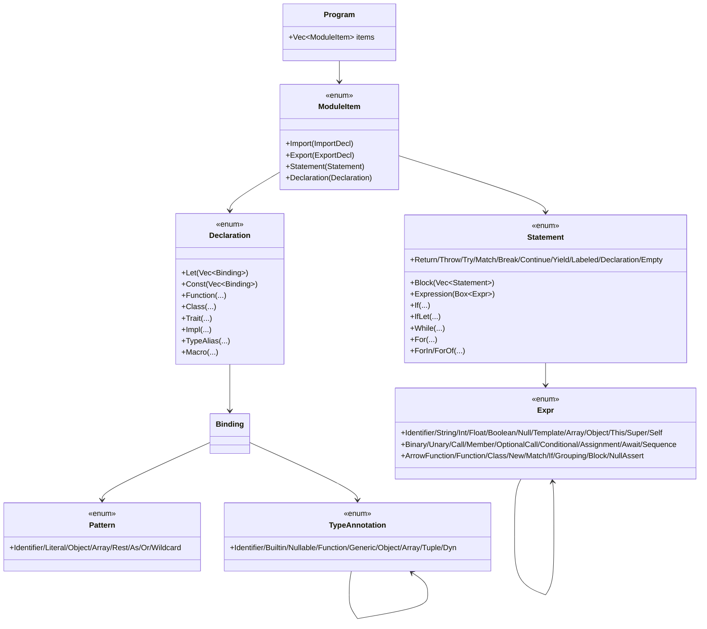
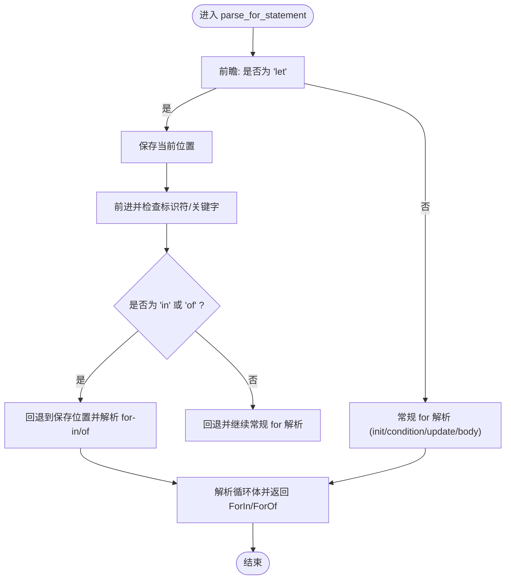
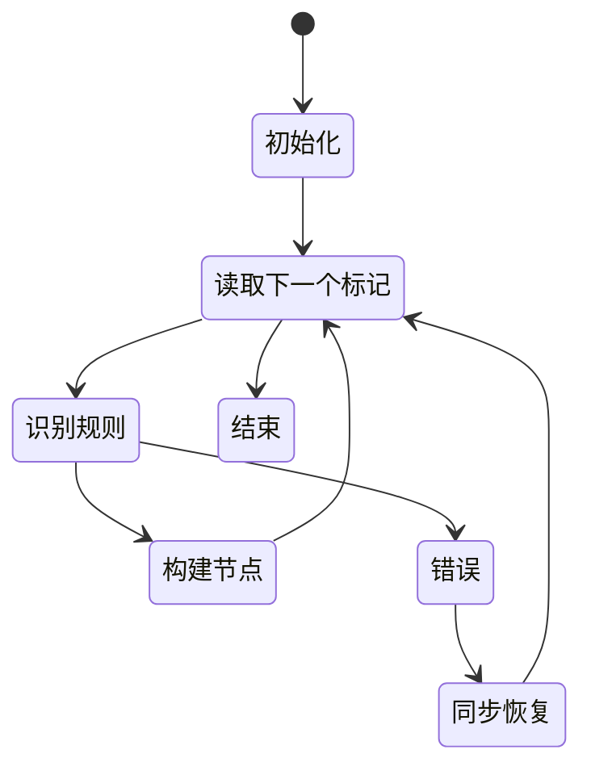
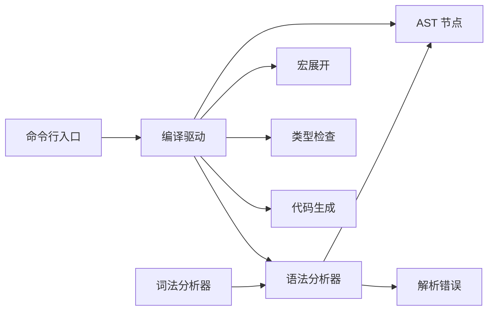

# 语法分析器

<cite>
**本文引用的文件**
- [crates/ruyic/src/parser/mod.rs](file://crates/ruyic/src/parser/mod.rs)
- [crates/ruyic/src/parser/ast.rs](file://crates/ruyic/src/parser/ast.rs)
- [crates/ruyic/src/parser/error.rs](file://crates/ruyic/src/parser/error.rs)
- [crates/ruyic/src/parser/parser.rs](file://crates/ruyic/src/parser/parser.rs)
- [crates/ruyic/src/driver.rs](file://crates/ruyic/src/driver.rs)
- [crates/ruyic/src/main.rs](file://crates/ruyic/src/main.rs)
- [crates/ruyic/tests/integration/cases/basic/arithmetic.ry](file://crates/ruyic/tests/integration/cases/basic/arithmetic.ry)
- [crates/ruyic/tests/integration/cases/basic/arithmetic.expected](file://crates/ruyic/tests/integration/cases/basic/arithmetic.expected)
- [crates/ruyic/tests/integration/cases/codegen/if_statement.ry](file://crates/ruyic/tests/integration/cases/codegen/if_statement.ry)
- [crates/ruyic/tests/integration/cases/codegen/function_call.ry](file://crates/ruyic/tests/integration/cases/codegen/function_call.ry)
- [crates/ruyic/tests/integration/cases/codegen/object_literal.ry](file://crates/ruyic/tests/integration/cases/codegen/object_literal.ry)
</cite>

## 目录
1. [简介](#简介)
2. [项目结构](#项目结构)
3. [核心组件](#核心组件)
4. [架构总览](#架构总览)
5. [详细组件分析](#详细组件分析)
6. [依赖关系分析](#依赖关系分析)
7. [性能考量](#性能考量)
8. [故障排查指南](#故障排查指南)
9. [结论](#结论)
10. [附录](#附录)

## 简介
本文件系统性地记录 Ruyi 语法分析器的设计与实现，重点覆盖以下方面：
- 递归下降解析算法与算符优先级（Operator-Precedence）实现
- 抽象语法树（AST）节点类型定义与层次结构
- 表达式、语句、声明、模式与类型注解的解析规则
- 错误检测与恢复策略（错误同步与部分 AST 构建）
- 前瞻与回溯机制在箭头函数参数、for-in/of 判定等场景的应用
- AST 的内存布局与遍历建议
- 语法分析器状态图与复杂语法结构的解析示例

## 项目结构
Ruyi 编译器采用模块化设计，语法分析位于 crates/ruyic/src/parser 下，配合词法分析、宏展开、类型检查与代码生成形成完整的编译流水线。

图表来源
- [crates/ruyic/src/parser/mod.rs:1-8](file://crates/ruyic/src/parser/mod.rs#L1-L8)
- [crates/ruyic/src/parser/ast.rs:1-533](file://crates/ruyic/src/parser/ast.rs#L1-L533)
- [crates/ruyic/src/parser/error.rs:1-39](file://crates/ruyic/src/parser/error.rs#L1-L39)
- [crates/ruyic/src/parser/parser.rs:1-2346](file://crates/ruyic/src/parser/parser.rs#L1-L2346)
- [crates/ruyic/src/driver.rs:1-744](file://crates/ruyic/src/driver.rs#L1-L744)
- [crates/ruyic/src/main.rs:1-114](file://crates/ruyic/src/main.rs#L1-L114)

章节来源
- [crates/ruyic/src/parser/mod.rs:1-8](file://crates/ruyic/src/parser/mod.rs#L1-L8)
- [crates/ruyic/src/parser/ast.rs:1-533](file://crates/ruyic/src/parser/ast.rs#L1-L533)
- [crates/ruyic/src/parser/error.rs:1-39](file://crates/ruyic/src/parser/error.rs#L1-L39)
- [crates/ruyic/src/parser/parser.rs:1-2346](file://crates/ruyic/src/parser/parser.rs#L1-L2346)
- [crates/ruyic/src/driver.rs:1-744](file://crates/ruyic/src/driver.rs#L1-L744)
- [crates/ruyic/src/main.rs:1-114](file://crates/ruyic/src/main.rs#L1-L114)

## 核心组件
- 解析器 Parser：负责从词法单元流中推进并构建 AST；提供前瞻、匹配、期望、错误报告等基础能力。
- AST 定义：涵盖 Program、ModuleItem、Declaration、Statement、Expr、Pattern、TypeAnnotation 等完整节点族。
- 错误模型：统一的 ParseError 类型，支持“意外标记”、“期望标记”、“语法错误”、“意外 EOF”和词法错误。
- 驱动与集成：Driver 将解析结果接入后续宏展开、类型检查与代码生成；main 提供 CLI 入口。

章节来源
- [crates/ruyic/src/parser/parser.rs:6-123](file://crates/ruyic/src/parser/parser.rs#L6-L123)
- [crates/ruyic/src/parser/ast.rs:13-533](file://crates/ruyic/src/parser/ast.rs#L13-L533)
- [crates/ruyic/src/parser/error.rs:9-39](file://crates/ruyic/src/parser/error.rs#L9-L39)
- [crates/ruyic/src/driver.rs:21-138](file://crates/ruyic/src/driver.rs#L21-L138)

## 架构总览
解析阶段的核心流程如下：
- 词法扫描产生 Token 流
- Parser 逐个消费 Token，按语法规则递归下降
- 使用算符优先解析处理二元运算、赋值、三元条件、成员访问、调用等
- 在遇到错误时进行错误同步，尽可能构建部分 AST 以支持后续诊断

图表来源
- [crates/ruyic/src/driver.rs:258-329](file://crates/ruyic/src/driver.rs#L258-L329)
- [crates/ruyic/src/parser/parser.rs:12-22](file://crates/ruyic/src/parser/parser.rs#L12-L22)

## 详细组件分析

### 1) 递归下降解析与算符优先解析
- Parser 维护 tokens 向量与当前位置 pos，提供 advance、check、match_token、expect 等原语。
- 表达式解析采用算符优先（Operator-Precedence）算法，通过 infix_binding_power 返回左右绑定权值，控制结合性与优先级。
- 支持多种后缀/前缀操作符、成员访问（. 与可选链 ? .）、调用（()）、索引（[]）、三元条件、赋值与复合赋值、箭头函数、new 表达式等。

图表来源
- [crates/ruyic/src/parser/parser.rs:1189-1385](file://crates/ruyic/src/parser/parser.rs#L1189-L1385)
- [crates/ruyic/src/parser/parser.rs:2150-2196](file://crates/ruyic/src/parser/parser.rs#L2150-L2196)

章节来源
- [crates/ruyic/src/parser/parser.rs:1185-1385](file://crates/ruyic/src/parser/parser.rs#L1185-L1385)
- [crates/ruyic/src/parser/parser.rs:2150-2265](file://crates/ruyic/src/parser/parser.rs#L2150-L2265)

### 2) AST 节点类型与层次结构
AST 以枚举与结构体组合的方式组织，覆盖程序、模块项、声明、语句、表达式、模式与类型注解。

图表来源
- [crates/ruyic/src/parser/ast.rs:13-533](file://crates/ruyic/src/parser/ast.rs#L13-L533)

章节来源
- [crates/ruyic/src/parser/ast.rs:13-533](file://crates/ruyic/src/parser/ast.rs#L13-L533)

### 3) 语句解析规则与控制流
- if/else、while/while-let、for/for-in/for-of、try/catch/finally、match、return、throw、yield、break/continue、label 等均有独立解析器。
- for 循环对 let 标记与 in/of 进行前瞻判定，并在必要时回退到表达式初始化路径。
- match 支持守卫子句与多条分支，允许在大括号块内混合语句与表达式。

图表来源
- [crates/ruyic/src/parser/parser.rs:924-995](file://crates/ruyic/src/parser/parser.rs#L924-L995)

章节来源
- [crates/ruyic/src/parser/parser.rs:798-1181](file://crates/ruyic/src/parser/parser.rs#L798-L1181)
- [crates/ruyic/src/parser/parser.rs:924-995](file://crates/ruyic/src/parser/parser.rs#L924-L995)

### 4) 表达式解析规则与优先级、结合性
- 操作符优先级与结合性由 infix_binding_power 映射表定义，覆盖赋值、箭头函数、三元、空合并、逻辑或/与、按位或/异或/与、比较、移位、加减、乘除模、幂、成员/调用/索引等。
- 一元前缀操作符在 parse_prefix 中处理，右结合幂运算有特殊处理。
- 成员访问、可选链、调用、索引、三元、赋值与复合赋值、箭头函数、new、模板字面量、数组/对象字面量、函数/类表达式、if/else 表达式等均有专门解析器。

章节来源
- [crates/ruyic/src/parser/parser.rs:1189-1521](file://crates/ruyic/src/parser/parser.rs#L1189-L1521)
- [crates/ruyic/src/parser/parser.rs:2150-2265](file://crates/ruyic/src/parser/parser.rs#L2150-L2265)

### 5) 声明与类型注解解析
- 函数、类、trait、impl、类型别名、宏等声明解析器分别处理。
- 类元素支持 getter/setter、普通方法、字段；trait 元素支持方法与字段。
- 类型注解支持内置类型、泛型、函数类型、对象、数组、元组、动态类型、可空类型等。

章节来源
- [crates/ruyic/src/parser/parser.rs:388-573](file://crates/ruyic/src/parser/parser.rs#L388-L573)
- [crates/ruyic/src/parser/parser.rs:1825-1981](file://crates/ruyic/src/parser/parser.rs#L1825-L1981)

### 6) 模式解析
- 支持标识符、字面量、对象、数组、剩余、类型断言（as）、或模式、通配符等。
- 用于 if-let、for-let、match、变量声明等上下文。

章节来源
- [crates/ruyic/src/parser/parser.rs:2020-2146](file://crates/ruyic/src/parser/parser.rs#L2020-L2146)

### 7) 错误检测与恢复
- 错误类型统一为 ParseError，包含“意外标记”、“期望标记”、“语法错误”、“意外 EOF”、“词法错误”。
- 解析器在关键位置使用 expect_* 与 error/unexpected_eof 报告错误，并在多数情况下继续推进以进行错误同步，从而尽可能构建部分 AST。

章节来源
- [crates/ruyic/src/parser/error.rs:9-39](file://crates/ruyic/src/parser/error.rs#L9-L39)
- [crates/ruyic/src/parser/parser.rs:106-186](file://crates/ruyic/src/parser/parser.rs#L106-L186)

### 8) 前瞻与回溯机制
- for-in/of：在看到 let 后前瞻标识符，若其后为 in 或 of，则回退并走 for-in/of 分支。
- 箭头函数参数：当 (x: T, y: U) 形式的类型标注出现时，先尝试解析为 typed params，否则回退为分组表达式。
- 标识符作为参数：若标识符后跟冒号，视为 typed params；否则回退为普通表达式。

章节来源
- [crates/ruyic/src/parser/parser.rs:929-964](file://crates/ruyic/src/parser/parser.rs#L929-L964)
- [crates/ruyic/src/parser/parser.rs:1600-1647](file://crates/ruyic/src/parser/parser.rs#L1600-L1647)
- [crates/ruyic/src/parser/parser.rs:2267-2345](file://crates/ruyic/src/parser/parser.rs#L2267-L2345)

### 9) AST 内存布局与遍历建议
- AST 节点多为带 Box 的递归结构，表达式与语句常以 Box 包裹，避免无限递归大小。
- 遍历建议：
  - 使用深度优先或广度优先遍历，自顶向下访问节点。
  - 对于表达式，先访问操作数再访问操作符；对于语句与声明，先访问子节点再访问自身。
  - 对于对象/数组字面量、类型注解等容器节点，迭代其元素集合。
- 由于 AST 为不可变结构，遍历时可安全共享引用；如需修改，建议复制节点并替换对应子节点。

章节来源
- [crates/ruyic/src/parser/ast.rs:179-268](file://crates/ruyic/src/parser/ast.rs#L179-L268)
- [crates/ruyic/src/parser/ast.rs:283-301](file://crates/ruyic/src/parser/ast.rs#L283-L301)
- [crates/ruyic/src/parser/ast.rs:458-481](file://crates/ruyic/src/parser/ast.rs#L458-L481)

### 10) 语法分析器状态图

说明：该图为概念性状态图，展示解析器在不同阶段的状态流转，不直接映射具体源码文件。

### 11) 复杂语法结构解析示例
- 基本算术：演示二元运算、表达式语句与打印调用。
- if 语句：演示条件分支与 else 分支。
- 函数调用：演示函数声明与调用。
- 对象字面量：演示嵌套对象、属性访问与赋值。

章节来源
- [crates/ruyic/tests/integration/cases/basic/arithmetic.ry:1-11](file://crates/ruyic/tests/integration/cases/basic/arithmetic.ry#L1-L11)
- [crates/ruyic/tests/integration/cases/codegen/if_statement.ry:1-5](file://crates/ruyic/tests/integration/cases/codegen/if_statement.ry#L1-L5)
- [crates/ruyic/tests/integration/cases/codegen/function_call.ry:1-5](file://crates/ruyic/tests/integration/cases/codegen/function_call.ry#L1-L5)
- [crates/ruyic/tests/integration/cases/codegen/object_literal.ry:1-14](file://crates/ruyic/tests/integration/cases/codegen/object_literal.ry#L1-L14)

## 依赖关系分析
- 解析器依赖词法分析器提供的 Token 流，错误类型统一由 ParseError 表达。
- 驱动层负责模块解析与导入合并，将多个模块的 AST 合并为单一 Program，供后续阶段使用。
- 主入口通过 CLI 参数选择输出类型（二进制、LLVM IR、AST、Typed AST、仅类型检查）。

图表来源
- [crates/ruyic/src/driver.rs:242-744](file://crates/ruyic/src/driver.rs#L242-L744)
- [crates/ruyic/src/main.rs:46-113](file://crates/ruyic/src/main.rs#L46-L113)

章节来源
- [crates/ruyic/src/driver.rs:242-744](file://crates/ruyic/src/driver.rs#L242-L744)
- [crates/ruyic/src/main.rs:46-113](file://crates/ruyic/src/main.rs#L46-L113)

## 性能考量
- 递归下降与算符优先解析的时间复杂度通常为 O(n)，其中 n 为 Token 数；在最坏情况下（大量嵌套表达式）可能退化为更高复杂度。
- 通过前瞻与回溯减少不必要的回溯成本；在 for-in/of 与箭头函数参数等场景中，提前判定可显著降低失败回溯次数。
- 错误同步策略在遇到错误时尽量推进，有助于快速定位后续问题，但也会增加解析时间；可通过优化错误恢复策略进一步提升性能。

## 故障排查指南
- “意外标记”：当前 Token 不符合预期，检查语法或插入缺失的分隔符/括号。
- “期望标记”：在某处缺少特定关键字或符号，根据错误位置补充相应 Token。
- “语法错误”：常见于表达式结构不合法或语句结构不完整，检查括号匹配、逗号分隔与分号结尾。
- “意外 EOF”：输入提前结束，检查文件完整性或补全未闭合的语法结构。
- 词法错误：字符串转义、模板插值不匹配等问题，修正源码中的字面量格式。

章节来源
- [crates/ruyic/src/parser/error.rs:9-39](file://crates/ruyic/src/parser/error.rs#L9-L39)
- [crates/ruyic/src/parser/parser.rs:106-186](file://crates/ruyic/src/parser/parser.rs#L106-L186)

## 结论
Ruyi 语法分析器采用清晰的递归下降与算符优先解析相结合的方案，覆盖了现代脚本语言的主要语法特性。AST 定义完备，错误模型统一，驱动层提供了模块解析与多阶段编译的集成。通过前瞻与回溯机制，解析器能够在复杂语法结构下保持良好的鲁棒性与可诊断性。

## 附录
- 集成测试样例可用于验证解析正确性与后续阶段的连贯性。
- 建议在扩展新语法时，遵循现有 AST 层次结构与错误模型，确保一致性与可维护性。