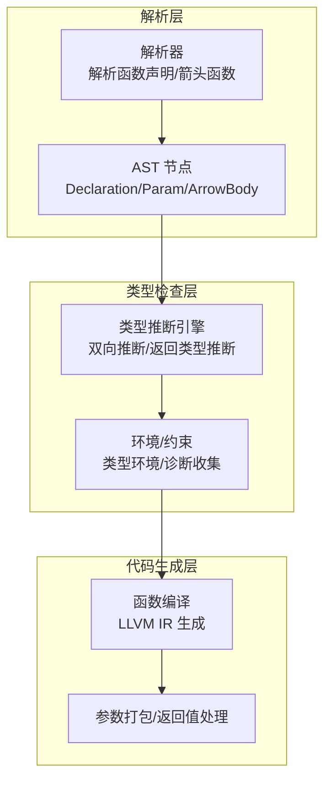
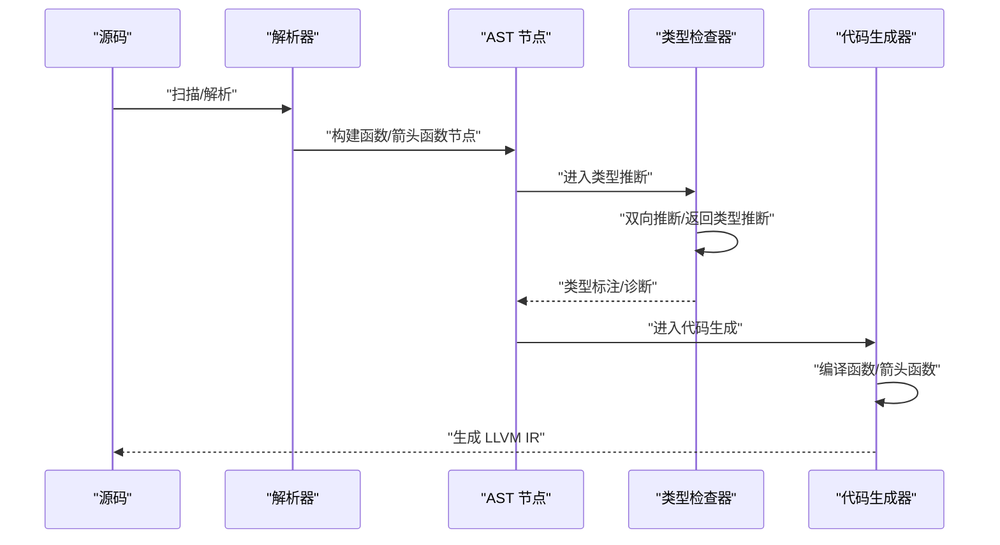
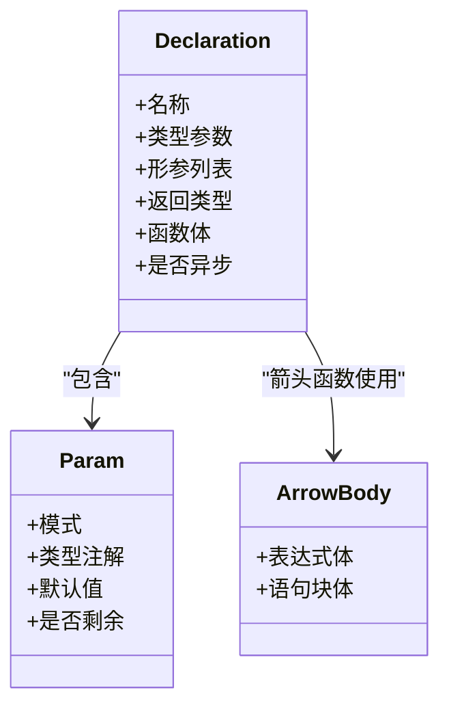
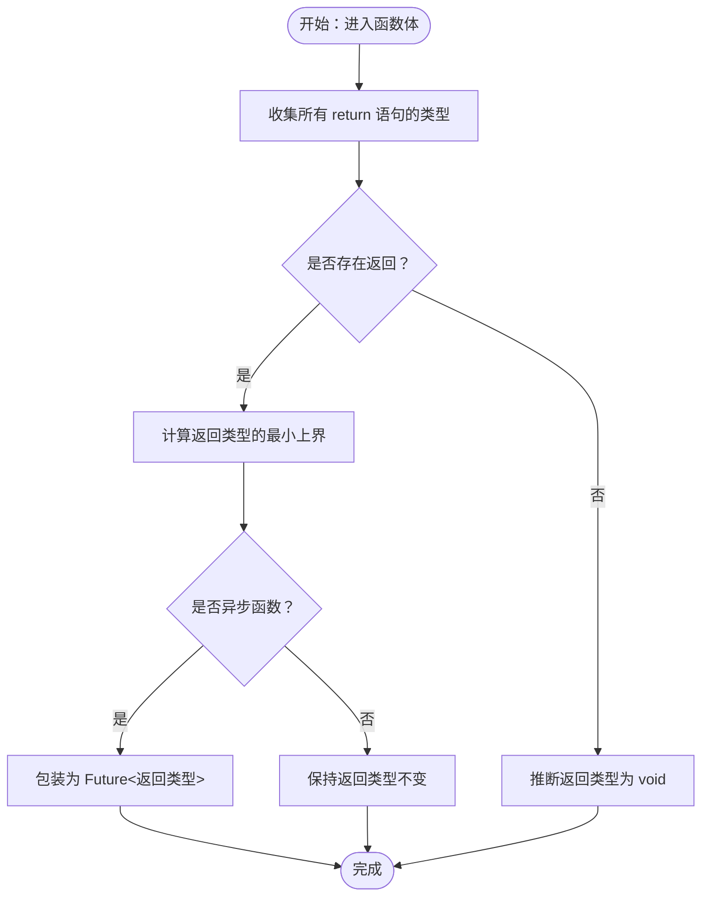
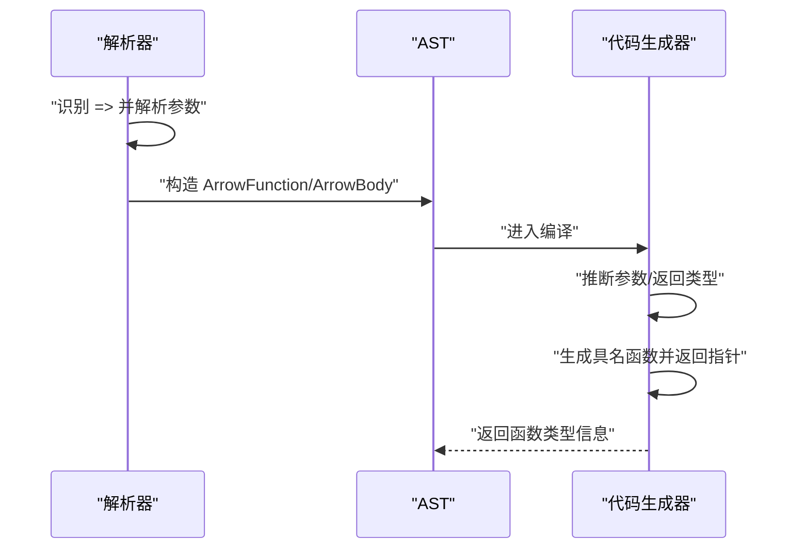
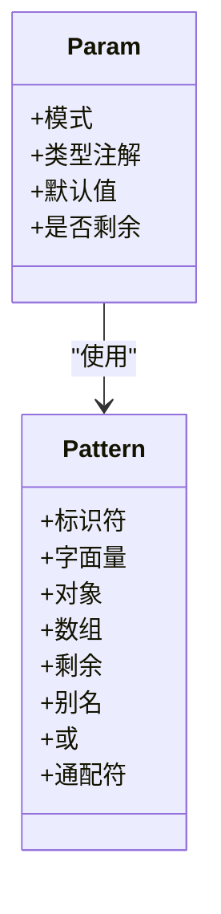
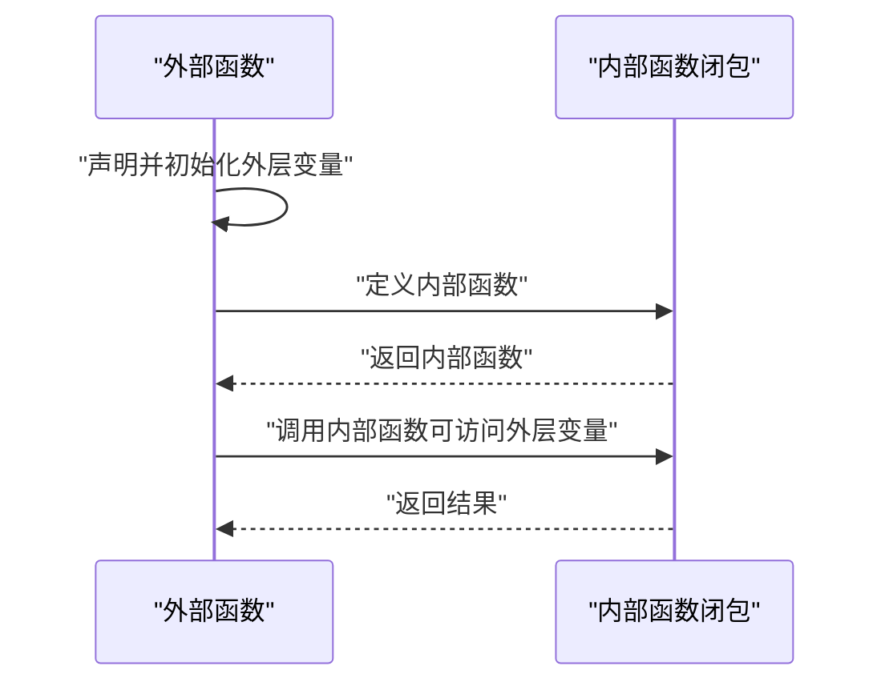
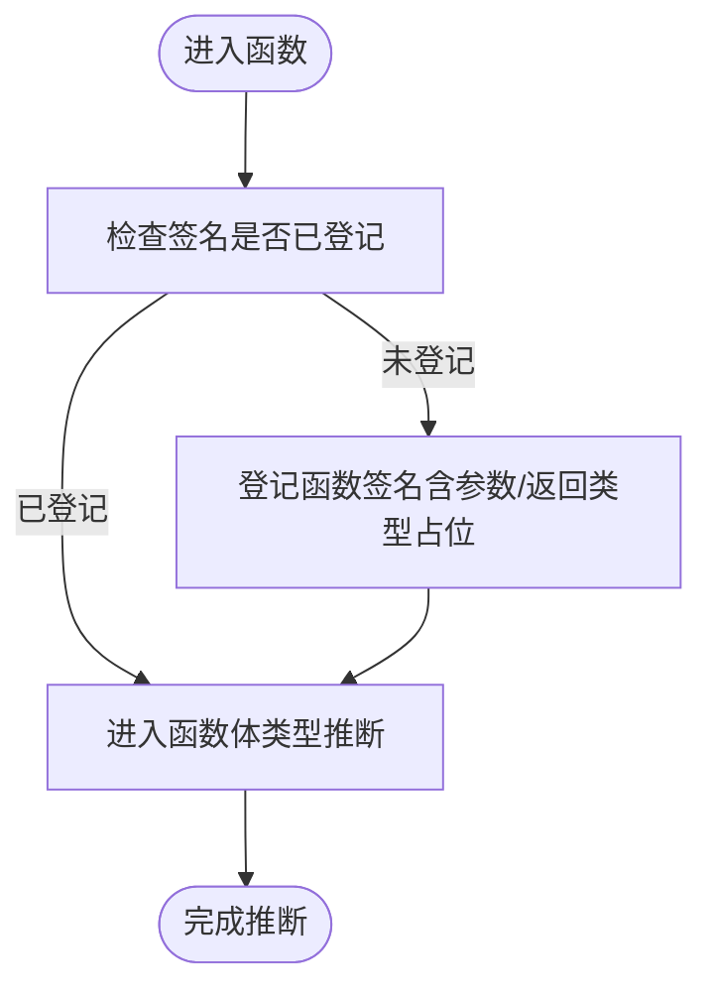

# 函数

<cite>
**本文引用的文件**
- [ast.rs](file://crates/ruyic/src/parser/ast.rs)
- [parser.rs](file://crates/ruyic/src/parser/parser.rs)
- [decl.rs](file://crates/ruyic/src/codegen/decl.rs)
- [expr.rs](file://crates/ruyic/src/codegen/expr.rs)
- [inference.rs](file://crates/ruyic/src/typechecker/inference.rs)
- [checker.rs](file://crates/ruyic/src/typechecker/checker.rs)
- [patterns.rs](file://crates/ruyic/src/typechecker/patterns.rs)
- [functions.ry](file://examples/functions.ry)
- [function_decl.ry](file://crates/ruyic/tests/integration/cases/functions/function_decl.ry)
- [closures.ry](file://crates/ruyic/tests/integration/cases/functions/closures.ry)
- [recursion.ry](file://crates/ruyic/tests/integration/cases/functions/recursion.ry)
</cite>

## 目录
1. [简介](#简介)
2. [项目结构](#项目结构)
3. [核心组件](#核心组件)
4. [架构总览](#架构总览)
5. [详细组件分析](#详细组件分析)
6. [依赖关系分析](#依赖关系分析)
7. [性能考量](#性能考量)
8. [故障排查指南](#故障排查指南)
9. [结论](#结论)
10. [附录](#附录)

## 简介
本章节面向希望掌握 Ruyi 语言函数系统的开发者，系统性地梳理函数声明、箭头函数、参数特性（默认值、剩余参数、参数解构）、返回类型推断、闭包与高阶函数、递归与重载等主题，并通过与 JavaScript 的对比帮助读者快速迁移。

## 项目结构
Ruyi 的函数系统由“词法/语法解析 → 类型检查 → 代码生成”三段流水线构成：
- 解析阶段负责识别函数声明与箭头函数语法，构建抽象语法树（AST）节点。
- 类型检查阶段进行双向推断、返回类型推断、参数类型推断、以及错误诊断。
- 代码生成阶段将函数编译为 LLVM IR，支持默认参数、剩余参数、箭头函数等特性。

图示来源
- [parser.rs:438-464](file://crates/ruyic/src/parser/parser.rs#L438-L464)
- [ast.rs:29-84](file://crates/ruyic/src/parser/ast.rs#L29-L84)
- [inference.rs:105-164](file://crates/ruyic/src/typechecker/inference.rs#L105-L164)
- [decl.rs:143-292](file://crates/ruyic/src/codegen/decl.rs#L143-L292)

章节来源
- [parser.rs:438-464](file://crates/ruyic/src/parser/parser.rs#L438-L464)
- [ast.rs:29-84](file://crates/ruyic/src/parser/ast.rs#L29-L84)
- [inference.rs:105-164](file://crates/ruyic/src/typechecker/inference.rs#L105-L164)
- [decl.rs:143-292](file://crates/ruyic/src/codegen/decl.rs#L143-L292)

## 核心组件
- 函数声明与箭头函数
  - 使用关键字“fn”声明函数；箭头函数支持单表达式与花括号块两种形式。
  - 支持可选的返回类型注解与异步标记。
- 参数系统
  - 形参支持类型注解、默认值、剩余参数（rest）。
  - 参数解构通过模式匹配实现（对象/数组/标识符/通配符等）。
- 返回类型推断
  - 若未显式注解，基于 return 语句与控制流进行推断；无 return 或仅部分分支返回时推断为 void。
- 闭包与高阶函数
  - 内部函数可捕获外层变量；箭头函数在代码生成阶段被编译为具名函数。
- 递归与重载
  - 支持直接递归；重载通过模式匹配与类型系统实现。

章节来源
- [parser.rs:1239-1262](file://crates/ruyic/src/parser/parser.rs#L1239-L1262)
- [parser.rs:2267-2345](file://crates/ruyic/src/parser/parser.rs#L2267-L2345)
- [ast.rs:79-84](file://crates/ruyic/src/parser/ast.rs#L79-L84)
- [inference.rs:224-278](file://crates/ruyic/src/typechecker/inference.rs#L224-L278)
- [expr.rs:376-439](file://crates/ruyic/src/codegen/expr.rs#L376-L439)

## 架构总览
下图展示函数系统在编译期的关键交互：解析器产出 AST，类型检查器进行推断与诊断，代码生成器将函数编译为 LLVM IR。

图示来源
- [parser.rs:438-464](file://crates/ruyic/src/parser/parser.rs#L438-L464)
- [inference.rs:105-164](file://crates/ruyic/src/typechecker/inference.rs#L105-L164)
- [decl.rs:143-292](file://crates/ruyic/src/codegen/decl.rs#L143-L292)

## 详细组件分析

### 函数声明语法与基本要素
- 关键字与结构
  - 使用“fn”关键字声明函数，后接可选的泛型类型参数、形参列表、可选返回类型注解、以及函数体。
  - 支持异步函数标记，最终在类型层面映射为 Future 返回类型。
- 形参列表
  - 每个形参包含：模式（标识符/解构）、可选类型注解、可选默认值、以及是否为剩余参数标记。
- 函数体
  - 由若干语句组成，支持 return 语句用于提前返回；若无 return 或仅部分分支返回，则推断为 void。

图示来源
- [ast.rs:79-84](file://crates/ruyic/src/parser/ast.rs#L79-L84)
- [ast.rs:29-84](file://crates/ruyic/src/parser/ast.rs#L29-L84)

章节来源
- [parser.rs:438-464](file://crates/ruyic/src/parser/parser.rs#L438-L464)
- [ast.rs:29-84](file://crates/ruyic/src/parser/ast.rs#L29-L84)

### 返回类型推断机制
- 显式注解优先
  - 若函数声明中提供了返回类型注解，则以该注解为准。
- 隐式推断策略
  - 在类型检查阶段，先将函数签名入环境，再进入函数体进行双向推断。
  - 基于所有 return 语句的返回类型，计算最小上界（least upper bound），若存在无返回或仅部分分支返回的情况，则推断为 void。
- 异步函数
  - 异步函数的返回类型会被包装为 Future<T>。

图示来源
- [inference.rs:224-278](file://crates/ruyic/src/typechecker/inference.rs#L224-L278)
- [inference.rs:127-140](file://crates/ruyic/src/typechecker/inference.rs#L127-L140)

章节来源
- [inference.rs:224-278](file://crates/ruyic/src/typechecker/inference.rs#L224-L278)
- [inference.rs:127-140](file://crates/ruyic/src/typechecker/inference.rs#L127-L140)

### 箭头函数的简洁语法
- 单表达式箭头函数
  - 形如“(x) => x * 2”，在代码生成阶段被转换为带隐式 return 的函数。
- 带花括号的箭头函数
  - 形如“(x) => { ... }”，函数体为语句块。
- 类型注解与推断
  - 可选的返回类型注解；若省略，将根据表达式体或语句块推断返回类型。
  - 参数类型可通过“Typed Arrow Params”解析路径进行推断（例如“(x: int)”）。

图示来源
- [parser.rs:1239-1262](file://crates/ruyic/src/parser/parser.rs#L1239-L1262)
- [parser.rs:1599-1648](file://crates/ruyic/src/parser/parser.rs#L1599-L1648)
- [parser.rs:2267-2345](file://crates/ruyic/src/parser/parser.rs#L2267-L2345)
- [expr.rs:376-439](file://crates/ruyic/src/codegen/expr.rs#L376-L439)

章节来源
- [parser.rs:1239-1262](file://crates/ruyic/src/parser/parser.rs#L1239-L1262)
- [parser.rs:1599-1648](file://crates/ruyic/src/parser/parser.rs#L1599-L1648)
- [parser.rs:2267-2345](file://crates/ruyic/src/parser/parser.rs#L2267-L2345)
- [expr.rs:376-439](file://crates/ruyic/src/codegen/expr.rs#L376-L439)

### 参数特性：默认值、剩余参数、参数解构
- 默认参数值
  - 形参支持 init 表达式作为默认值；调用时若省略对应实参则使用默认值。
- 剩余参数（rest）
  - 当某形参标记为 is_rest 时，其类型通常为数组类型（元素类型来自注解或推断）；代码生成阶段会注册该参数的“剩余参数”信息以便调用端打包。
- 参数解构
  - 支持对象/数组/标识符/通配符等多种模式；模式分析工具可检测穷尽性与冗余性，辅助写出更健壮的匹配逻辑。

图示来源
- [ast.rs:430-454](file://crates/ruyic/src/parser/ast.rs#L430-L454)
- [ast.rs:79-84](file://crates/ruyic/src/parser/ast.rs#L79-L84)
- [patterns.rs:21-59](file://crates/ruyic/src/typechecker/patterns.rs#L21-L59)

章节来源
- [ast.rs:430-454](file://crates/ruyic/src/parser/ast.rs#L430-L454)
- [ast.rs:79-84](file://crates/ruyic/src/parser/ast.rs#L79-L84)
- [decl.rs:178-192](file://crates/ruyic/src/codegen/decl.rs#L178-L192)
- [patterns.rs:21-59](file://crates/ruyic/src/typechecker/patterns.rs#L21-L59)

### 闭包与高阶函数
- 闭包
  - 函数内部可访问外层作用域中的变量，形成闭包；测试用例展示了闭包捕获与返回内部函数的行为。
- 高阶函数
  - 函数可作为参数传入其他函数，也可作为返回值返回；与闭包配合实现灵活的控制流与数据处理。

图示来源
- [closures.ry:1-17](file://crates/ruyic/tests/integration/cases/functions/closures.ry#L1-L17)
- [decl.rs:143-292](file://crates/ruyic/src/codegen/decl.rs#L143-L292)

章节来源
- [closures.ry:1-17](file://crates/ruyic/tests/integration/cases/functions/closures.ry#L1-L17)
- [decl.rs:143-292](file://crates/ruyic/src/codegen/decl.rs#L143-L292)

### 递归与重载
- 递归
  - 函数可直接调用自身；类型检查阶段先登记函数签名，再进入函数体进行类型推断，从而支持递归。
- 重载
  - 通过模式匹配与类型系统实现“重载式”的多态行为；结合穷举性与冗余性分析，确保匹配完备且无冗余。

图示来源
- [inference.rs:105-164](file://crates/ruyic/src/typechecker/inference.rs#L105-L164)
- [recursion.ry:1-10](file://crates/ruyic/tests/integration/cases/functions/recursion.ry#L1-L10)

章节来源
- [inference.rs:105-164](file://crates/ruyic/src/typechecker/inference.rs#L105-L164)
- [recursion.ry:1-10](file://crates/ruyic/tests/integration/cases/functions/recursion.ry#L1-L10)

### 与 JavaScript 函数系统的差异
- 关键字差异
  - Ruyi 使用“fn”声明函数，而非 JavaScript 的“function”。
- 返回类型注解
  - Ruyi 支持在函数声明中显式注解返回类型；JavaScript 为动态类型，不支持静态返回类型注解。
- 箭头函数
  - 两者均支持箭头函数；Ruyi 的箭头函数在代码生成阶段被编译为具名函数，便于调试与内联优化。
- 类型系统
  - Ruyi 提供渐进式类型系统与双向推断，支持默认参数、剩余参数与参数解构；JavaScript 缺少这些静态能力。
- 异步函数
  - Ruyi 的异步函数返回类型为 Future<T>；JavaScript 的 Promise 是运行时概念，类型层面需额外标注。

章节来源
- [parser.rs:438-464](file://crates/ruyic/src/parser/parser.rs#L438-L464)
- [expr.rs:376-439](file://crates/ruyic/src/codegen/expr.rs#L376-L439)
- [inference.rs:127-140](file://crates/ruyic/src/typechecker/inference.rs#L127-L140)

## 依赖关系分析
- 解析器到 AST
  - 解析器将源码转换为 AST 节点，其中包含函数声明、箭头函数、参数与返回类型注解等信息。
- AST 到类型检查器
  - 类型检查器读取 AST，建立类型环境，执行双向推断与诊断。
- 类型检查器到代码生成器
  - 代码生成器依据类型信息生成 LLVM IR，处理默认参数、剩余参数与箭头函数等细节。

图示来源
- [parser.rs:438-464](file://crates/ruyic/src/parser/parser.rs#L438-L464)
- [inference.rs:105-164](file://crates/ruyic/src/typechecker/inference.rs#L105-L164)
- [decl.rs:143-292](file://crates/ruyic/src/codegen/decl.rs#L143-L292)

章节来源
- [parser.rs:438-464](file://crates/ruyic/src/parser/parser.rs#L438-L464)
- [inference.rs:105-164](file://crates/ruyic/src/typechecker/inference.rs#L105-L164)
- [decl.rs:143-292](file://crates/ruyic/src/codegen/decl.rs#L143-L292)

## 性能考量
- 箭头函数编译
  - 箭头函数在代码生成阶段被编译为具名函数，便于内联与优化；避免了运行时闭包分配的开销。
- 返回类型推断
  - 推断过程在类型检查阶段完成，避免运行时类型检查带来的额外成本。
- 剩余参数打包
  - 代码生成阶段记录剩余参数位置与元素类型，调用端可按需打包，减少不必要的拷贝。

章节来源
- [expr.rs:376-439](file://crates/ruyic/src/codegen/expr.rs#L376-L439)
- [decl.rs:178-192](file://crates/ruyic/src/codegen/decl.rs#L178-L192)

## 故障排查指南
- 未定义变量
  - 类型检查器在查找未知变量时会报告错误；请确认变量名拼写与作用域。
- 类型不匹配
  - 当 return 语句的类型与期望类型不一致时，类型检查器会报告类型不匹配错误；请修正返回值或添加类型注解。
- 箭头函数参数非法
  - 箭头函数参数必须为标识符或合法的序列/分组表达式；否则解析器会报错。
- 匹配不穷尽
  - 模式匹配分析器会检测穷尽性与冗余性；请补充缺失的匹配分支或移除冗余分支。

章节来源
- [inference.rs:467-481](file://crates/ruyic/src/typechecker/inference.rs#L467-L481)
- [parser.rs:2267-2345](file://crates/ruyic/src/parser/parser.rs#L2267-L2345)
- [patterns.rs:21-59](file://crates/ruyic/src/typechecker/patterns.rs#L21-L59)

## 结论
Ruyi 的函数系统在保留函数式编程简洁性的同时，引入了强类型与静态推断能力，使函数声明、箭头函数、参数解构与闭包等特性具备明确的类型语义与高效的编译期优化空间。通过与 JavaScript 的对比，开发者可以清晰把握迁移路径与最佳实践。

## 附录
- 示例参考
  - 函数声明与返回类型推断：[examples/functions.ry:11-37](file://examples/functions.ry#L11-L37)
  - 箭头函数与默认参数：[examples/functions.ry:42-78](file://examples/functions.ry#L42-L78)
  - 闭包与高阶函数：[closures.ry:1-17](file://crates/ruyic/tests/integration/cases/functions/closures.ry#L1-L17)
  - 递归：[recursion.ry:1-10](file://crates/ruyic/tests/integration/cases/functions/recursion.ry#L1-L10)
  - 基础函数调用示例：[function_decl.ry:1-15](file://crates/ruyic/tests/integration/cases/functions/function_decl.ry#L1-L15)