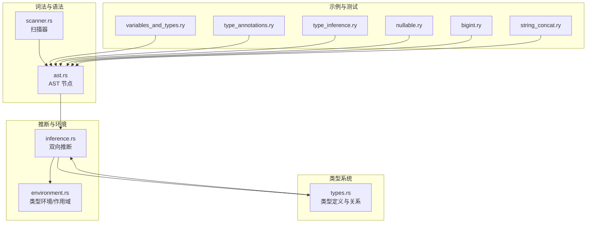
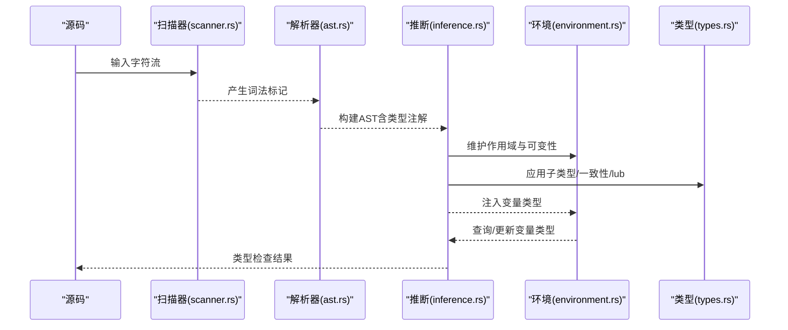
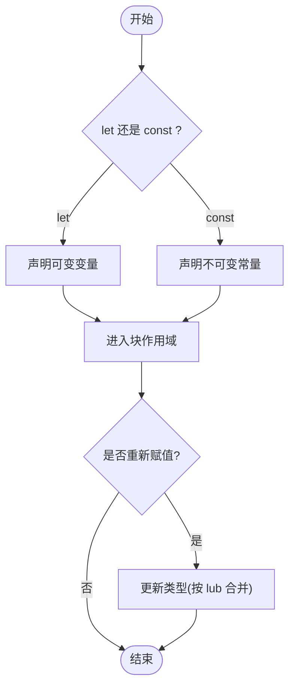
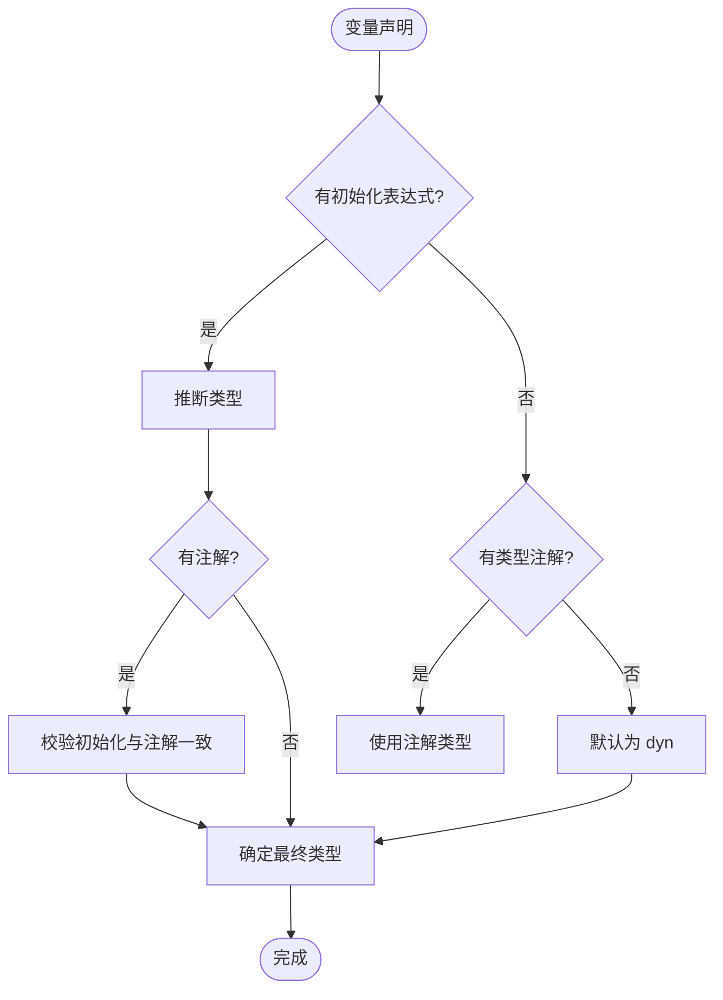
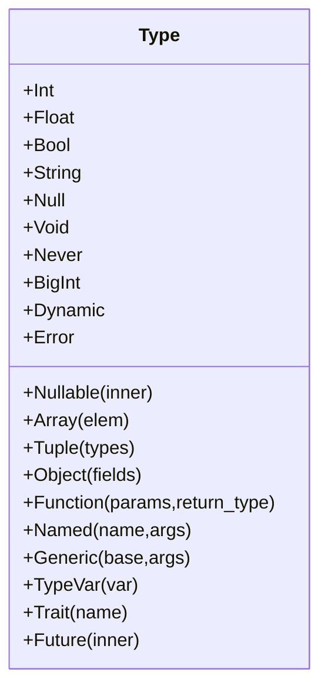
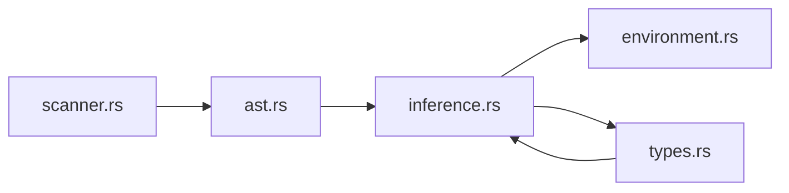

# 变量与类型

<cite>
**本文引用的文件**
- [variables_and_types.ry](file://examples/variables_and_types.ry)
- [types.rs](file://crates/ruyic/src/typechecker/types.rs)
- [ast.rs](file://crates/ruyic/src/parser/ast.rs)
- [inference.rs](file://crates/ruyic/src/typechecker/inference.rs)
- [environment.rs](file://crates/ruyic/src/typechecker/environment.rs)
- [scanner.rs](file://crates/ruyic/src/lexer/scanner.rs)
- [bigint.ry](file://crates/ruyic/tests/integration/cases/codegen/bigint.ry)
- [string_concat.ry](file://crates/ruyic/tests/integration/cases/codegen/string_concat.ry)
- [type_annotations.ry](file://crates/ruyic/tests/integration/cases/types/type_annotations.ry)
- [type_inference.ry](file://crates/ruyic/tests/integration/cases/types/type_inference.ry)
- [variables.ry](file://crates/ruyic/tests/integration/cases/basic/variables.ry)
- [variables.expected](file://crates/ruyic/tests/integration/cases/basic/variables.expected)
- [nullable.ry](file://crates/ruyic/tests/integration/cases/types/nullable.ry)
</cite>

## 目录
1. [简介](#简介)
2. [项目结构](#项目结构)
3. [核心组件](#核心组件)
4. [架构总览](#架构总览)
5. [详细组件分析](#详细组件分析)
6. [依赖关系分析](#依赖关系分析)
7. [性能考量](#性能考量)
8. [故障排查指南](#故障排查指南)
9. [结论](#结论)
10. [附录](#附录)

## 简介
本文件面向初学者与进阶用户，系统化梳理 Ruyi 语言的变量与类型系统语法与实现要点，涵盖：
- let 与 const 的区别、可变性与块级作用域
- 内置数据类型：int、float、bool、string、null、void、dyn
- 类型注解语法与类型推断机制
- 数值字面量（十进制、十六进制、八进制、二进制、BigInt）
- 字符串字面量（双引号、单引号、模板字面量与转义）
- 实际示例路径与常见问题定位

## 项目结构
围绕变量与类型系统的关键代码分布在以下模块：
- 词法与语法层：扫描器负责识别字面量与操作符；解析器生成 AST 节点（含类型注解）
- 类型系统层：定义核心类型、子类型关系、一致性判断、最小上界（lub）等
- 推断与环境层：双向类型推断、作用域与可变性追踪
- 示例与测试：演示变量声明、类型注解、类型推断、可空类型与字面量用法

图表来源
- [scanner.rs:1-200](file://crates/ruyic/src/lexer/scanner.rs#L1-L200)
- [ast.rs:1-533](file://crates/ruyic/src/parser/ast.rs#L1-L533)
- [types.rs:1-711](file://crates/ruyic/src/typechecker/types.rs#L1-L711)
- [inference.rs:1-200](file://crates/ruyic/src/typechecker/inference.rs#L1-L200)
- [environment.rs:1-200](file://crates/ruyic/src/typechecker/environment.rs#L1-L200)
- [variables_and_types.ry:1-183](file://examples/variables_and_types.ry#L1-L183)
- [type_annotations.ry:1-9](file://crates/ruyic/tests/integration/cases/types/type_annotations.ry#L1-L9)
- [type_inference.ry:1-15](file://crates/ruyic/tests/integration/cases/types/type_inference.ry#L1-L15)
- [nullable.ry:1-13](file://crates/ruyic/tests/integration/cases/types/nullable.ry#L1-L13)
- [bigint.ry:1-2](file://crates/ruyic/tests/integration/cases/codegen/bigint.ry#L1-L2)
- [string_concat.ry:1-6](file://crates/ruyic/tests/integration/cases/codegen/string_concat.ry#L1-L6)

章节来源
- [scanner.rs:1-200](file://crates/ruyic/src/lexer/scanner.rs#L1-L200)
- [ast.rs:1-533](file://crates/ruyic/src/parser/ast.rs#L1-L533)
- [types.rs:1-711](file://crates/ruyic/src/typechecker/types.rs#L1-L711)
- [inference.rs:1-200](file://crates/ruyic/src/typechecker/inference.rs#L1-L200)
- [environment.rs:1-200](file://crates/ruyic/src/typechecker/environment.rs#L1-L200)
- [variables_and_types.ry:1-183](file://examples/variables_and_types.ry#L1-L183)

## 核心组件
- 类型系统与注解
  - 支持的内置类型：int、float、bool、string、null、void、never、bigint、dyn
  - 类型注解语法：支持标识符、函数类型、泛型、对象、数组、元组、可空类型、动态类型（dyn）
  - 子类型与一致性：int ⊆ float；T ⊆ T?；dyn 与一切类型一致；lub 计算规则覆盖基本类型、可空、元组等
- 变量声明与作用域
  - let 声明可变绑定；const 声明不可变绑定
  - 块级作用域：进入新块创建新作用域，退出时丢弃该作用域内绑定
  - 变量更新：仅可变变量允许重新赋值，且类型按 lub 合并
- 字面量与操作符
  - 数值：十进制、负数、科学计数法、十六进制、八进制、二进制、BigInt（以后缀 n）
  - 字符串：双引号、单引号、模板字面量（反引号），支持转义序列
  - 操作符：算术、比较、逻辑、空值合并（??）、幂运算（**）

章节来源
- [types.rs:14-60](file://crates/ruyic/src/typechecker/types.rs#L14-L60)
- [ast.rs:458-475](file://crates/ruyic/src/parser/ast.rs#L458-L475)
- [inference.rs:180-200](file://crates/ruyic/src/typechecker/inference.rs#L180-L200)
- [environment.rs:63-93](file://crates/ruyic/src/typechecker/environment.rs#L63-L93)
- [scanner.rs:64-71](file://crates/ruyic/src/lexer/scanner.rs#L64-L71)

## 架构总览
从源码到运行时的处理流程如下：

图表来源
- [scanner.rs:25-71](file://crates/ruyic/src/lexer/scanner.rs#L25-L71)
- [ast.rs:13-24](file://crates/ruyic/src/parser/ast.rs#L13-L24)
- [inference.rs:105-164](file://crates/ruyic/src/typechecker/inference.rs#L105-L164)
- [environment.rs:55-103](file://crates/ruyic/src/typechecker/environment.rs#L55-L103)
- [types.rs:151-383](file://crates/ruyic/src/typechecker/types.rs#L151-L383)

## 详细组件分析

### 1) 变量声明：let 与 const、块级作用域
- let 声明可变变量；const 声明不可变常量
- 块级作用域：在花括号中声明的变量仅在该块内可见
- 重赋值：仅可变变量允许更新；更新时类型按 lub 合并
- 示例路径
  - [variables_and_types.ry:27-37](file://examples/variables_and_types.ry#L27-L37)
  - [variables_and_types.ry:155-165](file://examples/variables_and_types.ry#L155-L165)
  - [variables.ry:11-17](file://crates/ruyic/tests/integration/cases/basic/variables.ry#L11-L17)

图表来源
- [inference.rs:180-200](file://crates/ruyic/src/typechecker/inference.rs#L180-L200)
- [environment.rs:63-93](file://crates/ruyic/src/typechecker/environment.rs#L63-L93)
- [environment.rs:134-147](file://crates/ruyic/src/typechecker/environment.rs#L134-L147)

章节来源
- [inference.rs:180-200](file://crates/ruyic/src/typechecker/inference.rs#L180-L200)
- [environment.rs:63-93](file://crates/ruyic/src/typechecker/environment.rs#L63-L93)
- [environment.rs:134-147](file://crates/ruyic/src/typechecker/environment.rs#L134-L147)
- [variables_and_types.ry:27-37](file://examples/variables_and_types.ry#L27-L37)
- [variables_and_types.ry:155-165](file://examples/variables_and_types.ry#L155-L165)
- [variables.ry:11-17](file://crates/ruyic/tests/integration/cases/basic/variables.ry#L11-L17)

### 2) 类型注解与类型推断
- 显式类型注解：在变量或参数后使用冒号指定类型
- 类型推断：未显式注解时，根据初始化表达式的类型进行推断；若既无注解也无初始化，默认为 dyn
- 示例路径
  - [type_annotations.ry:1-9](file://crates/ruyic/tests/integration/cases/types/type_annotations.ry#L1-L9)
  - [type_inference.ry:1-15](file://crates/ruyic/tests/integration/cases/types/type_inference.ry#L1-L15)
  - [variables_and_types.ry:45-51](file://examples/variables_and_types.ry#L45-L51)

图表来源
- [inference.rs:184-198](file://crates/ruyic/src/typechecker/inference.rs#L184-L198)
- [types.rs:395-464](file://crates/ruyic/src/typechecker/types.rs#L395-L464)

章节来源
- [type_annotations.ry:1-9](file://crates/ruyic/tests/integration/cases/types/type_annotations.ry#L1-L9)
- [type_inference.ry:1-15](file://crates/ruyic/tests/integration/cases/types/type_inference.ry#L1-L15)
- [variables_and_types.ry:45-51](file://examples/variables_and_types.ry#L45-L51)
- [inference.rs:184-198](file://crates/ruyic/src/typechecker/inference.rs#L184-L198)
- [types.rs:395-464](file://crates/ruyic/src/typechecker/types.rs#L395-L464)

### 3) 内置数据类型与可空类型
- 基础类型：int、float、bool、string、null、void、never、bigint、dyn
- 可空类型：T? 表示 T ∪ null；支持可空折叠与 lub 规则
- 动态类型：dyn 在渐进类型系统中与任何类型一致，用于动态检查
- 示例路径
  - [types.rs:14-60](file://crates/ruyic/src/typechecker/types.rs#L14-L60)
  - [nullable.ry:1-13](file://crates/ruyic/tests/integration/cases/types/nullable.ry#L1-L13)

图表来源
- [types.rs:14-60](file://crates/ruyic/src/typechecker/types.rs#L14-L60)

章节来源
- [types.rs:14-60](file://crates/ruyic/src/typechecker/types.rs#L14-L60)
- [types.rs:151-383](file://crates/ruyic/src/typechecker/types.rs#L151-L383)
- [nullable.ry:1-13](file://crates/ruyic/tests/integration/cases/types/nullable.ry#L1-L13)

### 4) 数值字面量与 BigInt
- 支持十进制、负数、科学计数法、十六进制（0x前缀）、八进制（0o前缀）、二进制（0b前缀）
- BigInt 使用后缀 n（如 100n）
- 示例路径
  - [variables_and_types.ry:54-62](file://examples/variables_and_types.ry#L54-L62)
  - [bigint.ry:1-2](file://crates/ruyic/tests/integration/cases/codegen/bigint.ry#L1-L2)
  - [scanner.rs:64-64](file://crates/ruyic/src/lexer/scanner.rs#L64-L64)

章节来源
- [variables_and_types.ry:54-62](file://examples/variables_and_types.ry#L54-L62)
- [bigint.ry:1-2](file://crates/ruyic/tests/integration/cases/codegen/bigint.ry#L1-L2)
- [scanner.rs:64-64](file://crates/ruyic/src/lexer/scanner.rs#L64-L64)

### 5) 字符串字面量与模板字面量
- 字符串字面量：双引号与单引号均可；支持转义序列
- 模板字面量：反引号包裹，支持 ${...} 插值
- 字符串拼接：支持与数字类型拼接
- 示例路径
  - [variables_and_types.ry:78-88](file://examples/variables_and_types.ry#L78-L88)
  - [string_concat.ry:1-6](file://crates/ruyic/tests/integration/cases/codegen/string_concat.ry#L1-L6)
  - [scanner.rs:65-71](file://crates/ruyic/src/lexer/scanner.rs#L65-L71)

章节来源
- [variables_and_types.ry:78-88](file://examples/variables_and_types.ry#L78-L88)
- [string_concat.ry:1-6](file://crates/ruyic/tests/integration/cases/codegen/string_concat.ry#L1-L6)
- [scanner.rs:65-71](file://crates/ruyic/src/lexer/scanner.rs#L65-L71)

### 6) 操作符与空值合并
- 算术：+、-、*、/、%、**（幂运算）
- 比较：===、!==、<、>、<=、>=
- 逻辑：&&、||、!
- 空值合并：??（当左侧为 null/undefined 时取右侧）
- 示例路径
  - [variables_and_types.ry:90-144](file://examples/variables_and_types.ry#L90-L144)
  - [variables_and_types.ry:146-153](file://examples/variables_and_types.ry#L146-L153)

章节来源
- [variables_and_types.ry:90-144](file://examples/variables_and_types.ry#L90-L144)
- [variables_and_types.ry:146-153](file://examples/variables_and_types.ry#L146-L153)

## 依赖关系分析
- 词法层依赖：扫描器负责识别数字、字符串、模板字面量与操作符，为解析器提供准确的词法标记
- 解析层依赖：AST 节点包含类型注解结构，供类型系统转换为内部类型表示
- 类型层依赖：类型系统为推断与环境提供子类型、一致性与 lub 等判定能力
- 推断层依赖：双向推断在合成模式与检查模式之间切换，结合环境维护变量可变性与作用域

图表来源
- [scanner.rs:25-71](file://crates/ruyic/src/lexer/scanner.rs#L25-L71)
- [ast.rs:13-24](file://crates/ruyic/src/parser/ast.rs#L13-L24)
- [inference.rs:105-164](file://crates/ruyic/src/typechecker/inference.rs#L105-L164)
- [environment.rs:55-103](file://crates/ruyic/src/typechecker/environment.rs#L55-L103)
- [types.rs:151-383](file://crates/ruyic/src/typechecker/types.rs#L151-L383)

章节来源
- [scanner.rs:25-71](file://crates/ruyic/src/lexer/scanner.rs#L25-L71)
- [ast.rs:13-24](file://crates/ruyic/src/parser/ast.rs#L13-L24)
- [inference.rs:105-164](file://crates/ruyic/src/typechecker/inference.rs#L105-L164)
- [environment.rs:55-103](file://crates/ruyic/src/typechecker/environment.rs#L55-L103)
- [types.rs:151-383](file://crates/ruyic/src/typechecker/types.rs#L151-L383)

## 性能考量
- 类型推断采用双向推断策略，先收集函数签名以支持前向引用，再进行全程序推断，避免重复扫描
- 环境使用栈式作用域，查找与更新均为 O(k)（k 为当前作用域深度），通常较小
- 最小上界（lub）与子类型判定在常见类型组合上为常数时间，复杂度主要受对象/元组字段数量影响
- 建议在大型项目中尽量提供类型注解，减少推断开销并提升诊断准确性

## 故障排查指南
- 变量不可变错误：尝试给 const 声明的变量重新赋值会触发类型错误
  - 定位参考：环境更新逻辑与可变性检查
  - 参考路径：[environment.rs:134-147](file://crates/ruyic/src/typechecker/environment.rs#L134-L147)
- 未初始化变量默认为 dyn：若后续与其他类型混合使用，可能触发一致性或 lub 错误
  - 参考路径：[inference.rs:196-198](file://crates/ruyic/src/typechecker/inference.rs#L196-L198)
- 模板字面量未闭合：反引号未正确闭合会报错
  - 参考路径：[scanner.rs:34-40](file://crates/ruyic/src/lexer/scanner.rs#L34-L40)
- 可空类型误用：未处理 null 导致的运行时错误，建议使用 ?? 或非空断言
  - 参考路径：[nullable.ry:1-13](file://crates/ruyic/tests/integration/cases/types/nullable.ry#L1-L13)

章节来源
- [environment.rs:134-147](file://crates/ruyic/src/typechecker/environment.rs#L134-L147)
- [inference.rs:196-198](file://crates/ruyic/src/typechecker/inference.rs#L196-L198)
- [scanner.rs:34-40](file://crates/ruyic/src/lexer/scanner.rs#L34-L40)
- [nullable.ry:1-13](file://crates/ruyic/tests/integration/cases/types/nullable.ry#L1-L13)

## 结论
Ruyi 的变量与类型系统以渐进类型为核心，结合显式注解与类型推断，在保证灵活性的同时提供强健的静态约束。let/const 与块级作用域使变量生命周期与可变性清晰可控；丰富的内置类型与可空/动态类型满足工程实践需求；字面量与操作符覆盖常见数值与字符串处理场景。建议在团队协作中优先使用类型注解，配合工具链尽早发现潜在问题。

## 附录
- 快速示例索引
  - 变量与作用域：[variables_and_types.ry:27-37](file://examples/variables_and_types.ry#L27-L37)、[variables.ry:11-17](file://crates/ruyic/tests/integration/cases/basic/variables.ry#L11-L17)
  - 类型注解：[type_annotations.ry:1-9](file://crates/ruyic/tests/integration/cases/types/type_annotations.ry#L1-L9)
  - 类型推断：[type_inference.ry:1-15](file://crates/ruyic/tests/integration/cases/types/type_inference.ry#L1-L15)
  - 可空类型与空值合并：[nullable.ry:1-13](file://crates/ruyic/tests/integration/cases/types/nullable.ry#L1-L13)
  - 数值字面量与 BigInt：[variables_and_types.ry:54-62](file://examples/variables_and_types.ry#L54-L62)、[bigint.ry:1-2](file://crates/ruyic/tests/integration/cases/codegen/bigint.ry#L1-L2)
  - 字符串与模板字面量：[variables_and_types.ry:78-88](file://examples/variables_and_types.ry#L78-L88)、[string_concat.ry:1-6](file://crates/ruyic/tests/integration/cases/codegen/string_concat.ry#L1-L6)