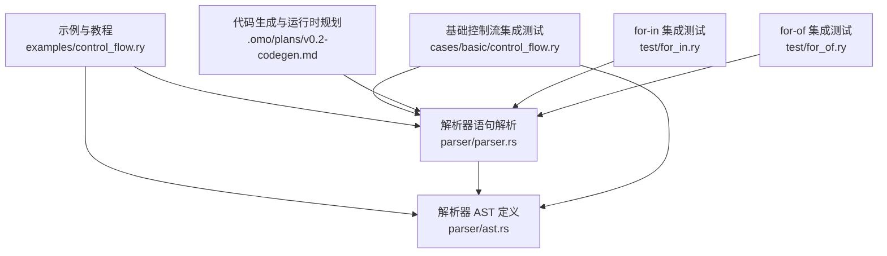
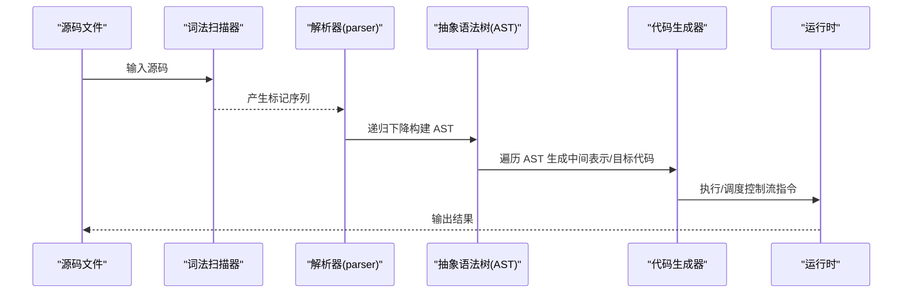
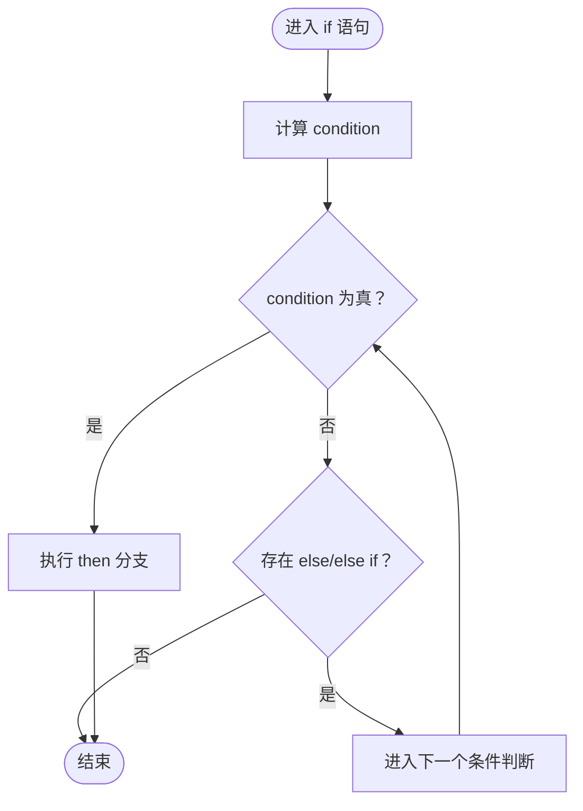
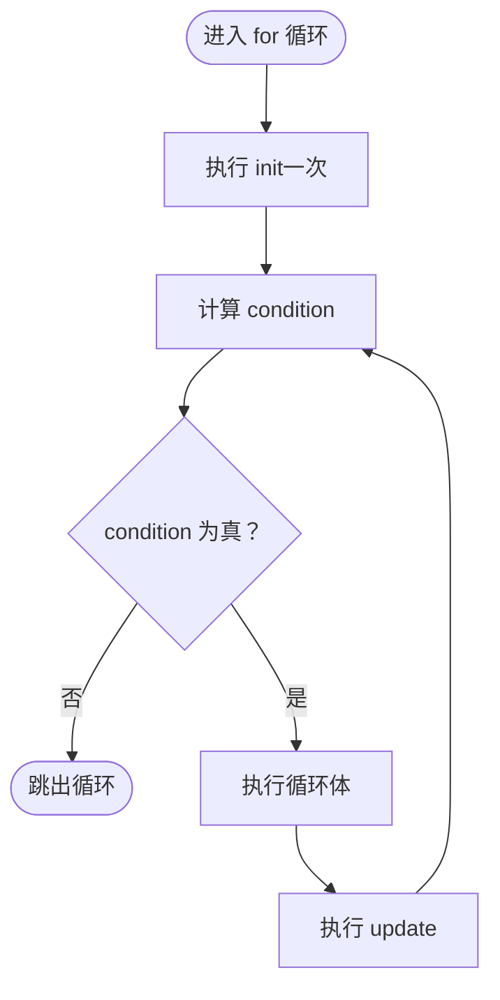
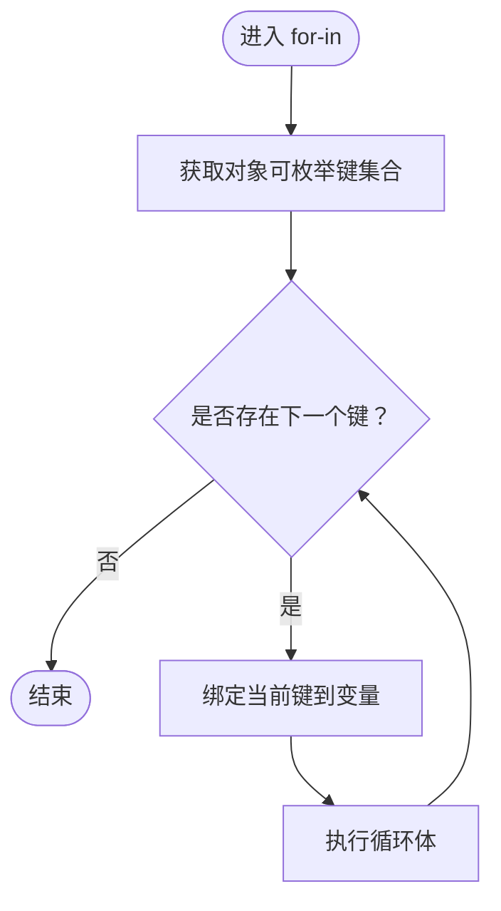
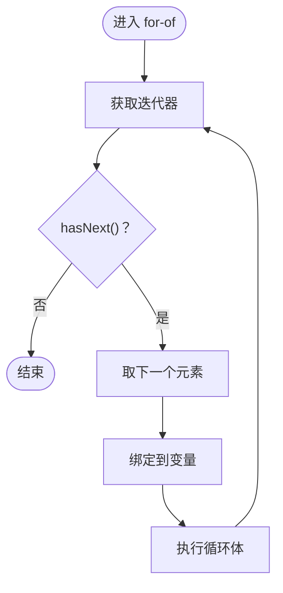
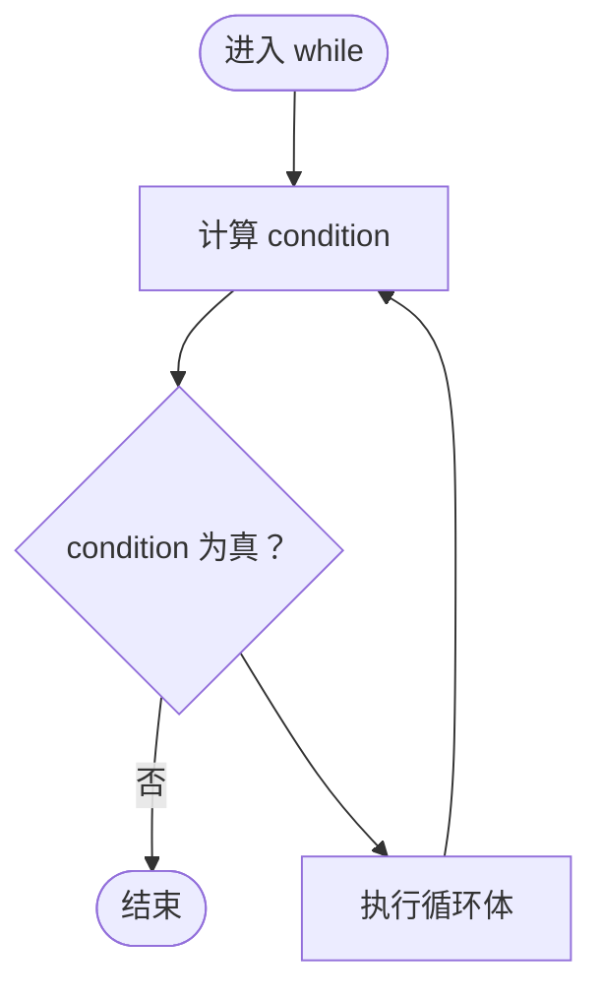
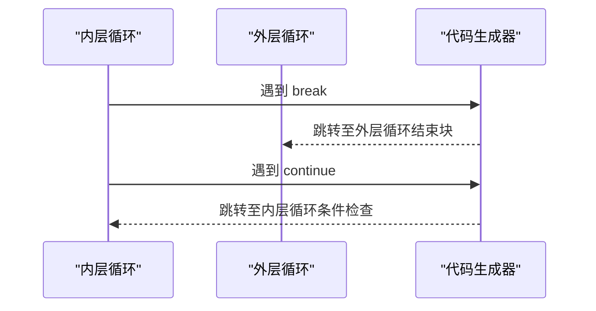
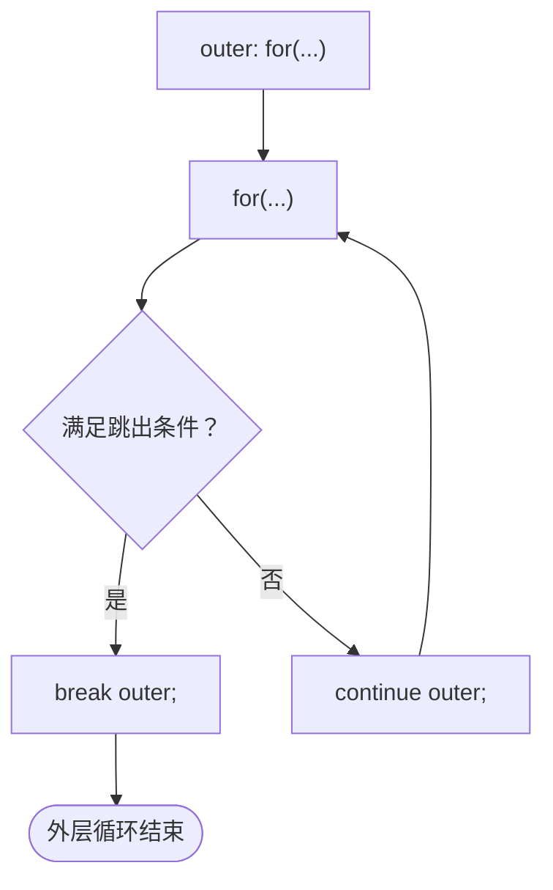

# 控制流

<cite>
**本文引用的文件**
- [examples/control_flow.ry](file://examples/control_flow.ry)
- [crates/ruyic/src/parser/ast.rs](file://crates/ruyic/src/parser/ast.rs)
- [crates/ruyic/src/parser/parser.rs](file://crates/ruyic/src/parser/parser.rs)
- [crates/ruyic/tests/integration/cases/basic/control_flow.ry](file://crates/ruyic/tests/integration/cases/basic/control_flow.ry)
- [crates/ruyic/tests/integration/cases/basic/control_flow.expected](file://crates/ruyic/tests/integration/cases/basic/control_flow.expected)
- [crates/ruyic/tests/integration/cases/codegen/if_statement.ry](file://crates/ruyic/tests/integration/cases/codegen/if_statement.ry)
- [crates/ruyic/tests/integration/cases/codegen/for_loop.ry](file://crates/ruyic/tests/integration/cases/codegen/for_loop.ry)
- [crates/ruyic/tests/integration/cases/codegen/while_loop.ry](file://crates/ruyic/tests/integration/cases/codegen/while_loop.ry)
- [crates/ruyic/tests/integration/cases/control_flow/if_else.ry](file://crates/ruyic/tests/integration/cases/control_flow/if_else.ry)
- [crates/ruyic/tests/integration/cases/control_flow/loops.ry](file://crates/ruyic/tests/integration/cases/control_flow/loops.ry)
- [crates/ruyic/tests/integration/cases/control_flow/break_for.ry](file://crates/ruyic/tests/integration/cases/control_flow/break_for.ry)
- [crates/ruyic/tests/integration/cases/control_flow/continue_while.ry](file://crates/ruyic/tests/integration/cases/control_flow/continue_while.ry)
- [test/for_in.ry](file://test/for_in.ry)
- [test/for_of.ry](file://test/for_of.ry)
- [test/for_of.expected](file://test/for_of.expected)
- [.omo/plans/v0.2-codegen.md](file://.omo/plans/v0.2-codegen.md)
- [crates/ruyic/tests/parser.rs](file://crates/ruyic/tests/parser.rs)
</cite>

## 目录
1. [简介](#简介)
2. [项目结构](#项目结构)
3. [核心组件](#核心组件)
4. [架构总览](#架构总览)
5. [详细组件分析](#详细组件分析)
6. [依赖关系分析](#依赖关系分析)
7. [性能考量](#性能考量)
8. [故障排查指南](#故障排查指南)
9. [结论](#结论)
10. [附录](#附录)

## 简介
本篇文档系统梳理 Ruyi 语言的控制流语法与行为，覆盖以下主题：
- 条件分支：if/else 及其作为表达式的能力（通过早期返回模拟）
- 循环结构：C 风格 for 循环、for-in 遍历对象键、for-of 迭代可迭代对象、while 循环
- 跳转控制：break、continue；以及带标签的 break/continue（用于多层循环跳转）
- 实战示例：来自仓库中的示例与集成测试用例路径
- 与 JavaScript 的差异：严格布尔类型检查、无 truthy/falsy 概念

本篇力求对初学者友好，同时提供足够的技术细节与溯源。

## 项目结构
与控制流相关的核心位置：
- 示例与教程：examples/control_flow.ry
- 解析器 AST 定义：crates/ruyic/src/parser/ast.rs
- 解析器语句解析：crates/ruyic/src/parser/parser.rs
- 基础控制流集成测试：crates/ruyic/tests/integration/cases/basic/control_flow.ry
- 代码生成与运行时行为参考：.omo/plans/v0.2-codegen.md
- 单元测试（验证解析树）：crates/ruyic/tests/parser.rs
- for-in / for-of 集成测试：test/for_in.ry、test/for_of.ry 及其期望输出

图表来源
- [examples/control_flow.ry:1-160](file://examples/control_flow.ry#L1-L160)
- [crates/ruyic/src/parser/ast.rs:94-155](file://crates/ruyic/src/parser/ast.rs#L94-L155)
- [crates/ruyic/src/parser/parser.rs:825-1190](file://crates/ruyic/src/parser/parser.rs#L825-L1190)
- [test/for_in.ry:1-24](file://test/for_in.ry#L1-L24)
- [test/for_of.ry:1-20](file://test/for_of.ry#L1-L20)

章节来源
- [examples/control_flow.ry:1-160](file://examples/control_flow.ry#L1-L160)
- [crates/ruyic/src/parser/ast.rs:94-155](file://crates/ruyic/src/parser/ast.rs#L94-L155)
- [crates/ruyic/src/parser/parser.rs:825-1190](file://crates/ruyic/src/parser/parser.rs#L825-L1190)

## 核心组件
- 条件语句：Statement::If、Statement::IfLet
- 循环语句：Statement::For、Statement::ForIn、Statement::ForOf、Statement::While、Statement::WhileLet
- 跳转控制：Statement::Break、Statement::Continue
- 标签化语句：Statement::Labeled
- 表达式形态：Expr::If（三元形态）

这些节点在 AST 中以枚举形式定义，解析器负责将词法单元转换为对应的 AST 结点。

章节来源
- [crates/ruyic/src/parser/ast.rs:94-155](file://crates/ruyic/src/parser/ast.rs#L94-L155)
- [crates/ruyic/src/parser/ast.rs:179-268](file://crates/ruyic/src/parser/ast.rs#L179-L268)

## 架构总览
从“词法/语法”到“语义/执行”的整体流程如下：

图表来源
- [crates/ruyic/src/parser/parser.rs:825-1190](file://crates/ruyic/src/parser/parser.rs#L825-L1190)
- [crates/ruyic/src/parser/ast.rs:94-155](file://crates/ruyic/src/parser/ast.rs#L94-L155)
- [.omo/plans/v0.2-codegen.md:1346-1410](file://.omo/plans/v0.2-codegen.md#L1346-L1410)

## 详细组件分析

### if/else 条件语句
- 语法要点
  - 支持 if/else if/else 多分支链
  - if 也可作为表达式使用（在 Ruyi 中通过“早期返回”模式模拟表达式语义）
- AST 结构
  - Statement::If：包含 condition、then_branch、else_branch
  - Expr::If：三元表达式形态（condition ? then : else）
- 示例与测试
  - 教程示例：examples/control_flow.ry 中的分类函数与标签化 if
  - 集成测试：cases/control_flow/if_else.ry 展示了多种分支场景
  - 基础测试：cases/basic/control_flow.ry 同时覆盖 if/else 与 while
  - 代码生成：codegen/if_statement.ry 验证 if/else 的编译与执行

图表来源
- [crates/ruyic/src/parser/ast.rs:98-108](file://crates/ruyic/src/parser/ast.rs#L98-L108)
- [crates/ruyic/src/parser/ast.rs:260-264](file://crates/ruyic/src/parser/ast.rs#L260-L264)

章节来源
- [examples/control_flow.ry:11-32](file://examples/control_flow.ry#L11-L32)
- [crates/ruyic/tests/integration/cases/control_flow/if_else.ry:1-27](file://crates/ruyic/tests/integration/cases/control_flow/if_else.ry#L1-L27)
- [crates/ruyic/tests/integration/cases/basic/control_flow.ry:3-16](file://crates/ruyic/tests/integration/cases/basic/control_flow.ry#L3-L16)
- [crates/ruyic/tests/integration/cases/codegen/if_statement.ry:1-5](file://crates/ruyic/tests/integration/cases/codegen/if_statement.ry#L1-L5)

### C 风格 for 循环
- 语法要点
  - 形如 for (init; condition; update) body
  - init/condition/update 均可省略，支持无限循环
  - 支持局部变量声明（let/const）作为 init
- AST 结构
  - Statement::For：包含 init（ForInit::VarDecl 或 ForInit::Expr）、condition、update、body
- 示例与测试
  - 教程示例：examples/control_flow.ry 提供正向与反向遍历
  - 代码生成：cases/codegen/for_loop.ry 展示累加与阶乘等典型用途
  - 基础测试：cases/basic/control_flow.ry 含 for 循环求和
  - 单元测试：tests/parser.rs 验证 for 的 init/condition/update 解析

图表来源
- [crates/ruyic/src/parser/ast.rs:118-123](file://crates/ruyic/src/parser/ast.rs#L118-L123)
- [crates/ruyic/src/parser/parser.rs:966-995](file://crates/ruyic/src/parser/parser.rs#L966-L995)

章节来源
- [examples/control_flow.ry:37-52](file://examples/control_flow.ry#L37-L52)
- [crates/ruyic/tests/integration/cases/codegen/for_loop.ry:1-12](file://crates/ruyic/tests/integration/cases/codegen/for_loop.ry#L1-L12)
- [crates/ruyic/tests/integration/cases/basic/control_flow.ry:24-27](file://crates/ruyic/tests/integration/cases/basic/control_flow.ry#L24-L27)
- [crates/ruyic/tests/parser.rs:686-724](file://crates/ruyic/tests/parser.rs#L686-L724)

### for-in：遍历对象键
- 语法要点
  - for (let key in obj) 遍历对象的所有自有可枚举键
  - 对空对象不产生输出
  - 支持嵌套循环
- 示例与测试
  - test/for_in.ry 展示基本用法、空对象与嵌套循环
  - 该结构在 AST 中对应 Statement::ForIn

图表来源
- [crates/ruyic/src/parser/ast.rs:124-128](file://crates/ruyic/src/parser/ast.rs#L124-L128)
- [test/for_in.ry:5-24](file://test/for_in.ry#L5-L24)

章节来源
- [test/for_in.ry:1-24](file://test/for_in.ry#L1-L24)

### for-of：迭代可迭代对象
- 语法要点
  - for (let item of iterable) 遍历可迭代对象的元素
  - 支持数组与字符串等常见可迭代类型
  - 空集合不产生输出
- 示例与测试
  - test/for_of.ry 展示数组与字符串迭代
  - test/for_of.expected 给出预期输出顺序
  - 该结构在 AST 中对应 Statement::ForOf

图表来源
- [crates/ruyic/src/parser/ast.rs:129-134](file://crates/ruyic/src/parser/ast.rs#L129-L134)
- [test/for_of.ry:5-20](file://test/for_of.ry#L5-L20)
- [test/for_of.expected:1-8](file://test/for_of.expected#L1-L8)

章节来源
- [test/for_of.ry:1-20](file://test/for_of.ry#L1-L20)
- [test/for_of.expected:1-8](file://test/for_of.expected#L1-L8)

### while 循环
- 语法要点
  - while (condition) body 在每次迭代前评估 condition
- 示例与测试
  - 教程示例：examples/control_flow.ry 提供倒计时示例
  - 代码生成：cases/codegen/while_loop.ry 验证 while 的编译与执行
  - 基础测试：cases/basic/control_flow.ry 含 while 计数
  - 单元测试：tests/parser.rs 验证 while 的 condition 与嵌套

图表来源
- [crates/ruyic/src/parser/ast.rs:109-112](file://crates/ruyic/src/parser/ast.rs#L109-L112)
- [crates/ruyic/tests/integration/cases/codegen/while_loop.ry:1-5](file://crates/ruyic/tests/integration/cases/codegen/while_loop.ry#L1-L5)
- [crates/ruyic/tests/integration/cases/basic/control_flow.ry:18-22](file://crates/ruyic/tests/integration/cases/basic/control_flow.ry#L18-L22)
- [crates/ruyic/tests/parser.rs:655-682](file://crates/ruyic/tests/parser.rs#L655-L682)

章节来源
- [examples/control_flow.ry:57-65](file://examples/control_flow.ry#L57-L65)
- [crates/ruyic/tests/integration/cases/codegen/while_loop.ry:1-5](file://crates/ruyic/tests/integration/cases/codegen/while_loop.ry#L1-L5)
- [crates/ruyic/tests/integration/cases/basic/control_flow.ry:18-22](file://crates/ruyic/tests/integration/cases/basic/control_flow.ry#L18-L22)
- [crates/ruyic/tests/parser.rs:655-682](file://crates/ruyic/tests/parser.rs#L655-L682)

### break 与 continue
- 语法要点
  - break：立即跳出当前循环
  - continue：跳过本次剩余体，回到条件检查
  - 支持带标签的 break/continue（用于多层循环精准跳出）
- AST 结构
  - Statement::Break、Statement::Continue（可选标签）
- 示例与测试
  - 教程示例：examples/control_flow.ry 展示 break/continue 的基本用法与带标签 break
  - 集成测试：cases/control_flow/break_for.ry、cases/control_flow/continue_while.ry
  - 代码生成：.omo/plans/v0.2-codegen.md 描述 break/continue 使用 loop_stack 实现跳转

图表来源
- [crates/ruyic/src/parser/ast.rs:146-147](file://crates/ruyic/src/parser/ast.rs#L146-L147)
- [crates/ruyic/src/parser/parser.rs:1149-1173](file://crates/ruyic/src/parser/parser.rs#L1149-L1173)
- [.omo/plans/v0.2-codegen.md:1346-1410](file://.omo/plans/v0.2-codegen.md#L1346-L1410)
- [crates/ruyic/tests/integration/cases/control_flow/break_for.ry:1-15](file://crates/ruyic/tests/integration/cases/control_flow/break_for.ry#L1-L15)
- [crates/ruyic/tests/integration/cases/control_flow/continue_while.ry:1-15](file://crates/ruyic/tests/integration/cases/control_flow/continue_while.ry#L1-L15)

章节来源
- [examples/control_flow.ry:70-113](file://examples/control_flow.ry#L70-L113)
- [crates/ruyic/tests/integration/cases/control_flow/break_for.ry:1-15](file://crates/ruyic/tests/integration/cases/control_flow/break_for.ry#L1-L15)
- [crates/ruyic/tests/integration/cases/control_flow/continue_while.ry:1-15](file://crates/ruyic/tests/integration/cases/control_flow/continue_while.ry#L1-L15)
- [crates/ruyic/src/parser/parser.rs:1149-1173](file://crates/ruyic/src/parser/parser.rs#L1149-L1173)

### 标签化语句与多层循环
- 语法要点
  - 使用 label: 语句 的形式为任意语句设置标签
  - break/continue 可以配合标签精确跳出/继续到指定层级
- AST 结构
  - Statement::Labeled：包含 label 与 body
- 示例与测试
  - 教程示例：examples/control_flow.ry 中的带标签 break 示例
  - 解析器支持：parser.rs 中对标签的识别与解析

图表来源
- [crates/ruyic/src/parser/ast.rs:149-152](file://crates/ruyic/src/parser/ast.rs#L149-L152)
- [crates/ruyic/src/parser/parser.rs:825-845](file://crates/ruyic/src/parser/parser.rs#L825-L845)
- [examples/control_flow.ry:97-113](file://examples/control_flow.ry#L97-L113)

章节来源
- [examples/control_flow.ry:97-113](file://examples/control_flow.ry#L97-L113)
- [crates/ruyic/src/parser/parser.rs:825-845](file://crates/ruyic/src/parser/parser.rs#L825-L845)

### 作为表达式的 if（早期返回模式）
- 说明
  - Ruyi 不直接提供 if 表达式，但可通过“早期返回”实现相同效果
  - 将 if/else 分支改为多个 if 并在每个分支中尽早 return，从而达到“if 作为表达式”的语义
- 示例与测试
  - 教程示例：examples/control_flow.ry 中的 signLabel 函数
  - 该模式在类型系统与控制流上与 if 表达式等价

章节来源
- [examples/control_flow.ry:24-32](file://examples/control_flow.ry#L24-L32)

## 依赖关系分析
- 解析器与 AST
  - parser.rs 负责将词法单元映射为 AST 结点（含控制流语句）
  - ast.rs 定义了 Statement/Expr 的完整结构，控制流语句均在此处声明
- 代码生成与运行时
  - .omo/plans/v0.2-codegen.md 明确 break/continue 使用 loop_stack 实现跳转
  - for/while 的 loop_stack 在代码生成阶段被填充与弹出，保证嵌套循环正确性
- 测试与示例
  - examples/control_flow.ry 与各类 cases/*.ry 提供端到端验证
  - tests/parser.rs 验证解析树结构与字段匹配

图表来源
- [crates/ruyic/src/parser/parser.rs:825-1190](file://crates/ruyic/src/parser/parser.rs#L825-L1190)
- [crates/ruyic/src/parser/ast.rs:94-155](file://crates/ruyic/src/parser/ast.rs#L94-L155)
- [.omo/plans/v0.2-codegen.md:1346-1410](file://.omo/plans/v0.2-codegen.md#L1346-L1410)

章节来源
- [crates/ruyic/src/parser/parser.rs:825-1190](file://crates/ruyic/src/parser/parser.rs#L825-L1190)
- [crates/ruyic/src/parser/ast.rs:94-155](file://crates/ruyic/src/parser/ast.rs#L94-L155)
- [.omo/plans/v0.2-codegen.md:1346-1410](file://.omo/plans/v0.2-codegen.md#L1346-L1410)

## 性能考量
- 循环开销
  - for/while 的 condition 求值频率直接影响性能，应避免在 condition 中进行昂贵操作
  - for-in/for-of 的迭代器访问与键/元素读取成本需结合具体数据规模评估
- 跳转优化
  - break/continue 的实现依赖 loop_stack，嵌套越深，栈管理开销越大
  - 合理使用 continue 可减少循环体内的分支判断次数
- 类型检查与布尔运算
  - Ruyi 的布尔类型严格，比较运算符返回布尔值，避免隐式类型转换带来的额外开销与不确定性

## 故障排查指南
- 常见问题与定位
  - 语法错误：检查分号、括号与大括号是否闭合；确认 for 循环的三个部分是否正确分隔
  - 标签未找到：确保 break/continue 的标签与对应 label: 语句一致
  - 循环无终止：检查 for/while 的 condition 是否会收敛为假
  - for-in/for-of 无输出：确认对象或可迭代对象是否为空
- 调试建议
  - 使用最小化复现：从单个循环/条件开始，逐步增加复杂度
  - 利用集成测试输出比对：cases/*.ry 与 .expected 文件对比实际输出
  - 查看解析树断言：tests/parser.rs 中对 AST 字段的断言有助于定位解析问题

章节来源
- [crates/ruyic/tests/integration/cases/basic/control_flow.expected:1-6](file://crates/ruyic/tests/integration/cases/basic/control_flow.expected#L1-L6)
- [crates/ruyic/tests/parser.rs:655-724](file://crates/ruyic/tests/parser.rs#L655-L724)

## 结论
Ruyi 的控制流体系以严格的 AST 与解析为基础，通过清晰的语句类型与表达式形态支撑了丰富的控制能力。教程与测试用例共同验证了 if/else、for/for-in/for-of、while、break/continue 以及标签化控制的正确性。与 JavaScript 相比，Ruyi 强调严格布尔类型与明确的控制流语义，有助于编写更安全、可预测的程序。

## 附录
- 快速参考
  - if/else：支持多分支；可用早期返回模拟表达式语义
  - for：C 风格三段式；init/condition/update 可省略
  - for-in：遍历对象键
  - for-of：遍历可迭代对象（数组、字符串等）
  - while：条件驱动循环
  - break/continue：支持标签化精准跳转
- 示例路径
  - 教程与示例：examples/control_flow.ry
  - 基础控制流：cases/basic/control_flow.ry
  - 条件分支：cases/control_flow/if_else.ry
  - 循环：cases/control_flow/loops.ry
  - break/continue：cases/control_flow/break_for.ry、cases/control_flow/continue_while.ry
  - for-in：test/for_in.ry
  - for-of：test/for_of.ry