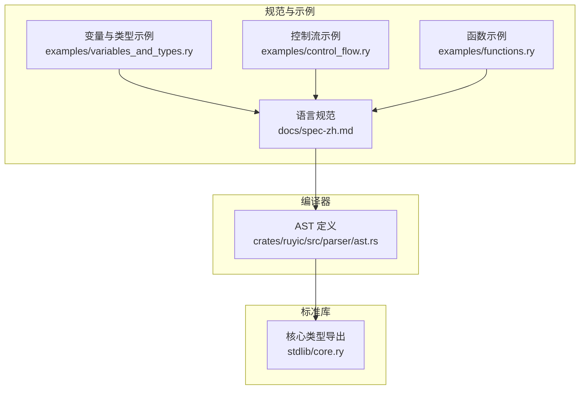
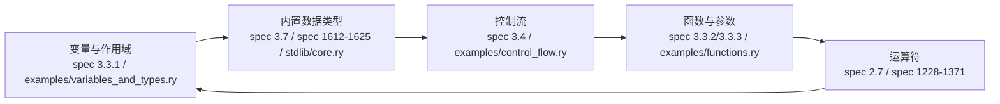
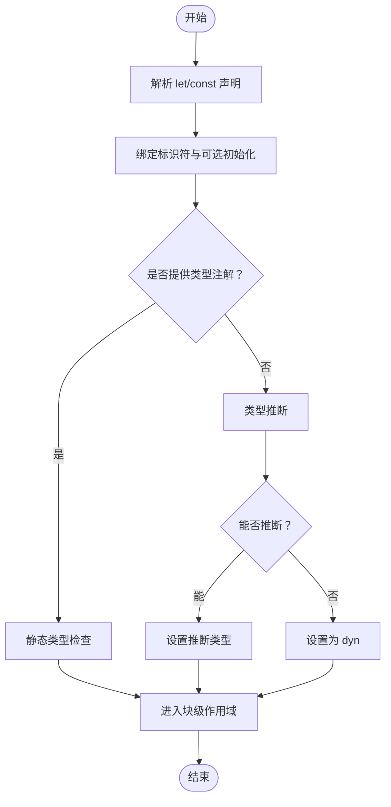
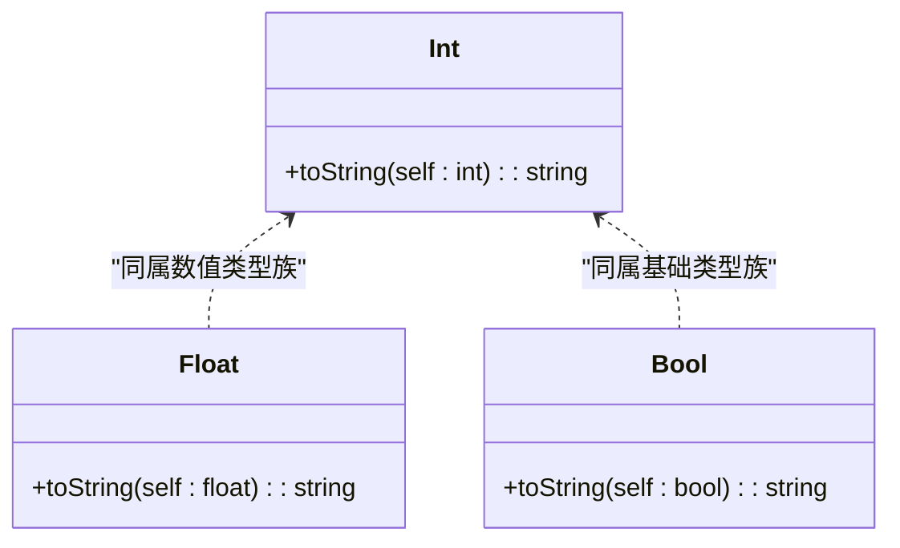
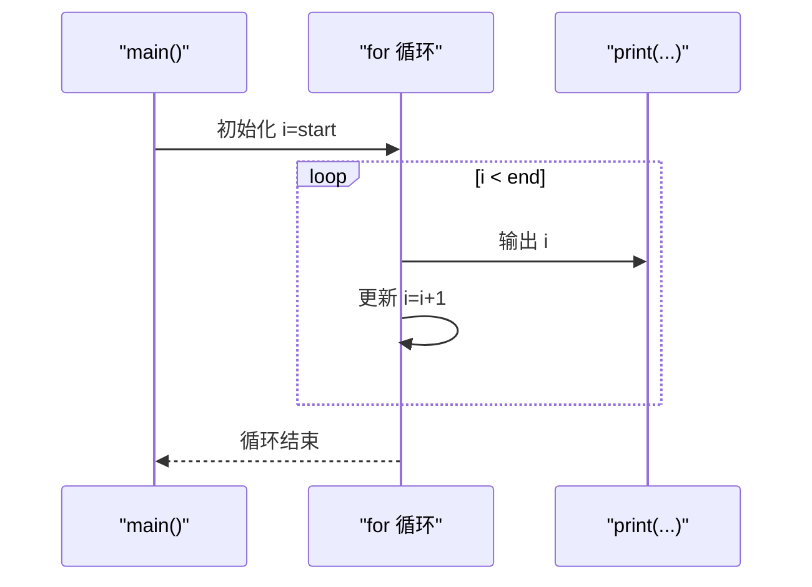
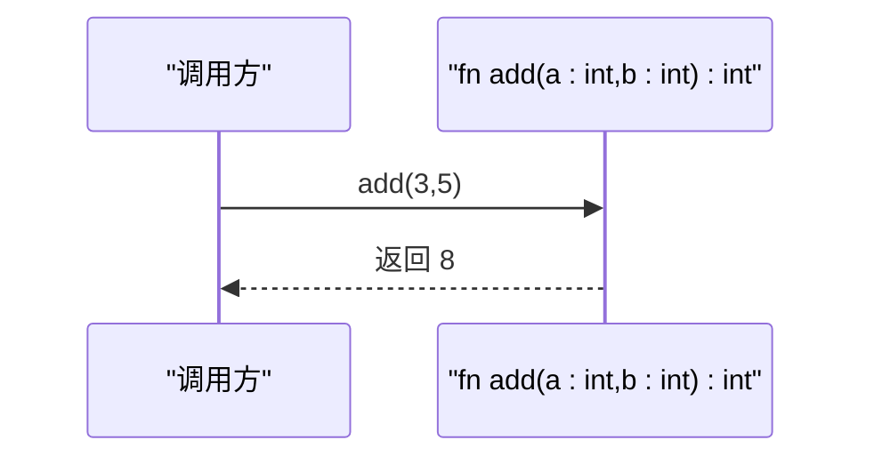
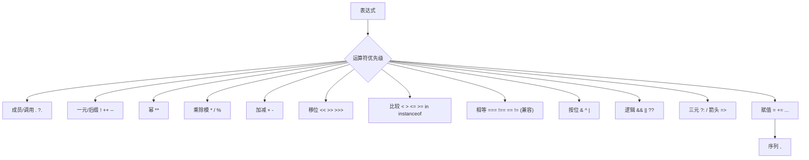
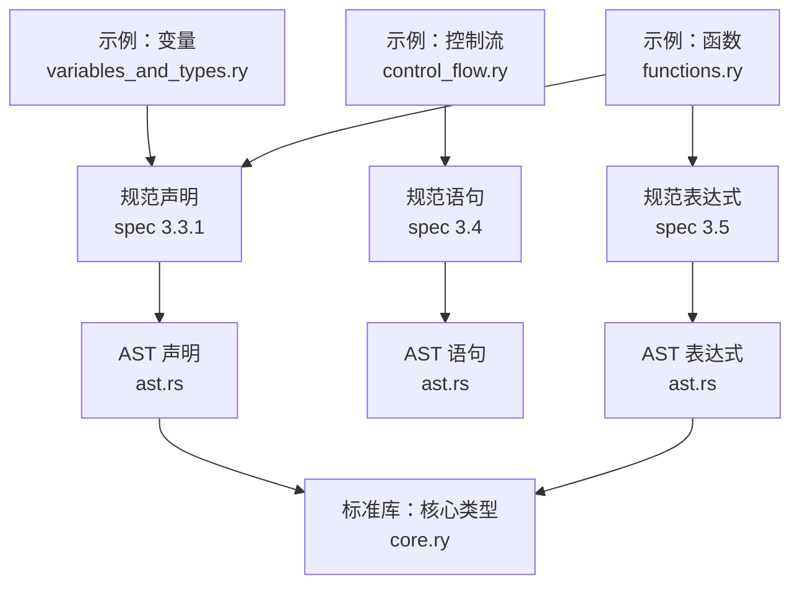

# 语言基础

<cite>
**本文引用的文件**
- [README.md](file://README.md)
- [spec-zh.md](file://docs/spec-zh.md)
- [variables_and_types.ry](file://examples/variables_and_types.ry)
- [control_flow.ry](file://examples/control_flow.ry)
- [functions.ry](file://examples/functions.ry)
- [ast.rs](file://crates/ruyic/src/parser/ast.rs)
- [core.ry](file://stdlib/core.ry)
- [arithmetic.ry](file://crates/ruyic/tests/integration/cases/basic/arithmetic.ry)
- [hello_world.ry](file://crates/ruyic/tests/integration/cases/basic/hello_world.ry)
</cite>

## 目录
1. [引言](#引言)
2. [项目结构](#项目结构)
3. [核心组件](#核心组件)
4. [架构总览](#架构总览)
5. [详细组件分析](#详细组件分析)
6. [依赖分析](#依赖分析)
7. [性能考虑](#性能考虑)
8. [故障排查指南](#故障排查指南)
9. [结论](#结论)
10. [附录](#附录)

## 引言
本文件面向初学者，系统梳理 Ruyi 语言的基础语法与语义，覆盖变量与作用域、内置数据类型、控制流、函数与参数传递、运算符体系，并辅以仓库中的示例与规范条文路径，帮助读者循序渐进掌握语言基础。

## 项目结构
Ruyi 项目由编译器、标准库与示例组成。与本基础语法文档直接相关的内容主要来自：
- 语言规范：docs/spec-zh.md 提供权威的词法、语法、类型系统与控制流等规范条目
- 示例程序：examples/ 下的变量、控制流、函数示例直观展示语法用法
- 编译器 AST 定义：crates/ruyic/src/parser/ast.rs 描述了变量声明、语句、表达式等语法节点
- 标准库：stdlib/core.ry 展示了内置类型的辅助方法与导出

**图表来源**
- [spec-zh.md](file://docs/spec-zh.md)
- [variables_and_types.ry](file://examples/variables_and_types.ry)
- [control_flow.ry](file://examples/control_flow.ry)
- [functions.ry](file://examples/functions.ry)
- [ast.rs](file://crates/ruyic/src/parser/ast.rs)
- [core.ry](file://stdlib/core.ry)

**章节来源**
- [README.md](file://README.md)
- [spec-zh.md](file://docs/spec-zh.md)

## 核心组件
- 变量与作用域：let/const 声明、块级作用域、解构绑定、类型注解与推断
- 内置数据类型：int、float、bool、string、null、void、dyn、bigint 等
- 控制流：if/else、for、for-in、for-of、while、match、break/continue、label
- 函数与参数：函数声明、箭头函数、默认参数、返回类型推断、async/await
- 运算符：算术、比较、逻辑、按位、赋值、三元、可选链、空值合并、非空断言等

**章节来源**
- [spec-zh.md](file://docs/spec-zh.md)
- [variables_and_types.ry](file://examples/variables_and_types.ry)
- [control_flow.ry](file://examples/control_flow.ry)
- [functions.ry](file://examples/functions.ry)
- [ast.rs](file://crates/ruyic/src/parser/ast.rs)

## 架构总览
下图概述了“变量—类型—控制流—函数—运算符”之间的关系，以及它们在规范与示例中的对应位置。

**图表来源**
- [spec-zh.md](file://docs/spec-zh.md)
- [variables_and_types.ry](file://examples/variables_and_types.ry)
- [control_flow.ry](file://examples/control_flow.ry)
- [functions.ry](file://examples/functions.ry)
- [core.ry](file://stdlib/core.ry)

## 详细组件分析

### 变量声明与作用域
- 关键字与声明
  - let：可变变量，块级作用域
  - const：常量，块级作用域
  - 支持解构绑定（对象/数组）、初始值、类型注解
- 作用域规则
  - 块级作用域，嵌套块可遮蔽外层同名标识符
  - 不允许重复声明同名标识符
- 类型注解与推断
  - 显式注解：let x: int = 42
  - 推断：let y = "hello" → y: string
  - 未注解也无初始化：默认为 dyn
- 示例与规范定位
  - 声明语法与解构：参见规范“3.3.1 变量声明”
  - 示例：变量与类型示例程序展示了 let/const、解构、类型注解与推断、块作用域等

**图表来源**
- [spec-zh.md](file://docs/spec-zh.md)
- [variables_and_types.ry](file://examples/variables_and_types.ry)

**章节来源**
- [spec-zh.md](file://docs/spec-zh.md)
- [variables_and_types.ry](file://examples/variables_and_types.ry)

### 内置数据类型
- 基础类型
  - int：64 位有符号整数
  - float：64 位浮点数
  - bool：布尔值 true/false
  - string：UTF-8 字符串
  - null：空类型，唯一值为 null
  - void：无返回值
  - dyn：动态类型（运行时检查）
  - never：底类型（不可达）
  - bigint：任意精度整数
- 类型注解与可空
  - 可空类型：T? 表示 T 或 null
  - 空值安全：无 undefined，统一 null
- 标准库导出
  - Int/Float/Bool 提供基本 toString 等方法
- 示例与规范定位
  - 类型列表与示例：参见规范“1612-1625”
  - 核心类型导出：参见 stdlib/core.ry

**图表来源**
- [core.ry](file://stdlib/core.ry)

**章节来源**
- [spec-zh.md](file://docs/spec-zh.md)
- [core.ry](file://stdlib/core.ry)

### 控制流语句
- 条件与表达式
  - if/else：支持 else-if 链
  - if 表达式：if (...) Expr else Expr，分支必须产生兼容类型
  - match 表达式：模式匹配，支持守卫与通配符
- 循环
  - for：C 风格初始化/条件/更新
  - for-in：遍历键或索引
  - for-of：遍历值，支持 async
  - while：条件循环
  - break/continue：支持标签跳出
- 异常
  - try/catch/finally：异常处理
  - throw：抛出异常
- 示例与规范定位
  - 语句文法：参见规范“3.4”
  - 控制流示例：examples/control_flow.ry 展示了 if/else、for、while、break/continue、label 等

**图表来源**
- [control_flow.ry](file://examples/control_flow.ry)

**章节来源**
- [spec-zh.md](file://docs/spec-zh.md)
- [control_flow.ry](file://examples/control_flow.ry)

### 函数定义、调用与参数传递
- 函数声明
  - fn ident(params): ReturnType { ... }
  - 支持泛型参数、返回类型注解与推断
- 箭头函数
  - (params) => expr 或 (params) => { stmts }
  - async 箭头函数
- 参数
  - 默认参数：形如 name: string = "World"
  - 剩余参数：...idents
- 调用与返回
  - return 表达式；未提供返回值时为 null
- 示例与规范定位
  - 函数声明与箭头函数：参见规范“3.3.2/3.3.3”
  - 示例：examples/functions.ry 展示了函数声明、箭头函数、默认参数与返回类型推断

**图表来源**
- [functions.ry](file://examples/functions.ry)

**章节来源**
- [spec-zh.md](file://docs/spec-zh.md)
- [functions.ry](file://examples/functions.ry)

### 运算符体系
- 算术：+、-、*、/、%、**（幂）
- 比较：===、!==、<、>、<=、>=、in、instanceof
- 逻辑：&&、||、??
- 赋值：=、+=、-=、*=、/=、%=、**=、&&=、||=、??=
- 一元/后缀：!（前缀/非空断言）、++/--、+/-、~、typeof、void、delete、await
- 成员/调用：.、?.、[]、()、new
- 三元：?:（条件表达式）
- 优先级与结合性：详见规范附录“2310-2332”
- 示例与规范定位
  - 运算符清单与优先级：参见规范“2.7/2310-2332”
  - 示例：crates/ruyic/tests/integration/cases/basic/arithmetic.ry 展示了基本算术运算

**图表来源**
- [spec-zh.md](file://docs/spec-zh.md)
- [arithmetic.ry](file://crates/ruyic/tests/integration/cases/basic/arithmetic.ry)

**章节来源**
- [spec-zh.md](file://docs/spec-zh.md)
- [arithmetic.ry](file://crates/ruyic/tests/integration/cases/basic/arithmetic.ry)

## 依赖分析
- 语法节点与规范的对应关系
  - 变量声明：Declaration::Let/Const → 规范“3.3.1”
  - 语句：Statement::If/While/For/ForIn/ForOf/Try/Match/Break/Continue/Labeled → 规范“3.4”
  - 表达式：Expr::Binary/Unary/Call/Member/Conditional/Assignment/ArrowFunction/Await/Match/If → 规范“3.5”
- 示例与规范的映射
  - variables_and_types.ry ↔ 规范“2.7/3.3.1/3.7”
  - control_flow.ry ↔ 规范“3.4”
  - functions.ry ↔ 规范“3.3.2/3.3.3”
- 标准库与内置类型
  - core.ry 导出 Int/Float/Bool 类型方法，与规范“1612-1625”的内置类型保持一致

**图表来源**
- [spec-zh.md](file://docs/spec-zh.md)
- [ast.rs](file://crates/ruyic/src/parser/ast.rs)
- [variables_and_types.ry](file://examples/variables_and_types.ry)
- [control_flow.ry](file://examples/control_flow.ry)
- [functions.ry](file://examples/functions.ry)
- [core.ry](file://stdlib/core.ry)

**章节来源**
- [spec-zh.md](file://docs/spec-zh.md)
- [ast.rs](file://crates/ruyic/src/parser/ast.rs)
- [core.ry](file://stdlib/core.ry)

## 性能考虑
- 编译为原生机器码：Ruyi 通过 LLVM 编译，提供跨平台高性能运行
- 渐进式类型：在保证类型安全的同时，允许动态类型以降低开发成本
- 异步/await：基于绿色线程并发，减少阻塞开销
- 垃圾回收：运行时 GC 与分配策略有助于内存管理，但需关注分配热点

**章节来源**
- [README.md](file://README.md)

## 故障排查指南
- 常见问题与定位
  - 作用域错误：确认 let/const 是否在正确块内使用，避免重复声明
  - 类型不匹配：检查显式注解与推断类型，必要时使用显式转换
  - 控制流标签：确保 break/continue 的标签与目标循环一致
  - 函数返回：未显式 return 时为 null，注意 void 与 null 的区别
  - 运算符优先级：复杂表达式建议使用括号明确意图
- 示例验证
  - 变量与类型示例：可对照输出预期结果，验证 let/const、解构、类型注解与推断
  - 控制流示例：验证 if/else、for、while、break/continue、label 的行为
  - 函数示例：验证函数声明、箭头函数、默认参数与返回类型推断
  - 基础算术：验证 +、-、*、/、%、** 的行为

**章节来源**
- [variables_and_types.ry](file://examples/variables_and_types.ry)
- [control_flow.ry](file://examples/control_flow.ry)
- [functions.ry](file://examples/functions.ry)
- [arithmetic.ry](file://crates/ruyic/tests/integration/cases/basic/arithmetic.ry)

## 结论
Ruyi 以 JavaScript 严格模式为基础，提供清晰的块级作用域、严格的相等性、空值安全与渐进式类型系统。通过变量与类型、控制流、函数与运算符的系统讲解，并结合规范与示例，初学者可以快速掌握语言基础并编写健壮高效的程序。

## 附录
- 快速入门示例
  - Hello World：参见 crates/ruyic/tests/integration/cases/basic/hello_world.ry
- 术语对照
  - let/const：可变/不可变变量声明
  - dyn：动态类型（运行时检查）
  - null：空类型，唯一值为 null
  - void：无返回值
  - bigint：任意精度整数

**章节来源**
- [hello_world.ry](file://crates/ruyic/tests/integration/cases/basic/hello_world.ry)
- [spec-zh.md](file://docs/spec-zh.md)