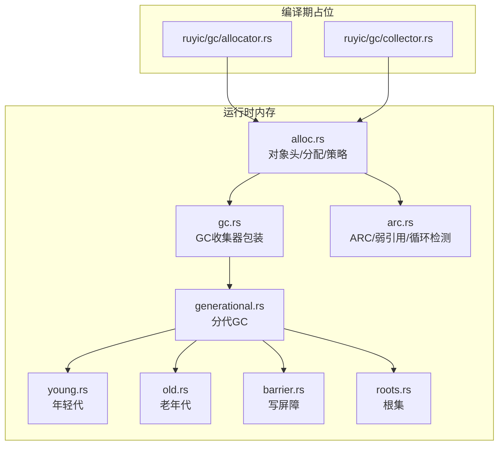
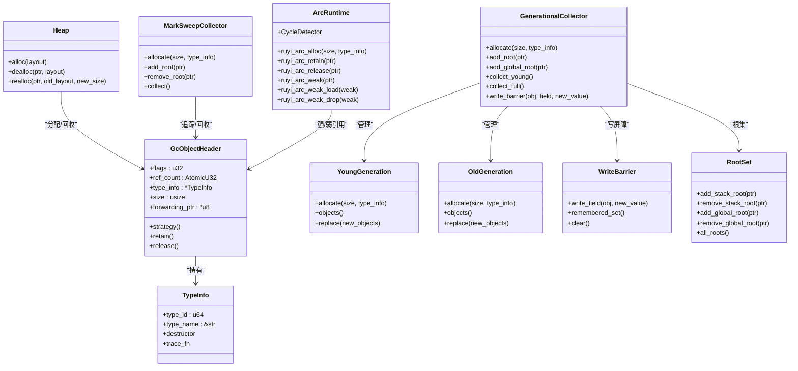
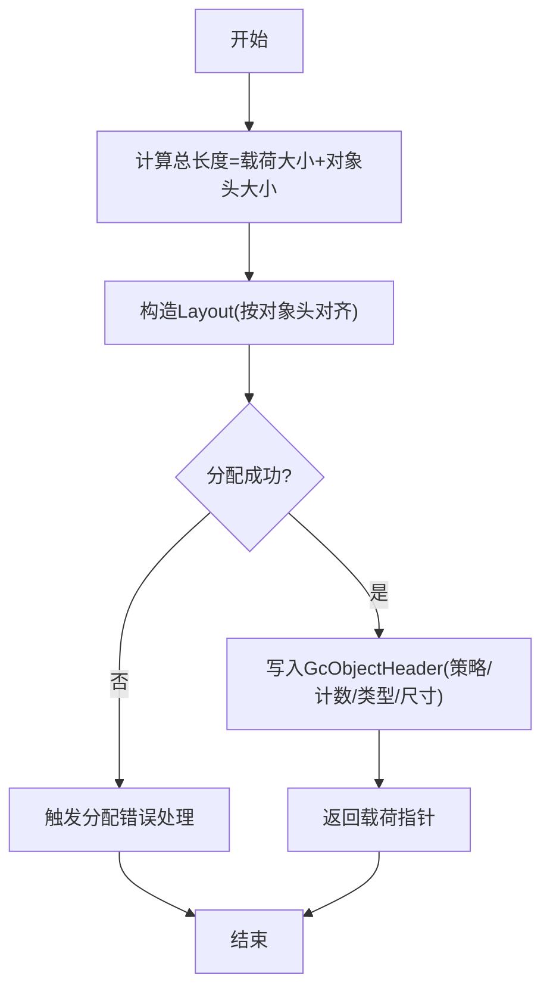
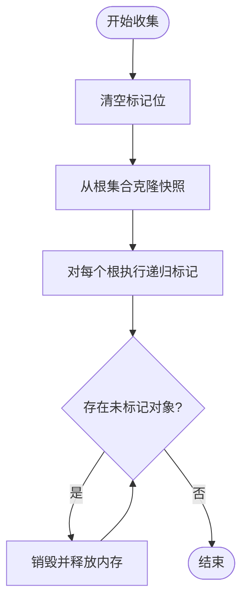
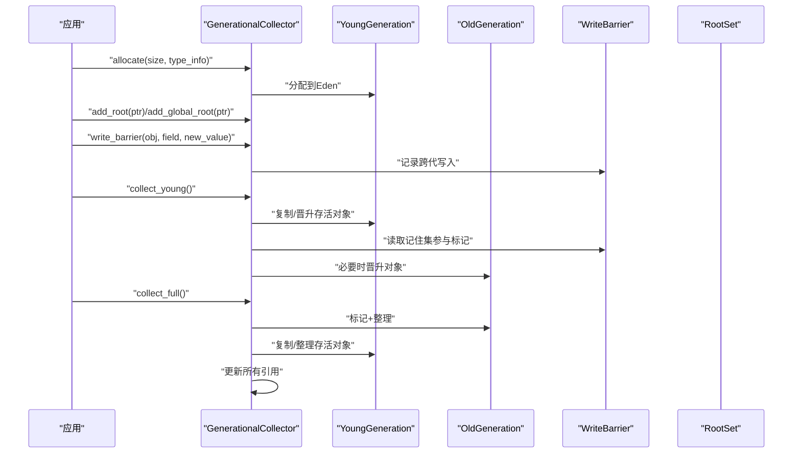
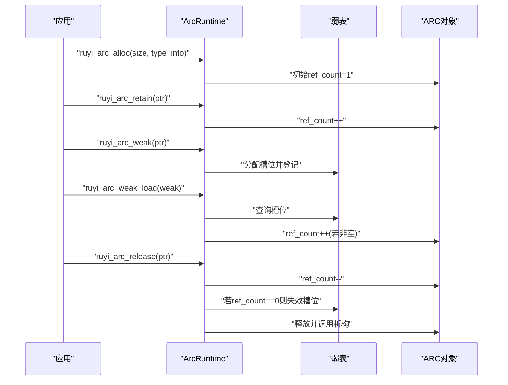
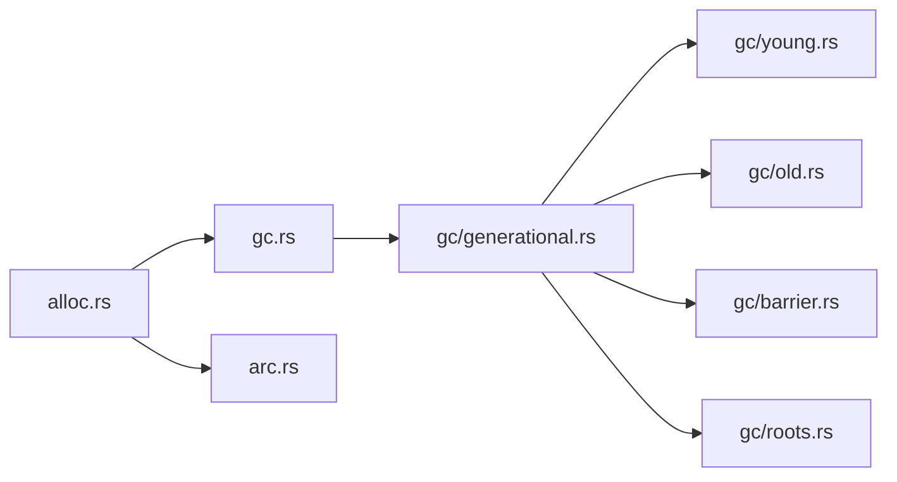

# 内存管理

<cite>
**本文引用的文件**
- [crates/ruyi_runtime/src/alloc.rs](file://crates/ruyi_runtime/src/alloc.rs)
- [crates/ruyi_runtime/src/gc.rs](file://crates/ruyi_runtime/src/gc.rs)
- [crates/ruyi_runtime/src/arc.rs](file://crates/ruyi_runtime/src/arc.rs)
- [crates/ruyi_runtime/src/gc/generational.rs](file://crates/ruyi_runtime/src/gc/generational.rs)
- [crates/ruyi_runtime/src/gc/young.rs](file://crates/ruyi_runtime/src/gc/young.rs)
- [crates/ruyi_runtime/src/gc/old.rs](file://crates/ruyi_runtime/src/gc/old.rs)
- [crates/ruyi_runtime/src/gc/barrier.rs](file://crates/ruyi_runtime/src/gc/barrier.rs)
- [crates/ruyi_runtime/src/gc/roots.rs](file://crates/ruyi_runtime/src/gc/roots.rs)
- [crates/ruyic/src/gc/allocator.rs](file://crates/ruyic/src/gc/allocator.rs)
- [crates/ruyic/src/gc/collector.rs](file://crates/ruyic/src/gc/collector.rs)
- [docs/spec-zh.md](file://docs/spec-zh.md)
- [.omo/evidence/task-3-memory-model.txt](file://.omo/evidence/task-3-memory-model.txt)
</cite>

## 目录
1. [引言](#引言)
2. [项目结构](#项目结构)
3. [核心组件](#核心组件)
4. [架构总览](#架构总览)
5. [详细组件分析](#详细组件分析)
6. [依赖关系分析](#依赖关系分析)
7. [性能考量](#性能考量)
8. [故障排查指南](#故障排查指南)
9. [结论](#结论)
10. [附录](#附录)

## 引言
本文件系统化梳理 Ruyi 的内存管理系统，覆盖堆管理、GC 与 ARC 双重策略、对象头设计、写屏障与根集、以及二者边界处理。文档同时给出 GC/ARC 协同机制、泄漏检测与调试思路、性能优化建议与最佳实践，并通过图示展示关键流程。

## 项目结构
Ruyi 的内存管理主要位于运行时模块，编译期仅提供占位实现；运行时模块包含：
- 堆与对象头：统一的内存分配、对象头与策略标记
- GC：基础标记清除与新一代分代收集
- ARC：引用计数、弱引用、循环检测与边界处理
- 辅助设施：写屏障、根集、年轻/老年代

**图表来源**
- [crates/ruyi_runtime/src/alloc.rs](file://crates/ruyi_runtime/src/alloc.rs)
- [crates/ruyi_runtime/src/gc.rs](file://crates/ruyi_runtime/src/gc.rs)
- [crates/ruyi_runtime/src/gc/generational.rs](file://crates/ruyi_runtime/src/gc/generational.rs)
- [crates/ruyi_runtime/src/gc/young.rs](file://crates/ruyi_runtime/src/gc/young.rs)
- [crates/ruyi_runtime/src/gc/old.rs](file://crates/ruyi_runtime/src/gc/old.rs)
- [crates/ruyi_runtime/src/gc/barrier.rs](file://crates/ruyi_runtime/src/gc/barrier.rs)
- [crates/ruyi_runtime/src/gc/roots.rs](file://crates/ruyi_runtime/src/gc/roots.rs)
- [crates/ruyi_runtime/src/arc.rs](file://crates/ruyi_runtime/src/arc.rs)
- [crates/ruyic/src/gc/allocator.rs](file://crates/ruyic/src/gc/allocator.rs)
- [crates/ruyic/src/gc/collector.rs](file://crates/ruyic/src/gc/collector.rs)

**章节来源**
- [crates/ruyi_runtime/src/alloc.rs](file://crates/ruyi_runtime/src/alloc.rs)
- [crates/ruyi_runtime/src/gc.rs](file://crates/ruyi_runtime/src/gc.rs)
- [crates/ruyi_runtime/src/gc/generational.rs](file://crates/ruyi_runtime/src/gc/generational.rs)
- [crates/ruyi_runtime/src/gc/young.rs](file://crates/ruyi_runtime/src/gc/young.rs)
- [crates/ruyi_runtime/src/gc/old.rs](file://crates/ruyi_runtime/src/gc/old.rs)
- [crates/ruyi_runtime/src/gc/barrier.rs](file://crates/ruyi_runtime/src/gc/barrier.rs)
- [crates/ruyi_runtime/src/gc/roots.rs](file://crates/ruyi_runtime/src/gc/roots.rs)
- [crates/ruyi_runtime/src/arc.rs](file://crates/ruyi_runtime/src/arc.rs)
- [crates/ruyic/src/gc/allocator.rs](file://crates/ruyic/src/gc/allocator.rs)
- [crates/ruyic/src/gc/collector.rs](file://crates/ruyic/src/gc/collector.rs)

## 核心组件
- 内存策略（MemoryStrategy）
  - GC：由 GC 收集器管理，支持标记-清扫或分代复制/整理
  - ARC：由引用计数管理，支持强引用与弱引用，具备循环检测
- 对象头（GcObjectHeader）
  - 统一承载 GC/ARC 元数据：标志位、引用计数、类型信息、尺寸、转发指针等
  - 通过策略位在 GC/ARC 间复用同一布局
- 堆与分配
  - ruyi_alloc/ruyi_dealloc/ruyi_realloc 提供带对象头的分配与回收
  - Heap 当前委托系统分配器，未来可替换为专用 arena
- GC 收集器
  - MarkSweepCollector：基准标记-清扫实现
  - GenerationalCollector：分代收集（年轻代复制+老年代标记整理），配合写屏障与根集
- ARC 子系统
  - 强引用：retain/release
  - 弱引用：弱表记录槽位，失效后置空
  - 循环检测：基于试删算法的简化循环检测
  - 边界处理：跨 GC/ARC 的 retain/release 封装

**章节来源**
- [crates/ruyi_runtime/src/alloc.rs](file://crates/ruyi_runtime/src/alloc.rs)
- [crates/ruyi_runtime/src/gc.rs](file://crates/ruyi_runtime/src/gc.rs)
- [crates/ruyi_runtime/src/gc/generational.rs](file://crates/ruyi_runtime/src/gc/generational.rs)
- [crates/ruyi_runtime/src/arc.rs](file://crates/ruyi_runtime/src/arc.rs)

## 架构总览
Ruyi 的内存管理以“同一对象头、双策略”为核心，运行时在 GC 与 ARC 之间无缝切换。GC 采用分代策略，年轻代复制、老年代标记整理；ARC 采用强引用计数与弱引用，辅以循环检测与边界封装。

**图表来源**
- [crates/ruyi_runtime/src/alloc.rs](file://crates/ruyi_runtime/src/alloc.rs)
- [crates/ruyi_runtime/src/gc.rs](file://crates/ruyi_runtime/src/gc.rs)
- [crates/ruyi_runtime/src/gc/generational.rs](file://crates/ruyi_runtime/src/gc/generational.rs)
- [crates/ruyi_runtime/src/gc/young.rs](file://crates/ruyi_runtime/src/gc/young.rs)
- [crates/ruyi_runtime/src/gc/old.rs](file://crates/ruyi_runtime/src/gc/old.rs)
- [crates/ruyi_runtime/src/gc/barrier.rs](file://crates/ruyi_runtime/src/gc/barrier.rs)
- [crates/ruyi_runtime/src/gc/roots.rs](file://crates/ruyi_runtime/src/gc/roots.rs)
- [crates/ruyi_runtime/src/arc.rs](file://crates/ruyi_runtime/src/arc.rs)

## 详细组件分析

### 对象头与分配器（GcObjectHeader、Heap、MemoryStrategy）
- 对象头字段
  - 标志位：标记位、固定位、策略位、代位
  - 引用计数：原子计数，支持 retain/release
  - 类型信息：包含析构函数与追踪回调
  - 尺寸与转发指针：用于 GC 复制/整理
- 分配与回收
  - ruyi_alloc：按对象头对齐分配，写入头信息
  - ruyi_dealloc：调用析构后释放
  - ruyi_realloc：移动对象头并更新尺寸
- 策略选择
  - GC：默认策略，适合通用场景
  - ARC：适合性能敏感路径，需要显式 retain/release

**图表来源**
- [crates/ruyi_runtime/src/alloc.rs](file://crates/ruyi_runtime/src/alloc.rs)

**章节来源**
- [crates/ruyi_runtime/src/alloc.rs](file://crates/ruyi_runtime/src/alloc.rs)

### 标记-清扫收集器（MarkSweepCollector）
- 功能要点
  - 追踪根集合，递归标记可达对象
  - 清扫未标记对象并回收
  - 支持启用/禁用与有效性检查
- 适用场景
  - 兼容性与基准测试
  - 简单场景下的 GC 替选

**图表来源**
- [crates/ruyi_runtime/src/gc.rs](file://crates/ruyi_runtime/src/gc.rs)

**章节来源**
- [crates/ruyi_runtime/src/gc.rs](file://crates/ruyi_runtime/src/gc.rs)

### 分代收集器（GenerationalCollector）
- 年轻代（复制）
  - Eden -> 复制到 Survivor 或晋升至 Old
  - 代龄阈值控制晋升
- 老年代（标记-整理）
  - 标记可达对象，整理想存活对象
- 写屏障与根集
  - 记录跨代写入，minor 收集时作为额外根
  - 栈根/全局根统一管理
- 收集流程
  - minor：复制/晋升+更新引用
  - full：标记+整理想对象+更新引用

**图表来源**
- [crates/ruyi_runtime/src/gc/generational.rs](file://crates/ruyi_runtime/src/gc/generational.rs)
- [crates/ruyi_runtime/src/gc/young.rs](file://crates/ruyi_runtime/src/gc/young.rs)
- [crates/ruyi_runtime/src/gc/old.rs](file://crates/ruyi_runtime/src/gc/old.rs)
- [crates/ruyi_runtime/src/gc/barrier.rs](file://crates/ruyi_runtime/src/gc/barrier.rs)
- [crates/ruyi_runtime/src/gc/roots.rs](file://crates/ruyi_runtime/src/gc/roots.rs)

**章节来源**
- [crates/ruyi_runtime/src/gc/generational.rs](file://crates/ruyi_runtime/src/gc/generational.rs)
- [crates/ruyi_runtime/src/gc/young.rs](file://crates/ruyi_runtime/src/gc/young.rs)
- [crates/ruyi_runtime/src/gc/old.rs](file://crates/ruyi_runtime/src/gc/old.rs)
- [crates/ruyi_runtime/src/gc/barrier.rs](file://crates/ruyi_runtime/src/gc/barrier.rs)
- [crates/ruyi_runtime/src/gc/roots.rs](file://crates/ruyi_runtime/src/gc/roots.rs)

### ARC 子系统（强引用/弱引用/循环检测/边界）
- 强引用
  - retain/release 原子操作，ref_count==0 时回收并调用析构
- 弱引用
  - 通过全局弱表维护槽位，对象释放时将对应槽位置空
  - 加载弱引用时需增加强引用计数
- 循环检测
  - 试删算法：对候选集合中的对象临时减计数，若根计数降为 0 则判定为环
  - 恢复内部引用计数后，断开环内指针并释放
- 边界处理
  - ruyi_retain_any/ruyi_release_any：统一对 ARC/GC 指针进行 retain/release
  - GC 对 ARC 对象视为根；ARC 对 GC 对象调用 add_root/remove_root

**图表来源**
- [crates/ruyi_runtime/src/arc.rs](file://crates/ruyi_runtime/src/arc.rs)

**章节来源**
- [crates/ruyi_runtime/src/arc.rs](file://crates/ruyi_runtime/src/arc.rs)

### 编译期 GC 占位实现
- 编译期仅提供 Allocator/Collector 占位，不执行实际 GC
- 运行时负责真实内存管理

**章节来源**
- [crates/ruyic/src/gc/allocator.rs](file://crates/ruyic/src/gc/allocator.rs)
- [crates/ruyic/src/gc/collector.rs](file://crates/ruyic/src/gc/collector.rs)

## 依赖关系分析
- 组件耦合
  - alloc.rs 为 GC/ARC 提供统一对象头与分配接口
  - gc/generational.rs 依赖 young/old/barrier/roots 实现分代收集
  - arc.rs 依赖 alloc.rs 的对象头与分配接口
- 外部依赖
  - 系统分配器（std::alloc）作为底层后端
  - 原子操作用于 ARC 引用计数
- 潜在风险
  - 写屏障与根集必须正确维护，避免漏标导致误回收
  - ARC 弱引用失效需及时清理，防止悬挂槽位

**图表来源**
- [crates/ruyi_runtime/src/alloc.rs](file://crates/ruyi_runtime/src/alloc.rs)
- [crates/ruyi_runtime/src/gc.rs](file://crates/ruyi_runtime/src/gc.rs)
- [crates/ruyi_runtime/src/gc/generational.rs](file://crates/ruyi_runtime/src/gc/generational.rs)
- [crates/ruyi_runtime/src/gc/young.rs](file://crates/ruyi_runtime/src/gc/young.rs)
- [crates/ruyi_runtime/src/gc/old.rs](file://crates/ruyi_runtime/src/gc/old.rs)
- [crates/ruyi_runtime/src/gc/barrier.rs](file://crates/ruyi_runtime/src/gc/barrier.rs)
- [crates/ruyi_runtime/src/gc/roots.rs](file://crates/ruyi_runtime/src/gc/roots.rs)
- [crates/ruyi_runtime/src/arc.rs](file://crates/ruyi_runtime/src/arc.rs)

**章节来源**
- [crates/ruyi_runtime/src/alloc.rs](file://crates/ruyi_runtime/src/alloc.rs)
- [crates/ruyi_runtime/src/gc/generational.rs](file://crates/ruyi_runtime/src/gc/generational.rs)
- [crates/ruyi_runtime/src/gc/young.rs](file://crates/ruyi_runtime/src/gc/young.rs)
- [crates/ruyi_runtime/src/gc/old.rs](file://crates/ruyi_runtime/src/gc/old.rs)
- [crates/ruyi_runtime/src/gc/barrier.rs](file://crates/ruyi_runtime/src/gc/barrier.rs)
- [crates/ruyi_runtime/src/gc/roots.rs](file://crates/ruyi_runtime/src/gc/roots.rs)
- [crates/ruyi_runtime/src/arc.rs](file://crates/ruyi_runtime/src/arc.rs)

## 性能考量
- 分代策略
  - 年轻代复制减少老年代碎片与停顿
  - 适当提升晋升阈值可降低晋升频率，但需权衡内存占用
- 写屏障
  - 记住集规模直接影响 minor 收集成本，应尽量减少不必要的跨代写
- 引用计数
  - ARC 在高频增删计数场景下有开销，可结合对象生命周期评估是否使用 ARC
- 对齐与布局
  - 对象头按对齐要求分配，避免额外填充；合理设计对象布局可减少碎片
- 根集管理
  - 减少栈根数量与频繁变更，有助于缩短 GC 时间

[本节为通用指导，无需特定文件引用]

## 故障排查指南
- 常见问题
  - 对象提前释放：检查 GC 根注册/移除配对，确认 ARC retain/release 成对出现
  - 弱引用悬挂：确认弱引用槽位在对象释放后被清理
  - 循环泄漏：使用循环检测或手动断环，确保无相互强引用
- 调试手段
  - 启用/禁用 GC：通过收集器开关验证回收行为
  - 根集审计：核对 add_root/remove_root 的配对与异常路径 cleanup
  - 写屏障验证：检查跨代写入是否正确登记到记住集
- 工具与接口
  - GC：collect/collect_young/collect_full、根集 API、写屏障 API
  - ARC：retain/release、弱引用创建/加载/丢弃、循环检测器

**章节来源**
- [crates/ruyi_runtime/src/gc.rs](file://crates/ruyi_runtime/src/gc.rs)
- [crates/ruyi_runtime/src/gc/generational.rs](file://crates/ruyi_runtime/src/gc/generational.rs)
- [crates/ruyi_runtime/src/gc/roots.rs](file://crates/ruyi_runtime/src/gc/roots.rs)
- [crates/ruyi_runtime/src/gc/barrier.rs](file://crates/ruyi_runtime/src/gc/barrier.rs)
- [crates/ruyi_runtime/src/arc.rs](file://crates/ruyi_runtime/src/arc.rs)

## 结论
Ruyi 的内存系统以统一对象头为基础，融合 GC 与 ARC 双重策略，既保证通用场景的易用性，又为性能敏感路径提供确定性释放能力。分代 GC 与写屏障有效降低停顿，ARC 的弱引用与循环检测完善了边界处理。通过规范的根集管理与写屏障使用，可显著提升稳定性与性能。

[本节为总结，无需特定文件引用]

## 附录

### 内存策略与配置
- 策略选择
  - GC：默认策略，适合通用代码
  - ARC：适合性能关键路径，需显式管理 retain/release
- 配置入口
  - 分配时指定 MemoryStrategy
  - 分代阈值可通过 GenerationalCollector::with_threshold 调整

**章节来源**
- [crates/ruyi_runtime/src/alloc.rs](file://crates/ruyi_runtime/src/alloc.rs)
- [crates/ruyi_runtime/src/gc/generational.rs](file://crates/ruyi_runtime/src/gc/generational.rs)

### 内存对象头结构与作用
- 字段与用途
  - 标志位：标记/固定/策略/代位
  - 引用计数：ARC 强引用计数
  - 类型信息：析构与追踪回调
  - 尺寸与转发指针：GC 复制/整理所需
- 对 GC/ARC 的意义
  - 统一布局减少分支判断
  - 策略位决定对象由谁管理

**章节来源**
- [crates/ruyi_runtime/src/alloc.rs](file://crates/ruyi_runtime/src/alloc.rs)

### GC/ARC 协同工作机制
- 边界封装
  - ruyi_retain_any/ruyi_release_any 自动区分 ARC/GC
- 弱引用桥接
  - ARC 对象可被 GC 视为根，GC 对象可被 ARC 弱引用持有

**章节来源**
- [crates/ruyi_runtime/src/arc.rs](file://crates/ruyi_runtime/src/arc.rs)

### 文档与证据参考
- 规范文档
  - 内存模型与策略说明
- 任务证据
  - 内存模型验证证据清单

**章节来源**
- [docs/spec-zh.md](file://docs/spec-zh.md)
- [.omo/evidence/task-3-memory-model.txt](file://.omo/evidence/task-3-memory-model.txt)