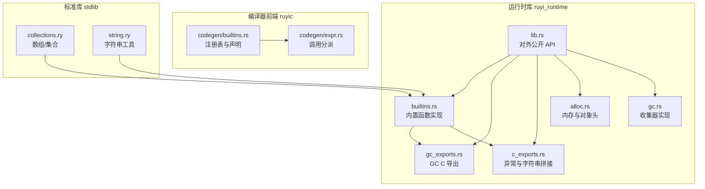
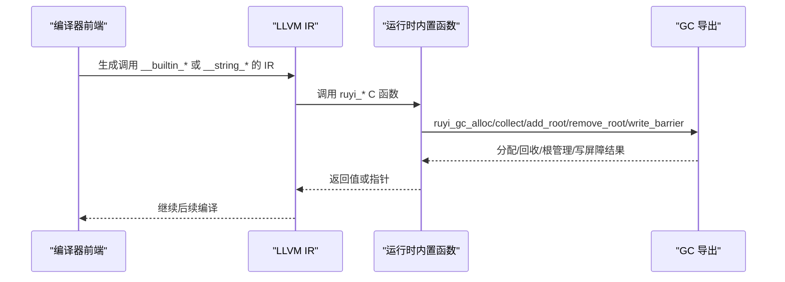
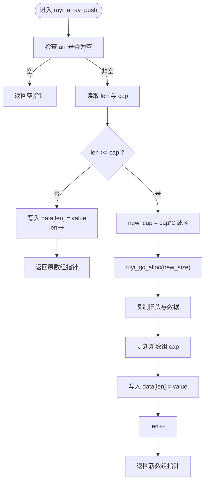
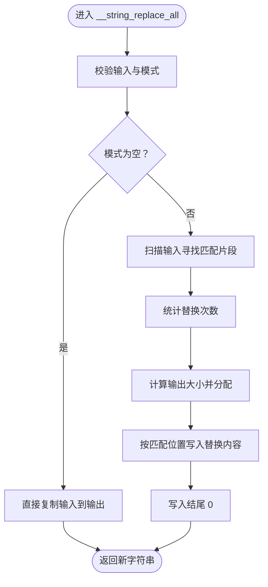
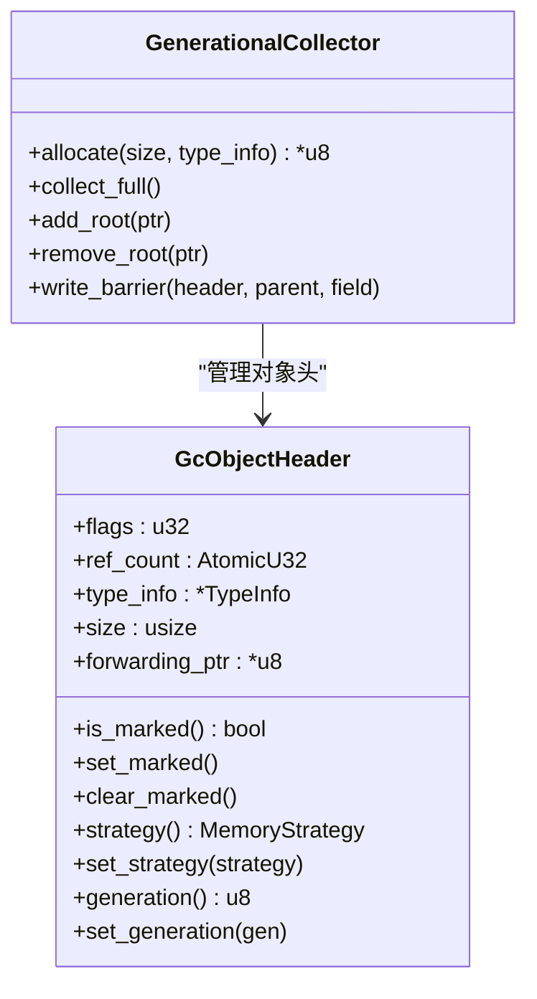
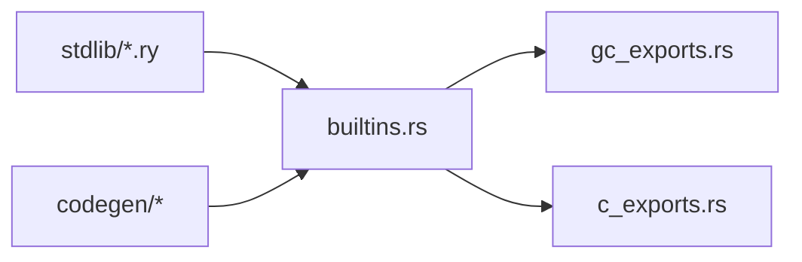

# 内置函数库

<cite>
**本文档引用的文件**
- [builtins.rs](file://crates/ruyi_runtime/src/builtins.rs)
- [c_exports.rs](file://crates/ruyi_runtime/src/c_exports.rs)
- [gc_exports.rs](file://crates/ruyi_runtime/src/gc_exports.rs)
- [lib.rs](file://crates/ruyi_runtime/src/lib.rs)
- [alloc.rs](file://crates/ruyi_runtime/src/alloc.rs)
- [gc.rs](file://crates/ruyi_runtime/src/gc.rs)
- [Cargo.toml](file://crates/ruyi_runtime/Cargo.toml)
- [builtins.rs（运行时测试）](file://crates/ruyi_runtime/tests/builtins.rs)
- [collections.ry](file://stdlib/collections.ry)
- [string.ry](file://stdlib/string.ry)
- [stdlib_test.ry](file://examples/stdlib_test.ry)
- [stdlib_string_test.ry](file://examples/stdlib_string_test.ry)
- [builtins.rs（字符串测试）](file://crates/ruyi_runtime/src/builtins.rs)
- [builtins.rs（类型映射）](file://crates/ruyi_runtime/src/lib.rs)
</cite>

## 目录
1. [简介](#简介)
2. [项目结构](#项目结构)
3. [核心组件](#核心组件)
4. [架构总览](#架构总览)
5. [详细组件分析](#详细组件分析)
6. [依赖分析](#依赖分析)
7. [性能考虑](#性能考虑)
8. [故障排查指南](#故障排查指南)
9. [结论](#结论)
10. [附录](#附录)

## 简介
本文件系统性梳理 Ruyi 运行时内置函数库的设计与实现，覆盖数组操作、字符串处理、数值转换、集合（Map/Set）、对象成员访问、GC 导出函数、C 接口导出机制、与编译器前端的集成关系、性能特性与优化策略、扩展与自定义方式、调试与性能分析方法，以及使用示例与最佳实践。

## 项目结构
Ruyi 运行时内置函数主要位于运行时 crate 的 builtins 模块中，并通过 C ABI 导出供编译器生成的 LLVM IR 调用。GC 相关能力由独立模块提供，C 异常与字符串拼接等辅助能力也以 C ABI 形式暴露。标准库通过命名约定（如 __builtin_*、__string_*）间接调用这些运行时函数。

图示来源
- [builtins.rs](file://crates/ruyi_runtime/src/builtins.rs)
- [gc_exports.rs](file://crates/ruyi_runtime/src/gc_exports.rs)
- [c_exports.rs](file://crates/ruyi_runtime/src/c_exports.rs)
- [lib.rs](file://crates/ruyi_runtime/src/lib.rs)
- [alloc.rs](file://crates/ruyi_runtime/src/alloc.rs)
- [gc.rs](file://crates/ruyi_runtime/src/gc.rs)
- [builtins.rs（类型映射）](file://crates/ruyi_runtime/src/lib.rs)

章节来源
- [lib.rs:24-44](file://crates/ruyi_runtime/src/lib.rs#L24-L44)
- [Cargo.toml:8-9](file://crates/ruyi_runtime/Cargo.toml#L8-L9)

## 核心组件
- 数组与对象管理：提供数组与对象的分配、长度查询、元素访问与修改、扩容入栈等操作；对象字段布局为字段计数 + 指针槽位。
- 字符串工具：提供整型/浮点/布尔到字符串的转换、C 风格字符串拼接、Unicode 字符码点构建、字符子串、大小写转换、查找与替换、重复、拆分与连接等。
- 集合（Map/Set）：基于 HashMap/HashSet 的键值对存储与集合操作，提供键存在性检查、增删改查、键值遍历等。
- GC 导出：提供年轻代对象分配、全量 GC 触发、根集管理、跨代写屏障等。
- C 异常与字符串拼接：提供抛出异常、清理异常、获取异常、C 风格字符串拼接等。
- 类型映射与 LLVM IR：运行时提供 RuyiType 到 LLVM 基本类型的映射，便于编译器生成 IR。

章节来源
- [builtins.rs:18-310](file://crates/ruyi_runtime/src/builtins.rs#L18-L310)
- [builtins.rs:335-490](file://crates/ruyi_runtime/src/builtins.rs#L335-L490)
- [builtins.rs:501-1004](file://crates/ruyi_runtime/src/builtins.rs#L501-L1004)
- [gc_exports.rs:24-89](file://crates/ruyi_runtime/src/gc_exports.rs#L24-L89)
- [c_exports.rs:8-53](file://crates/ruyi_runtime/src/c_exports.rs#L8-L53)
- [lib.rs:55-119](file://crates/ruyi_runtime/src/lib.rs#L55-L119)

## 架构总览
运行时内置函数通过 #[no_mangle] 与 extern "C" 暴露为 C ABI 接口，编译器在生成 LLVM IR 时根据名称约定（如 __builtin_*、__string_*）直接调用对应运行时函数。GC 导出函数封装了代际收集器，确保运行时对象生命周期安全。

图示来源
- [builtins.rs:291-301](file://crates/ruyi_runtime/src/builtins.rs#L291-L301)
- [gc_exports.rs:29-89](file://crates/ruyi_runtime/src/gc_exports.rs#L29-L89)

## 详细组件分析

### 数组操作
- 分配：ruyi_array_alloc(capacity) 返回数组头指针，头两个 i64 字段分别为 len 与 cap，随后是数据槽位。
- 访问：ruyi_array_length、ruyi_array_get、ruyi_array_set 提供长度与索引访问。
- 修改：ruyi_array_push 在容量不足时触发 ruyi_gc_alloc 重新分配并复制旧数据，然后设置新元素与长度；ruyi_array_pop 返回最后一个元素并减少长度。
- 复杂度：push 平摊 O(1)，get/set/length O(1)，pop O(1)。

图示来源
- [builtins.rs:274-309](file://crates/ruyi_runtime/src/builtins.rs#L274-L309)

章节来源
- [builtins.rs:116-140](file://crates/ruyi_runtime/src/builtins.rs#L116-L140)
- [builtins.rs:220-267](file://crates/ruyi_runtime/src/builtins.rs#L220-L267)
- [builtins.rs:269-330](file://crates/ruyi_runtime/src/builtins.rs#L269-L330)

### 对象与成员访问
- 分配：ruyi_object_alloc(field_count) 返回对象头指针，头 i64 为字段计数，随后是字段指针槽位。
- 成员访问：ruyi_member_access(obj, offset) 读取指定偏移的字段指针。
- 复杂度：分配 O(n) 初始化零值槽位，成员访问 O(1)。

章节来源
- [builtins.rs:142-169](file://crates/ruyi_runtime/src/builtins.rs#L142-L169)
- [builtins.rs:198-218](file://crates/ruyi_runtime/src/builtins.rs#L198-L218)

### 字符串处理
- 数值转字符串：ruyi_int_to_string、ruyi_float_to_string、ruyi_bool_to_string。
- C 字符串拼接：ruyi_string_concat。
- Unicode 支持：从单个码点构建字符串、从码点数组构建、按码点查找/编码。
- 搜索与替换：contains、startsWith、endsWith、indexOf、lastIndexOf、replaceAll。
- 变形与裁剪：repeat、substring/slice、toUpperCase、toLowerCase、trim、split、join。
- 复杂度：拼接与替换受输入规模影响，查找采用滑动窗口匹配；split 按分隔符切分并逐段分配。

图示来源
- [builtins.rs:633-708](file://crates/ruyi_runtime/src/builtins.rs#L633-L708)

章节来源
- [builtins.rs:18-74](file://crates/ruyi_runtime/src/builtins.rs#L18-L74)
- [builtins.rs:710-805](file://crates/ruyi_runtime/src/builtins.rs#L710-L805)
- [builtins.rs:807-965](file://crates/ruyi_runtime/src/builtins.rs#L807-L965)
- [builtins.rs:967-1004](file://crates/ruyi_runtime/src/builtins.rs#L967-L1004)

### 集合（Map/Set）
- Map：基于 HashMap<i64, i64> 的键值对容器，提供 create、get、set、delete、has、keys、values 等操作；values 通过 ruyi_array_push 逐步填充。
- Set：基于 HashSet<i64> 的集合，提供 create、add、delete、has 等操作。
- 复杂度：平均 O(1) 查找/插入/删除，keys/values 返回数组线性遍历。

章节来源
- [builtins.rs:372-449](file://crates/ruyi_runtime/src/builtins.rs#L372-L449)
- [builtins.rs:455-490](file://crates/ruyi_runtime/src/builtins.rs#L455-L490)

### GC 导出函数
- ruyi_gc_alloc(size)：在年轻代分配 GC 对象，返回有效载荷指针。
- ruyi_gc_collect()：触发全量 GC（年轻+老年代）。
- ruyi_gc_add_root(ptr)/ruyi_gc_remove_root(ptr)：注册/注销栈根。
- ruyi_gc_write_barrier(parent, field)：记录跨代引用，维护写屏障。
- 实现细节：线程局部的代际收集器，对象头包含标记位、固定策略位与代位，支持复制/整理过程中的转发指针。

图示来源
- [gc_exports.rs:12-15](file://crates/ruyi_runtime/src/gc_exports.rs#L12-L15)
- [gc_exports.rs:29-89](file://crates/ruyi_runtime/src/gc_exports.rs#L29-L89)
- [alloc.rs:74-181](file://crates/ruyi_runtime/src/alloc.rs#L74-L181)
- [gc.rs:13-18](file://crates/ruyi_runtime/src/gc.rs#L13-L18)

章节来源
- [gc_exports.rs:24-89](file://crates/ruyi_runtime/src/gc_exports.rs#L24-L89)
- [alloc.rs:37-181](file://crates/ruyi_runtime/src/alloc.rs#L37-L181)
- [gc.rs:15-192](file://crates/ruyi_runtime/src/gc.rs#L15-L192)

### C 接口导出与异常
- ruyi_throw/msg：设置待处理异常。
- ruyi_get_pending_exception/ruyi_clear_pending_exception：获取/清除异常。
- ruyi_str_concat：C 风格字符串拼接，返回新分配的 C 字符串。
- ruyi_begin_catch/ruyi_end_catch：异常捕获边界管理。

章节来源
- [c_exports.rs:8-53](file://crates/ruyi_runtime/src/c_exports.rs#L8-L53)

### 与编译器前端的集成
- 名称约定：标准库通过 __builtin_*、__string_* 等前缀调用运行时函数；编译器在 codegen 中识别这些前缀并通过注册表解析为对应的 C 函数名。
- 类型映射：RuyiType 到 LLVM 基本类型映射，用于生成正确的 IR 类型与调用签名。
- 特殊处理：print/spawn 等内置函数在 codegen 中有特殊路径，其余通过注册表统一调度。

章节来源
- [builtins.rs（类型映射）:55-119](file://crates/ruyi_runtime/src/lib.rs#L55-L119)
- [builtins.rs（类型映射）:169-212](file://crates/ruyi_runtime/src/lib.rs#L169-L212)
- [collections.ry:108-186](file://stdlib/collections.ry#L108-L186)
- [string.ry:16-164](file://stdlib/string.ry#L16-L164)

## 依赖分析
- 运行时内置函数依赖 GC 导出进行对象分配与回收；字符串与数组等分配函数在扩容时会调用 ruyi_gc_alloc。
- 编译器前端通过注册表将 stdlib 中的 __builtin_*、__string_* 名称解析到实际的 ruyi_* C 函数。
- 标准库模块 collections.ry 与 string.ry 直接调用内置函数，形成“标准库 → 运行时”的调用链。

图示来源
- [collections.ry:108-186](file://stdlib/collections.ry#L108-L186)
- [string.ry:16-164](file://stdlib/string.ry#L16-L164)
- [builtins.rs:291-301](file://crates/ruyi_runtime/src/builtins.rs#L291-L301)
- [gc_exports.rs:29-35](file://crates/ruyi_runtime/src/gc_exports.rs#L29-L35)

章节来源
- [builtins.rs:291-301](file://crates/ruyi_runtime/src/builtins.rs#L291-L301)
- [collections.ry:108-186](file://stdlib/collections.ry#L108-L186)
- [string.ry:16-164](file://stdlib/string.ry#L16-L164)

## 性能考虑
- 分配策略：当前数组扩容采用倍增策略，平摊复杂度较低；字符串与数组等分配建议使用 ruyi_gc_alloc 以便纳入 GC 生命周期管理。
- GC 行为：ruyi_gc_collect 会触发全量收集，应避免在热路径频繁调用；根集管理（add_root/remove_root）需谨慎，避免泄漏或误回收。
- 字符串操作：大规模拼接与替换会产生大量中间字符串，建议在上层聚合后再一次性拼接，减少分配次数。
- 类型映射：RuyiType → LLVM 类型映射有助于编译器生成高效 IR，减少运行时装箱/拆箱成本。

## 故障排查指南
- 内存泄漏：若发现频繁字符串操作导致内存增长，确认是否使用 ruyi_gc_alloc 分配而非 std::alloc；检查是否正确释放根集。
- 数组越界：ruyi_array_get/ruyi_array_set 已做边界检查，但上层仍需保证索引合法性。
- 字符串解码：Unicode 码点超出范围时会回退为替换字符，注意日志与错误处理。
- 异常处理：使用 ruyi_get_pending_exception 检查异常状态，配合 ruyi_begin_catch/ruyi_end_catch 正确包裹捕获逻辑。

章节来源
- [builtins.rs（字符串测试）:1009-1321](file://crates/ruyi_runtime/src/builtins.rs#L1009-L1321)
- [builtins.rs（运行时测试）:1-81](file://crates/ruyi_runtime/tests/builtins.rs#L1-L81)
- [c_exports.rs:8-21](file://crates/ruyi_runtime/src/c_exports.rs#L8-L21)

## 结论
Ruyi 运行时内置函数库以 C ABI 形式提供数组、字符串、集合、对象与 GC 等核心能力，通过编译器前端的注册表机制与名称约定无缝对接标准库。其设计兼顾易用性与可扩展性，适合进一步引入更多内置模块（如 IO、网络、正则等），并在保持性能与安全的前提下持续演进。

## 附录

### 使用示例与最佳实践
- 数组：使用 push/pop/length 完成动态数组操作；避免在循环中频繁扩容，必要时预估容量。
- 字符串：优先使用 __string_* 方法进行拼接与变换；模板字符串可用 __string_replace_all 实现占位符替换。
- 集合：Map/Set 适合键值与去重场景；values/keys 返回数组便于迭代。
- GC：在热路径外触发 GC；合理注册/注销根集，避免长生命周期持有短生命周期对象。

章节来源
- [stdlib_test.ry:6-37](file://examples/stdlib_test.ry#L6-L37)
- [stdlib_string_test.ry:5-28](file://examples/stdlib_string_test.ry#L5-L28)

### 扩展与自定义内置函数
- 新增运行时函数：在 builtins.rs 中添加 #[no_mangle] extern "C" 函数，并在 lib.rs 中导出；在编译器端通过注册表声明其 LLVM 声明与类型签名。
- 命名规范：遵循 __builtin_*（运行时内部）、__string_*（字符串工具）、__io_*（IO）、__path_*（路径）、__process_*（进程）等前缀约定。
- GC 集成：所有返回堆内存的函数应使用 ruyi_gc_alloc，确保 GC 可追踪。

章节来源
- [builtins.rs:21-35](file://crates/ruyi_runtime/src/builtins.rs#L21-L35)
- [gc_exports.rs:29-35](file://crates/ruyi_runtime/src/gc_exports.rs#L29-L35)
- [lib.rs:24-28](file://crates/ruyi_runtime/src/lib.rs#L24-L28)

### 调试与性能分析
- 单元测试：利用 crates/ruyi_runtime/tests/builtins.rs 与 builtins.rs 中的测试模块验证基本行为。
- 集成测试：通过 examples 下的样例程序验证典型场景。
- 性能观测：结合编译器生成的 IR 与运行时 GC 日志，定位热点分配与回收行为。

章节来源
- [builtins.rs（运行时测试）:1-81](file://crates/ruyi_runtime/tests/builtins.rs#L1-L81)
- [builtins.rs（字符串测试）:1009-1321](file://crates/ruyi_runtime/src/builtins.rs#L1009-L1321)
- [stdlib_test.ry:6-37](file://examples/stdlib_test.ry#L6-L37)
- [stdlib_string_test.ry:5-28](file://examples/stdlib_string_test.ry#L5-L28)