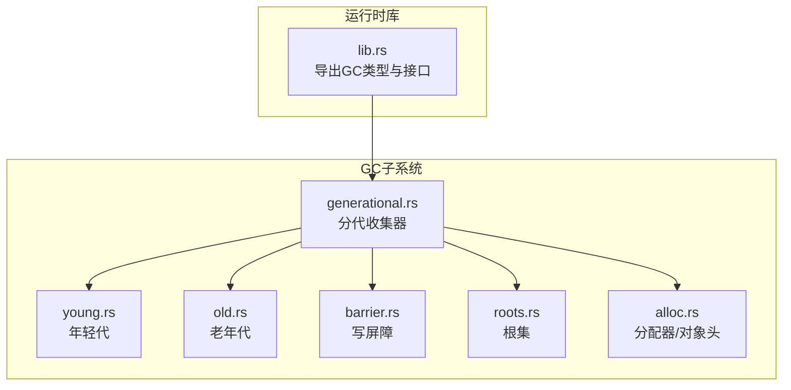
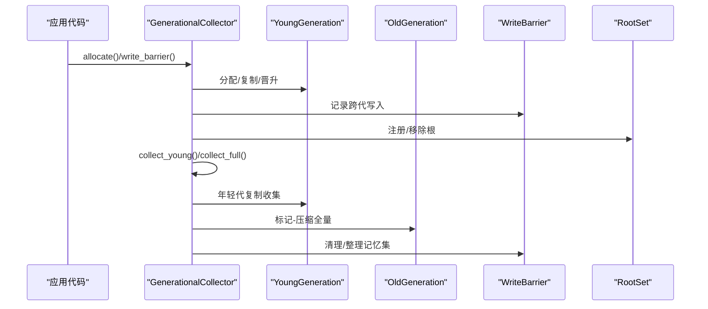
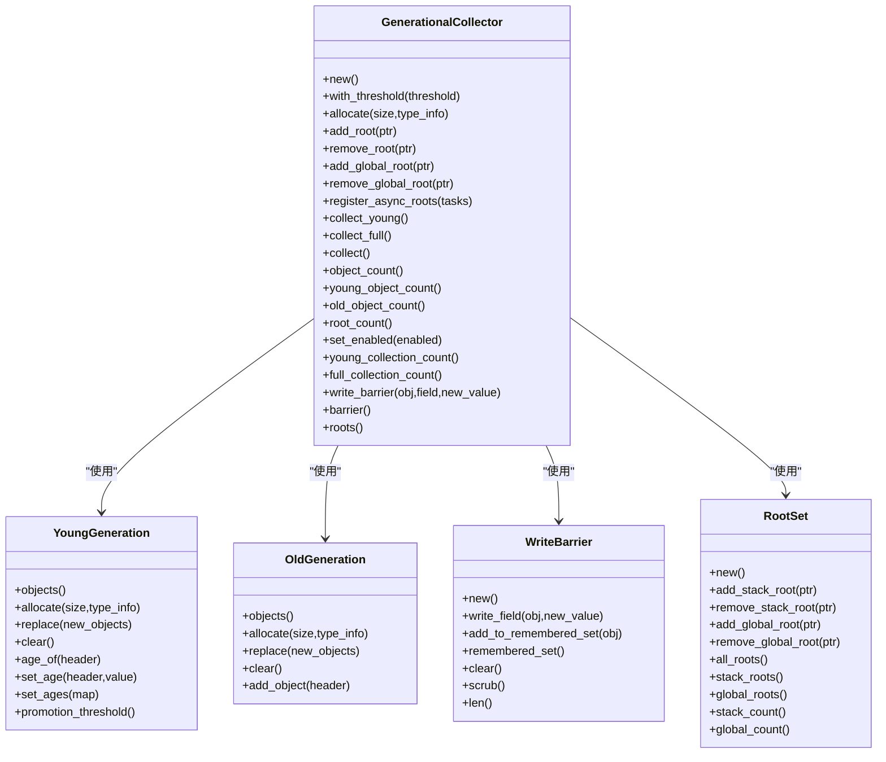
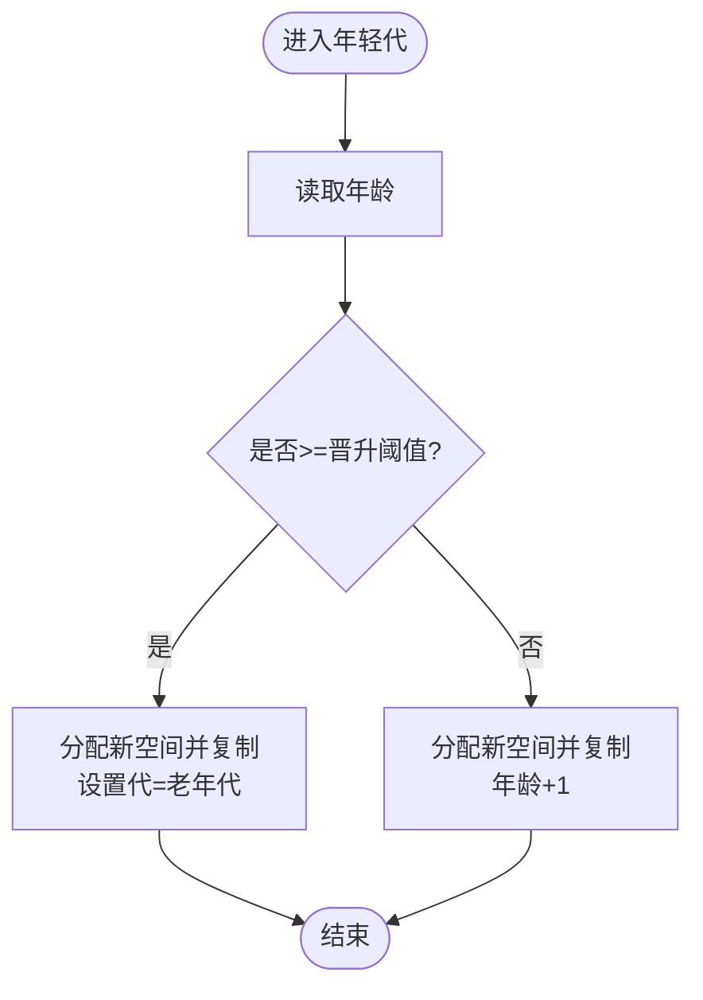
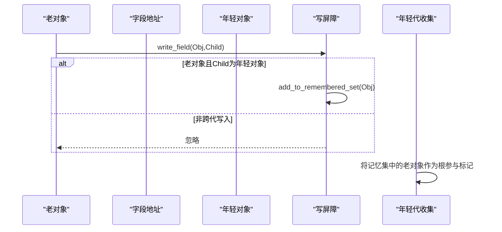
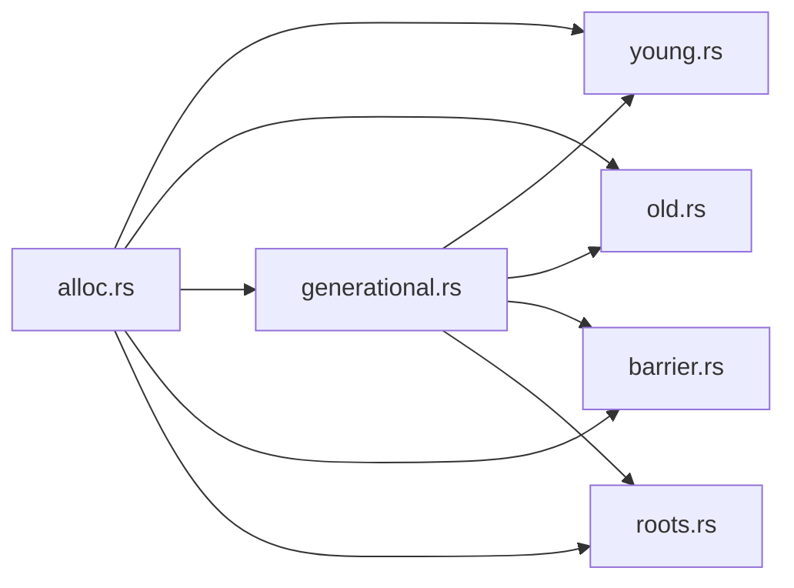

# 垃圾回收系统

<cite>
**本文引用的文件列表**
- [gc.rs](file://crates/ruyi_runtime/src/gc.rs)
- [generational.rs](file://crates/ruyi_runtime/src/gc/generational.rs)
- [barrier.rs](file://crates/ruyi_runtime/src/gc/barrier.rs)
- [young.rs](file://crates/ruyi_runtime/src/gc/young.rs)
- [old.rs](file://crates/ruyi_runtime/src/gc/old.rs)
- [roots.rs](file://crates/ruyi_runtime/src/gc/roots.rs)
- [alloc.rs](file://crates/ruyi_runtime/src/alloc.rs)
- [lib.rs](file://crates/ruyi_runtime/src/lib.rs)
- [gc_async_roots.rs](file://crates/ruyi_runtime/tests/gc_async_roots.rs)
- [gc_thread_local.rs](file://crates/ruyi_runtime/tests/gc_thread_local.rs)
</cite>

## 目录
1. [简介](#简介)
2. [项目结构](#项目结构)
3. [核心组件](#核心组件)
4. [架构总览](#架构总览)
5. [详细组件分析](#详细组件分析)
6. [依赖关系分析](#依赖关系分析)
7. [性能考量](#性能考量)
8. [故障排查指南](#故障排查指南)
9. [结论](#结论)
10. [附录](#附录)

## 简介
本文件系统性梳理 Ruyi 运行时的垃圾回收（GC）子系统，重点覆盖：
- 分代垃圾回收的设计与实现：年轻代（复制收集）与老年代（标记-压缩）的划分与协作
- 写屏障（Write Barrier）机制：跨代引用追踪与记忆集（Remembered Set）
- 根集（Root Set）管理：栈根、全局根的注册与扫描
- 标记-清除/标记-压缩算法的实现要点与优化
- 触发条件与回收策略：年轻代收集与全量收集的时机
- 内存分配与回收的性能优化建议
- 实际使用场景与测试用例路径

## 项目结构
Ruyi 的 GC 子系统位于运行时模块中，采用“按功能域分层”的组织方式：
- 核心入口与导出：在运行时库中统一导出 GC 类型与接口
- 分代收集器：集中于 generational 模块，协调年轻代、老年代、写屏障与根集
- 年轻代与老年代：独立模块，分别负责复制收集与标记压缩
- 写屏障与根集：作为支撑模块被分代收集器使用
- 分配器与对象头：定义对象布局、类型信息与分配/释放流程

图表来源
- [lib.rs:45-48](file://crates/ruyi_runtime/src/lib.rs#L45-L48)
- [generational.rs:21-29](file://crates/ruyi_runtime/src/gc/generational.rs#L21-L29)
- [young.rs:11-15](file://crates/ruyi_runtime/src/gc/young.rs#L11-L15)
- [old.rs:10-12](file://crates/ruyi_runtime/src/gc/old.rs#L10-L12)
- [barrier.rs:13-15](file://crates/ruyi_runtime/src/gc/barrier.rs#L13-L15)
- [roots.rs:11-14](file://crates/ruyi_runtime/src/gc/roots.rs#L11-L14)
- [alloc.rs:74-80](file://crates/ruyi_runtime/src/alloc.rs#L74-L80)

章节来源
- [lib.rs:45-48](file://crates/ruyi_runtime/src/lib.rs#L45-L48)
- [generational.rs:21-29](file://crates/ruyi_runtime/src/gc/generational.rs#L21-L29)

## 核心组件
- 分代收集器（GenerationalCollector）：协调年轻代复制收集、老年代标记压缩、写屏障与根集
- 年轻代（YoungGeneration）：新生对象的驻留区，支持年龄计数与晋升阈值
- 老年代（OldGeneration）：长期存活对象的区域，采用标记-压缩以减少碎片
- 写屏障（WriteBarrier）：跟踪跨代写入，维护记忆集以避免漏标
- 根集（RootSet）：栈根与全局根的集合，作为标记起点
- 分配器与对象头（alloc.rs）：定义对象布局、标志位（标记、固定、策略、代）、转发指针等

章节来源
- [generational.rs:21-29](file://crates/ruyi_runtime/src/gc/generational.rs#L21-L29)
- [young.rs:11-15](file://crates/ruyi_runtime/src/gc/young.rs#L11-L15)
- [old.rs:10-12](file://crates/ruyi_runtime/src/gc/old.rs#L10-L12)
- [barrier.rs:13-15](file://crates/ruyi_runtime/src/gc/barrier.rs#L13-L15)
- [roots.rs:11-14](file://crates/ruyi_runtime/src/gc/roots.rs#L11-L14)
- [alloc.rs:74-80](file://crates/ruyi_runtime/src/alloc.rs#L74-L80)

## 架构总览
分代收集器通过以下流程协同工作：
- 年轻代收集：从栈根+记忆集出发，复制可达对象到幸存区或晋升至老年代；未达阈值的对象年龄+1
- 全量收集：从所有根出发进行标记，复制/移动存活对象，更新内部引用；清理记忆集
- 写屏障：在老对象写入年轻对象前将其加入记忆集，确保下次年轻代收集时将其视为额外根
- 根集管理：栈根与全局根均被置为“固定”状态，防止在复制/压缩阶段被移动

图表来源
- [generational.rs:146-267](file://crates/ruyi_runtime/src/gc/generational.rs#L146-L267)
- [generational.rs:269-381](file://crates/ruyi_runtime/src/gc/generational.rs#L269-L381)
- [barrier.rs:13-15](file://crates/ruyi_runtime/src/gc/barrier.rs#L13-L15)
- [roots.rs:11-14](file://crates/ruyi_runtime/src/gc/roots.rs#L11-L14)

## 详细组件分析

### 分代收集器（GenerationalCollector）
- 设计目标：利用“弱代假说”，将大部分回收集中在年轻代，降低全量收集频率
- 关键职责：
  - 年轻代收集：复制可达对象，处理晋升与年龄增长
  - 全量收集：标记-压缩，处理跨代引用与根集
  - 写屏障集成：维护记忆集，保证跨代引用不被遗漏
  - 根集管理：统一管理栈根与全局根
- 收集策略：
  - 年轻代收集：基于工作列表（worklist）递归追踪，复制/晋升同时完成
  - 全量收集：先清零标记位，再从根集开始深度优先标记，最后复制/移动并更新引用

图表来源
- [generational.rs:21-29](file://crates/ruyi_runtime/src/gc/generational.rs#L21-L29)
- [young.rs:11-15](file://crates/ruyi_runtime/src/gc/young.rs#L11-L15)
- [old.rs:10-12](file://crates/ruyi_runtime/src/gc/old.rs#L10-L12)
- [barrier.rs:13-15](file://crates/ruyi_runtime/src/gc/barrier.rs#L13-L15)
- [roots.rs:11-14](file://crates/ruyi_runtime/src/gc/roots.rs#L11-L14)

章节来源
- [generational.rs:31-521](file://crates/ruyi_runtime/src/gc/generational.rs#L31-L521)

### 年轻代（YoungGeneration）
- 特点：新对象首先进入年轻代（Eden），随后经历多次年轻代收集
- 关键机制：
  - 年龄计数：记录对象在年轻代存活轮次，达到阈值后晋升
  - 晋升阈值：可配置，默认值为3
  - 复制收集：可达对象复制到幸存区或晋升到老年代，未达阈值则年龄+1
- 数据结构：对象列表与年龄映射表

图表来源
- [young.rs:17-77](file://crates/ruyi_runtime/src/gc/young.rs#L17-L77)
- [generational.rs:430-455](file://crates/ruyi_runtime/src/gc/generational.rs#L430-L455)

章节来源
- [young.rs:17-77](file://crates/ruyi_runtime/src/gc/young.rs#L17-L77)

### 老年代（OldGeneration）
- 特点：长期存活对象驻留于此，采用标记-压缩以减少碎片
- 关键机制：
  - 直接分配：直接在老年代分配对象并标记为老代
  - 对象替换：全量收集后用新的存活对象列表替换旧列表
- 与年轻代配合：年轻代晋升对象与全量收集中的老年代对象共同构成老年代集合

章节来源
- [old.rs:14-57](file://crates/ruyi_runtime/src/gc/old.rs#L14-L57)

### 写屏障（WriteBarrier）
- 目标：跟踪跨代写入，避免老对象丢失对年轻对象的可达性
- 记忆集（Remembered Set）：记录所有“老对象持有年轻对象指针”的集合
- 工作流程：
  - 在写入前调用写屏障，若写入目标为老对象且新值指向年轻对象，则将老对象加入记忆集
  - 年轻代收集时，将记忆集中的老对象作为额外根参与标记
  - 全量收集后清理记忆集，或在清扫阶段剔除已失效条目

图表来源
- [barrier.rs:13-80](file://crates/ruyi_runtime/src/gc/barrier.rs#L13-L80)
- [generational.rs:146-267](file://crates/ruyi_runtime/src/gc/generational.rs#L146-L267)

章节来源
- [barrier.rs:13-80](file://crates/ruyi_runtime/src/gc/barrier.rs#L13-L80)

### 根集（RootSet）
- 栈根：当前活跃函数帧中的局部变量，必须保持固定（不可移动）
- 全局根：模块级静态变量，同样需要固定
- 管理策略：
  - 注册时将对象置为固定，防止在复制/压缩过程中被移动
  - 提供栈根与全局根的独立集合，便于区分与统计
  - 提供一次性合并查询（all_roots）

章节来源
- [roots.rs:16-122](file://crates/ruyi_runtime/src/gc/roots.rs#L16-L122)

### 标记-清除与标记-压缩
- 标记-清除（Mark-Sweep）：用于基准实现，流程清晰但会产生碎片
  - 清空标记位 → 从根集开始递归标记 → 清扫未标记对象
- 标记-压缩（Mark-Compact）：用于老年代与全量收集
  - 清空标记位 → 从根集开始递归标记 → 复制/移动存活对象到连续空间 → 更新内部引用
- 优化点：
  - 使用工作列表（worklist）替代递归，避免栈溢出
  - 引用更新在复制完成后统一执行，减少重复遍历

章节来源
- [gc.rs:19-192](file://crates/ruyi_runtime/src/gc.rs#L19-L192)
- [generational.rs:269-514](file://crates/ruyi_runtime/src/gc/generational.rs#L269-L514)

### 触发条件与回收策略
- 年轻代收集（Minor GC）：
  - 当年轻代对象存在且有可达对象时触发
  - 标记起点：栈根 + 记忆集（由写屏障维护）
- 全量收集（Full GC）：
  - 当年轻代收集无法满足需求或显式触发时进行
  - 标记起点：所有根（栈根 + 全局根 + 记忆集）
- 异步任务根扫描：
  - 在全量收集前扫描挂起的异步任务，提取其中可能的 GC 指针作为根

章节来源
- [generational.rs:146-144](file://crates/ruyi_runtime/src/gc/generational.rs#L146-L144)
- [generational.rs:269-381](file://crates/ruyi_runtime/src/gc/generational.rs#L269-L381)

### 内存分配与对象头
- 对象头（GcObjectHeader）：
  - 标志位：标记位、固定位、策略位、代位
  - 转发指针：复制/压缩阶段用于更新内部引用
  - 类型信息与大小：用于追踪与销毁
- 分配器（ruyi_alloc/ruyi_dealloc）：
  - 在系统分配器之上封装，附加对象头
  - 支持重分配，保留对象头并移动到新位置

章节来源
- [alloc.rs:74-181](file://crates/ruyi_runtime/src/alloc.rs#L74-L181)
- [alloc.rs:233-298](file://crates/ruyi_runtime/src/alloc.rs#L233-L298)

## 依赖关系分析
- 组件耦合：
  - GenerationalCollector 依赖 YoungGeneration、OldGeneration、WriteBarrier、RootSet
  - 所有模块共享 alloc.rs 中的对象头与分配器
- 外部依赖：
  - 标准库同步原语（Mutex、AtomicUsize）用于并发安全
  - 分配器委托系统分配器，未来可替换为专用内存池

图表来源
- [generational.rs:5-10](file://crates/ruyi_runtime/src/gc/generational.rs#L5-L10)
- [young.rs:4-5](file://crates/ruyi_runtime/src/gc/young.rs#L4-L5)
- [old.rs:3-4](file://crates/ruyi_runtime/src/gc/old.rs#L3-L4)
- [barrier.rs:1-6](file://crates/ruyi_runtime/src/gc/barrier.rs#L1-L6)
- [roots.rs:1-6](file://crates/ruyi_runtime/src/gc/roots.rs#L1-L6)

章节来源
- [generational.rs:5-10](file://crates/ruyi_runtime/src/gc/generational.rs#L5-L10)

## 性能考量
- 年轻代收集为主：
  - 通过晋升阈值控制晋升频率，减少老年代压力
  - 复制收集仅扫描存活对象，时间复杂度近似 O(n)
- 写屏障成本：
  - 每次跨代写入需检查并可能添加到记忆集，应尽量减少不必要的跨代写
- 根集扫描：
  - 栈根与全局根数量直接影响标记阶段开销，应避免冗余根
- 全量收集代价：
  - 标记-压缩涉及复制与引用更新，应尽量降低触发频率
- 建议优化实践：
  - 合理设置晋升阈值，结合对象生命周期调整
  - 减少频繁的跨代写入，或在热点路径上缓存中间结果
  - 控制根集规模，及时移除不再使用的根
  - 利用异步任务根扫描机制，确保挂起任务不会导致泄漏

## 故障排查指南
- 常见问题与定位方法：
  - 对象提前回收：检查根集是否正确注册与移除，确认写屏障是否被调用
  - 跨代引用丢失：确认写屏障在老对象写入年轻对象前被调用
  - 异步任务泄漏：确保在任务完成后移除根，必要时调用异步根扫描
- 测试参考：
  - 异步根扫描测试：验证挂起任务中的 GC 指针被正确识别并存活
  - 线程本地 GC 测试：验证线程隔离与并发安全性
  - 分代晋升测试：验证对象在多次年轻代收集后正确晋升

章节来源
- [gc_async_roots.rs:46-143](file://crates/ruyi_runtime/tests/gc_async_roots.rs#L46-L143)
- [gc_thread_local.rs:17-225](file://crates/ruyi_runtime/tests/gc_thread_local.rs#L17-L225)

## 结论
Ruyi 的垃圾回收系统以分代为核心，结合写屏障与根集管理，实现了高效且可控的内存回收。年轻代复制收集承担主要回收负载，老年代采用标记-压缩减少碎片，写屏障与记忆集有效解决了跨代引用问题。通过合理的晋升阈值与根集管理，可以在保证正确性的前提下获得良好的吞吐与延迟表现。

## 附录
- 使用场景示例（测试用例路径）：
  - 异步任务根扫描：[gc_async_roots.rs:46-143](file://crates/ruyi_runtime/tests/gc_async_roots.rs#L46-L143)
  - 线程本地 GC 隔离：[gc_thread_local.rs:38-74](file://crates/ruyi_runtime/tests/gc_thread_local.rs#L38-L74)
  - 分代晋升与全量收集：[generational.rs:558-626](file://crates/ruyi_runtime/src/gc/generational.rs#L558-L626)
- 接口与导出：
  - 运行时导出 GC 类型与接口：[lib.rs:45-48](file://crates/ruyi_runtime/src/lib.rs#L45-L48)