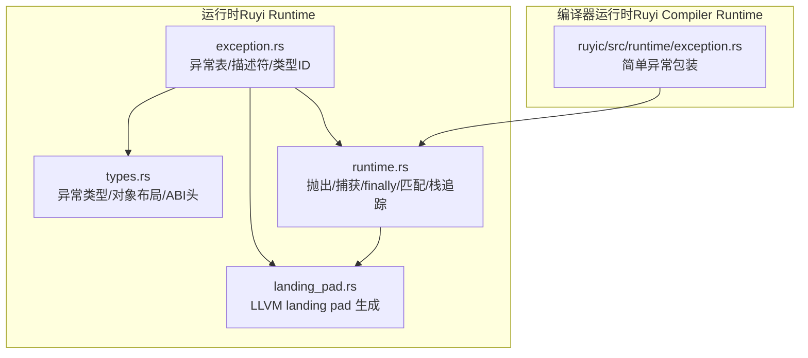
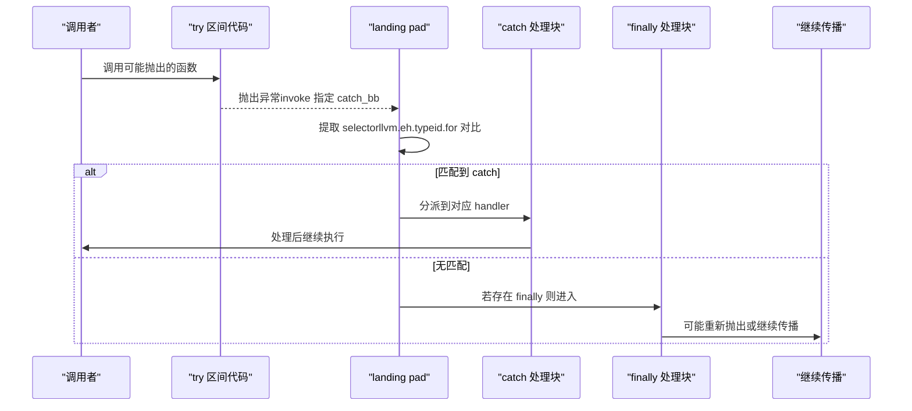
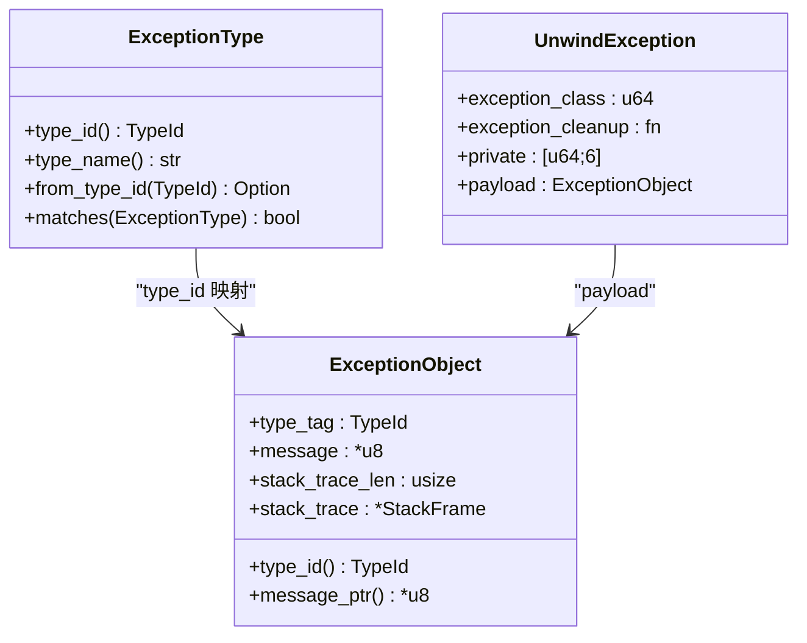
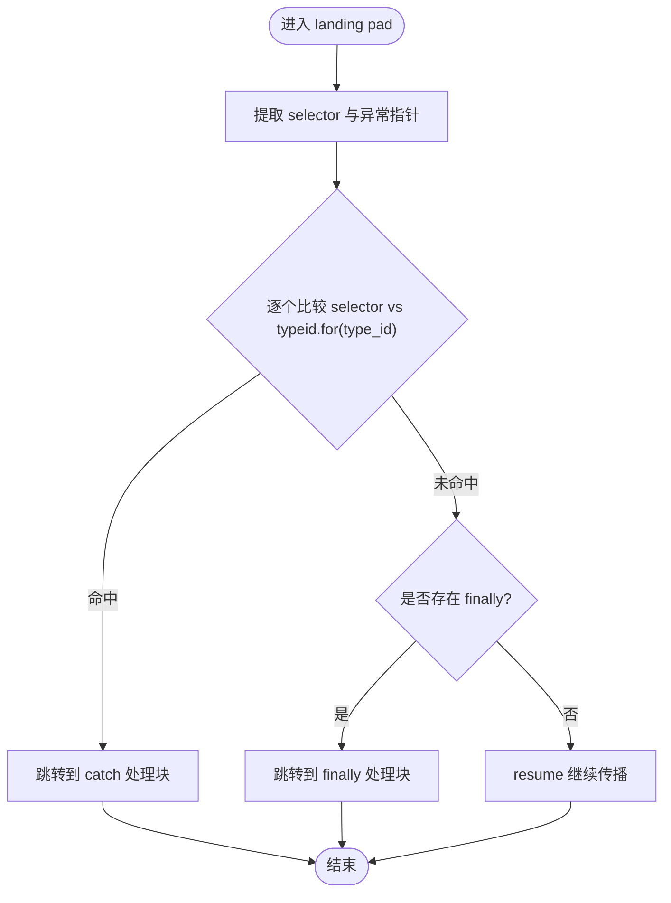
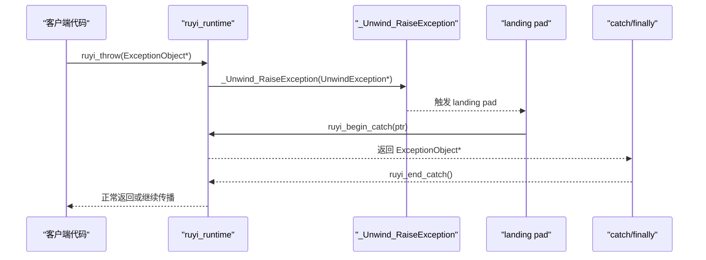
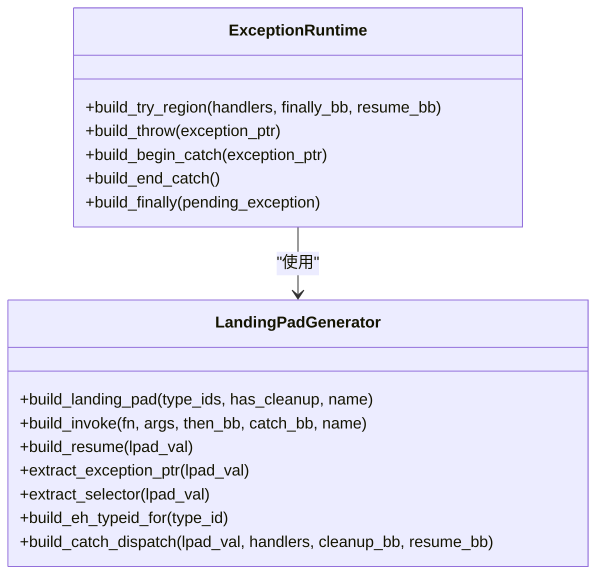
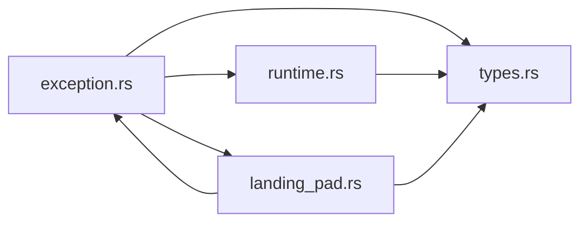

# 异常处理系统

<cite>
**本文引用的文件**
- [exception.rs](file://crates/ruyi_runtime/src/exception.rs)
- [runtime.rs](file://crates/ruyi_runtime/src/exception/runtime.rs)
- [types.rs](file://crates/ruyi_runtime/src/exception/types.rs)
- [landing_pad.rs](file://crates/ruyi_runtime/src/exception/landing_pad.rs)
- [exception.rs（运行时测试）](file://crates/ruyi_runtime/tests/exception.rs)
- [exception.rs（编译器运行时）](file://crates/ruyic/src/runtime/exception.rs)
- [error_handling.ry](file://examples/error_handling.ry)
- [try_catch.ry](file://examples/try_catch.ry)
- [try_catch_basic.ry](file://crates/ruyic/tests/integration/cases/exception/try_catch_basic.ry)
- [try_catch_nested.ry](file://crates/ruyic/tests/integration/cases/exception/try_catch_nested.ry)
- [try_finally.ry](file://crates/ruyic/tests/integration/cases/exception/try_finally.ry)
- [throw_across_functions.ry](file://crates/ruyic/tests/integration/cases/exception/throw_across_functions.ry)
</cite>

## 目录
1. [简介](#简介)
2. [项目结构](#项目结构)
3. [核心组件](#核心组件)
4. [架构总览](#架构总览)
5. [详细组件分析](#详细组件分析)
6. [依赖关系分析](#依赖关系分析)
7. [性能考量](#性能考量)
8. [故障排查指南](#故障排查指南)
9. [结论](#结论)
10. [附录](#附录)

## 简介
本文件系统性梳理 Ruyi 的异常处理体系，围绕“零成本异常”理念与 LLVM Itanium C++ ABI 的落地实践展开，覆盖以下主题：
- 零成本异常的设计思想与实现要点
- LLVM Landing Pad 机制、异常表生成与运行时分派
- 异常对象结构、类型注册与匹配、传播与栈帧管理
- try-catch-finally 的运行时实现与 finally 保证
- 性能优化建议与调试技巧
- 实际使用示例与测试用例参考

## 项目结构
Ruyi 将异常处理分为三层：
- 运行时数据结构与匹配：定义异常类型、异常对象布局、异常表与 landing pad 描述符等
- 运行时函数与 LLVM 代码生成辅助：提供抛出、捕获、finally、栈追踪等能力，并通过 Inkwell 生成 landing pad/eh 指令
- 编译器侧运行时：为语言内置错误类型提供最小化运行时支持

图表来源
- [exception.rs:1-377](file://crates/ruyi_runtime/src/exception.rs#L1-L377)
- [types.rs:1-167](file://crates/ruyi_runtime/src/exception/types.rs#L1-L167)
- [runtime.rs:1-359](file://crates/ruyi_runtime/src/exception/runtime.rs#L1-L359)
- [landing_pad.rs:1-222](file://crates/ruyi_runtime/src/exception/landing_pad.rs#L1-L222)
- [exception.rs（编译器运行时）:1-22](file://crates/ruyic/src/runtime/exception.rs#L1-L22)

章节来源
- [exception.rs:1-377](file://crates/ruyi_runtime/src/exception.rs#L1-L377)
- [types.rs:1-167](file://crates/ruyi_runtime/src/exception/types.rs#L1-L167)
- [runtime.rs:1-359](file://crates/ruyi_runtime/src/exception/runtime.rs#L1-L359)
- [landing_pad.rs:1-222](file://crates/ruyi_runtime/src/exception/landing_pad.rs#L1-L222)
- [exception.rs（编译器运行时）:1-22](file://crates/ruyic/src/runtime/exception.rs#L1-L22)

## 核心组件
- 类型与标识
  - TypeId：全局唯一异常类型标识，用于 catch 匹配与 llvm.eh.typeid.for
  - 内置类型 ID：ANY、ERROR、TYPE_ERROR、RANGE_ERROR、RUNTIME_ERROR
- 异常对象与布局
  - ExceptionObject：包含 type_tag、message、stack_trace_len、stack_trace
  - UnwindException：Itanium ABI 头部，包含 exception_class、exception_cleanup、private、payload
- 异常表与 landing pad
  - FunctionExceptionTable/ExceptionTableEntry/CatchClause：记录受保护范围、landing pad 偏移、catch 子句与 finally 标记
  - LandingPadDescriptor/LandingPadAction：描述 landing pad 的动作序列与目标块
- 运行时函数
  - ruyi_throw/ruiyi_begin_catch/ruyi_end_catch/ruyi_finally/ruyi_match_exception/capture_stack_trace
- LLVM 生成辅助
  - LandingPadGenerator：生成 landingpad/invoke/resume、提取指针/选择器、构建 catch 分发链
  - ExceptionRuntime：封装 ruyi_* 函数调用、构建 try 区域

章节来源
- [exception.rs:9-229](file://crates/ruyi_runtime/src/exception.rs#L9-L229)
- [types.rs:8-111](file://crates/ruyi_runtime/src/exception/types.rs#L8-L111)
- [runtime.rs:24-121](file://crates/ruyi_runtime/src/exception/runtime.rs#L24-L121)
- [landing_pad.rs:18-210](file://crates/ruyi_runtime/src/exception/landing_pad.rs#L18-L210)

## 架构总览
Ruyi 的异常处理遵循 Itanium C++ ABI 的“零成本异常”模型：在未抛出异常时，不引入额外开销；仅在 try/catch 区间内插入 landing pad/invoke 指令，异常发生时由运行时/库完成栈展开与处理器分派。

图表来源
- [runtime.rs:123-277](file://crates/ruyi_runtime/src/exception/runtime.rs#L123-L277)
- [landing_pad.rs:39-190](file://crates/ruyi_runtime/src/exception/landing_pad.rs#L39-L190)

## 详细组件分析

### 组件一：异常类型与对象布局
- 异常类型层次
  - ExceptionType：Error、TypeError、RangeError、RuntimeError
  - type_id/from_type_id/type_name/matches：类型到 ID 的映射与匹配规则
- 异常对象布局
  - ExceptionObject：C 兼容布局，包含 type_tag、message、stack_trace_len、stack_trace
  - UnwindException：Itanium ABI 头部，payload 为 ExceptionObject
  - KLANG_EXCEPTION_CLASS：区分 Ruyi 异常与其他语言异常
- 设计要点
  - 通过 TypeId 与 llvm.eh.typeid.for 完成 O(1) 比较
  - 捕获时通过 __cxa_begin_catch/__cxa_end_catch 维护活动异常状态
  - finally 通过 ruyi_finally 传递 pending_exception，确保 finally 块执行且异常可被再次抛出

图表来源
- [types.rs:8-111](file://crates/ruyi_runtime/src/exception/types.rs#L8-L111)

章节来源
- [types.rs:8-167](file://crates/ruyi_runtime/src/exception/types.rs#L8-L167)

### 组件二：异常表与 landing pad 描述
- FunctionExceptionTable/ExceptionTableEntry/CatchClause
  - 记录每个函数内的 try 区间、landing pad 偏移、catch 子句列表、是否包含 finally
  - matching_handler：按顺序匹配第一个匹配的 catch 子句
- LandingPadDescriptor/LandingPadAction
  - 动作序列：Catch/Filter/Cleanup
  - 目标标签：catch_block/cleanup_block
- 运行时查找
  - entry_for_pc：根据当前指令偏移定位所属 try 区间

图表来源
- [landing_pad.rs:136-190](file://crates/ruyi_runtime/src/exception/landing_pad.rs#L136-L190)
- [exception.rs:33-100](file://crates/ruyi_runtime/src/exception.rs#L33-L100)

章节来源
- [exception.rs:33-149](file://crates/ruyi_runtime/src/exception.rs#L33-L149)
- [landing_pad.rs:18-210](file://crates/ruyi_runtime/src/exception/landing_pad.rs#L18-L210)

### 组件三：运行时抛出、捕获与 finally
- ruyi_throw
  - 分配 UnwindException，填充 exception_class、exception_cleanup、payload
  - 调用 _Unwind_RaiseException 启动栈展开
- ruyi_begin_catch/ruyi_end_catch
  - 通过 __cxa_begin_catch/__cxa_end_catch 维护活动异常指针
- ruyi_finally
  - 返回 pending_exception，允许 finally 执行后重新抛出
- ruyi_match_exception
  - 将 ExceptionObject 的 type_tag 映射为 ExceptionType 后进行匹配
- capture_stack_trace
  - 当前返回占位，未来可接入 unwind 库

图表来源
- [runtime.rs:24-83](file://crates/ruyi_runtime/src/exception/runtime.rs#L24-L83)
- [types.rs:93-111](file://crates/ruyi_runtime/src/exception/types.rs#L93-L111)

章节来源
- [runtime.rs:24-121](file://crates/ruyi_runtime/src/exception/runtime.rs#L24-L121)

### 组件四：LLVM 代码生成（Inkwell）
- LandingPadGenerator
  - build_landing_pad：生成 landingpad 结构 {i8*, i32}，绑定 __gxx_personality_v0
  - build_invoke/build_resume：生成 invoke 与 resume
  - build_eh_typeid_for：生成 llvm.eh.typeid.for 调用
  - build_catch_dispatch：基于 selector 的条件分支链
- ExceptionRuntime
  - build_try_region：组合 landing pad 与 catch/finally 分派
  - build_throw/build_begin_catch/build_end_catch/build_finally：生成对 ruyi_* 的调用

图表来源
- [landing_pad.rs:18-210](file://crates/ruyi_runtime/src/exception/landing_pad.rs#L18-L210)
- [runtime.rs:123-277](file://crates/ruyi_runtime/src/exception/runtime.rs#L123-L277)

章节来源
- [landing_pad.rs:18-222](file://crates/ruyi_runtime/src/exception/landing_pad.rs#L18-L222)
- [runtime.rs:123-277](file://crates/ruyi_runtime/src/exception/runtime.rs#L123-L277)

### 组件五：编译器运行时与示例
- 编译器运行时（ruyic/src/runtime/exception.rs）
  - 提供最简异常包装与 throw 辅助，便于早期集成与测试
- 示例与测试
  - examples/error_handling.ry：涵盖 try/catch/finally、多 catch、自定义错误类型、never 类型、finally 保证
  - examples/try_catch.ry：基础 try-catch-finally 示例
  - crates/ruyic/tests/integration/cases/exception/*：集成测试用例，验证嵌套、跨函数传播、finally 行为

章节来源
- [exception.rs（编译器运行时）:1-22](file://crates/ruyic/src/runtime/exception.rs#L1-L22)
- [error_handling.ry:1-230](file://examples/error_handling.ry#L1-L230)
- [try_catch.ry:1-14](file://examples/try_catch.ry#L1-L14)
- [try_catch_basic.ry:1-5](file://crates/ruyic/tests/integration/cases/exception/try_catch_basic.ry#L1-L5)
- [try_catch_nested.ry:1-10](file://crates/ruyic/tests/integration/cases/exception/try_catch_nested.ry#L1-L10)
- [try_finally.ry:1-5](file://crates/ruyic/tests/integration/cases/exception/try_finally.ry#L1-L5)
- [throw_across_functions.ry:1-11](file://crates/ruyic/tests/integration/cases/exception/throw_across_functions.ry#L1-L11)

## 依赖关系分析
- 模块耦合
  - exception.rs 为核心容器，聚合 types.rs、runtime.rs、landing_pad.rs 的能力
  - runtime.rs 依赖 types.rs 的异常对象布局与 ABI 头
  - landing_pad.rs 依赖 exception.rs 的 TypeId 与 types.rs 的 ExceptionType
  - 运行时测试依赖 exception.rs 与 runtime.rs 的公共接口
- 外部依赖
  - Itanium C++ ABI 与 LLVM EH 指令族（landingpad/invoke/resume/llvm.eh.typeid.for）
  - _Unwind_RaiseException 作为栈展开入口
  - __gxx_personality_v0 作为 Itanium 个性函数

图表来源
- [exception.rs:1-5](file://crates/ruyi_runtime/src/exception.rs#L1-L5)
- [runtime.rs:22-22](file://crates/ruyi_runtime/src/exception/runtime.rs#L22-L22)
- [landing_pad.rs:6-13](file://crates/ruyi_runtime/src/exception/landing_pad.rs#L6-L13)

章节来源
- [exception.rs:1-5](file://crates/ruyi_runtime/src/exception.rs#L1-L5)
- [runtime.rs:22-22](file://crates/ruyi_runtime/src/exception/runtime.rs#L22-L22)
- [landing_pad.rs:6-13](file://crates/ruyi_runtime/src/exception/landing_pad.rs#L6-L13)

## 性能考量
- 零开销原则
  - 未使用 try/catch 时不引入任何额外指令或数据结构
  - landing pad 仅在 try 区间内存在，且只在异常路径上执行
- 指令级优化
  - 使用 llvm.eh.typeid.for 与整数比较替代字符串/复杂匹配
  - landing pad 结构体 {i8*, i32} 便于寄存器复用与分支预测
- 内存与分配
  - UnwindException 在抛出时动态分配，清理由 exception_cleanup 回收
  - ExceptionObject 采用 C 兼容布局，避免不必要的拷贝
- 匹配策略
  - catch 子句按顺序匹配，优先放置最可能命中的类型以减少比较次数
- finally 保证
  - 通过 ruyi_finally 传递 pending_exception，确保 finally 执行且异常可被再次抛出，避免资源泄漏

[本节为通用性能指导，无需特定文件来源]

## 故障排查指南
- 常见问题
  - catch 未命中：检查 ExceptionType::matches 与 catch 子句顺序；确认 type_id 是否正确
  - finally 未执行：确认 invoke 指令是否正确连接到 landing pad 与 finally 块
  - 异常未传播：检查 build_resume 是否在所有未匹配分支中调用
  - 类型不匹配：核对 llvm.eh.typeid.for 生成的全局符号名与 TypeId 一致
- 调试技巧
  - 使用运行时测试验证匹配逻辑与 finally 行为
  - 在 landing pad 中打印 selector 与 typeid.for 结果，辅助定位匹配失败原因
  - 逐步缩小 try 区间，定位具体抛出点
  - 对比集成测试输出与期望结果，确保 finally 与嵌套 try 的行为符合预期

章节来源
- [exception.rs（运行时测试）:124-231](file://crates/ruyi_runtime/tests/exception.rs#L124-L231)
- [runtime.rs:28-83](file://crates/ruyi_runtime/src/exception/runtime.rs#L28-L83)
- [landing_pad.rs:136-190](file://crates/ruyi_runtime/src/exception/landing_pad.rs#L136-L190)

## 结论
Ruyi 的异常处理系统以 Itanium ABI 为基础，结合 LLVM EH 指令族，实现了“零成本异常”的核心理念。通过 TypeId 驱动的快速匹配、C 兼容的异常对象布局以及完善的 landing pad 生成与分派机制，系统在保证正确性的同时兼顾了性能与可维护性。未来可在栈追踪采集、类型注册自动化与更丰富的 catch 语法支持方面进一步完善。

[本节为总结性内容，无需特定文件来源]

## 附录

### 使用示例与最佳实践
- 基础 try-catch-finally
  - 参考示例：examples/try_catch.ry、examples/error_handling.ry
  - 集成测试：crates/ruyic/tests/integration/cases/exception/*
- 最佳实践
  - catch 子句从最具体到最宽泛排序，提升匹配效率
  - finally 用于释放资源，避免在多个 return/throw 前重复编写清理逻辑
  - 自定义错误类型应实现清晰的 message 与字段，便于诊断

章节来源
- [try_catch.ry:1-14](file://examples/try_catch.ry#L1-L14)
- [error_handling.ry:1-230](file://examples/error_handling.ry#L1-L230)
- [try_catch_basic.ry:1-5](file://crates/ruyic/tests/integration/cases/exception/try_catch_basic.ry#L1-L5)
- [try_catch_nested.ry:1-10](file://crates/ruyic/tests/integration/cases/exception/try_catch_nested.ry#L1-L10)
- [try_finally.ry:1-5](file://crates/ruyic/tests/integration/cases/exception/try_finally.ry#L1-L5)
- [throw_across_functions.ry:1-11](file://crates/ruyic/tests/integration/cases/exception/throw_across_functions.ry#L1-L11)