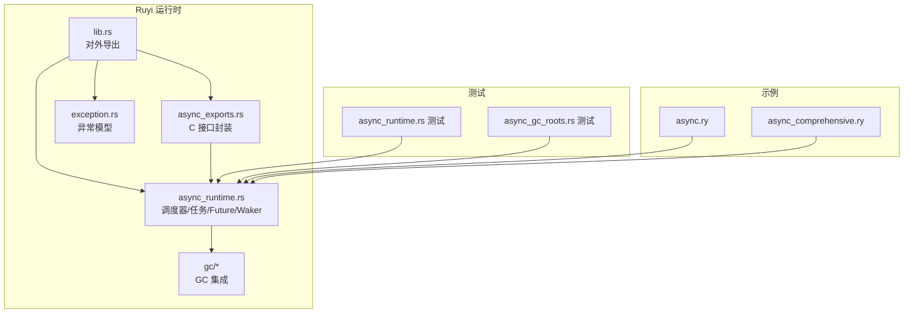
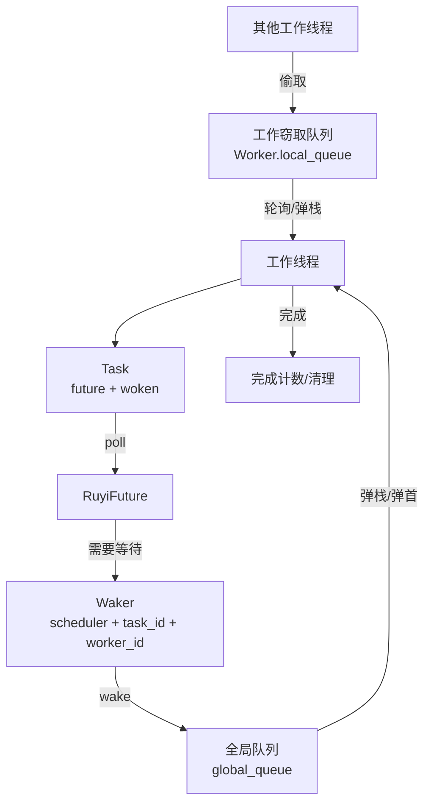
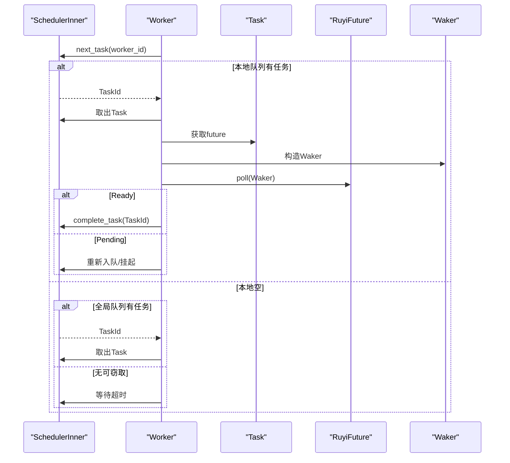
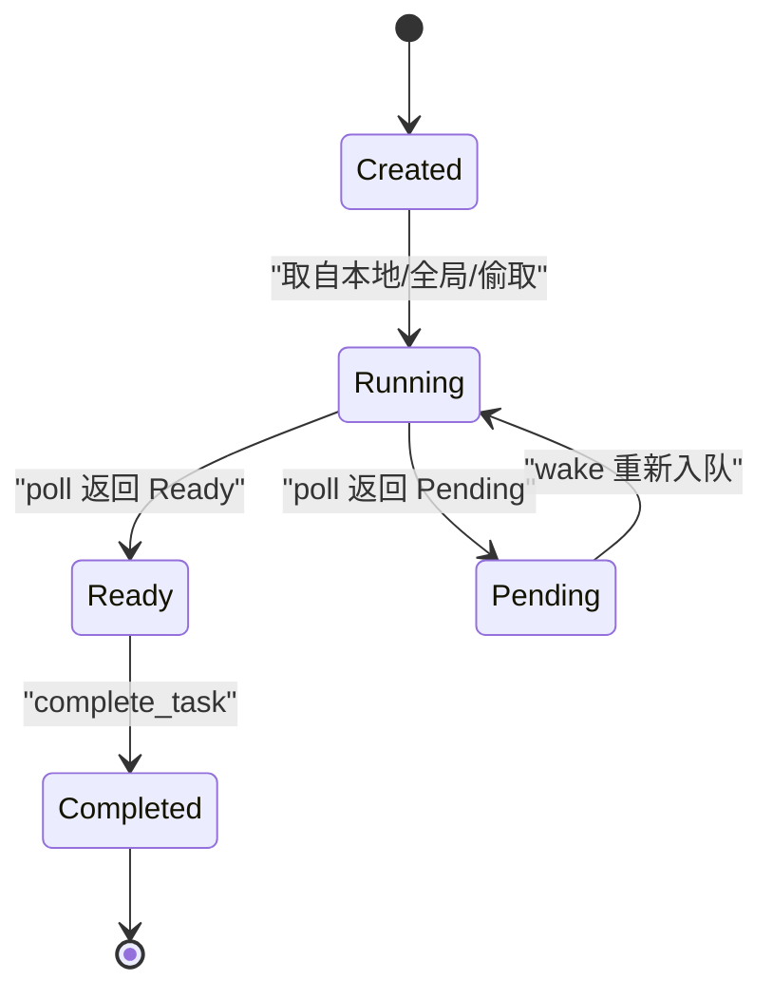
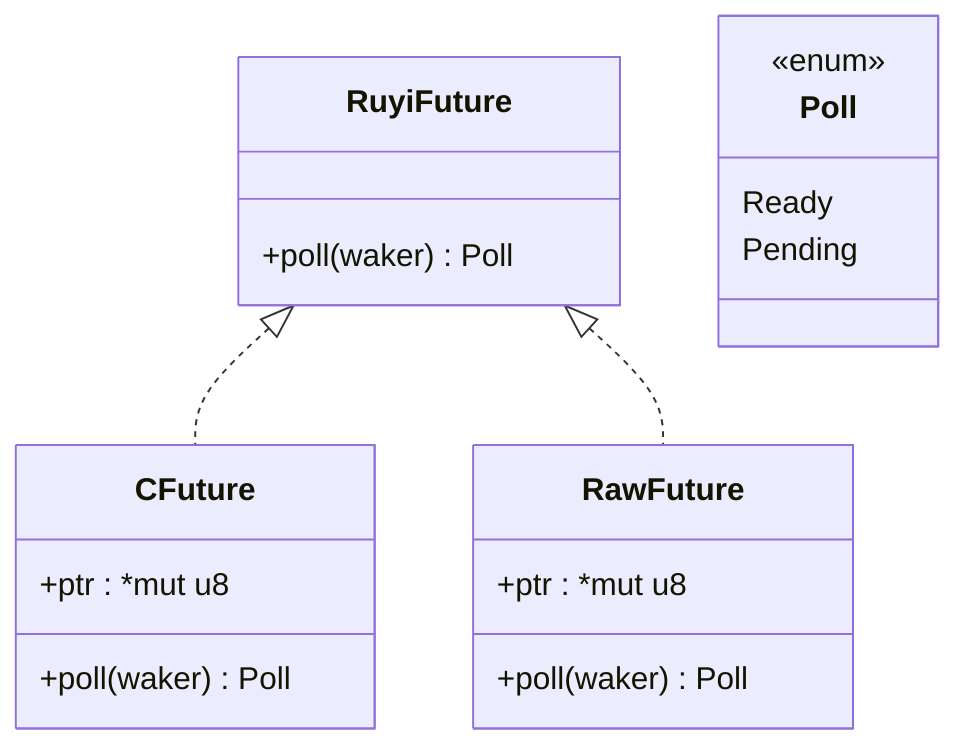
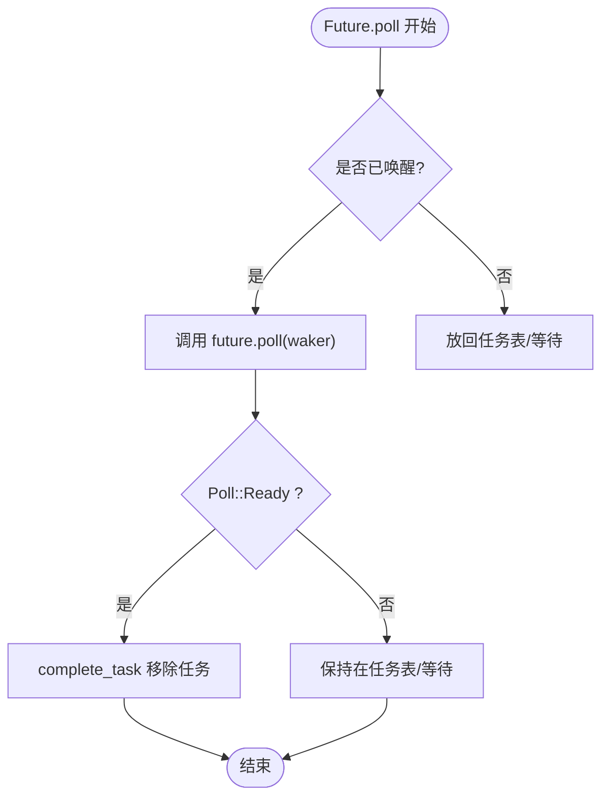
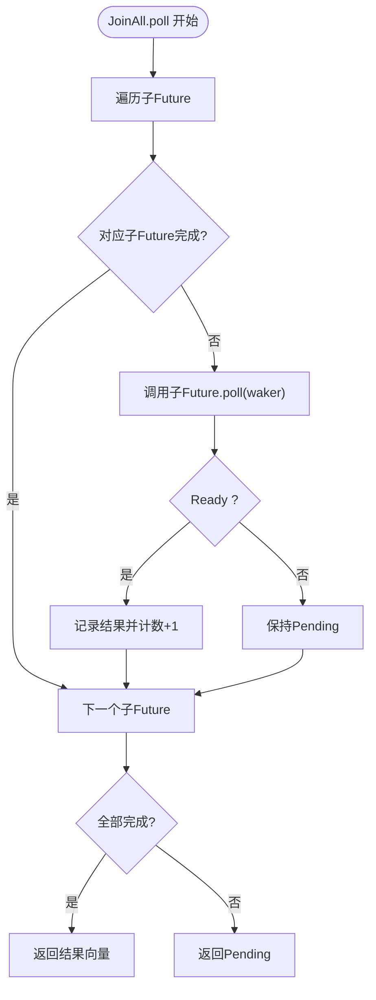
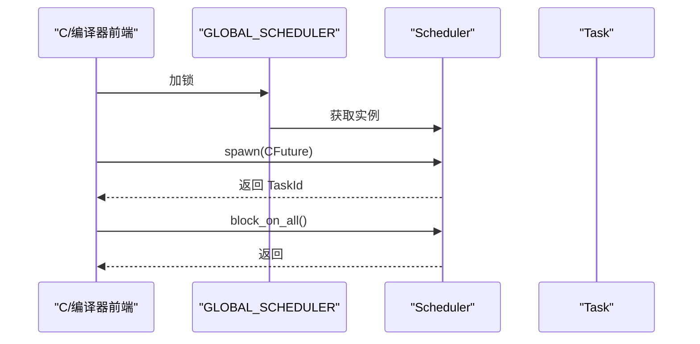
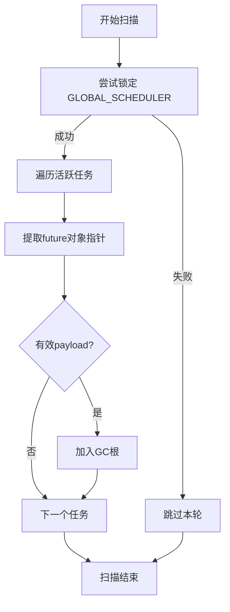
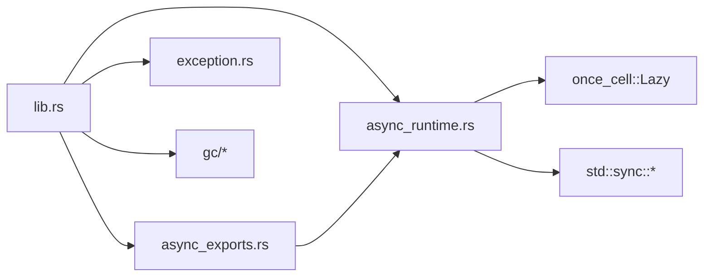

# 异步运行时

<cite>
**本文引用的文件**
- [lib.rs](file://crates/ruyi_runtime/src/lib.rs)
- [async_runtime.rs](file://crates/ruyi_runtime/src/async_runtime.rs)
- [async_exports.rs](file://crates/ruyi_runtime/src/async_exports.rs)
- [async_runtime 测试](file://crates/ruyi_runtime/tests/async_runtime.rs)
- [async_gc_roots 测试](file://crates/ruyi_runtime/tests/async_gc_roots.rs)
- [异常模块](file://crates/ruyi_runtime/src/exception.rs)
- [Cargo.toml](file://crates/ruyi_runtime/Cargo.toml)
- [异步示例](file://examples/async.ry)
- [综合异步示例](file://examples/async_comprehensive.ry)
</cite>

## 目录
1. [简介](#简介)
2. [项目结构](#项目结构)
3. [核心组件](#核心组件)
4. [架构总览](#架构总览)
5. [详细组件分析](#详细组件分析)
6. [依赖关系分析](#依赖关系分析)
7. [性能考量](#性能考量)
8. [故障排查指南](#故障排查指南)
9. [结论](#结论)
10. [附录：最佳实践与示例](#附录最佳实践与示例)

## 简介
本文件面向Ruyi异步运行时系统，围绕工作窃取调度器（Work Stealing Scheduler）、任务管理、Future类型与异步等待机制、Waker系统、并发组合器（JoinAll、Race）、全局调度器（GLOBAL_SCHEDULER）以及GC集成进行系统化梳理。文档以循序渐进的方式呈现从高层概念到代码级实现的全貌，并提供可视化图示、流程图与实践建议，帮助读者快速掌握Ruyi的异步执行模型与工程化使用方法。

## 项目结构
Ruyi异步运行时位于 crates/ruyi_runtime 子包中，核心源码集中在 async_runtime.rs，配套导出接口在 async_exports.rs，对外通过 lib.rs 暴露类型与函数；测试用例覆盖调度器、组合器、GC根注册等场景；示例脚本展示异步语法与并发模式。

图表来源
- [lib.rs:1-50](file://crates/ruyi_runtime/src/lib.rs#L1-L50)
- [async_runtime.rs:1-120](file://crates/ruyi_runtime/src/async_runtime.rs#L1-L120)
- [async_exports.rs:1-92](file://crates/ruyi_runtime/src/async_exports.rs#L1-L92)
- [异常模块:1-60](file://crates/ruyi_runtime/src/exception.rs#L1-L60)

章节来源
- [lib.rs:1-50](file://crates/ruyi_runtime/src/lib.rs#L1-L50)
- [Cargo.toml:1-17](file://crates/ruyi_runtime/Cargo.toml#L1-L17)

## 核心组件
- 调度器与工作线程：基于工作窃取的多线程调度器，每个工作线程维护本地队列，支持全局队列与跨线程“偷取”。
- 任务与任务ID：Task 封装 Future 与唤醒标记；TaskId 唯一标识任务。
- Future 抽象：RuyiFuture 定义 poll 行为与唤醒契约；Poll 表示 Ready/Pending。
- Waker：携带调度器引用与任务信息，用于唤醒被阻塞的任务。
- 并发组合器：JoinAll 并行等待所有 Future 完成；Race 返回首个完成的 Future 结果。
- 全局调度器：GLOBAL_SCHEDULER 提供单实例懒加载锁保护的调度器，便于C接口调用。
- GC 集成：register_async_roots 将活跃异步任务对象作为GC根扫描，避免悬挂引用被回收。

章节来源
- [async_runtime.rs:26-136](file://crates/ruyi_runtime/src/async_runtime.rs#L26-L136)
- [async_runtime.rs:138-314](file://crates/ruyi_runtime/src/async_runtime.rs#L138-L314)
- [async_runtime.rs:421-455](file://crates/ruyi_runtime/src/async_runtime.rs#L421-L455)
- [async_runtime.rs:457-540](file://crates/ruyi_runtime/src/async_runtime.rs#L457-L540)

## 架构总览
Ruyi异步运行时采用“绿色线程+工作窃取”的架构：
- 工作线程循环从本地队列取出任务，若无本地任务则尝试从全局队列或其它工作线程“偷取”。
- 任务在 poll 期间可生成 Waker，当资源就绪时调用 wake 将任务重新入队。
- 全局调度器统一管理任务生命周期与GC根注册，C接口通过 GLOBAL_SCHEDULER 与外部交互。

图表来源
- [async_runtime.rs:140-249](file://crates/ruyi_runtime/src/async_runtime.rs#L140-L249)
- [async_runtime.rs:316-357](file://crates/ruyi_runtime/src/async_runtime.rs#L316-L357)

## 详细组件分析

### 工作窃取调度器（Scheduler）
- 组成
  - SchedulerInner：共享状态（各工作线程、全局队列、任务表、活动计数、条件变量、关闭标志）。
  - Worker：每个工作线程拥有一个 WorkStealingDeque 本地队列。
  - Scheduler：对外API（spawn、block_on_all、shutdown、active_tasks）。
- 关键行为
  - 任务分配：next_id 分配 TaskId；spawn_task 插入本地队列并通知等待的工作线程。
  - 任务调度：next_task 优先本地队列，其次全局队列，最后跨线程偷取。
  - 任务完成：complete_task 移除任务并更新活动计数，必要时唤醒等待线程。
  - 工作线程循环：worker_loop 在无任务时短暂休眠，避免忙等。

图表来源
- [async_runtime.rs:162-249](file://crates/ruyi_runtime/src/async_runtime.rs#L162-L249)
- [async_runtime.rs:316-357](file://crates/ruyi_runtime/src/async_runtime.rs#L316-L357)

章节来源
- [async_runtime.rs:138-314](file://crates/ruyi_runtime/src/async_runtime.rs#L138-L314)

### 任务管理与生命周期
- Task 结构：包含 TaskId、Box<dyn RuyiFuture>、woken 标志。
- TaskId：唯一标识，由原子自增分配。
- 生命周期
  - 创建：spawn_task 插入任务表，增加活动计数。
  - 执行：worker_loop 取出任务，构造 Waker 调用 poll。
  - 完成：Ready 后 complete_task 清理并减少活动计数。
  - 销毁：任务表移除，等待线程被唤醒。

图表来源
- [async_runtime.rs:75-92](file://crates/ruyi_runtime/src/async_runtime.rs#L75-L92)
- [async_runtime.rs:186-244](file://crates/ruyi_runtime/src/async_runtime.rs#L186-L244)

章节来源
- [async_runtime.rs:71-92](file://crates/ruyi_runtime/src/async_runtime.rs#L71-L92)
- [async_runtime.rs:181-244](file://crates/ruyi_runtime/src/async_runtime.rs#L181-L244)

### Future 类型与异步等待机制
- Poll：Ready/ Pending 两种结果，驱动状态机推进。
- RuyiFuture：定义 poll 方法，要求在 Pending 时通过 Waker 注册唤醒。
- C 接口桥接：CFuture/RawFuture 将编译器生成的原生状态机包装为 RuyiFuture，通过 ruyi_async_poll 实现 poll 调用。
- ruyi_await：非工作线程调用时，将原生future包装为任务并挂起当前线程，直到任务完成。

图表来源
- [async_runtime.rs:28-47](file://crates/ruyi_runtime/src/async_runtime.rs#L28-L47)
- [async_runtime.rs:359-382](file://crates/ruyi_runtime/src/async_runtime.rs#L359-L382)
- [async_exports.rs:19-41](file://crates/ruyi_runtime/src/async_exports.rs#L19-L41)

章节来源
- [async_runtime.rs:28-47](file://crates/ruyi_runtime/src/async_runtime.rs#L28-L47)
- [async_runtime.rs:384-420](file://crates/ruyi_runtime/src/async_runtime.rs#L384-L420)
- [async_exports.rs:12-41](file://crates/ruyi_runtime/src/async_exports.rs#L12-L41)

### Waker 系统与任务唤醒
- Waker 包含：调度器引用、原始工作者ID、任务ID。
- wake：将任务标记为已唤醒并推入全局队列，通知等待中的工作线程。
- 测试辅助：test_waker 构造用于测试的 Waker。

图表来源
- [async_runtime.rs:62-67](file://crates/ruyi_runtime/src/async_runtime.rs#L62-L67)
- [async_runtime.rs:206-214](file://crates/ruyi_runtime/src/async_runtime.rs#L206-L214)
- [async_runtime.rs:324-347](file://crates/ruyi_runtime/src/async_runtime.rs#L324-L347)

章节来源
- [async_runtime.rs:51-67](file://crates/ruyi_runtime/src/async_runtime.rs#L51-L67)
- [async_runtime.rs:206-214](file://crates/ruyi_runtime/src/async_runtime.rs#L206-L214)

### 并发组合器：JoinAll 与 Race
- JoinAll：收集多个 Future 的结果，全部完成后返回向量。
- Race：返回第一个完成的 Future 的结果。
- 两者均实现 RuyiFuture，内部遍历子 Future 并复用传入的 Waker。

图表来源
- [async_runtime.rs:459-509](file://crates/ruyi_runtime/src/async_runtime.rs#L459-L509)

章节来源
- [async_runtime.rs:457-540](file://crates/ruyi_runtime/src/async_runtime.rs#L457-L540)

### 全局调度器（GLOBAL_SCHEDULER）
- 单例懒加载：Lazy<Mutex<Scheduler>>，默认1个工作线程。
- 用途：C接口与非工作线程环境下的统一入口；GC根注册扫描。
- C 导出：ruyi_spawn、ruyi_wake_task、ruyi_run_scheduler、ruyi_async_poll。

图表来源
- [async_runtime.rs:421-424](file://crates/ruyi_runtime/src/async_runtime.rs#L421-L424)
- [async_runtime.rs:392-400](file://crates/ruyi_runtime/src/async_runtime.rs#L392-L400)
- [async_exports.rs:67-91](file://crates/ruyi_runtime/src/async_exports.rs#L67-L91)

章节来源
- [async_runtime.rs:421-424](file://crates/ruyi_runtime/src/async_runtime.rs#L421-L424)
- [async_exports.rs:43-91](file://crates/ruyi_runtime/src/async_exports.rs#L43-L91)

### GC 集成与根注册
- register_async_roots：扫描当前活跃任务的堆对象指针，将其加入GC根集合，防止被回收。
- 与异常的协作：AsyncException 捕获异常并在等待上下文中重新抛出，保证异常语义一致。

图表来源
- [async_runtime.rs:426-455](file://crates/ruyi_runtime/src/async_runtime.rs#L426-L455)
- [async_gc_roots 测试:31-90](file://crates/ruyi_runtime/tests/async_gc_roots.rs#L31-L90)

章节来源
- [async_runtime.rs:426-455](file://crates/ruyi_runtime/src/async_runtime.rs#L426-L455)
- [async_gc_roots 测试:31-90](file://crates/ruyi_runtime/tests/async_gc_roots.rs#L31-L90)

## 依赖关系分析
- 内部依赖
  - lib.rs 对外导出 async_runtime 中的类型与函数，同时暴露 GC、异常等能力。
  - async_runtime.rs 依赖 once_cell::sync::Lazy、std::sync::Mutex/Condvar、std::collections::VecDeque 等标准库同步原语。
  - async_exports.rs 依赖 GLOBAL_SCHEDULER 与 Waker/TaskId。
- 外部依赖
  - once_cell：提供 Lazy 初始化。
  - inkwell（可选特性）：用于LLVM IR类型映射与代码生成支持。

图表来源
- [lib.rs:1-50](file://crates/ruyi_runtime/src/lib.rs#L1-L50)
- [async_runtime.rs:12-16](file://crates/ruyi_runtime/src/async_runtime.rs#L12-L16)
- [async_exports.rs:10-11](file://crates/ruyi_runtime/src/async_exports.rs#L10-L11)

章节来源
- [lib.rs:1-50](file://crates/ruyi_runtime/src/lib.rs#L1-L50)
- [Cargo.toml:11-17](file://crates/ruyi_runtime/Cargo.toml#L11-L17)

## 性能考量
- 工作窃取策略
  - 本地队列优先，降低锁竞争；全局队列与跨线程偷取平衡负载。
  - worker_loop 在无任务时短时间休眠，避免忙等。
- 唤醒路径
  - wake 将任务推入全局队列，避免直接竞争本地队列锁。
- GC 根扫描
  - register_async_roots 仅扫描活跃任务，避免不必要的开销。
- 并发组合器
  - JoinAll/Race 顺序遍历子任务，复杂度 O(n)，适合小规模并发组合。

章节来源
- [async_runtime.rs:216-237](file://crates/ruyi_runtime/src/async_runtime.rs#L216-L237)
- [async_runtime.rs:348-356](file://crates/ruyi_runtime/src/async_runtime.rs#L348-L356)
- [async_runtime.rs:429-455](file://crates/ruyi_runtime/src/async_runtime.rs#L429-L455)

## 故障排查指南
- 任务未完成
  - 检查是否在非工作线程调用 ruyi_await，确保通过 GLOBAL_SCHEDULER 正常挂起与唤醒。
  - 使用 active_tasks 观察活动任务数量，确认是否存在死锁或未唤醒。
- 唤醒无效
  - 确认 Waker 的 worker_id 与 task_id 与实际一致；检查 wake 是否被调用。
- GC 回收导致悬挂
  - 确保在 GC 前后正确调用 register_async_roots；验证根集合包含未来对象指针。
- 组合器结果异常
  - JoinAll/Race 的子任务需满足 Unpin 约束；检查 poll 返回值与唤醒逻辑。

章节来源
- [async_runtime.rs:392-400](file://crates/ruyi_runtime/src/async_runtime.rs#L392-L400)
- [async_runtime.rs:429-455](file://crates/ruyi_runtime/src/async_runtime.rs#L429-L455)
- [async_runtime 测试:103-122](file://crates/ruyi_runtime/tests/async_runtime.rs#L103-L122)

## 结论
Ruyi异步运行时以工作窃取调度器为核心，结合 Waker 唤醒机制、Future 抽象与并发组合器，构建了轻量、可扩展的绿色线程执行模型。通过 GLOBAL_SCHEDULER 与C接口桥接，实现了与编译器前端的无缝对接；通过 register_async_roots 与GC集成，保障了内存安全。该设计在保证易用性的同时，兼顾了性能与可维护性，适合在嵌入式与高性能场景中部署。

## 附录：最佳实践与示例

### 最佳实践
- 合理设置工作线程数量：根据CPU核数与I/O密集度调整 num_workers。
- 避免长时间阻塞：尽量将阻塞操作包装为可轮询的Future，配合 Waker 唤醒。
- 控制组合器规模：JoinAll/Race 适用于小规模并发，大规模并发建议分组处理。
- 明确异常传播：使用 AsyncException 或异常模块提供的工具，在等待上下文中正确重抛异常。
- GC 根注册：在每次 GC 前调用 register_async_roots，确保活跃任务可达。

### 示例参考
- 基础异步示例：展示 async/await 语法与顺序/并发执行对比。
- 综合异步示例：演示异步编程概念（箭头函数、迭代器、异常处理）。

章节来源
- [异步示例:1-28](file://examples/async.ry#L1-L28)
- [综合异步示例:1-141](file://examples/async_comprehensive.ry#L1-L141)