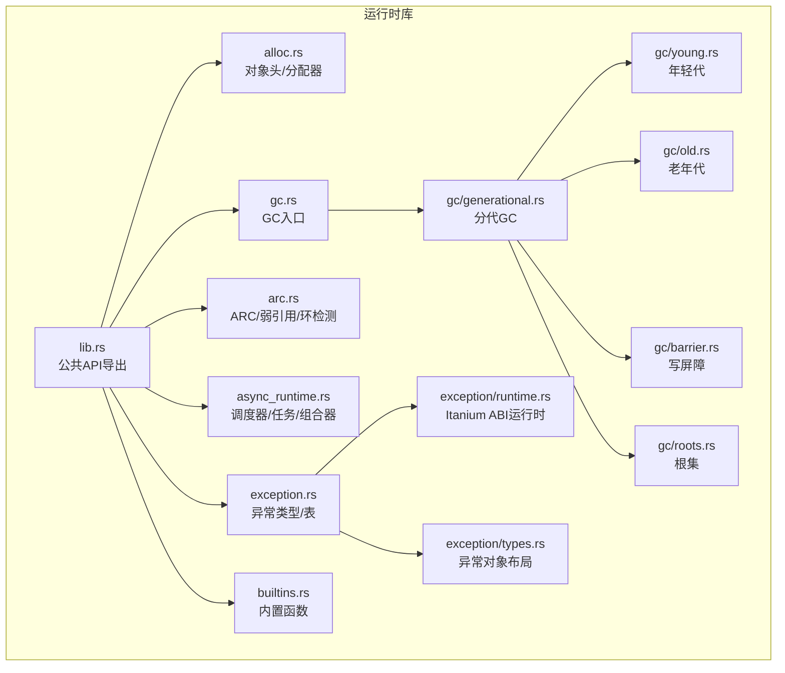
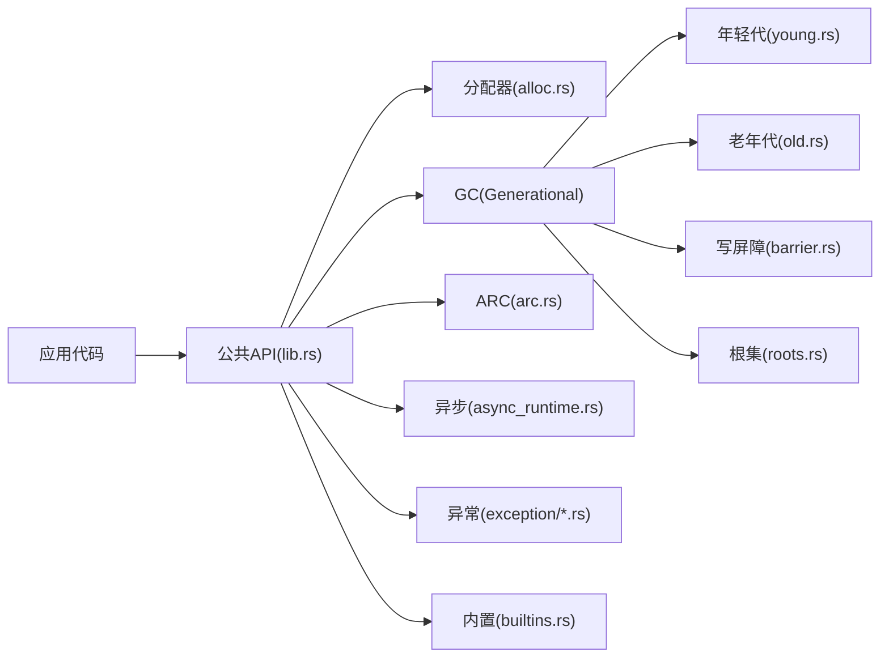
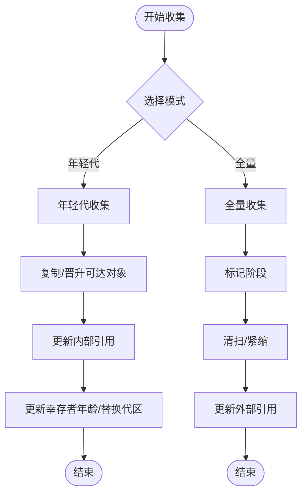
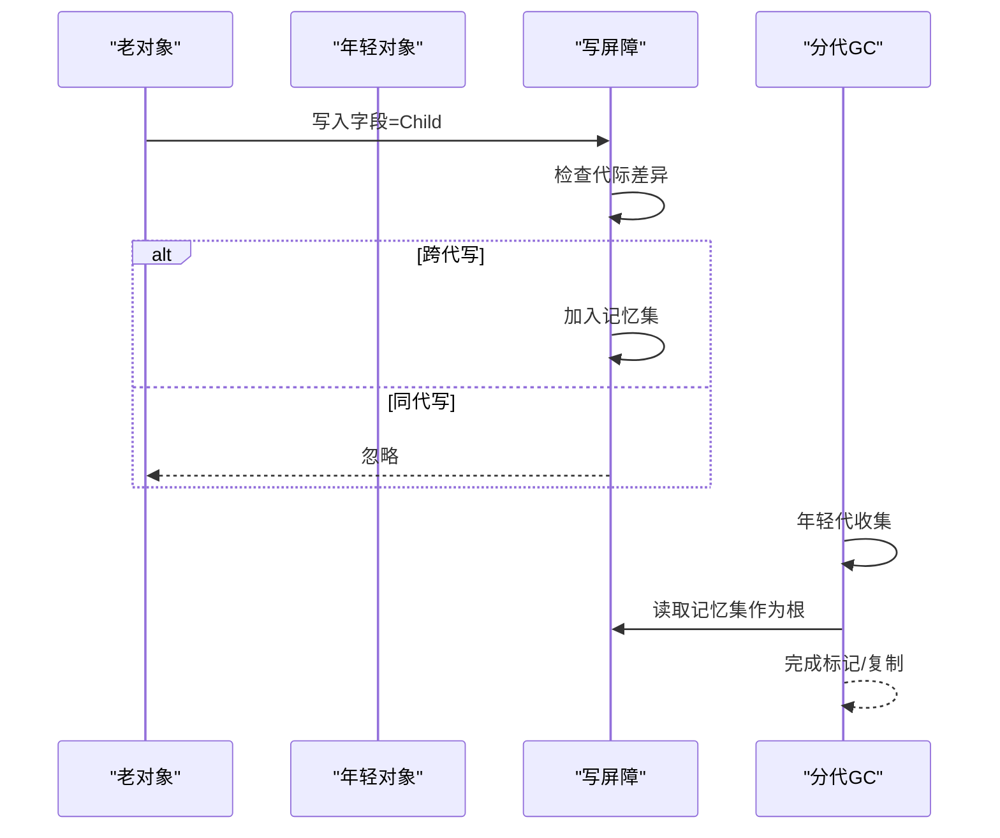
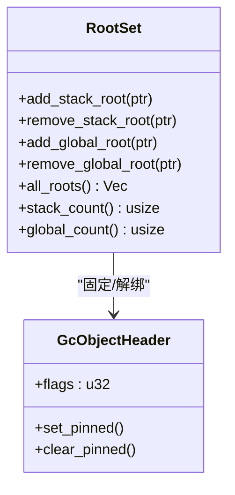
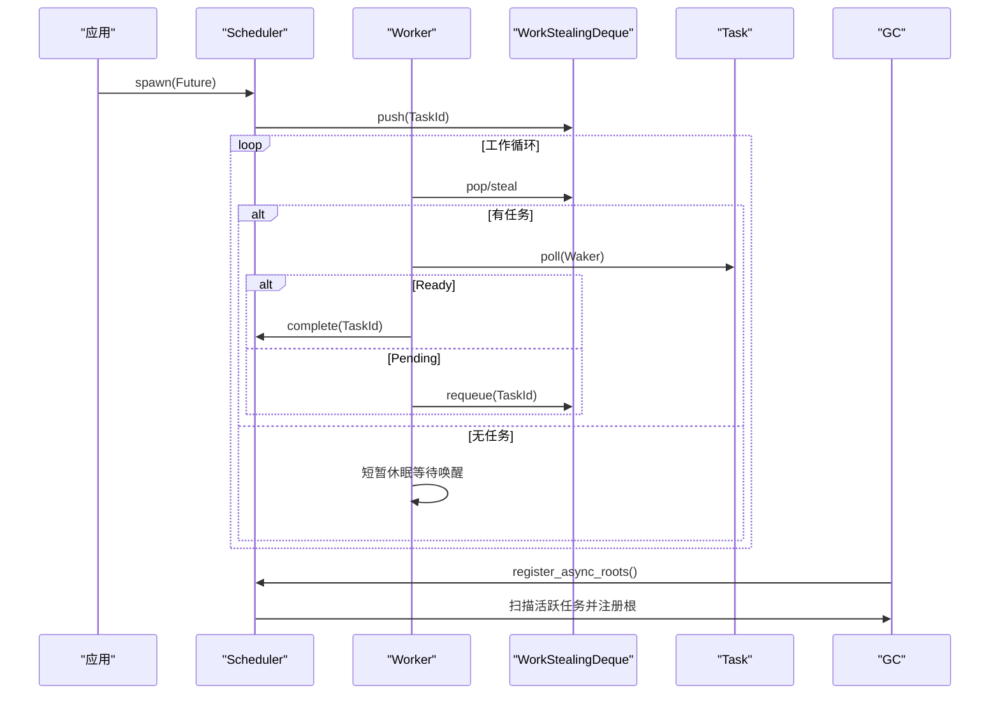
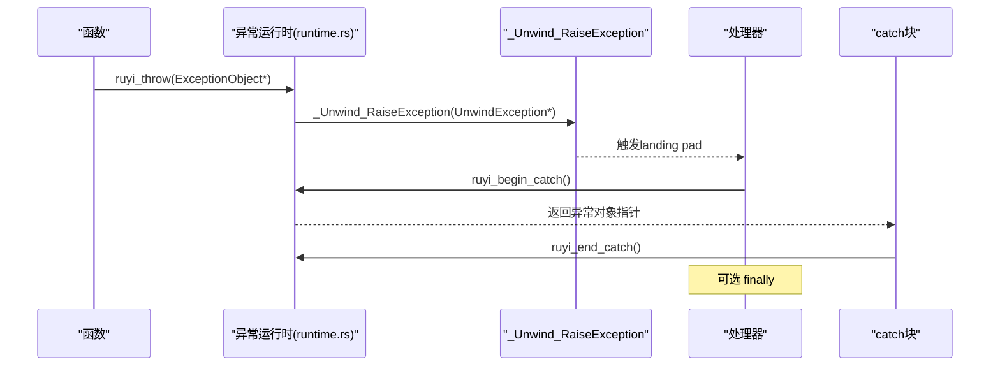
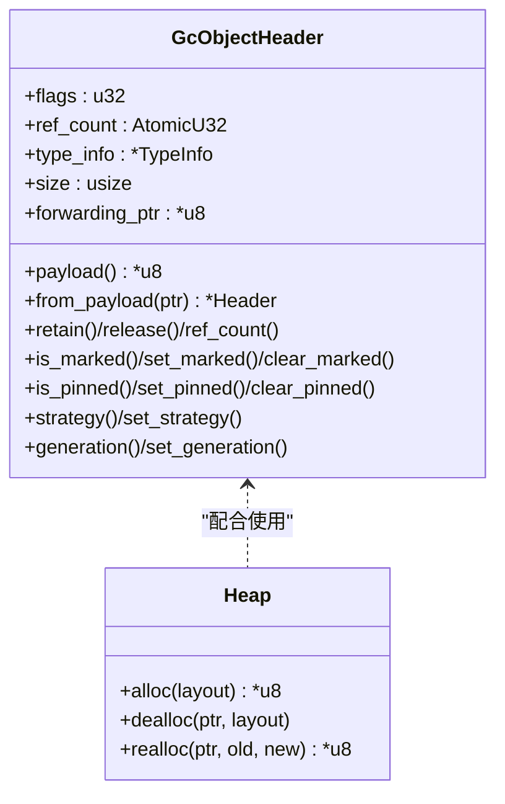
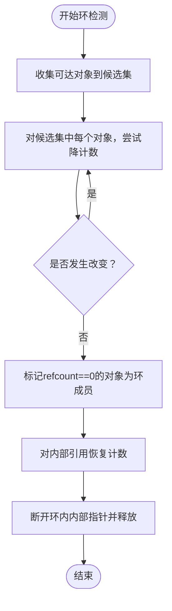
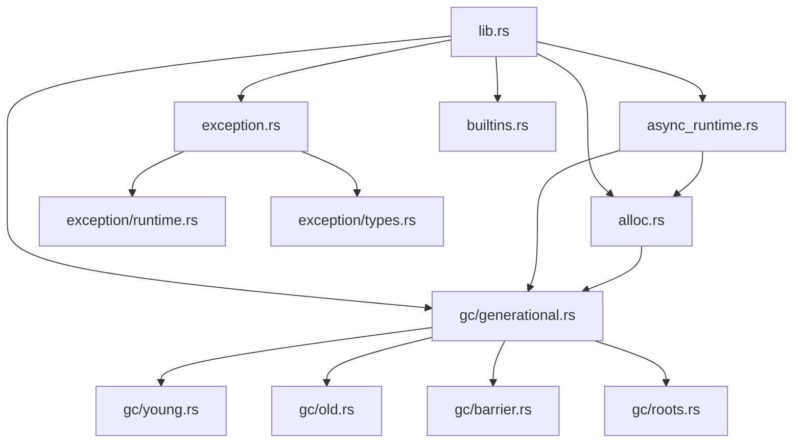

# 运行时系统

<cite>
**本文档引用的文件**
- [lib.rs](file://crates/ruyi_runtime/src/lib.rs)
- [Cargo.toml](file://crates/ruyi_runtime/Cargo.toml)
- [gc.rs](file://crates/ruyi_runtime/src/gc.rs)
- [generational.rs](file://crates/ruyi_runtime/src/gc/generational.rs)
- [young.rs](file://crates/ruyi_runtime/src/gc/young.rs)
- [old.rs](file://crates/ruyi_runtime/src/gc/old.rs)
- [barrier.rs](file://crates/ruyi_runtime/src/gc/barrier.rs)
- [roots.rs](file://crates/ruyi_runtime/src/gc/roots.rs)
- [alloc.rs](file://crates/ruyi_runtime/src/alloc.rs)
- [arc.rs](file://crates/ruyi_runtime/src/arc.rs)
- [async_runtime.rs](file://crates/ruyi_runtime/src/async_runtime.rs)
- [exception.rs](file://crates/ruyi_runtime/src/exception.rs)
- [runtime.rs](file://crates/ruyi_runtime/src/exception/runtime.rs)
- [types.rs](file://crates/ruyi_runtime/src/exception/types.rs)
- [builtins.rs](file://crates/ruyi_runtime/src/builtins.rs)
</cite>

## 目录
1. [简介](#简介)
2. [项目结构](#项目结构)
3. [核心组件](#核心组件)
4. [架构总览](#架构总览)
5. [详细组件分析](#详细组件分析)
6. [依赖分析](#依赖分析)
7. [性能考虑](#性能考虑)
8. [故障排查指南](#故障排查指南)
9. [结论](#结论)
10. [附录](#附录)

## 简介
本文件为 Ruyi 运行时系统的全面技术文档，覆盖运行时的核心子系统：垃圾回收（GC）、自动引用计数（ARC）、异步运行时、异常处理、内存分配器以及内置运行时函数。文档从系统架构入手，逐步深入到各模块的数据结构、算法流程与交互关系，并提供性能优化建议与调试技巧，帮助开发者在理解设计思想的同时高效使用与扩展运行时。

## 项目结构
ruyi_runtime 是一个以模块化方式组织的 Rust 库，采用“按功能域划分”的目录结构：
- 根模块导出公共 API 并统一 re-export 各子模块
- 内存管理与对象头定义位于 alloc 模块
- 垃圾回收体系包含分代收集器、写屏障、根集等子模块
- 异步运行时提供工作窃取调度器、任务队列与组合器
- 异常处理遵循 Itanium ABI，支持抛出、捕获与 finally
- ARC 提供可选的引用计数管理与弱引用支持
- builtins 提供字符串拼接、数组/对象分配、集合操作等基础运行时函数

图表来源
- [lib.rs:11-44](file://crates/ruyi_runtime/src/lib.rs#L11-L44)
- [gc.rs:13-19](file://crates/ruyi_runtime/src/gc.rs#L13-L19)
- [generational.rs:21-29](file://crates/ruyi_runtime/src/gc/generational.rs#L21-L29)
- [young.rs:11-15](file://crates/ruyi_runtime/src/gc/young.rs#L11-L15)
- [old.rs:10-12](file://crates/ruyi_runtime/src/gc/old.rs#L10-L12)
- [barrier.rs:13-15](file://crates/ruyi_runtime/src/gc/barrier.rs#L13-L15)
- [roots.rs:11-14](file://crates/ruyi_runtime/src/gc/roots.rs#L11-L14)
- [arc.rs:104-141](file://crates/ruyi_runtime/src/arc.rs#L104-L141)
- [async_runtime.rs:26-47](file://crates/ruyi_runtime/src/async_runtime.rs#L26-L47)
- [exception.rs:38-50](file://crates/ruyi_runtime/src/exception.rs#L38-L50)
- [runtime.rs:24-49](file://crates/ruyi_runtime/src/exception/runtime.rs#L24-L49)
- [types.rs:69-111](file://crates/ruyi_runtime/src/exception/types.rs#L69-L111)
- [builtins.rs:18-35](file://crates/ruyi_runtime/src/builtins.rs#L18-L35)

章节来源
- [lib.rs:11-44](file://crates/ruyi_runtime/src/lib.rs#L11-L44)
- [Cargo.toml:1-17](file://crates/ruyi_runtime/Cargo.toml#L1-L17)

## 核心组件
- 对象头与分配器：统一的 GcObjectHeader 支持 GC 与 ARC 双模式；Heap 提供系统分配器封装；ruyi_alloc/ruyi_dealloc/ruyi_realloc 实现带头部的对象分配。
- 垃圾回收：提供 MarkSweepCollector 与 GenerationalCollector 两种实现；分代收集器包含年轻代、老年代、写屏障与根集管理。
- 异步运行时：工作窃取调度器、任务队列、Waker、组合器（JoinAll/Race），并提供与 GC 的根注册集成。
- 异常处理：基于 Itanium ABI 的异常对象布局与运行时函数，支持抛出、捕获、finally 与匹配。
- ARC：原子引用计数、弱引用、弱引用表、环检测（trial-delete）与 ARC/GC 边界处理。
- 内置函数：字符串拼接、数组/对象分配、集合操作、bigint 等基础运行时能力。

章节来源
- [alloc.rs:42-181](file://crates/ruyi_runtime/src/alloc.rs#L42-L181)
- [gc.rs:19-224](file://crates/ruyi_runtime/src/gc.rs#L19-L224)
- [generational.rs:21-521](file://crates/ruyi_runtime/src/gc/generational.rs#L21-L521)
- [async_runtime.rs:26-314](file://crates/ruyi_runtime/src/async_runtime.rs#L26-L314)
- [exception.rs:184-229](file://crates/ruyi_runtime/src/exception.rs#L184-L229)
- [runtime.rs:24-121](file://crates/ruyi_runtime/src/exception/runtime.rs#L24-L121)
- [arc.rs:96-236](file://crates/ruyi_runtime/src/arc.rs#L96-L236)
- [builtins.rs:18-800](file://crates/ruyi_runtime/src/builtins.rs#L18-L800)

## 架构总览
运行时通过 lib.rs 统一导出公共 API，内部模块职责清晰：
- alloc 与 gc 子模块共同支撑对象生命周期管理
- generational 作为默认 GC 实现，协调 young/old、barrier、roots
- async_runtime 与 GC 集成，扫描活跃任务中的 GC 指针
- exception 子模块负责异常对象与 Itanium ABI 交互
- builtins 提供语言标准库所需的运行时函数

图表来源
- [lib.rs:11-44](file://crates/ruyi_runtime/src/lib.rs#L11-L44)
- [generational.rs:21-521](file://crates/ruyi_runtime/src/gc/generational.rs#L21-L521)
- [async_runtime.rs:422-455](file://crates/ruyi_runtime/src/async_runtime.rs#L422-L455)
- [exception.rs:184-229](file://crates/ruyi_runtime/src/exception.rs#L184-L229)

## 详细组件分析

### 垃圾回收系统（分代GC、写屏障与根集）
- 分代收集器
  - 年轻代采用复制收集（eden/survivor），存活对象复制至 survivor 或晋升至老年代
  - 老年代采用标记-紧缩算法，减少碎片
  - 写屏障跟踪跨代指针，维护“记忆集”以避免漏标
  - 根集分为栈根与全局根，均被标记为“固定”，不被移动或回收
- 关键流程
  - 小停顿：年轻代收集，复制可达对象，更新内部指针，必要时晋升
  - 全停顿：标记所有可达对象，复制/紧缩至新空间，更新外部引用
- GC 集成
  - 异步运行时在每次 GC 前扫描活跃任务，将任务中可能指向 GC 对象的字段注册为根

图表来源
- [generational.rs:146-381](file://crates/ruyi_runtime/src/gc/generational.rs#L146-L381)
- [young.rs:34-76](file://crates/ruyi_runtime/src/gc/young.rs#L34-L76)
- [old.rs:21-56](file://crates/ruyi_runtime/src/gc/old.rs#L21-L56)
- [barrier.rs:24-75](file://crates/ruyi_runtime/src/gc/barrier.rs#L24-L75)
- [roots.rs:24-98](file://crates/ruyi_runtime/src/gc/roots.rs#L24-L98)

章节来源
- [generational.rs:21-521](file://crates/ruyi_runtime/src/gc/generational.rs#L21-L521)
- [young.rs:11-84](file://crates/ruyi_runtime/src/gc/young.rs#L11-L84)
- [old.rs:10-64](file://crates/ruyi_runtime/src/gc/old.rs#L10-L64)
- [barrier.rs:7-86](file://crates/ruyi_runtime/src/gc/barrier.rs#L7-L86)
- [roots.rs:7-128](file://crates/ruyi_runtime/src/gc/roots.rs#L7-L128)

### 写屏障与跨代引用
- 触发条件：当老年代对象写入指向年轻代对象的指针时，将该老对象加入记忆集
- 清理与筛选：每次全量收集后清空记忆集；在年轻代收集前将其作为额外根参与标记
- 效果：显著降低全量收集成本，提升吞吐

图表来源
- [barrier.rs:24-75](file://crates/ruyi_runtime/src/gc/barrier.rs#L24-L75)
- [generational.rs:146-267](file://crates/ruyi_runtime/src/gc/generational.rs#L146-L267)

章节来源
- [barrier.rs:13-86](file://crates/ruyi_runtime/src/gc/barrier.rs#L13-L86)
- [generational.rs:415-424](file://crates/ruyi_runtime/src/gc/generational.rs#L415-L424)

### 根集管理
- 栈根：当前活跃调用帧中的局部变量，标记为“固定”，不移动也不回收
- 全局根：模块级静态变量，同样标记为“固定”
- 注册/注销：提供安全的 add/remove 接口，内部进行对齐校验与状态切换

图表来源
- [roots.rs:11-122](file://crates/ruyi_runtime/src/gc/roots.rs#L11-L122)
- [alloc.rs:129-141](file://crates/ruyi_runtime/src/alloc.rs#L129-L141)

章节来源
- [roots.rs:17-122](file://crates/ruyi_runtime/src/gc/roots.rs#L17-L122)
- [alloc.rs:129-141](file://crates/ruyi_runtime/src/alloc.rs#L129-L141)

### 异步运行时（工作窃取调度器、任务管理与并发执行）
- 核心类型
  - Poll：Future 的轮询结果（Ready/Pending）
  - RuyiFuture：可轮询的异步计算
  - Waker：唤醒句柄，用于将任务重新入队
  - Task/TaskId：任务抽象与唯一标识
  - WorkStealingDeque：每个工作线程本地队列
- 调度策略
  - 优先本地队列，其次全局队列，最后远程窃取
  - 无任务时短暂休眠等待唤醒
- 与 GC 集成
  - 在每次 GC 前扫描活跃任务，将任务对象中的 GC 指针注册为根，防止被回收

图表来源
- [async_runtime.rs:140-357](file://crates/ruyi_runtime/src/async_runtime.rs#L140-L357)
- [async_runtime.rs:426-455](file://crates/ruyi_runtime/src/async_runtime.rs#L426-L455)

章节来源
- [async_runtime.rs:26-314](file://crates/ruyi_runtime/src/async_runtime.rs#L26-L314)
- [async_runtime.rs:316-357](file://crates/ruyi_runtime/src/async_runtime.rs#L316-L357)
- [async_runtime.rs:426-455](file://crates/ruyi_runtime/src/async_runtime.rs#L426-L455)

### 异常处理（零开销异常与LLVM落地垫）
- 类型与对象
  - ExceptionType：内置异常类型（Error、TypeError、RangeError、RuntimeError）
  - ExceptionObject：异常对象布局，包含类型标签、消息、栈帧
  - UnwindException：Itanium ABI 头部，包裹 ExceptionObject
- Itanium ABI 运行时
  - ruyi_throw：构造 UnwindException 并调用 _Unwind_RaiseException
  - ruyi_begin_catch/ruyi_end_catch：与 __cxa_begin_catch/__cxa_end_catch 协同
  - ruyi_finally：finally 保护逻辑
- LLVM 集成
  - 提供 LandingPad 生成器与 try 区域构建工具，生成 catch/finally 分派逻辑

图表来源
- [runtime.rs:24-83](file://crates/ruyi_runtime/src/exception/runtime.rs#L24-L83)
- [types.rs:69-111](file://crates/ruyi_runtime/src/exception/types.rs#L69-L111)
- [exception.rs:38-100](file://crates/ruyi_runtime/src/exception.rs#L38-L100)

章节来源
- [exception.rs:18-377](file://crates/ruyi_runtime/src/exception.rs#L18-L377)
- [runtime.rs:1-359](file://crates/ruyi_runtime/src/exception/runtime.rs#L1-L359)
- [types.rs:1-167](file://crates/ruyi_runtime/src/exception/types.rs#L1-L167)

### 内存分配器（堆与分配策略）
- 对象头
  - GcObjectHeader：统一头部，包含标志位、原子引用计数、类型信息、大小、转发指针
  - 标志位编码：标记位、固定位、策略位（GC/ARC）、代际位（Eden/Survivor/Old/Reserved）
- 分配/释放
  - ruyi_alloc：在系统分配器上分配，写入头部，返回 payload 指针
  - ruyi_dealloc：调用类型信息中的析构器后释放
  - ruyi_realloc：保持头部位置，调整大小并迁移 payload
- 当前实现
  - v1 使用系统分配器；后续版本计划引入专用内存池/arena

图表来源
- [alloc.rs:74-181](file://crates/ruyi_runtime/src/alloc.rs#L74-L181)
- [alloc.rs:188-223](file://crates/ruyi_runtime/src/alloc.rs#L188-L223)

章节来源
- [alloc.rs:4-181](file://crates/ruyi_runtime/src/alloc.rs#L4-L181)
- [alloc.rs:183-298](file://crates/ruyi_runtime/src/alloc.rs#L183-L298)

### ARC（自动引用计数）系统
- 基础能力
  - ruyi_arc_alloc：以 ARC 策略分配对象
  - ruyi_arc_retain/release/ref_count：原子增减引用计数
  - 弱引用：WeakRef + WeakTable，支持弱引用加载与失效
- 环检测
  - CycleDetector：基于 trial-delete 算法，临时降计数以识别环，再恢复并释放环成员
- ARC/GC 边界
  - ruyi_retain_any/release_any：根据对象类型自动选择 retain/release 或根注册/移除

图表来源
- [arc.rs:251-403](file://crates/ruyi_runtime/src/arc.rs#L251-L403)

章节来源
- [arc.rs:96-236](file://crates/ruyi_runtime/src/arc.rs#L96-L236)
- [arc.rs:251-403](file://crates/ruyi_runtime/src/arc.rs#L251-L403)
- [arc.rs:411-449](file://crates/ruyi_runtime/src/arc.rs#L411-L449)

### 运行时库公共API
- 导出项
  - 分配器：ruyi_alloc/ruyi_dealloc/ruyi_realloc、GcObjectHeader、Heap、TypeInfo、MemoryStrategy
  - ARC：ruyi_arc_alloc/retain/release/ref_count、弱引用与环检测
  - 异步：Poll、RuyiFuture、Waker、Task/TaskId、WorkStealingDeque、Scheduler、组合器
  - 异常：RuyiException、TypeId、FunctionExceptionTable、LandingPadDescriptor、运行时函数
  - 内置：字符串、数组、对象、集合、bigint 等运行时函数
- LLVM 集成
  - RuyiType 映射到 LLVM 类型
  - RuyiContext 提供便捷访问器

章节来源
- [lib.rs:11-44](file://crates/ruyi_runtime/src/lib.rs#L11-L44)
- [lib.rs:55-212](file://crates/ruyi_runtime/src/lib.rs#L55-L212)

## 依赖分析
- 模块耦合
  - alloc 与 gc 子模块紧密耦合：GC 需要分配器与对象头；ARC 也复用同一头部
  - generational 依赖 young/old/barrier/roots：形成完整的分代体系
  - async_runtime 依赖 gc：扫描活跃任务并将根注册给 GC
  - exception 与 runtime：前者定义数据结构，后者实现 Itanium ABI 交互
- 外部依赖
  - inkwell（可选）：用于 LLVM IR 生成与类型映射
  - once_cell：惰性初始化全局调度器与弱引用表
  - thiserror/once_cell：错误处理与单次初始化

图表来源
- [lib.rs:1-49](file://crates/ruyi_runtime/src/lib.rs#L1-L49)
- [generational.rs:1-30](file://crates/ruyi_runtime/src/gc/generational.rs#L1-L30)
- [async_runtime.rs:1-25](file://crates/ruyi_runtime/src/async_runtime.rs#L1-L25)
- [exception.rs:1-10](file://crates/ruyi_runtime/src/exception.rs#L1-L10)

章节来源
- [Cargo.toml:11-17](file://crates/ruyi_runtime/Cargo.toml#L11-L17)

## 性能考虑
- 分代GC
  - 通过写屏障与记忆集降低全量收集频率，提高吞吐
  - 年轻代复制收集适合短生命周期对象，减少碎片
  - 可调的晋升阈值平衡晋升成本与老年代压力
- 异步运行时
  - 工作窃取减少锁竞争，提高多核利用率
  - 仅在需要时唤醒工作线程，降低上下文切换
  - 在 GC 前扫描活跃任务，避免不必要的暂停
- ARC
  - 避免 GC 开销，适合长生命周期对象
  - 弱引用与环检测缓解循环引用问题
- 分配器
  - 头部紧凑布局，减少元数据开销
  - 后续可引入专用 arena 降低分配/释放成本

## 故障排查指南
- GC 相关
  - 确认根注册正确：栈根/全局根需在合适时机 add/remove
  - 检查写屏障触发：跨代写入必须调用 write_barrier
  - 异步任务根：确保在 GC 前调用 register_async_roots
- ARC 相关
  - 弱引用使用后及时 drop；加载弱引用后需 release
  - 循环引用场景使用 CycleDetector 进行检测与修复
- 异常相关
  - catch 类型匹配：使用 ruyi_match_exception 确认类型过滤
  - finally 逻辑：确保 pending_exception 正确传递与清理
- 分配器相关
  - 严格遵守 payload/头部转换规则，避免越界
  - 析构器顺序：先调用析构器再释放内存

章节来源
- [roots.rs:24-98](file://crates/ruyi_runtime/src/gc/roots.rs#L24-L98)
- [barrier.rs:24-75](file://crates/ruyi_runtime/src/gc/barrier.rs#L24-L75)
- [async_runtime.rs:426-455](file://crates/ruyi_runtime/src/async_runtime.rs#L426-L455)
- [arc.rs:156-210](file://crates/ruyi_runtime/src/arc.rs#L156-L210)
- [runtime.rs:98-121](file://crates/ruyi_runtime/src/exception/runtime.rs#L98-L121)
- [alloc.rs:233-298](file://crates/ruyi_runtime/src/alloc.rs#L233-L298)

## 结论
Ruyi 运行时以模块化设计实现了高效的内存管理与并发执行能力：分代 GC 与写屏障有效控制了回收成本；ARC 提供低开销的替代方案；异步运行时采用工作窃取调度器，结合根集扫描保证 GC 安全；异常处理遵循 Itanium ABI，便于与 LLVM 集成。整体架构清晰、边界明确，既满足当前需求又为后续优化预留空间。

## 附录
- 编译器集成要点
  - 使用 RuyiContext 与 ruyi_type_to_llvm 将 Ruyi 类型映射到 LLVM
  - 利用 exception/runtime 的 landing pad 生成器构建 try/catch/finally
  - 在函数异常表中注册 per-function 表，供运行时解码

章节来源
- [lib.rs:55-212](file://crates/ruyi_runtime/src/lib.rs#L55-L212)
- [runtime.rs:123-277](file://crates/ruyi_runtime/src/exception/runtime.rs#L123-L277)