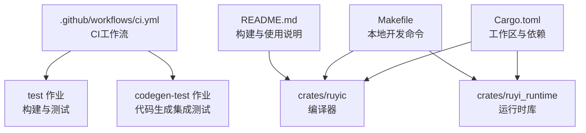
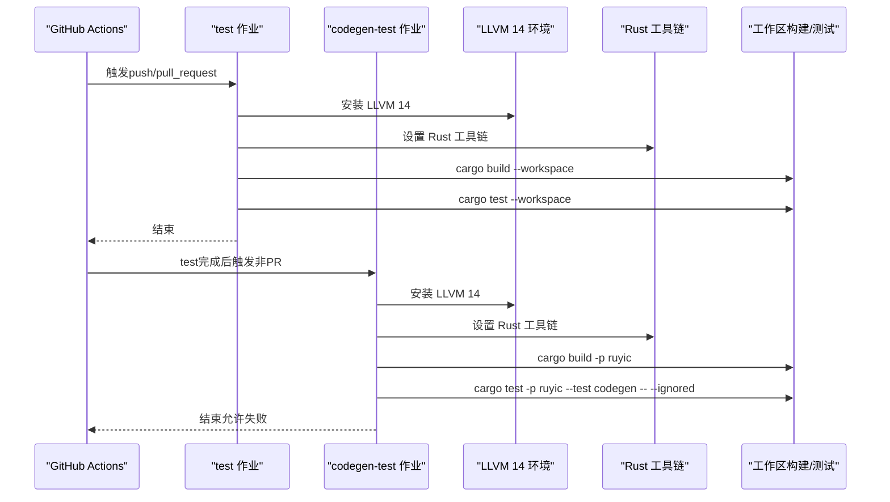
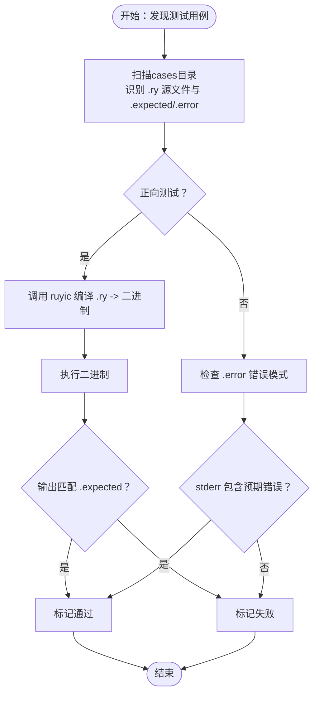
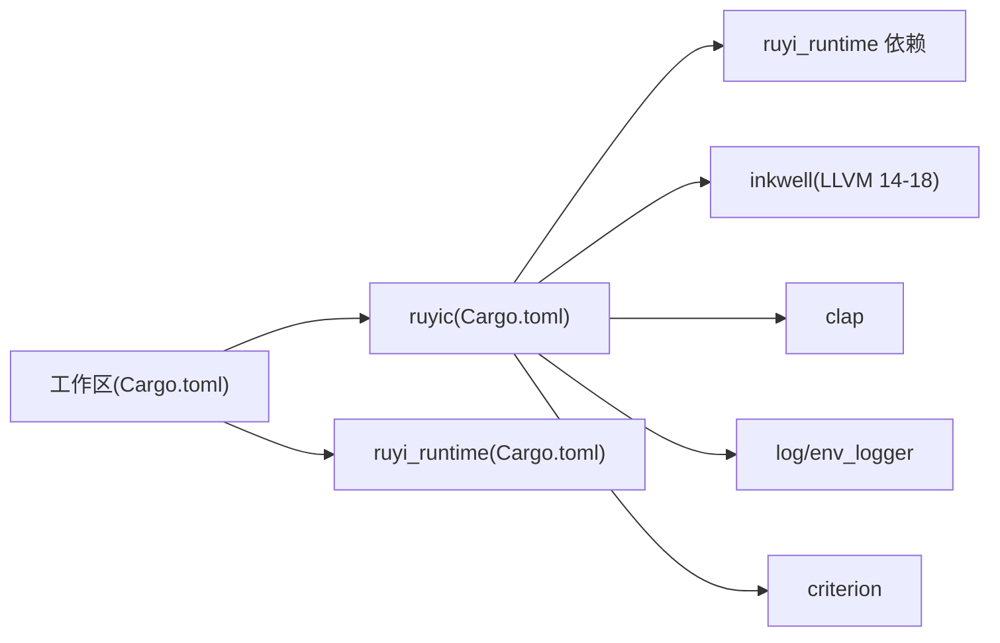

# CI/CD流水线

<cite>
**本文档引用的文件**
- [.github/workflows/ci.yml](file://.github/workflows/ci.yml)
- [Cargo.toml](file://Cargo.toml)
- [Makefile](file://Makefile)
- [README.md](file://README.md)
- [crates/ruyic/Cargo.toml](file://crates/ruyic/Cargo.toml)
- [crates/ruyic/tests/integration/runner.rs](file://crates/ruyic/tests/integration/runner.rs)
- [crates/ruyic/tests/integration/cases/basic/hello_world.ry](file://crates/ruyic/tests/integration/cases/basic/hello_world.ry)
- [crates/ruyic/tests/integration/cases/basic/hello_world.expected](file://crates/ruyic/tests/integration/cases/basic/hello_world.expected)
- [crates/ruyi_runtime/tests/runtime.rs](file://crates/ruyi_runtime/tests/runtime.rs)
- [rustfmt.toml](file://rustfmt.toml)
</cite>

## 目录
1. [简介](#简介)
2. [项目结构](#项目结构)
3. [核心组件](#核心组件)
4. [架构总览](#架构总览)
5. [详细组件分析](#详细组件分析)
6. [依赖分析](#依赖分析)
7. [性能考虑](#性能考虑)
8. [故障排查指南](#故障排查指南)
9. [结论](#结论)
10. [附录](#附录)

## 简介
本指南面向Ruyi编程语言的持续集成与交付（CI/CD）流水线，聚焦于GitHub Actions工作流配置、测试矩阵与并行执行、条件触发策略、构建阶段的LLVM环境准备与依赖安装、测试策略（单元测试、集成测试、代码生成测试）、缓存与构建优化、覆盖率收集与质量门禁建议，以及部署与发布策略。文档基于仓库现有配置与测试实现进行系统化梳理，并提供可操作的改进建议。

## 项目结构
Ruyi采用多crate工作区组织，核心组件包括编译器（ruyic）与运行时库（ruyi_runtime）。CI工作流位于.github/workflows/ci.yml，Cargo工作区在根目录Cargo.toml中定义，开发者常用命令通过Makefile提供。

图表来源
- [.github/workflows/ci.yml:1-45](file://.github/workflows/ci.yml#L1-L45)
- [Cargo.toml:1-40](file://Cargo.toml#L1-L40)
- [Makefile:1-122](file://Makefile#L1-L122)
- [README.md:1-210](file://README.md#L1-L210)

章节来源
- [.github/workflows/ci.yml:1-45](file://.github/workflows/ci.yml#L1-L45)
- [Cargo.toml:1-40](file://Cargo.toml#L1-L40)
- [Makefile:1-122](file://Makefile#L1-L122)
- [README.md:1-210](file://README.md#L1-L210)

## 核心组件
- GitHub Actions工作流：定义触发条件、作业与步骤，包含基础测试作业与代码生成集成测试作业。
- Cargo工作区：统一版本、特性与依赖管理；编译器与运行时作为成员crate参与工作区构建。
- 测试框架：标准Rust测试、集成测试runner、期望输出对比与错误消息匹配。
- 本地开发工具链：Makefile提供构建、测试、格式化、静态检查等常用目标。

章节来源
- [.github/workflows/ci.yml:12-44](file://.github/workflows/ci.yml#L12-L44)
- [Cargo.toml:1-40](file://Cargo.toml#L1-L40)
- [crates/ruyic/Cargo.toml:1-26](file://crates/ruyic/Cargo.toml#L1-L26)
- [crates/ruyic/tests/integration/runner.rs:1-385](file://crates/ruyic/tests/integration/runner.rs#L1-L385)
- [Makefile:35-66](file://Makefile#L35-L66)

## 架构总览
CI流水线由两个主要作业组成：test作业负责工作区构建与测试；codegen-test作业在test完成后执行，仅在非PR条件下运行，且允许失败（continue-on-error），专门用于代码生成集成测试。

图表来源
- [.github/workflows/ci.yml:13-44](file://.github/workflows/ci.yml#L13-L44)

## 详细组件分析

### GitHub Actions工作流配置
- 触发策略
  - push事件：主分支与dev/**分支
  - pull_request事件：仅主分支
- 环境变量：启用彩色日志输出
- 作业划分
  - test作业：安装LLVM 14、设置Rust工具链、工作区构建与测试
  - codegen-test作业：依赖test作业、非PR条件下运行、允许失败、仅构建并测试编译器crate的代码生成部分

章节来源
- [.github/workflows/ci.yml:3-26](file://.github/workflows/ci.yml#L3-L26)
- [.github/workflows/ci.yml:28-44](file://.github/workflows/ci.yml#L28-L44)

### 构建阶段：LLVM环境准备与依赖安装
- 平台：ubuntu-latest
- LLVM安装：通过包管理器安装LLVM 14开发包与Clang开发包，并设置LLVM_SYS_140_PREFIX环境变量
- Rust工具链：使用actions-rust-lang/setup-rust-toolchain设置工具链
- 工作区构建：cargo build --workspace
- 运行时构建：Makefile提供build-runtime目标，可在无LLVM环境下检查运行时库

章节来源
- [.github/workflows/ci.yml:17-24](file://.github/workflows/ci.yml#L17-L24)
- [Makefile:27-28](file://Makefile#L27-L28)
- [README.md:26-31](file://README.md#L26-L31)

### 测试策略
- 单元测试
  - 运行时库测试：如内存分配、GC、异常处理等测试用例
  - 编译器库测试：按模块拆分的单元测试
- 集成测试
  - runner实现：自动发现测试用例、编译生成二进制、执行并对比期望输出或错误消息
  - 测试用例组织：按类别（如basic、codegen、control_flow等）存放源文件与期望输出/错误文件
- 代码生成测试
  - 通过test目录下的代码生成测试套件执行，使用--ignored标志跳过默认测试集

图表来源
- [crates/ruyic/tests/integration/runner.rs:31-316](file://crates/ruyic/tests/integration/runner.rs#L31-L316)

章节来源
- [crates/ruyi_runtime/tests/runtime.rs:1-133](file://crates/ruyi_runtime/tests/runtime.rs#L1-L133)
- [crates/ruyic/tests/integration/runner.rs:1-385](file://crates/ruyic/tests/integration/runner.rs#L1-L385)
- [crates/ruyic/tests/integration/cases/basic/hello_world.ry:1](file://crates/ruyic/tests/integration/cases/basic/hello_world.ry#L1)
- [crates/ruyic/tests/integration/cases/basic/hello_world.expected:1](file://crates/ruyic/tests/integration/cases/basic/hello_world.expected#L1)

### 并行执行与条件触发
- 作业间依赖：codegen-test通过needs依赖test作业，确保在基础测试通过后再执行
- 条件触发：通过if表达式限制在非PR事件下运行
- 容错策略：codegen-test使用continue-on-error，避免单个测试失败阻断整体流水线

章节来源
- [.github/workflows/ci.yml:28-32](file://.github/workflows/ci.yml#L28-L32)

### 代码生成测试执行配置
- 目标：针对编译器的代码生成能力进行集成测试
- 执行方式：仅构建编译器crate，再运行其test目录下的代码生成测试套件，使用--ignored标志

章节来源
- [.github/workflows/ci.yml:41-44](file://.github/workflows/ci.yml#L41-L44)

### 缓存策略与构建优化
- 当前状态：工作流未显式配置缓存
- 建议实践（通用指导）
  - Rust缓存：缓存Cargo registry缓存与下载缓存，减少依赖解析时间
  - LLVM缓存：缓存LLVM安装目录（谨慎评估体积与失效策略）
  - 二进制缓存：缓存target目录特定产物，加速后续构建
- 构建优化
  - 工作区并行：利用--workspace并行构建多个crate
  - 发布配置：参考工作区release配置（如LTO、单代码单元）提升运行时性能

章节来源
- [.github/workflows/ci.yml:24-26](file://.github/workflows/ci.yml#L24-L26)
- [Cargo.toml:37-40](file://Cargo.toml#L37-L40)

### 代码覆盖率收集与质量门禁
- 覆盖率收集（通用指导）
  - 使用cargo-tarpaulin或类似工具在CI中收集覆盖率数据
  - 将覆盖率结果上传至服务端（如Codecov、CodeClimate）
- 质量门禁（通用指导）
  - 设定最小覆盖率阈值，低于阈值时使PR检查失败
  - 与代码格式化、静态检查（clippy）形成多层质量保障

[本节为通用指导，不直接分析具体文件]

### 部署流水线与发布策略
- 当前状态：仓库未包含部署工作流或发布脚本
- 建议实践（通用指导）
  - 发布分支：遵循语义化版本与annotated tag规范
  - 自动化发布：在打tag后触发发布工作流，构建发布产物并上传
  - 文档与Roadmap：结合版本管理规范维护发布状态与路线图

[本节为通用指导，不直接分析具体文件]

## 依赖分析
工作区通过Cargo.toml统一管理版本与依赖，编译器crate依赖运行时库与inkwell（支持LLVM 14-18），并引入命令行参数解析、日志与基准测试等依赖。

图表来源
- [Cargo.toml:14-27](file://Cargo.toml#L14-L27)
- [crates/ruyic/Cargo.toml:19-26](file://crates/ruyic/Cargo.toml#L19-L26)

章节来源
- [Cargo.toml:1-40](file://Cargo.toml#L1-L40)
- [crates/ruyic/Cargo.toml:1-26](file://crates/ruyic/Cargo.toml#L1-L26)

## 性能考虑
- 构建性能
  - 使用--workspace并行构建多crate
  - 发布构建启用LTO与单代码单元，提升运行时性能
- 测试性能
  - 将耗时的代码生成测试置于独立作业，避免阻塞常规测试
  - 使用--ignored隔离特殊测试集，便于按需执行

章节来源
- [.github/workflows/ci.yml:24-26](file://.github/workflows/ci.yml#L24-L26)
- [Cargo.toml:37-40](file://Cargo.toml#L37-L40)

## 故障排查指南
- LLVM环境问题
  - 症状：编译器无法找到LLVM头文件或链接失败
  - 排查：确认LLVM 14安装与LLVM_SYS_140_PREFIX环境变量设置
  - 参考：工作流中的LLVM安装步骤与README中的本地安装说明
- 测试失败定位
  - 集成测试：检查runner输出的编译/执行失败原因与期望输出差异
  - 单元测试：关注运行时库测试中的内存分配、GC与异常处理相关断言
- 本地复现
  - 使用Makefile提供的命令进行本地构建与测试，缩小问题范围

章节来源
- [.github/workflows/ci.yml:17-21](file://.github/workflows/ci.yml#L17-L21)
- [README.md:26-31](file://README.md#L26-L31)
- [crates/ruyic/tests/integration/runner.rs:92-173](file://crates/ruyic/tests/integration/runner.rs#L92-L173)
- [crates/ruyi_runtime/tests/runtime.rs:1-133](file://crates/ruyi_runtime/tests/runtime.rs#L1-L133)

## 结论
当前CI工作流提供了基础的构建与测试覆盖，并通过独立的代码生成测试作业实现分层验证。为进一步提升稳定性与效率，建议引入缓存策略、完善覆盖率与质量门禁、明确发布流程与部署策略。这些改进将帮助团队在快速迭代的同时保证代码质量与交付效率。

## 附录
- 本地开发与测试
  - Makefile提供构建、测试、格式化、静态检查等常用目标，便于本地快速验证
- 代码风格
  - rustfmt配置文件定义了最大行长、缩进与换行风格

章节来源
- [Makefile:35-66](file://Makefile#L35-L66)
- [rustfmt.toml:1-5](file://rustfmt.toml#L1-L5)