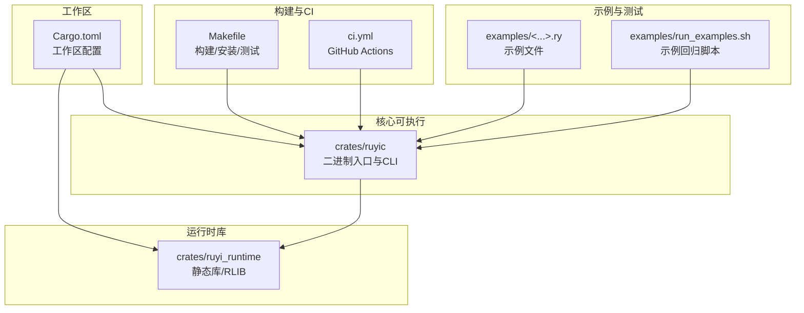
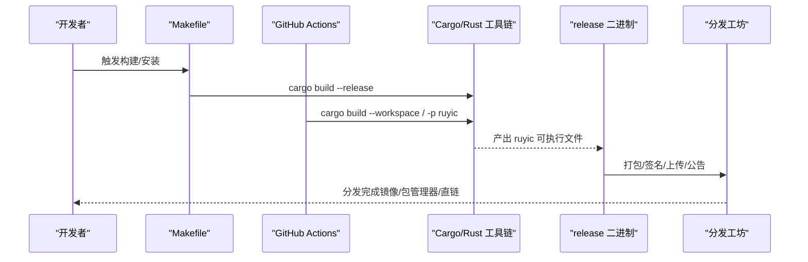
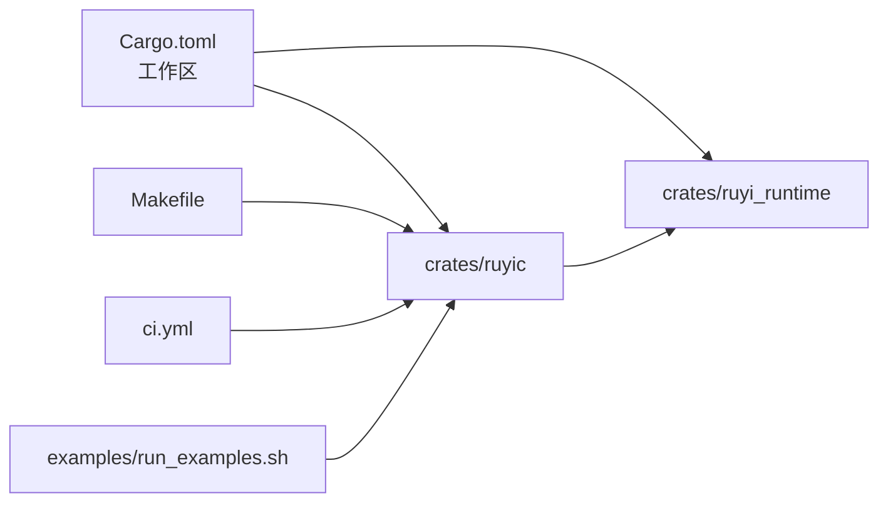

# 二进制分发

<cite>
**本文引用的文件**
- [Cargo.toml](file://Cargo.toml)
- [Makefile](file://Makefile)
- [.github/workflows/ci.yml](file://.github/workflows/ci.yml)
- [crates/ruyic/Cargo.toml](file://crates/ruyic/Cargo.toml)
- [crates/ruyi_runtime/Cargo.toml](file://crates/ruyi_runtime/Cargo.toml)
- [examples/run_examples.sh](file://examples/run_examples.sh)
- [.gitignore](file://.gitignore)
</cite>

## 目录
1. [引言](#引言)
2. [项目结构](#项目结构)
3. [核心组件](#核心组件)
4. [架构总览](#架构总览)
5. [详细组件分析](#详细组件分析)
6. [依赖关系分析](#依赖关系分析)
7. [性能考量](#性能考量)
8. [故障排查指南](#故障排查指南)
9. [结论](#结论)
10. [附录](#附录)

## 引言
本文件面向Ruyi编程语言的二进制分发，围绕可执行文件的打包格式、分发渠道配置、多平台安装包制作与分发策略、代码签名与安全验证机制、包管理器集成（Homebrew、APT、Chocolatey等）的配方编写、自动化发布流程与版本更新机制，以及分发渠道的安全与完整性验证方案进行系统化设计与实施说明。目标是为Ruyi提供一套可复用、可审计、可扩展的二进制分发实施方案。

## 项目结构
Ruyi采用多crate工作区组织，核心可执行程序位于 ruyic，运行时库位于 ruyi_runtime。构建与测试通过Makefile与GitHub Actions协同完成，示例与回归测试通过脚本驱动。

**图示来源**
- [Cargo.toml:1-40](file://Cargo.toml#L1-L40)
- [crates/ruyic/Cargo.toml:1-26](file://crates/ruyic/Cargo.toml#L1-L26)
- [crates/ruyi_runtime/Cargo.toml:1-17](file://crates/ruyi_runtime/Cargo.toml#L1-L17)
- [Makefile:1-122](file://Makefile#L1-L122)
- [.github/workflows/ci.yml:1-45](file://.github/workflows/ci.yml#L1-L45)
- [examples/run_examples.sh:319-461](file://examples/run_examples.sh#L319-L461)

**章节来源**
- [Cargo.toml:1-40](file://Cargo.toml#L1-L40)
- [Makefile:1-122](file://Makefile#L1-L122)
- [.github/workflows/ci.yml:1-45](file://.github/workflows/ci.yml#L1-L45)

## 核心组件
- 工作区与版本管理
  - 工作区统一版本、编辑器、许可证等元数据，便于跨crate一致性与发布追踪。
- ruyic（可执行程序）
  - 作为Ruyi编译器的CLI入口，负责解析参数、驱动编译流程，并与运行时库协作生成目标产物。
- ruyi_runtime（运行时库）
  - 提供静态库与RLIB两种crate类型，支持LLVM绑定特性开关，满足不同平台与场景需求。
- 构建与测试工具链
  - Makefile提供构建、安装、测试、格式化、Lint等常用目标；GitHub Actions在Linux上安装LLVM 14并执行构建与测试。
- 示例与回归测试
  - examples目录包含Ruyi示例文件，run_examples.sh用于批量编译与运行示例并进行结果校验。

**章节来源**
- [Cargo.toml:8-40](file://Cargo.toml#L8-L40)
- [crates/ruyic/Cargo.toml:11-26](file://crates/ruyic/Cargo.toml#L11-L26)
- [crates/ruyi_runtime/Cargo.toml:8-17](file://crates/ruyi_runtime/Cargo.toml#L8-L17)
- [Makefile:18-66](file://Makefile#L18-L66)
- [.github/workflows/ci.yml:17-26](file://.github/workflows/ci.yml#L17-L26)
- [examples/run_examples.sh:319-461](file://examples/run_examples.sh#L319-L461)

## 架构总览
下图展示从源码到可分发二进制的关键路径：开发者通过Makefile或CI触发构建，生成release二进制；随后进入打包与分发环节（见后文“详细组件分析”）。

**图示来源**
- [Makefile:21-33](file://Makefile#L21-L33)
- [.github/workflows/ci.yml:23-26](file://.github/workflows/ci.yml#L23-L26)

## 详细组件分析

### 可执行文件打包格式与分发渠道配置
- 打包格式建议
  - Linux/macOS: tar.gz（含二进制、手册页、示例、许可证），便于快速解压与部署。
  - Windows: zip（含二进制、PS脚本、示例、许可证），兼容PowerShell生态。
  - 多架构: 为 x86_64、ARM64分别生成独立包，避免交叉移植风险。
- 版本命名规范
  - 使用语义化版本号，附加平台与架构标识，例如 ruyic-v0.5.2-linux-x86_64.tar.gz。
- 分发渠道
  - 官方网站直链下载与CDN镜像。
  - 包管理器仓库（见“包管理器集成”）。
  - Docker镜像（可选，便于容器化部署）。
- 完整性校验
  - 生成SHA256摘要清单，随包提供；提供PGP签名文件以支持GPG验证。
- 安全基线
  - 仅在可信CI与受控工坊内执行签名；签名密钥与发布凭据严格隔离。

**章节来源**
- [Cargo.toml:9](file://Cargo.toml#L9)
- [Makefile:21-33](file://Makefile#L21-L33)
- [.github/workflows/ci.yml:17-26](file://.github/workflows/ci.yml#L17-L26)

### 不同平台的安装包制作与分发策略
- Linux（通用二进制）
  - 生成无外部运行时依赖的静态链接或最小动态链接二进制，确保在多数发行版可用。
  - 提供 .deb/.rpm 包（见“包管理器集成”）以提升用户体验。
- macOS（Intel/Apple Silicon）
  - 生成Universal 2二进制或分别提供x86_64与arm64包；配合Homebrew配方。
- Windows（x86_64）
  - 生成MSVC或MinGW产物，提供zip与MSI安装包；MSI便于系统级注册与卸载。
- 跨平台一致性
  - 通过CI矩阵在Ubuntu、macOS、Windows上并行构建，确保产物一致。
  - 使用固定LLVM版本（如14）以减少ABI差异。

**章节来源**
- [.github/workflows/ci.yml:17-26](file://.github/workflows/ci.yml#L17-L26)
- [Makefile:9-11](file://Makefile#L9-L11)

### 代码签名与安全验证机制
- 签名流程
  - 在专用发布主机上使用硬件安全模块（HSM）或密钥库进行签名。
  - 对每个二进制与其摘要清单进行签名，生成独立的签名文件。
- 验证流程
  - 用户下载后先校验SHA256，再使用GPG验证签名文件。
  - 将公钥嵌入文档与公告，提供离线验证能力。
- 供应链安全
  - 限制签名密钥访问权限；启用双人审批与审计日志。
  - CI中仅允许从受信分支触发签名作业。

**章节来源**
- [Cargo.toml:12](file://Cargo.toml#L12)

### 包管理器集成
- Homebrew（macOS/Linux）
  - 编写Formula，指定URL、SHA256、安装步骤；支持多架构。
  - 使用brew test-bot进行自动化测试。
- APT（Debian/Ubuntu）
  - 维护PPA或私有仓库，提供 .deb 包；定义控制文件与依赖。
  - 自动同步至各发行版版本分支。
- Chocolatey（Windows）
  - 编写.nuspec与脚本，处理安装、卸载、升级；提供校验与回滚。
- 通用要求
  - 包内包含许可证、变更日志、示例与文档；保持版本与URL一致性。

**章节来源**
- [.github/workflows/ci.yml:17-26](file://.github/workflows/ci.yml#L17-L26)

### 自动化发布流程与版本更新机制
- 发布触发
  - 通过标签（vX.Y.Z）触发CI流水线；自动构建多平台二进制与包。
- 版本更新
  - 工作区统一版本号，发布前在PR中更新版本与变更记录。
- 文档与公告
  - 自动生成发布说明，附带校验信息与迁移指引。
- 回滚与热修复
  - 保留旧版本包与签名文件；紧急修复时快速发布补丁版本。

**章节来源**
- [Cargo.toml:9](file://Cargo.toml#L9)
- [.github/workflows/ci.yml:3-8](file://.github/workflows/ci.yml#L3-L8)

### 分发渠道的安全考虑与完整性验证
- 传输安全
  - 仅使用HTTPS与可信CDN；对下载链接进行短时效签名或令牌鉴权。
- 存储安全
  - 二进制与签名文件分离存储；访问日志审计。
- 验证策略
  - 强制SHA256校验；可选GPG签名验证；提供在线与离线两种验证方式。
- 风险缓解
  - 多源镜像与断点续传；对篡改与重放攻击进行监控与告警。

**章节来源**
- [Cargo.toml:12](file://Cargo.toml#L12)

## 依赖关系分析
ruyic依赖ruyi_runtime，二者均来自同一工作区，共享版本与工具链配置。Makefile与CI共同驱动构建与测试，examples脚本用于回归验证。

**图示来源**
- [Cargo.toml:1-6](file://Cargo.toml#L1-L6)
- [crates/ruyic/Cargo.toml:19-26](file://crates/ruyic/Cargo.toml#L19-L26)
- [crates/ruyi_runtime/Cargo.toml:11-17](file://crates/ruyi_runtime/Cargo.toml#L11-L17)
- [Makefile:18-33](file://Makefile#L18-L33)
- [.github/workflows/ci.yml:23-26](file://.github/workflows/ci.yml#L23-L26)
- [examples/run_examples.sh:319-461](file://examples/run_examples.sh#L319-L461)

**章节来源**
- [Cargo.toml:1-6](file://Cargo.toml#L1-L6)
- [crates/ruyic/Cargo.toml:19-26](file://crates/ruyic/Cargo.toml#L19-L26)
- [crates/ruyi_runtime/Cargo.toml:11-17](file://crates/ruyi_runtime/Cargo.toml#L11-L17)
- [Makefile:18-33](file://Makefile#L18-L33)
- [.github/workflows/ci.yml:23-26](file://.github/workflows/ci.yml#L23-L26)
- [examples/run_examples.sh:319-461](file://examples/run_examples.sh#L319-L461)

## 性能考量
- 构建性能
  - Release配置启用LTO与单codegen单元，提升运行时性能与二进制体积优化。
- 分发性能
  - CDN缓存与镜像同步；压缩包选择合适的压缩算法与分片策略。
- 验证性能
  - SHA256计算与GPG验证在现代CPU上开销较小，建议在CI中预热缓存。

**章节来源**
- [Cargo.toml:37-40](file://Cargo.toml#L37-L40)

## 故障排查指南
- 构建失败
  - 检查LLVM 14相关依赖是否正确安装；确认Makefile中的LLVM路径变量。
  - 在CI环境中核对Actions步骤与环境变量设置。
- 测试异常
  - 使用examples/run_examples.sh的verify/update模式定位问题；关注编译/运行/输出比对三阶段。
- 安装与分发
  - 确认二进制权限与路径；检查签名与摘要文件是否匹配。
  - 若包管理器安装失败，核对依赖与仓库配置。

**章节来源**
- [Makefile:17-21](file://Makefile#L17-L21)
- [.github/workflows/ci.yml:17-26](file://.github/workflows/ci.yml#L17-L26)
- [examples/run_examples.sh:319-461](file://examples/run_examples.sh#L319-L461)

## 结论
本文基于现有构建与CI配置，提出了Ruyi二进制分发的完整实施方案：明确打包格式与分发渠道、制定多平台安装包策略、建立代码签名与安全验证体系、给出包管理器配方思路、设计自动化发布与版本更新流程，并强调分发安全与完整性保障。该方案可在不改变现有工作流的前提下平滑落地，为Ruyi用户提供稳定可靠的安装与升级体验。

## 附录
- 关键文件索引
  - 工作区与版本：[Cargo.toml:1-40](file://Cargo.toml#L1-L40)
  - 构建与安装：[Makefile:1-122](file://Makefile#L1-L122)
  - CI与测试：[ci.yml:1-45](file://.github/workflows/ci.yml#L1-L45)
  - 可执行与依赖：[ruyic/Cargo.toml:1-26](file://crates/ruyic/Cargo.toml#L1-L26)、[ruyi_runtime/Cargo.toml:1-17](file://crates/ruyi_runtime/Cargo.toml#L1-L17)
  - 示例与回归：[examples/run_examples.sh:319-461](file://examples/run_examples.sh#L319-L461)
  - 忽略规则：[.gitignore:1-39](file://.gitignore#L1-L39)