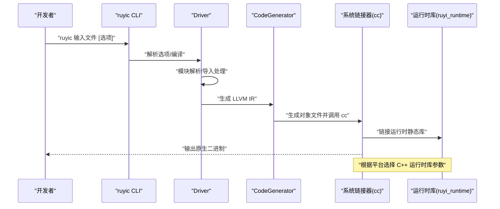
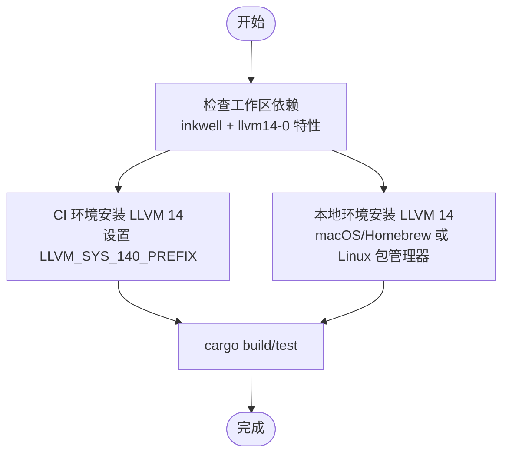
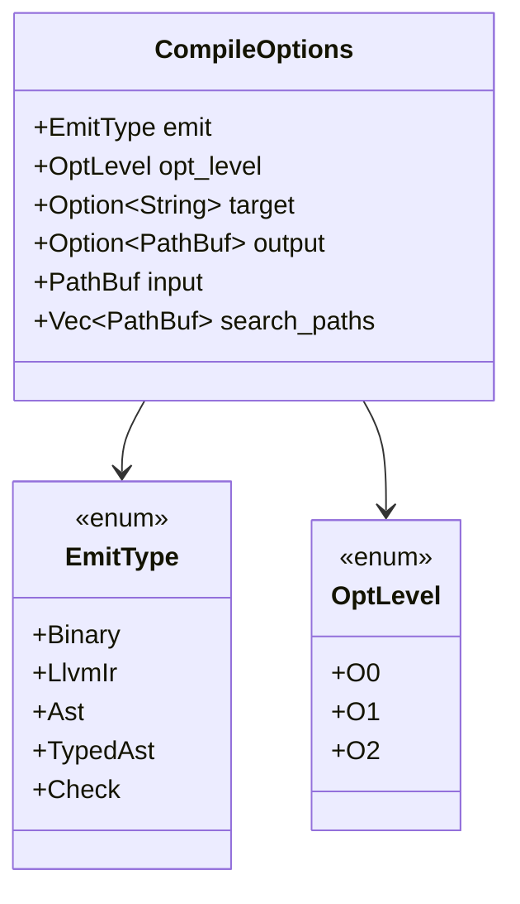
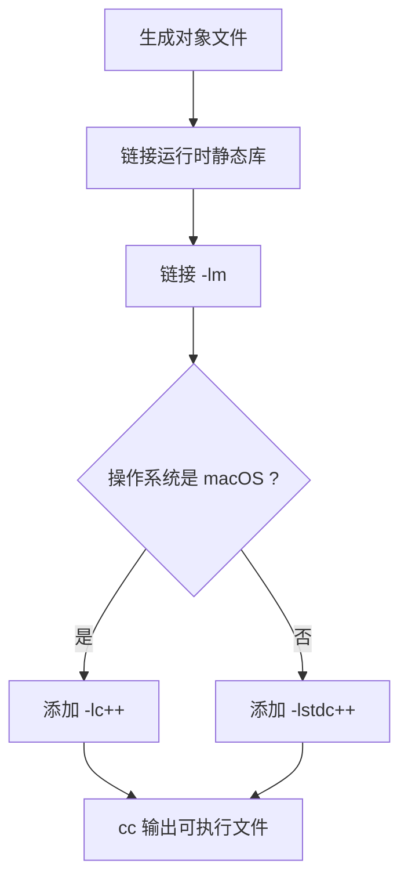
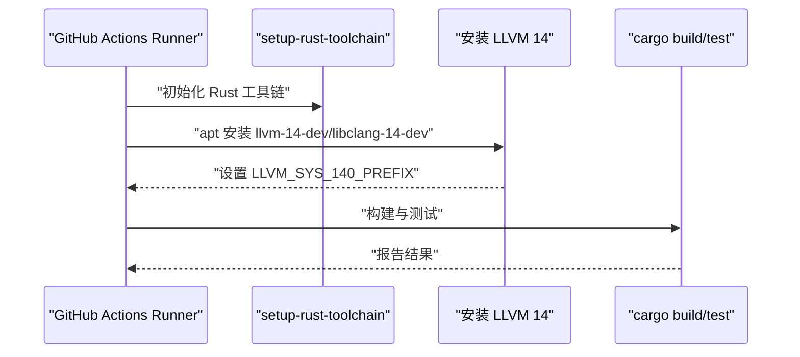
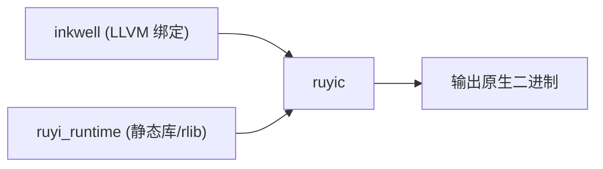

# 交叉编译配置

<cite>
**本文引用的文件**
- [.github/workflows/ci.yml](file://.github/workflows/ci.yml)
- [Cargo.toml](file://Cargo.toml)
- [Makefile](file://Makefile)
- [crates/ruyic/Cargo.toml](file://crates/ruyic/Cargo.toml)
- [crates/ruyi_runtime/Cargo.toml](file://crates/ruyi_runtime/Cargo.toml)
- [crates/ruyic/src/driver.rs](file://crates/ruyic/src/driver.rs)
- [crates/ruyic/src/codegen/generator.rs](file://crates/ruyic/src/codegen/generator.rs)
- [stdlib/process.ry](file://stdlib/process.ry)
- [README.md](file://README.md)
- [.omo/evidence/task-1-linker.txt](file://.omo/evidence/task-1-linker.txt)
</cite>

## 目录
1. [简介](#简介)
2. [项目结构](#项目结构)
3. [核心组件](#核心组件)
4. [架构总览](#架构总览)
5. [详细组件分析](#详细组件分析)
6. [依赖关系分析](#依赖关系分析)
7. [性能考虑](#性能考虑)
8. [故障排查指南](#故障排查指南)
9. [结论](#结论)
10. [附录](#附录)

## 简介
本指南面向在多平台上进行 Ruyi 编译器与运行时交叉编译的开发者，覆盖以下主题：
- LLVM 14–18 兼容性与安装配置
- 不同目标平台（Windows、Linux、macOS）的工具链设置
- Cargo.toml 中的 target 配置与 platform-specific 依赖管理
- GitHub Actions 交叉编译工作流与环境变量
- 实用编译命令示例与常见问题解决
- 编译优化选项与性能调优建议

## 项目结构
Ruyi 采用多 crate 的工作区组织方式，核心编译器位于 ruyic，运行时库位于 ruyi_runtime。CI 使用 GitHub Actions 在 Ubuntu 上安装 LLVM 14 并执行构建与测试。

```mermaid
graph TB
subgraph "工作区"
WS[Cargo.toml 工作区]
WS --> RuyiC[crates/ruyic]
WS --> Runtime[crates/ruyi_runtime]
end
subgraph "CI"
CI[ci.yml]
CI --> LLVM["LLVM 14 安装<br/>LLVM_SYS_140_PREFIX"]
end
RuyiC --> Runtime
CI --> RuyiC
```

**图表来源**
- [Cargo.toml:1-40](file://Cargo.toml#L1-L40)
- [.github/workflows/ci.yml:17-21](file://.github/workflows/ci.yml#L17-L21)

**章节来源**
- [Cargo.toml:1-40](file://Cargo.toml#L1-L40)
- [.github/workflows/ci.yml:1-45](file://.github/workflows/ci.yml#L1-L45)

## 核心组件
- 工作区与依赖
  - 工作区统一版本与特性，依赖 inkwell 支持 LLVM 14–18（通过特定功能开关）
  - ruyic 为编译器二进制与库，依赖 ruyi_runtime 提供运行时支持
- 构建与测试
  - Makefile 提供构建、检查、测试、格式化、示例编译等常用目标
  - README 指明 macOS/Linux 下 LLVM 14 的安装与环境变量设置

**章节来源**
- [Cargo.toml:14-26](file://Cargo.toml#L14-L26)
- [crates/ruyic/Cargo.toml:19-26](file://crates/ruyic/Cargo.toml#L19-L26)
- [crates/ruyi_runtime/Cargo.toml:11-17](file://crates/ruyi_runtime/Cargo.toml#L11-L17)
- [Makefile:1-122](file://Makefile#L1-L122)
- [README.md:26-32](file://README.md#L26-L32)

## 架构总览
Ruyi 编译管线从源码到原生二进制的关键步骤：词法/语法/宏展开/类型检查 → LLVM IR 生成 → 链接为可执行文件。链接阶段根据平台选择不同的 C++ 运行时库参数。



**图表来源**
- [crates/ruyic/src/driver.rs:258-632](file://crates/ruyic/src/driver.rs#L258-L632)
- [crates/ruyic/src/codegen/generator.rs:750-800](file://crates/ruyic/src/codegen/generator.rs#L750-L800)

## 详细组件分析

### LLVM 与 inkwell 兼容性
- 依赖声明
  - 工作区依赖 inkwell，并启用 LLVM 14 功能开关，表明对 LLVM 14–18 的兼容性由该特性门控
- CI 环境
  - GitHub Actions 在 Ubuntu 上安装 llvm-14-dev 与 libclang-14-dev，并设置 LLVM_SYS_140_PREFIX
- 本地开发
  - macOS 使用 Homebrew 安装 llvm@14，并通过 LLVM_SYS_140_PREFIX 指向安装路径
  - Linux 可通过包管理器安装相应开发包



**图表来源**
- [Cargo.toml:15-16](file://Cargo.toml#L15-L16)
- [.github/workflows/ci.yml:17-21](file://.github/workflows/ci.yml#L17-L21)
- [README.md:26-32](file://README.md#L26-L32)

**章节来源**
- [Cargo.toml:15-16](file://Cargo.toml#L15-L16)
- [.github/workflows/ci.yml:17-21](file://.github/workflows/ci.yml#L17-L21)
- [README.md:26-32](file://README.md#L26-L32)

### 目标三元组与编译选项
- 目标三元组
  - 编译选项中包含 target 字段，用于指定目标平台三元组（如 x86_64-unknown-linux-gnu）
- 优化级别
  - 支持 O0/O1/O2，默认 O0；Release 配置启用 LTO、单代码单元以提升性能
- 发射模式
  - 支持发射原生二进制、LLVM IR、AST、带类型 AST、仅类型检查



**图表来源**
- [crates/ruyic/src/driver.rs:86-138](file://crates/ruyic/src/driver.rs#L86-L138)

**章节来源**
- [crates/ruyic/src/driver.rs:86-138](file://crates/ruyic/src/driver.rs#L86-L138)
- [Cargo.toml:37-40](file://Cargo.toml#L37-L40)

### 链接器与平台差异
- 链接流程
  - 生成对象文件后，使用系统链接器 cc 进行链接
  - 自动链接数学库与运行时静态库；根据平台选择 C++ 运行时库参数
- 平台差异
  - macOS 使用 -lc++
  - 其他平台使用 -lstdc++



**图表来源**
- [crates/ruyic/src/codegen/generator.rs:750-800](file://crates/ruyic/src/codegen/generator.rs#L750-L800)
- [.omo/evidence/task-1-linker.txt:12-17](file://.omo/evidence/task-1-linker.txt#L12-L17)

**章节来源**
- [crates/ruyic/src/codegen/generator.rs:750-800](file://crates/ruyic/src/codegen/generator.rs#L750-L800)
- [.omo/evidence/task-1-linker.txt:12-17](file://.omo/evidence/task-1-linker.txt#L12-L17)

### Cargo.toml 中的 target 配置与 platform-specific 依赖
- 当前仓库未显式定义 per-target 依赖或条件特性
- 建议实践
  - 使用 Cargo.toml 的 target 配置为不同三元组设置条件依赖
  - 对于平台特定的 C 组件，可通过 features 控制并在各 target 配置中启用对应 feature

[本节为通用实践说明，不直接分析具体文件，故无“章节来源”]

### GitHub Actions 交叉编译工作流
- 当前工作流在 ubuntu-latest 上安装 LLVM 14 并执行构建与测试
- 要实现跨平台交叉编译，可在工作流中新增矩阵策略，针对不同 runner 和目标三元组分别安装 LLVM 并设置 LLVM_SYS_* 环境变量



**图表来源**
- [.github/workflows/ci.yml:17-26](file://.github/workflows/ci.yml#L17-L26)

**章节来源**
- [.github/workflows/ci.yml:1-45](file://.github/workflows/ci.yml#L1-L45)

### 平台探测与标准库行为
- 运行时库导出平台探测函数，便于在运行时识别当前系统平台
- 该能力可用于条件编译或运行时行为调整

**章节来源**
- [stdlib/process.ry:487-493](file://stdlib/process.ry#L487-L493)

## 依赖关系分析
- 工作区依赖
  - inkwell 通过特性门控支持 LLVM 14–18
  - ruyic 依赖 ruyi_runtime 与 inkwell
  - ruyi_runtime 可选依赖 inkwell，且默认启用
- 构建目标
  - ruyi_runtime 默认生成静态库与 rlib
  - ruyic 为二进制与库双重产物



**图表来源**
- [Cargo.toml:14-26](file://Cargo.toml#L14-L26)
- [crates/ruyic/Cargo.toml:19-26](file://crates/ruyic/Cargo.toml#L19-L26)
- [crates/ruyi_runtime/Cargo.toml:8-17](file://crates/ruyi_runtime/Cargo.toml#L8-L17)

**章节来源**
- [Cargo.toml:14-26](file://Cargo.toml#L14-L26)
- [crates/ruyic/Cargo.toml:19-26](file://crates/ruyic/Cargo.toml#L19-L26)
- [crates/ruyi_runtime/Cargo.toml:8-17](file://crates/ruyi_runtime/Cargo.toml#L8-L17)

## 性能考虑
- 优化级别
  - 默认 O0 便于调试；发布构建建议使用 O2 或更高
  - Release 配置启用 LTO 与单代码单元，有助于整体优化
- 链接器参数
  - 链接数学库与平台特定 C++ 运行时库，确保异常处理与标准库符号可用
- 示例目标
  - Makefile 提供 build-release 与 install 目标，便于快速产出可执行文件

**章节来源**
- [Cargo.toml:37-40](file://Cargo.toml#L37-L40)
- [Makefile:21-33](file://Makefile#L21-L33)
- [crates/ruyic/src/codegen/generator.rs:750-800](file://crates/ruyic/src/codegen/generator.rs#L750-L800)

## 故障排查指南
- 未安装 LLVM 14
  - 症状：无法完成类型检查或链接阶段
  - 解决：按 README 与 CI 步骤安装 LLVM 14，并设置 LLVM_SYS_140_PREFIX
- 链接失败（缺少 C++ 运行时）
  - 症状：出现与异常处理相关的未解析符号
  - 解决：确认链接阶段已附加平台对应的 C++ 运行时库参数
- 平台检测错误
  - 症状：在非预期平台附加了错误的运行时库参数
  - 解决：检查平台判断逻辑是否基于标准库常量

**章节来源**
- [README.md:26-32](file://README.md#L26-L32)
- [.github/workflows/ci.yml:17-21](file://.github/workflows/ci.yml#L17-L21)
- [.omo/evidence/task-1-linker.txt:12-17](file://.omo/evidence/task-1-linker.txt#L12-L17)

## 结论
- Ruyi 当前通过 inkwell 的 llvm14-0 特性实现对 LLVM 14–18 的兼容
- CI 在 Ubuntu 上使用 LLVM 14；本地开发需正确设置 LLVM_SYS_140_PREFIX
- 链接阶段会依据平台自动选择 C++ 运行时库，避免异常处理相关符号缺失
- 建议在 Cargo.toml 中结合 target 配置与 features 实现更精细的平台特定依赖管理，并在 CI 中扩展多平台矩阵以实现真正的交叉编译验证

## 附录

### 常用编译命令示例
- 本地构建
  - 发布构建：cargo build --release
  - 调试构建：cargo build -p ruyic
- 运行时检查（无需 LLVM）
  - cargo check -p ruyi_runtime --no-default-features
- 测试
  - cargo test --workspace
  - cargo test -p ruyic --test 类型检查器
- 示例编译
  - make compile-example EXAMPLE=hello
  - make run-example EXAMPLE=hello

**章节来源**
- [Makefile:18-104](file://Makefile#L18-L104)
- [README.md:103-119](file://README.md#L103-L119)

### 目标三元组参考
- Linux：x86_64-unknown-linux-gnu
- macOS：x86_64-apple-darwin 或 aarch64-apple-darwin
- Windows：x86_64-pc-windows-msvc 或 aarch64-pc-windows-msvc

[本节为通用参考，不直接分析具体文件，故无“章节来源”]