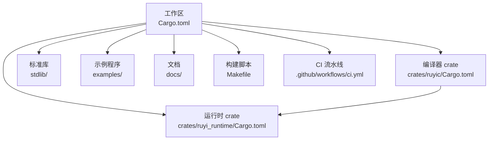
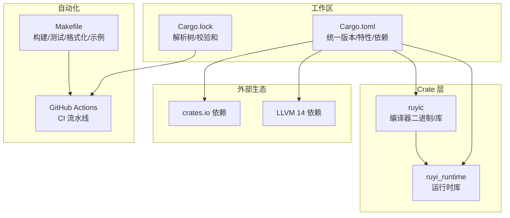
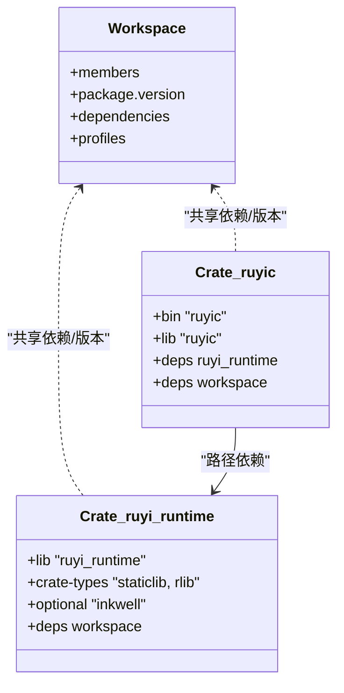
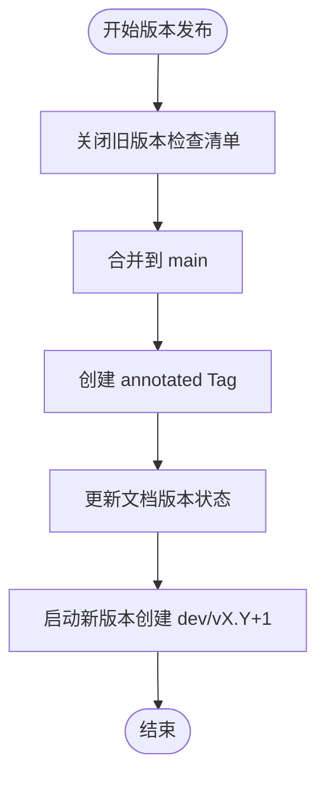
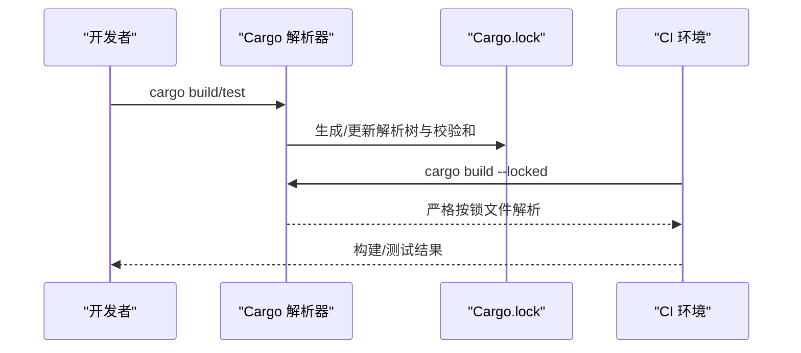
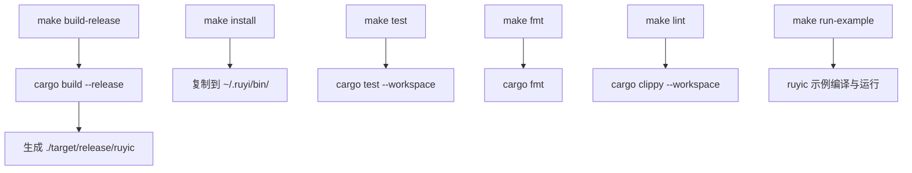
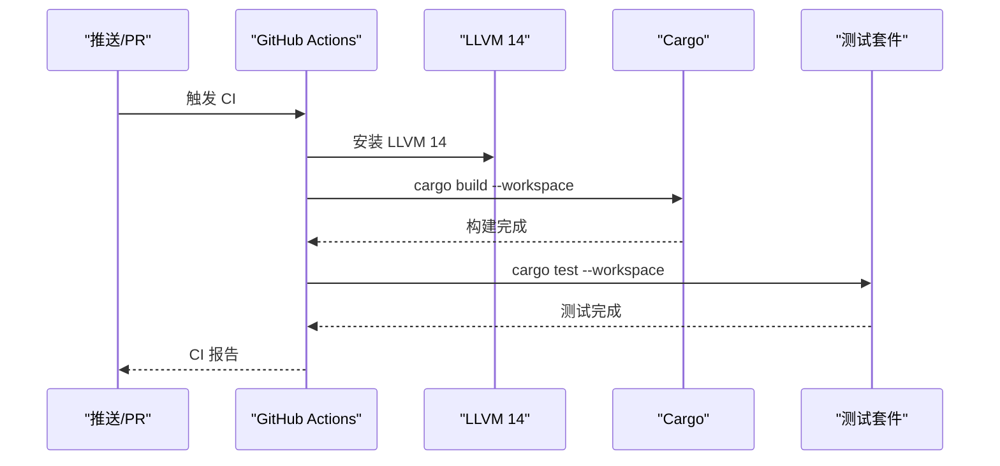
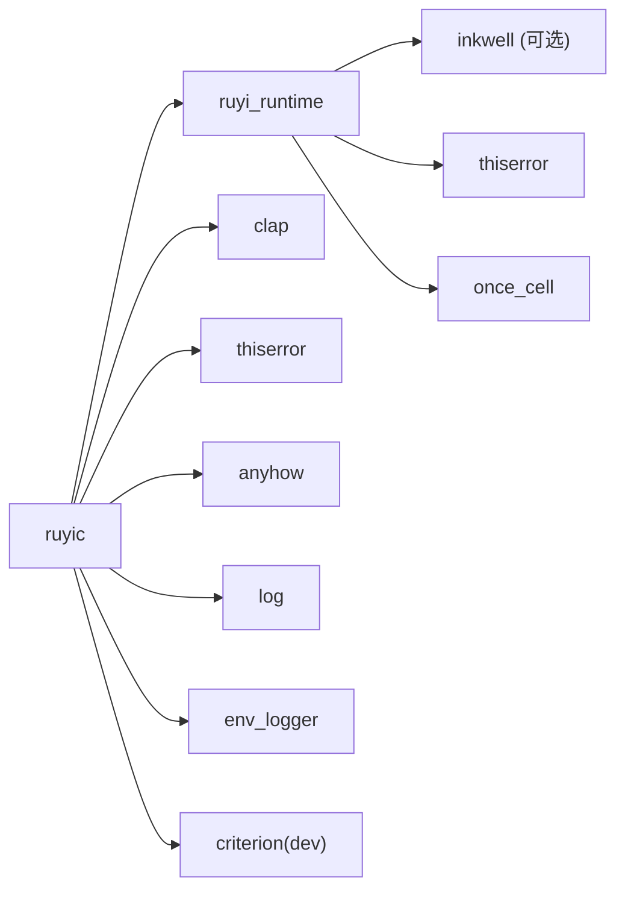

# 包管理与版本控制

<cite>
**本文引用的文件**
- [Cargo.toml](file://Cargo.toml)
- [Cargo.lock](file://Cargo.lock)
- [Makefile](file://Makefile)
- [.github/workflows/ci.yml](file://.github/workflows/ci.yml)
- [crates/ruyic/Cargo.toml](file://crates/ruyic/Cargo.toml)
- [crates/ruyi_runtime/Cargo.toml](file://crates/ruyi_runtime/Cargo.toml)
- [docs/versioning.md](file://docs/versioning.md)
- [docs/roadmap.md](file://docs/roadmap.md)
- [rustfmt.toml](file://rustfmt.toml)
- [README.md](file://README.md)
</cite>

## 目录
1. [简介](#简介)
2. [项目结构](#项目结构)
3. [核心组件](#核心组件)
4. [架构总览](#架构总览)
5. [详细组件分析](#详细组件分析)
6. [依赖关系分析](#依赖关系分析)
7. [性能考量](#性能考量)
8. [故障排查指南](#故障排查指南)
9. [结论](#结论)
10. [附录](#附录)

## 简介
本指南围绕 Ruyi 编程语言的包管理与版本控制体系展开，系统梳理了 Cargo 工作区配置、多 crate 项目的依赖管理策略、版本号规范与语义化版本控制、发布标签管理、依赖锁定机制与 Cargo.lock 文件作用、Makefile 自动化构建与版本管理脚本、CI/CD 流水线中的版本发布流程与自动化部署配置，并给出依赖更新策略与向后兼容性保障方案。内容兼顾工程实践与可操作性，适合不同技术背景的读者快速上手并深入理解。

## 项目结构
Ruyi 采用多 crate 的工作区组织方式，顶层通过工作区配置统一版本、特性与共享依赖，子 crate 分工明确：编译器 ruyic 负责 CLI、类型检查、代码生成与运行时链接；运行时 ruyi_runtime 提供 GC、异步调度与异常处理等底层能力。同时，项目内嵌标准库与示例，配合 Makefile 与 GitHub Actions 实现本地与云端的自动化构建与测试。

图表来源
- [Cargo.toml:1-40](file://Cargo.toml#L1-L40)
- [crates/ruyic/Cargo.toml:1-26](file://crates/ruyic/Cargo.toml#L1-L26)
- [crates/ruyi_runtime/Cargo.toml:1-17](file://crates/ruyi_runtime/Cargo.toml#L1-L17)

章节来源
- [Cargo.toml:1-40](file://Cargo.toml#L1-L40)
- [crates/ruyic/Cargo.toml:1-26](file://crates/ruyic/Cargo.toml#L1-L26)
- [crates/ruyi_runtime/Cargo.toml:1-17](file://crates/ruyi_runtime/Cargo.toml#L1-L17)
- [README.md:75-99](file://README.md#L75-L99)

## 核心组件
- 工作区与共享配置：顶层 Cargo.toml 定义工作区成员、统一版本与共享依赖，确保多 crate 间版本一致性与依赖复用。
- ruyic 编译器：作为二进制与库的聚合体，依赖运行时 crate 与第三方库，负责完整的编译流程与 CLI。
- ruyi_runtime 运行时：提供静态库与动态库两种产物类型，支持可选的 LLVM 绑定特性，便于在无 LLVM 环境下进行快速检查。
- Makefile：提供构建、测试、格式化、安装、示例编译与运行等一键化命令，简化本地开发体验。
- CI/CD：基于 GitHub Actions 的流水线，负责在 Ubuntu 环境安装 LLVM 14 并执行构建与测试。
- 版本与发布：通过文档化的版本号规范、分支模型、Tag 规范与发布检查清单，确保发布质量与可追溯性。
- 锁定与一致性：Cargo.lock 记录解析后的完整依赖树与校验和，保障跨平台与跨时间的一致性构建。

章节来源
- [Cargo.toml:1-40](file://Cargo.toml#L1-L40)
- [crates/ruyic/Cargo.toml:1-26](file://crates/ruyic/Cargo.toml#L1-L26)
- [crates/ruyi_runtime/Cargo.toml:1-17](file://crates/ruyi_runtime/Cargo.toml#L1-L17)
- [Makefile:1-122](file://Makefile#L1-L122)
- [.github/workflows/ci.yml:1-45](file://.github/workflows/ci.yml#L1-L45)
- [docs/versioning.md:1-346](file://docs/versioning.md#L1-L346)
- [Cargo.lock:1-200](file://Cargo.lock#L1-L200)

## 架构总览
Ruyi 的包管理与版本控制架构由“工作区—crate—依赖—锁定—CI”五层构成。工作区统一版本与特性，crate 之间通过路径依赖与共享依赖协作，Cargo.lock 确保解析结果稳定，CI 在受控环境中验证构建与测试，最终通过 Tag 与发布检查清单完成版本发布闭环。

图表来源
- [Cargo.toml:1-40](file://Cargo.toml#L1-L40)
- [Cargo.lock:1-200](file://Cargo.lock#L1-L200)
- [crates/ruyic/Cargo.toml:1-26](file://crates/ruyic/Cargo.toml#L1-L26)
- [crates/ruyi_runtime/Cargo.toml:1-17](file://crates/ruyi_runtime/Cargo.toml#L1-L17)
- [Makefile:1-122](file://Makefile#L1-L122)
- [.github/workflows/ci.yml:1-45](file://.github/workflows/ci.yml#L1-L45)

## 详细组件分析

### Cargo 工作区与多 crate 依赖管理
- 工作区成员：顶层工作区声明 ruyic 与 ruyi_runtime 两个成员，统一版本、编辑器与许可证等元数据，避免重复配置。
- 共享依赖：在工作区层面集中声明 inkwell、clap、thiserror、anyhow、log、env_logger、criterion 等依赖，子 crate 通过 workspace 引用，减少版本漂移。
- 子 crate 配置：
  - ruyic：声明二进制入口、库导出、对 ruyi_runtime 的路径依赖以及工作区共享依赖。
  - ruyi_runtime：默认启用 inkwell 特性，支持静态库与动态库产物，便于在无 LLVM 环境下进行快速检查。
- 依赖解析与特性：通过工作区统一解析，避免各 crate 间版本冲突；运行时 crate 的可选特性允许在不同环境下灵活启用/禁用 LLVM 支持。

图表来源
- [Cargo.toml:1-40](file://Cargo.toml#L1-L40)
- [crates/ruyic/Cargo.toml:1-26](file://crates/ruyic/Cargo.toml#L1-L26)
- [crates/ruyi_runtime/Cargo.toml:1-17](file://crates/ruyi_runtime/Cargo.toml#L1-L17)

章节来源
- [Cargo.toml:1-40](file://Cargo.toml#L1-L40)
- [crates/ruyic/Cargo.toml:1-26](file://crates/ruyic/Cargo.toml#L1-L26)
- [crates/ruyi_runtime/Cargo.toml:1-17](file://crates/ruyi_runtime/Cargo.toml#L1-L17)

### 版本号规范与语义化版本控制
- 版本格式：采用 MAJOR.MINOR.PATCH 结构，遵循语义化版本 2.0.0。
- 阶段标识：alpha（内部测试）、beta（公开测试）、rc（候选发布）、稳定版（无后缀），用于区分发布阶段。
- 递增规则：发布主版本时次版本与修订归零；发布次版本时修订归零；修订版本可随时发布。
- 分支模型：采用 main 与 dev/vX.Y 双轨分支，dev 分支用于功能开发，main 仅接收来自 dev 的合并提交。
- Tag 规范：使用带注释的 Tag，格式为 vMAJOR.MINOR.PATCH，必须打在 main 的合并提交上，且需签名与说明。
- 提交消息：遵循 Conventional Commits，包含 type、scope 与描述，便于自动生成变更日志与触发 CI。

图表来源
- [docs/versioning.md:111-160](file://docs/versioning.md#L111-L160)

章节来源
- [docs/versioning.md:13-41](file://docs/versioning.md#L13-L41)
- [docs/versioning.md:44-76](file://docs/versioning.md#L44-L76)
- [docs/versioning.md:79-108](file://docs/versioning.md#L79-L108)
- [docs/versioning.md:163-202](file://docs/versioning.md#L163-L202)

### 依赖锁定机制与 Cargo.lock 文件
- 自动生成：Cargo.lock 由 Cargo 自动生成，不应手动编辑，确保解析结果稳定。
- 记录内容：包含包名、版本、来源（如 crates.io）、依赖列表与校验和，形成完整的解析树。
- CI 一致性：CI 流水线在受控环境中执行构建与测试，结合 Cargo.lock 保证跨平台一致性。
- 锁定策略：在 CI 中建议使用 --locked 或 --frozen 参数，确保构建失败时能及时暴露依赖变更问题。

图表来源
- [Cargo.lock:1-200](file://Cargo.lock#L1-L200)
- [.github/workflows/ci.yml:23-26](file://.github/workflows/ci.yml#L23-L26)

章节来源
- [Cargo.lock:1-200](file://Cargo.lock#L1-L200)
- [.github/workflows/ci.yml:1-45](file://.github/workflows/ci.yml#L1-L45)

### Makefile 自动化构建与版本管理脚本
- 构建目标：提供 build-debug、build-release、build-runtime 等目标，分别对应调试构建、发布构建与仅运行时检查。
- 安装与清理：install 将二进制安装至用户目录，clean 清理构建产物与示例输出。
- 测试与质量：check、test、test-single、fmt、fmt-check、lint、lint-fix 等目标覆盖类型检查、单元测试、格式化与静态分析。
- 示例与编译：run-example、compile-example、compile-file 支持示例运行与 LLVM IR 输出，便于教学与调试。
- 环境变量：通过 LLVM_SYS_140_PREFIX 控制 LLVM 14 的查找路径，适配 macOS 与 Linux 环境。

图表来源
- [Makefile:18-104](file://Makefile#L18-L104)

章节来源
- [Makefile:1-122](file://Makefile#L1-L122)

### CI/CD 流水线中的版本发布流程与自动化部署
- 触发条件：在推送到 main 与 dev/** 分支或拉取请求时触发。
- 环境准备：在 Ubuntu 环境安装 LLVM 14 开发包并设置 LLVM_SYS_140_PREFIX。
- 核心步骤：构建工作区、运行全部测试；针对代码生成集成测试单独作业，支持继续执行其他步骤。
- 建议增强：可在成功构建后增加构建产物上传、发布预发布版本、自动更新文档站点等步骤，进一步完善发布流程。

图表来源
- [.github/workflows/ci.yml:12-45](file://.github/workflows/ci.yml#L12-L45)

章节来源
- [.github/workflows/ci.yml:1-45](file://.github/workflows/ci.yml#L1-L45)

### 依赖更新策略与向后兼容性保障
- 更新策略：
  - 语义化更新：优先进行补丁与次版本更新，避免破坏性变更；主版本更新需谨慎评估并配套迁移指南。
  - 工作区统一：通过工作区共享依赖集中升级，减少各 crate 间的版本漂移。
  - 锁定验证：在 CI 中使用 --locked 或 --frozen，确保依赖变更被显式记录与审查。
- 向后兼容性：
  - 保持 API 稳定：对公共接口进行破坏性变更时，先引入兼容层或弃用提示，逐步过渡。
  - 文档与示例：同步更新示例与教程，确保用户迁移路径清晰。
  - 测试覆盖：扩大集成测试覆盖面，特别是关键模块（类型系统、运行时、代码生成）的回归测试。

章节来源
- [docs/versioning.md:13-41](file://docs/versioning.md#L13-L41)
- [Cargo.toml:14-31](file://Cargo.toml#L14-L31)
- [.github/workflows/ci.yml:23-26](file://.github/workflows/ci.yml#L23-L26)

## 依赖关系分析
- 直接依赖：ruyic 依赖 ruyi_runtime 与工作区共享依赖；ruyi_runtime 依赖 inkwell（可选）与工作区共享依赖。
- 间接依赖：通过 crates.io 与 LLVM 生态引入大量第三方库，Cargo.lock 记录完整依赖树与校验和。
- 特性与平台：运行时 crate 的 inkwell 特性可按需启用，避免在无 LLVM 环境下的构建失败。

图表来源
- [crates/ruyic/Cargo.toml:19-26](file://crates/ruyic/Cargo.toml#L19-L26)
- [crates/ruyi_runtime/Cargo.toml:11-17](file://crates/ruyi_runtime/Cargo.toml#L11-L17)
- [Cargo.toml:14-31](file://Cargo.toml#L14-L31)

章节来源
- [crates/ruyic/Cargo.toml:1-26](file://crates/ruyic/Cargo.toml#L1-L26)
- [crates/ruyi_runtime/Cargo.toml:1-17](file://crates/ruyi_runtime/Cargo.toml#L1-L17)
- [Cargo.lock:1-200](file://Cargo.lock#L1-L200)

## 性能考量
- 构建性能：工作区统一配置与特性有助于减少重复编译；release 配置开启 LTO 与单代码生成单元，提升运行时性能。
- 代码质量：通过 clippy 与 rustfmt 统一风格与潜在问题检测，降低维护成本。
- CI 成本：在 CI 中使用 --locked 与缓存策略（如 Cargo 缓存）可缩短构建时间。

章节来源
- [Cargo.toml:33-40](file://Cargo.toml#L33-L40)
- [Makefile:61-65](file://Makefile#L61-L65)
- [rustfmt.toml:1-5](file://rustfmt.toml#L1-L5)

## 故障排查指南
- 构建失败（LLVM 相关）：检查 LLVM_SYS_140_PREFIX 是否正确设置，确保系统已安装 LLVM 14 开发包。
- 依赖冲突：在本地执行 cargo tree 查看依赖树，必要时在工作区升级相关依赖并更新 Cargo.lock。
- CI 失败：在本地使用 --locked 与 --frozen 复现 CI 行为，定位具体失败步骤与错误信息。
- 格式与静态检查：使用 make fmt-check 与 make lint-check 快速发现格式与潜在问题。

章节来源
- [Makefile:8-11](file://Makefile#L8-L11)
- [.github/workflows/ci.yml:17-21](file://.github/workflows/ci.yml#L17-L21)
- [Cargo.lock:1-200](file://Cargo.lock#L1-L200)

## 结论
Ruyi 的包管理与版本控制体系以 Cargo 工作区为核心，通过共享依赖、特性开关与锁定文件确保多 crate 协同开发的稳定性与一致性；借助 Makefile 与 GitHub Actions 实现本地与云端的高效自动化；通过文档化的版本号规范与发布流程，保障发布质量与可追溯性。建议在现有基础上进一步完善 CI 的发布与文档更新步骤，持续强化测试覆盖率与向后兼容性策略，为后续包管理器与注册表建设奠定坚实基础。

## 附录
- 版本规划与里程碑：参考路线图文档，明确 v0.6–v0.9 的包管理与注册表建设目标。
- 代码风格：通过 rustfmt.toml 统一格式化参数，配合 Makefile 的格式化目标，确保团队一致性。

章节来源
- [docs/roadmap.md:146-198](file://docs/roadmap.md#L146-L198)
- [rustfmt.toml:1-5](file://rustfmt.toml#L1-L5)