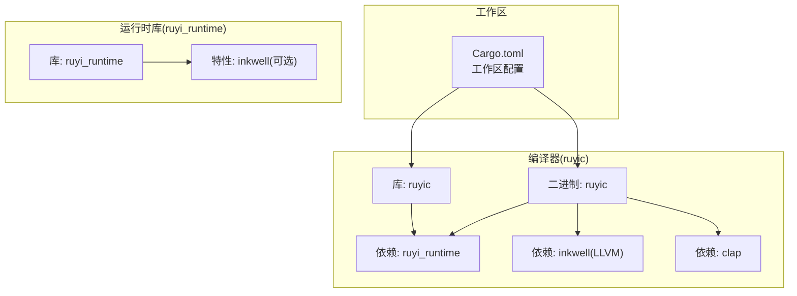
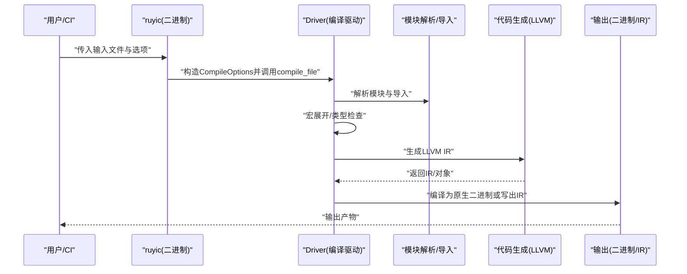
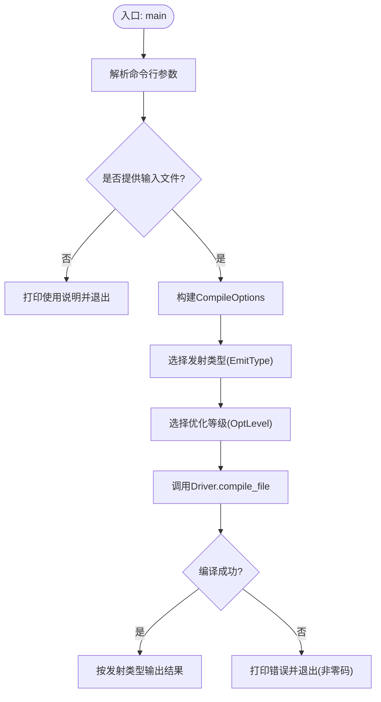
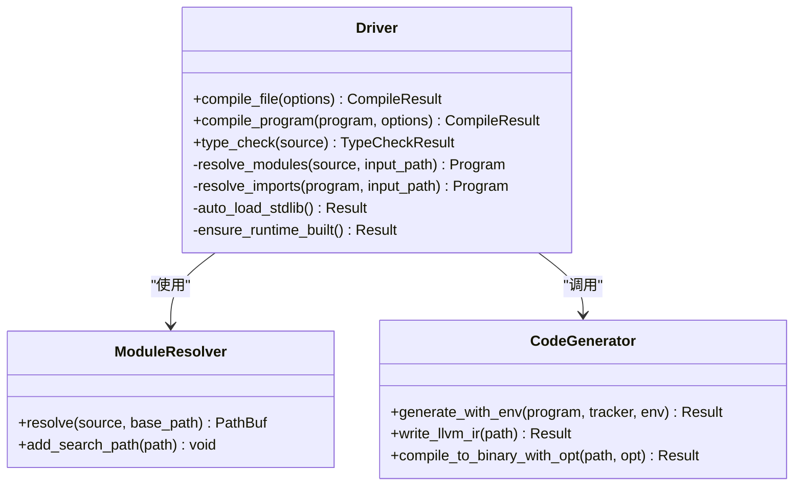
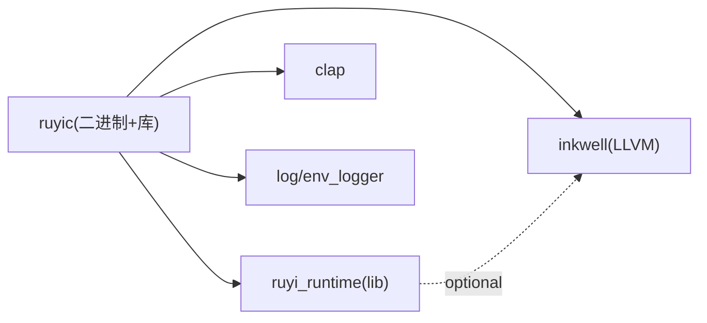

# 容器化部署

<cite>
**本文引用的文件**
- [Cargo.toml](file://Cargo.toml)
- [README.md](file://README.md)
- [.github/workflows/ci.yml](file://.github/workflows/ci.yml)
- [Makefile](file://Makefile)
- [crates/ruyic/Cargo.toml](file://crates/ruyic/Cargo.toml)
- [crates/ruyi_runtime/Cargo.toml](file://crates/ruyi_runtime/Cargo.toml)
- [crates/ruyic/src/main.rs](file://crates/ruyic/src/main.rs)
- [crates/ruyic/src/driver.rs](file://crates/ruyic/src/driver.rs)
- [crates/ruyi_runtime/src/lib.rs](file://crates/ruyi_runtime/src/lib.rs)
</cite>

## 目录
1. [简介](#简介)
2. [项目结构](#项目结构)
3. [核心组件](#核心组件)
4. [架构总览](#架构总览)
5. [详细组件分析](#详细组件分析)
6. [依赖关系分析](#依赖关系分析)
7. [性能考量](#性能考量)
8. [故障排查指南](#故障排查指南)
9. [结论](#结论)
10. [附录](#附录)

## 简介
本指南面向Ruyi编程语言的容器化部署，目标是帮助你在Docker、Docker Compose与Kubernetes环境中高效、安全地交付Ruyi编译器与运行时。内容涵盖：
- Docker镜像构建最佳实践与多阶段构建策略
- 镜像体积压缩与启动时间优化
- 容器编排配置（Docker Compose与Kubernetes）
- 安全配置与权限管理
- 监控与日志收集
- 容器注册表配置与镜像推送流程

## 项目结构
Ruyi采用Rust工作区组织，核心由编译器二进制与运行时库组成。编译器负责从Ruyi源码生成原生二进制；运行时库提供GC、异步调度、异常处理等能力，并在编译期通过LLVM进行代码生成。

图表来源
- [Cargo.toml:1-40](file://Cargo.toml#L1-L40)
- [crates/ruyic/Cargo.toml:1-26](file://crates/ruyic/Cargo.toml#L1-L26)
- [crates/ruyi_runtime/Cargo.toml:1-17](file://crates/ruyi_runtime/Cargo.toml#L1-L17)

章节来源
- [Cargo.toml:1-40](file://Cargo.toml#L1-L40)
- [README.md:75-99](file://README.md#L75-L99)

## 核心组件
- 编译器二进制：命令行驱动，解析参数、选择发射类型（二进制/LLVM IR/AST）、执行编译流水线。
- 编译驱动：负责模块解析、宏展开、类型检查、代码生成、链接输出。
- 运行时库：提供GC、异步调度、异常处理、内置函数与类型映射到LLVM IR。

章节来源
- [crates/ruyic/src/main.rs:16-44](file://crates/ruyic/src/main.rs#L16-L44)
- [crates/ruyic/src/driver.rs:242-256](file://crates/ruyic/src/driver.rs#L242-L256)
- [crates/ruyi_runtime/src/lib.rs:11-49](file://crates/ruyi_runtime/src/lib.rs#L11-L49)

## 架构总览
下图展示Ruyi编译器在容器中的典型运行路径：输入Ruyi源文件，经CLI驱动进入编译流水线，最终生成原生二进制或LLVM IR。

图表来源
- [crates/ruyic/src/main.rs:46-113](file://crates/ruyic/src/main.rs#L46-L113)
- [crates/ruyic/src/driver.rs:258-270](file://crates/ruyic/src/driver.rs#L258-L270)
- [crates/ruyic/src/driver.rs:521-632](file://crates/ruyic/src/driver.rs#L521-L632)

## 详细组件分析

### 组件A：编译器二进制与CLI参数
- 功能要点
  - 命令行参数解析：输入文件、输出路径、优化等级、目标三元组、发射类型（二进制/LLVM IR/AST/检查）。
  - 错误处理：统一映射到编译错误类型并打印诊断信息。
  - 输出结果：根据发射类型返回相应路径或IR字符串。

图表来源
- [crates/ruyic/src/main.rs:46-113](file://crates/ruyic/src/main.rs#L46-L113)

章节来源
- [crates/ruyic/src/main.rs:16-44](file://crates/ruyic/src/main.rs#L16-L44)
- [crates/ruyic/src/main.rs:46-113](file://crates/ruyic/src/main.rs#L46-L113)

### 组件B：编译驱动与流水线
- 功能要点
  - 模块解析：支持相对/绝对路径、RUYI_HOME/stdlib、搜索路径与本地stdlib回退。
  - 导入处理：递归解析导入，合并命名导入、命名重导出与命名空间导入。
  - 类型检查：在检查模式下仅做解析与类型检查，不生成代码。
  - 代码生成：基于inkwell生成LLVM IR，支持不同优化等级。
  - 输出：生成原生二进制或LLVM IR文件。

图表来源
- [crates/ruyic/src/driver.rs:242-256](file://crates/ruyic/src/driver.rs#L242-L256)
- [crates/ruyic/src/driver.rs:149-240](file://crates/ruyic/src/driver.rs#L149-L240)
- [crates/ruyic/src/driver.rs:521-632](file://crates/ruyic/src/driver.rs#L521-L632)

章节来源
- [crates/ruyic/src/driver.rs:242-256](file://crates/ruyic/src/driver.rs#L242-L256)
- [crates/ruyic/src/driver.rs:303-329](file://crates/ruyic/src/driver.rs#L303-L329)
- [crates/ruyic/src/driver.rs:521-632](file://crates/ruyic/src/driver.rs#L521-L632)

### 组件C：运行时库与LLVM类型映射
- 功能要点
  - 对外暴露GC、异步、异常、内置函数等接口。
  - 在启用inkwell特性时，提供Ruyi类型到LLVM类型的映射与上下文封装。

章节来源
- [crates/ruyi_runtime/src/lib.rs:11-49](file://crates/ruyi_runtime/src/lib.rs#L11-L49)
- [crates/ruyi_runtime/src/lib.rs:55-119](file://crates/ruyi_runtime/src/lib.rs#L55-L119)

## 依赖关系分析
- 工作区依赖：inkwell（绑定LLVM 14-18）、clap（命令行解析）、log/env_logger（日志）。
- ruyic依赖：ruyi_runtime、inkwell、clap、log/env_logger。
- ruyi_runtime依赖：inkwell（可选特性）、once_cell等。

图表来源
- [Cargo.toml:14-27](file://Cargo.toml#L14-L27)
- [crates/ruyic/Cargo.toml:19-26](file://crates/ruyic/Cargo.toml#L19-L26)
- [crates/ruyi_runtime/Cargo.toml:11-17](file://crates/ruyi_runtime/Cargo.toml#L11-L17)

章节来源
- [Cargo.toml:14-27](file://Cargo.toml#L14-L27)
- [crates/ruyic/Cargo.toml:19-26](file://crates/ruyic/Cargo.toml#L19-L26)
- [crates/ruyi_runtime/Cargo.toml:11-17](file://crates/ruyi_runtime/Cargo.toml#L11-L17)

## 性能考量
- 发布构建优化
  - 启用LTO与单代码生成单元，提升链接期优化与运行时性能。
  - 参考工作区发布配置，确保编译器与运行时均获得充分优化。
- 代码生成优化
  - 通过Driver选择不同优化等级，结合inkwell目标机器与代码模型进行对象文件生成。
- 启动时间优化建议
  - 使用静态链接或预链接运行时库，减少动态加载开销。
  - 将LLVM初始化与目标机器创建逻辑置于进程生命周期早期，避免重复初始化。
- 镜像体积优化建议
  - 多阶段构建：第一阶段仅安装编译工具链与LLVM，第二阶段仅复制最小运行时产物。
  - 清理构建缓存与调试符号，剥离二进制以减小体积。
  - 使用精简基础镜像（如distroless/static），移除不必要的系统包与壳层。

章节来源
- [Cargo.toml:37-40](file://Cargo.toml#L37-L40)
- [crates/ruyic/src/driver.rs:713-735](file://crates/ruyic/src/driver.rs#L713-L735)

## 故障排查指南
- 常见问题
  - LLVM未就绪：确保在容器内正确安装并设置LLVM前缀环境变量。
  - 模块解析失败：确认RUYI_HOME与stdlib路径存在且可读。
  - 类型检查错误：使用检查模式输出诊断信息，定位具体位置。
- 排查步骤
  - 在容器内执行编译器检查模式，验证语法与类型。
  - 打印AST或LLVM IR以辅助定位中间阶段问题。
  - 查看日志输出与退出码，结合错误类型进行分类处理。

章节来源
- [crates/ruyic/src/main.rs:108-112](file://crates/ruyic/src/main.rs#L108-L112)
- [crates/ruyic/src/driver.rs:21-54](file://crates/ruyic/src/driver.rs#L21-L54)
- [crates/ruyic/src/driver.rs:530-538](file://crates/ruyic/src/driver.rs#L530-L538)

## 结论
通过多阶段构建与精简基础镜像，Ruyi可在容器中实现快速构建与轻量运行。结合严格的权限控制、可观测性与注册表策略，可形成从开发到生产的完整交付闭环。

## 附录

### A. Docker镜像构建最佳实践与多阶段构建策略
- 构建阶段
  - 阶段1（构建）：安装Rust工具链与LLVM 14开发包，设置LLVM前缀，构建release产物。
  - 阶段2（运行）：仅复制最小运行时产物至精简基础镜像，设置非root用户与只读根文件系统。
- 最佳实践
  - 使用分层缓存：先安装系统依赖，再复制源码与构建，最后清理缓存。
  - 启用LTO与单代码生成单元，提升运行时性能。
  - 剥离二进制并清理调试符号，显著降低镜像体积。
- 参考依据
  - 工作区与编译器配置已明确发布优化与LLVM依赖。

章节来源
- [.github/workflows/ci.yml:17-21](file://.github/workflows/ci.yml#L17-L21)
- [Cargo.toml:37-40](file://Cargo.toml#L37-L40)
- [crates/ruyic/Cargo.toml:21](file://crates/ruyic/Cargo.toml#L21)

### B. 容器编排配置（Docker Compose与Kubernetes）
- Docker Compose
  - 单服务编译器：挂载源码卷，设置编译参数，输出目录映射至宿主机。
  - 多服务场景：编译器服务 + 运行时服务（如需要），通过网络共享输出目录。
- Kubernetes
  - Job：一次性任务，用于编译单个或批量源文件。
  - CronJob：定时触发编译任务，配合持久化存储保存产物。
  - ConfigMap/Secret：注入编译参数与敏感配置。
  - PVC：持久化输出目录，便于后续运行或归档。

[本节为概念性说明，无需“章节来源”]

### C. 安全配置与权限管理策略
- 用户与权限
  - 容器内以非root用户运行，限制写权限，仅开放必要的输出目录。
- 资源限制
  - 设置CPU/内存限额，防止资源滥用。
- 网络隔离
  - 默认网络策略，禁止出站访问，必要时仅放行特定域名。
- 供应链安全
  - 固定基础镜像版本，启用镜像签名与漏洞扫描。

[本节为概念性说明，无需“章节来源”]

### D. 监控与日志收集实施方案
- 日志
  - 使用标准输出/错误输出记录编译过程与错误信息，便于容器日志采集。
- 指标
  - 记录编译耗时、产物大小、错误率等指标，接入Prometheus/Grafana。
- 分布式追踪
  - 为编译器添加轻量追踪标记，定位瓶颈。

章节来源
- [crates/ruyic/src/main.rs:108-112](file://crates/ruyic/src/main.rs#L108-L112)

### E. 容器注册表配置与镜像推送流程
- 注册表
  - 使用OCI兼容的私有/公共注册表，启用TLS与鉴权。
- 标签策略
  - 采用语义化版本标签（vX.Y.Z）与latest标签（谨慎使用）。
- 推送流程
  - CI构建完成后，打上版本标签并推送；失败时保留构建工件以便复盘。

[本节为概念性说明，无需“章节来源”]