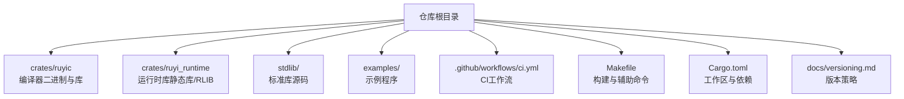
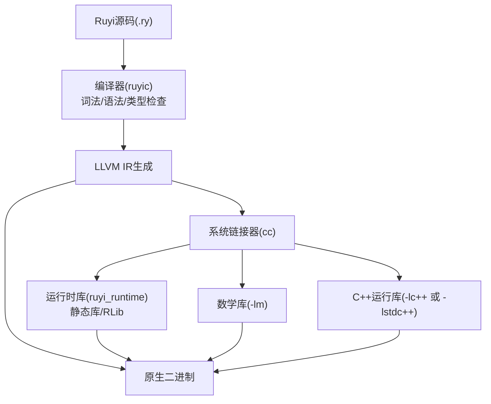
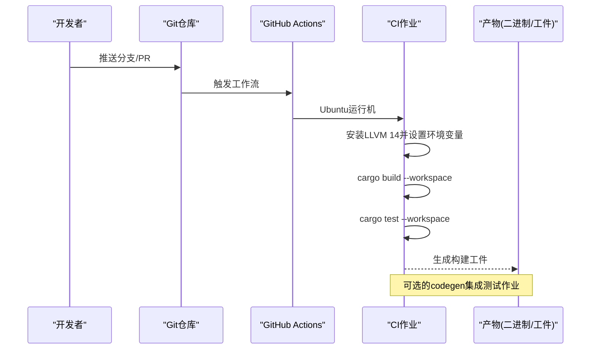
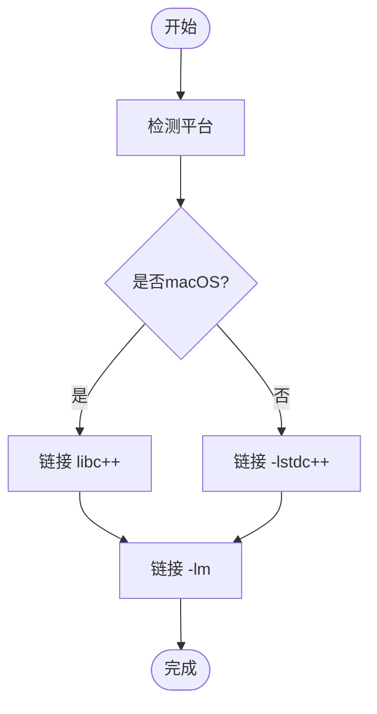
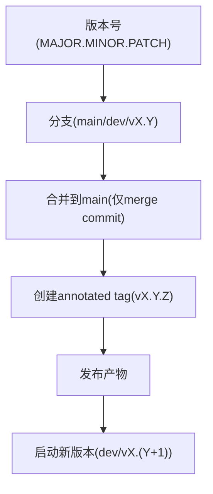
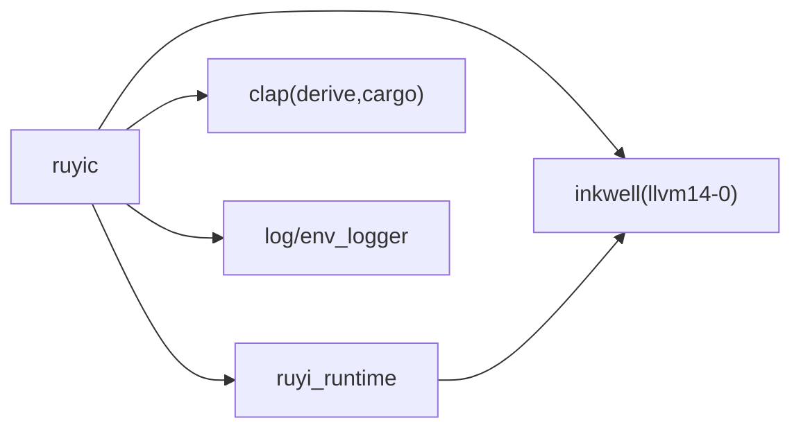

# 部署与分发

<cite>
**本文引用的文件**
- [ci.yml](file://.github/workflows/ci.yml)
- [Cargo.toml](file://Cargo.toml)
- [Makefile](file://Makefile)
- [README.md](file://README.md)
- [rustfmt.toml](file://rustfmt.toml)
- [crates/ruyic/Cargo.toml](file://crates/ruyic/Cargo.toml)
- [crates/ruyi_runtime/Cargo.toml](file://crates/ruyi_runtime/Cargo.toml)
- [docs/versioning.md](file://docs/versioning.md)
- [crates/ruyic/src/codegen/generator.rs](file://crates/ruyic/src/codegen/generator.rs)
- [.gitignore](file://.gitignore)
- [stdlib/process.ry](file://stdlib/process.ry)
</cite>

## 目录
1. [简介](#简介)
2. [项目结构](#项目结构)
3. [核心组件](#核心组件)
4. [架构总览](#架构总览)
5. [详细组件分析](#详细组件分析)
6. [依赖关系分析](#依赖关系分析)
7. [性能考量](#性能考量)
8. [故障排查指南](#故障排查指南)
9. [结论](#结论)
10. [附录](#附录)

## 简介
本指南面向Ruyi编程语言的部署与分发，围绕以下目标展开：交叉编译配置与实现、多平台构建要求与依赖管理、包管理与版本控制策略、发布流程自动化与CI/CD最佳实践、二进制打包与分发、依赖库管理与版本锁定、容器化与镜像构建、云平台部署配置与优化、安全与代码签名、以及部署监控与更新机制。内容基于仓库中的工作流、构建脚本、配置文件与源码进行系统化梳理，并提供可视化图示帮助理解。

## 项目结构
Ruyi采用Rust工作区组织，包含编译器与运行时两个主要crate，配合标准库、示例与文档。顶层Makefile提供便捷的构建、测试、安装与示例编译命令；GitHub Actions负责CI流水线；版本控制策略由独立文档维护。

图表来源
- [Cargo.toml:1-40](file://Cargo.toml#L1-L40)
- [Makefile:1-122](file://Makefile#L1-L122)
- [crates/ruyic/Cargo.toml:1-26](file://crates/ruyic/Cargo.toml#L1-L26)
- [crates/ruyi_runtime/Cargo.toml:1-17](file://crates/ruyi_runtime/Cargo.toml#L1-L17)

章节来源
- [Cargo.toml:1-40](file://Cargo.toml#L1-L40)
- [Makefile:1-122](file://Makefile#L1-L122)
- [README.md:75-99](file://README.md#L75-L99)

## 核心组件
- 工作区与依赖
  - 工作区统一版本与特性，集中声明LLVM绑定、CLI解析、日志与基准等依赖。
  - ruyic依赖ruyi_runtime与inkwell；ruyi_runtime默认启用inkwell特性，亦可作为静态库被链接。
- 构建与测试
  - Makefile提供构建、测试、格式化、Lint、示例编译与安装等目标。
  - CI工作流在Ubuntu上安装LLVM 14，设置环境变量后执行构建与测试。
- 版本与发布
  - 版本策略文档定义语义化版本、分支模型、Tag规范、发布检查清单与回滚程序。
- 二进制生成
  - 编译器在生成LLVM IR后调用系统链接器生成原生二进制，并根据平台选择C++运行库链接参数。

章节来源
- [Cargo.toml:14-40](file://Cargo.toml#L14-L40)
- [crates/ruyic/Cargo.toml:19-26](file://crates/ruyic/Cargo.toml#L19-L26)
- [crates/ruyi_runtime/Cargo.toml:8-17](file://crates/ruyi_runtime/Cargo.toml#L8-L17)
- [Makefile:18-65](file://Makefile#L18-L65)
- [.github/workflows/ci.yml:17-26](file://.github/workflows/ci.yml#L17-L26)
- [docs/versioning.md:13-108](file://docs/versioning.md#L13-L108)
- [crates/ruyic/src/codegen/generator.rs:767-800](file://crates/ruyic/src/codegen/generator.rs#L767-L800)

## 架构总览
下图展示从源码到可执行二进制的关键路径：编译器接收Ruyi源码，经词法/语法/类型检查与LLVM IR生成，再由系统链接器链接运行时库与数学/标准C++库，最终产出原生二进制。

图表来源
- [crates/ruyic/src/codegen/generator.rs:767-800](file://crates/ruyic/src/codegen/generator.rs#L767-L800)
- [crates/ruyic/Cargo.toml:19-26](file://crates/ruyic/Cargo.toml#L19-L26)
- [crates/ruyi_runtime/Cargo.toml:8-17](file://crates/ruyi_runtime/Cargo.toml#L8-L17)

## 详细组件分析

### CI/CD与发布自动化
- CI工作流要点
  - 触发：推送到主干与dev分支，拉取请求针对主干。
  - 环境：Ubuntu运行机，安装LLVM 14并设置LLVM_SYS_140_PREFIX。
  - 步骤：安装Rust工具链，构建工作区，运行测试；另有一个可选的codegen集成测试作业。
- 发布流程
  - 版本策略文档定义了语义化版本、分支模型、Tag规范、发布检查清单与回滚程序。
  - 发布前需完成类型检查、测试、Clippy、格式化与示例运行验证。

图表来源
- [.github/workflows/ci.yml:1-45](file://.github/workflows/ci.yml#L1-L45)
- [docs/versioning.md:111-160](file://docs/versioning.md#L111-L160)

章节来源
- [.github/workflows/ci.yml:1-45](file://.github/workflows/ci.yml#L1-L45)
- [docs/versioning.md:111-160](file://docs/versioning.md#L111-L160)

### 交叉编译与平台适配
- 平台要求
  - macOS/Linux均需LLVM 14开发头文件；Makefile默认尝试从Homebrew或/usr/local/opt定位LLVM 14。
  - CI在Ubuntu上安装LLVM 14并设置LLVM_SYS_140_PREFIX。
- 链接器与运行库
  - 链接阶段自动选择C++运行库：macOS使用libc++，其他平台使用libstdc++。
  - 链接数学库-m。
- 交叉编译建议
  - 使用目标三元组与Rust目标配置，结合LLVM_SYS_*系列环境变量指向目标平台LLVM。
  - 在CI中为不同平台矩阵构建，分别安装对应平台LLVM并设置环境变量。

图表来源
- [crates/ruyic/src/codegen/generator.rs:767-794](file://crates/ruyic/src/codegen/generator.rs#L767-L794)

章节来源
- [Makefile:9-11](file://Makefile#L9-L11)
- [.github/workflows/ci.yml:17-21](file://.github/workflows/ci.yml#L17-L21)
- [crates/ruyic/src/codegen/generator.rs:767-794](file://crates/ruyic/src/codegen/generator.rs#L767-L794)

### 包管理与版本控制策略
- 语义化版本
  - MAJOR/MINOR/PATCH与alpha/beta/rc阶段标识。
- 分支模型
  - main为稳定发布线，dev/vX.Y为开发分支，永久保留且仅允许合并提交。
- Tag规范
  - annotated tag，格式vX.Y.Z，必须打在main的merge commit上。
- 发布检查清单
  - 包括类型检查、测试、Clippy、格式化、示例运行、更新路线图等。
- 回滚程序
  - 针对合并后未打Tag、已打Tag后发现严重Bug、紧急回滚等场景提供步骤。

图表来源
- [docs/versioning.md:13-108](file://docs/versioning.md#L13-L108)
- [docs/versioning.md:111-160](file://docs/versioning.md#L111-L160)

章节来源
- [docs/versioning.md:13-108](file://docs/versioning.md#L13-L108)
- [docs/versioning.md:111-160](file://docs/versioning.md#L111-L160)

### 二进制打包与分发
- 产物来源
  - ruyic二进制位于target/release/ruyic；可通过Makefile install目标安装至用户目录下的bin。
- 打包建议
  - 将二进制与ruyi_runtime静态库打包为发行包，包含必要的运行时依赖与平台说明。
  - 为不同平台提供独立包，记录LLVM版本与链接器要求。
- 分发渠道
  - 通过CI上传到发布页或制品库；在文档中提供下载与校验指引。

章节来源
- [Makefile:25-33](file://Makefile#L25-L33)
- [crates/ruyi_runtime/Cargo.toml:8-9](file://crates/ruyi_runtime/Cargo.toml#L8-L9)

### 依赖库管理与版本锁定
- 工作区统一版本与特性，避免版本漂移。
- 依赖锁定
  - 使用Cargo.lock（由仓库忽略列表可见）确保可重复构建。
- 平台依赖
  - LLVM 14（inkwell支持14-18），通过LLVM_SYS_140_PREFIX指向系统LLVM。
- 最小验证
  - 无LLVM环境时可仅检查运行时（跳过inkwell）与工作区类型检查。

章节来源
- [Cargo.toml:14-27](file://Cargo.toml#L14-L27)
- [.gitignore:4](file://.gitignore#L4)
- [Makefile:327-331](file://Makefile#L327-L331)

### Docker容器化与镜像构建
- 构建环境
  - 基于Ubuntu/Debian镜像安装LLVM 14与Rust工具链，设置LLVM_SYS_140_PREFIX。
- 多阶段构建
  - 第一阶段：安装依赖并构建release二进制。
  - 第二阶段：仅复制二进制与必要运行时库，减小镜像体积。
- 入口与命令
  - 容器入口可直接运行ruyic或提供交互式shell。
- 安全加固
  - 使用只读根文件系统、非root用户运行、最小权限原则。

[本节为概念性指导，不直接分析具体文件，故无“章节来源”]

### 云平台部署配置与优化
- 镜像分发
  - 使用容器注册表分发镜像，结合标签策略（如vX.Y.Z、latest）。
- 配置管理
  - 通过环境变量传递LLVM路径与编译选项；在Pod/实例中注入配置。
- 优化策略
  - 预热运行时库、缓存编译中间产物、按需伸缩构建节点。
- 监控与可观测性
  - 结合日志、指标与追踪，记录构建时间、失败率与资源消耗。

[本节为概念性指导，不直接分析具体文件，故无“章节来源”]

### 安全与代码签名
- 代码签名
  - 对发布二进制与包进行数字签名，提供公钥与校验流程。
- 供应链安全
  - 锁定依赖版本、启用Cargo.toml与锁文件、定期审计依赖。
- 传输安全
  - 使用HTTPS与TLS，启用完整性校验（哈希/签名）。

[本节为概念性指导，不直接分析具体文件，故无“章节来源”]

### 部署监控与更新机制
- 监控
  - 记录构建与发布指标，异常告警与日志聚合。
- 更新机制
  - 提供自更新命令或脚本，校验签名与版本，原子替换二进制。
- 回滚
  - 通过版本标签快速回退至上一稳定版本。

[本节为概念性指导，不直接分析具体文件，故无“章节来源”]

## 依赖关系分析
- 组件耦合
  - ruyic依赖ruyi_runtime与inkwell；ruyi_runtime默认启用inkwell特性，亦可作为静态库被链接。
  - 工作区统一管理版本与特性，降低耦合度。
- 外部依赖
  - LLVM 14（inkwell 0.2，支持14-18）；clap用于CLI；log/env_logger用于日志；criterion用于基准。
- 潜在循环依赖
  - 当前结构为单向依赖（ruyic -> ruyi_runtime），未见循环。

图表来源
- [Cargo.toml:14-27](file://Cargo.toml#L14-L27)
- [crates/ruyic/Cargo.toml:19-26](file://crates/ruyic/Cargo.toml#L19-L26)
- [crates/ruyi_runtime/Cargo.toml:11-17](file://crates/ruyi_runtime/Cargo.toml#L11-L17)

章节来源
- [Cargo.toml:14-27](file://Cargo.toml#L14-L27)
- [crates/ruyic/Cargo.toml:19-26](file://crates/ruyic/Cargo.toml#L19-L26)
- [crates/ruyi_runtime/Cargo.toml:11-17](file://crates/ruyi_runtime/Cargo.toml#L11-L17)

## 性能考量
- 构建性能
  - release配置启用LTO与单代码生成单元，提升运行时性能。
  - 使用工作区并行构建减少重复编译。
- 链接性能
  - 链接阶段仅链接必要库（数学库与C++运行库），避免冗余符号。
- CI加速
  - 缓存Cargo registry与下载缓存，复用LLVM安装结果。

章节来源
- [Cargo.toml:37-40](file://Cargo.toml#L37-L40)
- [.github/workflows/ci.yml:17-21](file://.github/workflows/ci.yml#L17-L21)

## 故障排查指南
- 构建失败（LLVM相关）
  - 确认LLVM 14已安装且LLVM_SYS_140_PREFIX正确；在macOS使用Homebrew，在Linux使用包管理器。
  - 若无LLVM环境，可仅检查运行时（跳过inkwell）与工作区类型检查。
- 链接失败（异常处理）
  - 链接器报错包含C++异常符号时，确认已链接对应平台C++运行库（libc++或libstdc++）。
- 示例运行失败
  - 使用Makefile提供的示例编译与运行目标进行验证。
- 格式与Lint问题
  - 使用Makefile目标格式化与Lint，确保符合仓库风格与规范。

章节来源
- [Makefile:327-331](file://Makefile#L327-L331)
- [crates/ruyic/src/codegen/generator.rs:767-794](file://crates/ruyic/src/codegen/generator.rs#L767-L794)
- [Makefile:69-104](file://Makefile#L69-L104)
- [rustfmt.toml:1-5](file://rustfmt.toml#L1-L5)

## 结论
本指南基于仓库现有配置与源码，给出了Ruyi部署与分发的系统化方案：明确的CI/CD流程、跨平台构建与链接策略、严格的版本控制与发布检查、可扩展的容器化与云平台部署思路，以及安全与监控更新机制的实施建议。建议在实际落地时结合团队流程与合规要求进一步细化。

## 附录
- 开发者命令速查
  - 构建：cargo build --release；cargo build -p ruyic
  - 检查：cargo check --workspace；cargo check -p ruyi_runtime --no-default-features
  - 测试：cargo test --workspace；cargo test -p ruyic --test <test_name>
  - Lint与格式：cargo clippy --workspace；cargo fmt
- 示例与编译
  - 运行示例：make run-example EXAMPLE=hello
  - 生成LLVM IR：make compile-example EXAMPLE=hello
  - 编译单文件：make compile-file FILE=path/to/file.ry

章节来源
- [README.md:101-119](file://README.md#L101-L119)
- [Makefile:69-104](file://Makefile#L69-L104)