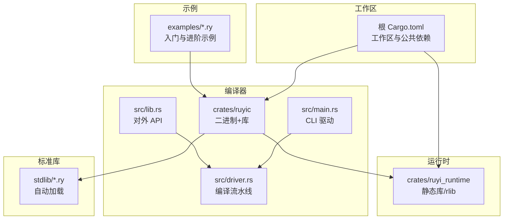
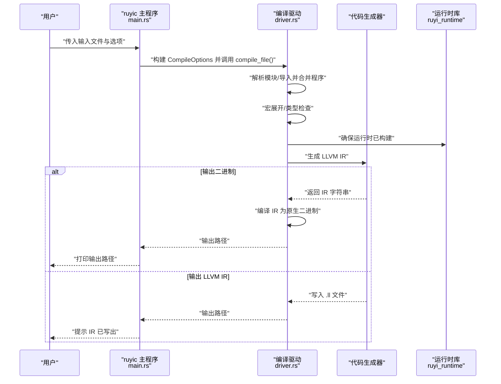
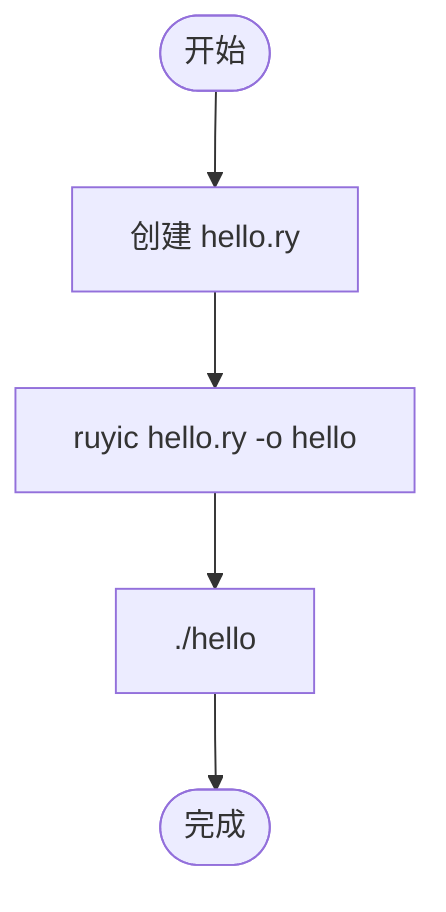
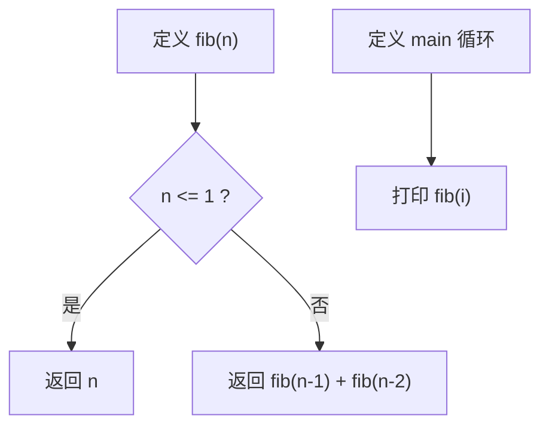
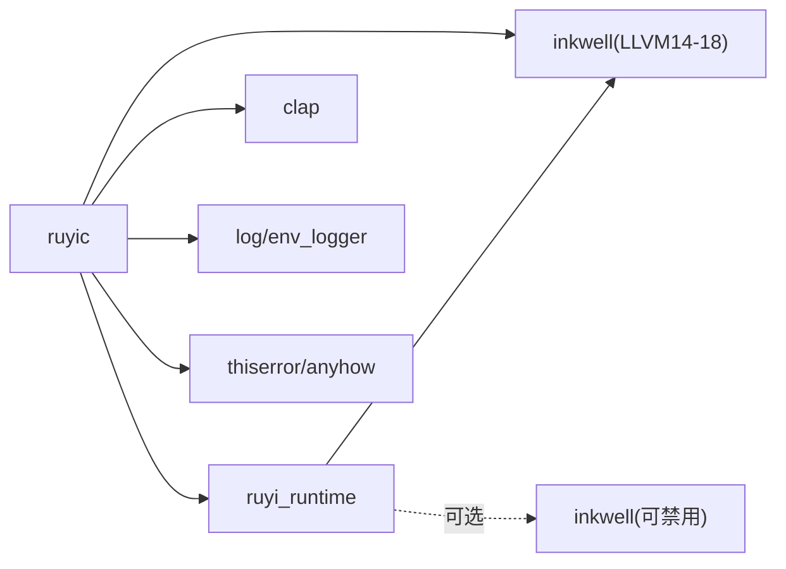

# 快速开始

<cite>
**本文引用的文件**   
- [README.md](file://README.md)
- [Cargo.toml](file://Cargo.toml)
- [crates/ruyic/Cargo.toml](file://crates/ruyic/Cargo.toml)
- [crates/ruyi_runtime/Cargo.toml](file://crates/ruyi_runtime/Cargo.toml)
- [crates/ruyic/src/main.rs](file://crates/ruyic/src/main.rs)
- [crates/ruyic/src/driver.rs](file://crates/ruyic/src/driver.rs)
- [crates/ruyic/src/lib.rs](file://crates/ruyic/src/lib.rs)
- [examples/hello.ry](file://examples/hello.ry)
- [examples/fibonacci.ry](file://examples/fibonacci.ry)
- [examples/run_examples.sh](file://examples/run_examples.sh)
- [stdlib/core.ry](file://stdlib/core.ry)
- [docs/tutorial.md](file://docs/tutorial.md)
- [examples/control_flow.ry](file://examples/control_flow.ry)
- [examples/functions.ry](file://examples/functions.ry)
- [examples/error_handling.ry](file://examples/error_handling.ry)
- [examples/try_catch.ry](file://examples/try_catch.ry)
</cite>

## 目录
1. [简介](#简介)
2. [项目结构](#项目结构)
3. [核心组件](#核心组件)
4. [架构总览](#架构总览)
5. [详细组件分析](#详细组件分析)
6. [依赖关系分析](#依赖关系分析)
7. [性能注意事项](#性能注意事项)
8. [故障排除指南](#故障排除指南)
9. [结论](#结论)
10. [附录](#附录)

## 简介
本指南面向首次接触 Ruyi 的用户，帮助你在最短时间内完成环境准备、安装编译器、编写并运行第一个 Ruyi 程序，并逐步掌握基础语法与常用特性。Ruyi 是一门基于 JavaScript 严格模式语法、通过 LLVM 编译到原生机器码的通用编程语言，具备渐进式类型系统、空安全、模式匹配、泛型、traits、异步/await、异常处理与宏等特性。

## 项目结构
仓库采用多 crate 的工作区组织方式，核心目录与职责如下：
- crates/ruyic：编译器二进制与库，负责从源码到 LLVM IR 再到原生二进制的完整流水线
- crates/ruyi_runtime：运行时库（GC、异步、异常），作为链接阶段的静态库被 ruyic 使用
- stdlib：标准库源码（.ry 文件），在编译期自动加载
- examples：示例程序集合，覆盖控制流、函数、错误处理、类与 traits 等主题
- docs：语言规范与教程文档
- 根级 Cargo.toml：工作区定义与公共依赖（inkwell LLVM 绑定）

**图表来源**
- [Cargo.toml:1-40](file://Cargo.toml#L1-L40)
- [crates/ruyic/Cargo.toml:1-26](file://crates/ruyic/Cargo.toml#L1-L26)
- [crates/ruyi_runtime/Cargo.toml:1-17](file://crates/ruyi_runtime/Cargo.toml#L1-L17)
- [crates/ruyic/src/main.rs:1-114](file://crates/ruyic/src/main.rs#L1-L114)
- [crates/ruyic/src/driver.rs:1-744](file://crates/ruyic/src/driver.rs#L1-L744)

**章节来源**
- [Cargo.toml:1-40](file://Cargo.toml#L1-L40)
- [README.md:75-99](file://README.md#L75-L99)

## 核心组件
- 命令行驱动（CLI）：解析参数、构建编译选项、调用编译流水线并输出结果或错误信息
- 编译驱动（Driver）：串联词法分析、语法分析、宏展开、类型检查、代码生成、链接与输出
- 运行时库：提供 GC、异步调度、异常支持等运行时能力
- 标准库：核心类型与操作（如整数、浮点、布尔的 toString 等），自动注入到每个程序中

**章节来源**
- [crates/ruyic/src/main.rs:16-114](file://crates/ruyic/src/main.rs#L16-L114)
- [crates/ruyic/src/driver.rs:242-744](file://crates/ruyic/src/driver.rs#L242-L744)
- [crates/ruyi_runtime/Cargo.toml:8-17](file://crates/ruyi_runtime/Cargo.toml#L8-L17)
- [stdlib/core.ry:11-31](file://stdlib/core.ry#L11-L31)

## 架构总览
Ruyi 编译器的端到端流程如下：源码输入 → 词法/语法分析 → 宏展开 → 类型检查 → 代码生成（LLVM IR）→ 链接生成原生二进制；同时支持仅输出 AST、带类型 AST 或 LLVM IR 用于调试。

**图表来源**
- [crates/ruyic/src/main.rs:46-114](file://crates/ruyic/src/main.rs#L46-L114)
- [crates/ruyic/src/driver.rs:258-632](file://crates/ruyic/src/driver.rs#L258-L632)

**章节来源**
- [crates/ruyic/src/main.rs:46-114](file://crates/ruyic/src/main.rs#L46-L114)
- [crates/ruyic/src/driver.rs:521-632](file://crates/ruyic/src/driver.rs#L521-L632)

## 详细组件分析

### 安装与环境准备
- Rust 工具链：使用 2021 版本
- LLVM 14：编译器依赖 inkwell（支持 LLVM 14-18），需满足版本要求
  - macOS：使用包管理器安装后设置 LLVM_SYS_140_PREFIX
  - Linux：通过发行版包管理器安装开发头文件
- 构建编译器：在仓库根目录执行发布构建，产物位于 target/release/ruyic

提示：若需要仅检查类型而不链接，可参考开发者命令中的 cargo check 指令。

**章节来源**
- [README.md:26-41](file://README.md#L26-L41)
- [Cargo.toml:14-16](file://Cargo.toml#L14-L16)

### 第一个 Ruyi 程序：Hello World
- 创建 hello.ry，内容为一条打印语句
- 使用 ruyic 编译为二进制并运行
- 可选：使用 --emit-llvm 查看生成的 LLVM IR

**图表来源**
- [examples/hello.ry:1-2](file://examples/hello.ry#L1-L2)
- [README.md:43-56](file://README.md#L43-L56)

**章节来源**
- [examples/hello.ry:1-2](file://examples/hello.ry#L1-L2)
- [README.md:43-56](file://README.md#L43-L56)

### 编译器基本使用
- 基本用法：ruyic <输入文件> [选项]
- 常用选项
  - -o <输出名>：指定输出二进制名称
  - --emit-llvm：输出 LLVM IR 而非二进制
  - --emit-ast / --emit-typed-ast：输出 AST（调试用途）
  - --check：仅解析与类型检查（不进行代码生成）
  - -O0 / -O1 / -O2：优化级别（默认 -O0）
  - --debug：包含调试符号
  - --version：打印版本
- 目标三元组：可通过 --target 指定（如 x86_64-unknown-linux-gnu）

**章节来源**
- [README.md:58-74](file://README.md#L58-L74)
- [crates/ruyic/src/main.rs:16-44](file://crates/ruyic/src/main.rs#L16-L44)

### 语言基础与示例：斐波那契数列
- 示例程序展示了函数声明、条件判断、循环与字符串拼接
- 编译与运行流程同 Hello World

**图表来源**
- [examples/fibonacci.ry:1-19](file://examples/fibonacci.ry#L1-L19)

**章节来源**
- [README.md:152-167](file://README.md#L152-L167)
- [examples/fibonacci.ry:1-19](file://examples/fibonacci.ry#L1-L19)

### 控制流与函数基础
- 控制流：if/else、for、while、break/continue、带标签的 break/continue
- 函数：函数声明、返回类型推断、箭头函数、默认参数、rest 参数、解构参数
- 示例程序演示了上述特性并带有主函数入口

**章节来源**
- [docs/tutorial.md:394-536](file://docs/tutorial.md#L394-L536)
- [docs/tutorial.md:539-686](file://docs/tutorial.md#L539-L686)
- [examples/control_flow.ry:1-160](file://examples/control_flow.ry#L1-L160)
- [examples/functions.ry:1-114](file://examples/functions.ry#L1-L114)

### 错误处理与异常
- try/catch/finally：支持多 catch 分支、抛出自定义错误类型、finally 总会执行
- never 类型：表示不可达，常用于 fail 辅助函数
- 示例程序覆盖了基本 try-catch、多 catch、抛错与 finally 行为

**章节来源**
- [examples/error_handling.ry:1-230](file://examples/error_handling.ry#L1-L230)
- [examples/try_catch.ry:1-14](file://examples/try_catch.ry#L1-L14)

### 标准库与内置类型
- 核心类型与方法：Int/Float/Bool.toString 等由标准库提供
- 自动可用：无需显式导入，所有程序均可直接使用

**章节来源**
- [stdlib/core.ry:11-31](file://stdlib/core.ry#L11-L31)

## 依赖关系分析
- 工作区依赖：inkwell（绑定 LLVM 14-18）、clap（命令行解析）、日志与错误处理等
- ruyic 依赖：ruyi_runtime、inkwell、clap、日志与错误处理库
- ruyi_runtime：默认启用 inkwell 功能，可作为静态库与 ruyic 链接

**图表来源**
- [Cargo.toml:14-27](file://Cargo.toml#L14-L27)
- [crates/ruyic/Cargo.toml:19-26](file://crates/ruyic/Cargo.toml#L19-L26)
- [crates/ruyi_runtime/Cargo.toml:11-17](file://crates/ruyi_runtime/Cargo.toml#L11-L17)

**章节来源**
- [Cargo.toml:1-40](file://Cargo.toml#L1-L40)
- [crates/ruyic/Cargo.toml:1-26](file://crates/ruyic/Cargo.toml#L1-L26)
- [crates/ruyi_runtime/Cargo.toml:1-17](file://crates/ruyi_runtime/Cargo.toml#L1-L17)

## 性能注意事项
- 优化级别：-O0/-O1/-O2，默认 -O0；生产建议使用 -O2
- 发布构建：cargo build --release 产出更优性能的二进制
- LTO：工作区 release 配置启用 LTO 与单代码单元，有助于整体优化
- 调试符号：--debug 便于定位问题但会增大体积与影响性能

**章节来源**
- [README.md:58-74](file://README.md#L58-L74)
- [Cargo.toml:37-40](file://Cargo.toml#L37-L40)

## 故障排除指南
- 未找到编译器二进制
  - 现象：./target/release/ruyic 不存在
  - 处理：先执行 cargo build --release 构建
- 未设置 LLVM 14 前缀（macOS）
  - 现象：inkwell 找不到 LLVM 14
  - 处理：安装 llvm@14 后设置 LLVM_SYS_140_PREFIX
- Linux 缺少开发头文件
  - 现象：inkwell/LLVM 相关编译失败
  - 处理：通过包管理器安装 llvm-14-dev
- 运行时构建失败
  - 现象：链接阶段找不到 ruyi_runtime
  - 处理：确保 cargo build -p ruyi_runtime 成功；必要时添加 --lib --no-default-features
- 模块未找到
  - 现象：import 语句报错
  - 处理：确认模块路径、RUYI_HOME/stdlib、相对路径与搜索路径配置
- 类型错误或语法错误
  - 处理：使用 --emit-typed-ast 或 --check 快速定位；结合教程与示例修正
- 输出 LLVM IR 与二进制
  - 处理：--emit-llvm 输出 .ll 文件；默认输出原生二进制于 target/ 目录

**章节来源**
- [README.md:26-41](file://README.md#L26-L41)
- [crates/ruyic/src/driver.rs:282-300](file://crates/ruyic/src/driver.rs#L282-L300)
- [crates/ruyic/src/driver.rs:173-234](file://crates/ruyic/src/driver.rs#L173-L234)
- [examples/run_examples.sh:267-271](file://examples/run_examples.sh#L267-L271)

## 结论
通过本快速开始指南，你已经完成了环境准备、安装编译器、编写并运行了 Hello World，还体验了斐波那契示例与基础语法特性。建议继续阅读教程与语言规范，深入探索类与 traits、泛型、模式匹配与异步编程等高级主题。

## 附录

### 常用命令速查
- 构建：cargo build --release
- 检查：cargo check --workspace
- 测试：cargo test --workspace
- 格式化：cargo fmt
- 运行示例：./examples/run_examples.sh

**章节来源**
- [README.md:101-119](file://README.md#L101-L119)
- [examples/run_examples.sh:1-120](file://examples/run_examples.sh#L1-L120)