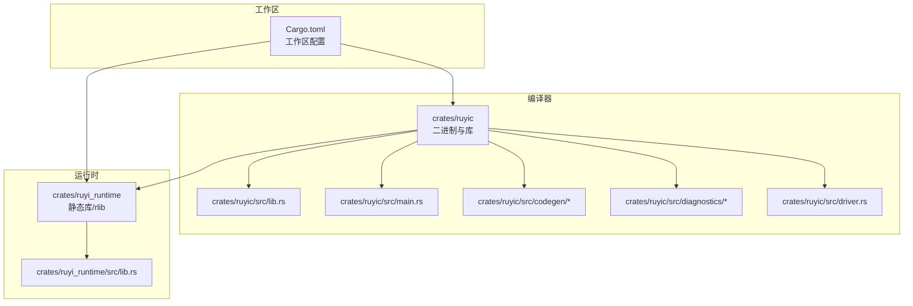
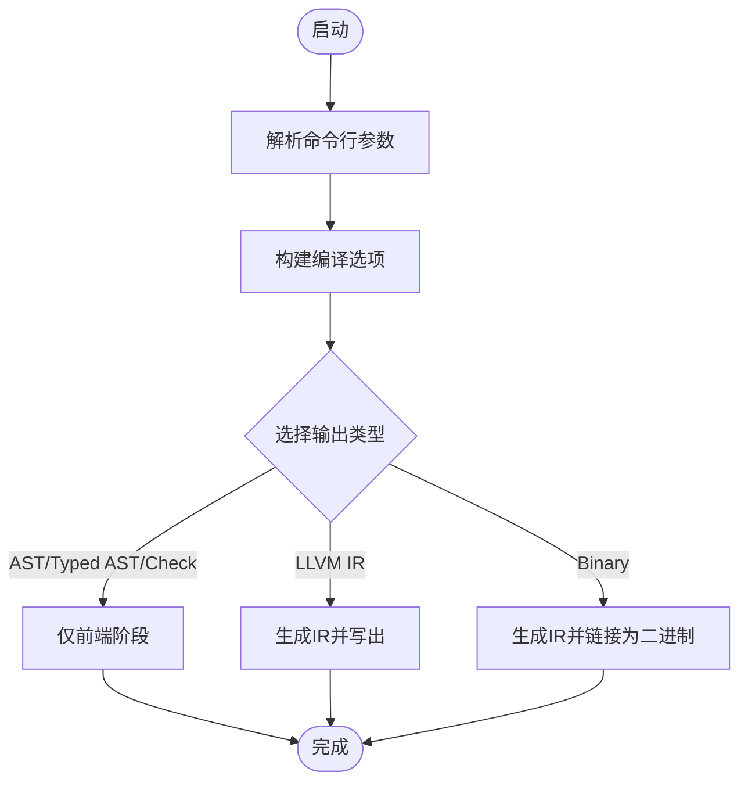
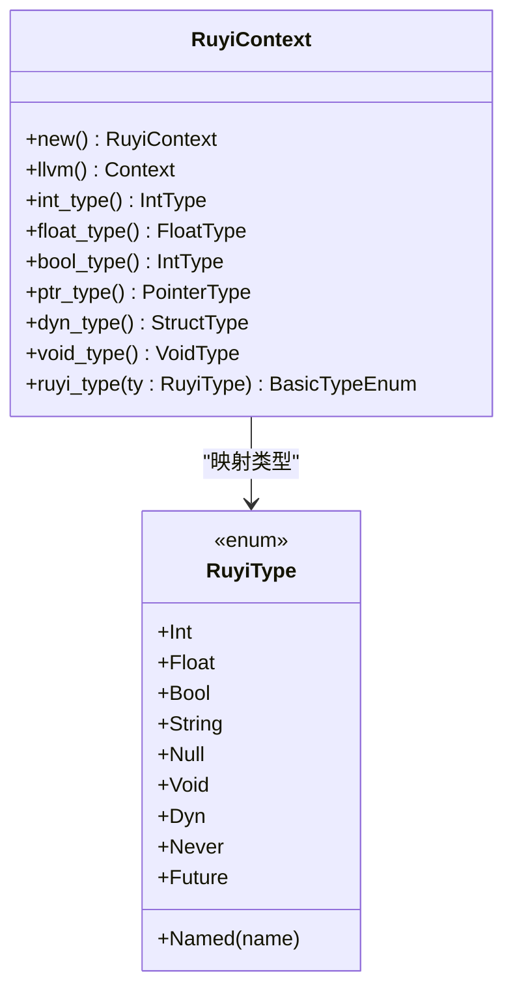
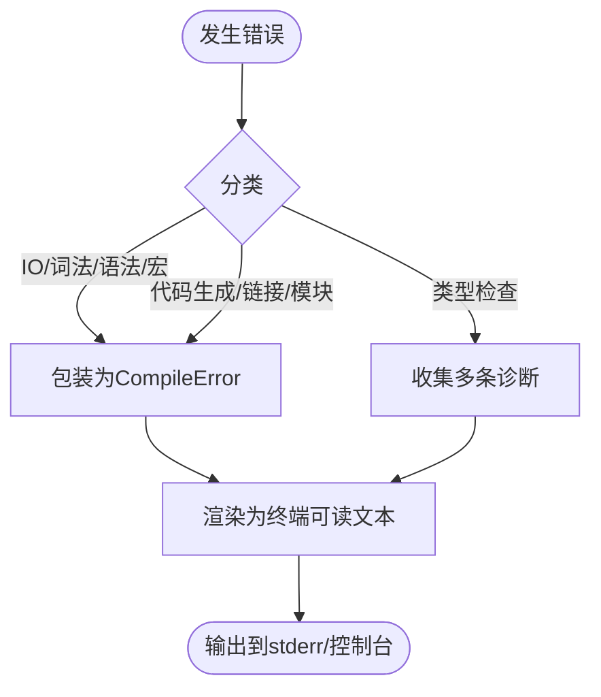
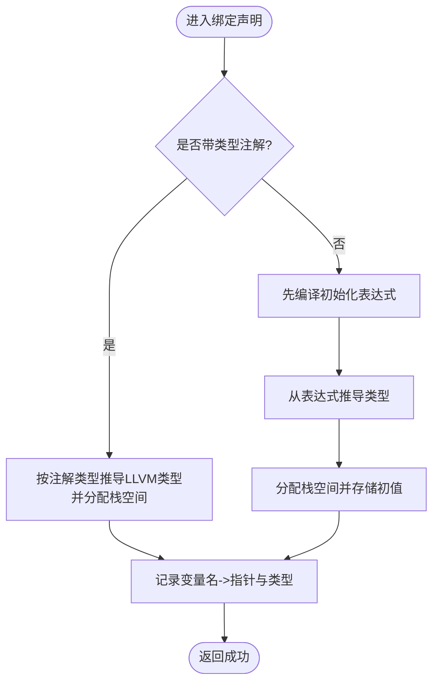
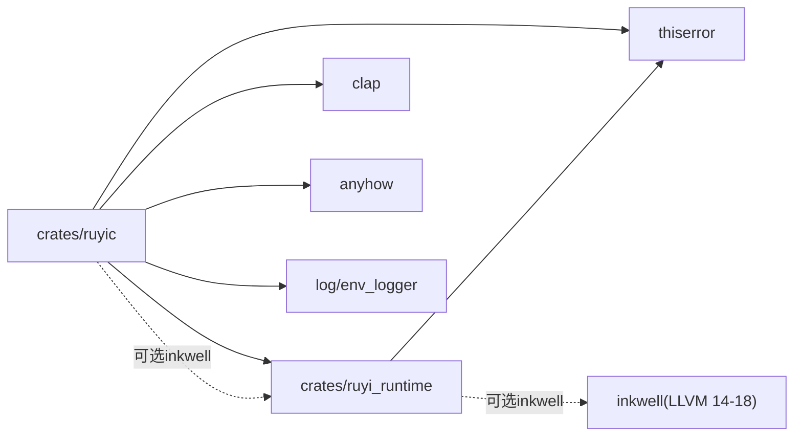

# 技术栈

<cite>
**本文引用的文件**
- [Cargo.toml](file://Cargo.toml)
- [crates/ruyic/Cargo.toml](file://crates/ruyic/Cargo.toml)
- [crates/ruyi_runtime/Cargo.toml](file://crates/ruyi_runtime/Cargo.toml)
- [.github/workflows/ci.yml](file://.github/workflows/ci.yml)
- [rustfmt.toml](file://rustfmt.toml)
- [Makefile](file://Makefile)
- [README.md](file://README.md)
- [crates/ruyic/src/main.rs](file://crates/ruyic/src/main.rs)
- [crates/ruyic/src/lib.rs](file://crates/ruyic/src/lib.rs)
- [crates/ruyi_runtime/src/lib.rs](file://crates/ruyi_runtime/src/lib.rs)
- [crates/ruyic/src/driver.rs](file://crates/ruyic/src/driver.rs)
- [crates/ruyic/src/diagnostics/render.rs](file://crates/ruyic/src/diagnostics/render.rs)
- [crates/ruyic/src/codegen/generator.rs](file://crates/ruyic/src/codegen/generator.rs)
- [crates/ruyic/src/codegen/decl.rs](file://crates/ruyic/src/codegen/decl.rs)
</cite>

## 目录
1. [引言](#引言)
2. [项目结构](#项目结构)
3. [核心组件](#核心组件)
4. [架构总览](#架构总览)
5. [详细组件分析](#详细组件分析)
6. [依赖关系分析](#依赖关系分析)
7. [性能考量](#性能考量)
8. [故障排查指南](#故障排查指南)
9. [结论](#结论)
10. [附录：环境搭建与工具链](#附录环境搭建与工具链)

## 引言
本文件面向Ruyi项目的开发者与维护者，系统梳理并解释项目的技术栈选择与实现细节，重点覆盖以下方面：
- Rust作为主要实现语言的原因与优势
- LLVM集成的技术选型，包括inkwell绑定与LLVM版本兼容策略
- 编译器开发中的Rust生态工具与库（clap、thiserror/anyhow、log/env_logger、criterion 等）
- 开发工具链（cargo、rustfmt、clippy）与测试框架及CI/CD流程
- 环境搭建指南（Rust工具链、LLVM安装与配置）

## 项目结构
Ruyi采用多crate工作区组织，包含编译器核心与运行时库两大模块，并辅以标准库、示例与文档。



图表来源
- [Cargo.toml:1-40](file://Cargo.toml#L1-L40)
- [crates/ruyic/Cargo.toml:1-26](file://crates/ruyic/Cargo.toml#L1-L26)
- [crates/ruyi_runtime/Cargo.toml:1-17](file://crates/ruyi_runtime/Cargo.toml#L1-L17)

章节来源
- [Cargo.toml:1-40](file://Cargo.toml#L1-L40)
- [README.md:75-99](file://README.md#L75-L99)

## 核心组件
- 编译器驱动与CLI
  - 命令行接口由clap定义，支持输入输出、优化等级、目标三元组、中间产物导出等选项。
  - 驱动负责从源码到二进制的完整流水线编排。
- 词法/语法/宏展开/类型检查/代码生成
  - 模块化设计，各阶段独立且通过统一的Driver协调。
- 运行时库
  - 提供GC、异步调度、异常处理、内置类型映射与LLVM上下文封装等能力；在启用inkwell特性时与LLVM IR生成紧密耦合。
- 标准库与示例
  - 以Ruyi源码形式提供，配合编译器进行模块解析与链接。

章节来源
- [crates/ruyic/src/main.rs:16-44](file://crates/ruyic/src/main.rs#L16-L44)
- [crates/ruyic/src/lib.rs:1-21](file://crates/ruyic/src/lib.rs#L1-L21)
- [crates/ruyi_runtime/src/lib.rs:11-49](file://crates/ruyi_runtime/src/lib.rs#L11-L49)

## 架构总览
Ruyi的编译管线自上而下分为：源码 → 词法分析 → 语法分析 → 宏展开 → 类型检查 → 代码生成（LLVM IR）→ 链接（可选）→ 本地二进制。

```mermaid
sequenceDiagram
participant CLI as "命令行入口<br/>crates/ruyic/src/main.rs"
participant Driver as "编译驱动<br/>crates/ruyic/src/driver.rs"
participant Lexer as "词法分析"
participant Parser as "语法分析"
participant Macro as "宏展开"
participant TC as "类型检查"
participant CG as "代码生成<br/>LLVM IR"
participant Link as "链接"
CLI->>Driver : 解析参数并构造CompileOptions
Driver->>Lexer : 读取源码并分词
Lexer-->>Driver : 令牌流
Driver->>Parser : 构建AST
Parser-->>Driver : AST
Driver->>Macro : 展开宏
Macro-->>Driver : 展开后的AST
Driver->>TC : 类型检查与推断
TC-->>Driver : 类型化的AST或诊断
Driver->>CG : 生成LLVM IR
CG-->>Driver : Module/IR字符串
alt 导出LLVM IR
Driver-->>CLI : 输出IR文件路径
else 生成二进制
Driver->>Link : 链接对象/生成二进制
Link-->>Driver : 可执行文件路径
Driver-->>CLI : 输出二进制路径
end
```

图表来源
- [crates/ruyic/src/main.rs:46-113](file://crates/ruyic/src/main.rs#L46-L113)
- [crates/ruyic/src/driver.rs:1-138](file://crates/ruyic/src/driver.rs#L1-L138)

## 详细组件分析

### 组件A：命令行与编译驱动
- CLI层
  - 使用clap派生宏定义命令行参数，支持版本、帮助、输入输出、优化等级、目标三元组、调试与中间产物导出等。
- 驱动层
  - 将用户选项转换为编译选项，按阶段执行并返回结果；对错误进行统一包装与展示。
  - 支持仅解析/类型检查、仅导出AST/Typed AST、仅导出LLVM IR等调试用途。



图表来源
- [crates/ruyic/src/main.rs:46-113](file://crates/ruyic/src/main.rs#L46-L113)
- [crates/ruyic/src/driver.rs:86-147](file://crates/ruyic/src/driver.rs#L86-L147)

章节来源
- [crates/ruyic/src/main.rs:16-44](file://crates/ruyic/src/main.rs#L16-L44)
- [crates/ruyic/src/main.rs:46-113](file://crates/ruyic/src/main.rs#L46-L113)
- [crates/ruyic/src/driver.rs:21-54](file://crates/ruyic/src/driver.rs#L21-L54)

### 组件B：LLVM集成与inkwell绑定
- 技术选型
  - 通过inkwell绑定访问LLVM IR生成能力；工作区声明了对LLVM 14–18的支持范围。
- 运行时中的LLVM映射
  - 在启用inkwell特性时，运行时提供Ruyi类型到LLVM类型的映射函数与上下文封装，便于编译器前端直接使用。
- 代码生成
  - 代码生成器负责构建Module、函数、基本块与指令序列，并可将IR打印为字符串或写入文件；支持基于优化等级的目标机器生成。



图表来源
- [crates/ruyi_runtime/src/lib.rs:55-119](file://crates/ruyi_runtime/src/lib.rs#L55-L119)
- [crates/ruyi_runtime/src/lib.rs:169-212](file://crates/ruyi_runtime/src/lib.rs#L169-L212)

章节来源
- [Cargo.toml:14-16](file://Cargo.toml#L14-L16)
- [crates/ruyi_runtime/Cargo.toml:11-16](file://crates/ruyi_runtime/Cargo.toml#L11-L16)
- [crates/ruyi_runtime/src/lib.rs:55-119](file://crates/ruyi_runtime/src/lib.rs#L55-L119)
- [crates/ruyic/src/codegen/generator.rs:713-735](file://crates/ruyic/src/codegen/generator.rs#L713-L735)

### 组件C：错误处理与诊断
- 错误模型
  - 编译期错误统一归类为CompileError，涵盖IO、词法、语法、宏、类型检查、代码生成、链接与模块未找到等场景。
  - 类型检查阶段可能产生多条诊断信息，驱动层会逐条渲染输出。
- 终端渲染
  - 提供ANSI颜色与高亮工具，支持错误、警告、注释与帮助文本的彩色输出，以及源码片段高亮显示。



图表来源
- [crates/ruyic/src/driver.rs:21-54](file://crates/ruyic/src/driver.rs#L21-L54)
- [crates/ruyic/src/diagnostics/render.rs:172-275](file://crates/ruyic/src/diagnostics/render.rs#L172-L275)

章节来源
- [crates/ruyic/src/driver.rs:21-54](file://crates/ruyic/src/driver.rs#L21-L54)
- [crates/ruyic/src/diagnostics/render.rs:172-275](file://crates/ruyic/src/diagnostics/render.rs#L172-L275)

### 组件D：变量与内存分配（代码生成侧）
- 变量作用域与存储
  - 代码生成器维护局部变量表，支持查找、定义与移除变量；根据类型环境与注解推导LLVM指针值。
- 内存分配
  - 对于未显式标注类型的绑定，会在初始化表达式求值后为其分配栈空间并存储初始值；对于带注解的绑定，直接按注解类型分配。



图表来源
- [crates/ruyic/src/codegen/decl.rs:68-97](file://crates/ruyic/src/codegen/decl.rs#L68-L97)
- [crates/ruyic/src/codegen/generator.rs:218-249](file://crates/ruyic/src/codegen/generator.rs#L218-L249)

章节来源
- [crates/ruyic/src/codegen/decl.rs:68-97](file://crates/ruyic/src/codegen/decl.rs#L68-L97)
- [crates/ruyic/src/codegen/generator.rs:218-249](file://crates/ruyic/src/codegen/generator.rs#L218-L249)

## 依赖关系分析
- 工作区依赖
  - inkwell：提供LLVM IR生成能力，支持LLVM 14–18；在运行时中以可选特性启用。
  - clap：命令行解析与帮助生成。
  - thiserror/anyhow：统一错误处理与传播。
  - log/env_logger：日志与环境日志初始化。
  - criterion：基准测试。
- crate间依赖
  - ruyic依赖ruyi_runtime；两者共享工作区依赖版本。
  - ruyi_runtime默认启用inkwell特性，以便编译器前端使用LLVM类型映射与上下文。



图表来源
- [Cargo.toml:14-27](file://Cargo.toml#L14-L27)
- [crates/ruyic/Cargo.toml:19-26](file://crates/ruyic/Cargo.toml#L19-L26)
- [crates/ruyi_runtime/Cargo.toml:11-16](file://crates/ruyi_runtime/Cargo.toml#L11-L16)

章节来源
- [Cargo.toml:14-27](file://Cargo.toml#L14-L27)
- [crates/ruyic/Cargo.toml:19-26](file://crates/ruyic/Cargo.toml#L19-L26)
- [crates/ruyi_runtime/Cargo.toml:11-16](file://crates/ruyi_runtime/Cargo.toml#L11-L16)

## 性能考量
- 构建配置
  - 开发配置：不优化、保留调试符号，提升迭代速度。
  - 发布配置：开启全量优化、链接时优化与单代码生成单元，适合发布与性能测试。
- 代码生成
  - 通过优化等级控制LLVM后端优化强度；目标机器初始化与目标三元组影响最终二进制质量。
- 基准测试
  - 使用criterion进行性能回归检测与对比。

章节来源
- [Cargo.toml:33-40](file://Cargo.toml#L33-L40)
- [crates/ruyic/src/codegen/generator.rs:713-735](file://crates/ruyic/src/codegen/generator.rs#L713-L735)
- [crates/ruyic/Cargo.toml:8-10](file://crates/ruyic/Cargo.toml#L8-L10)

## 故障排查指南
- 常见问题定位
  - 编译失败：查看驱动层对各阶段错误的分类与渲染；结合终端彩色输出定位具体位置。
  - LLVM相关：确认inkwell特性启用与LLVM版本匹配；检查目标三元组与目标机器初始化。
  - 模块解析：核对导入路径、搜索路径与RUYI_HOME/std目录布局。
- 调试建议
  - 使用--emit-ast/--emit-typed-ast/--check快速验证前端阶段正确性。
  - 使用--emit-llvm导出IR进行进一步分析。
- 日志与诊断
  - 启用环境日志以获取更详细的运行时信息。

章节来源
- [crates/ruyic/src/driver.rs:21-54](file://crates/ruyic/src/driver.rs#L21-L54)
- [crates/ruyic/src/diagnostics/render.rs:172-275](file://crates/ruyic/src/diagnostics/render.rs#L172-L275)
- [crates/ruyic/src/main.rs:33-44](file://crates/ruyic/src/main.rs#L33-L44)

## 结论
Ruyi以Rust为核心语言，结合inkwell绑定与LLVM后端，构建了从源码到本地二进制的高效编译管线。工作区统一管理依赖与构建配置，CLI通过clap提供灵活的编译选项，错误处理与诊断体系完善，配合CI/CD与开发工具链，确保了工程的可维护性与可扩展性。未来可在现有基础上继续完善标准库与平台绑定，持续提升性能与可用性。

## 附录：环境搭建与工具链
- Rust工具链
  - 使用cargo进行构建、检查、测试与格式化；支持工作区级操作。
- LLVM安装与配置
  - 需要LLVM 14（支持14–18），通过包管理器或Homebrew安装相应开发包，并设置LLVM_SYS_140_PREFIX。
- 开发工具链
  - rustfmt：统一代码风格；clippy：静态检查与修复；criterion：基准测试。
- CI/CD
  - GitHub Actions在Ubuntu环境中安装LLVM 14，随后构建与测试工作区；包含代码生成集成测试作业。

章节来源
- [README.md:26-32](file://README.md#L26-L32)
- [Makefile:8-14](file://Makefile#L8-L14)
- [Makefile:55-66](file://Makefile#L55-L66)
- [.github/workflows/ci.yml:17-21](file://.github/workflows/ci.yml#L17-L21)
- [.github/workflows/ci.yml:35-39](file://.github/workflows/ci.yml#L35-L39)
- [rustfmt.toml:1-5](file://rustfmt.toml#L1-L5)