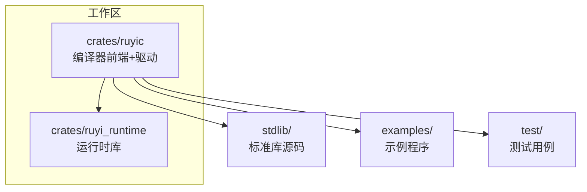
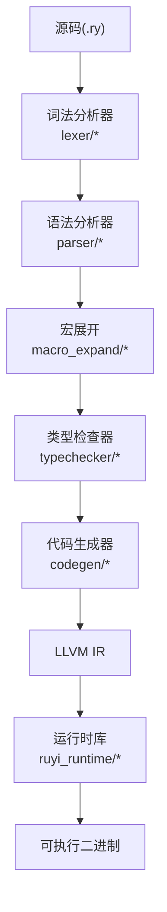
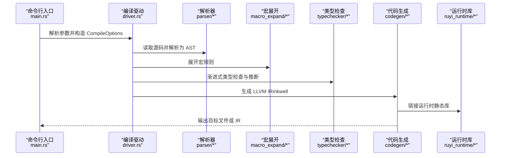
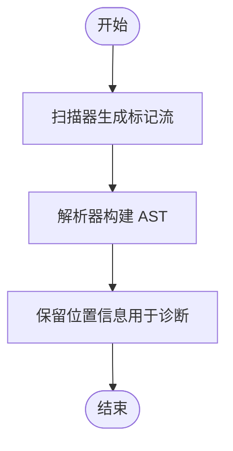
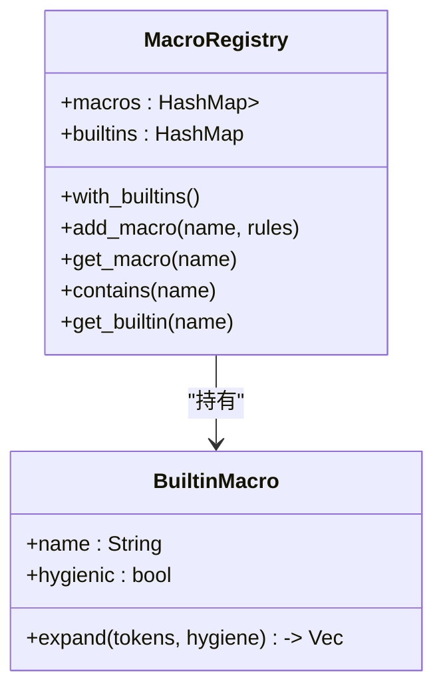
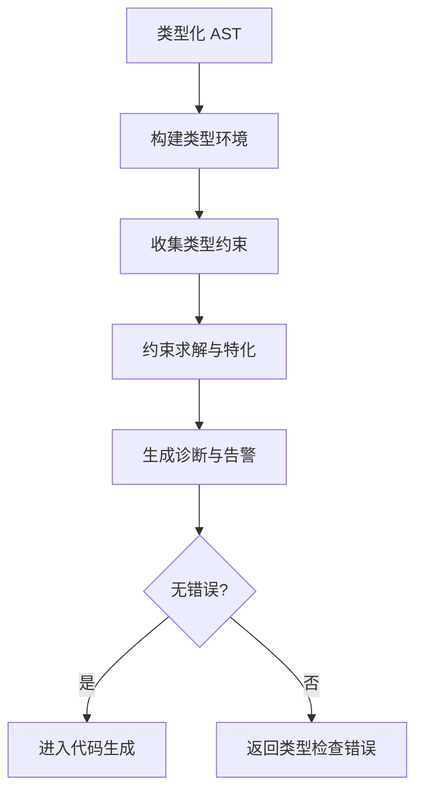
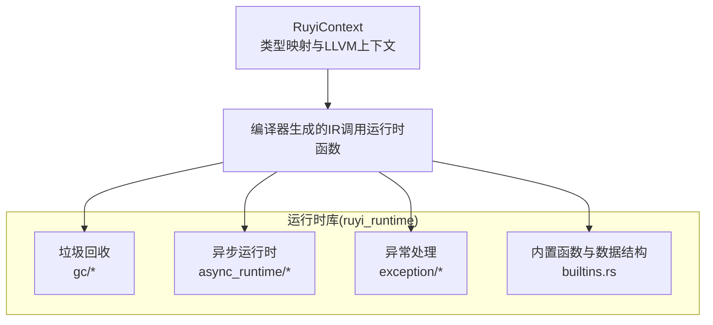
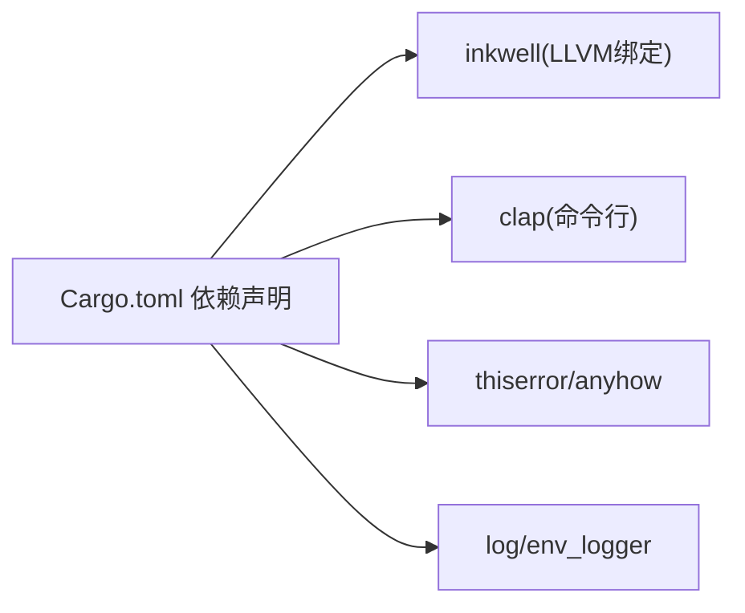

# 架构概览

<cite>
**本文引用的文件**
- [Cargo.toml](file://Cargo.toml)
- [README.md](file://README.md)
- [crates/ruyic/src/lib.rs](file://crates/ruyic/src/lib.rs)
- [crates/ruyic/src/main.rs](file://crates/ruyic/src/main.rs)
- [crates/ruyic/src/driver.rs](file://crates/ruyic/src/driver.rs)
- [crates/ruyic/src/lexer/mod.rs](file://crates/ruyic/src/lexer/mod.rs)
- [crates/ruyic/src/parser/mod.rs](file://crates/ruyic/src/parser/mod.rs)
- [crates/ruyic/src/macro_expand/mod.rs](file://crates/ruyic/src/macro_expand/mod.rs)
- [crates/ruyic/src/typechecker/mod.rs](file://crates/ruyic/src/typechecker/mod.rs)
- [crates/ruyic/src/codegen/mod.rs](file://crates/ruyic/src/codegen/mod.rs)
- [crates/ruyic/src/codegen/generator.rs](file://crates/ruyic/src/codegen/generator.rs)
- [crates/ruyic/src/gc/mod.rs](file://crates/ruyic/src/gc/mod.rs)
- [crates/ruyic/src/runtime/mod.rs](file://crates/ruyic/src/runtime/mod.rs)
- [crates/ruyi_runtime/src/lib.rs](file://crates/ruyi_runtime/src/lib.rs)
</cite>

## 目录
1. [简介](#简介)
2. [项目结构](#项目结构)
3. [核心组件](#核心组件)
4. [架构总览](#架构总览)
5. [详细组件分析](#详细组件分析)
6. [依赖分析](#依赖分析)
7. [性能考虑](#性能考虑)
8. [故障排查指南](#故障排查指南)
9. [结论](#结论)
10. [附录](#附录)

## 简介
本文件为 Ruyi 项目的架构概览文档，面向编译器前端、LLVM 后端与运行时系统三大部分，系统性阐述编译流水线的各个阶段（词法分析、语法分析、宏展开、类型检查、代码生成等），深入解析 LLVM 集成的技术细节（inkwell 绑定与优化策略），并说明运行时库的设计（垃圾回收、异步执行、异常处理等）。文档同时给出模块化架构的优势与组件交互关系，并通过多种架构图与流程图帮助读者快速建立对系统整体设计的理解。

## 项目结构
Ruyi 采用多 crate 的工作区组织方式，核心由以下两个主要 crate 组成：
- ruyic：编译器前端与驱动，负责源码到 LLVM IR 的全流程编译。
- ruyi_runtime：运行时库，提供 GC、异步调度、异常处理等运行期能力。

此外，仓库包含标准库（stdlib）、示例程序（examples）与测试用例（test），以及文档与路线图等辅助资源。



**图表来源**
- [Cargo.toml:1-40](file://Cargo.toml#L1-L40)
- [README.md:75-99](file://README.md#L75-L99)

**章节来源**
- [Cargo.toml:1-40](file://Cargo.toml#L1-L40)
- [README.md:75-99](file://README.md#L75-L99)

## 核心组件
- 编译器前端（ruyic）
  - 词法分析：将源码切分为标记流。
  - 语法分析：构建抽象语法树（AST）。
  - 宏展开：基于规则与卫生机制进行宏展开。
  - 类型检查：渐进式类型系统，双向推断与约束求解。
  - 代码生成：将类型化的 AST 转换为 LLVM IR，并链接运行时库。
- 运行时库（ruyi_runtime）
  - 垃圾回收：分代 GC 与写屏障，根集管理。
  - 异步执行：基于工作窃取的调度器与未来对象模型。
  - 异常处理：零开销异常的 landing pad 与异常表。
  - 内置函数与数据结构：数组、字符串、大整数等基础操作。

**章节来源**
- [crates/ruyic/src/lib.rs:1-21](file://crates/ruyic/src/lib.rs#L1-L21)
- [crates/ruyi_runtime/src/lib.rs:1-259](file://crates/ruyi_runtime/src/lib.rs#L1-L259)

## 架构总览
Ruyi 的编译器采用“模块化、分层清晰”的架构设计。前端负责从源码到 AST 的解析与类型检查；中间层负责宏展开与类型环境；后端通过 inkwell 将类型化的 AST 映射为 LLVM IR，并在链接阶段整合运行时库；运行时库提供 GC、异步与异常处理等底层支撑。



**图表来源**
- [crates/ruyic/src/driver.rs:1-744](file://crates/ruyic/src/driver.rs#L1-L744)
- [crates/ruyic/src/codegen/generator.rs:1-800](file://crates/ruyic/src/codegen/generator.rs#L1-L800)
- [crates/ruyi_runtime/src/lib.rs:1-259](file://crates/ruyi_runtime/src/lib.rs#L1-L259)

## 详细组件分析

### 编译器驱动与流水线
编译驱动负责组织完整的编译流水线，包括模块解析、导入合并、宏展开、类型检查、代码生成与输出控制。驱动支持多种发射模式（二进制、LLVM IR、AST/TypedAST 检查）与优化等级。



**图表来源**
- [crates/ruyic/src/main.rs:46-114](file://crates/ruyic/src/main.rs#L46-L114)
- [crates/ruyic/src/driver.rs:258-632](file://crates/ruyic/src/driver.rs#L258-L632)
- [crates/ruyic/src/codegen/generator.rs:405-696](file://crates/ruyic/src/codegen/generator.rs#L405-L696)

**章节来源**
- [crates/ruyic/src/main.rs:16-114](file://crates/ruyic/src/main.rs#L16-L114)
- [crates/ruyic/src/driver.rs:21-138](file://crates/ruyic/src/driver.rs#L21-L138)

### 词法分析与语法分析
- 词法分析：扫描器将源码转换为带位置信息的标记序列，供语法分析器消费。
- 语法分析：解析器将标记流构建为 AST，并保留位置信息以便诊断与错误报告。



**图表来源**
- [crates/ruyic/src/lexer/mod.rs:1-8](file://crates/ruyic/src/lexer/mod.rs#L1-L8)
- [crates/ruyic/src/parser/mod.rs:1-8](file://crates/ruyic/src/parser/mod.rs#L1-L8)

**章节来源**
- [crates/ruyic/src/lexer/mod.rs:1-8](file://crates/ruyic/src/lexer/mod.rs#L1-L8)
- [crates/ruyic/src/parser/mod.rs:1-8](file://crates/ruyic/src/parser/mod.rs#L1-L8)

### 宏展开系统
宏展开器维护宏注册表与内置宏，支持卫生作用域、重复匹配与深度限制，确保宏调用的安全与可控。



**图表来源**
- [crates/ruyic/src/macro_expand/mod.rs:107-146](file://crates/ruyic/src/macro_expand/mod.rs#L107-L146)

**章节来源**
- [crates/ruyic/src/macro_expand/mod.rs:1-161](file://crates/ruyic/src/macro_expand/mod.rs#L1-L161)

### 类型检查与推断
类型检查器实现渐进式类型系统，支持双向推断、约束求解、泛型特化追踪与诊断收集，最终输出类型环境以指导代码生成。



**图表来源**
- [crates/ruyic/src/typechecker/mod.rs:1-32](file://crates/ruyic/src/typechecker/mod.rs#L1-L32)
- [crates/ruyic/src/driver.rs:540-566](file://crates/ruyic/src/driver.rs#L540-L566)

**章节来源**
- [crates/ruyic/src/typechecker/mod.rs:1-32](file://crates/ruyic/src/typechecker/mod.rs#L1-L32)
- [crates/ruyic/src/driver.rs:540-566](file://crates/ruyic/src/driver.rs#L540-L566)

### 代码生成与 LLVM 集成
代码生成器通过 inkwell 将 Ruyi 类型映射为 LLVM 类型，生成函数、类结构体、块级语句与表达式，并处理 GC 根、异步状态机与异常上下文栈。最终将 IR 编译为对象文件并链接运行时库。

```mermaid
classDiagram
class CodeGenerator {
+generate_with_env(program, tracker, type_env)
+print_to_string()
+write_llvm_ir(path)
+compile_to_object_with_opt(path, opt)
+compile_to_binary_with_opt(path, opt)
}
class CodegenContext {
+variables : HashMap<String, (Ptr, Type)>
+gc_roots : Vec<Vec<(Ptr, Type)>>
+try_stack : Vec<TryContext>
+async_* : 异步状态字段
+builder()
+lookup_variable(name)
+add_gc_root(ptr, ty)
+push_gc_root_scope()/pop_gc_root_scope()
}
class TryContext {
+exception_ptr
+catch_bb/finaly_bb
+merge_bb
+landing_pad_bb
}
CodeGenerator --> CodegenContext : "创建并持有"
CodegenContext --> TryContext : "嵌套管理"
```

**图表来源**
- [crates/ruyic/src/codegen/generator.rs:384-800](file://crates/ruyic/src/codegen/generator.rs#L384-L800)

**章节来源**
- [crates/ruyic/src/codegen/generator.rs:1-800](file://crates/ruyic/src/codegen/generator.rs#L1-L800)

### 运行时系统设计
运行时库提供 GC、异步调度、异常处理与内置原语。其类型映射与上下文封装便于编译器在生成 IR 时直接调用运行时功能。



**图表来源**
- [crates/ruyi_runtime/src/lib.rs:1-259](file://crates/ruyi_runtime/src/lib.rs#L1-L259)

**章节来源**
- [crates/ruyi_runtime/src/lib.rs:1-259](file://crates/ruyi_runtime/src/lib.rs#L1-L259)

## 依赖分析
- 工作区与外部依赖
  - inkwell：绑定 LLVM 14-18，提供 IR 构建与优化能力。
  - clap：命令行参数解析。
  - thiserror/anyhow：统一错误处理。
  - log/env_logger：日志记录。
- 编译器内部模块耦合
  - driver 对 lexer、parser、macro_expand、typechecker、codegen 具有强依赖，形成编译流水线。
  - codegen 依赖 typechecker 的类型环境与泛型特化追踪。
  - ruyic 与 ruyi_runtime 在链接阶段耦合，通过静态库形式集成。



**图表来源**
- [Cargo.toml:14-27](file://Cargo.toml#L14-L27)

**章节来源**
- [Cargo.toml:14-40](file://Cargo.toml#L14-L40)

## 性能考虑
- 优化等级
  - 支持 O0/O1/O2 三种优化等级，分别对应 none/less/aggressive。
  - 链接阶段默认启用 LTO，减少代码单元并提升整体优化效果。
- 代码生成优化
  - 使用 inkwell 的优化级别与目标机器配置，按需选择优化策略。
  - 通过类型环境与约束求解，避免不必要的动态分派与装箱。
- 运行时优化
  - 分代 GC 降低全堆扫描成本；写屏障与根集管理减少误标与漏标。
  - 异步调度采用工作窃取队列，提高并发吞吐。

**章节来源**
- [crates/ruyic/src/codegen/generator.rs:22-28](file://crates/ruyic/src/codegen/generator.rs#L22-L28)
- [Cargo.toml:33-40](file://Cargo.toml#L33-L40)

## 故障排查指南
- 常见错误类型
  - IO 错误：输入文件读取失败或输出路径不可写。
  - 词法/语法/宏/类型检查/代码生成/链接错误：由驱动统一包装并格式化输出。
- 诊断与定位
  - 驱动提供格式化诊断工具，结合源码位置信息快速定位问题。
  - 支持仅解析与类型检查模式，便于快速验证语言特性与类型系统。
- 建议排查步骤
  - 使用 --check 模式先验证语法与类型。
  - 使用 --emit-ast/--emit-typed-ast 查看中间表示。
  - 使用 --emit-llvm 获取 IR 并交由 LLVM 工具链进一步分析。

**章节来源**
- [crates/ruyic/src/driver.rs:21-54](file://crates/ruyic/src/driver.rs#L21-L54)
- [crates/ruyic/src/driver.rs:739-744](file://crates/ruyic/src/driver.rs#L739-L744)

## 结论
Ruyi 通过清晰的模块化架构实现了从源码到机器码的高效编译路径。前端以渐进式类型系统与宏展开为核心，后端借助 inkwell 与 LLVM 实现高质量 IR 生成与优化，运行时库则提供 GC、异步与异常处理等关键能力。该架构既保证了语言特性的一致性与可扩展性，也为后续性能优化与新语言特性的引入提供了坚实基础。

## 附录
- 快速开始与构建
  - 需要 Rust 与 LLVM 14（macOS: brew 安装 llvm@14 并设置 LLVM_SYS_140_PREFIX；Linux: 通过包管理器安装 llvm-14-dev）。
  - 使用 cargo build --release 生成编译器二进制。
- 语言特性与差异
  - 保留 JS 严格模式的熟悉语法，移除不安全与易混淆特性，引入渐进式类型、模式匹配、traits、泛型与宏等现代语言特性。

**章节来源**
- [README.md:26-57](file://README.md#L26-L57)
- [README.md:121-137](file://README.md#L121-L137)