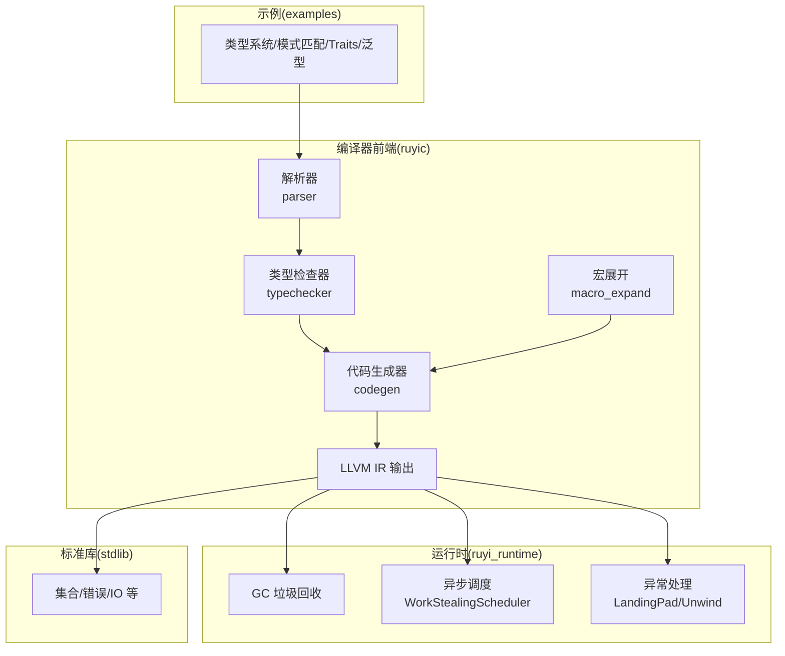
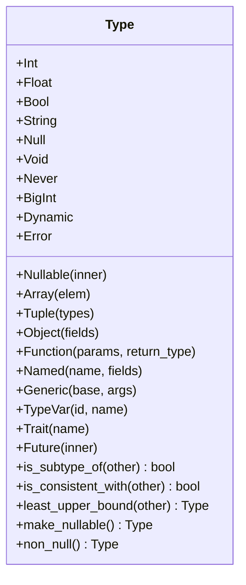
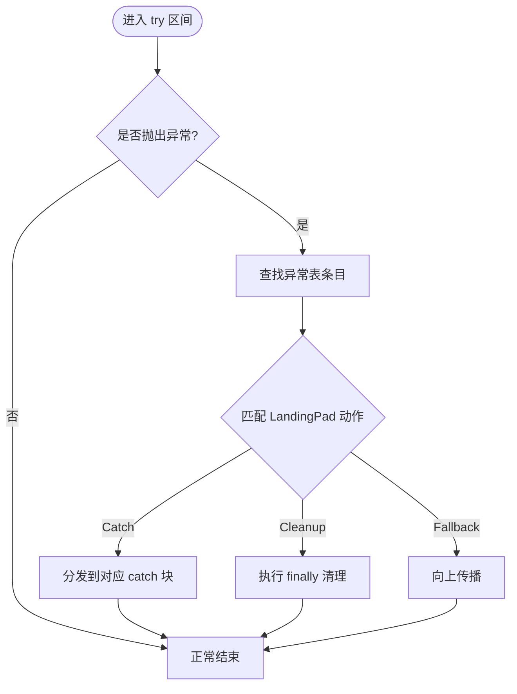
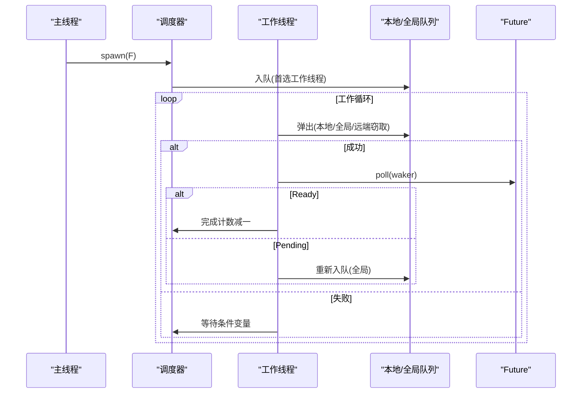
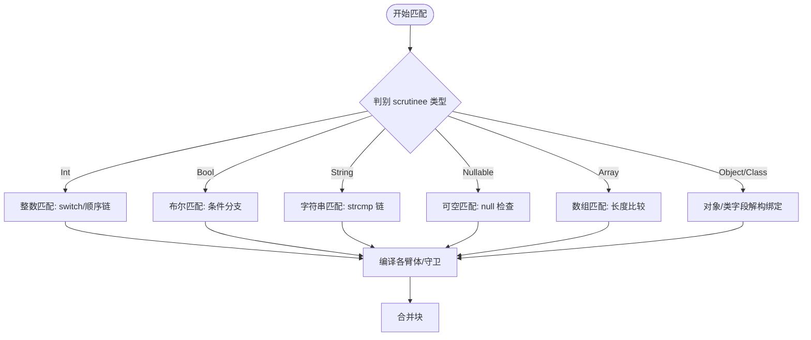
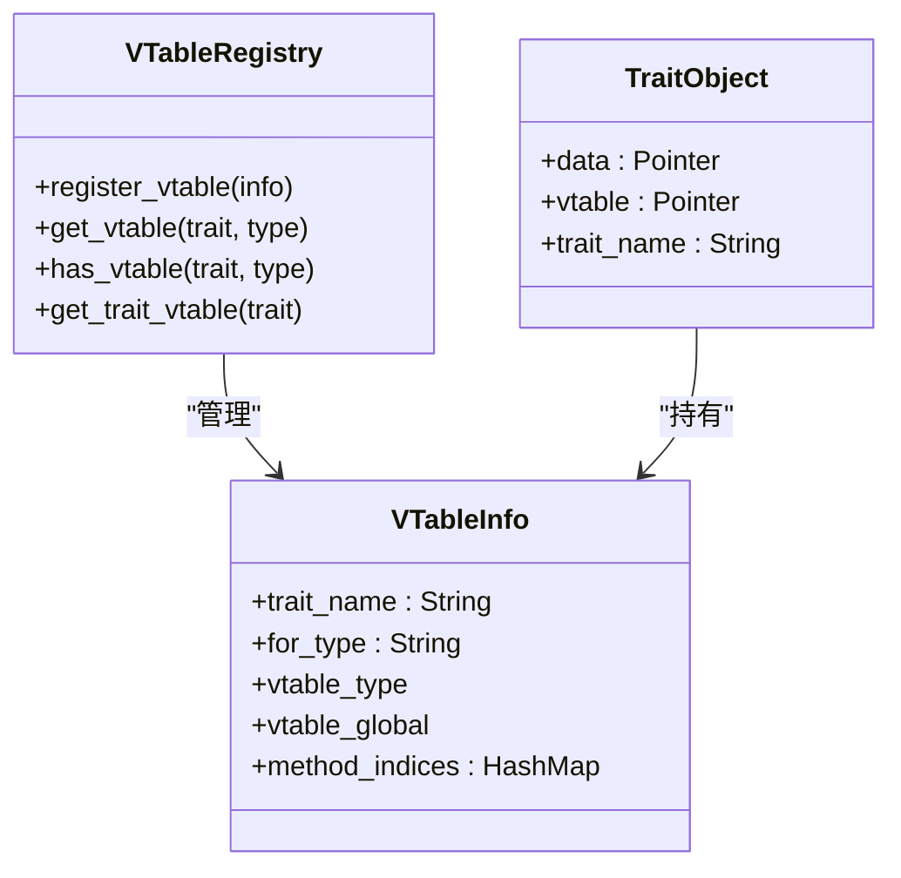
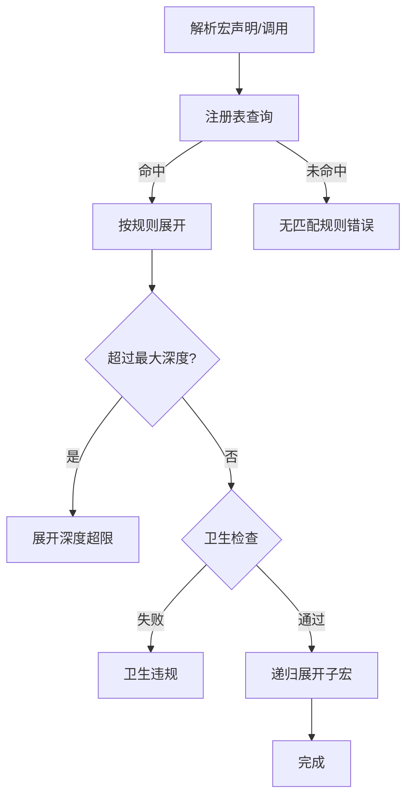
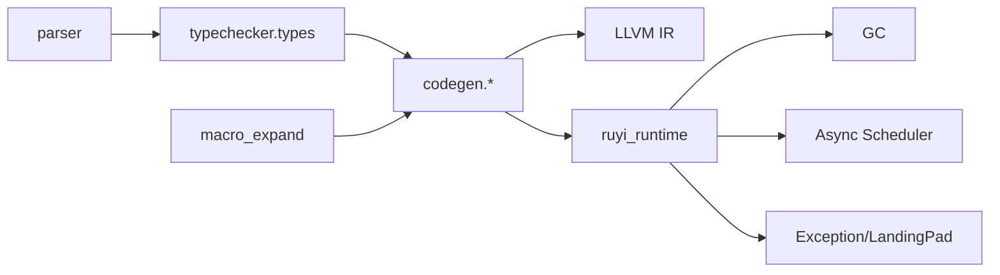

# 核心技术特色

<cite>
**本文引用的文件**
- [README.md](file://README.md)
- [spec.md](file://docs/spec.md)
- [lib.rs](file://crates/ruyic/src/lib.rs)
- [lib.rs](file://crates/ruyi_runtime/src/lib.rs)
- [exception.rs](file://crates/ruyi_runtime/src/exception.rs)
- [async_runtime.rs](file://crates/ruyi_runtime/src/async_runtime.rs)
- [mod.rs](file://crates/ruyic/src/macro_expand/mod.rs)
- [types.rs](file://crates/ruyic/src/typechecker/types.rs)
- [patterns.rs](file://crates/ruyic/src/codegen/patterns.rs)
- [traits.rs](file://crates/ruyic/src/codegen/traits.rs)
- [types.rs](file://crates/ruyic/src/codegen/types.rs)
- [ast.rs](file://crates/ruyic/src/parser/ast.rs)
- [type_system.ry](file://examples/type_system.ry)
- [pattern_matching.ry](file://examples/pattern_matching.ry)
- [traits.ry](file://examples/traits.ry)
- [generics.ry](file://examples/generics.ry)
</cite>

## 目录
1. [引言](#引言)
2. [项目结构](#项目结构)
3. [核心组件](#核心组件)
4. [架构总览](#架构总览)
5. [详细组件分析](#详细组件分析)
6. [依赖关系分析](#依赖关系分析)
7. [性能考量](#性能考量)
8. [故障排查指南](#故障排查指南)
9. [结论](#结论)
10. [附录](#附录)

## 引言
本文件系统性梳理 Ruyi 编程语言的核心技术特色，围绕以下主题展开：渐进式类型系统与动态类型协作、基于 LLVM landing pads 的零成本异常处理、工作窃取调度器的并发模型与性能特征、模式匹配的编译时生成策略、Traits 接口与静态/动态分派、泛型编程与单态化、宏系统的声明式设计与卫生宏保护机制；并以具体示例展示这些特性在实际代码中的用法。

## 项目结构
Ruyi 采用多 crate 组织方式：
- ruyic：编译器前端（词法/语法/语义分析、类型检查、代码生成、宏展开、诊断）
- ruyi_runtime：运行时库（GC、异步调度、异常处理、内置类型映射）
- stdlib：标准库源码（.ry）
- examples：特性演示程序
- docs：语言规范与教程



图表来源
- [lib.rs:1-21](file://crates/ruyic/src/lib.rs#L1-L21)
- [lib.rs:1-259](file://crates/ruyi_runtime/src/lib.rs#L1-L259)

章节来源
- [README.md:75-99](file://README.md#L75-L99)
- [lib.rs:1-21](file://crates/ruyic/src/lib.rs#L1-L21)
- [lib.rs:1-259](file://crates/ruyi_runtime/src/lib.rs#L1-L259)

## 核心组件
- 渐进式类型系统：支持静态类型注解与动态类型（dyn），类型子类型、一致性与最小上界（lub）规则由类型检查器实现，并在代码生成阶段映射到 LLVM 类型。
- 零成本异常处理：基于 Itanium ABI 的 landing pad 模型，运行时维护每函数异常表，LLVM 在异常路径上查找 landing pad 并执行 catch/finally 分支。
- 工作窃取调度器：多工作线程本地队列 + 全局队列 + 远端窃取，配合唤醒器（Waker）与条件变量进行任务调度与休眠。
- 模式匹配：针对整数、布尔、字符串、可空、数组、对象等类型的匹配生成 switch 或顺序比较链，支持守卫与绑定。
- Traits 接口：静态分派（方法内联）与动态分派（vtable 调用）并存，支持默认方法与 trait 对象。
- 泛型编程：参数多态与单态化（monomorphization），避免运行时开销。
- 宏系统：声明式规则、卫生宏保护、最大展开深度限制与错误报告。

章节来源
- [types.rs:14-60](file://crates/ruyic/src/typechecker/types.rs#L14-L60)
- [exception.rs:33-149](file://crates/ruyi_runtime/src/exception.rs#L33-L149)
- [async_runtime.rs:138-314](file://crates/ruyi_runtime/src/async_runtime.rs#L138-L314)
- [patterns.rs:20-43](file://crates/ruyic/src/codegen/patterns.rs#L20-L43)
- [traits.rs:20-71](file://crates/ruyic/src/codegen/traits.rs#L20-L71)
- [types.rs:27-103](file://crates/ruyic/src/codegen/types.rs#L27-L103)
- [mod.rs:10-161](file://crates/ruyic/src/macro_expand/mod.rs#L10-L161)

## 架构总览
下图展示了从源码到机器码的关键流程：词法/语法 → 类型检查 → 宏展开 → LLVM IR 生成 → 运行时集成（GC/异步/异常）。

```mermaid
sequenceDiagram
participant Src as "源码(.ry)"
participant Lex as "词法分析器"
participant Par as "语法分析器"
participant Typ as "类型检查器"
participant Mac as "宏展开器"
participant CG as "代码生成器(LLVM)"
participant RT as "运行时库"
participant Bin as "可执行二进制"
Src->>Lex : 读取源码
Lex->>Par : 生成 AST
Par->>Typ : AST + 类型环境
Typ-->>Mac : 可展开的 AST
Mac-->>CG : 展开后的 AST
CG-->>RT : 生成 IR 并链接运行时
RT-->>Bin : 二进制产物
```

图表来源
- [lib.rs:12-20](file://crates/ruyic/src/lib.rs#L12-L20)
- [lib.rs:1-259](file://crates/ruyi_runtime/src/lib.rs#L1-L259)

## 详细组件分析

### 渐进式类型系统与动态类型协作
- 类型表示：涵盖原生类型、可空、数组、元组、对象、函数、命名/泛型、类型变量、Trait/dyn、Future、错误恢复类型等。
- 子类型与一致性：支持 int <: float、T <: T?、Never <: T、dyn 与其他类型的一致性判定；lub 计算用于表达式类型推断。
- 动态类型（dyn）：作为“运行时已知”的占位类型，允许在渐进迁移过程中逐步收紧类型约束。
- 显示/隐式类型：变量声明支持显式类型注解，也支持从初始化表达式或上下文推断。



图表来源
- [types.rs:14-60](file://crates/ruyic/src/typechecker/types.rs#L14-L60)
- [types.rs:151-295](file://crates/ruyic/src/typechecker/types.rs#L151-L295)
- [types.rs:297-383](file://crates/ruyic/src/typechecker/types.rs#L297-L383)

章节来源
- [types.rs:14-60](file://crates/ruyic/src/typechecker/types.rs#L14-L60)
- [types.rs:151-295](file://crates/ruyic/src/typechecker/types.rs#L151-L295)
- [types.rs:297-383](file://crates/ruyic/src/typechecker/types.rs#L297-L383)
- [types.rs:27-103](file://crates/ruyic/src/codegen/types.rs#L27-L103)
- [type_system.ry:12-186](file://examples/type_system.ry#L12-L186)

### 零成本异常处理（LLVM Landing Pads）
- 异常表模型：每个函数维护异常表条目，记录受保护指令范围、landing pad 基本块以及 catch 子句列表；支持 finally 清理动作。
- 类型过滤：通过类型 ID 匹配 catch 子句，0 表示通配；运行时根据抛出类型选择处理器。
- Landing Pad 描述：描述 landing pad 的动作序列（catch/filter/cleanup），并给出 catch 与 cleanup 分发标签。
- 抛出与捕获：当前版本通过 panic 触发异常路径，后续将对接底层 unwinder。



图表来源
- [exception.rs:33-149](file://crates/ruyi_runtime/src/exception.rs#L33-L149)
- [exception.rs:231-278](file://crates/ruyi_runtime/src/exception.rs#L231-L278)

章节来源
- [exception.rs:1-377](file://crates/ruyi_runtime/src/exception.rs#L1-L377)
- [lib.rs:29-44](file://crates/ruyi_runtime/src/lib.rs#L29-L44)

### 工作窃取调度器（并发模型与性能）
- 结构组成：每工作线程拥有本地双端队列，全局队列作为兜底；任务包含 Box<dyn RuyiFuture> 与唤醒标记。
- 调度策略：优先本地弹出，其次全局弹出，最后尝试从其他工作线程顶部“窃取”；无任务时短暂休眠等待唤醒。
- 唤醒机制：Waker 将任务重新入队至全局队列，触发其他线程尽快调度。
- GC 集成：注册活跃异步任务为 GC 根，确保挂起状态的对象不被回收。
- 性能特征：高并发下通过工作窃取降低锁竞争，提升吞吐；pending 任务通过 waker 唤醒避免忙轮询。



图表来源
- [async_runtime.rs:138-314](file://crates/ruyi_runtime/src/async_runtime.rs#L138-L314)
- [async_runtime.rs:316-357](file://crates/ruyi_runtime/src/async_runtime.rs#L316-L357)
- [async_runtime.rs:421-455](file://crates/ruyi_runtime/src/async_runtime.rs#L421-L455)

章节来源
- [async_runtime.rs:1-655](file://crates/ruyi_runtime/src/async_runtime.rs#L1-L655)

### 模式匹配（编译时生成与绑定）
- 类型分派：针对整数（switch）、布尔（条件分支）、字符串（指针比较/strcmp）、可空（null 检查）、数组（长度比较）、对象/类字段访问等生成高效 IR。
- 绑定与解构：支持标识符绑定、as 别名、数组/对象解构、省略元素等；为每个绑定分配栈槽并在各分支收敛于合并块。
- 守卫与默认：当存在守卫时退化为顺序比较链；无默认时插入不可达陷阱块保证穷尽性。
- 与类型系统协同：利用 lub 与可空折叠规则，确保匹配类型一致与安全。



图表来源
- [patterns.rs:20-43](file://crates/ruyic/src/codegen/patterns.rs#L20-L43)
- [patterns.rs:310-331](file://crates/ruyic/src/codegen/patterns.rs#L310-L331)
- [patterns.rs:528-581](file://crates/ruyic/src/codegen/patterns.rs#L528-L581)
- [patterns.rs:583-677](file://crates/ruyic/src/codegen/patterns.rs#L583-L677)
- [patterns.rs:679-757](file://crates/ruyic/src/codegen/patterns.rs#L679-L757)
- [patterns.rs:759-800](file://crates/ruyic/src/codegen/patterns.rs#L759-L800)

章节来源
- [patterns.rs:1-1106](file://crates/ruyic/src/codegen/patterns.rs#L1-L1106)
- [ast.rs:428-455](file://crates/ruyic/src/parser/ast.rs#L428-L455)
- [pattern_matching.ry:1-226](file://examples/pattern_matching.ry#L1-L226)

### Traits 接口与静态/动态分派
- 静态分派：在调用点直接内联具体实现，零开销；适合对已知类型进行优化。
- 动态分派：通过 vtable（虚函数表）实现，生成 trait 对象（胖指针 data + vtable），按方法名索引调用。
- 默认方法：Trait 中可定义默认实现，减少重复样板代码。
- 代码生成：为每个 impl 声明生成 vtable 全局，初始化后在调用点加载并间接调用。



图表来源
- [traits.rs:20-71](file://crates/ruyic/src/codegen/traits.rs#L20-L71)
- [traits.rs:73-141](file://crates/ruyic/src/codegen/traits.rs#L73-L141)
- [traits.rs:177-220](file://crates/ruyic/src/codegen/traits.rs#L177-L220)
- [traits.rs:221-285](file://crates/ruyic/src/codegen/traits.rs#L221-L285)

章节来源
- [traits.rs:1-294](file://crates/ruyic/src/codegen/traits.rs#L1-L294)
- [traits.ry:1-144](file://examples/traits.ry#L1-L144)

### 泛型编程与单态化
- 参数多态：函数/类/类型别名支持类型参数与上界约束；类型变量参与约束求解。
- 单态化：在使用点展开具体实例，消除运行时类型信息与分支，获得 C/C++ 级别的性能。
- 与类型系统协同：泛型类型在类型检查中保持抽象，在代码生成中映射到 LLVM 指针或结构体布局。

章节来源
- [types.rs:77-89](file://crates/ruyic/src/typechecker/types.rs#L77-L89)
- [types.rs:72-90](file://crates/ruyic/src/codegen/types.rs#L72-L90)
- [generics.ry:1-12](file://examples/generics.ry#L1-L12)

### 宏系统（声明式与卫生宏）
- 声明式规则：以 Token 序列定义模式与展开体，支持重复匹配与嵌套宏定义检测。
- 卫生宏：通过卫生上下文隔离标识符，防止捕获自由变量与意外绑定。
- 错误模型：统一的错误类型覆盖未匹配规则、重复不匹配、展开深度超限、非法调用、卫生违规等。
- 注册与扩展：内置宏注册表，支持用户自定义宏规则。



图表来源
- [mod.rs:10-161](file://crates/ruyic/src/macro_expand/mod.rs#L10-L161)

章节来源
- [mod.rs:1-161](file://crates/ruyic/src/macro_expand/mod.rs#L1-L161)

### JavaScript 问题特性的替代方案
- var → let（块级作用域）；const（不可变绑定）
- undefined → null（单一空值）
- ==/!= → ===/!==（严格相等，无类型强制）
- function → fn（关键字更短）
- this → self（显式接收者，避免绑定困惑）
- arguments → ...args（剩余参数）
- prototype → class/trait（类继承与接口契约）
- 删除 with/eval/delete（属性赋值改为显式赋值）

章节来源
- [README.md:123-137](file://README.md#L123-L137)

## 依赖关系分析
- 编译期依赖：parser → typechecker → codegen → LLVM；macro_expand 在 typechecker 之前进行宏展开。
- 运行时依赖：代码生成器输出 IR 后，链接 ruyi_runtime 提供的 GC、异步、异常支持。
- 类型系统与代码生成耦合：Type → LLVM 类型映射贯穿类型检查与代码生成两阶段。



图表来源
- [lib.rs:12-20](file://crates/ruyic/src/lib.rs#L12-L20)
- [types.rs:27-103](file://crates/ruyic/src/codegen/types.rs#L27-L103)
- [lib.rs:1-259](file://crates/ruyi_runtime/src/lib.rs#L1-L259)

章节来源
- [lib.rs:1-21](file://crates/ruyic/src/lib.rs#L1-L21)
- [types.rs:1-238](file://crates/ruyic/src/codegen/types.rs#L1-L238)
- [lib.rs:1-259](file://crates/ruyi_runtime/src/lib.rs#L1-L259)

## 性能考量
- 渐进式类型：在需要时引入静态类型注解，逐步收紧类型边界，避免一次性全量标注带来的负担。
- 零成本异常：Itanium landing pad 模型在异常未发生时几乎无额外开销，仅在异常路径上进行表查找与分发。
- 工作窃取：本地队列为主、全局队列为辅、远端窃取兜底，结合条件变量休眠，降低锁竞争与上下文切换。
- 模式匹配：针对常见类型生成高效 IR（switch/条件分支/指针比较），避免通用反射式匹配。
- Traits：静态分派完全内联，动态分派仅在必要时使用 vtable，兼顾灵活性与性能。
- 泛型：单态化消除运行时类型信息，生成高度优化的具体实例。

## 故障排查指南
- 宏展开错误：检查规则匹配、重复项、卫生违规与最大深度限制。
- 类型不兼容：核对 lub、子类型与一致性规则；逐步添加类型注解定位问题。
- 异常未捕获：确认异常表条目覆盖范围、catch 类型 ID 匹配与 finally 清理逻辑。
- 异步任务未完成：检查 waker 唤醒路径、全局队列入队与调度器关闭流程。
- 模式匹配非穷尽：根据类型值域要求补充通配/标识符分支，或调整数据结构。

章节来源
- [mod.rs:12-105](file://crates/ruyic/src/macro_expand/mod.rs#L12-L105)
- [types.rs:311-383](file://crates/ruyic/src/typechecker/types.rs#L311-L383)
- [exception.rs:92-100](file://crates/ruyi_runtime/src/exception.rs#L92-L100)
- [async_runtime.rs:282-291](file://crates/ruyi_runtime/src/async_runtime.rs#L282-L291)
- [patterns.rs:319-331](file://crates/ruyic/src/codegen/patterns.rs#L319-L331)

## 结论
Ruyi 通过渐进式类型系统、零成本异常处理、工作窃取调度器、强大的模式匹配、Traits 接口与泛型单态化、以及卫生宏系统，构建了兼具易用性与高性能的编译型语言。其设计既保留了 JavaScript 语法的熟悉感，又消除了历史上广受诟病的问题特性，为现代应用开发提供了安全、可预测且高效的工具链。

## 附录
- 示例程序路径（不含代码内容，仅供定位）
  - 类型系统演示：[type_system.ry](file://examples/type_system.ry)
  - 模式匹配演示：[pattern_matching.ry](file://examples/pattern_matching.ry)
  - Traits 演示：[traits.ry](file://examples/traits.ry)
  - 泛型演示：[generics.ry](file://examples/generics.ry)
- 语言规范与教程
  - [spec.md](file://docs/spec.md)
  - [README.md](file://README.md)