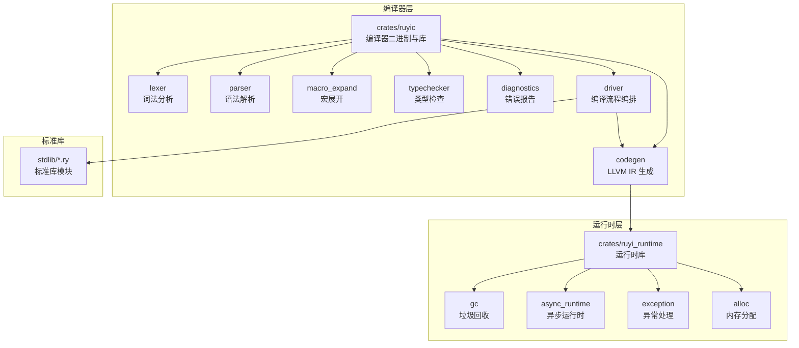
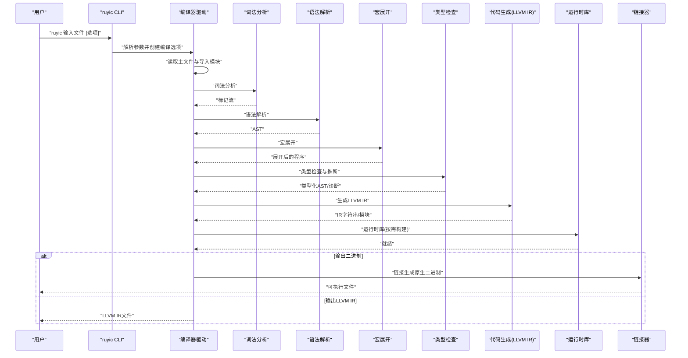
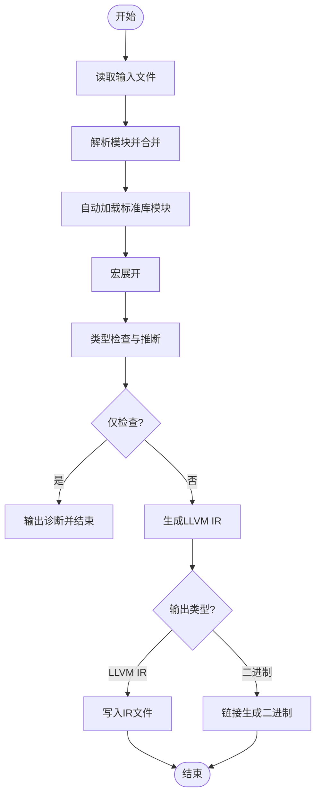
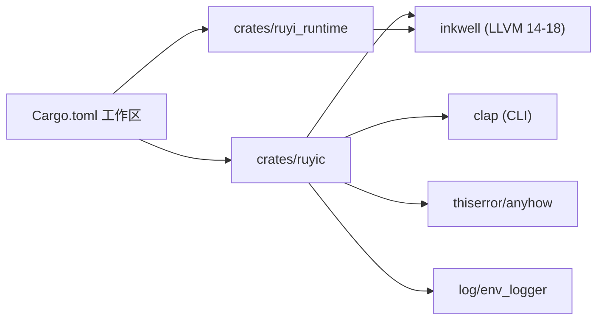

# 项目介绍

<cite>
**本文引用的文件**
- [README.md](file://README.md)
- [README-zh.md](file://README-zh.md)
- [Cargo.toml](file://Cargo.toml)
- [crates/ruyic/src/lib.rs](file://crates/ruyic/src/lib.rs)
- [crates/ruyic/src/main.rs](file://crates/ruyic/src/main.rs)
- [crates/ruyic/src/driver.rs](file://crates/ruyic/src/driver.rs)
- [crates/ruyic/src/typechecker/mod.rs](file://crates/ruyic/src/typechecker/mod.rs)
- [crates/ruyic/src/codegen/mod.rs](file://crates/ruyic/src/codegen/mod.rs)
- [crates/ruyic/src/macro_expand/mod.rs](file://crates/ruyic/src/macro_expand/mod.rs)
- [crates/ruyi_runtime/src/lib.rs](file://crates/ruyi_runtime/src/lib.rs)
- [stdlib/core.ry](file://stdlib/core.ry)
- [examples/hello.ry](file://examples/hello.ry)
- [docs/spec.md](file://docs/spec.md)
- [docs/tutorial.md](file://docs/tutorial.md)
- [docs/roadmap.md](file://docs/roadmap.md)
- [docs/roadmap-zh.md](file://docs/roadmap-zh.md)
</cite>

## 目录
1. [引言](#引言)
2. [项目结构](#项目结构)
3. [核心组件](#核心组件)
4. [架构总览](#架构总览)
5. [详细组件分析](#详细组件分析)
6. [依赖关系分析](#依赖关系分析)
7. [性能考量](#性能考量)
8. [故障排查指南](#故障排查指南)
9. [结论](#结论)
10. [附录](#附录)

## 引言
Ruyi 是一门面向通用编程的编译型语言，其语法以 JavaScript 严格模式为基础，同时移除了历史上存在争议的语言特性；Ruyi 通过 LLVM 将源代码编译为原生机器码，从而在多平台提供高性能表现。项目强调“熟悉的语法 + 高性能原生代码”的组合，既降低学习成本，又满足对性能与可移植性的需求。

Ruyi 的关键能力包括：
- 熟悉语法：若你熟悉 JavaScript，就能快速掌握 Ruyi 的语法骨架
- 编译为原生代码：借助 LLVM 生成快速、独立的可执行文件
- 渐进式类型系统：可在静态类型注解与动态类型（dyn）之间自由选择
- 空值安全：无 undefined，可空类型需显式声明（如 string?）
- 模式匹配：一等公民的 match 表达式，支持解构与守卫
- Trait：类接口契约，支持静态与动态分发（dyn Trait）
- 泛型：参数化多态，通过单态化实现零运行时开销
- 异步/await：基于工作窃取调度器的绿色线程并发模型
- 异常处理：通过 LLVM landing pad 实现零开销的 try/catch/finally
- 宏系统：声明式、卫生的编译时代码生成

这些能力共同构成了 Ruyi 的设计哲学：在保持语法亲和力的同时，提供现代语言的工程化能力与高性能原生执行。

章节来源
- [README.md:7-23](file://README.md#L7-L23)
- [README-zh.md:7-23](file://README-zh.md#L7-L23)

## 项目结构
仓库采用多 crate 的工作区组织方式，核心目录与职责如下：
- crates/ruyic：编译器二进制与库，包含词法分析、语法解析、宏展开、类型检查、代码生成、诊断与驱动等模块
- crates/ruyi_runtime：运行时库，提供内存分配、ARC 引用计数、垃圾回收、异步运行时、异常处理等基础设施
- stdlib：标准库（.ry 源文件），自动加载到每个程序中，提供基础类型方法与常用能力
- examples：示例程序，演示基本语法与常见用法
- docs：语言规范、教程与路线图等文档

图表来源
- [Cargo.toml:1-40](file://Cargo.toml#L1-L40)
- [crates/ruyic/src/lib.rs:1-21](file://crates/ruyic/src/lib.rs#L1-L21)
- [crates/ruyic/src/driver.rs:1-744](file://crates/ruyic/src/driver.rs#L1-L744)
- [crates/ruyi_runtime/src/lib.rs:1-259](file://crates/ruyi_runtime/src/lib.rs#L1-L259)

章节来源
- [README.md:75-99](file://README.md#L75-L99)
- [README-zh.md:75-99](file://README-zh.md#L75-L99)
- [Cargo.toml:1-40](file://Cargo.toml#L1-L40)

## 核心组件
- 编译器驱动（Driver）：负责从源文件读取、模块解析与合并、宏展开、类型检查、代码生成、输出控制（二进制/LLVM IR/AST/类型化AST/仅检查）
- 词法分析（Lexer）：将源文本切分为标记序列
- 语法解析（Parser）：将标记序列解析为抽象语法树（AST）
- 宏展开（Macro Expand）：基于规则进行声明式、卫生的编译时代码生成
- 类型检查（Type Checker）：实现渐进式类型系统、双向推断、约束求解、泛型单态化追踪等
- 代码生成（Code Generator）：将类型化的 AST 转换为 LLVM IR，并可进一步链接生成原生二进制
- 运行时（Runtime）：提供内存分配、ARC、GC、异步调度、异常处理等基础设施，并与 LLVM 类型映射
- 标准库（Stdlib）：自动加载的基础模块，提供核心类型方法与常用能力

章节来源
- [crates/ruyic/src/driver.rs:1-744](file://crates/ruyic/src/driver.rs#L1-L744)
- [crates/ruyic/src/lib.rs:1-21](file://crates/ruyic/src/lib.rs#L1-L21)
- [crates/ruyi_runtime/src/lib.rs:1-259](file://crates/ruyi_runtime/src/lib.rs#L1-L259)
- [stdlib/core.ry:1-31](file://stdlib/core.ry#L1-L31)

## 架构总览
Ruyi 的编译管线从源文件开始，依次经过词法分析、语法解析、宏展开、类型检查、代码生成，最终产出 LLVM IR 并链接为原生二进制或直接输出 LLVM IR。运行时库与代码生成紧密协作，确保类型系统与底层运行时一致。

图表来源
- [crates/ruyic/src/main.rs:1-114](file://crates/ruyic/src/main.rs#L1-L114)
- [crates/ruyic/src/driver.rs:258-632](file://crates/ruyic/src/driver.rs#L258-L632)
- [crates/ruyic/src/codegen/mod.rs:1-15](file://crates/ruyic/src/codegen/mod.rs#L1-L15)
- [crates/ruyi_runtime/src/lib.rs:1-259](file://crates/ruyi_runtime/src/lib.rs#L1-L259)

## 详细组件分析

### 编译器驱动与编译管线
- 编译选项（EmitType/OptLevel）：支持二进制、LLVM IR、AST、类型化AST、仅检查五种输出形态
- 模块解析：支持相对路径、绝对路径、RUYI_HOME/stdlib、本地 stdlib 目录与搜索路径
- 自动加载标准库：在编译早期自动加载 error、core、collections 等模块
- 类型检查：在宏展开后进行，产出诊断信息与类型化环境
- 代码生成：创建 LLVM 上下文，生成 IR，并根据选项决定是否链接为二进制

图表来源
- [crates/ruyic/src/driver.rs:522-632](file://crates/ruyic/src/driver.rs#L522-L632)

章节来源
- [crates/ruyic/src/driver.rs:87-138](file://crates/ruyic/src/driver.rs#L87-L138)
- [crates/ruyic/src/driver.rs:149-240](file://crates/ruyic/src/driver.rs#L149-L240)
- [crates/ruyic/src/driver.rs:331-354](file://crates/ruyic/src/driver.rs#L331-L354)
- [crates/ruyic/src/driver.rs:522-632](file://crates/ruyic/src/driver.rs#L522-L632)

### 词法分析与语法解析
- 词法分析：将源文本扫描为标记序列，支持注释、关键字、标识符、字面量、运算符与分隔符
- 语法解析：将标记序列解析为 AST，遵循 ECMAScript 风格的 BNF 语法表示

章节来源
- [docs/spec.md:2-100](file://docs/spec.md#L2-L100)
- [docs/spec.md:538-790](file://docs/spec.md#L538-L790)

### 宏系统
- 宏注册表：维护用户宏与内置宏，支持卫生作用域与展开深度限制
- 展开过程：基于模式匹配与重复机制进行编译时代码生成
- 错误处理：覆盖规则不匹配、重复不匹配、展开深度超限、卫生违规等情形

章节来源
- [crates/ruyic/src/macro_expand/mod.rs:10-161](file://crates/ruyic/src/macro_expand/mod.rs#L10-L161)

### 类型系统与推断
- 渐进式类型：允许静态类型注解与动态类型（dyn）共存
- 双向推断：合成/检查交替进行，提升复杂表达式的类型推断能力
- 约束求解：通过约束系统处理泛型与 trait 的复杂关系
- 泛型单态化：在类型检查阶段收集特化信息，避免运行时开销

章节来源
- [crates/ruyic/src/typechecker/mod.rs:1-32](file://crates/ruyic/src/typechecker/mod.rs#L1-L32)
- [docs/spec.md:8-44](file://docs/spec.md#L8-L44)

### 代码生成与 LLVM 集成
- LLVM IR 生成：将类型化 AST 映射为 LLVM IR，支持 i64、f64、i1、指针、结构体等类型
- 运行时类型映射：Ruyi 原生类型与 LLVM 类型一一对应，便于后续优化与链接
- 优化等级：支持 O0/O1/O2，Release 配置启用 LTO 与单代码生成单元

章节来源
- [crates/ruyi_runtime/src/lib.rs:55-219](file://crates/ruyi_runtime/src/lib.rs#L55-L219)
- [Cargo.toml:37-40](file://Cargo.toml#L37-L40)

### 运行时库（GC/异步/异常）
- 内存管理：提供分配、重分配、释放与 ARC 支持，包含屏障、代际 GC 等机制
- 异步运行时：工作窃取调度器、任务队列、Future 与 JoinAll 等并发原语
- 异常处理：基于 LLVM landing pad 的零开销异常传播与栈回溯

章节来源
- [crates/ruyi_runtime/src/lib.rs:1-259](file://crates/ruyi_runtime/src/lib.rs#L1-L259)

### 标准库与内置类型
- 核心类型方法：Int/Float/Bool 提供 toString 等基础方法
- 自动加载：编译器在编译早期自动加载标准库模块，使程序无需显式导入即可使用

章节来源
- [stdlib/core.ry:1-31](file://stdlib/core.ry#L1-L31)

## 依赖关系分析
- 工作区与依赖：工作区包含 ruyic 与 ruyi_runtime 两个 crate；公共依赖包括 inkwell（LLVM 绑定）、clap（CLI）、thiserror/anyhow（错误处理）、log/env_logger（日志）等
- 优化配置：dev/profile.release 启用 LTO 与单代码生成单元，提升发布版本性能

图表来源
- [Cargo.toml:14-40](file://Cargo.toml#L14-L40)

章节来源
- [Cargo.toml:1-40](file://Cargo.toml#L1-L40)

## 性能考量
- 编译期优化：通过 LLVM IR 与 LTO（链接时优化）在发布配置下获得更高性能
- 运行时优化：单态化泛型消除运行时开销；工作窃取调度器减少上下文切换；零开销异常通过 landing pad 实现
- 内存管理：代际 GC 与写屏障降低 GC 抖动；ARC 与弱引用支持循环引用检测
- 代码生成：Ruyi 类型与 LLVM 类型一一映射，便于下游优化器进行内联、常量折叠等优化

章节来源
- [Cargo.toml:37-40](file://Cargo.toml#L37-L40)
- [crates/ruyi_runtime/src/lib.rs:55-219](file://crates/ruyi_runtime/src/lib.rs#L55-L219)

## 故障排查指南
- 常见错误类型：IO 错误、词法/语法错误、宏展开失败、类型检查失败、代码生成失败、链接失败、模块未找到
- 诊断输出：类型检查阶段会输出诊断列表，包含位置信息与严重程度
- 调试选项：可通过 --emit-ast/--emit-typed-ast 查看 AST 与类型化 AST；--emit-llvm 导出 LLVM IR 以便分析
- 模块解析：确认 RUYI_HOME/stdlib、相对路径与搜索路径配置正确；检查模块是否存在且可访问

章节来源
- [crates/ruyic/src/driver.rs:21-54](file://crates/ruyic/src/driver.rs#L21-L54)
- [crates/ruyic/src/driver.rs:740-744](file://crates/ruyic/src/driver.rs#L740-L744)

## 结论
Ruyi 以“熟悉的语法 + LLVM 原生编译”为核心路径，结合渐进式类型、模式匹配、Trait、泛型、异步/await、异常处理与宏系统，形成一套兼顾易用性与高性能的语言方案。其模块化编译器与运行时库设计，使得语言能力与工程实践逐步完善，适合系统编程、高性能计算、跨平台原生应用等场景。

## 附录

### 适用场景与目标用户
- 系统编程：需要接近 C/C++ 的性能与可移植性，同时希望拥有现代语言的开发体验
- 高性能计算：利用 LLVM 优化与原生二进制，满足数值计算与实时处理需求
- 跨平台原生应用：通过 LLVM target triple 与工作空间构建，实现多平台部署
- WebAssembly 与嵌入式：可探索将 Ruyi 编译为 wasm 或嵌入式目标（依据路线图规划）

章节来源
- [docs/roadmap.md:9-13](file://docs/roadmap.md#L9-L13)
- [docs/roadmap-zh.md:9-13](file://docs/roadmap-zh.md#L9-L13)

### 与其他语言的对比
- 与 JavaScript 的差异：移除 var/undefined/with/eval/delete 等历史包袱，保留严格相等、块级作用域与更短的函数关键字
- 与 Rust 的差异：语法更接近 JS，但具备更强的类型系统与零开销抽象；运行时提供 GC/异步/异常等设施
- 与 Go 的差异：语法更偏向 JS，但通过 LLVM 实现原生编译；并发模型为工作窃取调度器

章节来源
- [README.md:123-137](file://README.md#L123-L137)
- [README-zh.md:123-137](file://README-zh.md#L123-L137)

### 快速开始与示例
- 安装与构建：克隆仓库后使用 cargo build --release 生成 ruyic；将二进制加入 PATH
- Hello, World：编写 hello.ry 并通过 ruyic 编译为二进制运行
- 示例程序：examples 目录包含基础语法与异步、类与对象、泛型等示例

章节来源
- [README.md:24-57](file://README.md#L24-L57)
- [README-zh.md:24-57](file://README-zh.md#L24-L57)
- [examples/hello.ry:1-2](file://examples/hello.ry#L1-L2)