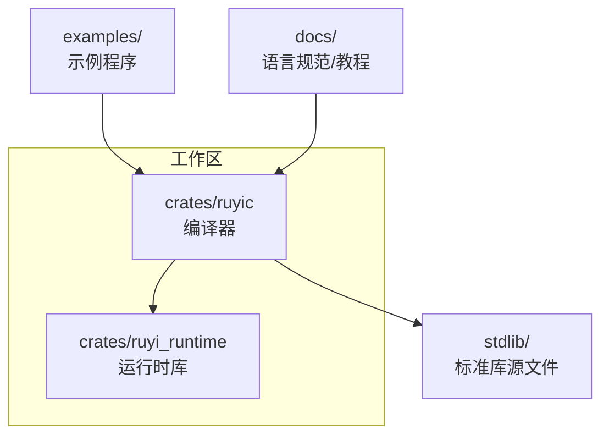
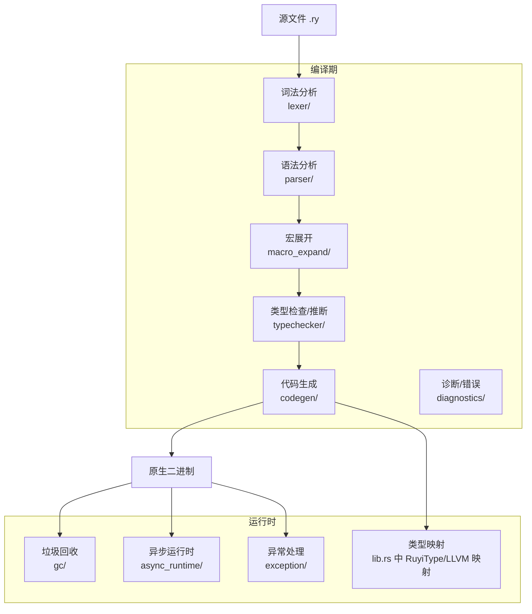
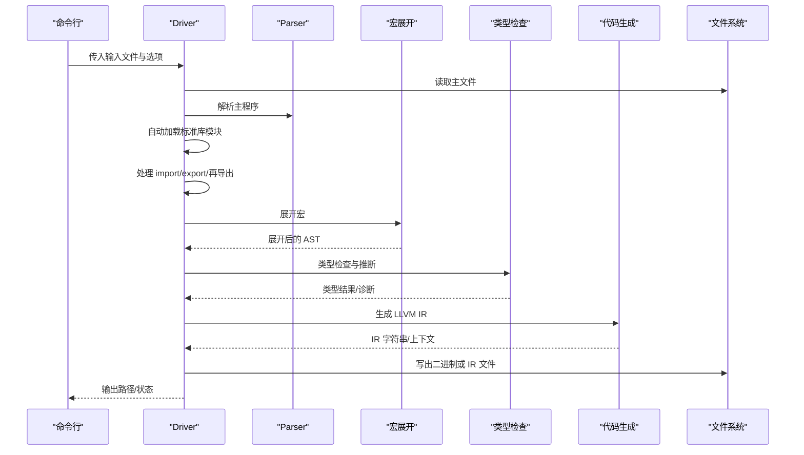
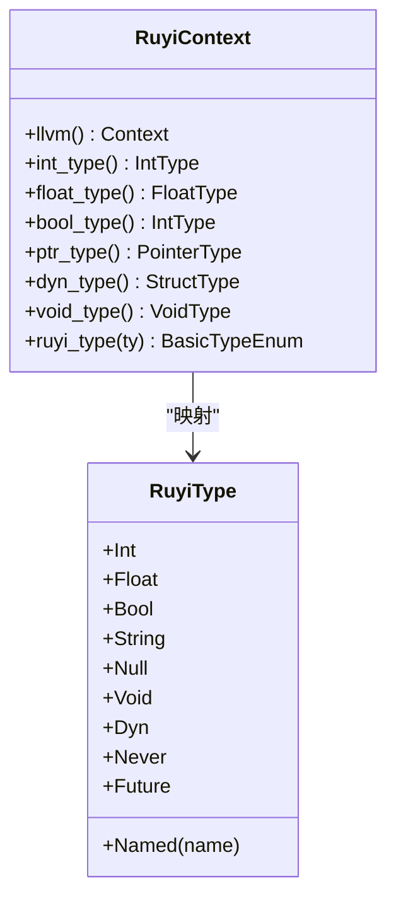
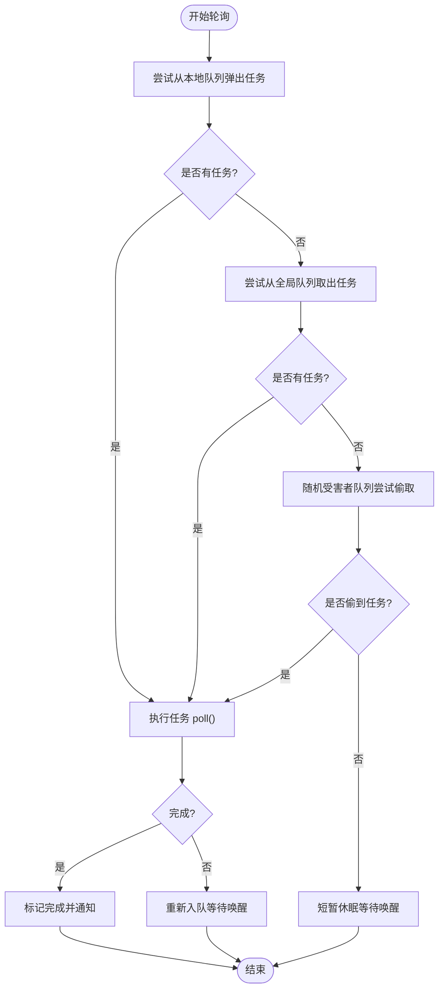
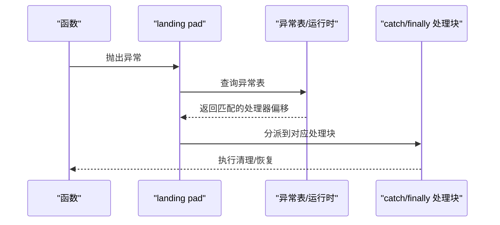
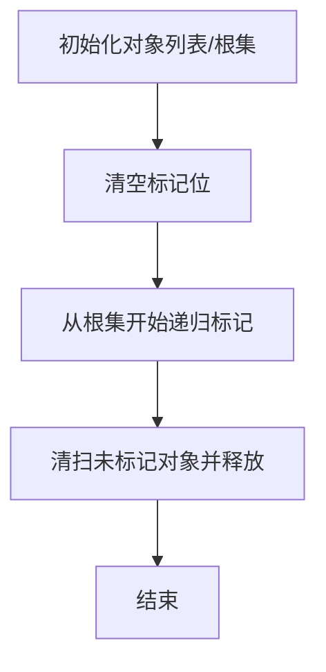

# 项目概述

<cite>
**本文档引用的文件**
- [README.md](file://README.md)
- [Cargo.toml](file://Cargo.toml)
- [crates/ruyic/src/lib.rs](file://crates/ruyic/src/lib.rs)
- [crates/ruyic/src/driver.rs](file://crates/ruyic/src/driver.rs)
- [crates/ruyic/src/main.rs](file://crates/ruyic/src/main.rs)
- [crates/ruyi_runtime/src/lib.rs](file://crates/ruyi_runtime/src/lib.rs)
- [crates/ruyi_runtime/src/async_runtime.rs](file://crates/ruyi_runtime/src/async_runtime.rs)
- [crates/ruyi_runtime/src/exception.rs](file://crates/ruyi_runtime/src/exception.rs)
- [crates/ruyi_runtime/src/gc.rs](file://crates/ruyi_runtime/src/gc.rs)
- [crates/ruyic/Cargo.toml](file://crates/ruyic/Cargo.toml)
- [crates/ruyi_runtime/Cargo.toml](file://crates/ruyi_runtime/Cargo.toml)
- [examples/hello.ry](file://examples/hello.ry)
- [stdlib/core.ry](file://stdlib/core.ry)
- [docs/spec.md](file://docs/spec.md)
</cite>

## 目录
1. [引言](#引言)
2. [项目结构](#项目结构)
3. [核心组件](#核心组件)
4. [架构总览](#架构总览)
5. [详细组件分析](#详细组件分析)
6. [依赖关系分析](#依赖关系分析)
7. [性能考量](#性能考量)
8. [故障排查指南](#故障排查指南)
9. [结论](#结论)
10. [附录](#附录)

## 引言
Ruyi 是一款以 JavaScript 严格模式语法为基础构建的编译型通用编程语言，通过 LLVM 编译生成原生机器码，追求跨平台高性能与易用性。项目在保留熟悉语法的同时，移除了 JavaScript 中的问题特性，引入渐进式类型系统、零成本异常处理、工作窃取调度器、宏系统、泛型与特征（Traits）等现代语言能力，并提供类与特征的组合以支持面向对象与接口契约。

Ruyi 的目标是为初学者提供熟悉的语法体验，同时为有经验的开发者提供可预测的性能与强大的语言特性。其编译器前端负责词法/语法分析、宏展开、类型检查与推断；LLVM 后端负责生成 IR 并链接为本地二进制；运行时系统提供垃圾回收、异步运行时与异常处理等基础设施。

## 项目结构
仓库采用多 crate 的模块化组织方式，核心目录与职责如下：
- crates/ruyic：编译器二进制与库，包含驱动、词法、语法、宏、类型检查、代码生成、诊断与运行时支持模块。
- crates/ruyi_runtime：运行时库，提供 GC、异步运行时、内置函数与异常处理等。
- stdlib：标准库源文件，自动加载到每个程序中。
- examples：示例程序，展示语言特性与常见用法。
- docs：语言规范、教程与路线图等文档。
- 根级 Cargo.toml：工作区定义与共享依赖版本。

图表来源
- [Cargo.toml:1-40](file://Cargo.toml#L1-L40)
- [crates/ruyic/Cargo.toml:1-26](file://crates/ruyic/Cargo.toml#L1-L26)
- [crates/ruyi_runtime/Cargo.toml:1-17](file://crates/ruyi_runtime/Cargo.toml#L1-L17)

章节来源
- [Cargo.toml:1-40](file://Cargo.toml#L1-L40)
- [README.md:75-99](file://README.md#L75-L99)

## 核心组件
- 编译器前端（ruyic）
  - 驱动与管线：从源码到二进制的完整流程，包含词法/语法解析、宏展开、类型检查、代码生成与输出。
  - 模块系统：支持 import/export、命名空间导入、再导出与自动加载标准库。
  - 诊断与错误：统一的错误类型与格式化输出。
- 运行时库（ruyi_runtime）
  - 类型映射：将 Ruyi 基元类型映射到 LLVM 类型，便于代码生成。
  - 垃圾回收：标记-清除与分代收集器，支持注册根集与对象追踪。
  - 异步运行时：基于工作窃取的任务队列、Waker 机制与全局调度器。
  - 异常处理：基于 Itanium C++ ABI 的 landing pad 模型，零成本 try/catch/finally。
- 标准库（stdlib）
  - 自动加载核心类型方法（如整数、浮点、布尔的字符串转换），提升开发体验。

章节来源
- [crates/ruyic/src/lib.rs:1-21](file://crates/ruyic/src/lib.rs#L1-L21)
- [crates/ruyic/src/driver.rs:1-744](file://crates/ruyic/src/driver.rs#L1-L744)
- [crates/ruyi_runtime/src/lib.rs:55-259](file://crates/ruyi_runtime/src/lib.rs#L55-L259)
- [crates/ruyi_runtime/src/gc.rs:15-377](file://crates/ruyi_runtime/src/gc.rs#L15-L377)
- [crates/ruyi_runtime/src/async_runtime.rs:1-655](file://crates/ruyi_runtime/src/async_runtime.rs#L1-L655)
- [crates/ruyi_runtime/src/exception.rs:1-377](file://crates/ruyi_runtime/src/exception.rs#L1-L377)
- [stdlib/core.ry:1-31](file://stdlib/core.ry#L1-L31)

## 架构总览
Ruyi 的编译与运行时架构由“编译器前端 + LLVM 后端 + 运行时系统”三部分协同完成：

图表来源
- [crates/ruyic/src/driver.rs:522-632](file://crates/ruyic/src/driver.rs#L522-L632)
- [crates/ruyi_runtime/src/lib.rs:55-259](file://crates/ruyi_runtime/src/lib.rs#L55-L259)
- [crates/ruyi_runtime/src/gc.rs:15-377](file://crates/ruyi_runtime/src/gc.rs#L15-L377)
- [crates/ruyi_runtime/src/async_runtime.rs:1-655](file://crates/ruyi_runtime/src/async_runtime.rs#L1-L655)
- [crates/ruyi_runtime/src/exception.rs:1-377](file://crates/ruyi_runtime/src/exception.rs#L1-L377)

## 详细组件分析

### 组件A：编译器驱动与模块系统
- 职责
  - 协调完整编译流水线：词法 → 语法 → 宏展开 → 类型检查 → 代码生成 → 输出。
  - 管理模块解析与合并：支持相对路径、绝对路径、RUYI_HOME/stdlib 与搜索路径，自动加载标准库模块。
  - 提供多种输出模式：二进制、LLVM IR、AST/Typed AST、仅类型检查。
- 关键流程
  - 解析主文件与导入，递归解析并合并模块项。
  - 宏展开与类型检查，失败时返回诊断信息。
  - 代码生成阶段创建 Inkwell 上下文，生成 IR 并链接为二进制或写出 IR 文件。
- 错误处理
  - 使用统一的编译错误枚举，涵盖 IO、词法、语法、宏、类型检查、代码生成、链接与模块未找到等场景。

图表来源
- [crates/ruyic/src/driver.rs:258-632](file://crates/ruyic/src/driver.rs#L258-L632)

章节来源
- [crates/ruyic/src/driver.rs:1-744](file://crates/ruyic/src/driver.rs#L1-L744)
- [crates/ruyic/src/main.rs:1-114](file://crates/ruyic/src/main.rs#L1-L114)

### 组件B：渐进式类型系统与类型映射
- 渐进式类型
  - 支持静态类型注解与动态类型（dyn），允许在需要时使用动态类型进行灵活表达。
  - 类型检查器负责推断与约束求解，配合环境管理与诊断输出。
- 类型映射
  - 将 Ruyi 基元类型映射到 LLVM 类型（如 i64、f64、i1、指针、结构体等），为代码生成提供基础。

图表来源
- [crates/ruyi_runtime/src/lib.rs:55-259](file://crates/ruyi_runtime/src/lib.rs#L55-L259)

章节来源
- [crates/ruyi_runtime/src/lib.rs:55-259](file://crates/ruyi_runtime/src/lib.rs#L55-L259)
- [crates/ruyic/src/lib.rs:12-20](file://crates/ruyic/src/lib.rs#L12-L20)

### 组件C：工作窃取调度器与异步运行时
- 设计要点
  - 每个工作线程维护本地双端队列，支持 push/pop 与远程 steal。
  - 全局队列用于唤醒与再平衡，避免锁争用。
  - Waker 机制用于任务唤醒，减少阻塞等待。
  - 与 GC 集成：在 GC 前注册活跃异步任务作为根，防止悬挂对象被回收。
- 关键数据结构
  - WorkStealingDeque：本地队列。
  - Scheduler/SchedulerInner：全局调度器与内部状态。
  - Task/Waker：任务与唤醒句柄。
  - JoinAll/Race：常用并发组合子。

图表来源
- [crates/ruyi_runtime/src/async_runtime.rs:138-357](file://crates/ruyi_runtime/src/async_runtime.rs#L138-L357)

章节来源
- [crates/ruyi_runtime/src/async_runtime.rs:1-655](file://crates/ruyi_runtime/src/async_runtime.rs#L1-L655)

### 组件D：零成本异常处理（基于 LLVM landing pad）
- 实现模型
  - 使用 Itanium C++ ABI 的 landing pad 概念，为每个函数生成异常表条目。
  - 支持 catch、catch-all 与 finally 清理动作，按顺序匹配处理器偏移。
  - 运行时提供异常对象、栈帧与类型 ID 管理，支持捕获与重新抛出。
- 代码生成
  - 在编译器前端生成 landingpad 指令与分支逻辑，结合运行时异常表进行处理。

图表来源
- [crates/ruyi_runtime/src/exception.rs:33-182](file://crates/ruyi_runtime/src/exception.rs#L33-L182)

章节来源
- [crates/ruyi_runtime/src/exception.rs:1-377](file://crates/ruyi_runtime/src/exception.rs#L1-L377)

### 组件E：垃圾回收（GC）与根集管理
- 收集策略
  - 标记-清除（基准实现）与分代收集（推荐）。
  - 对象追踪通过 TypeInfo 中的 trace 回调实现，支持嵌套指针扫描。
- 根集管理
  - 外部根（栈帧、全局变量等）由运行时注册，GC 期间从根集开始标记。
  - 异步运行时在 GC 前注册所有活跃任务，确保挂起任务可达的对象不被回收。

图表来源
- [crates/ruyi_runtime/src/gc.rs:117-191](file://crates/ruyi_runtime/src/gc.rs#L117-L191)

章节来源
- [crates/ruyi_runtime/src/gc.rs:15-377](file://crates/ruyi_runtime/src/gc.rs#L15-L377)

## 依赖关系分析
- 工作区与依赖
  - 工作区统一管理版本与依赖，编译器依赖运行时库与 Inkwell（LLVM 绑定）。
  - 运行时库默认启用 inkwell 特性，提供类型映射与运行时工具。
- 编译器与运行时耦合
  - 编译器通过运行时提供的类型映射与导出符号参与代码生成。
  - 运行时通过静态库形式链接到最终二进制，提供 GC、异步与异常支持。

图表来源
- [Cargo.toml:1-40](file://Cargo.toml#L1-L40)
- [crates/ruyic/Cargo.toml:19-26](file://crates/ruyic/Cargo.toml#L19-L26)
- [crates/ruyi_runtime/Cargo.toml:11-17](file://crates/ruyi_runtime/Cargo.toml#L11-L17)

章节来源
- [Cargo.toml:1-40](file://Cargo.toml#L1-L40)
- [crates/ruyic/Cargo.toml:19-26](file://crates/ruyic/Cargo.toml#L19-L26)
- [crates/ruyi_runtime/Cargo.toml:11-17](file://crates/ruyi_runtime/Cargo.toml#L11-L17)

## 性能考量
- 编译期优化
  - 支持多级优化级别（O0/O1/O2），Release 配置启用 LTO 与单代码生成单元以提升链接期优化效果。
- 运行时优化
  - 工作窃取调度器降低锁竞争，提高多核利用率。
  - 零成本异常处理通过 LLVM landing pad 实现，避免常规路径的额外开销。
  - 渐进式类型系统允许在关键路径上使用静态类型，减少动态分派与装箱成本。
- 内存管理
  - 分代 GC 与对象追踪减少全堆扫描成本，根集注册确保并发安全。
- I/O 与系统集成
  - 通过标准库模块与运行时导出函数桥接系统调用，保持高效与可移植。

## 故障排查指南
- 常见编译错误
  - 词法/语法错误：检查输入文件编码与语法结构，参考诊断输出定位问题。
  - 类型错误：根据类型检查诊断调整注解或表达式类型。
  - 模块未找到：确认 import 路径、RUYI_HOME/stdlib 与搜索路径设置。
  - 代码生成/链接错误：检查 LLVM 版本与系统依赖，确保 inkwell 正确安装。
- 运行时问题
  - 异步任务未完成：确认调度器工作线程数量与任务注册，检查根集是否正确。
  - GC 回收异常：检查对象生命周期与根集注册，避免悬挂引用。
  - 异常未被捕获：核对异常表条目与 catch 匹配规则，确保 finally 清理逻辑正确。

章节来源
- [crates/ruyic/src/driver.rs:21-54](file://crates/ruyic/src/driver.rs#L21-L54)
- [crates/ruyi_runtime/src/async_runtime.rs:426-455](file://crates/ruyi_runtime/src/async_runtime.rs#L426-L455)
- [crates/ruyi_runtime/src/gc.rs:58-98](file://crates/ruyi_runtime/src/gc.rs#L58-L98)

## 结论
Ruyi 以“熟悉的语法 + 现代语言特性 + LLVM 原生编译”为核心理念，构建了从编译器前端到运行时系统的完整生态。其渐进式类型、零成本异常处理与工作窃取调度器等特性，既降低了学习门槛，又保证了高性能与可扩展性。对于初学者，Ruyi 提供了平滑的迁移路径；对于专业开发者，它提供了可控的性能与强大的语言工具集。

## 附录
- 示例与入门
  - Hello World 示例展示了基本打印与编译流程。
  - 标准库核心模块提供常用类型方法，自动可用。
- 文档与规范
  - 语言规范与教程位于 docs 目录，建议作为权威参考。

章节来源
- [examples/hello.ry:1-2](file://examples/hello.ry#L1-L2)
- [stdlib/core.ry:1-31](file://stdlib/core.ry#L1-L31)
- [README.md:193-200](file://README.md#L193-L200)