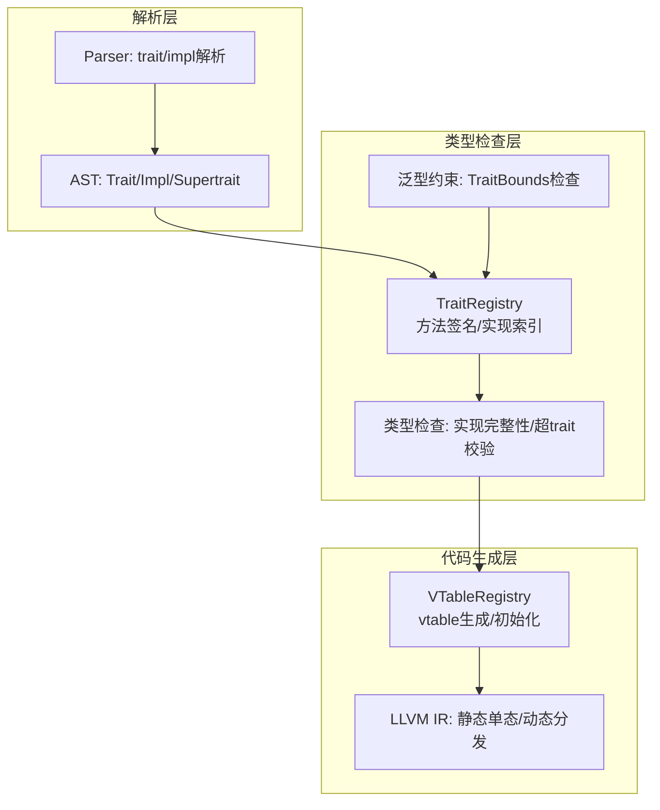
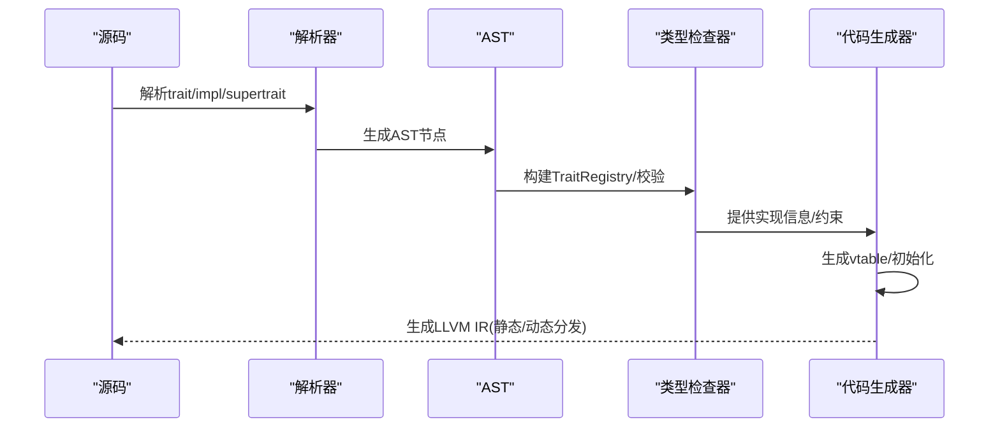
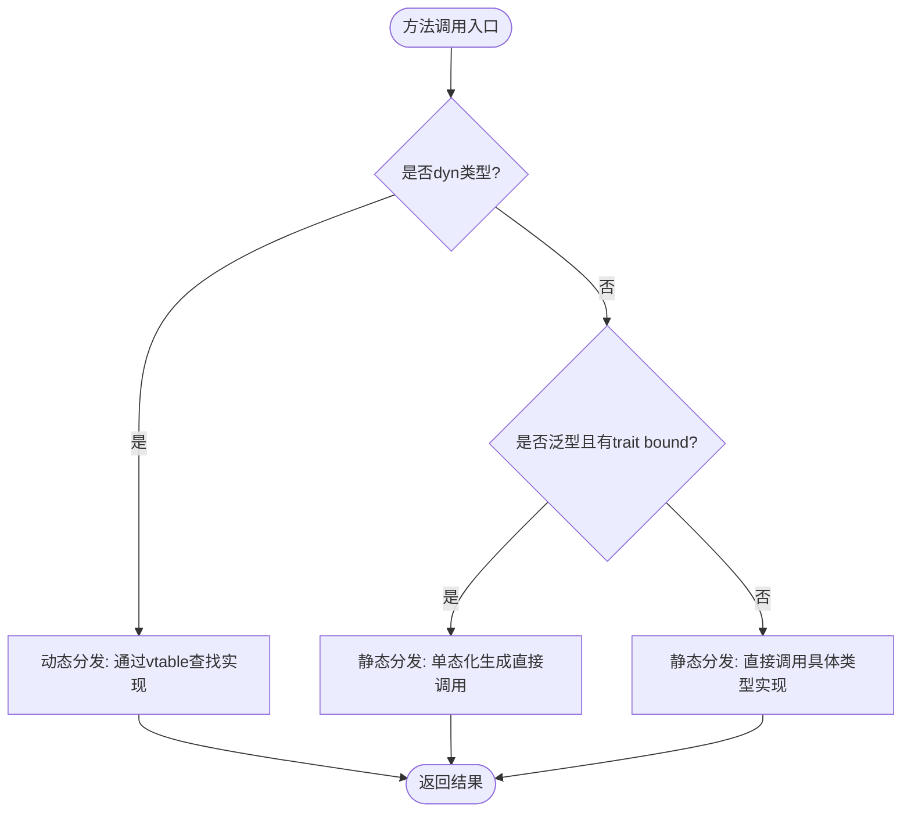
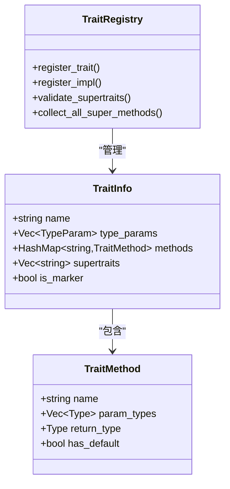
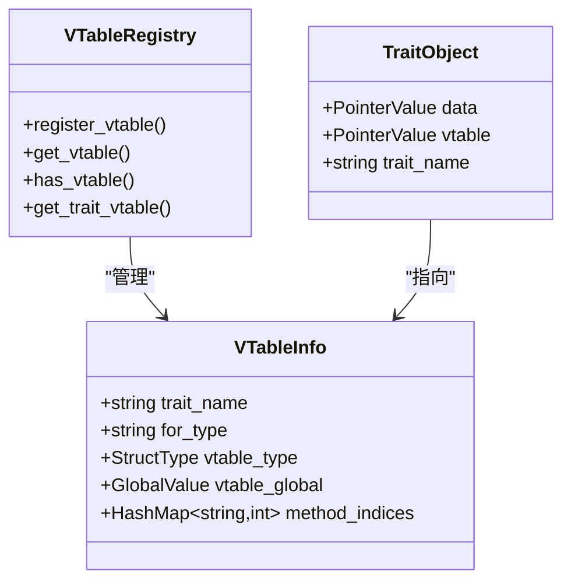
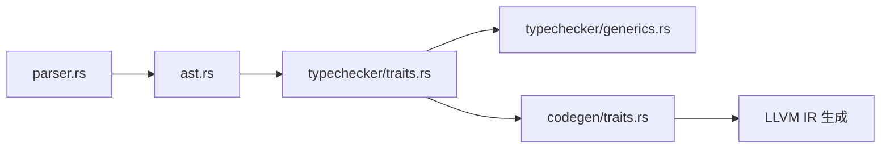
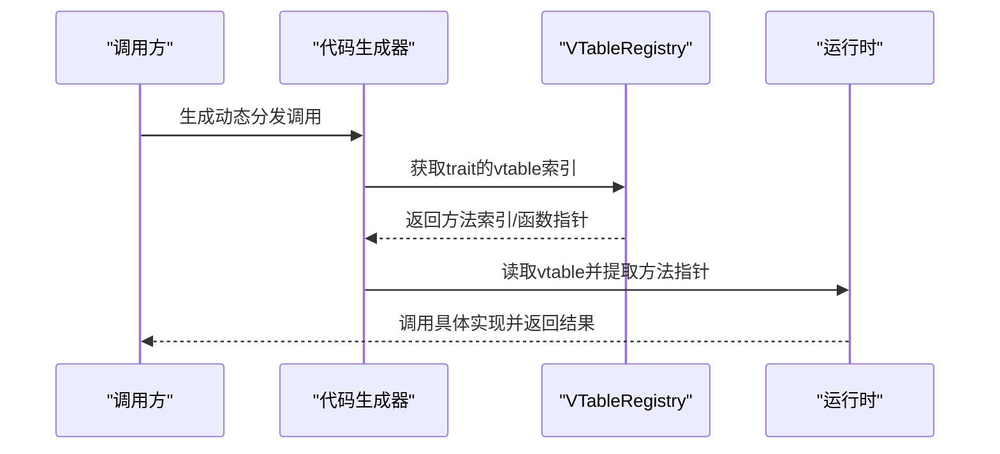
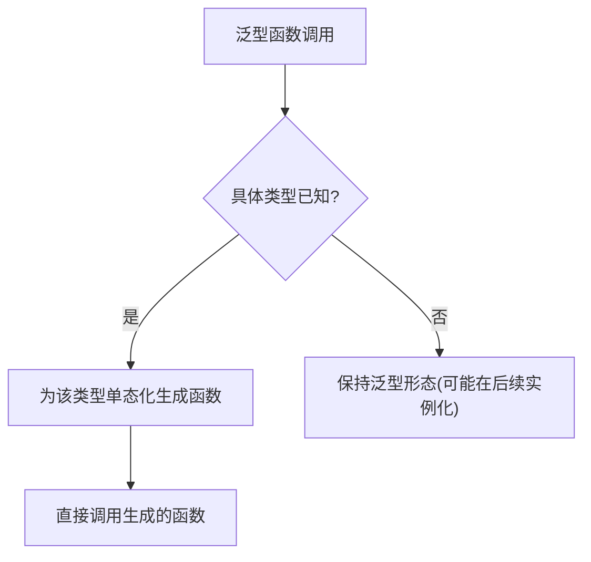

# Traits系统

<cite>
**本文档引用的文件**
- [traits.rs](file://crates/ruyic/src/codegen/traits.rs)
- [traits.rs](file://crates/ruyic/src/typechecker/traits.rs)
- [traits.ry](file://examples/traits.ry)
- [spec.md](file://docs/spec.md)
- [parser.rs](file://crates/ruyic/src/parser/parser.rs)
- [ast.rs](file://crates/ruyic/src/parser/ast.rs)
- [generics.rs](file://crates/ruyic/src/typechecker/generics.rs)
- [traits.rs](file://crates/ruyic/tests/traits.rs)
- [v04_features.ry](file://examples/v04_features.ry)
</cite>

## 目录
1. [简介](#简介)
2. [项目结构](#项目结构)
3. [核心组件](#核心组件)
4. [架构总览](#架构总览)
5. [详细组件分析](#详细组件分析)
6. [依赖关系分析](#依赖关系分析)
7. [性能考量](#性能考量)
8. [故障排查指南](#故障排查指南)
9. [结论](#结论)
10. [附录](#附录)

## 简介
本文件系统化梳理Ruyi语言的Traits（特征/接口）系统，覆盖设计理念、语法与实现规则、静态/动态分发、与泛型的结合、继承与组合、类型系统中的作用以及编译器处理流程，并通过示例展示典型应用场景与性能优化策略。文档面向不同技术背景读者，既提供高层概览也包含代码级细节与可视化图示。

## 项目结构
Traits系统横跨解析、类型检查、代码生成三个阶段：
- 解析层：解析trait声明、impl块、supertrait继承等语法节点
- 类型检查层：构建TraitRegistry，校验实现完整性、supertrait一致性、泛型约束满足
- 代码生成层：为具体实现生成vtable，支持静态单态化与动态trait对象分发

图表来源
- [parser.rs:518-542](file://crates/ruyic/src/parser/parser.rs#L518-L542)
- [ast.rs:47-59](file://crates/ruyic/src/parser/ast.rs#L47-L59)
- [traits.rs:46-52](file://crates/ruyic/src/typechecker/traits.rs#L46-L52)
- [traits.rs:74-141](file://crates/ruyic/src/codegen/traits.rs#L74-L141)

章节来源
- [parser.rs:518-542](file://crates/ruyic/src/parser/parser.rs#L518-L542)
- [ast.rs:47-59](file://crates/ruyic/src/parser/ast.rs#L47-L59)
- [traits.rs:46-52](file://crates/ruyic/src/typechecker/traits.rs#L46-L52)
- [traits.rs:74-141](file://crates/ruyic/src/codegen/traits.rs#L74-L141)

## 核心组件
- TraitRegistry：集中管理所有trait声明与impl实现，提供查找、验证、索引能力
- VTableRegistry：为每个(traits, 具体类型)生成vtable，支持动态分发
- TraitInfo/TraitMethod：描述trait的方法签名、默认实现标记、supertrait列表
- ImplInfo：记录impl块的类型参数、目标类型、已实现方法集合
- TraitObject：动态分发时的胖指针(data + vtable)

章节来源
- [traits.rs:16-52](file://crates/ruyic/src/typechecker/traits.rs#L16-L52)
- [traits.rs:20-36](file://crates/ruyic/src/codegen/traits.rs#L20-L36)

## 架构总览
从源码到运行时的关键路径如下：
- 解析：trait/impl/supertrait语法节点进入AST
- 类型检查：构建TraitRegistry，校验实现完整性与supertrait一致性；泛型约束通过TraitRegistry进行bound检查
- 代码生成：遍历AST收集impl，生成vtable全局变量与初始化器；根据调用上下文选择静态单态或动态分发

图表来源
- [parser.rs:518-542](file://crates/ruyic/src/parser/parser.rs#L518-L542)
- [traits.rs:331-353](file://crates/ruyic/src/typechecker/traits.rs#L331-L353)
- [traits.rs:74-141](file://crates/ruyic/src/codegen/traits.rs#L74-L141)

## 详细组件分析

### 1) 语法与定义规则
- trait声明：可包含方法签名与默认实现；空trait为标记trait
- impl块：为特定类型实现某个trait的所有非默认方法
- supertrait继承：trait可扩展其他trait，形成继承链
- 泛型impl：impl块可带自己的类型参数与bounds

章节来源
- [ast.rs:47-59](file://crates/ruyic/src/parser/ast.rs#L47-L59)
- [parser.rs:518-542](file://crates/ruyic/src/parser/parser.rs#L518-L542)
- [traits.rs:59-121](file://crates/ruyic/src/typechecker/traits.rs#L59-L121)
- [traits.rs:123-165](file://crates/ruyic/src/typechecker/traits.rs#L123-L165)

### 2) 类型系统中的作用
- TraitRegistry维护：
  - trait名称、类型参数、方法签名、默认实现标记、supertrait列表
  - impl索引：按(具体类型名, trait名)映射到impl位置
- 约束检查：
  - 检查类型是否满足泛型参数的trait bound
  - 动态类型(dyn)总是通过任意bound
- 超trait校验：
  - 检测未知supertrait、循环继承、缺失的supertrait方法

章节来源
- [traits.rs:46-52](file://crates/ruyic/src/typechecker/traits.rs#L46-L52)
- [traits.rs:236-277](file://crates/ruyic/src/typechecker/traits.rs#L236-L277)
- [generics.rs:195-198](file://crates/ruyic/src/typechecker/generics.rs#L195-L198)

### 3) 静态分发与动态分发
- 静态分发（单态化）：当具体类型在编译期可知时，直接生成对应函数调用，无vtable开销
- 动态分发（trait对象）：当类型未知或需要统一处理时，通过fat pointer持有数据指针与vtable指针，运行时按vtable索引调用

图表来源
- [spec.md:3022-3076](file://docs/spec.md#L3022-L3076)
- [traits.rs:221-285](file://crates/ruyic/src/codegen/traits.rs#L221-L285)

章节来源
- [spec.md:3022-3076](file://docs/spec.md#L3022-L3076)
- [traits.rs:221-285](file://crates/ruyic/src/codegen/traits.rs#L221-L285)

### 4) 默认方法实现
- trait可提供默认方法，未被impl重写的实现会自动继承
- 默认方法在静态分发下会被单态化，动态分发下通过vtable查找

章节来源
- [spec.md:3077-3100](file://docs/spec.md#L3077-L3100)
- [traits.rs:68-107](file://crates/ruyic/src/typechecker/traits.rs#L68-L107)

### 5) 继承与组合（supertrait）
- 支持单个或多个supertrait继承
- 自动收集超trait链上的所有方法，检测循环依赖与缺失方法
- 通过collect_all_super_methods聚合transitive closure

图表来源
- [traits.rs:25-33](file://crates/ruyic/src/typechecker/traits.rs#L25-L33)
- [traits.rs:16-23](file://crates/ruyic/src/typechecker/traits.rs#L16-L23)
- [traits.rs:279-296](file://crates/ruyic/src/typechecker/traits.rs#L279-L296)

章节来源
- [traits.rs:254-296](file://crates/ruyic/src/typechecker/traits.rs#L254-L296)

### 6) 与泛型的结合
- 泛型函数/类可声明trait bound，如<T: Trait>
- 类型推断时通过TraitRegistry检查bound是否满足
- 动态类型(dyn)总是满足任意bound
- 多个bound以逗号分隔

章节来源
- [generics.rs:349-349](file://crates/ruyic/src/typechecker/generics.rs#L349-L349)
- [generics.rs:885-967](file://crates/ruyic/src/typechecker/generics.rs#L885-L967)

### 7) 代码生成与运行时布局
- vtable结构：为每个(traits, 类型)生成全局结构体，字段为各方法的函数指针
- trait object布局：fat pointer包含void*数据指针与vtable指针
- 初始化：在所有函数编译完成后，填充vtable的函数指针数组

图表来源
- [traits.rs:20-36](file://crates/ruyic/src/codegen/traits.rs#L20-L36)
- [traits.rs:38-71](file://crates/ruyic/src/codegen/traits.rs#L38-L71)
- [traits.rs:177-219](file://crates/ruyic/src/codegen/traits.rs#L177-L219)

章节来源
- [traits.rs:74-141](file://crates/ruyic/src/codegen/traits.rs#L74-L141)
- [traits.rs:143-175](file://crates/ruyic/src/codegen/traits.rs#L143-L175)
- [traits.rs:177-219](file://crates/ruyic/src/codegen/traits.rs#L177-L219)
- [traits.rs:221-285](file://crates/ruyic/src/codegen/traits.rs#L221-L285)

### 8) 实际应用示例
- 基础示例：Printable、Stringable、Drawable等trait与impl
- 超trait示例：Debug、Formattable等继承关系
- 动态分发示例：数组元素统一为dyn Printable

章节来源
- [traits.ry:11-34](file://examples/traits.ry#L11-L34)
- [traits.ry:39-46](file://examples/traits.ry#L39-L46)
- [traits.ry:65-110](file://examples/traits.ry#L65-L110)
- [v04_features.ry:32-63](file://examples/v04_features.ry#L32-L63)

## 依赖关系分析
- 解析依赖：Parser负责解析trait/impl/supertrait语法，产出AST节点
- 类型检查依赖：TraitRegistry作为中心枢纽，被TypeInference/Generic检查调用
- 代码生成依赖：VTableRegistry依赖TraitRegistry提供的方法索引与类型信息

图表来源
- [parser.rs:518-542](file://crates/ruyic/src/parser/parser.rs#L518-L542)
- [ast.rs:47-59](file://crates/ruyic/src/parser/ast.rs#L47-L59)
- [traits.rs:331-353](file://crates/ruyic/src/typechecker/traits.rs#L331-L353)
- [generics.rs:195-198](file://crates/ruyic/src/typechecker/generics.rs#L195-L198)
- [traits.rs:74-141](file://crates/ruyic/src/codegen/traits.rs#L74-L141)

章节来源
- [parser.rs:518-542](file://crates/ruyic/src/parser/parser.rs#L518-L542)
- [traits.rs:331-353](file://crates/ruyic/src/typechecker/traits.rs#L331-L353)
- [traits.rs:74-141](file://crates/ruyic/src/codegen/traits.rs#L74-L141)

## 性能考量
- 静态分发优势：无vtable查找，内联调用，零额外间接成本
- 动态分发成本：一次vtable索引与一次间接调用，但带来灵活性
- vtable生成策略：按(traits, 类型)生成，避免重复；初始化在函数编译后完成
- 泛型单态化：针对每种具体类型生成独立函数，消除通用分支判断
- 优化建议：
  - 在编译期已知类型时优先使用静态分发
  - 合理设计supertrait层次，减少不必要的方法继承
  - 控制trait数量与方法复杂度，避免过度抽象导致的代码膨胀
  - 对热点路径尽量避免频繁的trait对象装箱/拆箱

章节来源
- [spec.md:3022-3076](file://docs/spec.md#L3022-L3076)
- [traits.rs:74-141](file://crates/ruyic/src/codegen/traits.rs#L74-L141)

## 故障排查指南
- 缺失方法实现：当impl未实现trait的非默认方法时，类型检查会报错
- 未知trait引用：impl引用了不存在的trait
- 循环supertrait：A extends B, B extends A
- 重复impl：同一类型在同一模块对同一trait的重复实现（当前未强制去重）
- 泛型bound不满足：传入类型不满足泛型参数的trait bound

章节来源
- [traits.rs:211-234](file://crates/ruyic/src/typechecker/traits.rs#L211-L234)
- [traits.rs:254-277](file://crates/ruyic/src/typechecker/traits.rs#L254-L277)
- [traits.rs:106-113](file://crates/ruyic/tests/traits.rs#L106-L113)
- [traits.rs:222-230](file://crates/ruyic/tests/traits.rs#L222-L230)

## 结论
Ruyi的Traits系统提供了清晰的抽象与灵活的分发模型：通过静态单态化获得高性能，通过动态trait对象获得多态灵活性；配合泛型bound与supertrait继承，既能保证类型安全又能提升代码复用。在工程实践中，应遵循规范的实现规则与约束检查，合理选择分发方式，并关注vtable与单态化的性能影响。

## 附录

### A. 关键流程图：动态分发调用序列

图表来源
- [traits.rs:221-285](file://crates/ruyic/src/codegen/traits.rs#L221-L285)

### B. 关键流程图：静态分发与单态化

图表来源
- [spec.md:3026-3039](file://docs/spec.md#L3026-L3039)