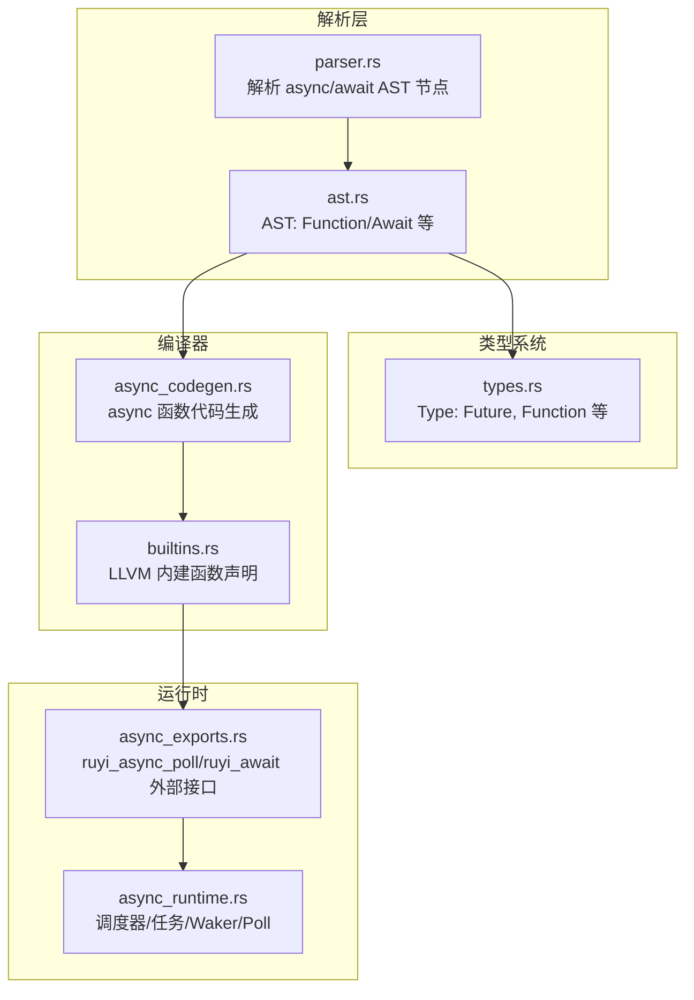
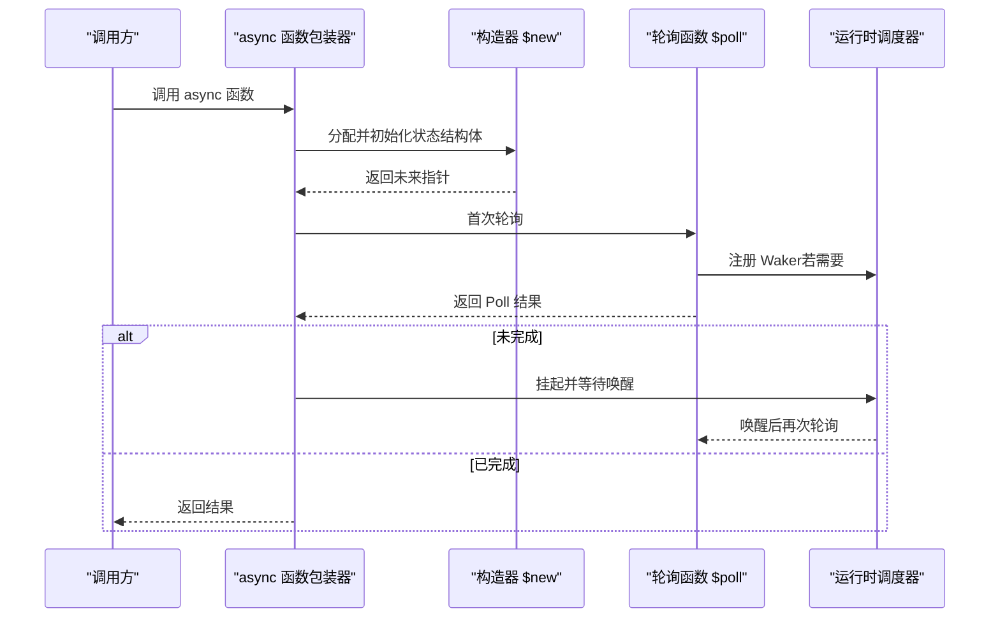
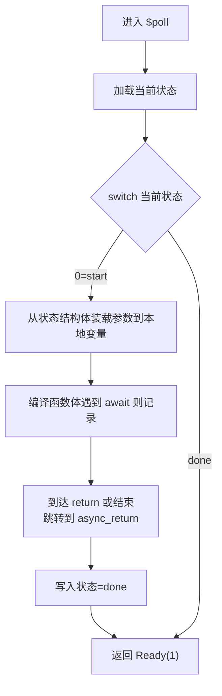
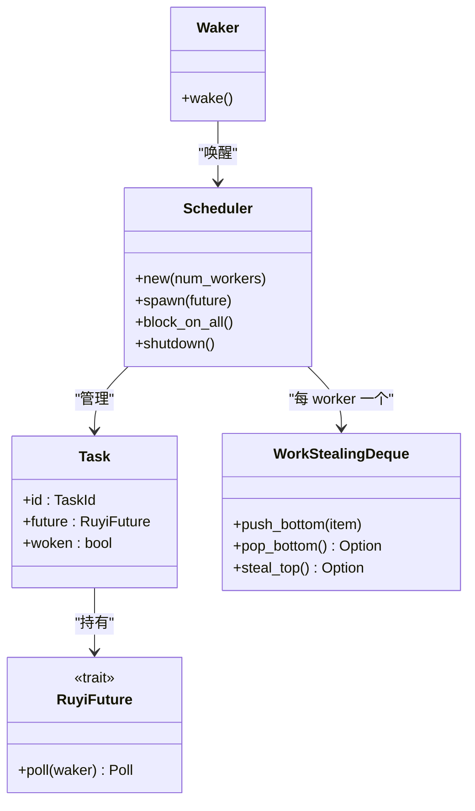
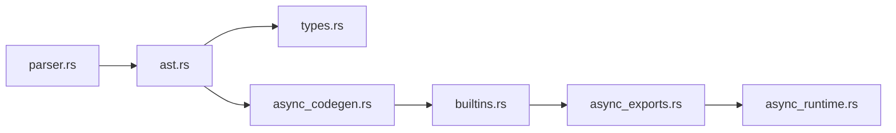

# 异步/等待语法

<cite>
**本文引用的文件**
- [async_codegen.rs](file://crates/ruyic/src/codegen/async_codegen.rs)
- [async_runtime.rs](file://crates/ruyi_runtime/src/async_runtime.rs)
- [async_exports.rs](file://crates/ruyi_runtime/src/async_exports.rs)
- [builtins.rs](file://crates/ruyic/src/codegen/builtins.rs)
- [parser.rs](file://crates/ruyic/src/parser/parser.rs)
- [ast.rs](file://crates/ruyic/src/parser/ast.rs)
- [types.rs](file://crates/ruyic/src/typechecker/types.rs)
- [async.ry](file://examples/async.ry)
- [async_basic.ry](file://crates/ruyic/tests/integration/cases/async/async_basic.ry)
- [await.ry](file://crates/ruyic/tests/integration/cases/async/await.ry)
- [await_expression.ry](file://crates/ruyic/tests/integration/cases/async/await_expression.ry)
- [promise_all.ry](file://crates/ruyic/tests/integration/cases/async/promise_all.ry)
- [spawn_task.ry](file://crates/ruyic/tests/integration/cases/async/spawn_task.ry)
</cite>

## 目录
1. [引言](#引言)
2. [项目结构](#项目结构)
3. [核心组件](#核心组件)
4. [架构总览](#架构总览)
5. [详细组件分析](#详细组件分析)
6. [依赖关系分析](#依赖关系分析)
7. [性能考量](#性能考量)
8. [故障排查指南](#故障排查指南)
9. [结论](#结论)
10. [附录](#附录)

## 引言
本文件系统性地阐述 Ruyi 语言中的 async/await 语法：从语法定义、类型系统、编译器生成（LLVM IR）、到运行时调度与唤醒机制。重点覆盖：
- async 函数的定义规则、参数类型声明与返回值类型标注
- await 表达式的使用方法与语义（等待时机与结果获取）
- async 函数与普通函数在编译时与运行时的差异
- async 函数的调用方式与参数传递机制
- 语法糖背后的实现原理（状态机、轮询、唤醒）

## 项目结构
围绕 async/await 的相关模块分布如下：
- 解析层：词法与语法解析，识别 async 关键字、箭头函数的 async 形态、await 表达式节点
- 类型系统：Future<T> 类型、函数类型、类型推断与标注
- 编译器：将 async 函数转换为状态机，并生成构造器、轮询函数与包装器；await 表达式生成对运行时轮询的调用
- 运行时：调度器、任务队列、工作窃取、Waker 唤醒、GC 根注册、组合子（并发聚合）

图表来源
- [parser.rs:1477-1505](file://crates/ruyic/src/parser/parser.rs#L1477-L1505)
- [ast.rs:235-244](file://crates/ruyic/src/parser/ast.rs#L235-L244)
- [types.rs:56-57](file://crates/ruyic/src/typechecker/types.rs#L56-L57)
- [async_codegen.rs:206-504](file://crates/ruyic/src/codegen/async_codegen.rs#L206-L504)
- [builtins.rs:29-33](file://crates/ruyic/src/codegen/builtins.rs#L29-L33)
- [async_runtime.rs:28-47](file://crates/ruyi_runtime/src/async_runtime.rs#L28-L47)
- [async_exports.rs:52-52](file://crates/ruyi_runtime/src/async_exports.rs#L52-L52)

章节来源
- [parser.rs:1477-1505](file://crates/ruyic/src/parser/parser.rs#L1477-L1505)
- [ast.rs:235-244](file://crates/ruyic/src/parser/ast.rs#L235-L244)
- [types.rs:56-57](file://crates/ruyic/src/typechecker/types.rs#L56-L57)
- [async_codegen.rs:206-504](file://crates/ruyic/src/codegen/async_codegen.rs#L206-L504)
- [builtins.rs:29-33](file://crates/ruyic/src/codegen/builtins.rs#L29-L33)
- [async_runtime.rs:28-47](file://crates/ruyi_runtime/src/async_runtime.rs#L28-L47)
- [async_exports.rs:52-52](file://crates/ruyi_runtime/src/async_exports.rs#L52-L52)

## 核心组件
- 语法与 AST
  - async 函数与箭头函数支持 is_async 标记
  - await 表达式节点为 Expr::Await
- 类型系统
  - Future<T> 表示异步计算结果
  - 函数类型 Function{ params, return_type } 支持返回 Future<T>
- 编译器
  - 将 async 函数生成三段实体：构造器、轮询函数、薄包装器
  - await 表达式在同步上下文调用阻塞等待，在异步轮询上下文调用 ruyi_async_poll 并读取结果
- 运行时
  - 调度器、任务队列、工作窃取
  - Waker 用于唤醒挂起的任务
  - 提供 JoinAll/Race 等组合子

章节来源
- [ast.rs:235-244](file://crates/ruyic/src/parser/ast.rs#L235-L244)
- [types.rs:56-57](file://crates/ruyic/src/typechecker/types.rs#L56-L57)
- [async_codegen.rs:206-504](file://crates/ruyic/src/codegen/async_codegen.rs#L206-L504)
- [async_runtime.rs:28-47](file://crates/ruyi_runtime/src/async_runtime.rs#L28-L47)

## 架构总览
async/await 在 Ruyi 中以“语法糖”形式存在：编译期将 async 函数转换为可轮询的状态机，await 表达式在运行时通过调度器进行协作式并发。

图表来源
- [async_codegen.rs:468-492](file://crates/ruyic/src/codegen/async_codegen.rs#L468-L492)
- [async_runtime.rs:317-357](file://crates/ruyi_runtime/src/async_runtime.rs#L317-L357)

## 详细组件分析

### 语法与 AST：async 函数与 await 表达式
- async 函数
  - 支持函数声明与箭头函数形态，is_async 字段标识为异步
  - 参数与返回值支持类型标注（TypeAnnotation）
- await 表达式
  - AST 节点为 Expr::Await，表示在当前作用域暂停执行，等待内部 future 完成

章节来源
- [parser.rs:1477-1505](file://crates/ruyic/src/parser/parser.rs#L1477-L1505)
- [ast.rs:235-244](file://crates/ruyic/src/parser/ast.rs#L235-L244)

### 类型系统：Future<T> 与函数类型
- Future<T>
  - 表示异步计算的结果类型，await 后得到 T
- 函数类型
  - 函数返回类型可为 Future<T>，表示该函数返回一个 future
- 类型推断与标注
  - 支持显式类型注解与推断，参数与返回值均可标注

章节来源
- [types.rs:56-57](file://crates/ruyic/src/typechecker/types.rs#L56-L57)
- [types.rs:42-45](file://crates/ruyic/src/typechecker/types.rs#L42-L45)

### 编译器：async 函数代码生成
- 生成三段实体
  - {name}$new：分配并初始化状态结构体，设置初始状态与参数槽位
  - {name}$poll：状态机轮询入口，按 await 点拆分控制流，保存当前状态并在后续轮询恢复
  - {name}：薄包装器，调用 $new 并返回 future 指针
- 状态结构体布局
  - 包含轮询函数指针、当前状态整数、参数槽位、结果槽位等字段
- 变量与 GC 根
  - 将参数与局部变量纳入 GC 根管理，确保挂起期间可达

图表来源
- [async_codegen.rs:274-398](file://crates/ruyic/src/codegen/async_codegen.rs#L274-L398)

章节来源
- [async_codegen.rs:206-504](file://crates/ruyic/src/codegen/async_codegen.rs#L206-L504)

### 编译器：await 表达式生成
- 同步上下文
  - 调用 ruyi_await 作为阻塞回退路径
- 异步上下文
  - 调用 ruyi_async_poll(future_ptr, waker_ptr)，根据返回值判断 Ready/Pending
  - 从 future 的状态结构体中加载实际结果值

章节来源
- [async_codegen.rs:506-561](file://crates/ruyic/src/codegen/async_codegen.rs#L506-L561)
- [builtins.rs:29-33](file://crates/ruyic/src/codegen/builtins.rs#L29-L33)

### 运行时：调度器、任务与 Waker
- 调度器
  - 多工作线程、每个线程维护本地双端队列，全局队列与工作窃取
  - 提供 block_on_all、shutdown 等控制接口
- 任务与轮询
  - Task 包装任意 RuyiFuture，Worker 循环取出并调用 future.poll(waker)
  - Poll::Pending 时将任务放回队列等待唤醒
- Waker
  - 携带调度器共享引用、worker id、task id，调用 wake 将任务重新入队

图表来源
- [async_runtime.rs:138-314](file://crates/ruyi_runtime/src/async_runtime.rs#L138-L314)
- [async_runtime.rs:359-382](file://crates/ruyi_runtime/src/async_runtime.rs#L359-L382)

章节来源
- [async_runtime.rs:138-314](file://crates/ruyi_runtime/src/async_runtime.rs#L138-L314)
- [async_runtime.rs:359-382](file://crates/ruyi_runtime/src/async_runtime.rs#L359-L382)

### 运行时：外部接口与异常处理
- ruyi_async_poll
  - 由编译器生成的 await 在异步上下文调用，返回 Ready/Pending
- ruyi_await
  - 非工作线程调用时，将 future 交由调度器管理并挂起当前线程
- 异常捕获
  - 异步函数抛出的异常被捕获并存储于 future，等待方在合适位置重新抛出

章节来源
- [async_exports.rs:52-52](file://crates/ruyi_runtime/src/async_exports.rs#L52-L52)
- [async_runtime.rs:387-400](file://crates/ruyi_runtime/src/async_runtime.rs#L387-L400)
- [async_runtime.rs:407-419](file://crates/ruyi_runtime/src/async_runtime.rs#L407-L419)

### 语法示例与使用模式
- 基础 async 函数与返回值
  - 示例：[async_basic.ry:1-10](file://crates/ruyic/tests/integration/cases/async/async_basic.ry#L1-L10)
- await 表达式与顺序求值
  - 示例：[await.ry:1-12](file://crates/ruyic/tests/integration/cases/async/await.ry#L1-L12)
- await 表达式在返回中使用
  - 示例：[await_expression.ry:1-9](file://crates/ruyic/tests/integration/cases/async/await_expression.ry#L1-L9)
- 并发聚合（组合子）
  - 示例：[promise_all.ry:1-13](file://crates/ruyic/tests/integration/cases/async/promise_all.ry#L1-L13)
- 任务启动与调度运行
  - 示例：[spawn_task.ry:1-9](file://crates/ruyic/tests/integration/cases/async/spawn_task.ry#L1-L9)
- 综合示例（教程）
  - 示例：[async.ry:1-28](file://examples/async.ry#L1-L28)

章节来源
- [async_basic.ry:1-10](file://crates/ruyic/tests/integration/cases/async/async_basic.ry#L1-L10)
- [await.ry:1-12](file://crates/ruyic/tests/integration/cases/async/await.ry#L1-L12)
- [await_expression.ry:1-9](file://crates/ruyic/tests/integration/cases/async/await_expression.ry#L1-L9)
- [promise_all.ry:1-13](file://crates/ruyic/tests/integration/cases/async/promise_all.ry#L1-L13)
- [spawn_task.ry:1-9](file://crates/ruyic/tests/integration/cases/async/spawn_task.ry#L1-L9)
- [async.ry:1-28](file://examples/async.ry#L1-L28)

## 依赖关系分析
- 语法与类型
  - parser 产出 AST，包含 async/is_async 与 Await 节点
  - typechecker 使用 Type::Future 与 Function 类型描述 async 函数签名
- 编译期
  - async_codegen 依据 AST 生成 LLVM IR，构建状态机
  - builtins 声明 ruyi_async_poll/ruyi_await 等运行时函数
- 运行时
  - async_runtime 实现调度器、任务、Waker、Poll
  - async_exports 暴露 C ABI 接口给编译器生成的 IR 调用

图表来源
- [parser.rs:1477-1505](file://crates/ruyic/src/parser/parser.rs#L1477-L1505)
- [ast.rs:235-244](file://crates/ruyic/src/parser/ast.rs#L235-L244)
- [types.rs:56-57](file://crates/ruyic/src/typechecker/types.rs#L56-L57)
- [async_codegen.rs:206-504](file://crates/ruyic/src/codegen/async_codegen.rs#L206-L504)
- [builtins.rs:29-33](file://crates/ruyic/src/codegen/builtins.rs#L29-L33)
- [async_exports.rs:52-52](file://crates/ruyi_runtime/src/async_exports.rs#L52-L52)
- [async_runtime.rs:28-47](file://crates/ruyi_runtime/src/async_runtime.rs#L28-L47)

章节来源
- [parser.rs:1477-1505](file://crates/ruyic/src/parser/parser.rs#L1477-L1505)
- [ast.rs:235-244](file://crates/ruyic/src/parser/ast.rs#L235-L244)
- [types.rs:56-57](file://crates/ruyic/src/typechecker/types.rs#L56-L57)
- [async_codegen.rs:206-504](file://crates/ruyic/src/codegen/async_codegen.rs#L206-L504)
- [builtins.rs:29-33](file://crates/ruyic/src/codegen/builtins.rs#L29-L33)
- [async_exports.rs:52-52](file://crates/ruyi_runtime/src/async_exports.rs#L52-L52)
- [async_runtime.rs:28-47](file://crates/ruyi_runtime/src/async_runtime.rs#L28-L47)

## 性能考量
- 协作式并发
  - 无抢占，避免上下文切换开销；通过 Waker 与工作窃取提升吞吐
- 状态机与栈帧
  - 将函数体状态切分为多个轮询块，减少堆栈深度与 GC 压力
- GC 集成
  - 运行时在 GC 前扫描活跃 async 任务，将其根对象加入 GC 根集，防止误回收
- 组合子
  - JoinAll/Race 提供并发聚合与竞速能力，降低串行等待时间

## 故障排查指南
- 无法找到 ruyi_async_poll/ruyi_await 符号
  - 检查 builtins 是否已声明对应内建函数
  - 确认链接了运行时库
- await 后类型不匹配
  - 确认被 await 的表达式类型为 Future<T>，await 后得到 T
- 调度器未运行导致挂起
  - 确保调用 ruyi_run_scheduler 或在工作线程中运行
- 异常未正确传播
  - 检查是否在等待方重新抛出 AsyncException

章节来源
- [builtins.rs:29-33](file://crates/ruyic/src/codegen/builtins.rs#L29-L33)
- [async_runtime.rs:407-419](file://crates/ruyi_runtime/src/async_runtime.rs#L407-L419)
- [async_runtime.rs:426-455](file://crates/ruyi_runtime/src/async_runtime.rs#L426-L455)

## 结论
Ruyi 的 async/await 以“状态机+轮询+协作式调度”的方式实现，既保持了语法的简洁与直观，又在运行时具备良好的并发性能与内存安全。编译器将 async 函数转换为可轮询的状态机，await 表达式在同步与异步上下文分别采用阻塞或非阻塞策略，运行时通过调度器与 Waker 实现高效的多任务协作。

## 附录

### async 函数定义规则与类型标注
- 函数声明
  - 支持参数类型标注与返回值类型标注；返回类型可为 Future<T>
- 箭头函数
  - 支持 async (params) => expr/block，可标注返回类型
- 类型系统
  - Type::Future<T> 描述异步结果；Function 类型支持返回 Future

章节来源
- [parser.rs:1477-1505](file://crates/ruyic/src/parser/parser.rs#L1477-L1505)
- [ast.rs:235-244](file://crates/ruyic/src/parser/ast.rs#L235-L244)
- [types.rs:56-57](file://crates/ruyic/src/typechecker/types.rs#L56-L57)

### await 表达式语义与等待时机
- 语义
  - 在当前作用域暂停，等待内部 future 完成
- 等待时机
  - 同步上下文：阻塞直到 future 完成
  - 异步上下文：非阻塞轮询，必要时挂起并等待 Waker 唤醒
- 结果获取
  - 从 future 的状态结构体中读取结果值

章节来源
- [async_codegen.rs:506-561](file://crates/ruyic/src/codegen/async_codegen.rs#L506-L561)
- [async_runtime.rs:387-400](file://crates/ruyi_runtime/src/async_runtime.rs#L387-L400)

### async 与普通函数的差异（编译时/运行时）
- 编译时
  - async 函数生成状态机与轮询逻辑；普通函数直接编译为常规函数
- 运行时
  - async 函数返回 Future<T>；await 获取 T；普通函数直接返回 T

章节来源
- [async_codegen.rs:206-504](file://crates/ruyic/src/codegen/async_codegen.rs#L206-L504)
- [types.rs:56-57](file://crates/ruyic/src/typechecker/types.rs#L56-L57)

### 调用方式与参数传递
- 调用
  - async 函数通过包装器返回 future 指针；await 在等待方获取结果
- 参数传递
  - 参数通过状态结构体槽位传递；GC 管理的参数会被登记为根

章节来源
- [async_codegen.rs:468-492](file://crates/ruyic/src/codegen/async_codegen.rs#L468-L492)
- [async_codegen.rs:323-357](file://crates/ruyic/src/codegen/async_codegen.rs#L323-L357)

### 语法糖背后的实现原理
- 语法糖
  - async/await 是对状态机与轮询的语法糖
- 实现要点
  - 状态机：将函数体按 await 切分，保存/恢复状态
  - 轮询：$poll 逐段推进，Ready 表示完成，Pending 表示挂起
  - 唤醒：Waker 将任务重新入队，等待下一次轮询

章节来源
- [async_codegen.rs:206-504](file://crates/ruyic/src/codegen/async_codegen.rs#L206-L504)
- [async_runtime.rs:317-357](file://crates/ruyi_runtime/src/async_runtime.rs#L317-L357)