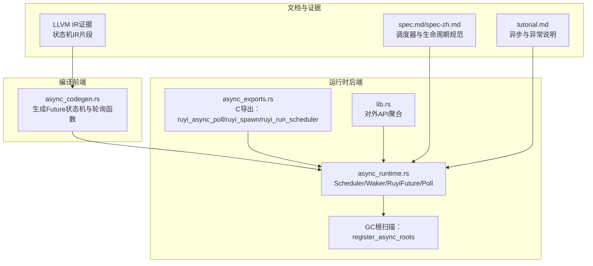
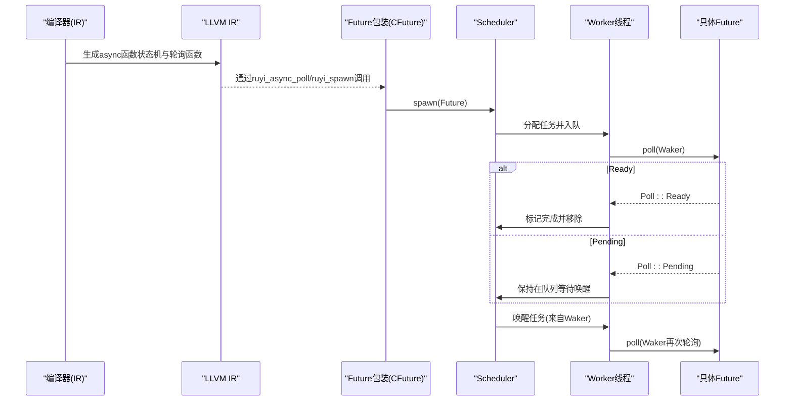
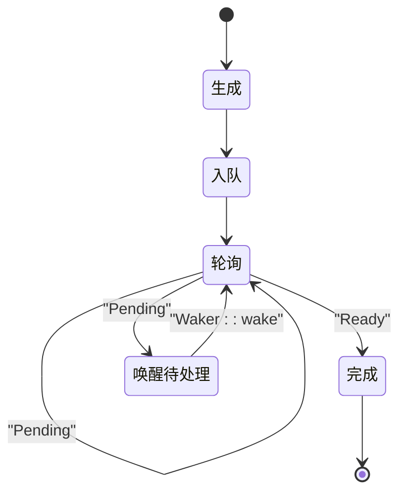
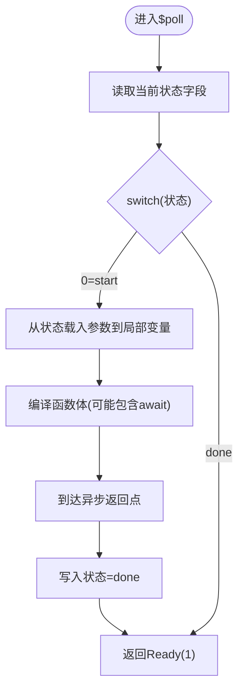
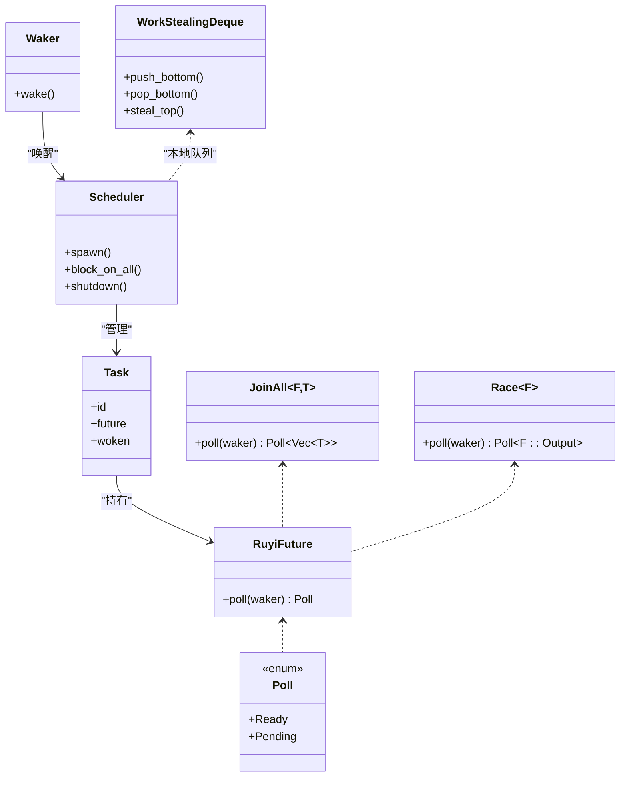
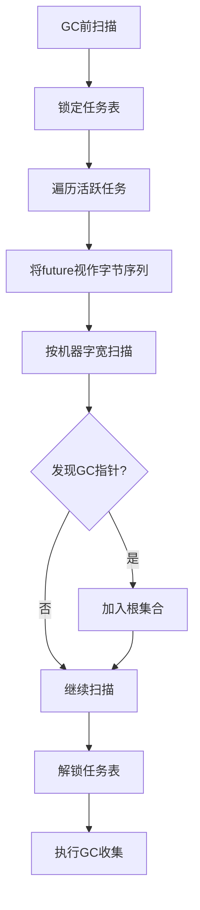
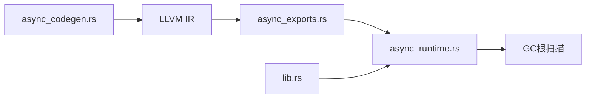

# Promise机制

<cite>
**本文引用的文件**
- [async_runtime.rs](file://crates/ruyi_runtime/src/async_runtime.rs)
- [async_exports.rs](file://crates/ruyi_runtime/src/async_exports.rs)
- [async_codegen.rs](file://crates/ruyic/src/codegen/async_codegen.rs)
- [lib.rs](file://crates/ruyi_runtime/src/lib.rs)
- [async_runtime 测试](file://crates/ruyi_runtime/tests/async_runtime.rs)
- [GC根注册测试](file://crates/ruyi_runtime/tests/async_gc_roots.rs)
- [GC根注册测试（完整版）](file://crates/ruyi_runtime/tests/gc_async_roots.rs)
- [规范（英文）](file://docs/spec.md)
- [规范（中文）](file://docs/spec-zh.md)
- [教程（英文）](file://docs/tutorial.md)
- [LLVM IR证据](file://.omo/evidence/task-8-async-ll.txt)
- [运行时证据](file://.omo/evidence/task-16-runtime.txt)
- [异常运行时](file://crates/ruyi_runtime/src/exception/runtime.rs)
</cite>

## 目录
1. [引言](#引言)
2. [项目结构](#项目结构)
3. [核心组件](#核心组件)
4. [架构总览](#架构总览)
5. [详细组件分析](#详细组件分析)
6. [依赖关系分析](#依赖关系分析)
7. [性能考量](#性能考量)
8. [故障排查指南](#故障排查指南)
9. [结论](#结论)
10. [附录](#附录)

## 引言
本文件系统性梳理Ruyi语言中“Promise”语义的实现与使用方式。在Ruyi的运行时与编译器设计中，“Promise”以“Future”的形式存在：通过异步函数生成Future对象，await表达式驱动Future的轮询（poll），并在I/O或定时器等事件发生时由Waker唤醒，最终在Ready状态下返回结果。本文将围绕以下主题展开：
- Promise/Future的状态模型与转换条件
- 生命周期管理：创建、执行、完成与清理
- 链式调用与组合子（JoinAll、Race）
- 内存管理与垃圾回收策略
- 与协程/调度器的协作机制
- 最佳实践与常见问题

## 项目结构
Ruyi的Promise机制横跨编译前端与运行时后端两大层面：
- 编译前端：将async/await语法编译为状态机，并生成Future的构造、轮询与包装函数
- 运行时后端：提供Work-stealing调度器、Waker唤醒机制、GC根扫描接口以及异常传播支持

图表来源
- [async_codegen.rs:206-504](file://crates/ruyic/src/codegen/async_codegen.rs#L206-L504)
- [async_runtime.rs:1-655](file://crates/ruyi_runtime/src/async_runtime.rs#L1-L655)
- [async_exports.rs:1-92](file://crates/ruyi_runtime/src/async_exports.rs#L1-L92)
- [lib.rs:20-49](file://crates/ruyi_runtime/src/lib.rs#L20-L49)
- [规范（英文）:3563-3600](file://docs/spec.md#L3563-L3600)
- [规范（中文）:3536-3573](file://docs/spec-zh.md#L3536-L3573)
- [教程（英文）:1627-1678](file://docs/tutorial.md#L1627-L1678)
- [.omo 证据:53-137](file://.omo/evidence/task-8-async-ll.txt#L53-L137)

章节来源
- [async_codegen.rs:206-504](file://crates/ruyic/src/codegen/async_codegen.rs#L206-L504)
- [async_runtime.rs:1-655](file://crates/ruyi_runtime/src/async_runtime.rs#L1-L655)
- [async_exports.rs:1-92](file://crates/ruyi_runtime/src/async_exports.rs#L1-L92)
- [lib.rs:20-49](file://crates/ruyi_runtime/src/lib.rs#L20-L49)
- [规范（中文）:3536-3573](file://docs/spec-zh.md#L3536-L3573)
- [教程（英文）:1627-1678](file://docs/tutorial.md#L1627-L1678)
- [.omo 证据:53-137](file://.omo/evidence/task-8-async-ll.txt#L53-L137)

## 核心组件
- Future与Poll
  - Future是可轮询的对象，返回Poll枚举：Ready表示完成，Pending表示未完成并需要被唤醒
  - RuyiFuture trait定义了poll方法，接收Waker以便在Pending时登记唤醒
- Waker
  - 包含对Scheduler的共享引用、所属worker索引与TaskId，用于将任务重新入队
- Scheduler与WorkStealingDeque
  - 多OS线程的Work-stealing调度器，每worker维护本地双端队列，空闲时进行工作窃取
- 组合子
  - JoinAll：等待所有Future完成并收集结果
  - Race：返回第一个完成的Future的结果
- C导出接口
  - ruyi_async_poll、ruyi_spawn、ruyi_run_scheduler等，供编译器生成的IR调用
- GC集成
  - register_async_roots在GC前扫描活跃异步任务，将可能持有GC指针的Future字段作为根注册

章节来源
- [async_runtime.rs:28-47](file://crates/ruyi_runtime/src/async_runtime.rs#L28-L47)
- [async_runtime.rs:51-67](file://crates/ruyi_runtime/src/async_runtime.rs#L51-L67)
- [async_runtime.rs:138-314](file://crates/ruyi_runtime/src/async_runtime.rs#L138-L314)
- [async_runtime.rs:457-540](file://crates/ruyi_runtime/src/async_runtime.rs#L457-L540)
- [async_exports.rs:45-91](file://crates/ruyi_runtime/src/async_exports.rs#L45-L91)
- [lib.rs:20-23](file://crates/ruyi_runtime/src/lib.rs#L20-L23)

## 架构总览
下图展示Promise/Future在编译期与运行时的交互路径：编译器生成Future状态机，运行时通过Scheduler驱动轮询，Waker负责唤醒，GC在收集前扫描异步根。

图表来源
- [async_codegen.rs:206-504](file://crates/ruyic/src/codegen/async_codegen.rs#L206-L504)
- [async_runtime.rs:316-357](file://crates/ruyi_runtime/src/async_runtime.rs#L316-L357)
- [async_exports.rs:45-91](file://crates/ruyi_runtime/src/async_exports.rs#L45-L91)
- [LLVM IR证据:53-137](file://.omo/evidence/task-8-async-ll.txt#L53-L137)

## 详细组件分析

### 状态模型与生命周期
- 状态模型
  - Poll枚举：Ready与Pending
  - RuyiFuture::poll在Ready时返回最终值；在Pending时必须确保Waker在可继续推进时被调用
- 生命周期阶段
  1) 生成：async函数调用返回Future（惰性，不立即执行）
  2) 入队：spawn将Future推送到某个worker队列
  3) 轮询：worker取出Future并调用poll
  4) 结果：Ready则完成，Pending则等待唤醒
  5) 唤醒：I/O或定时器完成后调用Waker::wake，将任务重新入全局队列
  6) 清理：任务完成后从调度表移除，释放资源

图表来源
- [规范（中文）:3552-3558](file://docs/spec-zh.md#L3552-L3558)
- [async_runtime.rs:316-357](file://crates/ruyi_runtime/src/async_runtime.rs#L316-L357)

章节来源
- [async_runtime.rs:28-47](file://crates/ruyi_runtime/src/async_runtime.rs#L28-L47)
- [规范（中文）:3552-3558](file://docs/spec-zh.md#L3552-L3558)

### 编译期：Future状态机与轮询函数
- 生成流程
  - 为async函数生成三段实体：构造函数{name}$new、轮询函数{name}$poll、薄包装函数{name}
  - $new分配并初始化状态结构体（包含轮询函数指针、当前状态、参数与结果字段）
  - $poll根据当前状态跳转至不同块，执行主体逻辑并通过“异步返回块”设置完成态
- await表达式
  - 在同步上下文调用ruyi_await作为阻塞回退
  - 在异步轮询上下文中调用ruyi_async_poll，并从Future状态结构中加载结果

图表来源
- [async_codegen.rs:206-504](file://crates/ruyic/src/codegen/async_codegen.rs#L206-L504)
- [LLVM IR证据:61-124](file://.omo/evidence/task-8-async-ll.txt#L61-L124)

章节来源
- [async_codegen.rs:206-504](file://crates/ruyic/src/codegen/async_codegen.rs#L206-L504)
- [.omo 证据:53-137](file://.omo/evidence/task-8-async-ll.txt#L53-L137)

### 运行时：调度器、Waker与组合子
- 调度器
  - 多worker队列+全局队列+工作窃取，支持任务唤醒与挂起
  - 提供block_on_all、shutdown、active_tasks等控制接口
- Waker
  - 通过wake将任务重新入全局队列，避免锁竞争
- 组合子
  - JoinAll：并发等待多个Future，全部完成后一次性返回结果向量
  - Race：返回首个完成的Future结果

图表来源
- [async_runtime.rs:28-47](file://crates/ruyi_runtime/src/async_runtime.rs#L28-L47)
- [async_runtime.rs:51-67](file://crates/ruyi_runtime/src/async_runtime.rs#L51-L67)
- [async_runtime.rs:75-92](file://crates/ruyi_runtime/src/async_runtime.rs#L75-L92)
- [async_runtime.rs:94-130](file://crates/ruyi_runtime/src/async_runtime.rs#L94-L130)
- [async_runtime.rs:138-314](file://crates/ruyi_runtime/src/async_runtime.rs#L138-L314)
- [async_runtime.rs:457-540](file://crates/ruyi_runtime/src/async_runtime.rs#L457-L540)

章节来源
- [async_runtime.rs:138-314](file://crates/ruyi_runtime/src/async_runtime.rs#L138-L314)
- [async_runtime.rs:457-540](file://crates/ruyi_runtime/src/async_runtime.rs#L457-L540)

### 链式调用与组合子
- 链式调用
  - 通过await表达式将多个Future串接，形成顺序依赖
  - 在轮询过程中，内部Future的Pending会阻塞外层Future的推进
- 组合子
  - JoinAll：并行等待多个Future，适合并发聚合场景
  - Race：并行竞速，返回首个完成者，适合超时或快速响应场景
- 性能考虑
  - 并发数量与队列长度影响吞吐；合理拆分任务，避免单个Future长时间占用轮询
  - 使用Race实现快速失败或超时控制，减少整体等待时间

章节来源
- [async_runtime.rs:457-540](file://crates/ruyi_runtime/src/async_runtime.rs#L457-L540)
- [async_runtime 测试:68-90](file://crates/ruyi_runtime/tests/async_runtime.rs#L68-L90)

### 内存管理与垃圾回收
- GC根扫描
  - register_async_roots遍历活跃任务，扫描Future对象中的指针字段，将有效GC指针加入根集合
  - 在Full GC前调用，确保挂起的异步任务可达对象不被回收
- 生命周期与清理
  - 任务完成后从调度表移除，释放Future占用的内存
  - GC扫描仅针对活跃任务，已完成的任务不会成为根

图表来源
- [async_runtime.rs:426-455](file://crates/ruyi_runtime/src/async_runtime.rs#L426-L455)
- [GC根注册测试:46-57](file://crates/ruyi_runtime/tests/async_gc_roots.rs#L46-L57)
- [GC根注册测试（完整版）:46-57](file://crates/ruyi_runtime/tests/gc_async_roots.rs#L46-L57)

章节来源
- [async_runtime.rs:426-455](file://crates/ruyi_runtime/src/async_runtime.rs#L426-L455)
- [GC根注册测试:46-57](file://crates/ruyi_runtime/tests/async_gc_roots.rs#L46-L57)
- [GC根注册测试（完整版）:277-320](file://crates/ruyi_runtime/tests/gc_async_roots.rs#L277-L320)

### 与协程/调度器的关系与协作
- 协程视角
  - Future即协程的抽象：每次poll推进一步，Pending时让出控制权，Ready时恢复
- 协作机制
  - Waker作为跨边界唤醒通道，避免Future直接持有调度器引用
  - Work-stealing队列平衡负载，减少锁争用
- 异常传播
  - 异步函数抛出的异常被捕获并存储于Future中，await该Future时重新抛出，保证跨await边界的异常一致性

章节来源
- [规范（中文）:3560-3573](file://docs/spec-zh.md#L3560-L3573)
- [教程（英文）:1652-1668](file://docs/tutorial.md#L1652-L1668)
- [async_runtime.rs:402-419](file://crates/ruyi_runtime/src/async_runtime.rs#L402-L419)

## 依赖关系分析
- 编译期依赖
  - async_codegen依赖类型系统与LLVM IR生成工具链，输出Future状态机与轮询函数
- 运行时依赖
  - async_runtime提供调度器、Waker、Future trait与组合子
  - async_exports提供C导出接口，桥接编译器生成的IR与运行时
  - lib.rs聚合导出API，便于上层使用
- GC依赖
  - register_async_roots依赖调度器的任务表，扫描Future对象中的指针

图表来源
- [async_codegen.rs:206-504](file://crates/ruyic/src/codegen/async_codegen.rs#L206-L504)
- [async_exports.rs:45-91](file://crates/ruyi_runtime/src/async_exports.rs#L45-L91)
- [async_runtime.rs:426-455](file://crates/ruyi_runtime/src/async_runtime.rs#L426-L455)
- [lib.rs:20-23](file://crates/ruyi_runtime/src/lib.rs#L20-L23)

章节来源
- [lib.rs:20-23](file://crates/ruyi_runtime/src/lib.rs#L20-L23)

## 性能考量
- 调度开销
  - Work-stealing减少锁争用，但任务频繁Pending会增加唤醒与重入队成本
- 并发粒度
  - 合理拆分任务，避免单个Future长期占用轮询；对大量小任务采用JoinAll聚合
- I/O与阻塞
  - 避免在green线程内执行阻塞I/O；使用异步I/O或spawn_blocking卸载阻塞操作
- 内存压力
  - 及时完成并释放Future；长生命周期Future持有大对象时需谨慎

章节来源
- [规范（中文）:3560-3573](file://docs/spec-zh.md#L3560-L3573)
- [教程（英文）:1637-1650](file://docs/tutorial.md#L1637-L1650)

## 故障排查指南
- 常见问题
  - Future未开始执行：确认是否已spawn或在await上下文中
  - 阻塞导致无响应：检查是否存在同步I/O阻塞green线程
  - 内存泄漏：确认任务已完成并从调度表移除；必要时触发GC并验证register_async_roots
  - 异常未捕获：确认await的Future确实失败，且异常已在Future中捕获
- 排查步骤
  - 使用active_tasks观察活跃任务数
  - 在GC前调用register_async_roots，确认根集合正确
  - 通过测试用例验证JoinAll/Race行为与预期一致

章节来源
- [async_runtime 测试:33-54](file://crates/ruyi_runtime/tests/async_runtime.rs#L33-L54)
- [async_runtime 测试:68-90](file://crates/ruyi_runtime/tests/async_runtime.rs#L68-L90)
- [async_runtime 测试:92-100](file://crates/ruyi_runtime/tests/async_runtime.rs#L92-L100)
- [GC根注册测试（完整版）:277-320](file://crates/ruyi_runtime/tests/gc_async_roots.rs#L277-L320)

## 结论
Ruyi的Promise机制以Future为核心，结合Work-stealing调度器、Waker唤醒与GC根扫描，实现了高效、可控的异步执行模型。编译器将async/await语法转化为状态机，运行时提供完备的生命周期管理与组合能力。遵循本文的最佳实践与排错建议，可在保证性能的同时避免常见的内存与并发陷阱。

## 附录
- 示例与测试
  - spawn_task示例展示了如何spawn并运行异步任务
  - promise_all示例展示了Future聚合思路（尽管具体实现细节以运行时组合子为准）

章节来源
- [spawn_task 示例:1-9](file://crates/ruyic/tests/integration/cases/async/spawn_task.ry#L1-L9)
- [promise_all 示例:1-13](file://crates/ruyic/tests/integration/cases/async/promise_all.ry#L1-L13)