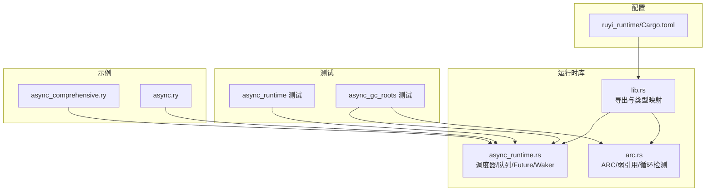
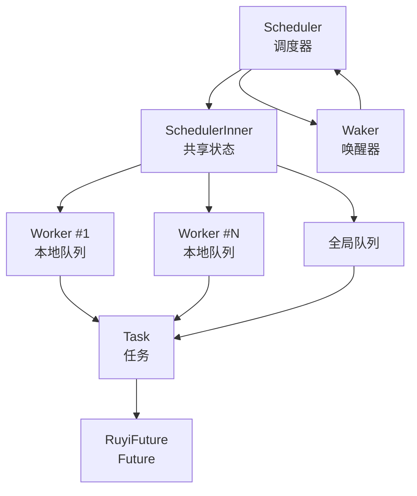
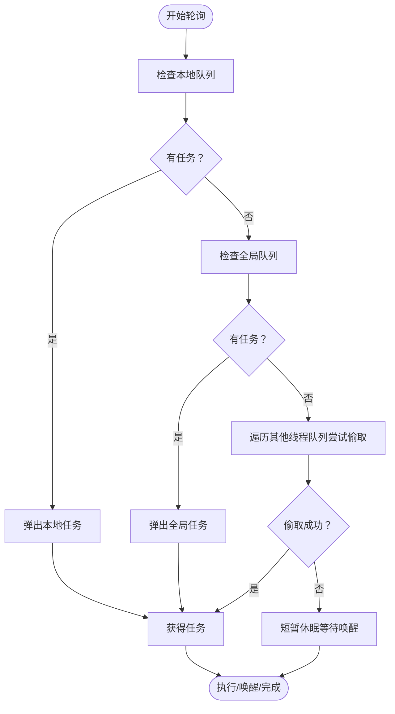
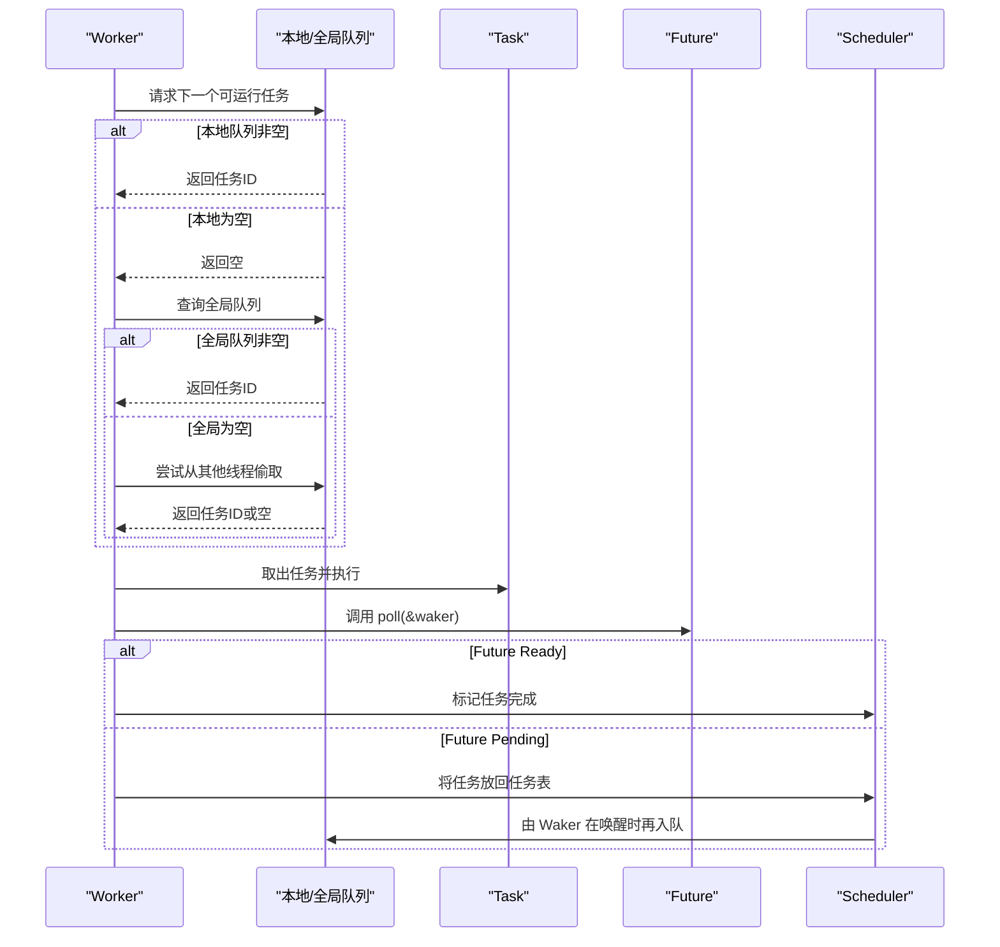
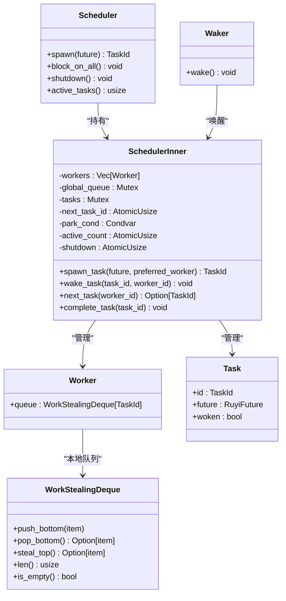
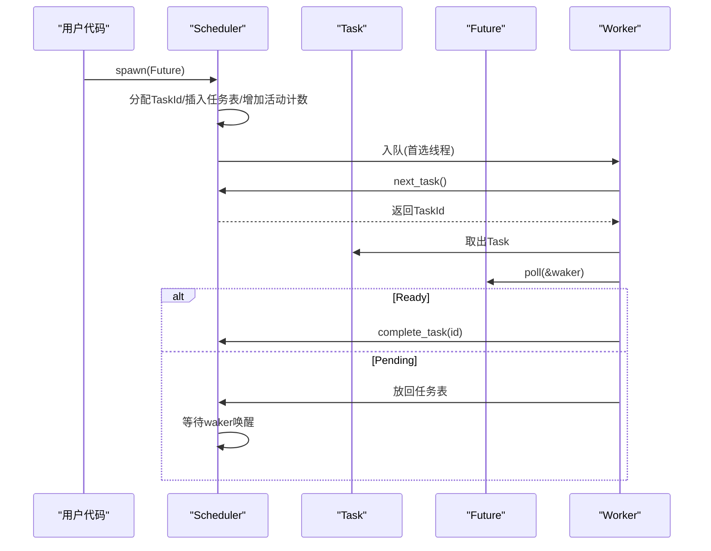
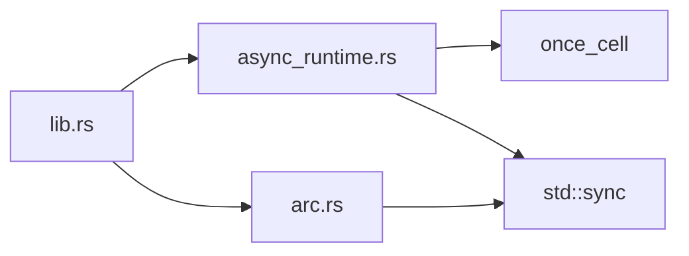

# 并发执行模型

<cite>
**本文引用的文件**
- [lib.rs](file://crates/ruyi_runtime/src/lib.rs)
- [async_runtime.rs](file://crates/ruyi_runtime/src/async_runtime.rs)
- [arc.rs](file://crates/ruyi_runtime/src/arc.rs)
- [async_runtime 测试](file://crates/ruyi_runtime/tests/async_runtime.rs)
- [async_gc_roots 测试](file://crates/ruyi_runtime/tests/async_gc_roots.rs)
- [async 综合示例](file://examples/async_comprehensive.ry)
- [async 示例](file://examples/async.ry)
- [ruyi_runtime Cargo.toml](file://crates/ruyi_runtime/Cargo.toml)
</cite>

## 目录
1. [引言](#引言)
2. [项目结构](#项目结构)
3. [核心组件](#核心组件)
4. [架构总览](#架构总览)
5. [详细组件分析](#详细组件分析)
6. [依赖关系分析](#依赖关系分析)
7. [性能考量](#性能考量)
8. [故障排查指南](#故障排查指南)
9. [结论](#结论)
10. [附录](#附录)

## 引言
本文件系统性解析 Ruyi 的并发执行模型，重点覆盖工作窃取调度器、任务队列与负载均衡、任务调度算法（含优先级与时间片轮转）、并发安全与内存模型、异步任务生命周期、以及与同步执行的性能对比与适用场景。文档同时提供并发模式示例与测试用例路径，帮助读者在理解实现细节的同时掌握最佳实践与调优建议。

## 项目结构
Ruyi 的运行时位于 crates/ruyi_runtime，其中 async_runtime.rs 实现了绿色线程调度器、工作窃取队列、任务与唤醒机制；lib.rs 汇总导出；arc.rs 提供 ARC 内存管理与弱引用支持；测试用例验证调度器行为与 GC 根注册集成；示例展示异步编程概念与用法。

**图表来源**
- [lib.rs:1-50](file://crates/ruyi_runtime/src/lib.rs#L1-L50)
- [async_runtime.rs:1-120](file://crates/ruyi_runtime/src/async_runtime.rs#L1-L120)
- [arc.rs:1-60](file://crates/ruyi_runtime/src/arc.rs#L1-L60)
- [async_runtime 测试:1-30](file://crates/ruyi_runtime/tests/async_runtime.rs#L1-L30)
- [async_gc_roots 测试:1-40](file://crates/ruyi_runtime/tests/async_gc_roots.rs#L1-L40)
- [async 综合示例:1-40](file://examples/async_comprehensive.ry#L1-L40)
- [async 示例:1-20](file://examples/async.ry#L1-L20)
- [ruyi_runtime Cargo.toml:1-17](file://crates/ruyi_runtime/Cargo.toml#L1-L17)

**章节来源**
- [lib.rs:1-50](file://crates/ruyi_runtime/src/lib.rs#L1-L50)
- [async_runtime.rs:1-120](file://crates/ruyi_runtime/src/async_runtime.rs#L1-L120)
- [arc.rs:1-60](file://crates/ruyi_runtime/src/arc.rs#L1-L60)
- [ruyi_runtime Cargo.toml:1-17](file://crates/ruyi_runtime/Cargo.toml#L1-L17)

## 核心组件
- 绿色线程调度器：基于工作窃取的多线程调度器，每个工作线程维护本地双端队列，全局队列与跨线程“偷取”共同实现负载均衡。
- 任务与唤醒：Task 封装 Future，Waker 负责将任务重新入队以被后续轮询。
- Future 抽象：RuyiFuture 定义 poll 行为与唤醒契约，配合 Poll 返回 Ready/Pending。
- 工作窃取双端队列：WorkStealingDeque 支持本地 push/pop 与远程 steal_top，降低锁争用。
- 全局调度器：默认单线程实例，便于非并发场景使用。
- GC 集成：register_async_roots 将挂起中的 Future 根对象纳入 GC 扫描范围，避免误回收。

**章节来源**
- [async_runtime.rs:26-93](file://crates/ruyi_runtime/src/async_runtime.rs#L26-L93)
- [async_runtime.rs:94-136](file://crates/ruyi_runtime/src/async_runtime.rs#L94-L136)
- [async_runtime.rs:138-314](file://crates/ruyi_runtime/src/async_runtime.rs#L138-L314)
- [async_runtime.rs:421-455](file://crates/ruyi_runtime/src/async_runtime.rs#L421-L455)
- [lib.rs:20-44](file://crates/ruyi_runtime/src/lib.rs#L20-L44)

## 架构总览
下图展示了调度器、工作线程、任务与队列之间的交互关系，以及 GC 根注册流程。

**图表来源**
- [async_runtime.rs:138-314](file://crates/ruyi_runtime/src/async_runtime.rs#L138-L314)

## 详细组件分析

### 工作窃取调度器与队列
- 本地队列：每个 Worker 拥有 WorkStealingDeque，用于存放分配到该线程的任务 ID。
- 全局队列：当任务被唤醒或未显式绑定到特定线程时，进入全局队列，降低局部热点。
- 偷取策略：若本地/全局队列为空，尝试从其他线程的队列前端“偷取”，减少空闲与争用。
- 锁粒度：队列内部使用 Mutex 包裹 VecDeque，确保并发安全；通过“本地优先+远程偷取”降低锁竞争。

**图表来源**
- [async_runtime.rs:216-237](file://crates/ruyi_runtime/src/async_runtime.rs#L216-L237)

**章节来源**
- [async_runtime.rs:94-136](file://crates/ruyi_runtime/src/async_runtime.rs#L94-L136)
- [async_runtime.rs:138-249](file://crates/ruyi_runtime/src/async_runtime.rs#L138-L249)

### 任务调度算法与优先级
- 当前实现采用“先到先服务”的公平调度：任务按到达顺序在本地/全局队列中排队，无显式优先级字段。
- 时间片轮转：工作线程在无可用任务时短暂休眠（条件变量超时），避免忙等；未实现固定时间片抢占。
- 唤醒与再入队：Waker 将任务标记为已唤醒并推入全局队列，由后续轮询恢复执行。

**图表来源**
- [async_runtime.rs:216-244](file://crates/ruyi_runtime/src/async_runtime.rs#L216-L244)
- [async_runtime.rs:317-357](file://crates/ruyi_runtime/src/async_runtime.rs#L317-L357)

**章节来源**
- [async_runtime.rs:28-47](file://crates/ruyi_runtime/src/async_runtime.rs#L28-L47)
- [async_runtime.rs:51-67](file://crates/ruyi_runtime/src/async_runtime.rs#L51-L67)
- [async_runtime.rs:186-214](file://crates/ruyi_runtime/src/async_runtime.rs#L186-L214)

### 并发安全与内存模型
- 原子操作：任务 ID 分配、活动计数、关闭标志使用 SeqCst 语义，确保跨线程可见性与有序性。
- 互斥保护：任务表、全局队列、任务状态使用 Mutex 保护；本地队列也以 Mutex 包裹 VecDeque。
- 条件变量：park_cond 用于工作线程在无任务时休眠与被唤醒。
- 线程局部状态：thread_local 标记当前线程是否为工作线程，影响 ruyi_await 的行为。
- GC 集成：register_async_roots 遍历所有挂起任务，扫描其内存布局，将可能指向堆的指针加入 GC 根集合。

**图表来源**
- [async_runtime.rs:138-314](file://crates/ruyi_runtime/src/async_runtime.rs#L138-L314)

**章节来源**
- [async_runtime.rs:12-25](file://crates/ruyi_runtime/src/async_runtime.rs#L12-L25)
- [async_runtime.rs:140-156](file://crates/ruyi_runtime/src/async_runtime.rs#L140-L156)
- [async_runtime.rs:426-455](file://crates/ruyi_runtime/src/async_runtime.rs#L426-L455)

### 异步任务的创建与销毁
- 创建：spawn 接受实现了 RuyiFuture 的对象，生成唯一 TaskId，插入任务表，增加活动计数，并将任务放入首选工作线程的本地队列。
- 唤醒：Waker::wake 将任务标记为已唤醒并入全局队列，通知至少一个工作线程。
- 执行：工作线程取出任务，调用 future.poll；若 Ready 则完成并减少活动计数；若 Pending 则放回任务表等待再次唤醒。
- 销毁：complete_task 移除任务并通知等待者；GC 集成确保挂起任务不会被回收。

**图表来源**
- [async_runtime.rs:186-244](file://crates/ruyi_runtime/src/async_runtime.rs#L186-L244)
- [async_runtime.rs:317-357](file://crates/ruyi_runtime/src/async_runtime.rs#L317-L357)

**章节来源**
- [async_runtime.rs:186-244](file://crates/ruyi_runtime/src/async_runtime.rs#L186-L244)
- [async_runtime.rs:317-357](file://crates/ruyi_runtime/src/async_runtime.rs#L317-L357)

### 并发与同步执行的对比与场景选择
- 并发执行（工作窃取）适合 I/O 密集、大量等待与协作场景，能提升吞吐与响应性。
- 同步执行（单线程全局调度器）适合确定性、低开销与简单控制流，避免锁与上下文切换成本。
- 场景选择建议：
  - I/O 并发、网络请求、文件读写：优先并发调度器。
  - CPU 密集计算且任务规模小：可考虑同步或少量线程。
  - 需要与现有阻塞接口共存：使用 ruyi_await 将外部阻塞包装为 Future 并让出控制权。

**章节来源**
- [async_runtime.rs:387-400](file://crates/ruyi_runtime/src/async_runtime.rs#L387-L400)
- [async_runtime.rs:421-425](file://crates/ruyi_runtime/src/async_runtime.rs#L421-L425)

### 并发模式示例
- JoinAll：并行等待多个 Future 完成，收集结果。
- Race：返回首个完成的 Future 结果。
- Yielding Future：首次 poll 返回 Pending 并通过 Waker 唤醒自身，演示唤醒机制。

**章节来源**
- [async_runtime.rs:458-540](file://crates/ruyi_runtime/src/async_runtime.rs#L458-L540)
- [async_runtime 测试:68-100](file://crates/ruyi_runtime/tests/async_runtime.rs#L68-L100)

## 依赖关系分析
- 运行时导出：lib.rs 将调度器、Future 类型、GC 集成等统一导出，便于上层使用。
- 外部依赖：once_cell 提供 Lazy 初始化；std 同步原语（Mutex、Condvar、AtomicUsize）构成并发基础。
- 特性开关：Cargo.toml 中 inkwell 默认启用，不影响并发模型，但与运行时类型映射相关。

**图表来源**
- [lib.rs:11-44](file://crates/ruyi_runtime/src/lib.rs#L11-L44)
- [async_runtime.rs:12-16](file://crates/ruyi_runtime/src/async_runtime.rs#L12-L16)
- [arc.rs:16-26](file://crates/ruyi_runtime/src/arc.rs#L16-L26)
- [ruyi_runtime Cargo.toml:11-17](file://crates/ruyi_runtime/Cargo.toml#L11-L17)

**章节来源**
- [lib.rs:11-44](file://crates/ruyi_runtime/src/lib.rs#L11-L44)
- [ruyi_runtime Cargo.toml:11-17](file://crates/ruyi_runtime/Cargo.toml#L11-L17)

## 性能考量
- 队列与锁：本地队列使用 Mutex<VecDeque>，在高并发下可能产生锁争用；可通过增加工作线程数缓解，但需平衡上下文切换成本。
- 偷取成本：跨线程队列访问存在额外开销；建议将热路径任务尽量分配到首选线程，减少远程访问。
- 唤醒频率：频繁 Pending/Wake 会增加全局队列入队/出队次数；可合并唤醒或引入更细粒度的事件源。
- GC 集成：register_async_roots 遍历任务并扫描内存块，对长时间挂起的大量任务带来扫描成本；建议在 GC 前后合理安排任务生命周期。
- 单线程全局调度器：默认实例仅有一个工作线程，适合非并发场景，避免锁与线程切换开销。

**章节来源**
- [async_runtime.rs:140-156](file://crates/ruyi_runtime/src/async_runtime.rs#L140-L156)
- [async_runtime.rs:426-455](file://crates/ruyi_runtime/src/async_runtime.rs#L426-L455)
- [async_runtime.rs:421-425](file://crates/ruyi_runtime/src/async_runtime.rs#L421-L425)

## 故障排查指南
- 任务不执行：检查是否正确调用 spawn，确认任务已入队；查看 active_tasks 是否递减。
- 唤醒无效：确认 Waker::wake 被调用且任务被推入全局队列；检查 worker 循环是否在 park_cond 上等待。
- 死锁/卡住：核对任务表与队列状态，确保完成路径会减少 active_count 并 notify_all。
- GC 回收问题：确保在 GC 前调用 register_async_roots，使挂起任务成为根可达。
- 线程状态：非工作线程调用 ruyi_await 会被调度器接管，注意避免在非期望线程中阻塞。

**章节来源**
- [async_runtime 测试:33-100](file://crates/ruyi_runtime/tests/async_runtime.rs#L33-L100)
- [async_gc_roots 测试:31-90](file://crates/ruyi_runtime/tests/async_gc_roots.rs#L31-L90)
- [async_runtime.rs:387-400](file://crates/ruyi_runtime/src/async_runtime.rs#L387-L400)

## 结论
Ruyi 的并发执行模型以工作窃取调度器为核心，结合本地/全局队列与远程偷取策略，在保证公平性的前提下降低锁争用与空闲概率。通过 Waker 与 Future 的解耦设计，实现了清晰的异步控制流与 GC 集成。针对不同场景，可选择并发或多线程策略，并通过合理的任务划分与唤醒策略进一步优化性能。

## 附录
- 示例参考：
  - 异步综合示例：[async_comprehensive.ry:1-141](file://examples/async_comprehensive.ry#L1-L141)
  - 异步示例：[async.ry:1-28](file://examples/async.ry#L1-L28)
- 测试参考：
  - 调度器与组合器测试：[async_runtime 测试:1-156](file://crates/ruyi_runtime/tests/async_runtime.rs#L1-L156)
  - GC 根注册测试：[async_gc_roots 测试:1-91](file://crates/ruyi_runtime/tests/async_gc_roots.rs#L1-L91)
- 运行时导出与类型映射：
  - [lib.rs:11-44](file://crates/ruyi_runtime/src/lib.rs#L11-L44)
- 并发模型实现：
  - [async_runtime.rs:1-655](file://crates/ruyi_runtime/src/async_runtime.rs#L1-L655)
- ARC 与弱引用：
  - [arc.rs:1-565](file://crates/ruyi_runtime/src/arc.rs#L1-L565)