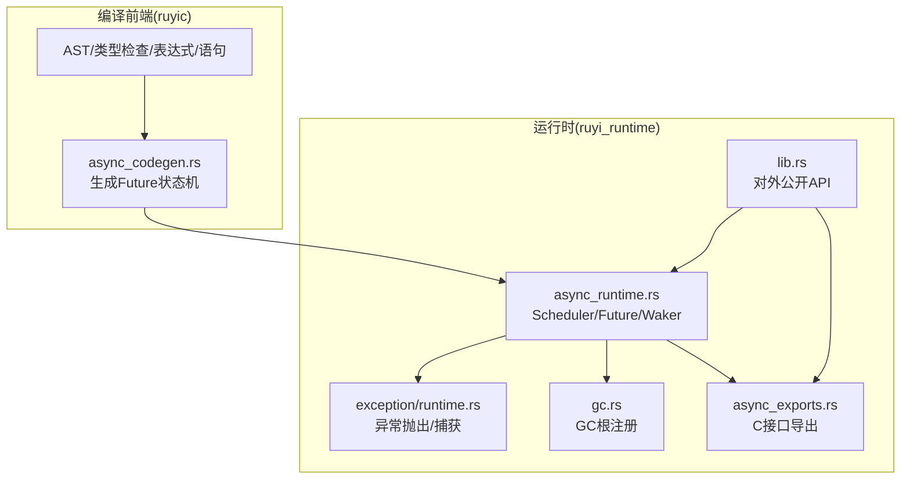
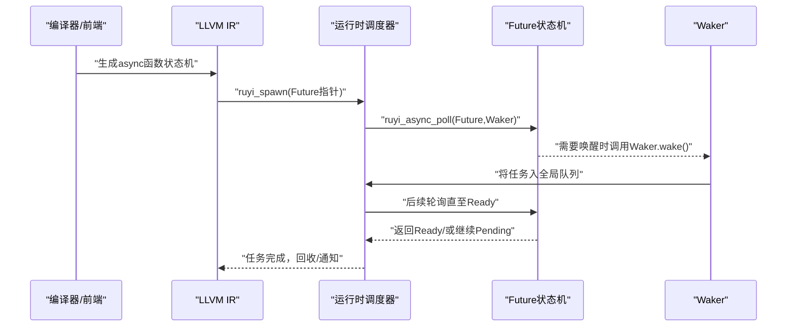
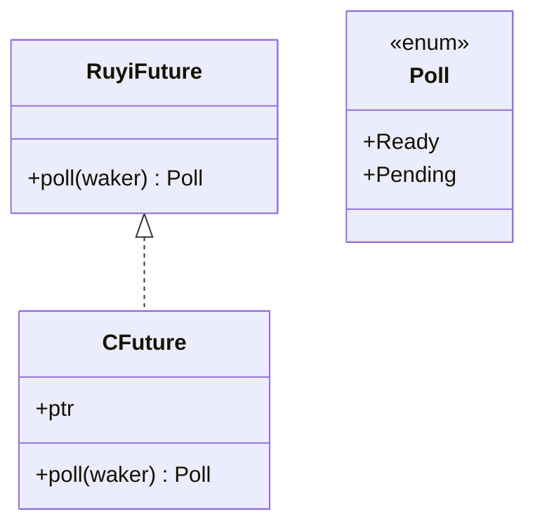
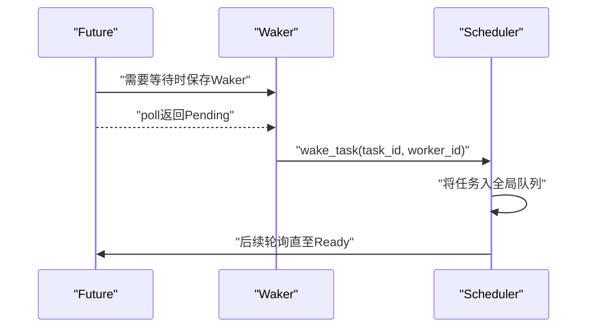
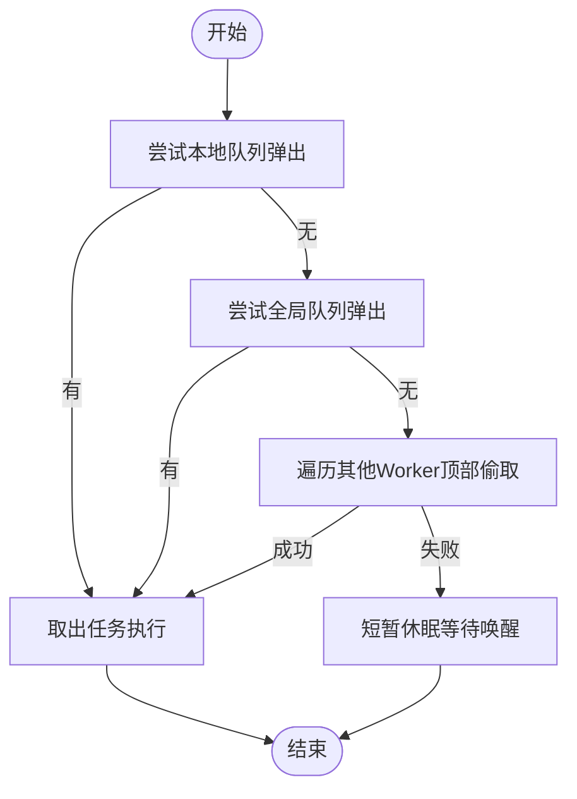
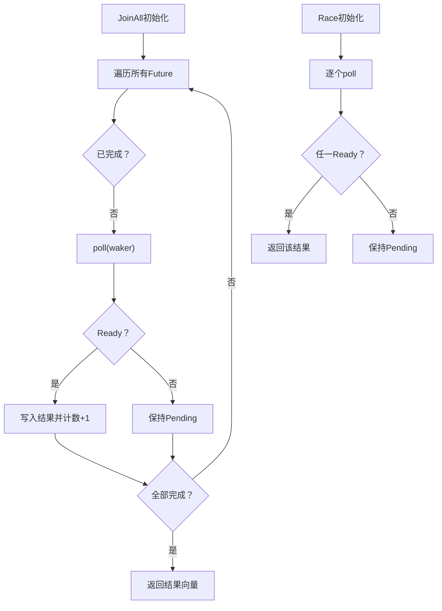
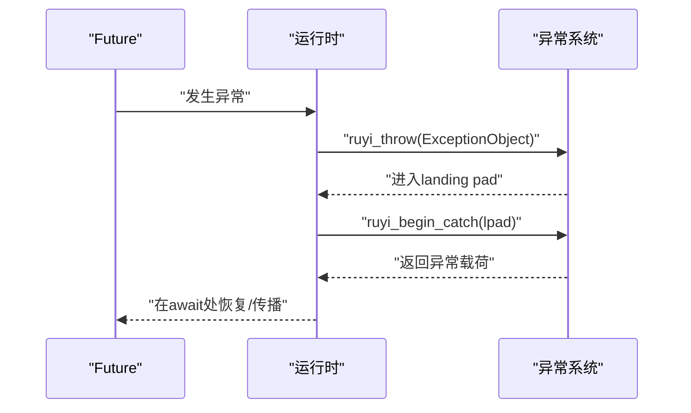
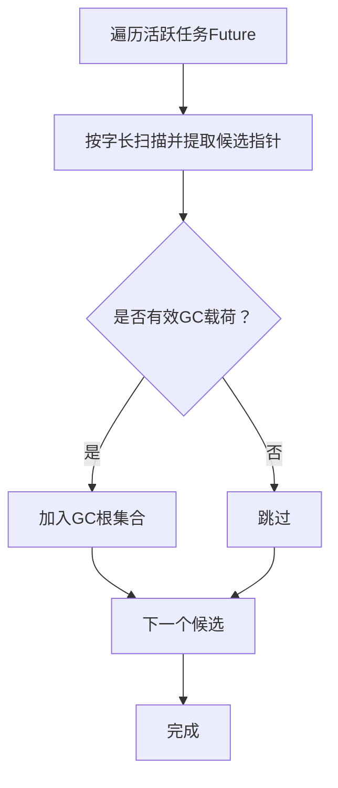
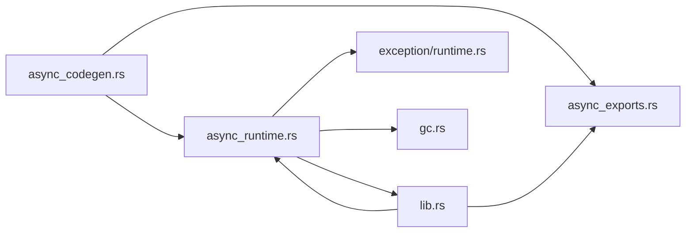

# 异步编程

<cite>
**本文引用的文件**   
- [async_runtime.rs](file://crates/ruyi_runtime/src/async_runtime.rs)
- [async_exports.rs](file://crates/ruyi_runtime/src/async_exports.rs)
- [lib.rs](file://crates/ruyi_runtime/src/lib.rs)
- [async_codegen.rs](file://crates/ruyic/src/codegen/async_codegen.rs)
- [async.ry](file://examples/async.ry)
- [async_comprehensive.ry](file://examples/async_comprehensive.ry)
- [async_basic.ry](file://crates/ruyic/tests/integration/cases/async/async_basic.ry)
- [await.ry](file://crates/ruyic/tests/integration/cases/async/await.ry)
- [promise_all.ry](file://crates/ruyic/tests/integration/cases/async/promise_all.ry)
- [spawn_task.ry](file://crates/ruyic/tests/integration/cases/async/spawn_task.ry)
- [runtime.rs](file://crates/ruyi_runtime/src/exception/runtime.rs)
- [gc.rs](file://crates/ruyi_runtime/src/gc.rs)
</cite>

## 目录
1. [简介](#简介)
2. [项目结构](#项目结构)
3. [核心组件](#核心组件)
4. [架构总览](#架构总览)
5. [详细组件分析](#详细组件分析)
6. [依赖关系分析](#依赖关系分析)
7. [性能考量](#性能考量)
8. [故障排查指南](#故障排查指南)
9. [结论](#结论)
10. [附录](#附录)

## 简介
本文件系统性梳理 Ruyi 的异步编程模型，覆盖以下主题：
- async/await 语法与语义：异步函数定义、await 表达式求值、状态机生成与调度协同
- Promise 实现与生命周期：Future 抽象、Poll 状态、Waker 唤醒、任务生命周期与完成回调
- 并发执行模型：基于工作窃取的多线程调度、任务队列与负载均衡
- 异步组合原语：JoinAll、Race 等并发组合器
- 异步流与异步迭代：当前仓库未直接提供，但可基于 Future/Waker 模型扩展
- 异步错误处理：异常捕获、传播与恢复（含 finally 语义）
- 性能对比与适用场景：异步与同步在吞吐、延迟与资源占用上的权衡
- 最佳实践：避免阻塞、合理并发、内存与根集管理

## 项目结构
Ruyi 异步子系统由“编译前端 + 运行时后端”两部分组成：
- 编译前端（ruyic）负责将 async/await 语法编译为 LLVM IR，并生成 Future 状态机
- 运行时（ruyi_runtime）提供调度器、Future 抽象、Waker、C 接口导出以及与 GC/异常系统的集成

图表来源
- [async_codegen.rs:206-504](file://crates/ruyic/src/codegen/async_codegen.rs#L206-L504)
- [async_runtime.rs:26-314](file://crates/ruyi_runtime/src/async_runtime.rs#L26-L314)
- [async_exports.rs:43-91](file://crates/ruyi_runtime/src/async_exports.rs#L43-L91)
- [lib.rs:20-49](file://crates/ruyi_runtime/src/lib.rs#L20-L49)
- [runtime.rs:24-96](file://crates/ruyi_runtime/src/exception/runtime.rs#L24-L96)
- [gc.rs:15-198](file://crates/ruyi_runtime/src/gc.rs#L15-L198)

章节来源
- [async_codegen.rs:1-562](file://crates/ruyic/src/codegen/async_codegen.rs#L1-L562)
- [async_runtime.rs:1-655](file://crates/ruyi_runtime/src/async_runtime.rs#L1-L655)
- [async_exports.rs:1-92](file://crates/ruyi_runtime/src/async_exports.rs#L1-L92)
- [lib.rs:1-259](file://crates/ruyi_runtime/src/lib.rs#L1-L259)
- [gc.rs:1-377](file://crates/ruyi_runtime/src/gc.rs#L1-L377)
- [runtime.rs:1-359](file://crates/ruyi_runtime/src/exception/runtime.rs#L1-L359)

## 核心组件
- Future/Poll 抽象：RuyiFuture trait 定义了 poll 方法，返回 Poll<T>，表示 Ready 或 Pending
- Waker：携带唤醒目标（TaskId）、所属 Worker 的引用，用于将任务重新入队
- Task：封装 Box<dyn RuyiFuture> 的可运行单元，记录是否被唤醒
- 调度器：多线程工作窃取调度器，维护本地队列、全局队列与活跃任务计数
- 组合器：JoinAll 并发等待多个 Future 完成；Race 返回首个完成的 Future 结果
- C 导出：ruyi_async_poll、ruyi_spawn、ruyi_wake_task、ruyi_run_scheduler 等
- GC 集成：注册异步任务中的根指针，防止被 GC 回收

章节来源
- [async_runtime.rs:28-47](file://crates/ruyi_runtime/src/async_runtime.rs#L28-L47)
- [async_runtime.rs:51-67](file://crates/ruyi_runtime/src/async_runtime.rs#L51-L67)
- [async_runtime.rs:75-92](file://crates/ruyi_runtime/src/async_runtime.rs#L75-L92)
- [async_runtime.rs:140-249](file://crates/ruyi_runtime/src/async_runtime.rs#L140-L249)
- [async_runtime.rs:458-540](file://crates/ruyi_runtime/src/async_runtime.rs#L458-L540)
- [async_exports.rs:43-91](file://crates/ruyi_runtime/src/async_exports.rs#L43-L91)
- [lib.rs:20-23](file://crates/ruyi_runtime/src/lib.rs#L20-L23)

## 架构总览
Ruyi 的异步执行路径如下：
- 编译期：将 async 函数编译为状态机（包含构造器、poll 函数与包装器），await 表达式在 poll 中驱动内部 Future
- 运行期：通过 ruyi_async_poll 驱动 Future，当 Future 返回 Pending 且需要唤醒时，调用 Waker 将任务加入全局队列；调度器从本地/全局/其他 Worker 偷取任务执行；完成后清理并通知等待线程

图表来源
- [async_codegen.rs:206-504](file://crates/ruyic/src/codegen/async_codegen.rs#L206-L504)
- [async_runtime.rs:387-400](file://crates/ruyi_runtime/src/async_runtime.rs#L387-L400)
- [async_exports.rs:52-91](file://crates/ruyi_runtime/src/async_exports.rs#L52-L91)

## 详细组件分析

### Future 与 Poll 状态机
- RuyiFuture 定义了 poll(Waker) -> Poll<T> 的最小协议
- 编译器为每个 async 函数生成三段实体：构造器、poll 函数、包装器；poll 函数内维护状态字段并在 Ready 时设置完成态
- await 在 poll 内部调用 ruyi_async_poll，并从状态结构中读取结果

图表来源
- [async_runtime.rs:28-47](file://crates/ruyi_runtime/src/async_runtime.rs#L28-L47)
- [async_runtime.rs:384-382](file://crates/ruyi_runtime/src/async_runtime.rs#L384-L382)
- [async_codegen.rs:206-504](file://crates/ruyic/src/codegen/async_codegen.rs#L206-L504)

章节来源
- [async_runtime.rs:28-47](file://crates/ruyi_runtime/src/async_runtime.rs#L28-L47)
- [async_runtime.rs:384-382](file://crates/ruyi_runtime/src/async_runtime.rs#L384-L382)
- [async_codegen.rs:206-504](file://crates/ruyic/src/codegen/async_codegen.rs#L206-L504)

### Waker 与任务唤醒
- Waker 包含调度器共享引用、所属 Worker 索引与任务 ID
- 当 Future 在 poll 中无法继续时，必须确保在合适时机调用 Waker.wake()
- 调度器收到唤醒请求后，将任务放入全局队列，等待后续轮询

图表来源
- [async_runtime.rs:51-67](file://crates/ruyi_runtime/src/async_runtime.rs#L51-L67)
- [async_runtime.rs:206-214](file://crates/ruyi_runtime/src/async_runtime.rs#L206-L214)

章节来源
- [async_runtime.rs:51-67](file://crates/ruyi_runtime/src/async_runtime.rs#L51-L67)
- [async_runtime.rs:206-214](file://crates/ruyi_runtime/src/async_runtime.rs#L206-L214)

### 调度器与工作窃取
- 每个 Worker 维护一个本地双端队列；调度器还维护全局队列
- next_task 优先本地弹出，再尝试全局队列，最后从其他 Worker 偷取
- 工作线程空闲时短暂休眠并等待条件变量唤醒

图表来源
- [async_runtime.rs:216-237](file://crates/ruyi_runtime/src/async_runtime.rs#L216-L237)
- [async_runtime.rs:316-357](file://crates/ruyi_runtime/src/async_runtime.rs#L316-L357)

章节来源
- [async_runtime.rs:140-249](file://crates/ruyi_runtime/src/async_runtime.rs#L140-L249)
- [async_runtime.rs:316-357](file://crates/ruyi_runtime/src/async_runtime.rs#L316-L357)

### 并发组合器：JoinAll 与 Race
- JoinAll：并发等待一组 Future，全部完成后收集结果
- Race：返回第一个完成的 Future 的结果

图表来源
- [async_runtime.rs:458-509](file://crates/ruyi_runtime/src/async_runtime.rs#L458-L509)
- [async_runtime.rs:511-540](file://crates/ruyi_runtime/src/async_runtime.rs#L511-L540)

章节来源
- [async_runtime.rs:458-540](file://crates/ruyi_runtime/src/async_runtime.rs#L458-L540)

### 异步错误处理与恢复
- 异常对象通过运行时抛出，遵循 Itanium C++ ABI 规范
- ruyi_begin_catch/__cxa_begin_catch 用于捕获异常并返回 Ruyi 异常载荷
- finally 语义通过 ruyi_finally 传递 pending_exception，保证 finally 块执行
- 异步异常可被捕获并由 await 表达式在状态机中恢复

图表来源
- [runtime.rs:24-96](file://crates/ruyi_runtime/src/exception/runtime.rs#L24-L96)
- [async_codegen.rs:506-561](file://crates/ruyic/src/codegen/async_codegen.rs#L506-L561)

章节来源
- [runtime.rs:24-96](file://crates/ruyi_runtime/src/exception/runtime.rs#L24-L96)
- [async_codegen.rs:506-561](file://crates/ruyic/src/codegen/async_codegen.rs#L506-L561)

### 与 GC 的集成
- 注册异步任务为 GC 根：扫描当前活跃 Future 的内存布局，提取可能指向堆对象的指针并加入根集合
- 在 GC 前调用 register_async_roots，确保挂起的异步上下文可达

图表来源
- [async_runtime.rs:426-455](file://crates/ruyi_runtime/src/async_runtime.rs#L426-L455)
- [gc.rs:58-88](file://crates/ruyi_runtime/src/gc.rs#L58-L88)

章节来源
- [async_runtime.rs:426-455](file://crates/ruyi_runtime/src/async_runtime.rs#L426-L455)
- [gc.rs:58-88](file://crates/ruyi_runtime/src/gc.rs#L58-L88)

### 语法与使用示例
- 示例：async 函数定义、await 表达式顺序求值、并发组合（数组收集 Future 结果）
- 测试用例：基本 async 函数、await 串联、spawn + 调度器运行、JoinAll 风格的并发聚合

章节来源
- [async.ry:1-28](file://examples/async.ry#L1-L28)
- [async_comprehensive.ry:1-141](file://examples/async_comprehensive.ry#L1-L141)
- [async_basic.ry:1-10](file://crates/ruyic/tests/integration/cases/async/async_basic.ry#L1-L10)
- [await.ry:1-12](file://crates/ruyic/tests/integration/cases/async/await.ry#L1-L12)
- [promise_all.ry:1-13](file://crates/ruyic/tests/integration/cases/async/promise_all.ry#L1-L13)
- [spawn_task.ry:1-9](file://crates/ruyic/tests/integration/cases/async/spawn_task.ry#L1-L9)

## 依赖关系分析
- 编译前端依赖运行时导出的 C 接口（ruyi_async_poll、ruyi_spawn 等）
- 运行时通过 lib.rs 对外暴露 Future、Scheduler、Waker、GC 集成等 API
- 异常系统与运行时耦合，用于异常传播与 finally 语义

图表来源
- [async_codegen.rs:506-561](file://crates/ruyic/src/codegen/async_codegen.rs#L506-L561)
- [async_exports.rs:43-91](file://crates/ruyi_runtime/src/async_exports.rs#L43-L91)
- [lib.rs:20-23](file://crates/ruyi_runtime/src/lib.rs#L20-L23)

章节来源
- [async_codegen.rs:506-561](file://crates/ruyic/src/codegen/async_codegen.rs#L506-L561)
- [async_exports.rs:43-91](file://crates/ruyi_runtime/src/async_exports.rs#L43-L91)
- [lib.rs:20-23](file://crates/ruyi_runtime/src/lib.rs#L20-L23)

## 性能考量
- 工作窃取减少锁竞争，提高多核利用率；全局队列与本地队列配合降低热点
- JoinAll/Race 提供高阶并发组合，适合批量任务聚合与竞速场景
- GC 根扫描仅在活跃任务上进行，避免全堆扫描开销
- 异步错误路径通过 landing pad 与异常表匹配，尽量减少正常路径的分支成本

## 故障排查指南
- 任务永不完成：检查 Future 是否正确调用 Waker.wake()；确认调度器未被提前关闭
- 唤醒无效：确认 Waker 持有的 TaskId 与任务一致；检查全局队列入队逻辑
- 异常未被捕获：确认 landing pad 与 catch 类型匹配；finally 中的异常透传逻辑
- GC 回收导致悬挂：确保在 GC 前调用 register_async_roots；检查根集是否包含 Future 内部指针

章节来源
- [async_runtime.rs:206-214](file://crates/ruyi_runtime/src/async_runtime.rs#L206-L214)
- [runtime.rs:98-113](file://crates/ruyi_runtime/src/exception/runtime.rs#L98-L113)
- [gc.rs:117-191](file://crates/ruyi_runtime/src/gc.rs#L117-L191)

## 结论
Ruyi 的异步模型以 Future/Poll 为核心，结合工作窃取调度器与 C 接口导出，实现了可扩展的异步执行环境。编译前端将 async/await 映射为状态机，运行时提供完善的唤醒、并发组合与 GC/异常集成。尽管当前仓库未直接提供异步流/异步迭代器，但基于现有 Future/Waker 抽象可自然扩展。

## 附录
- 术语
  - Future：惰性计算单元，支持 poll
  - Poll：表示 Future 的就绪状态（Ready/Pending）
  - Waker：用于唤醒 Future 所属任务的句柄
  - JoinAll：并发等待多个 Future 完成
  - Race：返回首个完成的 Future 的结果
- 最佳实践
  - 避免在 Future 中执行阻塞 I/O；使用 Waker 唤醒机制
  - 合理使用 JoinAll/Race 组合并发任务
  - 在 GC 前主动注册异步根，防止误回收
  - 使用异常表与 catch 类型精确捕获，避免宽泛捕获影响性能