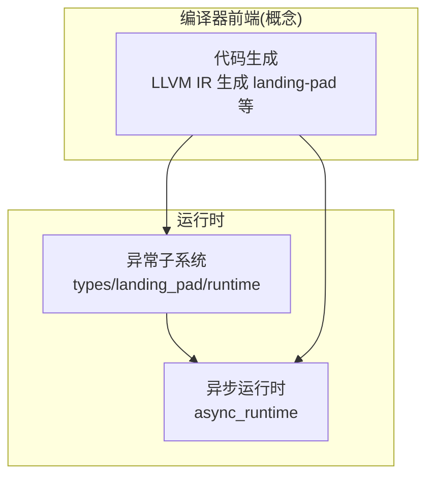
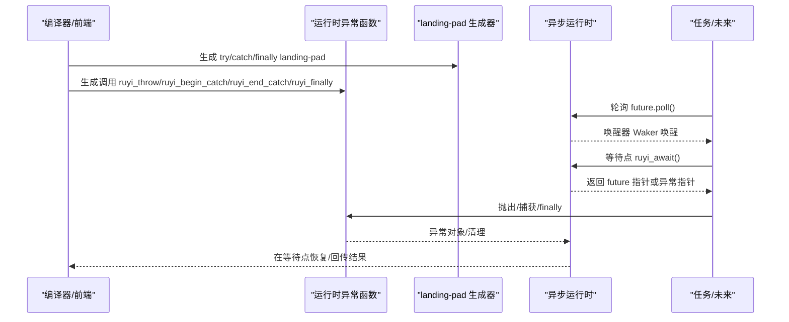
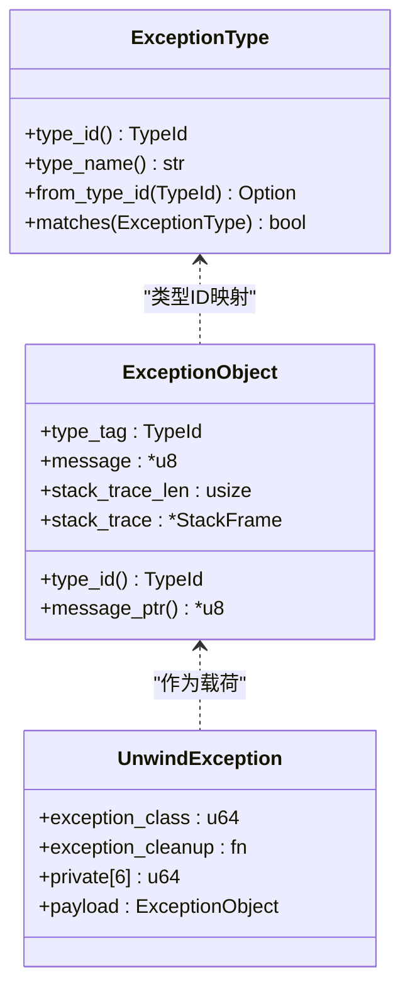
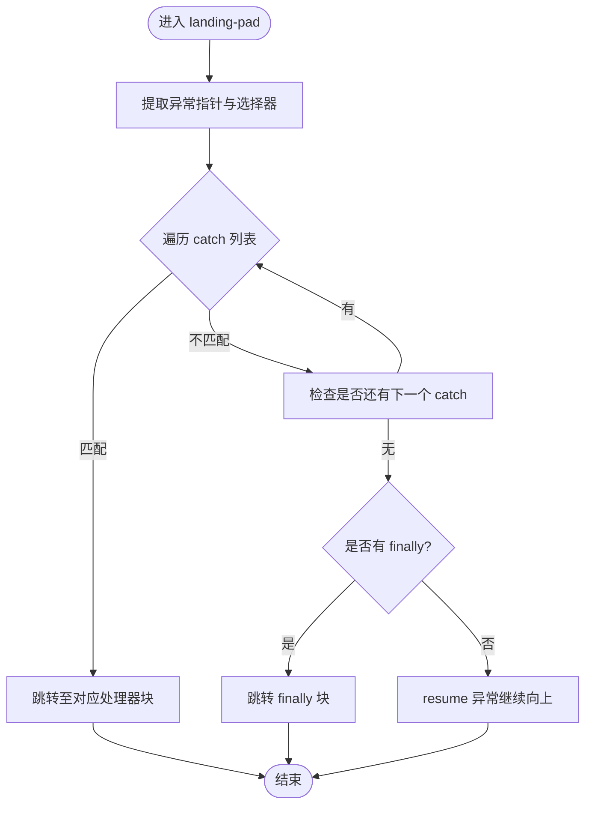
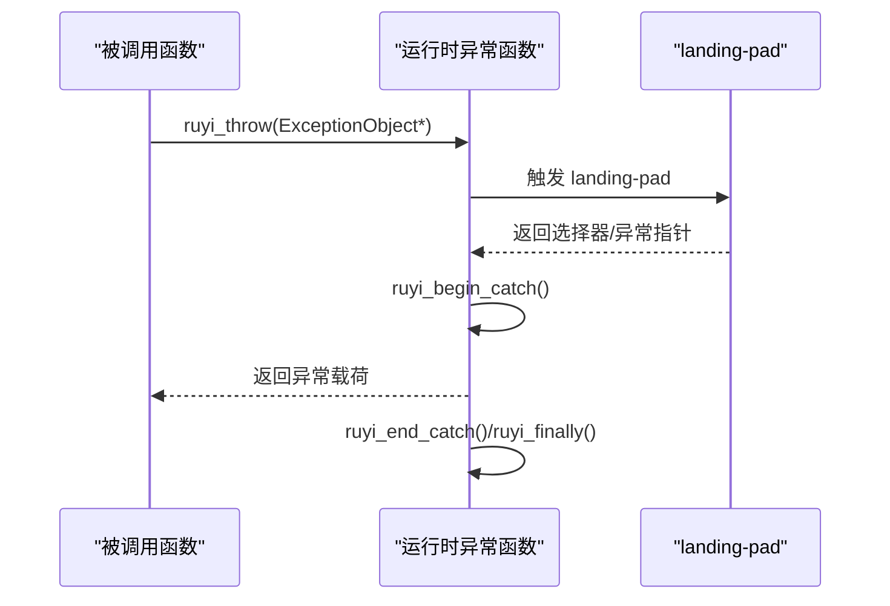
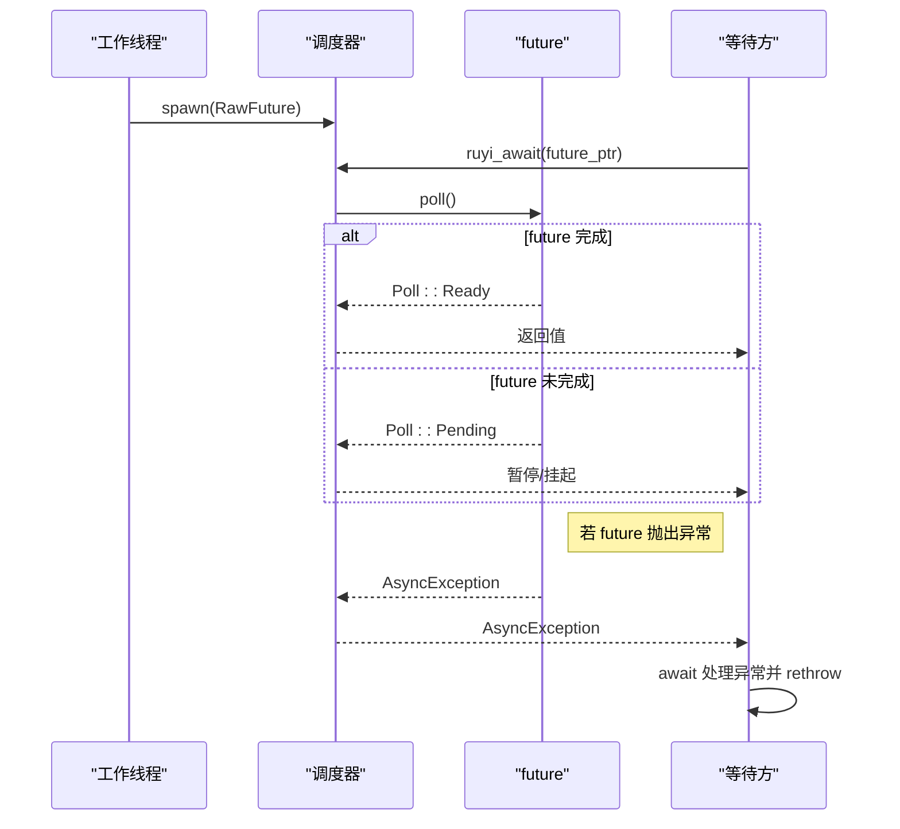
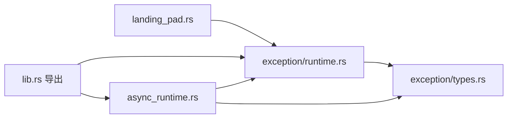

# 异步错误处理

<cite>
**本文引用的文件**
- [crates/ruyi_runtime/src/exception.rs](file://crates/ruyi_runtime/src/exception.rs)
- [crates/ruyi_runtime/src/exception/runtime.rs](file://crates/ruyi_runtime/src/exception/runtime.rs)
- [crates/ruyi_runtime/src/exception/types.rs](file://crates/ruyi_runtime/src/exception/types.rs)
- [crates/ruyi_runtime/src/exception/landing_pad.rs](file://crates/ruyi_runtime/src/exception/landing_pad.rs)
- [crates/ruyi_runtime/src/async_runtime.rs](file://crates/ruyi_runtime/src/async_runtime.rs)
- [crates/ruyi_runtime/src/lib.rs](file://crates/ruyi_runtime/src/lib.rs)
- [crates/ruyi_runtime/tests/exception.rs](file://crates/ruyi_runtime/tests/exception.rs)
- [crates/ruyi_runtime/tests/async_runtime.rs](file://crates/ruyi_runtime/tests/async_runtime.rs)
- [examples/error_handling.ry](file://examples/error_handling.ry)
- [examples/try_catch.ry](file://examples/try_catch.ry)
- [crates/ruyic/tests/integration/cases/async/await.ry](file://crates/ruyic/tests/integration/cases/async/await.ry)
- [crates/ruyic/tests/integration/cases/async/await_expression.ry](file://crates/ruyic/tests/integration/cases/async/await_expression.ry)
- [crates/ruyic/tests/integration/cases/async/promise_all.ry](file://crates/ruyic/tests/integration/cases/async/promise_all.ry)
- [crates/ruyic/tests/integration/cases/async/spawn_task.ry](file://crates/ruyic/tests/integration/cases/async/spawn_task.ry)
</cite>

## 目录
1. [引言](#引言)
2. [项目结构](#项目结构)
3. [核心组件](#核心组件)
4. [架构总览](#架构总览)
5. [详细组件分析](#详细组件分析)
6. [依赖关系分析](#依赖关系分析)
7. [性能考量](#性能考量)
8. [故障排查指南](#故障排查指南)
9. [结论](#结论)
10. [附录](#附录)

## 引言
本文件系统性阐述 Ruyi 异步错误处理机制，聚焦以下目标：
- 解释异步异常的传播机制（异常冒泡与捕获策略）
- 说明在异步上下文中 try-catch 的使用方式与限制
- 对比异步错误与同步错误的处理差异与注意事项
- 提供异步错误的诊断与调试技术（堆栈追踪、错误信息提取）
- 讨论异步错误对程序稳定性的潜在影响与恢复策略
- 总结最佳实践（错误分类与处理模式），并给出示例与排障建议

## 项目结构
Ruyi 将“异常处理”与“异步运行时”分层设计：异常处理由运行时模块提供基础设施（类型、表、落地垫、抛出/捕获/finally 运行时函数），异步运行时负责任务调度、唤醒与异常在等待点的传递。

图中展示了异常与异步运行时的协作关系：编译器生成 try/catch/finally 的 landing-pad 指令，运行时通过抛出/捕获/finally 函数完成异常对象的搬运与清理；异步运行时在等待点捕获异常并以“异步异常”形式回传给等待方，避免直接栈展开。

章节来源
- [crates/ruyi_runtime/src/lib.rs:1-50](file://crates/ruyi_runtime/src/lib.rs#L1-L50)

## 核心组件
- 异常类型与对象布局：定义内置异常类型、异常对象结构、Itanium ABI 头部等，支撑跨语言/跨边界的一致性。
- landing-pad 生成器：为编译器生成 landing-pad、invoke、resume、类型选择等 IR。
- 运行时异常函数：抛出、开始/结束捕获、finally 保护、匹配异常类型、捕获堆栈等。
- 异步运行时：工作窃取调度器、任务队列、唤醒器、GC 集成；在等待点捕获异常并以“异步异常”形式回传。

章节来源
- [crates/ruyi_runtime/src/exception/types.rs:1-167](file://crates/ruyi_runtime/src/exception/types.rs#L1-L167)
- [crates/ruyi_runtime/src/exception/landing_pad.rs:1-222](file://crates/ruyi_runtime/src/exception/landing_pad.rs#L1-L222)
- [crates/ruyi_runtime/src/exception/runtime.rs:1-359](file://crates/ruyi_runtime/src/exception/runtime.rs#L1-L359)
- [crates/ruyi_runtime/src/async_runtime.rs:1-655](file://crates/ruyi_runtime/src/async_runtime.rs#L1-L655)

## 架构总览
下图展示从“编译期生成”到“运行时执行”的关键路径，以及异常在同步与异步场景下的流转。

图示来源
- [crates/ruyi_runtime/src/exception/landing_pad.rs:39-190](file://crates/ruyi_runtime/src/exception/landing_pad.rs#L39-L190)
- [crates/ruyi_runtime/src/exception/runtime.rs:24-96](file://crates/ruyi_runtime/src/exception/runtime.rs#L24-L96)
- [crates/ruyi_runtime/src/async_runtime.rs:387-420](file://crates/ruyi_runtime/src/async_runtime.rs#L387-L420)

## 详细组件分析

### 组件A：异常类型与对象布局
- 内置异常类型：Error、TypeError、RangeError、RuntimeError，映射到运行时常量类型 ID。
- 异常对象布局：包含类型标签、消息指针、堆栈帧数量与数组指针，遵循 Itanium ABI 头部。
- 匹配规则：Error 可匹配所有内置类型；否则仅精确匹配。

图示来源
- [crates/ruyi_runtime/src/exception/types.rs:8-62](file://crates/ruyi_runtime/src/exception/types.rs#L8-L62)
- [crates/ruyi_runtime/src/exception/types.rs:64-111](file://crates/ruyi_runtime/src/exception/types.rs#L64-L111)

章节来源
- [crates/ruyi_runtime/src/exception/types.rs:1-167](file://crates/ruyi_runtime/src/exception/types.rs#L1-L167)

### 组件B：landing-pad 生成与匹配
- landing-pad 生成器：构建 landing-pad、invoke、resume、extract、类型选择等指令。
- catch 分派：比较 landing-pad 选择器与 llvm.eh.typeid.for 结果，按顺序匹配 catch 子句。
- finally 保护：当存在 cleanup 时，确保 finally 块总是执行。

图示来源
- [crates/ruyi_runtime/src/exception/landing_pad.rs:136-190](file://crates/ruyi_runtime/src/exception/landing_pad.rs#L136-L190)

章节来源
- [crates/ruyi_runtime/src/exception/landing_pad.rs:1-222](file://crates/ruyi_runtime/src/exception/landing_pad.rs#L1-L222)

### 组件C：运行时异常函数
- 抛出：分配 Itanium ABI 异常头并拷贝异常对象，调用底层抛出接口。
- 开始/结束捕获：维护活动异常指针，返回异常载荷。
- finally：在未被捕获时保留异常指针以便后续重新抛出。
- 类型匹配：根据异常对象的类型标签匹配 catch 列表。

图示来源
- [crates/ruyi_runtime/src/exception/runtime.rs:24-96](file://crates/ruyi_runtime/src/exception/runtime.rs#L24-L96)

章节来源
- [crates/ruyi_runtime/src/exception/runtime.rs:1-359](file://crates/ruyi_runtime/src/exception/runtime.rs#L1-L359)

### 组件D：异步运行时与异步异常
- 等待点 ruyi_await：非工作线程在等待点挂起当前上下文，交由调度器推进其他任务。
- 异步异常：当异步函数抛出异常，异常被捕获并封装为 AsyncException，等待方可在 await 处重新抛出。
- GC 集成：注册活跃任务为 GC 根，确保挂起状态下的对象可达性。

图示来源
- [crates/ruyi_runtime/src/async_runtime.rs:387-420](file://crates/ruyi_runtime/src/async_runtime.rs#L387-L420)
- [crates/ruyi_runtime/src/async_runtime.rs:426-455](file://crates/ruyi_runtime/src/async_runtime.rs#L426-L455)

章节来源
- [crates/ruyi_runtime/src/async_runtime.rs:1-655](file://crates/ruyi_runtime/src/async_runtime.rs#L1-L655)

### 组件E：同步 vs 异步错误处理差异
- 同步：异常在调用链上逐层向上冒泡，直到被匹配的 catch 捕获或导致进程终止。
- 异步：异常在 future 内部被捕获并以 AsyncException 形式在 await 处回传，避免破坏调度器的控制流；若未在 await 处处理，可由等待方决定是否重新抛出。

章节来源
- [crates/ruyi_runtime/src/exception/runtime.rs:24-96](file://crates/ruyi_runtime/src/exception/runtime.rs#L24-L96)
- [crates/ruyi_runtime/src/async_runtime.rs:402-420](file://crates/ruyi_runtime/src/async_runtime.rs#L402-L420)

## 依赖关系分析
- 编译期依赖：landing-pad 生成器依赖 Itanium ABI 与 llvm.eh.typeid.for 等内在函数。
- 运行时依赖：异常运行时函数依赖 Itanium C++ ABI 的抛出/捕获语义；异步运行时依赖调度器与 GC 根注册。
- 接口契约：异常对象必须满足 C 兼容布局；landing-pad 必须与 catch 列表一一对应。

图示来源
- [crates/ruyi_runtime/src/lib.rs:33-44](file://crates/ruyi_runtime/src/lib.rs#L33-L44)
- [crates/ruyi_runtime/src/exception/landing_pad.rs:192-220](file://crates/ruyi_runtime/src/exception/landing_pad.rs#L192-L220)
- [crates/ruyi_runtime/src/exception/runtime.rs:123-277](file://crates/ruyi_runtime/src/exception/runtime.rs#L123-L277)

章节来源
- [crates/ruyi_runtime/src/lib.rs:1-50](file://crates/ruyi_runtime/src/lib.rs#L1-L50)

## 性能考量
- landing-pad 分派：catch 列表越长，匹配开销越大；建议按常见类型前移，减少分支比较次数。
- finally 保护：cleanup 块会增加额外的控制流与资源管理成本，应谨慎使用。
- 异步等待：频繁的唤醒/挂起可能引入锁竞争与上下文切换；合理使用 JoinAll/Race 等组合器可提升吞吐。
- GC 集成：注册异步根时需遍历任务数据结构，注意批量扫描的代价。

## 故障排查指南
- 诊断步骤
  - 确认异常类型是否正确：使用类型匹配函数验证 catch 列表是否覆盖了抛出类型。
  - 检查 landing-pad 生成：确认 catch/filter/cleanup 条目与生成器输出一致。
  - 栈追踪：在需要时捕获当前调用栈帧，辅助定位异常来源。
- 常见问题
  - catch 未命中：检查内置类型 ID 映射与 catch 列表顺序。
  - finally 未执行：确认 landing-pad 是否声明 cleanup，且未被提前返回绕过。
  - 异步等待未恢复：检查 ruyi_await 的调用路径与 AsyncException 的 rethrow 流程。
- 示例参考
  - 同步 try/catch/finally 行为与 finally 保证：参见示例脚本。
  - 异步 await 与多任务组合：参见集成测试用例。

章节来源
- [crates/ruyi_runtime/tests/exception.rs:1-232](file://crates/ruyi_runtime/tests/exception.rs#L1-L232)
- [crates/ruyi_runtime/tests/async_runtime.rs:1-156](file://crates/ruyi_runtime/tests/async_runtime.rs#L1-L156)
- [examples/error_handling.ry:1-230](file://examples/error_handling.ry#L1-L230)
- [examples/try_catch.ry:1-14](file://examples/try_catch.ry#L1-L14)
- [crates/ruyic/tests/integration/cases/async/await.ry:1-12](file://crates/ruyic/tests/integration/cases/async/await.ry#L1-L12)
- [crates/ruyic/tests/integration/cases/async/await_expression.ry:1-9](file://crates/ruyic/tests/integration/cases/async/await_expression.ry#L1-L9)
- [crates/ruyic/tests/integration/cases/async/promise_all.ry:1-13](file://crates/ruyic/tests/integration/cases/async/promise_all.ry#L1-L13)
- [crates/ruyic/tests/integration/cases/async/spawn_task.ry:1-9](file://crates/ruyic/tests/integration/cases/async/spawn_task.ry#L1-L9)

## 结论
Ruyi 的异步错误处理以“同步异常模型 + 异步等待点回传”为核心：同步路径保持 Itanium ABI 的一致性，异步路径通过 AsyncException 与 ruyi_await 实现安全的异常回传与恢复。实践中应重视 catch 列表的顺序与完整性、finally 的必要性与成本、以及异步组合器的性能权衡。配合完善的诊断手段（类型匹配、栈追踪、测试用例）可显著提升系统的稳定性与可观测性。

## 附录
- 最佳实践清单
  - 错误分类：区分业务错误、类型错误、范围错误与运行时错误，分别捕获与处理。
  - 处理模式：优先在靠近源头处捕获并转换为领域特定错误；在高层做统一记录与降级。
  - finally 使用：仅用于关键资源释放；避免在 finally 中引入新的异常风险。
  - 异步等待：在 await 处集中处理异常；对并发任务使用 JoinAll/Race 并结合超时与取消。
  - 可观测性：启用堆栈追踪并在日志中记录关键上下文；对高频异常进行采样统计。
- 示例索引
  - 同步 try/catch/finally：[examples/error_handling.ry:21-34](file://examples/error_handling.ry#L21-L34)
  - catch 无绑定：[examples/try_catch.ry:5-10](file://examples/try_catch.ry#L5-L10)
  - 异步 await 基础：[crates/ruyic/tests/integration/cases/async/await.ry:1-12](file://crates/ruyic/tests/integration/cases/async/await.ry#L1-L12)
  - 异步表达式 await：[crates/ruyic/tests/integration/cases/async/await_expression.ry:1-9](file://crates/ruyic/tests/integration/cases/async/await_expression.ry#L1-L9)
  - 并发任务聚合：[crates/ruyic/tests/integration/cases/async/promise_all.ry:1-13](file://crates/ruyic/tests/integration/cases/async/promise_all.ry#L1-L13)
  - 任务启动与调度：[crates/ruyic/tests/integration/cases/async/spawn_task.ry:1-9](file://crates/ruyic/tests/integration/cases/async/spawn_task.ry#L1-L9)