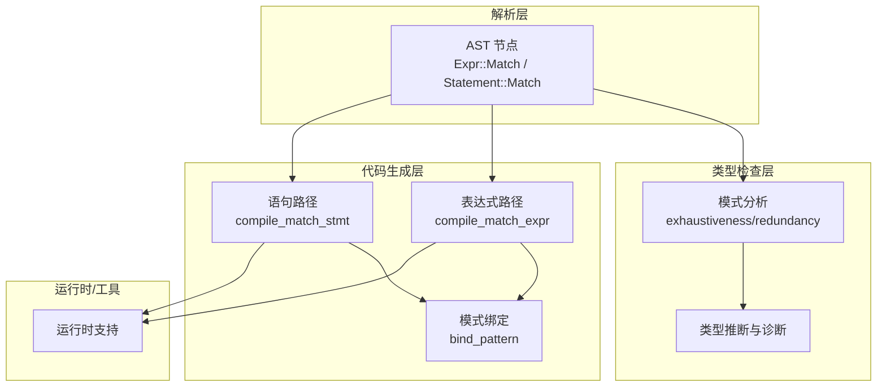
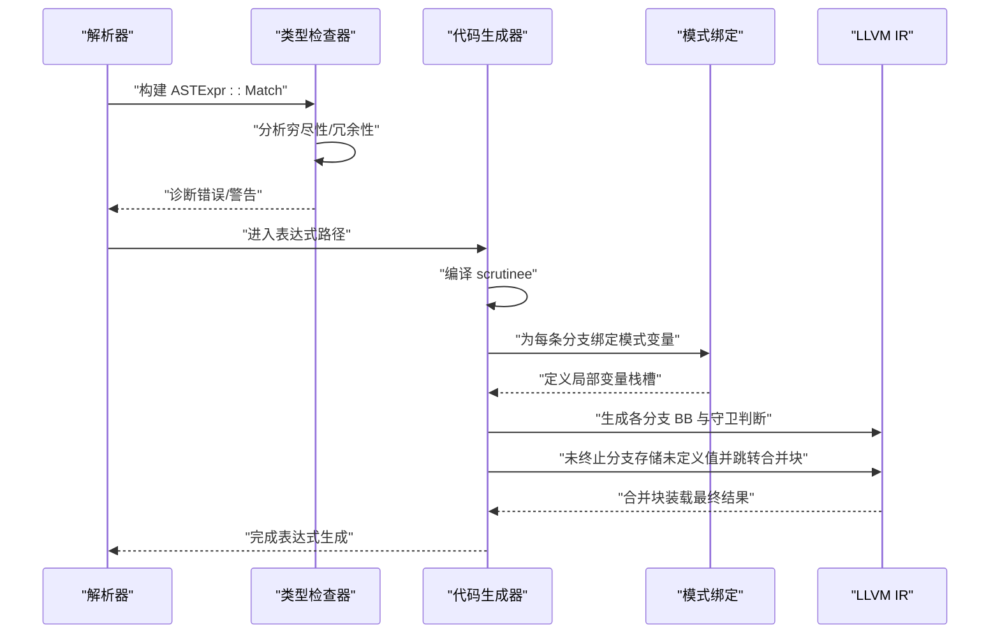
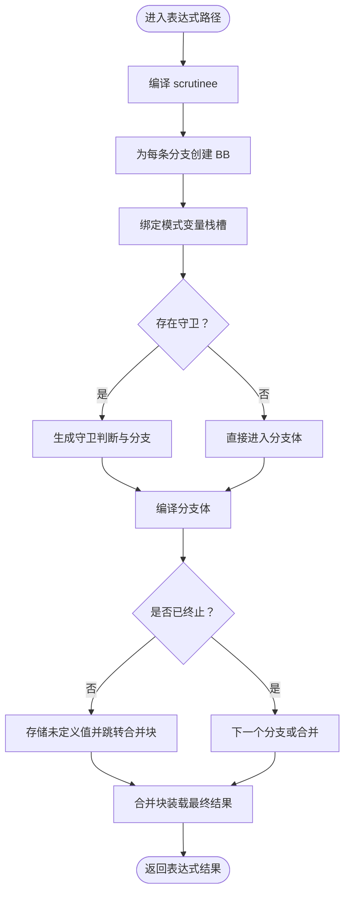
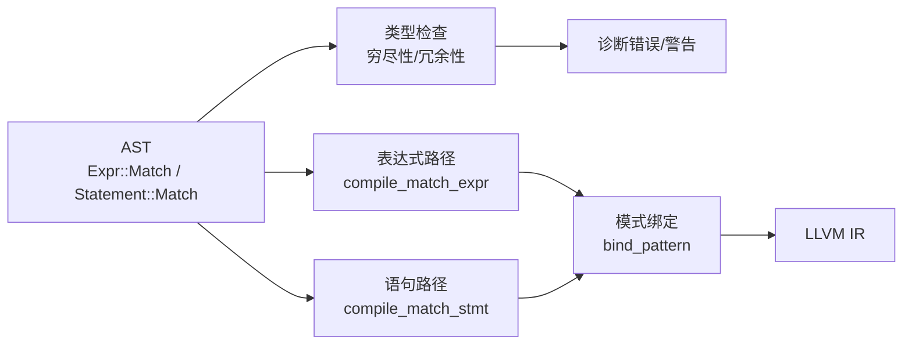

# 匹配表达式

<cite>
**本文引用的文件**
- [crates/ruyic/src/codegen/expr.rs](file://crates/ruyic/src/codegen/expr.rs)
- [crates/ruyic/src/codegen/patterns.rs](file://crates/ruyic/src/codegen/patterns.rs)
- [crates/ruyic/src/parser/ast.rs](file://crates/ruyic/src/parser/ast.rs)
- [crates/ruyic/src/typechecker/patterns.rs](file://crates/ruyic/src/typechecker/patterns.rs)
- [crates/ruyic/src/typechecker/inference.rs](file://crates/ruyic/src/typechecker/inference.rs)
- [examples/pattern_matching.ry](file://examples/pattern_matching.ry)
- [test/match_edge_cases.ry](file://test/match_edge_cases.ry)
- [crates/ruyic/tests/integration/cases/control_flow/match.ry](file://crates/ruyic/tests/integration/cases/control_flow/match.ry)
</cite>

## 目录
1. [简介](#简介)
2. [项目结构](#项目结构)
3. [核心组件](#核心组件)
4. [架构总览](#架构总览)
5. [详细组件分析](#详细组件分析)
6. [依赖关系分析](#依赖关系分析)
7. [性能考量](#性能考量)
8. [故障排查指南](#故障排查指南)
9. [结论](#结论)
10. [附录](#附录)

## 简介
本文件系统化梳理 Ruyi 语言中“匹配表达式”（match expression）的设计与实现，涵盖语法结构、返回值处理、与匹配语句的差异、在函数体中的使用方式与嵌套模式、复杂表达式与条件分支实践、性能特性与编译器优化策略，以及表达式上下文中的穷尽性检查特殊处理。目标是帮助读者从编译器实现到语言使用层面全面掌握 match 表达式。

## 项目结构
围绕匹配表达式的关键代码分布在以下模块：
- 解析层：AST 定义了匹配表达式与匹配语句的节点结构
- 类型检查层：穷尽性与冗余性分析，诊断生成
- 代码生成层：表达式与语句两种路径的 IR 生成策略
- 示例与测试：展示常见用法与边界行为

图示来源
- [crates/ruyic/src/parser/ast.rs:179-268](file://crates/ruyic/src/parser/ast.rs#L179-L268)
- [crates/ruyic/src/typechecker/patterns.rs:21-59](file://crates/ruyic/src/typechecker/patterns.rs#L21-L59)
- [crates/ruyic/src/typechecker/inference.rs:668-689](file://crates/ruyic/src/typechecker/inference.rs#L668-L689)
- [crates/ruyic/src/codegen/expr.rs:3000-3095](file://crates/ruyic/src/codegen/expr.rs#L3000-L3095)
- [crates/ruyic/src/codegen/patterns.rs:25-43](file://crates/ruyic/src/codegen/patterns.rs#L25-L43)

章节来源
- [crates/ruyic/src/parser/ast.rs:179-268](file://crates/ruyic/src/parser/ast.rs#L179-L268)
- [crates/ruyic/src/codegen/expr.rs:3000-3095](file://crates/ruyic/src/codegen/expr.rs#L3000-L3095)
- [crates/ruyic/src/codegen/patterns.rs:25-43](file://crates/ruyic/src/codegen/patterns.rs#L25-L43)
- [crates/ruyic/src/typechecker/patterns.rs:21-59](file://crates/ruyic/src/typechecker/patterns.rs#L21-L59)
- [crates/ruyic/src/typechecker/inference.rs:668-689](file://crates/ruyic/src/typechecker/inference.rs#L668-L689)

## 核心组件
- AST 节点
  - 表达式：Expr::Match(value, arms)
  - 语句：Statement::Match(value, arms)
- 模式类型：Pattern 支持标识符、字面量、对象、数组、或模式、别名 as、省略 rest、通配符等
- 类型检查：分析穷尽性与冗余性，生成诊断
- 代码生成：
  - 表达式路径：compile_match_expr，为每个分支分配 BB，合并块装载结果
  - 语句路径：compile_match_stmt，按类型分派生成 switch/icmp 链/条件跳转
  - 模式绑定：bind_pattern 将匹配变量存入栈槽，支持 as 别名与对象/数组解构

章节来源
- [crates/ruyic/src/parser/ast.rs:179-268](file://crates/ruyic/src/parser/ast.rs#L179-L268)
- [crates/ruyic/src/parser/ast.rs:430-440](file://crates/ruyic/src/parser/ast.rs#L430-L440)
- [crates/ruyic/src/codegen/expr.rs:3000-3095](file://crates/ruyic/src/codegen/expr.rs#L3000-L3095)
- [crates/ruyic/src/codegen/patterns.rs:45-76](file://crates/ruyic/src/codegen/patterns.rs#L45-L76)
- [crates/ruyic/src/typechecker/patterns.rs:21-59](file://crates/ruyic/src/typechecker/patterns.rs#L21-L59)

## 架构总览
下图展示了从 AST 到 LLVM IR 的匹配表达式生成流程，包括模式绑定、守卫分支与结果汇聚。

图示来源
- [crates/ruyic/src/codegen/expr.rs:3000-3095](file://crates/ruyic/src/codegen/expr.rs#L3000-L3095)
- [crates/ruyic/src/codegen/patterns.rs:45-76](file://crates/ruyic/src/codegen/patterns.rs#L45-L76)
- [crates/ruyic/src/typechecker/inference.rs:668-689](file://crates/ruyic/src/typechecker/inference.rs#L668-L689)

## 详细组件分析

### 语法结构与返回值处理
- 语法结构
  - 表达式：match (scrutinee) { pattern => expr_or_block, ... }
  - 支持守卫 if (expr)，支持多条分支，最后可选通配符 _
- 返回值处理
  - 表达式路径会为每个分支分配独立基本块，若分支未显式 return，则在末尾语句处将结果存入共享的栈槽，随后统一在合并块装载返回值
  - 若某分支已显式 return 或抛出异常导致提前终止，后续分支不会执行；未终止分支会存储未定义值以满足 SSA 形式要求

章节来源
- [crates/ruyic/src/codegen/expr.rs:3000-3095](file://crates/ruyic/src/codegen/expr.rs#L3000-L3095)
- [crates/ruyic/src/parser/ast.rs:179-268](file://crates/ruyic/src/parser/ast.rs#L179-L268)

### 与匹配语句的区别与适用场景
- 区别
  - 表达式：必须产生一个值，用于赋值或参与表达式计算
  - 语句：仅用于控制流，不产生值
- 适用场景
  - 表达式：需要根据分支选择不同值的场景（如三元运算符替代、复杂条件分支）
  - 语句：仅需根据分支执行不同副作用逻辑

章节来源
- [crates/ruyic/src/parser/ast.rs:142-145](file://crates/ruyic/src/parser/ast.rs#L142-L145)
- [crates/ruyic/src/parser/ast.rs:256-259](file://crates/ruyic/src/parser/ast.rs#L256-L259)

### 在函数体中的使用与嵌套模式
- 嵌套匹配
  - 表达式与语句均可嵌套；嵌套时内层的 scrutinee 可来自外层绑定的变量
- 变量作用域与遮蔽
  - 模式绑定会引入新的局部变量；若在分支体内再次声明同名变量，会遮蔽外层同名变量
- 早期 return
  - 分支体内可直接 return，提前结束当前函数

章节来源
- [test/match_edge_cases.ry:9-25](file://test/match_edge_cases.ry#L9-L25)
- [test/match_edge_cases.ry:28-34](file://test/match_edge_cases.ry#L28-L34)
- [test/match_edge_cases.ry:47-62](file://test/match_edge_cases.ry#L47-L62)
- [crates/ruyic/src/codegen/patterns.rs:45-76](file://crates/ruyic/src/codegen/patterns.rs#L45-L76)

### 复杂表达式与条件分支的实际示例
- 字面量/通配符/或模式/守卫
  - 示例演示了整数与字符串匹配、布尔与 null 的穷尽性、对象字段访问、if-let/while-let 语句
- 嵌套表达式与调用结果匹配
  - 示例包含嵌套 match、在表达式中使用 match、对函数调用结果进行匹配

章节来源
- [examples/pattern_matching.ry:11-18](file://examples/pattern_matching.ry#L11-L18)
- [examples/pattern_matching.ry:23-29](file://examples/pattern_matching.ry#L23-L29)
- [examples/pattern_matching.ry:34-41](file://examples/pattern_matching.ry#L34-L41)
- [examples/pattern_matching.ry:147-152](file://examples/pattern_matching.ry#L147-L152)
- [test/match_edge_cases.ry:9-25](file://test/match_edge_cases.ry#L9-L25)
- [test/match_edge_cases.ry:37-44](file://test/match_edge_cases.ry#L37-L44)
- [crates/ruyic/tests/integration/cases/control_flow/match.ry:1-53](file://crates/ruyic/tests/integration/cases/control_flow/match.ry#L1-L53)

### 代码生成细节与流程
- 表达式路径
  - 为每条分支创建 BB，绑定模式变量，编译分支体；若分支未终止则存储未定义值并跳转合并块
- 语句路径
  - 按 scrutinee 类型分派：整数（switch/icmp 链）、布尔（条件分支）、字符串（指针比较链）、可空（sentinel/指针判空）、数组/对象/泛型（顺序检查）
- 模式绑定
  - 识别模式类型并生成相应存储：标识符/通配符/别名/数组/对象等

图示来源
- [crates/ruyic/src/codegen/expr.rs:3000-3095](file://crates/ruyic/src/codegen/expr.rs#L3000-L3095)
- [crates/ruyic/src/codegen/patterns.rs:45-76](file://crates/ruyic/src/codegen/patterns.rs#L45-L76)

章节来源
- [crates/ruyic/src/codegen/expr.rs:3000-3095](file://crates/ruyic/src/codegen/expr.rs#L3000-L3095)
- [crates/ruyic/src/codegen/patterns.rs:25-43](file://crates/ruyic/src/codegen/patterns.rs#L25-L43)

### 穷尽性检查在表达式上下文中的特殊处理
- 类型检查阶段
  - 对模式集合进行穷尽性与冗余性分析，生成缺失用例列表与冗余分支索引
  - 根据 scrutinee 类型决定报告级别：某些类型要求穷尽（报错），其他类型仅警告
- 诊断输出
  - 非穷尽：报告缺失用例
  - 冗余：报告冗余分支索引

章节来源
- [crates/ruyic/src/typechecker/patterns.rs:21-59](file://crates/ruyic/src/typechecker/patterns.rs#L21-L59)
- [crates/ruyic/src/typechecker/inference.rs:668-689](file://crates/ruyic/src/typechecker/inference.rs#L668-L689)

## 依赖关系分析
- AST 与类型检查
  - AST 中的 Expr::Match/Statement::Match 作为输入，类型检查器据此进行穷尽性与冗余性分析
- 类型检查与代码生成
  - 类型信息驱动代码生成的分派策略（整数 switch、字符串比较链、可空判空等）
- 模式绑定与作用域
  - bind_pattern 为每个分支建立独立作用域，避免变量冲突与遮蔽

图示来源
- [crates/ruyic/src/parser/ast.rs:179-268](file://crates/ruyic/src/parser/ast.rs#L179-L268)
- [crates/ruyic/src/typechecker/patterns.rs:21-59](file://crates/ruyic/src/typechecker/patterns.rs#L21-L59)
- [crates/ruyic/src/codegen/expr.rs:3000-3095](file://crates/ruyic/src/codegen/expr.rs#L3000-L3095)
- [crates/ruyic/src/codegen/patterns.rs:45-76](file://crates/ruyic/src/codegen/patterns.rs#L45-L76)

章节来源
- [crates/ruyic/src/parser/ast.rs:179-268](file://crates/ruyic/src/parser/ast.rs#L179-L268)
- [crates/ruyic/src/typechecker/patterns.rs:21-59](file://crates/ruyic/src/typechecker/patterns.rs#L21-L59)
- [crates/ruyic/src/codegen/expr.rs:3000-3095](file://crates/ruyic/src/codegen/expr.rs#L3000-L3095)
- [crates/ruyic/src/codegen/patterns.rs:45-76](file://crates/ruyic/src/codegen/patterns.rs#L45-L76)

## 性能考量
- 分派策略
  - 整数：无守卫时采用 switch；存在守卫时退化为顺序比较链
  - 布尔：条件分支直连真/假目标
  - 字符串：最小可行实现为指针比较链（可结合 strcmp）
  - 可空：指针判空或整型 sentinel 判空
  - 数组/对象/泛型：长度/字段访问与顺序检查
- 结果装载
  - 表达式路径通过共享栈槽存储中间结果并在合并块装载，保证 SSA 正确性
- 优化建议
  - 将穷举的字面量模式置于前部，有助于更高效的分派
  - 减少守卫数量，优先使用字面量/通配符组合
  - 合理使用 as 别名减少重复解构成本

章节来源
- [crates/ruyic/src/codegen/patterns.rs:310-526](file://crates/ruyic/src/codegen/patterns.rs#L310-L526)
- [crates/ruyic/src/codegen/patterns.rs:528-757](file://crates/ruyic/src/codegen/patterns.rs#L528-L757)
- [crates/ruyic/src/codegen/expr.rs:3000-3095](file://crates/ruyic/src/codegen/expr.rs#L3000-L3095)

## 故障排查指南
- 常见问题
  - 非穷尽匹配：缺少通配符或未覆盖所有字面量/布尔/可空/数组等情况
  - 冗余分支：模式覆盖重叠，后出现的分支永远无法命中
  - 变量遮蔽：分支体内同名变量遮蔽外层变量，导致作用域混淆
  - 早期 return：注意表达式路径仍需在未终止分支存储未定义值以满足 SSA
- 定位方法
  - 查看类型检查诊断：非穷尽与冗余提示
  - 检查模式顺序与守卫使用
  - 使用简单模式先行验证，再逐步引入复杂模式

章节来源
- [crates/ruyic/src/typechecker/inference.rs:668-689](file://crates/ruyic/src/typechecker/inference.rs#L668-L689)
- [crates/ruyic/src/codegen/expr.rs:3055-3068](file://crates/ruyic/src/codegen/expr.rs#L3055-L3068)
- [test/match_edge_cases.ry:47-62](file://test/match_edge_cases.ry#L47-L62)

## 结论
Ruyi 的匹配表达式在语法上与匹配语句互补：前者强调“值的选择”，后者强调“控制流”。类型检查层提供穷尽性与冗余性保障，代码生成层针对不同 scrutinee 类型采用最优分派策略，并通过模式绑定与合并块装载确保 SSA 正确性。实践中应优先保证穷尽性、合理组织守卫与模式顺序，并注意变量作用域与早期 return 的影响。

## 附录
- 实践参考
  - 示例程序：字面量/通配符/或模式/守卫/对象解构/嵌套表达式
  - 边界用例：嵌套匹配、早期 return、字符串匹配、变量遮蔽

章节来源
- [examples/pattern_matching.ry:11-18](file://examples/pattern_matching.ry#L11-L18)
- [examples/pattern_matching.ry:23-29](file://examples/pattern_matching.ry#L23-L29)
- [examples/pattern_matching.ry:34-41](file://examples/pattern_matching.ry#L34-L41)
- [examples/pattern_matching.ry:147-152](file://examples/pattern_matching.ry#L147-L152)
- [test/match_edge_cases.ry:9-25](file://test/match_edge_cases.ry#L9-L25)
- [test/match_edge_cases.ry:28-34](file://test/match_edge_cases.ry#L28-L34)
- [test/match_edge_cases.ry:37-44](file://test/match_edge_cases.ry#L37-L44)
- [test/match_edge_cases.ry:47-62](file://test/match_edge_cases.ry#L47-L62)
- [crates/ruyic/tests/integration/cases/control_flow/match.ry:1-53](file://crates/ruyic/tests/integration/cases/control_flow/match.ry#L1-L53)