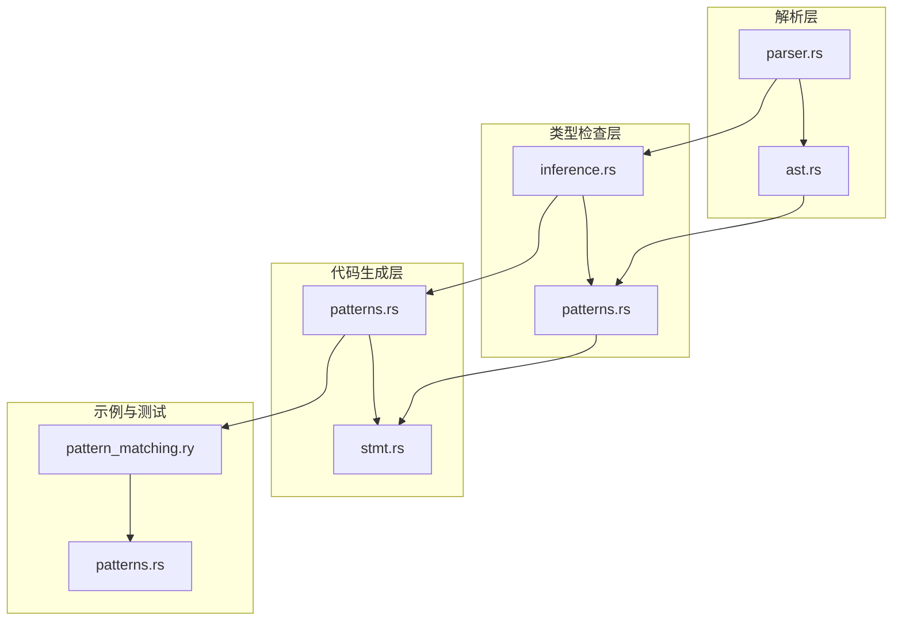
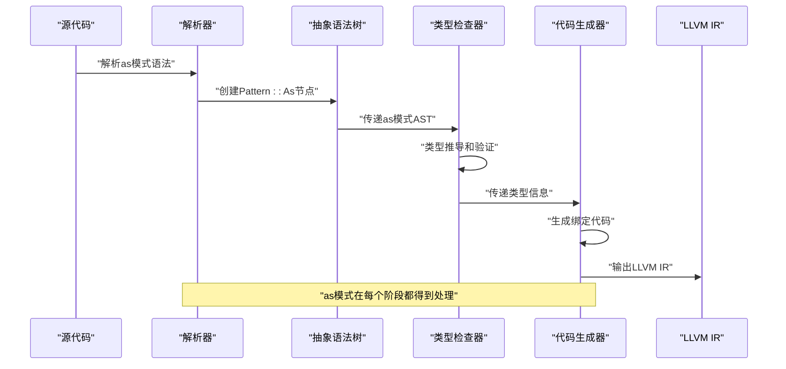
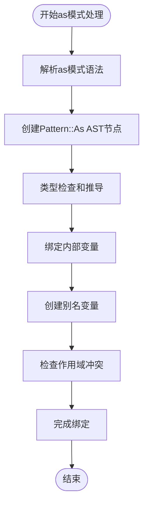
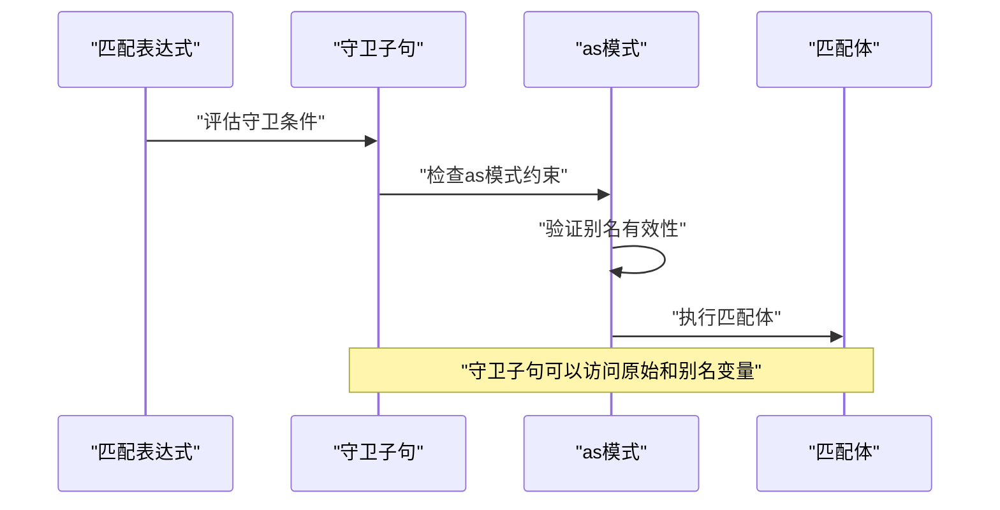
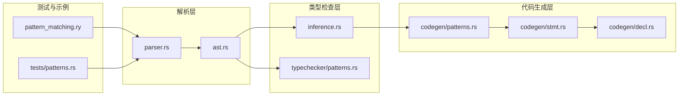

# 命名绑定模式

<cite>
**本文档引用的文件**
- [ast.rs](file://crates/ruyic/src/parser/ast.rs)
- [parser.rs](file://crates/ruyic/src/parser/parser.rs)
- [patterns.rs](file://crates/ruyic/src/codegen/patterns.rs)
- [stmt.rs](file://crates/ruyic/src/codegen/stmt.rs)
- [inference.rs](file://crates/ruyic/src/typechecker/inference.rs)
- [patterns.rs](file://crates/ruyic/src/typechecker/patterns.rs)
- [pattern_matching.ry](file://examples/pattern_matching.ry)
- [patterns.rs](file://crates/ruyic/tests/patterns.rs)
</cite>

## 目录
1. [引言](#引言)
2. [项目结构](#项目结构)
3. [核心组件](#核心组件)
4. [架构概览](#架构概览)
5. [详细组件分析](#详细组件分析)
6. [依赖关系分析](#依赖关系分析)
7. [性能考虑](#性能考虑)
8. [故障排除指南](#故障排除指南)
9. [结论](#结论)

## 引言

本文档深入介绍了Ruyi语言中as关键字在模式匹配中的命名绑定功能。as模式是模式匹配系统的重要组成部分，它允许开发者为匹配到的值创建别名，从而在保持原始绑定不变的同时提供更具描述性的变量名称。

在Ruyi中，as模式不仅支持基本的数据类型匹配，还能够与守卫子句、对象解构、数组解构等多种模式组合使用，为复杂的匹配场景提供了强大的表达能力。本文将详细说明as模式的语法格式、变量重命名规则、在复杂匹配场景中的应用以及代码组织优势。

## 项目结构

Ruyi项目的模式匹配功能分布在多个关键模块中：



**图表来源**
- [parser.rs:2037-2064](file://crates/ruyic/src/parser/parser.rs#L2037-L2064)
- [ast.rs:428-440](file://crates/ruyic/src/parser/ast.rs#L428-L440)
- [patterns.rs:45-76](file://crates/ruyic/src/codegen/patterns.rs#L45-L76)

**章节来源**
- [parser.rs:2037-2064](file://crates/ruyic/src/parser/parser.rs#L2037-L2064)
- [ast.rs:428-440](file://crates/ruyic/src/parser/ast.rs#L428-L440)

## 核心组件

### AST定义中的as模式

在抽象语法树中，as模式被定义为一个枚举变体：

```mermaid
classDiagram
class Pattern {
<<enumeration>>
+Identifier(String)
+Literal(Expr)
+Object(Vec~ObjectPatternField~)
+Array(Vec~ArrayPatternElement~)
+Rest(String)
+As(Box~Pattern~, String)
+Or(Vec~Pattern~)
+Wildcard
}
class ObjectPatternField {
<<enumeration>>
+Property { key : String, pattern : Pattern }
+Shorthand(String)
+Rest(String)
}
class ArrayPatternElement {
<<enumeration>>
+Pattern(Pattern)
+Rest(Pattern)
+Elision
}
Pattern --> ObjectPatternField : "contains"
Pattern --> ArrayPatternElement : "contains"
```

**图表来源**
- [ast.rs:428-454](file://crates/ruyic/src/parser/ast.rs#L428-L454)

### 解析器中的as模式处理

解析器负责将源代码中的as模式语法转换为AST节点：

**章节来源**
- [parser.rs:2037-2064](file://crates/ruyic/src/parser/parser.rs#L2037-L2064)
- [ast.rs:428-440](file://crates/ruyic/src/parser/ast.rs#L428-L440)

## 架构概览

Ruyi的as模式处理遵循典型的编译器流水线架构：



**图表来源**
- [parser.rs:2037-2064](file://crates/ruyic/src/parser/parser.rs#L2037-L2064)
- [patterns.rs:45-76](file://crates/ruyic/src/codegen/patterns.rs#L45-L76)
- [inference.rs:1541-1581](file://crates/ruyic/src/typechecker/inference.rs#L1541-L1581)

## 详细组件分析

### 语法格式与变量重命名规则

as模式的基本语法格式为：`模式 as 别名`。在Ruyi中，这种语法被解析为`Pattern::As(Box::new(内部模式), 别名)`的形式。

#### 变量重命名机制

当as模式被处理时，编译器会执行以下步骤：

1. **内部模式匹配**：首先对as左侧的模式进行匹配
2. **变量绑定**：将匹配结果绑定到内部变量名
3. **别名创建**：为相同的值创建别名变量
4. **作用域管理**：确保两个变量都在相同的作用域内



**图表来源**
- [parser.rs:2058-2062](file://crates/ruyic/src/parser/parser.rs#L2058-L2062)
- [patterns.rs:63-70](file://crates/ruyic/src/codegen/patterns.rs#L63-L70)

**章节来源**
- [parser.rs:2058-2062](file://crates/ruyic/src/parser/parser.rs#L2058-L2062)
- [patterns.rs:63-70](file://crates/ruyic/src/codegen/patterns.rs#L63-L70)

### 复杂匹配场景的应用

#### 与守卫子句的结合

as模式最强大的特性之一是与守卫子句的结合使用。这允许开发者在保持原始绑定的同时，为条件判断提供更清晰的变量名称。



**图表来源**
- [patterns.rs:310-340](file://crates/ruyic/src/codegen/patterns.rs#L310-L340)

#### 对象解构中的as模式

在对象解构场景中，as模式可以为嵌套的对象属性提供别名：

**章节来源**
- [patterns.rs:141-282](file://crates/ruyic/src/codegen/patterns.rs#L141-L282)

### 代码组织优势

#### 提升代码可读性

as模式通过提供更具描述性的变量名称，显著提升了代码的可读性。例如：

- 将复杂的嵌套结构解构为简单易懂的变量名
- 为临时计算结果提供有意义的别名
- 在条件分支中使用语义化的变量名称

#### 维护性改进

as模式在代码维护方面提供了以下优势：

- **减少重复计算**：可以在守卫子句中重用已计算的值
- **简化复杂逻辑**：将复杂的匹配条件分解为更小的、可理解的部分
- **增强错误处理**：通过别名变量提供更好的调试信息

### 实际示例与最佳实践

#### 变量重命名示例

基于项目中的示例，as模式可以用于各种场景：

**章节来源**
- [pattern_matching.ry:128-142](file://examples/pattern_matching.ry#L128-L142)

#### 条件过滤与数据转换

as模式在条件过滤和数据转换中发挥重要作用：

1. **数值范围检查**：使用as模式为数值范围提供别名
2. **类型转换**：在匹配过程中进行类型转换并提供别名
3. **复杂条件判断**：结合守卫子句进行多层条件判断

#### 最佳实践建议

基于代码库的实现，以下是使用as模式的最佳实践：

1. **选择有意义的别名**：别名应该清楚地表达变量的用途
2. **避免命名冲突**：确保别名不会与现有变量名冲突
3. **合理使用作用域**：理解as模式创建的变量作用域
4. **性能考虑**：避免不必要的重复计算

**章节来源**
- [patterns.rs:89-94](file://crates/ruyic/src/typechecker/patterns.rs#L89-L94)

## 依赖关系分析

### 模块间依赖关系



**图表来源**
- [parser.rs:2037-2064](file://crates/ruyic/src/parser/parser.rs#L2037-L2064)
- [patterns.rs:45-76](file://crates/ruyic/src/codegen/patterns.rs#L45-L76)
- [stmt.rs:1047-1241](file://crates/ruyic/src/codegen/stmt.rs#L1047-L1241)

### 关键依赖链

as模式的处理涉及以下关键依赖链：

1. **解析依赖**：parser.rs → ast.rs
2. **类型检查依赖**：ast.rs → inference.rs → typechecker/patterns.rs
3. **代码生成依赖**：ast.rs → codegen/patterns.rs → codegen/stmt.rs
4. **测试依赖**：tests/patterns.rs → parser.rs

**章节来源**
- [inference.rs:1541-1581](file://crates/ruyic/src/typechecker/inference.rs#L1541-L1581)
- [stmt.rs:1047-1241](file://crates/ruyic/src/codegen/stmt.rs#L1047-L1241)

## 性能考虑

### 编译时性能影响

as模式的引入对编译性能的影响主要体现在：

1. **解析开销**：额外的语法解析步骤
2. **类型检查复杂度**：需要同时处理原始绑定和别名绑定
3. **代码生成成本**：为别名变量分配存储空间

### 运行时性能特征

as模式在运行时几乎无额外开销，因为：

- 别名变量指向相同的内存位置
- 编译器优化可以消除重复访问
- LLVM IR生成时会进行相应的优化

## 故障排除指南

### 常见问题与解决方案

#### 语法解析错误

**问题**：as模式语法不正确导致解析失败

**解决方案**：
1. 确保as关键字前后有适当的空格
2. 验证模式和别名的语法正确性
3. 检查是否在不允许使用as模式的上下文中使用

#### 类型检查错误

**问题**：as模式的类型检查失败

**解决方案**：
1. 确保内部模式和别名的类型兼容
2. 检查变量作用域冲突
3. 验证守卫子句的类型正确性

#### 代码生成问题

**问题**：as模式在代码生成阶段出现问题

**解决方案**：
1. 检查变量定义和使用的一致性
2. 验证LLVM IR生成的正确性
3. 确保内存分配和存储操作正常

**章节来源**
- [patterns.rs:132-135](file://crates/ruyic/tests/patterns.rs#L132-L135)

## 结论

Ruyi语言中的as模式为模式匹配提供了强大的命名绑定功能。通过在解析、类型检查和代码生成三个层面的完整支持，as模式不仅增强了语言的表达能力，还保持了良好的性能特征。

as模式的核心价值在于：

1. **提升代码可读性**：通过有意义的别名变量改善代码理解
2. **增强表达能力**：支持复杂的匹配场景和条件判断
3. **保持性能**：运行时几乎无额外开销
4. **类型安全**：完整的类型检查保证运行时安全

随着Ruyi语言的发展，as模式将继续作为模式匹配系统的重要组成部分，为开发者提供更加灵活和强大的编程工具。