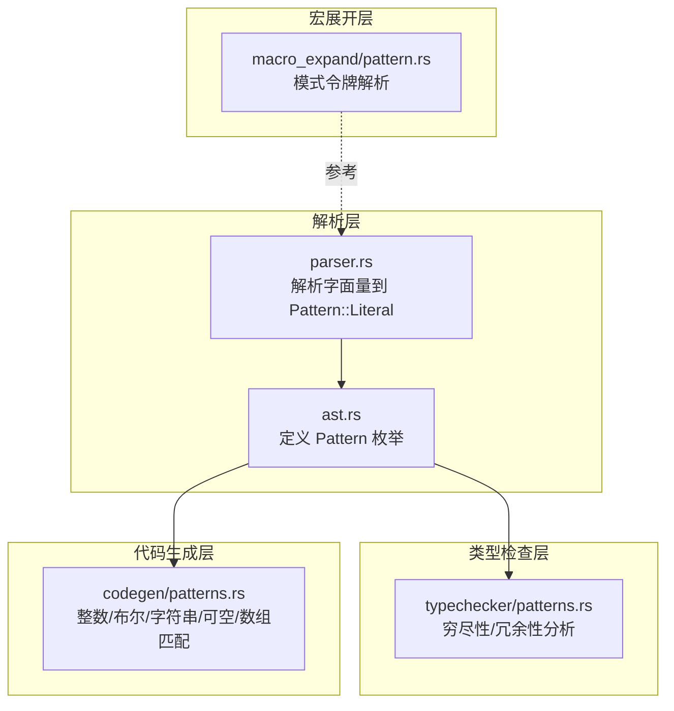
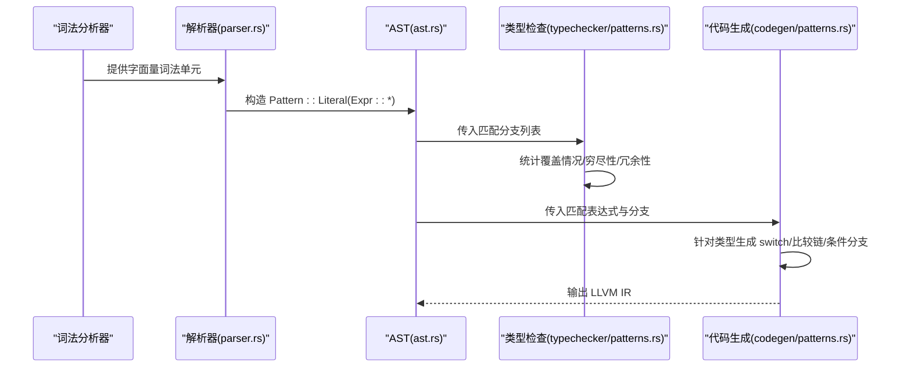
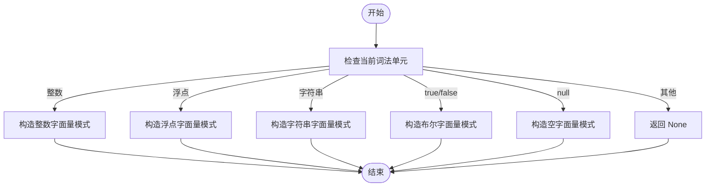
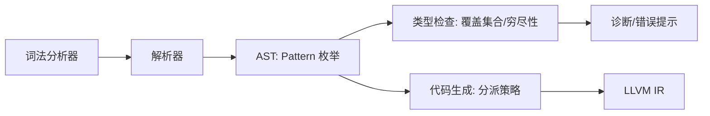

# 字面量模式

<cite>
**本文引用的文件**
- [ast.rs](file://crates/ruyic/src/parser/ast.rs)
- [parser.rs](file://crates/ruyic/src/parser/parser.rs)
- [patterns.rs（类型检查）](file://crates/ruyic/src/typechecker/patterns.rs)
- [patterns.rs（代码生成）](file://crates/ruyic/src/codegen/patterns.rs)
- [pattern.rs（宏展开）](file://crates/ruyic/src/macro_expand/pattern.rs)
- [pattern_matching.ry](file://examples/pattern_matching.ry)
- [match_edge_cases.ry](file://test/match_edge_cases.ry)
</cite>

## 目录
1. [引言](#引言)
2. [项目结构](#项目结构)
3. [核心组件](#核心组件)
4. [架构总览](#架构总览)
5. [详细组件分析](#详细组件分析)
6. [依赖关系分析](#依赖关系分析)
7. [性能考量](#性能考量)
8. [故障排查指南](#故障排查指南)
9. [结论](#结论)
10. [附录](#附录)

## 引言
本文件系统化阐述 Ruyi 语言中“字面量模式”的设计与实现，涵盖数字、字符串、布尔值、空值等字面量在模式匹配中的使用方式；通配符模式（_）的语法与作用域规则；字面量模式与其他模式类型的组合与优先级；以及在穷尽性检查中的角色与注意事项。同时提供来自示例与集成测试的丰富用例路径，帮助读者快速理解并正确使用。

## 项目结构
围绕字面量模式的关键代码分布在以下模块：
- 解析层：将词法单元解析为 AST 中的字面量模式
- 类型检查层：进行穷尽性与冗余性分析
- 代码生成层：针对不同标量类型生成高效的分支或比较序列
- 宏展开层：支持更复杂的模式令牌解析（与字面量模式协同）

图表来源
- [parser.rs:2113-2145](file://crates/ruyic/src/parser/parser.rs#L2113-L2145)
- [ast.rs:430-440](file://crates/ruyic/src/parser/ast.rs#L430-L440)
- [patterns.rs（类型检查）:20-59](file://crates/ruyic/src/typechecker/patterns.rs#L20-L59)
- [patterns.rs（代码生成）:20-43](file://crates/ruyic/src/codegen/patterns.rs#L20-L43)
- [pattern.rs（宏展开）:386-392](file://crates/ruyic/src/macro_expand/pattern.rs#L386-L392)

章节来源
- [parser.rs:2113-2145](file://crates/ruyic/src/parser/parser.rs#L2113-L2145)
- [ast.rs:430-440](file://crates/ruyic/src/parser/ast.rs#L430-L440)
- [patterns.rs（类型检查）:20-59](file://crates/ruyic/src/typechecker/patterns.rs#L20-L59)
- [patterns.rs（代码生成）:20-43](file://crates/ruyic/src/codegen/patterns.rs#L20-L43)
- [pattern.rs（宏展开）:386-392](file://crates/ruyic/src/macro_expand/pattern.rs#L386-L392)

## 核心组件
- 字面量模式的 AST 表达
  - 字面量模式属于 Pattern 枚举成员之一，内部持有表达式节点（整数、浮点、字符串、布尔、空值），用于在匹配时进行精确相等判断。
- 解析器对字面量模式的支持
  - 解析器根据当前词法单元识别整数、浮点、字符串、布尔、空值，并构造对应的字面量模式。
- 类型检查中的穷尽性与冗余性
  - 针对每条匹配分支，统计其覆盖的“情况集合”，并基于“是否包含通配符”“是否出现重复覆盖”等规则判定穷尽性与冗余性。
- 代码生成中的高效分派
  - 针对整数、布尔、字符串、可空、数组等类型，分别采用 switch 或顺序比较链、条件分支、指针/全局字符串比较、空值检测等方式生成 IR。

章节来源
- [ast.rs:430-440](file://crates/ruyic/src/parser/ast.rs#L430-L440)
- [parser.rs:2113-2145](file://crates/ruyic/src/parser/parser.rs#L2113-L2145)
- [patterns.rs（类型检查）:61-145](file://crates/ruyic/src/typechecker/patterns.rs#L61-L145)
- [patterns.rs（代码生成）:310-394](file://crates/ruyic/src/codegen/patterns.rs#L310-L394)

## 架构总览
下图展示了从解析到类型检查再到代码生成的整体流程，重点标注了字面量模式参与的关键阶段。

图表来源
- [parser.rs:2113-2145](file://crates/ruyic/src/parser/parser.rs#L2113-L2145)
- [ast.rs:430-440](file://crates/ruyic/src/parser/ast.rs#L430-L440)
- [patterns.rs（类型检查）:20-59](file://crates/ruyic/src/typechecker/patterns.rs#L20-L59)
- [patterns.rs（代码生成）:20-43](file://crates/ruyic/src/codegen/patterns.rs#L20-L43)

## 详细组件分析

### 字面量模式的语法与解析
- 支持的字面量类型
  - 整数、浮点、字符串、布尔、空值均作为字面量模式被解析并存储为 Pattern::Literal 内部的表达式节点。
- 解析行为
  - 解析器在遇到相应词法单元时，直接构造对应字面量模式，推进词法位置，形成 Pattern AST。
- 与其它模式的组合
  - 字面量模式可与“或模式”“标识符绑定”“通配符”等组合使用，形成更灵活的匹配结构。

图表来源
- [parser.rs:2113-2145](file://crates/ruyic/src/parser/parser.rs#L2113-L2145)

章节来源
- [parser.rs:2113-2145](file://crates/ruyic/src/parser/parser.rs#L2113-L2145)
- [ast.rs:430-440](file://crates/ruyic/src/parser/ast.rs#L430-L440)

### 字面量模式的匹配优先级与作用域
- 优先级
  - 字面量模式与“或模式”“通配符”“标识符绑定”共同存在于同一匹配臂中时，匹配顺序遵循“先字面量命中，再通配符/标识符”的策略；当存在守卫（guard）时，按顺序逐一比较并评估守卫。
- 作用域
  - 字面量模式本身不引入新变量绑定；若需绑定，通常配合“标识符绑定”或“as 模式”使用。通配符模式（_）仅用于兜底，不引入绑定。
- 与守卫的协作
  - 若任一匹配臂带有守卫，则整段匹配退化为顺序比较链，逐个评估字面量匹配与守卫条件。

章节来源
- [patterns.rs（代码生成）:310-331](file://crates/ruyic/src/codegen/patterns.rs#L310-L331)
- [patterns.rs（代码生成）:396-526](file://crates/ruyic/src/codegen/patterns.rs#L396-L526)

### 数值字面量匹配
- 整数类型
  - 无守卫时：使用 LLVM switch 对常量进行分派；字面量模式转为 switch case，首个通配符或标识符臂作为默认分支；若无默认则插入不可达陷阱块。
  - 有守卫时：退化为顺序比较链，逐臂比较字面量相等并评估守卫。
- 浮点类型
  - 类型检查层面，浮点类型在穷尽性检查中以“其他浮点值”作为缺失项提示；代码生成层面未见专门的 switch/比较链实现，通常由通用匹配处理。
- 示例参考
  - 基础整数字面量匹配与守卫、嵌套匹配、返回语句等用例可参考集成测试与示例程序。

章节来源
- [patterns.rs（代码生成）:310-394](file://crates/ruyic/src/codegen/patterns.rs#L310-L394)
- [patterns.rs（代码生成）:396-526](file://crates/ruyic/src/codegen/patterns.rs#L396-L526)
- [patterns.rs（类型检查）:195-211](file://crates/ruyic/src/typechecker/patterns.rs#L195-L211)
- [match_edge_cases.ry:8-25](file://test/match_edge_cases.ry#L8-L25)
- [match_edge_cases.ry:27-34](file://test/match_edge_cases.ry#L27-L34)
- [pattern_matching.ry:11-18](file://examples/pattern_matching.ry#L11-L18)
- [pattern_matching.ry:34-41](file://examples/pattern_matching.ry#L34-L41)

### 字符串字面量匹配
- 实现要点
  - 使用全局字符串指针与 strcmp 比较，逐个字面量分支进行条件跳转；若无默认分支，最终跳转至合并块。
- 穷尽性检查
  - 字符串类型在穷尽性检查中以“其他字符串值”作为缺失项提示。
- 示例参考
  - 字符串匹配示例位于集成测试中。

章节来源
- [patterns.rs（代码生成）:583-677](file://crates/ruyic/src/codegen/patterns.rs#L583-L677)
- [patterns.rs（类型检查）:212-218](file://crates/ruyic/src/typechecker/patterns.rs#L212-L218)
- [match_edge_cases.ry:36-44](file://test/match_edge_cases.ry#L36-L44)

### 布尔字面量匹配
- 实现要点
  - 布尔类型使用条件分支分别指向 true/false 分支；通配符或标识符作为缺失分支的兜底。
- 穷尽性检查
  - 布尔类型在穷尽性检查中需同时覆盖 true 与 false；若任一缺失，报告相应缺失项。
- 示例参考
  - 布尔字面量匹配与守卫示例位于示例程序。

章节来源
- [patterns.rs（代码生成）:528-581](file://crates/ruyic/src/codegen/patterns.rs#L528-L581)
- [patterns.rs（类型检查）:219-228](file://crates/ruyic/src/typechecker/patterns.rs#L219-L228)
- [pattern_matching.ry:34-41](file://examples/pattern_matching.ry#L34-L41)

### 空值与可空类型匹配
- 实现要点
  - 可空类型通过空值检测区分 null 与非空分支；对于指针类型使用指针到整数转换与零比较；对于整数擦除类型使用全 1 作为哨兵。
- 穷尽性检查
  - 可空类型在穷尽性检查中需覆盖 null 与非空两种情形；若缺失，报告相应缺失项。
- 示例参考
  - 可空类型匹配与 if-let/while-let 示例位于示例程序。

章节来源
- [patterns.rs（代码生成）:679-757](file://crates/ruyic/src/codegen/patterns.rs#L679-L757)
- [patterns.rs（类型检查）:265-272](file://crates/ruyic/src/typechecker/patterns.rs#L265-L272)
- [pattern_matching.ry:72-92](file://examples/pattern_matching.ry#L72-L92)
- [pattern_matching.ry:116-125](file://examples/pattern_matching.ry#L116-L125)

### 通配符模式（_）的语法与作用域
- 语法
  - 通配符模式以“_”表示，用于匹配任意值且不引入绑定。
- 作用域规则
  - 通配符仅用于兜底，不引入新的变量绑定；与标识符绑定不同，后者会引入同名变量并在该分支内生效。
- 在穷尽性检查中的作用
  - 若任一分支覆盖集合包含“_”，则整体视为穷尽；否则报告缺失项。
- 示例参考
  - 通配符在整数与布尔匹配中的使用位于示例程序与集成测试。

章节来源
- [ast.rs:430-440](file://crates/ruyic/src/parser/ast.rs#L430-L440)
- [patterns.rs（类型检查）:65-68](file://crates/ruyic/src/typechecker/patterns.rs#L65-L68)
- [patterns.rs（类型检查）:51-58](file://crates/ruyic/src/typechecker/patterns.rs#L51-L58)
- [pattern_matching.ry:16-17](file://examples/pattern_matching.ry#L16-L17)
- [pattern_matching.ry:24-29](file://examples/pattern_matching.ry#L24-L29)

### 字面量模式与其他模式类型的结合
- 与“或模式”结合
  - 字面量可出现在“或模式”中，多个字面量共享同一分支体。
- 与“标识符绑定/别名”结合
  - 字面量模式可与“as 模式”或“标识符绑定”组合，既进行字面量匹配又引入变量绑定。
- 与“守卫”结合
  - 任一分支带守卫时，整段匹配退化为顺序比较链，逐臂评估字面量与守卫。
- 示例参考
  - 或模式、守卫、as 模式等示例位于示例程序。

章节来源
- [patterns.rs（代码生成）:310-331](file://crates/ruyic/src/codegen/patterns.rs#L310-L331)
- [patterns.rs（代码生成）:396-526](file://crates/ruyic/src/codegen/patterns.rs#L396-L526)
- [pattern_matching.ry:23-29](file://examples/pattern_matching.ry#L23-L29)
- [pattern_matching.ry:130-142](file://examples/pattern_matching.ry#L130-L142)

### 穷尽性检查中的字面量模式
- 覆盖集合构建
  - 针对每条分支，计算其覆盖的“情况集合”。字面量模式会生成唯一标识（如“int:123”“string:abc”“true/false/null”等），通配符生成“_”。
- 穷尽性判断
  - 若覆盖集合包含“_”，或覆盖集合已包含所有可能值（如布尔的 true 与 false 均已覆盖），则整体为穷尽。
- 冗余性判断
  - 若某分支覆盖的情况已被先前分支覆盖，则标记为冗余；通配符之后的分支通常被视为冗余。
- 示例参考
  - 布尔与空值的穷尽性测试位于类型检查测试模块。

章节来源
- [patterns.rs（类型检查）:61-145](file://crates/ruyic/src/typechecker/patterns.rs#L61-L145)
- [patterns.rs（类型检查）:195-309](file://crates/ruyic/src/typechecker/patterns.rs#L195-L309)
- [patterns.rs（类型检查）:316-362](file://crates/ruyic/src/typechecker/patterns.rs#L316-L362)

## 依赖关系分析
- 解析层依赖词法分析器输出的字面量词法单元，构造 Pattern::Literal。
- AST 层统一承载所有模式类型，供类型检查与代码生成消费。
- 类型检查层依赖 AST 计算覆盖集合，决定穷尽性与冗余性。
- 代码生成层依据类型信息选择最优 IR 生成策略（switch/比较链/条件分支）。

图表来源
- [parser.rs:2113-2145](file://crates/ruyic/src/parser/parser.rs#L2113-L2145)
- [ast.rs:430-440](file://crates/ruyic/src/parser/ast.rs#L430-L440)
- [patterns.rs（类型检查）:20-59](file://crates/ruyic/src/typechecker/patterns.rs#L20-L59)
- [patterns.rs（代码生成）:20-43](file://crates/ruyic/src/codegen/patterns.rs#L20-L43)

章节来源
- [parser.rs:2113-2145](file://crates/ruyic/src/parser/parser.rs#L2113-L2145)
- [ast.rs:430-440](file://crates/ruyic/src/parser/ast.rs#L430-L440)
- [patterns.rs（类型检查）:20-59](file://crates/ruyic/src/typechecker/patterns.rs#L20-L59)
- [patterns.rs（代码生成）:20-43](file://crates/ruyic/src/codegen/patterns.rs#L20-L43)

## 性能考量
- 整数匹配
  - 无守卫时采用 LLVM switch，常数时间分派；字面量越多，switch 表越大，但查找仍为 O(1)。
  - 有守卫时退化为顺序比较链，逐臂比较与求值，时间复杂度为 O(N)。
- 字符串匹配
  - 逐字面量调用 strcmp，时间复杂度为 O(N·M)，N 为分支数，M 为字符串平均长度；建议尽量减少分支数量或使用守卫优化。
- 布尔与可空匹配
  - 条件分支与一次空值检测，常数时间；IR 生成简单，开销极低。
- 代码生成优化建议
  - 将高频字面量置于前面，利用 switch 的常量分派优势。
  - 合理使用通配符兜底，避免不必要的守卫导致顺序链。
  - 对字符串匹配，尽量减少分支数量，必要时通过守卫合并相似分支。

章节来源
- [patterns.rs（代码生成）:310-394](file://crates/ruyic/src/codegen/patterns.rs#L310-L394)
- [patterns.rs（代码生成）:583-677](file://crates/ruyic/src/codegen/patterns.rs#L583-L677)
- [patterns.rs（代码生成）:679-757](file://crates/ruyic/src/codegen/patterns.rs#L679-L757)

## 故障排查指南
- 穷尽性告警
  - 现象：编译器提示“存在缺失的匹配分支”。
  - 排查：确认布尔/字符串/可空等类型的字面量是否已覆盖；若使用通配符，请确保其位于最后且不会掩盖后续冗余。
- 冗余告警
  - 现象：编译器提示“后续分支冗余”。
  - 排查：检查通配符或标识符绑定是否在字面量之后；字面量覆盖集合是否已包含该分支。
- 守卫导致的性能问题
  - 现象：匹配性能下降。
  - 排查：移除不必要的守卫或将相似字面量合并为“或模式”，减少顺序链长度。
- 字符串匹配效率低
  - 现象：大量 strcmp 调用导致运行时开销大。
  - 排查：减少分支数量，或通过守卫合并分支；必要时考虑预处理或缓存策略。

章节来源
- [patterns.rs（类型检查）:20-59](file://crates/ruyic/src/typechecker/patterns.rs#L20-L59)
- [patterns.rs（类型检查）:195-309](file://crates/ruyic/src/typechecker/patterns.rs#L195-L309)
- [patterns.rs（代码生成）:310-331](file://crates/ruyic/src/codegen/patterns.rs#L310-L331)

## 结论
字面量模式是 Ruyi 模式匹配的基础构件，能够与通配符、标识符绑定、守卫、或模式等组合使用，形成简洁而强大的匹配表达能力。在类型检查层面，它通过覆盖集合与穷尽性规则保障程序的完备性；在代码生成层面，针对不同标量类型采用最优分派策略，兼顾性能与可读性。合理组织字面量分支、善用通配符与守卫，是编写高质量匹配代码的关键。

## 附录
- 示例与测试用例路径
  - 整数字面量匹配与守卫：[pattern_matching.ry:11-18](file://examples/pattern_matching.ry#L11-L18), [pattern_matching.ry:34-41](file://examples/pattern_matching.ry#L34-L41)
  - 嵌套匹配与返回：[match_edge_cases.ry:8-25](file://test/match_edge_cases.ry#L8-L25), [match_edge_cases.ry:27-34](file://test/match_edge_cases.ry#L27-L34)
  - 字符串匹配：[match_edge_cases.ry:36-44](file://test/match_edge_cases.ry#L36-L44)
  - 布尔匹配与通配符：[pattern_matching.ry:16-17](file://examples/pattern_matching.ry#L16-L17), [pattern_matching.ry:34-41](file://examples/pattern_matching.ry#L34-L41)
  - 可空类型匹配与 if-let/while-let：[pattern_matching.ry:72-92](file://examples/pattern_matching.ry#L72-L92), [pattern_matching.ry:116-125](file://examples/pattern_matching.ry#L116-L125)
  - 或模式与 as 模式：[pattern_matching.ry:23-29](file://examples/pattern_matching.ry#L23-L29), [pattern_matching.ry:130-142](file://examples/pattern_matching.ry#L130-L142)