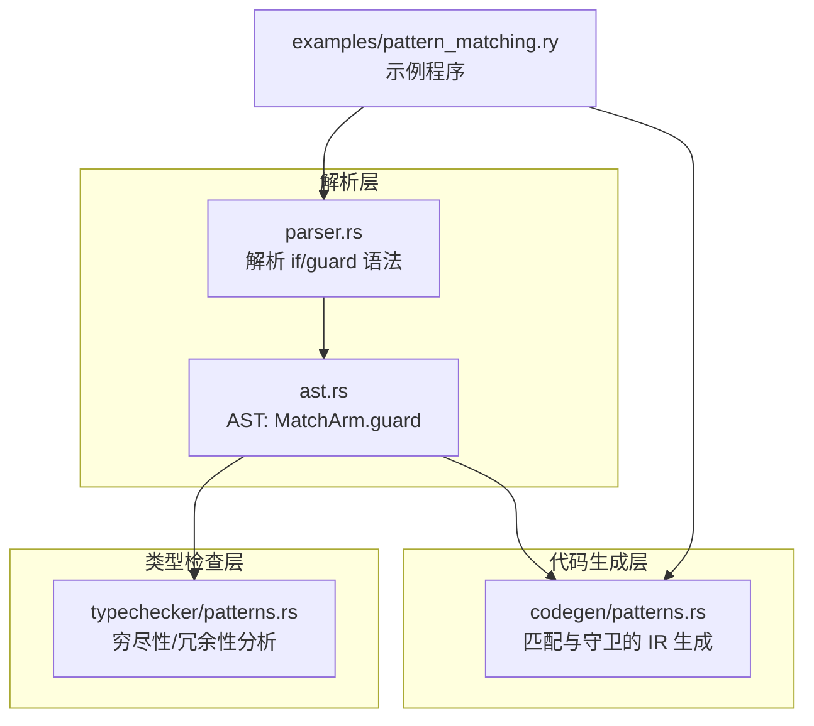
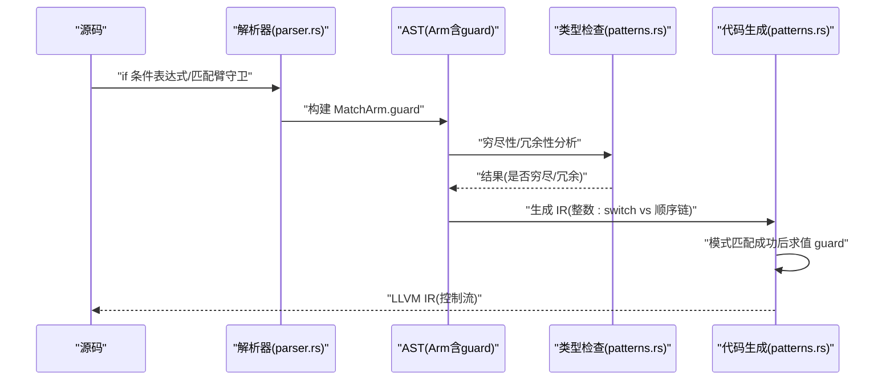
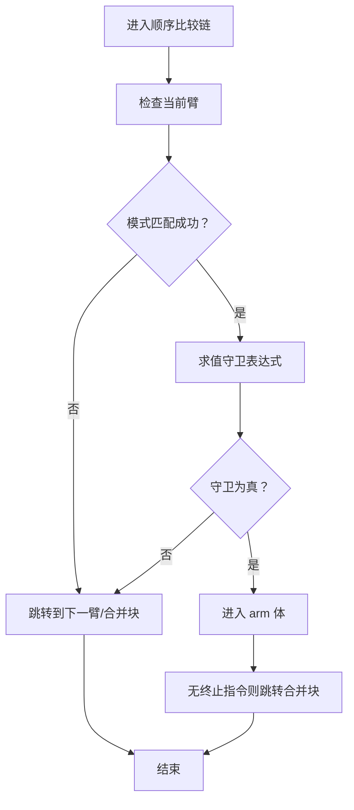
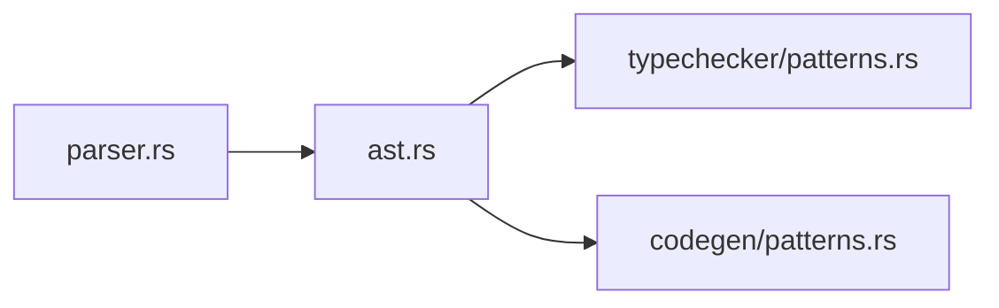

# 守卫子句

<cite>
**本文引用的文件**
- [patterns.rs](file://crates/ruyic/src/codegen/patterns.rs)
- [patterns.rs（类型检查）](file://crates/ruyic/src/typechecker/patterns.rs)
- [parser.rs](file://crates/ruyic/src/parser/parser.rs)
- [ast.rs](file://crates/ruyic/src/parser/ast.rs)
- [pattern_matching.ry](file://examples/pattern_matching.ry)
</cite>

## 目录
1. [引言](#引言)
2. [项目结构](#项目结构)
3. [核心组件](#核心组件)
4. [架构总览](#架构总览)
5. [详细组件分析](#详细组件分析)
6. [依赖分析](#依赖分析)
7. [性能考量](#性能考量)
8. [故障排查指南](#故障排查指南)
9. [结论](#结论)
10. [附录](#附录)

## 引言
本文件系统化梳理 Ruyi 语言中的“守卫子句”（guard clause），围绕其语法、求值顺序与作用域规则、与变量绑定的交互与生命周期管理、复杂条件判断实践、以及穷尽性检查的影响与编译器处理策略展开。内容基于解析器、类型检查器与代码生成器的实现细节，并结合示例程序进行说明。

## 项目结构
与守卫子句直接相关的模块分布如下：
- 解析层：负责将源码中的 if/guard 语法解析为 AST 节点
- 类型检查层：负责穷尽性与冗余性分析
- 代码生成层：负责将带守卫的匹配与条件分支编译为 LLVM IR

图表来源
- [parser.rs:1094-1125](file://crates/ruyic/src/parser/parser.rs#L1094-L1125)
- [ast.rs:171-175](file://crates/ruyic/src/parser/ast.rs#L171-L175)
- [patterns.rs（类型检查）:21-59](file://crates/ruyic/src/typechecker/patterns.rs#L21-L59)
- [patterns.rs:319-526](file://crates/ruyic/src/codegen/patterns.rs#L319-L526)
- [pattern_matching.ry:34-41](file://examples/pattern_matching.ry#L34-L41)

章节来源
- [parser.rs:1094-1125](file://crates/ruyic/src/parser/parser.rs#L1094-L1125)
- [ast.rs:171-175](file://crates/ruyic/src/parser/ast.rs#L171-L175)
- [patterns.rs（类型检查）:21-59](file://crates/ruyic/src/typechecker/patterns.rs#L21-L59)
- [patterns.rs:319-526](file://crates/ruyic/src/codegen/patterns.rs#L319-L526)
- [pattern_matching.ry:34-41](file://examples/pattern_matching.ry#L34-L41)

## 核心组件
- 语法节点与解析
  - 匹配臂包含可选的守卫表达式字段，解析时在 if 关键字后解析括号内的布尔表达式
  - AST 中的匹配臂结构明确包含 guard 字段
- 类型检查与穷尽性
  - 模式分析函数遍历所有匹配臂，统计被覆盖的“案例集合”，并据此判定是否穷尽、是否存在冗余
  - 守卫的存在会触发“顺序比较链”的代码生成路径，影响穷尽性判断的实现方式
- 代码生成与运行时行为
  - 对整数类型的匹配，若存在守卫则退化为顺序比较链；否则使用 switch
  - 在顺序比较链中，先进行模式匹配，再对守卫表达式求值，满足守卫才进入该臂体

章节来源
- [parser.rs:1094-1125](file://crates/ruyic/src/parser/parser.rs#L1094-L1125)
- [ast.rs:171-175](file://crates/ruyic/src/parser/ast.rs#L171-L175)
- [patterns.rs（类型检查）:21-59](file://crates/ruyic/src/typechecker/patterns.rs#L21-L59)
- [patterns.rs:319-526](file://crates/ruyic/src/codegen/patterns.rs#L319-L526)

## 架构总览
下图展示从源码到 IR 的关键流程，重点标注了守卫子句的插入点与求值顺序。

图表来源
- [parser.rs:1094-1125](file://crates/ruyic/src/parser/parser.rs#L1094-L1125)
- [ast.rs:171-175](file://crates/ruyic/src/parser/ast.rs#L171-L175)
- [patterns.rs（类型检查）:21-59](file://crates/ruyic/src/typechecker/patterns.rs#L21-L59)
- [patterns.rs:319-526](file://crates/ruyic/src/codegen/patterns.rs#L319-L526)

## 详细组件分析

### 语法与 AST 结构
- 匹配臂结构包含可选的 guard 字段，解析时在 if 关键字后解析括号内的表达式作为守卫
- if 表达式与 if 语句在解析阶段分别处理，但守卫子句仅出现在匹配臂与某些条件上下文中

章节来源
- [ast.rs:171-175](file://crates/ruyic/src/parser/ast.rs#L171-L175)
- [parser.rs:1094-1125](file://crates/ruyic/src/parser/parser.rs#L1094-L1125)
- [parser.rs:1766-1800](file://crates/ruyic/src/parser/parser.rs#L1766-L1800)

### 求值顺序与作用域规则
- 求值顺序
  - 先进行模式匹配，再对守卫表达式求值
  - 若守卫失败，则继续尝试下一个匹配臂
- 作用域规则
  - 模式绑定的变量在对应 arm 的作用域内可用
  - 变量绑定在 arm 块开始前完成，随后执行 arm 体或守卫求值
  - 顺序比较链中，每个 arm 都有独立的基本块，确保作用域隔离

章节来源
- [patterns.rs:495-522](file://crates/ruyic/src/codegen/patterns.rs#L495-L522)
- [patterns.rs:289-308](file://crates/ruyic/src/codegen/patterns.rs#L289-L308)

### 与变量绑定的交互与生命周期
- 绑定发生在 arm 基本块入口处，将 scrutinee 的值存储到栈槽并登记到当前作用域
- 绑定变量的生命周期与 arm 基本块一致，超出该块即失效
- 对象/数组等复杂模式会按字段/元素逐个解构并绑定局部变量

章节来源
- [patterns.rs:49-76](file://crates/ruyic/src/codegen/patterns.rs#L49-L76)
- [patterns.rs:78-139](file://crates/ruyic/src/codegen/patterns.rs#L78-L139)
- [patterns.rs:141-282](file://crates/ruyic/src/codegen/patterns.rs#L141-L282)

### 复杂条件判断示例
以下示例展示了守卫子句在实际场景中的应用，涵盖范围检查、类型验证与业务逻辑判断：
- 范围检查：根据数值区间选择不同处理路径
- 类型验证：通过守卫表达式限定可接受的类型范围
- 业务逻辑：结合模式绑定与守卫表达式实现复杂的业务分支

章节来源
- [pattern_matching.ry:34-41](file://examples/pattern_matching.ry#L34-L41)

### 穷尽性检查与编译器处理策略
- 穷尽性分析
  - 遍历所有匹配臂，收集每条模式所覆盖的“案例集合”
  - 若存在通配符或覆盖了全部可能，则视为穷尽；否则报告缺失案例
- 冗余性分析
  - 若某条臂覆盖的案例已被先前臂覆盖，则标记为冗余
- 编译器策略
  - 整数匹配：若存在守卫，退化为顺序比较链；否则使用 switch
  - 顺序比较链：逐臂检查模式匹配与守卫，满足守卫才进入 arm 体
  - 合并基本块：所有 arm 最终汇聚到合并块，确保控制流收敛

章节来源
- [patterns.rs（类型检查）:21-59](file://crates/ruyic/src/typechecker/patterns.rs#L21-L59)
- [patterns.rs:319-526](file://crates/ruyic/src/codegen/patterns.rs#L319-L526)

### 顺序比较链的控制流

图表来源
- [patterns.rs:396-526](file://crates/ruyic/src/codegen/patterns.rs#L396-L526)

## 依赖分析
- 解析器依赖 AST 定义，AST 中的 MatchArm 明确包含 guard 字段
- 类型检查依赖 AST 进行穷尽性与冗余性分析
- 代码生成依赖 AST 与类型信息，决定使用 switch 或顺序比较链

图表来源
- [parser.rs:1094-1125](file://crates/ruyic/src/parser/parser.rs#L1094-L1125)
- [ast.rs:171-175](file://crates/ruyic/src/parser/ast.rs#L171-L175)
- [patterns.rs（类型检查）:21-59](file://crates/ruyic/src/typechecker/patterns.rs#L21-L59)
- [patterns.rs:319-526](file://crates/ruyic/src/codegen/patterns.rs#L319-L526)

章节来源
- [parser.rs:1094-1125](file://crates/ruyic/src/parser/parser.rs#L1094-L1125)
- [ast.rs:171-175](file://crates/ruyic/src/parser/ast.rs#L171-L175)
- [patterns.rs（类型检查）:21-59](file://crates/ruyic/src/typechecker/patterns.rs#L21-L59)
- [patterns.rs:319-526](file://crates/ruyic/src/codegen/patterns.rs#L319-L526)

## 性能考量
- 无守卫的整数匹配使用 switch，分支跳转开销低
- 存在守卫时退化为顺序比较链，增加分支判断与守卫求值成本
- 对象/数组等复杂模式的解构与绑定引入额外内存访问与加载操作
- 建议在性能敏感路径尽量避免过多守卫，或通过预处理简化条件

## 故障排查指南
- 守卫语法错误
  - 症状：解析阶段报错，提示期望分号或大括号位置不正确
  - 排查：确认 if 关键字后括号内的表达式完整且合法
- 穷尽性告警
  - 症状：类型检查报告缺失案例或冗余臂
  - 排查：补充通配符或具体模式，移除重复覆盖的臂
- 控制流异常
  - 症状：arm 体未正确收敛至合并块
  - 排查：确保每个 arm 末尾有显式 return 或无返回的分支跳转

章节来源
- [parser.rs:1094-1125](file://crates/ruyic/src/parser/parser.rs#L1094-L1125)
- [patterns.rs（类型检查）:21-59](file://crates/ruyic/src/typechecker/patterns.rs#L21-L59)
- [patterns.rs:289-308](file://crates/ruyic/src/codegen/patterns.rs#L289-L308)

## 结论
守卫子句是 Ruyi 模式匹配的重要扩展，它允许在模式匹配成功后进一步以布尔表达式筛选分支。其实现贯穿解析、类型检查与代码生成三个层面：解析器负责将语法解析为 AST；类型检查器负责穷尽性与冗余性分析；代码生成器根据是否存在守卫选择最优的 IR 生成策略。理解其求值顺序、作用域与绑定生命周期，有助于编写清晰、高效且可维护的模式匹配代码。

## 附录
- 示例参考：示例程序展示了守卫子句在数字分类中的典型用法
- 语法要点：匹配臂的 if 条件必须用括号包裹，守卫表达式需为布尔类型

章节来源
- [pattern_matching.ry:34-41](file://examples/pattern_matching.ry#L34-L41)
- [parser.rs:1094-1125](file://crates/ruyic/src/parser/parser.rs#L1094-L1125)