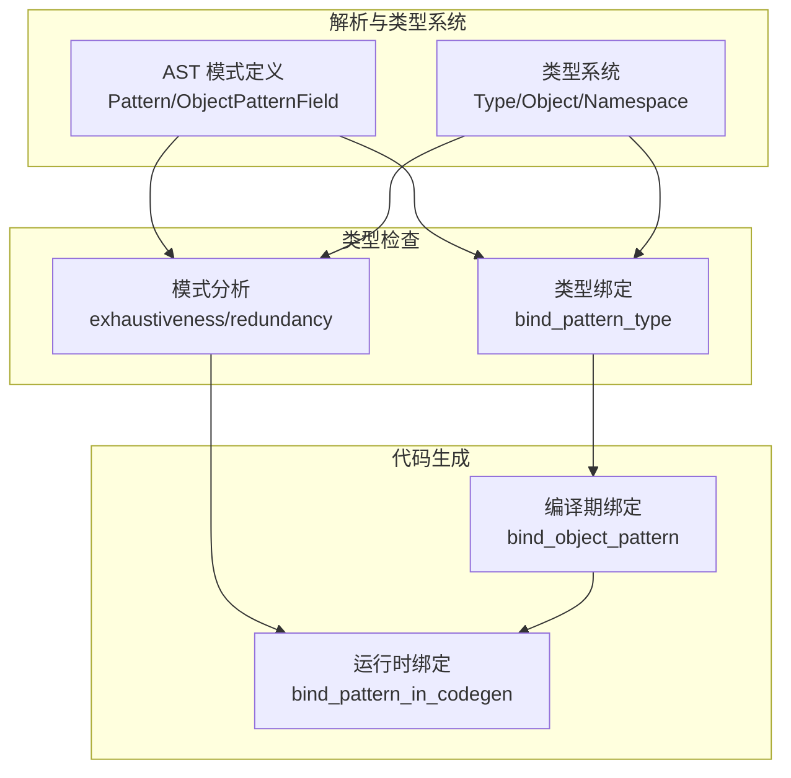
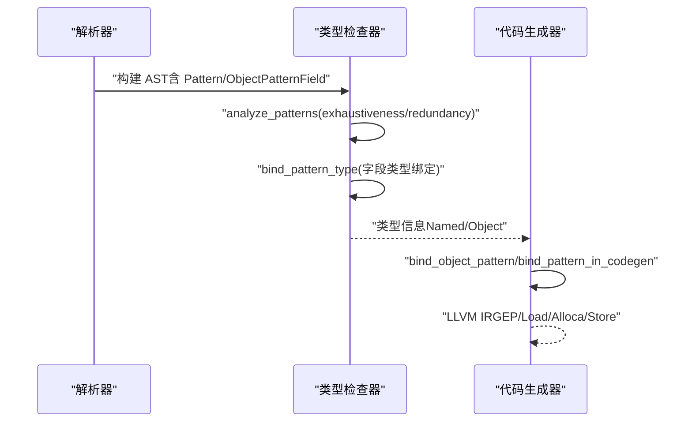
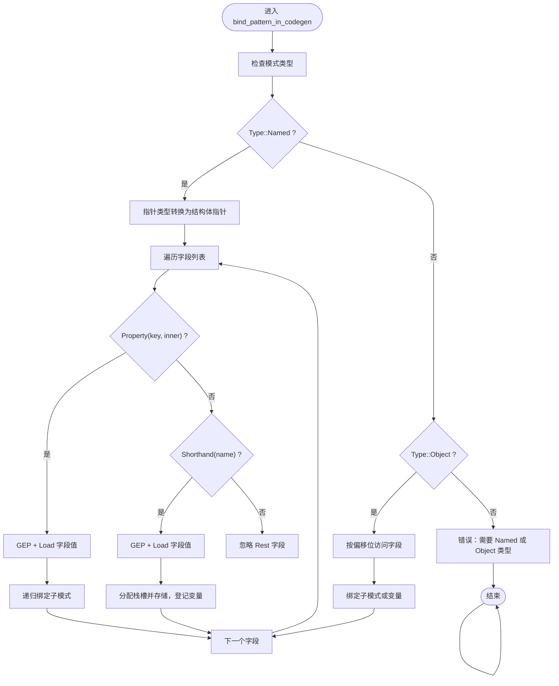
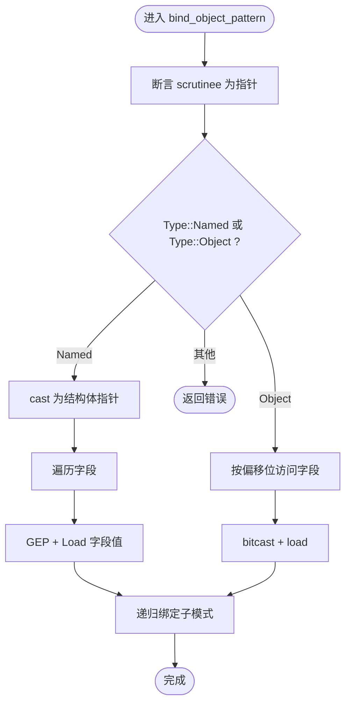
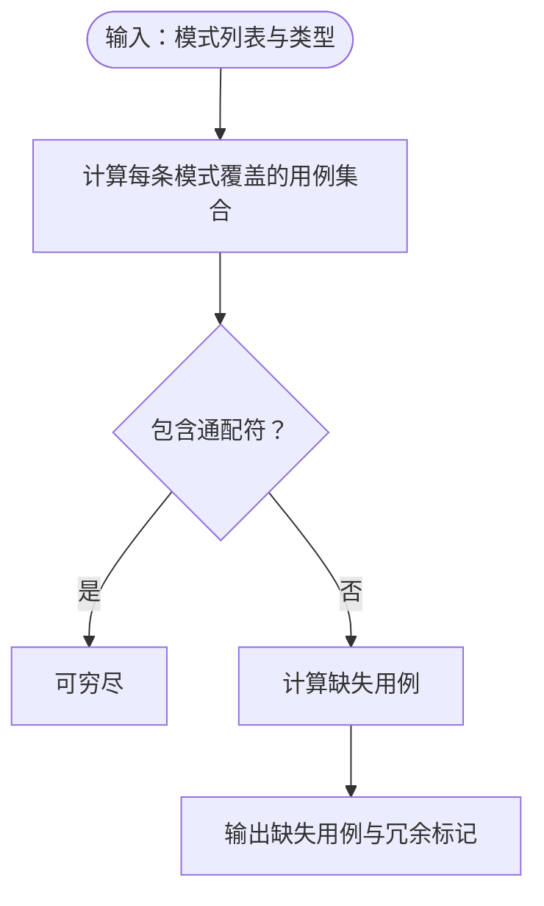
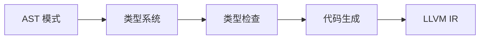

# 对象解构

<cite>
**本文引用的文件**
- [patterns.rs](file://crates/ruyic/src/codegen/patterns.rs)
- [stmt.rs](file://crates/ruyic/src/codegen/stmt.rs)
- [patterns.rs（类型检查）](file://crates/ruyic/src/typechecker/patterns.rs)
- [types.rs](file://crates/ruyic/src/typechecker/types.rs)
- [ast.rs](file://crates/ruyic/src/parser/ast.rs)
- [pattern_matching.ry](file://examples/pattern_matching.ry)
- [classes_and_objects.ry](file://examples/classes_and_objects.ry)
- [member_access.ry](file://crates/ruyic/tests/integration/cases/codegen/member_access.ry)
- [match.ry](file://crates/ruyic/tests/integration/cases/control_flow/match.ry)
</cite>

## 目录
1. [引言](#引言)
2. [项目结构](#项目结构)
3. [核心组件](#核心组件)
4. [架构总览](#架构总览)
5. [详细组件分析](#详细组件分析)
6. [依赖分析](#依赖分析)
7. [性能考虑](#性能考虑)
8. [故障排查指南](#故障排查指南)
9. [结论](#结论)
10. [附录](#附录)

## 引言
本文件围绕 Ruyi 语言中的“对象解构”进行系统化说明，重点覆盖以下方面：
- 类实例与对象字面量在模式匹配中的解构语法
- 字段访问模式与嵌套解构的实现方式
- 变量绑定与作用域规则
- 实际示例：属性访问与方法调用
- 复杂数据结构处理与性能考量
- 解构模式与类型系统的交互关系

## 项目结构
与对象解构相关的核心代码分布在编译器前端（AST 定义）、类型系统、类型检查、以及代码生成阶段：
- AST 定义了模式（Pattern）与对象字段（ObjectPatternField）
- 类型系统支持 Named 类型与 Object 结构体类型
- 类型检查负责可穷尽性与冗余性分析
- 代码生成负责将对象解构映射为 LLVM IR 的指针访问与加载

图表来源
- [ast.rs:428-454](file://crates/ruyic/src/parser/ast.rs#L428-L454)
- [types.rs:14-60](file://crates/ruyic/src/typechecker/types.rs#L14-L60)
- [patterns.rs（类型检查）:21-59](file://crates/ruyic/src/typechecker/patterns.rs#L21-L59)
- [patterns.rs（类型检查）:147-309](file://crates/ruyic/src/typechecker/patterns.rs#L147-L309)
- [stmt.rs:1047-1241](file://crates/ruyic/src/codegen/stmt.rs#L1047-L1241)
- [patterns.rs:141-282](file://crates/ruyic/src/codegen/patterns.rs#L141-L282)

章节来源
- [ast.rs:428-454](file://crates/ruyic/src/parser/ast.rs#L428-L454)
- [types.rs:14-60](file://crates/ruyic/src/typechecker/types.rs#L14-L60)

## 核心组件
- 模式与对象字段
  - Pattern 枚举包含 Object、Identifier、Wildcard、Literal、Or、As、Rest 等
  - ObjectPatternField 支持 Property(key, pattern)、Shorthand(name)、Rest(name)
- 类型系统
  - Type::Named 表示类名与字段签名；Type::Object 表示结构体字段列表
- 类型检查
  - analyze_patterns 提供可穷尽性与冗余性分析
  - bind_pattern_type 将对象字段类型绑定到子模式
- 代码生成
  - bind_object_pattern 针对 Named/Class 类型进行 GEP 加载
  - bind_pattern_in_codegen 针对 Object/Named 进行字段访问与变量绑定

章节来源
- [ast.rs:430-454](file://crates/ruyic/src/parser/ast.rs#L430-L454)
- [types.rs:14-60](file://crates/ruyic/src/typechecker/types.rs#L14-L60)
- [patterns.rs（类型检查）:21-59](file://crates/ruyic/src/typechecker/patterns.rs#L21-L59)
- [patterns.rs（类型检查）:147-309](file://crates/ruyic/src/typechecker/patterns.rs#L147-L309)
- [patterns.rs:141-282](file://crates/ruyic/src/codegen/patterns.rs#L141-L282)
- [stmt.rs:1047-1241](file://crates/ruyic/src/codegen/stmt.rs#L1047-L1241)

## 架构总览
对象解构在编译流程中的位置如下：

图表来源
- [ast.rs:428-454](file://crates/ruyic/src/parser/ast.rs#L428-L454)
- [patterns.rs（类型检查）:21-59](file://crates/ruyic/src/typechecker/patterns.rs#L21-L59)
- [patterns.rs（类型检查）:147-309](file://crates/ruyic/src/typechecker/patterns.rs#L147-L309)
- [patterns.rs:141-282](file://crates/ruyic/src/codegen/patterns.rs#L141-L282)
- [stmt.rs:1047-1241](file://crates/ruyic/src/codegen/stmt.rs#L1047-L1241)

## 详细组件分析

### 组件A：对象解构的运行时绑定（bind_pattern_in_codegen）
- 输入：表达式结果（ExprResult）与对象模式（Pattern::Object）
- 关键逻辑：
  - 若类型为 Named（类），通过 class_fields/class_struct_types 获取字段索引与 LLVM 结构体类型，使用 GEP 访问字段并加载值
  - 若类型为 Object（结构体），直接按偏移位访问字段并加载
  - 支持 Property(key, pattern) 与 Shorthand(name)，分别进行嵌套解构或简单绑定
- 变量绑定：
  - 使用 LLVM alloca 分配栈槽，store 当前值
  - 在 CodegenContext 中登记变量名与类型

图表来源
- [stmt.rs:1047-1241](file://crates/ruyic/src/codegen/stmt.rs#L1047-L1241)

章节来源
- [stmt.rs:1047-1241](file://crates/ruyic/src/codegen/stmt.rs#L1047-L1241)

### 组件B：对象解构的编译期绑定（bind_object_pattern）
- 输入：ExprResult（必须为指针）与对象字段列表
- 关键逻辑：
  - Named 类型：先 cast 到结构体指针，再 GEP 访问字段，load 后递归绑定子模式
  - Object 类型：直接 GEP 访问字段，bitcast 后 load，再绑定
- 错误处理：未知字段、非指针 scrutinee、无结构体类型等

图表来源
- [patterns.rs:141-282](file://crates/ruyic/src/codegen/patterns.rs#L141-L282)

章节来源
- [patterns.rs:141-282](file://crates/ruyic/src/codegen/patterns.rs#L141-L282)

### 组件C：类型系统与可穷尽性分析
- 可穷尽性分析：
  - analyze_patterns 基于覆盖集合判断是否需要通配符或剩余字段
  - 对 Object/Namespace 类型递归检查每个字段的覆盖情况
- 字段类型绑定：
  - bind_pattern_type 将对象字段类型传递给子模式，用于后续类型推导

图表来源
- [patterns.rs（类型检查）:21-59](file://crates/ruyic/src/typechecker/patterns.rs#L21-L59)
- [patterns.rs（类型检查）:147-309](file://crates/ruyic/src/typechecker/patterns.rs#L147-L309)

章节来源
- [patterns.rs（类型检查）:21-59](file://crates/ruyic/src/typechecker/patterns.rs#L21-L59)
- [patterns.rs（类型检查）:147-309](file://crates/ruyic/src/typechecker/patterns.rs#L147-L309)

### 组件D：变量绑定与作用域规则
- 绑定策略：
  - Identifier：分配栈槽并存储值，登记变量
  - As(inner, alias)：先绑定 inner，再以别名登记变量
  - Wildcard/Literal：不产生绑定
- 作用域：
  - 变量在当前基本块内可见，匹配结束后由控制流汇聚点统一处理
  - 嵌套解构中，子模式的变量作用域与父模式独立但共享同一作用域上下文

章节来源
- [patterns.rs:49-76](file://crates/ruyic/src/codegen/patterns.rs#L49-L76)
- [stmt.rs:1047-1241](file://crates/ruyic/src/codegen/stmt.rs#L1047-L1241)

### 组件E：字段访问模式与嵌套解构
- 字段访问模式：
  - Property(key, pattern)：从对象中取出对应字段，递归绑定子模式
  - Shorthand(name)：将整个字段值绑定到 name
- 嵌套解构：
  - 子模式可以是 Identifier、Wildcard、Literal、Or、As、Rest、Array、Object 等
  - 通过递归调用 bind_pattern/bind_pattern_in_codegen 实现

章节来源
- [ast.rs:443-447](file://crates/ruyic/src/parser/ast.rs#L443-L447)
- [patterns.rs:141-282](file://crates/ruyic/src/codegen/patterns.rs#L141-L282)
- [stmt.rs:1047-1241](file://crates/ruyic/src/codegen/stmt.rs#L1047-L1241)

### 组件F：实际示例与用法
- 类实例解构示例（来自教程与测试）
  - 类定义与成员访问：Point、Rectangle、Circle、Triangle 等
  - 成员访问与可选链：p.x、p?.x、p["y"]
  - 模式匹配中的对象解构：match response.status 并在分支中使用 response.body
- 示例路径
  - [classes_and_objects.ry:11-29](file://examples/classes_and_objects.ry#L11-L29)
  - [classes_and_objects.ry:133-149](file://examples/classes_and_objects.ry#L133-L149)
  - [pattern_matching.ry:46-67](file://examples/pattern_matching.ry#L46-L67)
  - [member_access.ry:1-18](file://crates/ruyic/tests/integration/cases/codegen/member_access.ry#L1-L18)

章节来源
- [classes_and_objects.ry:11-29](file://examples/classes_and_objects.ry#L11-L29)
- [classes_and_objects.ry:133-149](file://examples/classes_and_objects.ry#L133-L149)
- [pattern_matching.ry:46-67](file://examples/pattern_matching.ry#L46-L67)
- [member_access.ry:1-18](file://crates/ruyic/tests/integration/cases/codegen/member_access.ry#L1-L18)

## 依赖分析
- 模式定义依赖类型系统（Type::Named/Type::Object）
- 类型检查依赖 AST 模式与类型系统
- 代码生成依赖类型检查结果与 LLVM IR 工具链
- 运行时绑定与编译期绑定共同保证对象解构的正确性与性能

图表来源
- [ast.rs:428-454](file://crates/ruyic/src/parser/ast.rs#L428-L454)
- [types.rs:14-60](file://crates/ruyic/src/typechecker/types.rs#L14-L60)
- [patterns.rs（类型检查）:21-59](file://crates/ruyic/src/typechecker/patterns.rs#L21-L59)
- [patterns.rs:141-282](file://crates/ruyic/src/codegen/patterns.rs#L141-L282)
- [stmt.rs:1047-1241](file://crates/ruyic/src/codegen/stmt.rs#L1047-L1241)

章节来源
- [ast.rs:428-454](file://crates/ruyic/src/parser/ast.rs#L428-L454)
- [types.rs:14-60](file://crates/ruyic/src/typechecker/types.rs#L14-L60)
- [patterns.rs（类型检查）:21-59](file://crates/ruyic/src/typechecker/patterns.rs#L21-L59)
- [patterns.rs:141-282](file://crates/ruyic/src/codegen/patterns.rs#L141-L282)
- [stmt.rs:1047-1241](file://crates/ruyic/src/codegen/stmt.rs#L1047-L1241)

## 性能考虑
- 指针访问与加载
  - Named 类型通过结构体内存布局访问字段，GEP + Load 是 O(1) 操作
  - Object 类型按固定偏移访问，避免额外函数调用
- 栈分配与局部变量
  - 使用 alloca 分配局部变量，减少堆分配开销
- 控制流优化
  - 可穷尽性分析有助于消除不必要的默认分支，降低运行时判断成本
- 嵌套解构
  - 递归绑定在编译期展开，运行时仅保留必要的指针算术与加载

## 故障排查指南
- 常见错误与定位
  - “Object pattern requires pointer”：解构目标不是指针类型
  - “Unknown field: …”：字段名不存在于类或对象类型定义
  - “No struct type for class”：类结构体类型未注册
  - “Object pattern requires Named or Object type”：模式类型不匹配
- 排查步骤
  - 确认类型系统中类字段与对象字段定义一致
  - 检查类型检查阶段的可穷尽性报告，确认缺失用例
  - 核对代码生成阶段的 GEP 偏移与字段顺序
- 相关实现参考
  - [patterns.rs:141-282](file://crates/ruyic/src/codegen/patterns.rs#L141-L282)
  - [stmt.rs:1047-1241](file://crates/ruyic/src/codegen/stmt.rs#L1047-L1241)
  - [patterns.rs（类型检查）:21-59](file://crates/ruyic/src/typechecker/patterns.rs#L21-L59)

章节来源
- [patterns.rs:141-282](file://crates/ruyic/src/codegen/patterns.rs#L141-L282)
- [stmt.rs:1047-1241](file://crates/ruyic/src/codegen/stmt.rs#L1047-L1241)
- [patterns.rs（类型检查）:21-59](file://crates/ruyic/src/typechecker/patterns.rs#L21-L59)

## 结论
Ruyi 的对象解构在类型系统与代码生成层面实现了强一致性与高性能：
- 通过 Named/Object 类型区分类实例与结构体对象
- 类型检查确保可穷尽性与冗余性，减少运行时分支
- 代码生成将解构映射为高效的 GEP/Load/Alloca/Store 序列
- 支持字段访问模式与嵌套解构，满足复杂数据结构处理需求

## 附录
- 相关示例与测试
  - [pattern_matching.ry:46-67](file://examples/pattern_matching.ry#L46-L67)
  - [classes_and_objects.ry:11-29](file://examples/classes_and_objects.ry#L11-L29)
  - [member_access.ry:1-18](file://crates/ruyic/tests/integration/cases/codegen/member_access.ry#L1-L18)
  - [match.ry:1-53](file://crates/ruyic/tests/integration/cases/control_flow/match.ry#L1-L53)