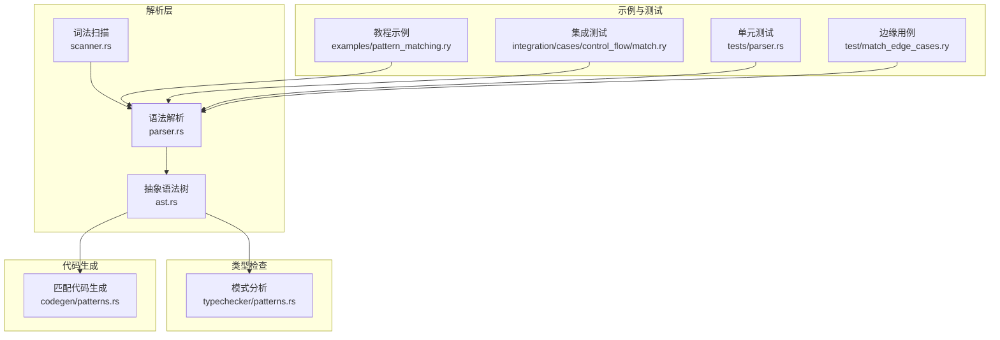
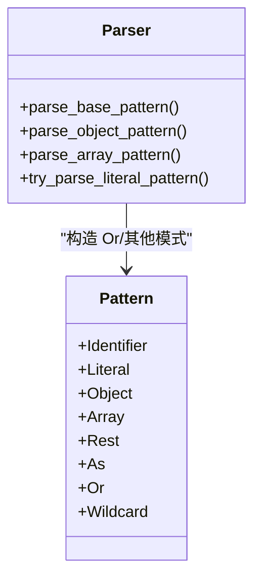
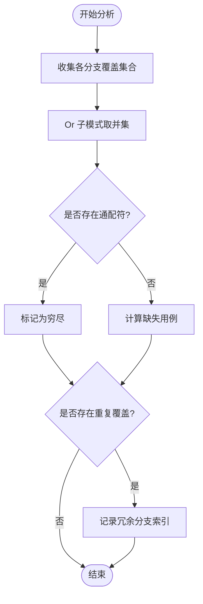
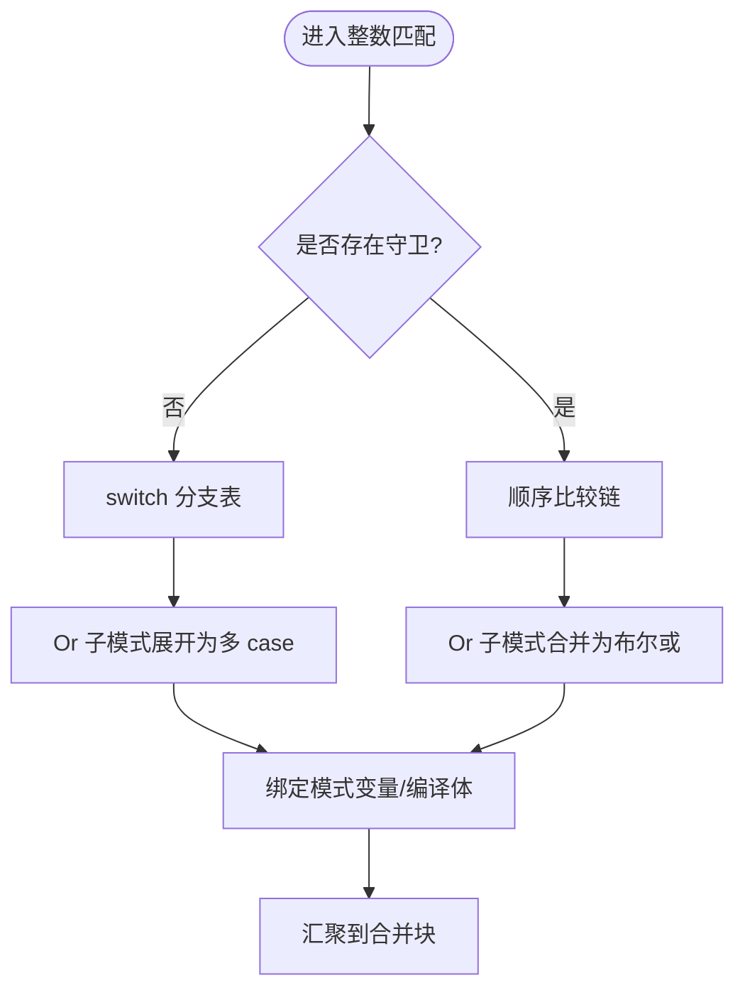
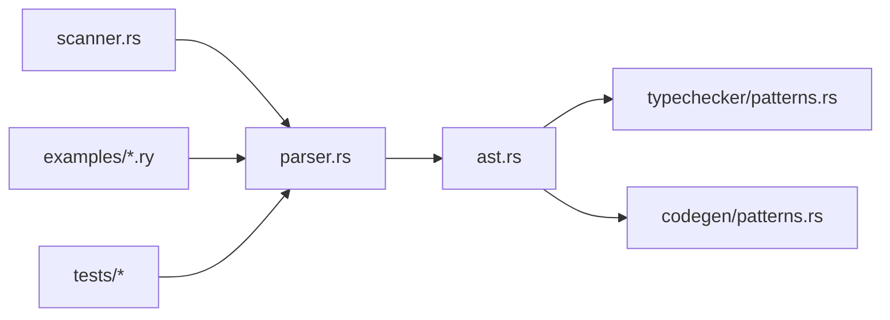

# 或模式

<cite>
**本文引用的文件**
- [crates/ruyic/src/parser/ast.rs](file://crates/ruyic/src/parser/ast.rs)
- [crates/ruyic/src/parser/parser.rs](file://crates/ruyic/src/parser/parser.rs)
- [crates/ruyic/src/codegen/patterns.rs](file://crates/ruyic/src/codegen/patterns.rs)
- [crates/ruyic/src/typechecker/patterns.rs](file://crates/ruyic/src/typechecker/patterns.rs)
- [examples/pattern_matching.ry](file://examples/pattern_matching.ry)
- [crates/ruyic/tests/integration/cases/control_flow/match.ry](file://crates/ruyic/tests/integration/cases/control_flow/match.ry)
- [crates/ruyic/tests/parser.rs](file://crates/ruyic/tests/parser.rs)
- [test/match_edge_cases.ry](file://test/match_edge_cases.ry)
</cite>

## 目录
1. [引言](#引言)
2. [项目结构](#项目结构)
3. [核心组件](#核心组件)
4. [架构总览](#架构总览)
5. [详细组件分析](#详细组件分析)
6. [依赖关系分析](#依赖关系分析)
7. [性能考量](#性能考量)
8. [故障排查指南](#故障排查指南)
9. [结论](#结论)
10. [附录](#附录)

## 引言
本篇文档系统梳理 Ruyi 语言中的“或模式”（Pattern Or），围绕其语法、类型系统与穷尽性检查、代码生成路径、与其它模式类型的组合使用、优先级与与其他运算符的关系，以及在简化代码与提升可读性方面的价值展开，并通过仓库内的示例与测试给出实践参考。

## 项目结构
与“或模式”直接相关的关键模块如下：
- 词法与语法：识别“|”作为分隔符，构建 AST 中的 Pattern::Or 节点
- 类型检查：对匹配表达式进行穷尽性与冗余性分析，支持 Or 模式的覆盖集合计算
- 代码生成：针对整数/布尔/字符串等类型，或模式在 switch/顺序比较链中的分支合并策略
- 示例与测试：演示常见用法、嵌套匹配、守卫与返回、字符串匹配等



图表来源
- [crates/ruyic/src/parser/ast.rs:430-440](file://crates/ruyic/src/parser/ast.rs#L430-L440)
- [crates/ruyic/src/parser/parser.rs:2037-2111](file://crates/ruyic/src/parser/parser.rs#L2037-L2111)
- [crates/ruyic/src/typechecker/patterns.rs:20-59](file://crates/ruyic/src/typechecker/patterns.rs#L20-L59)
- [crates/ruyic/src/codegen/patterns.rs:25-43](file://crates/ruyic/src/codegen/patterns.rs#L25-L43)

章节来源
- [crates/ruyic/src/parser/ast.rs:430-440](file://crates/ruyic/src/parser/ast.rs#L430-L440)
- [crates/ruyic/src/parser/parser.rs:2037-2111](file://crates/ruyic/src/parser/parser.rs#L2037-L2111)
- [crates/ruyic/src/typechecker/patterns.rs:20-59](file://crates/ruyic/src/typechecker/patterns.rs#L20-L59)
- [crates/ruyic/src/codegen/patterns.rs:25-43](file://crates/ruyic/src/codegen/patterns.rs#L25-L43)

## 核心组件
- AST 中的 Pattern::Or 表示由“|”连接的一组子模式；解析器将其作为独立的 Pattern 节点存储
- 类型检查器在穷尽性分析时，将 Or 模式视为“任一子模式覆盖”的集合，从而影响缺失用例与冗余判定
- 代码生成器在整数/布尔/字符串等类型上，将 Or 子模式映射为多条分支或布尔或运算，以保证匹配正确性

章节来源
- [crates/ruyic/src/parser/ast.rs:430-440](file://crates/ruyic/src/parser/ast.rs#L430-L440)
- [crates/ruyic/src/typechecker/patterns.rs:84-88](file://crates/ruyic/src/typechecker/patterns.rs#L84-L88)
- [crates/ruyic/src/codegen/patterns.rs:360-368](file://crates/ruyic/src/codegen/patterns.rs#L360-L368)

## 架构总览
下图展示了从源码到运行时的行为路径：词法与语法解析生成 AST，类型检查决定穷尽性与冗余，代码生成将匹配转换为 LLVM IR 分支结构。

```mermaid
sequenceDiagram
participant Src as "源码"
participant Lex as "词法扫描"
participant Par as "语法解析"
participant AST as "AST"
participant TC as "类型检查"
participant CG as "代码生成"
Src->>Lex : 输入字符流
Lex-->>Par : 产生记号序列
Par-->>AST : 构建语法树含 Or 模式
AST->>TC : 提供模式列表与类型
TC-->>AST : 穷尽性/冗余分析结果
AST->>CG : 生成匹配分支switch/顺序链
CG-->>Src : 输出 IR分支/合并块
```

图表来源
- [crates/ruyic/src/parser/parser.rs:2037-2111](file://crates/ruyic/src/parser/parser.rs#L2037-L2111)
- [crates/ruyic/src/typechecker/patterns.rs:20-59](file://crates/ruyic/src/typechecker/patterns.rs#L20-L59)
- [crates/ruyic/src/codegen/patterns.rs:25-43](file://crates/ruyic/src/codegen/patterns.rs#L25-L43)

## 详细组件分析

### 语法与 AST 定义
- “或模式”在语法层面由“|”分隔多个子模式，解析器将其封装为 Pattern::Or
- 解析器还处理“as 模式”“通配符”“字面量”“数组/对象解构”等模式，共同构成完整的匹配表达式



图表来源
- [crates/ruyic/src/parser/ast.rs:430-440](file://crates/ruyic/src/parser/ast.rs#L430-L440)
- [crates/ruyic/src/parser/parser.rs:2037-2111](file://crates/ruyic/src/parser/parser.rs#L2037-L2111)

章节来源
- [crates/ruyic/src/parser/ast.rs:430-440](file://crates/ruyic/src/parser/ast.rs#L430-L440)
- [crates/ruyic/src/parser/parser.rs:2037-2111](file://crates/ruyic/src/parser/parser.rs#L2037-L2111)

### 类型检查与穷尽性
- 对 Or 模式，类型检查器将其覆盖集合视为所有子模式覆盖集合的并集
- 若存在通配符或已覆盖全部可能，则整体匹配为穷尽；否则报告缺失用例
- 若某子模式与之前出现的模式覆盖重复，标记冗余并指出冗余的分支索引



图表来源
- [crates/ruyic/src/typechecker/patterns.rs:20-59](file://crates/ruyic/src/typechecker/patterns.rs#L20-L59)
- [crates/ruyic/src/typechecker/patterns.rs:84-88](file://crates/ruyic/src/typechecker/patterns.rs#L84-L88)

章节来源
- [crates/ruyic/src/typechecker/patterns.rs:20-59](file://crates/ruyic/src/typechecker/patterns.rs#L20-L59)
- [crates/ruyic/src/typechecker/patterns.rs:84-88](file://crates/ruyic/src/typechecker/patterns.rs#L84-L88)

### 代码生成与执行路径
- 整数/布尔/字符串等类型的匹配在无守卫时优先采用 switch/icmp 链；当存在守卫时退化为顺序比较链
- Or 模式在 switch 中被展开为多条 case；在顺序链中通过布尔或运算合并多个相等判断
- 未命中任何分支且无默认时，生成不可达陷阱块以确保穷尽性



图表来源
- [crates/ruyic/src/codegen/patterns.rs:319-331](file://crates/ruyic/src/codegen/patterns.rs#L319-L331)
- [crates/ruyic/src/codegen/patterns.rs:334-394](file://crates/ruyic/src/codegen/patterns.rs#L334-L394)
- [crates/ruyic/src/codegen/patterns.rs:400-526](file://crates/ruyic/src/codegen/patterns.rs#L400-L526)

章节来源
- [crates/ruyic/src/codegen/patterns.rs:319-331](file://crates/ruyic/src/codegen/patterns.rs#L319-L331)
- [crates/ruyic/src/codegen/patterns.rs:334-394](file://crates/ruyic/src/codegen/patterns.rs#L334-L394)
- [crates/ruyic/src/codegen/patterns.rs:400-526](file://crates/ruyic/src/codegen/patterns.rs#L400-L526)

### 与其它模式类型的组合
- Or 模式可与 as 模式组合，例如“val as v”形式的别名绑定在 Or 的每个子模式上均生效
- Or 模式可与字面量、通配符、数组/对象解构等混合使用，形成复杂但清晰的匹配结构
- 在对象/数组解构中，Or 可用于字段值的多种可能形态

章节来源
- [crates/ruyic/src/parser/parser.rs:2059-2063](file://crates/ruyic/src/parser/parser.rs#L2059-L2063)
- [crates/ruyic/src/typechecker/patterns.rs:89-94](file://crates/ruyic/src/typechecker/patterns.rs#L89-L94)

### 优先级与与其他运算符的关系
- “|”在匹配模式中用于连接多个子模式，与二元位运算“|”不同，二者语境不同
- 二元位运算“|”在表达式中具有特定的结合性与优先级；匹配模式中的“|”仅作用于模式解析
- 测试用例验证了“||”“|”在表达式与模式中的不同行为

章节来源
- [crates/ruyic/src/parser/parser.rs:2173-2175](file://crates/ruyic/src/parser/parser.rs#L2173-L2175)
- [crates/ruyic/tests/parser.rs:969-999](file://crates/ruyic/tests/parser.rs#L969-L999)

### 使用场景与最佳实践
- 多值统一处理：将一组等价的字面量或标识符归并到一个分支，减少重复代码
- 与守卫配合：在 Or 内部使用守卫表达更复杂的条件
- 与 as 模式配合：在统一处理的同时保留原始值的别名
- 与对象/数组解构配合：对结构化数据的某些字段提供多种可能形态

章节来源
- [examples/pattern_matching.ry:23-29](file://examples/pattern_matching.ry#L23-L29)
- [crates/ruyic/tests/integration/cases/control_flow/match.ry:1-53](file://crates/ruyic/tests/integration/cases/control_flow/match.ry#L1-L53)

### 实际代码示例（路径引用）
- 基础或模式示例：[examples/pattern_matching.ry:23-29](file://examples/pattern_matching.ry#L23-L29)
- 字符串匹配与守卫：[crates/ruyic/tests/integration/cases/control_flow/match.ry:10-16](file://crates/ruyic/tests/integration/cases/control_flow/match.ry#L10-L16)
- 嵌套匹配与返回：[test/match_edge_cases.ry:8-25](file://test/match_edge_cases.ry#L8-L25)
- 或模式与 as 组合：[crates/ruyic/tests/parser.rs:1846-1858](file://crates/ruyic/tests/parser.rs#L1846-L1858)

## 依赖关系分析
- 解析层依赖词法扫描器输出记号，再根据语法规则生成 AST
- 类型检查依赖 AST 中的模式与类型信息，输出穷尽性与冗余性诊断
- 代码生成依赖类型检查结果与 AST，生成 LLVM IR 分支与合并块
- 示例与测试驱动开发，验证解析、类型检查与代码生成的正确性



图表来源
- [crates/ruyic/src/parser/parser.rs:2037-2111](file://crates/ruyic/src/parser/parser.rs#L2037-L2111)
- [crates/ruyic/src/typechecker/patterns.rs:20-59](file://crates/ruyic/src/typechecker/patterns.rs#L20-L59)
- [crates/ruyic/src/codegen/patterns.rs:25-43](file://crates/ruyic/src/codegen/patterns.rs#L25-L43)

章节来源
- [crates/ruyic/src/parser/parser.rs:2037-2111](file://crates/ruyic/src/parser/parser.rs#L2037-L2111)
- [crates/ruyic/src/typechecker/patterns.rs:20-59](file://crates/ruyic/src/typechecker/patterns.rs#L20-L59)
- [crates/ruyic/src/codegen/patterns.rs:25-43](file://crates/ruyic/src/codegen/patterns.rs#L25-L43)

## 性能考量
- 无守卫的整数匹配优先采用 switch，Or 模式在 switch 中展开为多 case，时间复杂度与分支数量线性相关
- 存在守卫时退化为顺序比较链，Or 子模式通过布尔或运算合并，增加一次布尔或操作
- 字符串匹配依赖指针比较或 strcmp 链，Or 模式按顺序尝试匹配，注意避免过长的 Or 列表导致性能下降
- 对象/数组解构的 Or 模式会递归展开子模式，建议保持子模式简洁以降低类型检查与生成成本

## 故障排查指南
- 穷尽性错误：若 Or 模式未覆盖全部可能值且无通配符，默认分支缺失会导致编译报错
- 冗余分支：若某 Or 子模式与先前分支覆盖重复，类型检查会报告冗余并给出分支索引
- 运算符混淆：表达式中的“|”与模式中的“|”语义不同，注意区分
- 边界用例：嵌套匹配、守卫、返回语句、字符串匹配等场景需结合测试用例验证行为一致性

章节来源
- [crates/ruyic/src/typechecker/patterns.rs:20-59](file://crates/ruyic/src/typechecker/patterns.rs#L20-L59)
- [crates/ruyic/tests/parser.rs:969-999](file://crates/ruyic/tests/parser.rs#L969-L999)
- [test/match_edge_cases.ry:8-25](file://test/match_edge_cases.ry#L8-L25)

## 结论
或模式在 Ruyi 中提供了简洁而强大的多值匹配能力：它既能在语法层面减少重复，又能在类型检查与代码生成阶段被一致地处理。通过与 as、守卫、对象/数组解构等模式的组合，开发者可以以更少的样板代码表达更丰富的控制流，同时借助穷尽性检查与冗余检测保障代码质量。

## 附录
- 更多示例与用法参见：[examples/pattern_matching.ry](file://examples/pattern_matching.ry)
- 集成测试用例：[crates/ruyic/tests/integration/cases/control_flow/match.ry](file://crates/ruyic/tests/integration/cases/control_flow/match.ry)
- 单元测试与解析验证：[crates/ruyic/tests/parser.rs](file://crates/ruyic/tests/parser.rs)
- 边缘用例与嵌套匹配：[test/match_edge_cases.ry](file://test/match_edge_cases.ry)