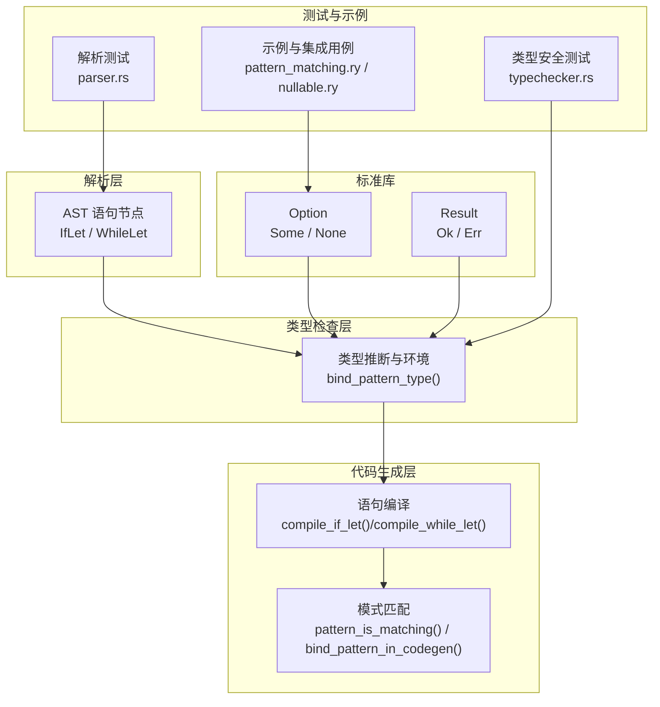
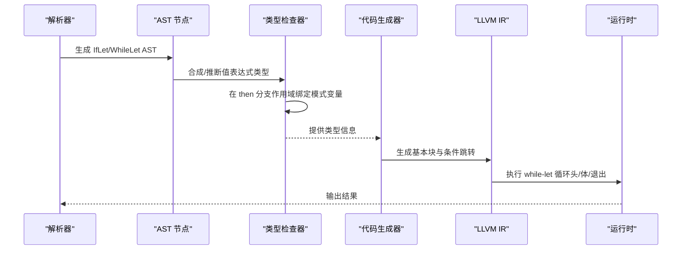
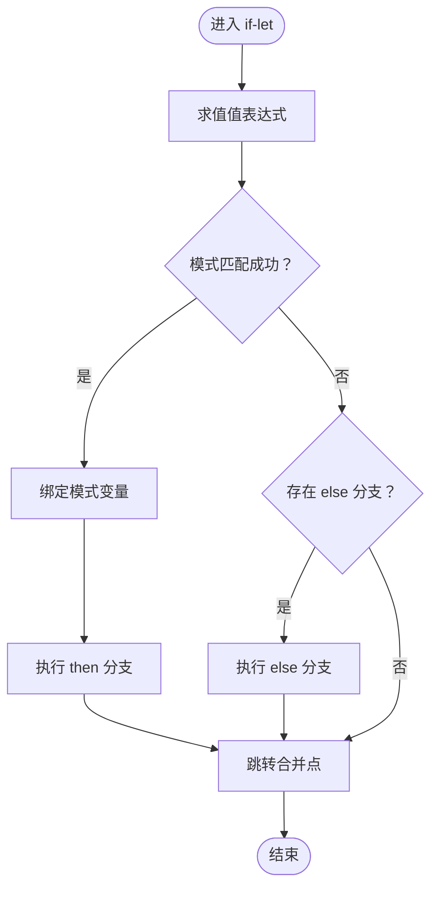
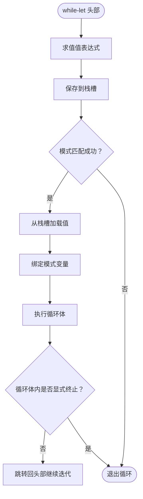
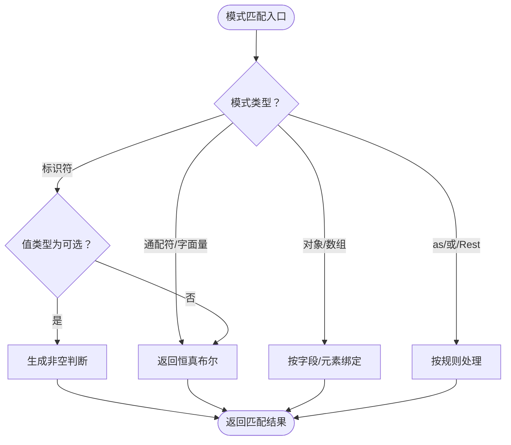
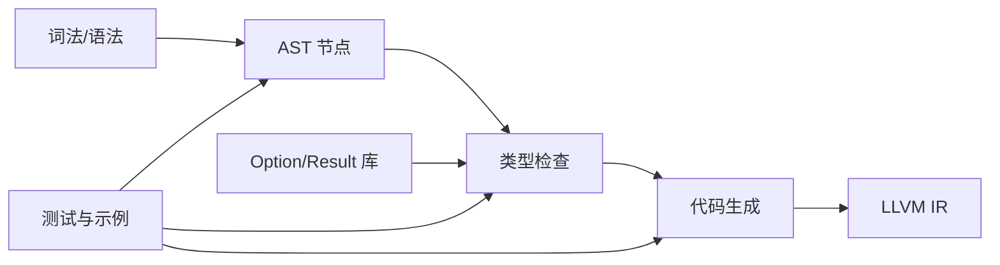

# 条件赋值语句

<cite>
**本文引用的文件**
- [ast.rs](file://crates/ruyic/src/parser/ast.rs)
- [stmt.rs](file://crates/ruyic/src/codegen/stmt.rs)
- [patterns.rs](file://crates/ruyic/src/codegen/patterns.rs)
- [inference.rs](file://crates/ruyic/src/typechecker/inference.rs)
- [parser.rs](file://crates/ruyic/tests/parser.rs)
- [typechecker.rs](file://crates/ruyic/tests/typechecker.rs)
- [nullable.ry](file://crates/ruyic/tests/integration/cases/types/nullable.ry)
- [option.ry](file://stdlib/option.ry)
- [result.ry](file://stdlib/result.ry)
- [pattern_matching.ry](file://examples/pattern_matching.ry)
- [control_flow.ry](file://examples/control_flow.ry)
- [if_else.ry](file://crates/ruyic/tests/integration/cases/control_flow/if_else.ry)
- [loops.ry](file://crates/ruyic/tests/integration/cases/control_flow/loops.ry)
</cite>

## 目录
1. [引言](#引言)
2. [项目结构](#项目结构)
3. [核心组件](#核心组件)
4. [架构总览](#架构总览)
5. [详细组件分析](#详细组件分析)
6. [依赖关系分析](#依赖关系分析)
7. [性能考量](#性能考量)
8. [故障排查指南](#故障排查指南)
9. [结论](#结论)
10. [附录](#附录)

## 引言
本文件系统性地阐述 Ruyi 语言中的 if-let 与 while-let 两种“条件赋值”语句：  
- if-let：在匹配成功时将表达式结果绑定到变量，支持可选类型（null-safe）与模式匹配；  
- while-let：在每次迭代中对表达式进行模式匹配并继续循环，直到不匹配为止。

文档重点覆盖语法结构、类型推断与代码生成、空值安全处理、迭代器使用、错误处理与最佳实践，并通过仓库内现有测试与示例给出可直接参考的路径与用法。

## 项目结构
围绕 if-let/while-let 的实现涉及以下关键模块：
- 解析层：AST 中定义了 IfLet 与 WhileLet 两类语句节点；
- 类型检查层：为 if-let 绑定模式变量并进行分支类型统一；
- 代码生成层：将 if-let/while-let 编译为 LLVM IR 基本块与条件跳转；
- 标准库：Option/Result 类型用于表示可选与可能失败的计算；
- 测试与示例：验证语法解析、类型安全与运行行为。

**图表来源**
- [ast.rs:94-155](file://crates/ruyic/src/parser/ast.rs#L94-L155)
- [inference.rs:512-531](file://crates/ruyic/src/typechecker/inference.rs#L512-L531)
- [stmt.rs:912-983](file://crates/ruyic/src/codegen/stmt.rs#L912-L983)
- [patterns.rs:45-76](file://crates/ruyic/src/codegen/patterns.rs#L45-L76)
- [option.ry:14-266](file://stdlib/option.ry#L14-L266)
- [result.ry:18-304](file://stdlib/result.ry#L18-L304)

**章节来源**
- [ast.rs:94-155](file://crates/ruyic/src/parser/ast.rs#L94-L155)
- [stmt.rs:912-983](file://crates/ruyic/src/codegen/stmt.rs#L912-L983)
- [patterns.rs:45-76](file://crates/ruyic/src/codegen/patterns.rs#L45-L76)
- [inference.rs:512-531](file://crates/ruyic/src/typechecker/inference.rs#L512-L531)
- [option.ry:14-266](file://stdlib/option.ry#L14-L266)
- [result.ry:18-304](file://stdlib/result.ry#L18-L304)

## 核心组件
- 语法节点
  - IfLet：包含模式、值表达式、then 分支与可选 else 分支；
  - WhileLet：包含模式、值表达式与循环体。
- 类型检查
  - 推导值表达式的类型后，在 then 分支作用域内绑定模式变量；
  - 对 else 分支进行类型推断并与 then 分支进行最小上界合并。
- 代码生成
  - if-let：生成条件分支，匹配成功则绑定模式并执行 then 分支，否则执行 else 分支或进入合并点；
  - while-let：在循环头部评估表达式并进行模式匹配，匹配成功则加载已保存值、绑定模式并执行循环体，最后无显式返回则回到头部继续迭代。

**章节来源**
- [ast.rs:103-117](file://crates/ruyic/src/parser/ast.rs#L103-L117)
- [inference.rs:512-531](file://crates/ruyic/src/typechecker/inference.rs#L512-L531)
- [stmt.rs:912-983](file://crates/ruyic/src/codegen/stmt.rs#L912-L983)

## 架构总览
下图展示从解析到运行时的关键流程：解析器产出 AST → 类型检查器推断类型并建立作用域 → 代码生成器生成 LLVM IR → 运行时按基本块执行。

**图表来源**
- [ast.rs:103-117](file://crates/ruyic/src/parser/ast.rs#L103-L117)
- [inference.rs:512-531](file://crates/ruyic/src/typechecker/inference.rs#L512-L531)
- [stmt.rs:940-983](file://crates/ruyic/src/codegen/stmt.rs#L940-L983)

## 详细组件分析

### if-let 语句
- 语法与 AST
  - AST 中的 IfLet 包含模式、值表达式、then 分支与可选 else 分支；
  - 解析测试覆盖了 if-let 与 if-let-else 的情形。
- 类型推断
  - 先合成值表达式的类型，再在 then 分支作用域内绑定模式变量；
  - 对 else 分支进行类型推断，若存在则与 then 分支类型取最小上界。
- 代码生成
  - 生成 then/else 两个分支与合并基本块；
  - 在 then 分支中绑定模式变量后执行 then 语句，若未显式返回则跳转至合并点；
  - 在 else 分支中执行 else 语句（若存在），同样确保无终止指令时跳转合并点。

**图表来源**
- [stmt.rs:912-938](file://crates/ruyic/src/codegen/stmt.rs#L912-L938)
- [inference.rs:512-531](file://crates/ruyic/src/typechecker/inference.rs#L512-L531)

**章节来源**
- [ast.rs:103-108](file://crates/ruyic/src/parser/ast.rs#L103-L108)
- [parser.rs:592-618](file://crates/ruyic/tests/parser.rs#L592-L618)
- [inference.rs:512-531](file://crates/ruyic/src/typechecker/inference.rs#L512-L531)
- [stmt.rs:912-938](file://crates/ruyic/src/codegen/stmt.rs#L912-L938)

### while-let 语句
- 语法与 AST
  - AST 中的 WhileLet 包含模式、值表达式与循环体；
  - 解析测试覆盖 while-let 的情形。
- 代码生成
  - 循环包含 header/body/exit 三个基本块；
  - 在 header 中求值表达式并保存到栈槽，随后进行模式匹配；
  - 若匹配成功，则加载保存的值、绑定模式变量、执行循环体，并在循环体末尾无显式返回时跳回 header；
  - 若不匹配，则跳转至 exit 基本块结束循环。

**图表来源**
- [stmt.rs:940-983](file://crates/ruyic/src/codegen/stmt.rs#L940-L983)

**章节来源**
- [ast.rs:113-117](file://crates/ruyic/src/parser/ast.rs#L113-L117)
- [parser.rs:641-653](file://crates/ruyic/tests/parser.rs#L641-L653)
- [stmt.rs:940-983](file://crates/ruyic/src/codegen/stmt.rs#L940-L983)

### 模式匹配与绑定
- 模式匹配
  - 支持通配符、字面量、对象/数组解构、as 别名、或模式等；
  - 对于可选类型（Nullable/Null），当模式为标识符时，生成非空判断（指针判空或整数哨兵判非全一）。
- 变量绑定
  - 在代码生成阶段为标识符模式分配栈空间并存储值，同时登记到符号表。

**图表来源**
- [patterns.rs:45-76](file://crates/ruyic/src/codegen/patterns.rs#L45-L76)
- [stmt.rs:985-1045](file://crates/ruyic/src/codegen/stmt.rs#L985-L1045)

**章节来源**
- [patterns.rs:45-76](file://crates/ruyic/src/codegen/patterns.rs#L45-L76)
- [stmt.rs:985-1045](file://crates/ruyic/src/codegen/stmt.rs#L985-L1045)

### 可选类型与空值安全
- 可选类型（int? 等）
  - 类型注解支持 Nullable 包装；
  - 类型检查器对 unsafe nullable 访问报错，但允许安全的可选链访问（?.）与空值合并（??）。
- 标准库 Option/Result
  - Option<T> 提供 isSome/isNone/unwrap/andThen/map 等方法；
  - Result<T,E> 提供 Ok/Err 两种形态及转换工具。
- 示例与测试
  - 集成测试演示了 null 赋值、?? 默认值、以及 unsafe 访问诊断。

**章节来源**
- [typechecker.rs:1443-1580](file://crates/ruyic/tests/typechecker.rs#L1443-L1580)
- [nullable.ry:1-13](file://crates/ruyic/tests/integration/cases/types/nullable.ry#L1-L13)
- [option.ry:14-266](file://stdlib/option.ry#L14-L266)
- [result.ry:18-304](file://stdlib/result.ry#L18-L304)

### 与传统控制流的区别与优势
- 与 if-else 的区别
  - if-else 仅基于布尔条件；if-let 将“条件判断 + 变量绑定”合二为一，避免重复求值与样板代码；
  - if-let 更契合可选类型与模式匹配，减少显式判空与嵌套。
- 与 while 的区别
  - while 以布尔条件驱动；while-let 以“每次迭代的表达式匹配”驱动，天然适配可选返回值（如迭代器 next() -> T?）；
  - while-let 自动处理“匹配失败即终止”的语义，无需手动维护循环变量与终止条件。

**章节来源**
- [pattern_matching.ry:75-125](file://examples/pattern_matching.ry#L75-L125)
- [control_flow.ry:55-65](file://examples/control_flow.ry#L55-L65)

## 依赖关系分析
- 解析层依赖词法分析与语法定义，输出 IfLet/WhileLet AST；
- 类型检查层依赖模式绑定函数与类型环境，为代码生成提供类型约束；
- 代码生成层依赖 LLVM IR Builder，生成基本块与分支；
- 标准库 Option/Result 为可选类型与错误处理提供基础能力；
- 测试与示例贯穿上述各层，验证语法、类型与运行时行为。

**图表来源**
- [ast.rs:94-155](file://crates/ruyic/src/parser/ast.rs#L94-L155)
- [inference.rs:512-531](file://crates/ruyic/src/typechecker/inference.rs#L512-L531)
- [stmt.rs:940-983](file://crates/ruyic/src/codegen/stmt.rs#L940-L983)
- [option.ry:14-266](file://stdlib/option.ry#L14-L266)
- [result.ry:18-304](file://stdlib/result.ry#L18-L304)

**章节来源**
- [ast.rs:94-155](file://crates/ruyic/src/parser/ast.rs#L94-L155)
- [inference.rs:512-531](file://crates/ruyic/src/typechecker/inference.rs#L512-L531)
- [stmt.rs:940-983](file://crates/ruyic/src/codegen/stmt.rs#L940-L983)
- [option.ry:14-266](file://stdlib/option.ry#L14-L266)
- [result.ry:18-304](file://stdlib/result.ry#L18-L304)

## 性能考量
- 表达式求值缓存：while-let 在循环头将值保存到栈槽，避免在循环体内重复求值；
- 分支优化：if-let 与 while-let 的条件判断采用 LLVM 条件分支，分支预测友好；
- 模式匹配成本：复杂对象/数组解构会引入额外内存访问与比较，建议优先使用简单标识符模式以降低开销；
- 可选类型判空：指针判空与整数哨兵判空均为 O(1)，通常不会成为瓶颈。

## 故障排查指南
- 类型不匹配
  - 现象：类型检查报错或分支类型无法统一；
  - 排查：确认 if-let 的 then/else 分支返回类型一致，或 else 分支缺失时视为 Void。
- 模式不可匹配
  - 现象：while-let 循环不进入或提前退出；
  - 排查：检查模式是否与值类型兼容，尤其是可选类型下的非空判断逻辑。
- 可选类型误用
  - 现象：unsafe nullable 访问被诊断为错误；
  - 排查：改用可选链（?.）或空值合并（??），或在 if-let/while-let 中先进行匹配。
- 循环未终止
  - 现象：while-let 无限循环；
  - 排查：确保迭代器 next() 返回 null 作为终止信号，或在循环体内有 break/return。

**章节来源**
- [typechecker.rs:1443-1580](file://crates/ruyic/tests/typechecker.rs#L1443-L1580)
- [stmt.rs:940-983](file://crates/ruyic/src/codegen/stmt.rs#L940-L983)

## 结论
if-let 与 while-let 将“条件判断 + 变量绑定 + 可选类型处理”整合为简洁而强大的控制流原语：  
- if-let 适合一次性可选绑定与分支处理；  
- while-let 适合基于可选返回值的迭代场景；  
- 配合 Option/Result 与模式匹配，可显著提升空值安全与代码可读性。

## 附录
- 实际用例参考
  - if-let 示例：[pattern_matching.ry:75-92](file://examples/pattern_matching.ry#L75-L92)
  - while-let 示例：[pattern_matching.ry:116-125](file://examples/pattern_matching.ry#L116-L125)
  - 传统控制流对比：[control_flow.ry:55-65](file://examples/control_flow.ry#L55-L65)
  - if-else 集成测试：[if_else.ry:1-27](file://crates/ruyic/tests/integration/cases/control_flow/if_else.ry#L1-L27)
  - while 循环集成测试：[loops.ry:1-27](file://crates/ruyic/tests/integration/cases/control_flow/loops.ry#L1-L27)