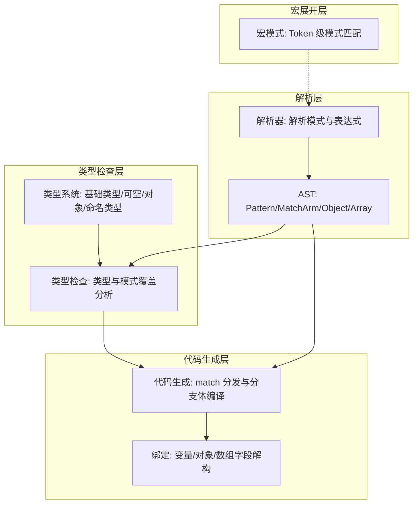
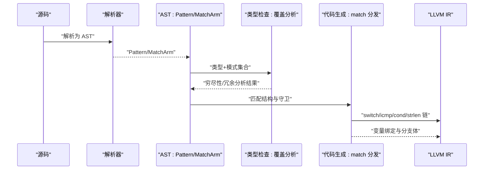
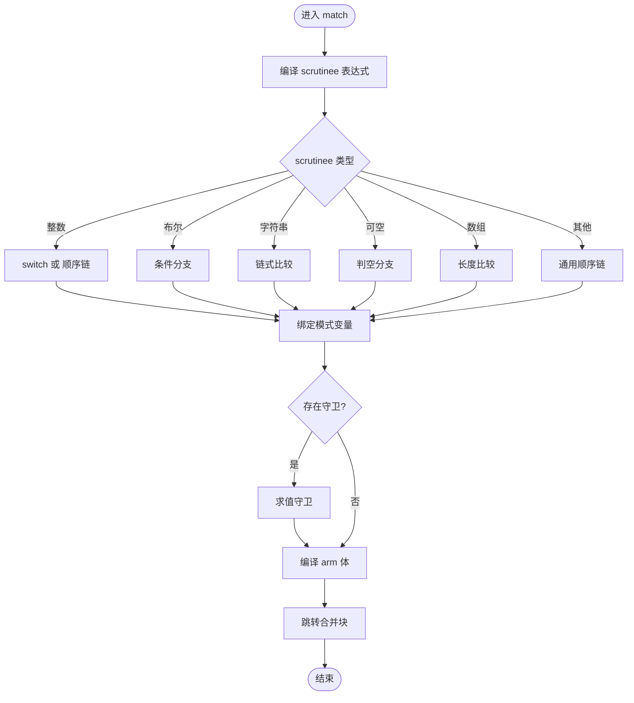
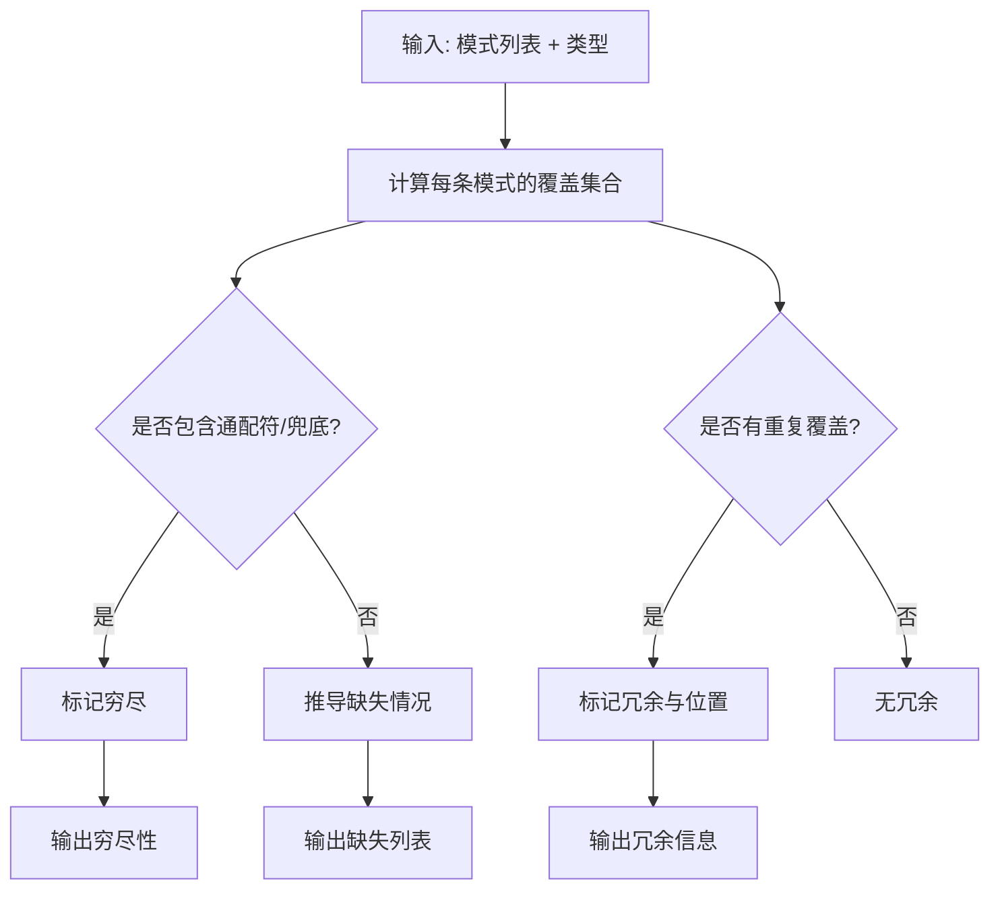
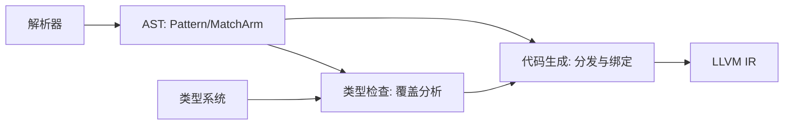

# 模式匹配

<cite>
**本文引用的文件**
- [patterns.rs](file://crates/ruyic/src/codegen/patterns.rs)
- [patterns.rs](file://crates/ruyic/src/typechecker/patterns.rs)
- [pattern.rs](file://crates/ruyic/src/macro_expand/pattern.rs)
- [ast.rs](file://crates/ruyic/src/parser/ast.rs)
- [parser.rs](file://crates/ruyic/src/parser/parser.rs)
- [types.rs](file://crates/ruyic/src/typechecker/types.rs)
- [pattern_matching.ry](file://examples/pattern_matching.ry)
- [match_edge_cases.ry](file://test/match_edge_cases.ry)
- [match.ry](file://crates/ruyic/tests/integration/cases/control_flow/match.ry)
</cite>

## 目录
1. [简介](#简介)
2. [项目结构](#项目结构)
3. [核心组件](#核心组件)
4. [架构总览](#架构总览)
5. [详细组件分析](#详细组件分析)
6. [依赖关系分析](#依赖关系分析)
7. [性能考量](#性能考量)
8. [故障排查指南](#故障排查指南)
9. [结论](#结论)
10. [附录](#附录)

## 简介
本文件系统化梳理 Ruyi 语言中的模式匹配机制，覆盖 match 表达式与语句、字面量/通配符/变量绑定、or 模式组合与优先级、守卫子句、对象解构（字段访问与嵌套解构）、if-let 与 while-let 语句、as 模式命名绑定、穷尽性检查与冗余检测，以及编译器如何在类型系统层面保证覆盖完整性。文档同时提供丰富的示例路径与最佳实践建议，帮助读者从入门到进阶掌握模式匹配。

## 项目结构
围绕模式匹配的关键模块分布如下：
- 解析层：AST 定义了 Pattern 及其子结构（对象/数组/或/作为/省略），解析器负责将源码转换为 AST。
- 类型检查层：对模式进行穷尽性与冗余分析，并结合类型系统判定是否需要穷尽匹配。
- 代码生成层：根据 scrutinee 类型选择最优分发策略（switch/icmp 链/条件分支），并在每个分支内完成变量绑定与守卫求值。
- 宏展开层：提供基于 Token 的模式匹配能力（用于宏规则），与运行时模式匹配不同，但共享“元变量/重复/可选”的思想。

图表来源
- [ast.rs:428-454](file://crates/ruyic/src/parser/ast.rs#L428-L454)
- [parser.rs:2037-2148](file://crates/ruyic/src/parser/parser.rs#L2037-L2148)
- [patterns.rs:21-59](file://crates/ruyic/src/typechecker/patterns.rs#L21-L59)
- [types.rs:14-60](file://crates/ruyic/src/typechecker/types.rs#L14-L60)
- [patterns.rs:25-43](file://crates/ruyic/src/codegen/patterns.rs#L25-L43)
- [pattern.rs:1-106](file://crates/ruyic/src/macro_expand/pattern.rs#L1-L106)

章节来源
- [ast.rs:428-454](file://crates/ruyic/src/parser/ast.rs#L428-L454)
- [parser.rs:2037-2148](file://crates/ruyic/src/parser/parser.rs#L2037-L2148)
- [patterns.rs:21-59](file://crates/ruyic/src/typechecker/patterns.rs#L21-L59)
- [types.rs:14-60](file://crates/ruyic/src/typechecker/types.rs#L14-L60)
- [patterns.rs:25-43](file://crates/ruyic/src/codegen/patterns.rs#L25-L43)
- [pattern.rs:1-106](file://crates/ruyic/src/macro_expand/pattern.rs#L1-L106)

## 核心组件
- 模式类型与语法
  - 字面量模式：整数、浮点、字符串、布尔、null。
  - 通配符模式：下划线“_”。
  - 变量绑定：标识符模式；支持 as 模式进行别名绑定。
  - or 模式：多候选组合，覆盖集合合并。
  - 对象/数组解构：属性访问、简写、剩余元素收集。
- match 表达式与语句
  - 支持在表达式与语句上下文使用；支持守卫子句；支持嵌套 match。
- if-let 与 while-let
  - 以模式驱动的控制流，简化可空/结果类型的处理。
- 穷尽性与冗余检查
  - 基于类型系统的覆盖集计算，识别缺失与冗余分支。
- 宏模式（扩展）
  - Token 级模式匹配，支持元变量、重复与可选。

章节来源
- [ast.rs:428-454](file://crates/ruyic/src/parser/ast.rs#L428-L454)
- [parser.rs:2037-2148](file://crates/ruyic/src/parser/parser.rs#L2037-L2148)
- [patterns.rs:21-59](file://crates/ruyic/src/typechecker/patterns.rs#L21-L59)
- [patterns.rs:25-43](file://crates/ruyic/src/codegen/patterns.rs#L25-L43)
- [pattern.rs:1-106](file://crates/ruyic/src/macro_expand/pattern.rs#L1-L106)

## 架构总览
Ruyi 模式匹配的端到端流程如下：
- 解析阶段：将源码解析为 AST，其中 Pattern 子树描述匹配目标的结构化期望。
- 类型检查阶段：结合类型系统，计算每条模式覆盖的“情况集合”，并判定是否穷尽、是否存在冗余。
- 代码生成阶段：依据 scrutinee 类型选择分发策略（整数 switch、布尔条件分支、字符串链式比较、可空指针/整数判空、数组长度比较、通用类型链路），在每个分支内完成变量绑定与守卫求值，最后汇聚到合并块。

图表来源
- [parser.rs:2037-2148](file://crates/ruyic/src/parser/parser.rs#L2037-L2148)
- [ast.rs:428-454](file://crates/ruyic/src/parser/ast.rs#L428-L454)
- [patterns.rs:21-59](file://crates/ruyic/src/typechecker/patterns.rs#L21-L59)
- [patterns.rs:25-43](file://crates/ruyic/src/codegen/patterns.rs#L25-L43)

## 详细组件分析

### 语法与语义：模式类型与组合
- 字面量模式
  - 整数/浮点/字符串/布尔/null 直接匹配对应值。
- 通配符模式
  - 下划线“_”匹配任意值，常用于兜底分支。
- 变量绑定
  - 标识符模式绑定当前值到新变量；as 模式先匹配内部模式，再以别名绑定。
- or 模式
  - 将多个候选模式合并，覆盖集合为各子模式覆盖集合之并集。
- 对象解构
  - 支持属性模式、简写字段、剩余字段收集；对类实例与结构化对象分别处理。
- 数组解构
  - 支持按位置绑定、省略、剩余元素收集；通过内存布局访问元素。
- 守卫子句
  - 在模式匹配后附加布尔表达式，仅当守卫为真时进入该分支。
- if-let / while-let
  - 以模式驱动的条件控制流，简化可空/结果类型处理；else 分支可选。

章节来源
- [ast.rs:428-454](file://crates/ruyic/src/parser/ast.rs#L428-L454)
- [parser.rs:2037-2148](file://crates/ruyic/src/parser/parser.rs#L2037-L2148)
- [pattern_matching.ry:11-226](file://examples/pattern_matching.ry#L11-L226)
- [match_edge_cases.ry:8-184](file://test/match_edge_cases.ry#L8-L184)

### 代码生成：match 分发与绑定
- 分发策略
  - 整数：无守卫时使用 switch；存在守卫时退化为顺序比较链。
  - 布尔：直接条件分支，true/false 各自目标，缺省由通配符/标识符提供。
  - 字符串：链式比较（必要时调用 strcmp），缺省由通配符/标识符提供。
  - 可空：指针类型按指针判空，整数类型使用特定哨兵值（如全一）。
  - 数组：按长度比较，随后对元素进行绑定。
  - 其他通用类型：生成顺序链路。
- 变量绑定
  - 标识符/通配符/as 模式在每个 arm 进入前完成绑定；对象/数组模式递归访问字段/元素并分配栈空间保存。
- 守卫与收敛
  - 守卫表达式在 arm 内部求值，未显式 return 的 arm 自动跳转至合并块。

图表来源
- [patterns.rs:25-43](file://crates/ruyic/src/codegen/patterns.rs#L25-L43)
- [patterns.rs:319-526](file://crates/ruyic/src/codegen/patterns.rs#L319-L526)
- [patterns.rs:528-677](file://crates/ruyic/src/codegen/patterns.rs#L528-L677)
- [patterns.rs:679-757](file://crates/ruyic/src/codegen/patterns.rs#L679-L757)
- [patterns.rs:759-809](file://crates/ruyic/src/codegen/patterns.rs#L759-L809)

章节来源
- [patterns.rs:25-43](file://crates/ruyic/src/codegen/patterns.rs#L25-L43)
- [patterns.rs:319-526](file://crates/ruyic/src/codegen/patterns.rs#L319-L526)
- [patterns.rs:528-677](file://crates/ruyic/src/codegen/patterns.rs#L528-L677)
- [patterns.rs:679-757](file://crates/ruyic/src/codegen/patterns.rs#L679-L757)
- [patterns.rs:759-809](file://crates/ruyic/src/codegen/patterns.rs#L759-L809)

### 穷尽性检查与冗余检测
- 覆盖集合
  - 为每条模式计算其覆盖的“情况集合”。通配符覆盖全部；字面量覆盖具体值；or 合并覆盖；对象/数组将字段/元素的覆盖映射为复合键。
- 缺失情况
  - 对有限值域类型（bool、null、可空等）进行缺失情况推导；对无限值域类型（int、float、string）通常不强制穷尽。
- 冗余检测
  - 若某模式覆盖的情况已被先前模式覆盖，则标记为冗余。
- 类型驱动
  - 结合类型系统（可空、对象字段、命名类型）进行深度覆盖分析，支持嵌套字段与剩余字段。

图表来源
- [patterns.rs:21-59](file://crates/ruyic/src/typechecker/patterns.rs#L21-L59)
- [patterns.rs:61-145](file://crates/ruyic/src/typechecker/patterns.rs#L61-L145)
- [patterns.rs:195-309](file://crates/ruyic/src/typechecker/patterns.rs#L195-L309)
- [types.rs:139-149](file://crates/ruyic/src/typechecker/types.rs#L139-L149)

章节来源
- [patterns.rs:21-59](file://crates/ruyic/src/typechecker/patterns.rs#L21-L59)
- [patterns.rs:61-145](file://crates/ruyic/src/typechecker/patterns.rs#L61-L145)
- [patterns.rs:195-309](file://crates/ruyic/src/typechecker/patterns.rs#L195-L309)
- [types.rs:139-149](file://crates/ruyic/src/typechecker/types.rs#L139-L149)

### 宏模式（扩展能力）
- Token 级模式匹配
  - 支持元变量捕获（表达式/语句/模式/类型/标识符/任意），重复与可选结构，分隔符。
- 应用场景
  - 用于宏规则的输入匹配与捕获，与运行时模式匹配互补。

章节来源
- [pattern.rs:1-106](file://crates/ruyic/src/macro_expand/pattern.rs#L1-L106)
- [pattern.rs:108-384](file://crates/ruyic/src/macro_expand/pattern.rs#L108-L384)
- [pattern.rs:386-525](file://crates/ruyic/src/macro_expand/pattern.rs#L386-L525)

### 示例与用法指引
- 基础用法
  - 字面量模式与通配符：参考示例文件中的基础 match。
  - or 模式：将多个候选合并为一条分支。
  - 守卫子句：在模式后添加 if 条件。
  - 对象解构：访问类实例或结构化对象的字段。
  - if-let / while-let：简化可空/结果类型的处理。
- 边界与嵌套
  - 嵌套 match、在表达式中使用 match、返回语句与早期 return、字符串匹配、变量遮蔽等。

章节来源
- [pattern_matching.ry:11-226](file://examples/pattern_matching.ry#L11-L226)
- [match_edge_cases.ry:8-184](file://test/match_edge_cases.ry#L8-L184)
- [match.ry:1-53](file://crates/ruyic/tests/integration/cases/control_flow/match.ry#L1-L53)

## 依赖关系分析
- 解析层依赖类型系统进行类型注解与参数签名解析；AST 中的 Pattern 与 MatchArm 为后续类型检查与代码生成提供输入。
- 类型检查层依赖 AST 的 Pattern 结构与类型系统，输出覆盖分析结果。
- 代码生成层依赖类型检查结果与 AST，生成针对不同类型的最优 IR。
- 宏模式独立于运行时模式，但共享“元变量/重复/可选”的思想。

图表来源
- [parser.rs:2037-2148](file://crates/ruyic/src/parser/parser.rs#L2037-L2148)
- [ast.rs:428-454](file://crates/ruyic/src/parser/ast.rs#L428-L454)
- [patterns.rs:21-59](file://crates/ruyic/src/typechecker/patterns.rs#L21-L59)
- [types.rs:14-60](file://crates/ruyic/src/typechecker/types.rs#L14-L60)
- [patterns.rs:25-43](file://crates/ruyic/src/codegen/patterns.rs#L25-L43)

章节来源
- [parser.rs:2037-2148](file://crates/ruyic/src/parser/parser.rs#L2037-L2148)
- [ast.rs:428-454](file://crates/ruyic/src/parser/ast.rs#L428-L454)
- [patterns.rs:21-59](file://crates/ruyic/src/typechecker/patterns.rs#L21-L59)
- [types.rs:14-60](file://crates/ruyic/src/typechecker/types.rs#L14-L60)
- [patterns.rs:25-43](file://crates/ruyic/src/codegen/patterns.rs#L25-L43)

## 性能考量
- 分发策略选择
  - 整数无守卫时采用 switch，分支多时可显著减少比较次数。
  - 存在守卫时退化为顺序链，需注意 arm 顺序影响性能与可读性。
- 绑定与存储
  - 变量绑定在每个 arm 内分配栈槽并存储值，避免重复计算；对象/数组解构按需加载字段/元素。
- 字符串匹配
  - 使用链式比较，必要时调用标准库比较函数；尽量减少字符串字面量数量以降低比较链长度。
- 可空类型
  - 指针判空与整数哨兵值两种路径，编译器自动选择更优方案。

章节来源
- [patterns.rs:319-526](file://crates/ruyic/src/codegen/patterns.rs#L319-L526)
- [patterns.rs:528-677](file://crates/ruyic/src/codegen/patterns.rs#L528-L677)
- [patterns.rs:679-757](file://crates/ruyic/src/codegen/patterns.rs#L679-L757)

## 故障排查指南
- 穷尽性告警
  - 若类型要求穷尽匹配（如 bool/null），出现缺失分支提示时，请补充相应字面量或通配符兜底。
- 冗余告警
  - 若某条分支覆盖已被先前分支覆盖，编译器会报告冗余并给出位置；请移除或合并重复逻辑。
- 守卫导致的性能问题
  - 大量守卫会迫使编译器生成顺序链，建议将最可能命中的 arm 放在前面，减少比较次数。
- 对象/数组解构错误
  - 确认字段名称与类型一致；对于类实例，确保字段索引与结构体布局匹配；数组解构注意省略与剩余元素的组合。
- 宏模式匹配失败
  - 检查元变量种类与重复/可选语法是否正确；确认分隔符与上下文匹配。

章节来源
- [patterns.rs:21-59](file://crates/ruyic/src/typechecker/patterns.rs#L21-L59)
- [patterns.rs:75-139](file://crates/ruyic/src/codegen/patterns.rs#L75-L139)
- [pattern.rs:108-384](file://crates/ruyic/src/macro_expand/pattern.rs#L108-L384)

## 结论
Ruyi 的模式匹配体系以 AST 为中心，贯穿解析、类型检查与代码生成三个阶段，既保证了运行时的高效分发，又在编译期通过穷尽性与冗余检查提升代码质量。通过字面量/通配符/变量绑定、or 组合、守卫子句、对象/数组解构、if-let/while-let 与 as 模式，开发者可以以声明式方式表达复杂分支逻辑。配合类型系统与宏模式扩展，Ruyi 提供了从易用到高性能的完整模式匹配体验。

## 附录
- 最佳实践
  - 优先使用通配符兜底，确保穷尽性；对有限值域类型务必覆盖所有分支。
  - 将高概率命中分支前置，减少守卫顺序链的比较成本。
  - 对象/数组解构尽量保持扁平，避免深层嵌套带来的维护成本。
  - 使用 as 模式为复杂模式提供清晰别名，提升可读性。
  - if-let/while-let 用于可空/结果类型，避免显式判空与嵌套。
- 示例路径
  - 基础与高级模式：[pattern_matching.ry:11-226](file://examples/pattern_matching.ry#L11-L226)
  - 边界与嵌套：[match_edge_cases.ry:8-184](file://test/match_edge_cases.ry#L8-L184)
  - 集成测试：[match.ry:1-53](file://crates/ruyic/tests/integration/cases/control_flow/match.ry#L1-L53)