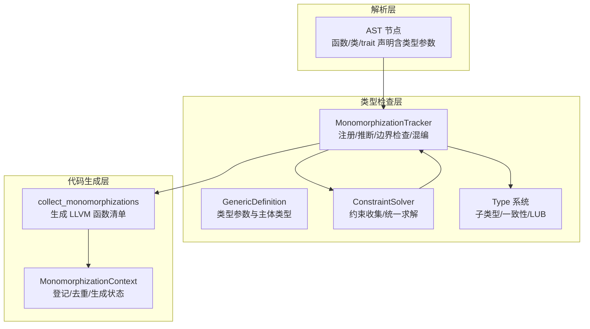
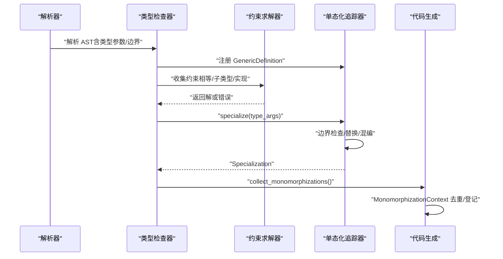
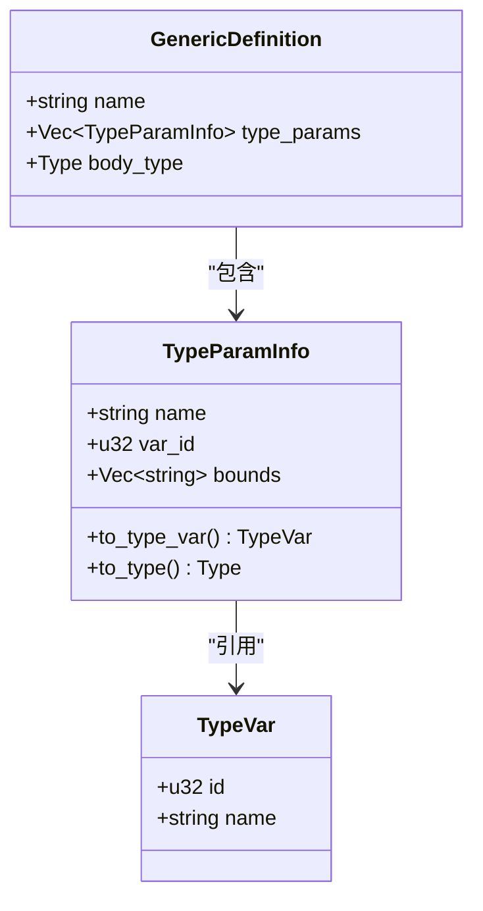
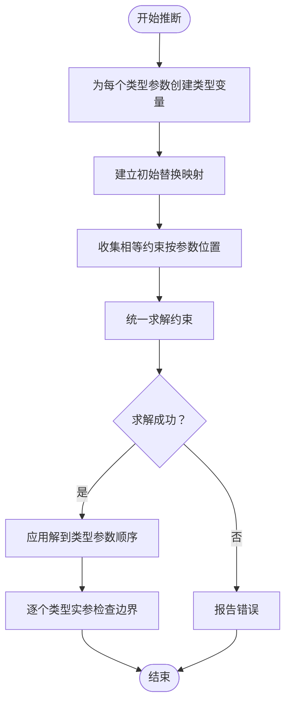
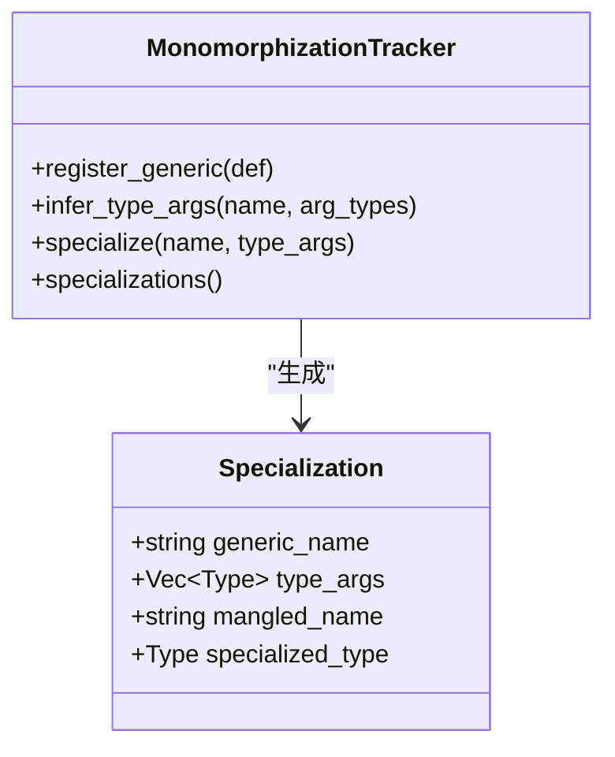
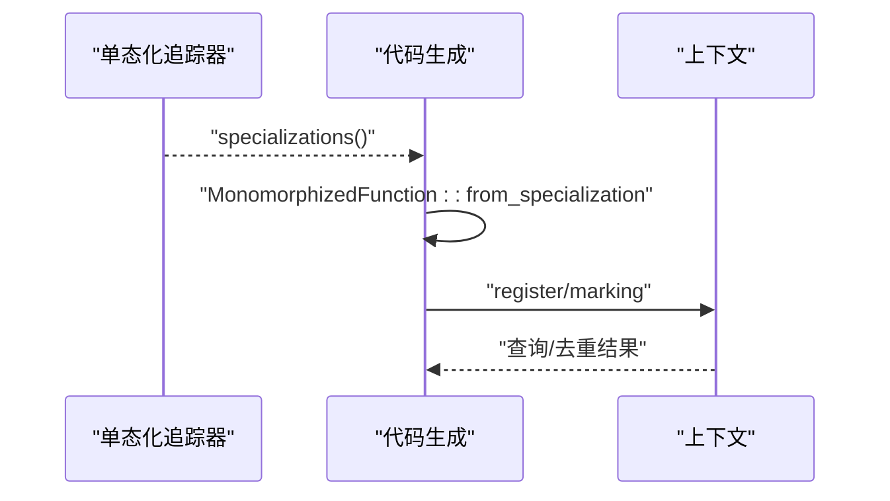
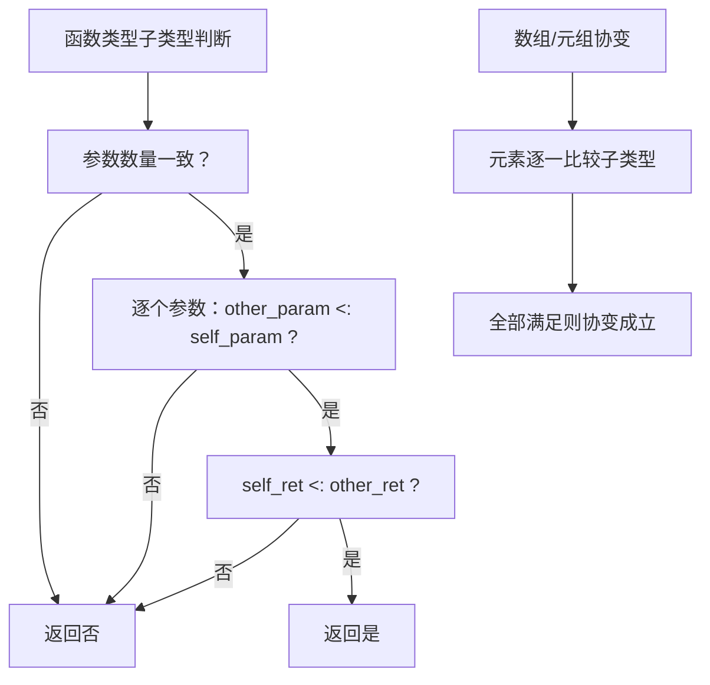
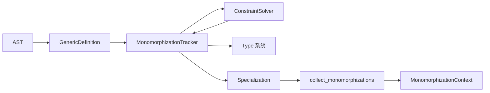

# 泛型编程

<cite>
**本文引用的文件**
- [crates/ruyic/src/typechecker/generics.rs](file://crates/ruyic/src/typechecker/generics.rs)
- [crates/ruyic/src/codegen/monomorph.rs](file://crates/ruyic/src/codegen/monomorph.rs)
- [crates/ruyic/src/typechecker/constraints.rs](file://crates/ruyic/src/typechecker/constraints.rs)
- [crates/ruyic/src/typechecker/types.rs](file://crates/ruyic/src/typechecker/types.rs)
- [crates/ruyic/src/parser/ast.rs](file://crates/ruyic/src/parser/ast.rs)
- [examples/generics_comprehensive.ry](file://examples/generics_comprehensive.ry)
- [examples/generics_simple.ry](file://examples/generics_simple.ry)
- [examples/generics.ry](file://examples/generics.ry)
</cite>

## 目录
1. [引言](#引言)
2. [项目结构](#项目结构)
3. [核心组件](#核心组件)
4. [架构总览](#架构总览)
5. [详细组件分析](#详细组件分析)
6. [依赖关系分析](#依赖关系分析)
7. [性能考量](#性能考量)
8. [故障排查指南](#故障排查指南)
9. [结论](#结论)
10. [附录](#附录)

## 引言
本文件系统性梳理 Ruyi 泛型编程系统的设计与实现，覆盖类型参数的定义与使用（函数泛型与类型泛型）、泛型约束（trait 边界）的检查机制、单态化（monomorphization）过程与优化策略、实例化时机与实现细节，以及在函数、类、接口（trait）与模块等上下文中的用法。同时提供最佳实践与常见陷阱的规避建议，并通过仓库中的示例脚本定位到具体的应用场景。

## 项目结构
Ruyi 的泛型系统主要分布在类型检查器与代码生成器两个阶段：
- 类型检查阶段：负责收集泛型定义、进行类型参数推断、约束求解、边界检查与符号名混编（mangling）。
- 代码生成阶段：基于类型检查阶段的单态化结果，为每个具体类型实例生成独立的函数体或类型表示。

图表来源
- [crates/ruyic/src/parser/ast.rs:28-69](file://crates/ruyic/src/parser/ast.rs#L28-L69)
- [crates/ruyic/src/typechecker/generics.rs:22-428](file://crates/ruyic/src/typechecker/generics.rs#L22-L428)
- [crates/ruyic/src/typechecker/constraints.rs:23-145](file://crates/ruyic/src/typechecker/constraints.rs#L23-L145)
- [crates/ruyic/src/typechecker/types.rs:14-349](file://crates/ruyic/src/typechecker/types.rs#L14-L349)
- [crates/ruyic/src/codegen/monomorph.rs:50-110](file://crates/ruyic/src/codegen/monomorph.rs#L50-L110)

章节来源
- [crates/ruyic/src/parser/ast.rs:28-69](file://crates/ruyic/src/parser/ast.rs#L28-L69)
- [crates/ruyic/src/typechecker/generics.rs:22-428](file://crates/ruyic/src/typechecker/generics.rs#L22-L428)
- [crates/ruyic/src/typechecker/constraints.rs:23-145](file://crates/ruyic/src/typechecker/constraints.rs#L23-L145)
- [crates/ruyic/src/typechecker/types.rs:14-349](file://crates/ruyic/src/typechecker/types.rs#L14-L349)
- [crates/ruyic/src/codegen/monomorph.rs:50-110](file://crates/ruyic/src/codegen/monomorph.rs#L50-L110)

## 核心组件
- 泛型定义与类型参数
  - GenericDefinition：记录泛型实体名称、类型参数列表（含可选 trait 边界）与主体类型（仍以 TypeVar 表示未实例化参数）。
  - TypeParamInfo：描述单个类型参数的名称、唯一变量 ID 与边界集合。
- 单态化追踪器
  - MonomorphizationTracker：注册泛型定义、收集调用点、推断类型实参、执行边界检查、构建替换映射、混编符号名、去重与缓存。
- 约束求解器
  - ConstraintSolver：收集相等/子类型/实现约束，通过统一算法求解，应用替换映射，处理递归类型检测与错误恢复。
- 类型系统与子类型
  - Type：涵盖原生类型、可空、数组、元组、对象、函数、命名/泛型、类型变量、动态、未来值与错误类型；提供 is_subtype_of、least_upper_bound 等判定与运算。
- 代码生成桥接
  - MonomorphizedFunction：从 Specialization 派生出具体函数签名信息。
  - MonomorphizationContext：登记/查询/标记已生成的单态化版本，避免重复生成。

章节来源
- [crates/ruyic/src/typechecker/generics.rs:22-101](file://crates/ruyic/src/typechecker/generics.rs#L22-L101)
- [crates/ruyic/src/typechecker/generics.rs:172-428](file://crates/ruyic/src/typechecker/generics.rs#L172-L428)
- [crates/ruyic/src/typechecker/constraints.rs:23-145](file://crates/ruyic/src/typechecker/constraints.rs#L23-L145)
- [crates/ruyic/src/typechecker/types.rs:14-349](file://crates/ruyic/src/typechecker/types.rs#L14-L349)
- [crates/ruyic/src/codegen/monomorph.rs:14-110](file://crates/ruyic/src/codegen/monomorph.rs#L14-L110)

## 架构总览
Ruyi 的泛型系统遵循“类型检查期收集与推断 + 代码生成期单态化”的两阶段设计。类型检查阶段完成：
- 解析 AST 中的类型参数与边界；
- 建立 GenericDefinition；
- 对函数调用进行类型实参推断；
- 验证类型实参是否满足边界；
- 生成 Specialization 并进行符号名混编；
- 去重后交由代码生成阶段。

图表来源
- [crates/ruyic/src/parser/ast.rs:28-69](file://crates/ruyic/src/parser/ast.rs#L28-L69)
- [crates/ruyic/src/typechecker/generics.rs:222-264](file://crates/ruyic/src/typechecker/generics.rs#L222-L264)
- [crates/ruyic/src/typechecker/constraints.rs:67-83](file://crates/ruyic/src/typechecker/constraints.rs#L67-L83)
- [crates/ruyic/src/codegen/monomorph.rs:50-61](file://crates/ruyic/src/codegen/monomorph.rs#L50-L61)

## 详细组件分析

### 组件一：泛型定义与类型参数
- AST 层支持函数、类、trait 的类型参数声明，类型参数可带边界（bounds），用于约束实参类型必须实现某些能力。
- 类型检查器将 AST 的类型参数转换为内部的 TypeParamInfo，并为每个参数分配唯一的 TypeVar ID，以便后续统一求解与替换。

图表来源
- [crates/ruyic/src/typechecker/generics.rs:22-75](file://crates/ruyic/src/typechecker/generics.rs#L22-L75)
- [crates/ruyic/src/parser/ast.rs:86-90](file://crates/ruyic/src/parser/ast.rs#L86-L90)

章节来源
- [crates/ruyic/src/typechecker/generics.rs:22-75](file://crates/ruyic/src/typechecker/generics.rs#L22-L75)
- [crates/ruyic/src/parser/ast.rs:86-90](file://crates/ruyic/src/parser/ast.rs#L86-L90)

### 组件二：类型实参推断与约束求解
- 推断流程：为每个类型参数创建新的类型变量，根据实参类型构造相等约束，结合默认/剩余参数规则，统一求解得到具体类型实参。
- 约束求解：支持相等、子类型与实现约束；统一算法处理类型变量与结构化类型的合一，包含环检查与错误报告。

图表来源
- [crates/ruyic/src/typechecker/generics.rs:266-370](file://crates/ruyic/src/typechecker/generics.rs#L266-L370)
- [crates/ruyic/src/typechecker/constraints.rs:67-145](file://crates/ruyic/src/typechecker/constraints.rs#L67-L145)

章节来源
- [crates/ruyic/src/typechecker/generics.rs:266-370](file://crates/ruyic/src/typechecker/generics.rs#L266-L370)
- [crates/ruyic/src/typechecker/constraints.rs:67-145](file://crates/ruyic/src/typechecker/constraints.rs#L67-L145)

### 组件三：单态化追踪与符号名混编
- 收集阶段：在类型检查期间记录所有泛型调用点与其使用的具体类型组合。
- 替换阶段：为每个唯一类型组合构建 Specialization，将 GenericDefinition 的 TypeVar 替换为具体类型。
- 混编阶段：将函数名与类型实参序列化为稳定的符号名，便于代码生成与链接。
- 去重阶段：相同 Specialization 只生成一次，避免代码膨胀。

图表来源
- [crates/ruyic/src/typechecker/generics.rs:172-264](file://crates/ruyic/src/typechecker/generics.rs#L172-L264)
- [crates/ruyic/src/typechecker/generics.rs:77-101](file://crates/ruyic/src/typechecker/generics.rs#L77-L101)

章节来源
- [crates/ruyic/src/typechecker/generics.rs:172-264](file://crates/ruyic/src/typechecker/generics.rs#L172-L264)
- [crates/ruyic/src/typechecker/generics.rs:103-160](file://crates/ruyic/src/typechecker/generics.rs#L103-L160)

### 组件四：代码生成桥接与上下文管理
- 将 Specialization 转换为 MonomorphizedFunction，提取参数与返回类型签名。
- MonomorphizationContext 统一登记与查询，跟踪已生成状态，避免重复生成。

图表来源
- [crates/ruyic/src/codegen/monomorph.rs:50-110](file://crates/ruyic/src/codegen/monomorph.rs#L50-L110)
- [crates/ruyic/src/codegen/monomorph.rs:14-48](file://crates/ruyic/src/codegen/monomorph.rs#L14-L48)

章节来源
- [crates/ruyic/src/codegen/monomorph.rs:50-110](file://crates/ruyic/src/codegen/monomorph.rs#L50-L110)

### 组件五：协变/逆变与子类型规则
- 函数类型：参数逆变（输入更严格）、返回值协变（输出更宽松）。
- 数组/元组：元素级协变。
- 动态类型：与一切类型一致（非严格子类型），在边界检查中快速放行。
- 最小上界（LUB）：在类型合并时选择最合适的公共类型，必要时退化为动态。

图表来源
- [crates/ruyic/src/typechecker/types.rs:213-252](file://crates/ruyic/src/typechecker/types.rs#L213-L252)
- [crates/ruyic/src/typechecker/types.rs:238-252](file://crates/ruyic/src/typechecker/types.rs#L238-L252)
- [crates/ruyic/src/typechecker/types.rs:311-383](file://crates/ruyic/src/typechecker/types.rs#L311-L383)

章节来源
- [crates/ruyic/src/typechecker/types.rs:213-252](file://crates/ruyic/src/typechecker/types.rs#L213-L252)
- [crates/ruyic/src/typechecker/types.rs:311-383](file://crates/ruyic/src/typechecker/types.rs#L311-L383)

### 组件六：泛型在不同上下文中的使用
- 函数泛型：通过类型参数与可选边界实现通用逻辑，支持显式/隐式类型实参与自动推断。
- 类型泛型：类与对象类型支持泛型字段与方法签名，配合约束确保安全使用。
- 接口（trait）与实现：通过边界约束与实现注册表验证类型是否满足所需能力。
- 模块：泛型定义可在模块内导出与导入，保持跨模块的一致性。

章节来源
- [crates/ruyic/src/parser/ast.rs:28-69](file://crates/ruyic/src/parser/ast.rs#L28-L69)
- [crates/ruyic/src/typechecker/generics.rs:436-548](file://crates/ruyic/src/typechecker/generics.rs#L436-L548)
- [crates/ruyic/src/typechecker/types.rs:420-464](file://crates/ruyic/src/typechecker/types.rs#L420-L464)

## 依赖关系分析
- 类型检查器依赖类型系统与约束求解器完成推断与边界检查。
- 单态化追踪器依赖类型系统进行替换与混编，依赖约束求解器进行类型替换应用。
- 代码生成器依赖单态化追踪器提供的 Specialization 列表，再通过上下文进行去重与登记。

图表来源
- [crates/ruyic/src/parser/ast.rs:28-69](file://crates/ruyic/src/parser/ast.rs#L28-L69)
- [crates/ruyic/src/typechecker/generics.rs:22-101](file://crates/ruyic/src/typechecker/generics.rs#L22-L101)
- [crates/ruyic/src/typechecker/constraints.rs:86-145](file://crates/ruyic/src/typechecker/constraints.rs#L86-L145)
- [crates/ruyic/src/typechecker/types.rs:14-60](file://crates/ruyic/src/typechecker/types.rs#L14-L60)
- [crates/ruyic/src/codegen/monomorph.rs:50-110](file://crates/ruyic/src/codegen/monomorph.rs#L50-L110)

章节来源
- [crates/ruyic/src/typechecker/generics.rs:22-101](file://crates/ruyic/src/typechecker/generics.rs#L22-L101)
- [crates/ruyic/src/typechecker/constraints.rs:86-145](file://crates/ruyic/src/typechecker/constraints.rs#L86-L145)
- [crates/ruyic/src/typechecker/types.rs:14-60](file://crates/ruyic/src/typechecker/types.rs#L14-L60)
- [crates/ruyic/src/codegen/monomorph.rs:50-110](file://crates/ruyic/src/codegen/monomorph.rs#L50-L110)

## 性能考量
- 单态化带来的代码膨胀：每种类型实参组合都会生成一份独立实现，可能导致目标文件体积增大。应通过合理的边界设计与调用模式减少不必要的特化。
- 去重与混编：通过稳定符号名与去重机制，避免重复生成相同特化版本，降低编译与链接成本。
- 约束求解复杂度：统一算法在最坏情况下可能随类型结构增长而增加，需注意避免过度复杂的泛型嵌套与循环引用。
- 运行时开销：动态类型与错误类型在边界检查与统一求解中有特殊处理，有助于早期发现不兼容问题，但也会引入额外的诊断与回退路径。

## 故障排查指南
- 类型实参数量不匹配：在 specialize 阶段会触发“泛型 arity”错误，检查调用处是否提供了正确的类型实参数量。
- 边界检查失败：当类型实参无法满足 trait 边界时，会报告“未实现某 trait”的错误；确认类型是否实现了相应 trait 或改为动态类型。
- 约束不可满足：统一求解失败会返回错误信息，检查是否存在相互矛盾的约束或非法的类型组合。
- 递归类型与无限展开：统一算法内置环检查，若出现递归类型变量将报错，需要重构类型结构或引入中间层。

章节来源
- [crates/ruyic/src/typechecker/generics.rs:237-252](file://crates/ruyic/src/typechecker/generics.rs#L237-L252)
- [crates/ruyic/src/typechecker/generics.rs:382-408](file://crates/ruyic/src/typechecker/generics.rs#L382-L408)
- [crates/ruyic/src/typechecker/constraints.rs:154-274](file://crates/ruyic/src/typechecker/constraints.rs#L154-L274)

## 结论
Ruyi 的泛型系统以清晰的两阶段设计实现了强类型与灵活性的平衡：类型检查期完成推断、边界与约束处理，代码生成期通过单态化与去重保证运行时效率。类型系统对函数、数组、元组与对象的协变/逆变规则提供了稳健的子类型判定，配合动态类型与错误恢复机制，使泛型在渐进式类型体系下具备良好的可用性与安全性。

## 附录
- 实际示例定位
  - 泛型函数与 Option 类演示：[examples/generics_comprehensive.ry](file://examples/generics_comprehensive.ry)
  - 简单类型测试：[examples/generics_simple.ry](file://examples/generics_simple.ry)
  - 类型与字段布局示例：[examples/generics.ry](file://examples/generics.ry)

章节来源
- [examples/generics_comprehensive.ry:12-90](file://examples/generics_comprehensive.ry#L12-L90)
- [examples/generics_simple.ry:2-11](file://examples/generics_simple.ry#L2-L11)
- [examples/generics.ry:4-11](file://examples/generics.ry#L4-L11)