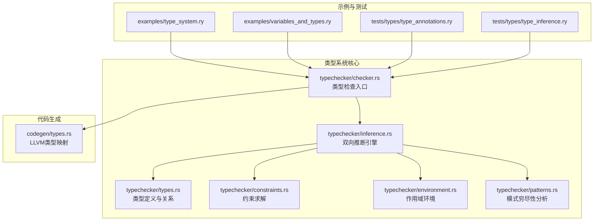
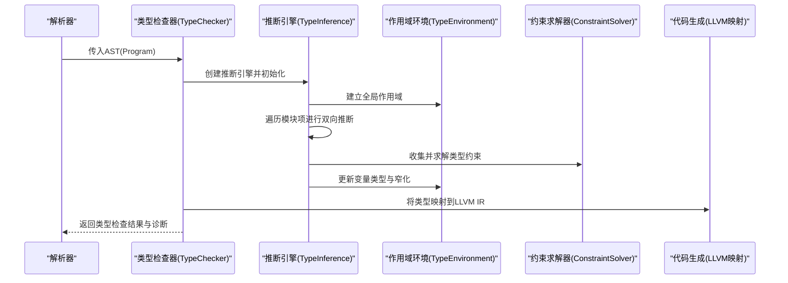
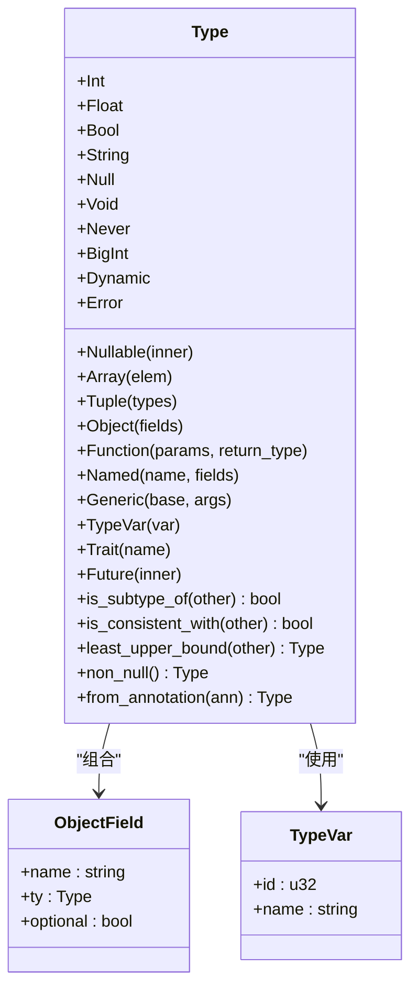
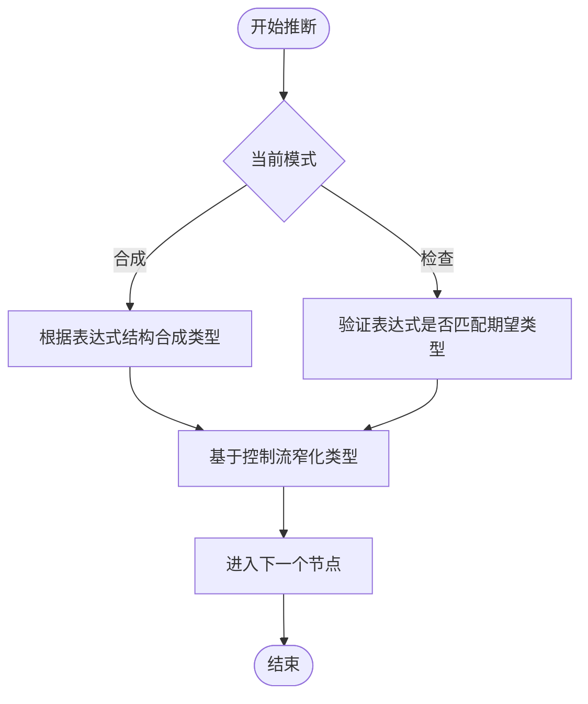
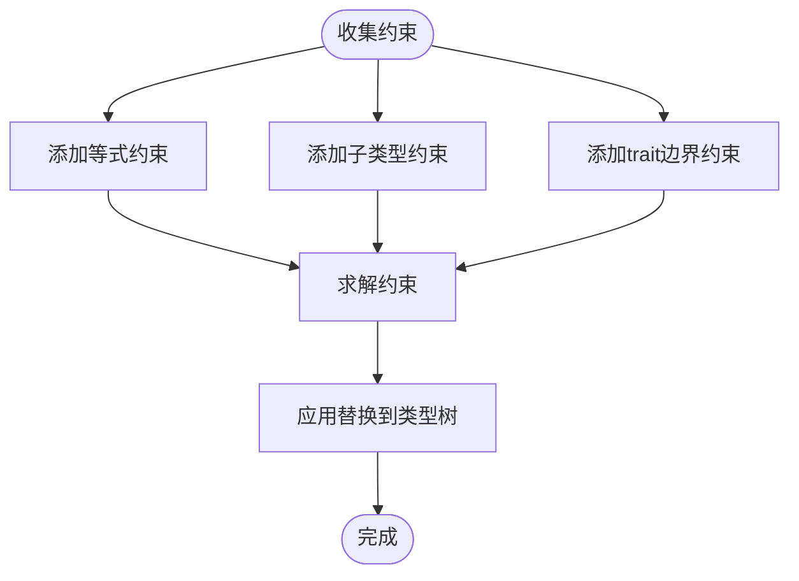
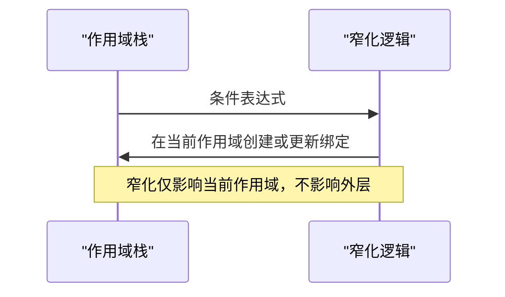
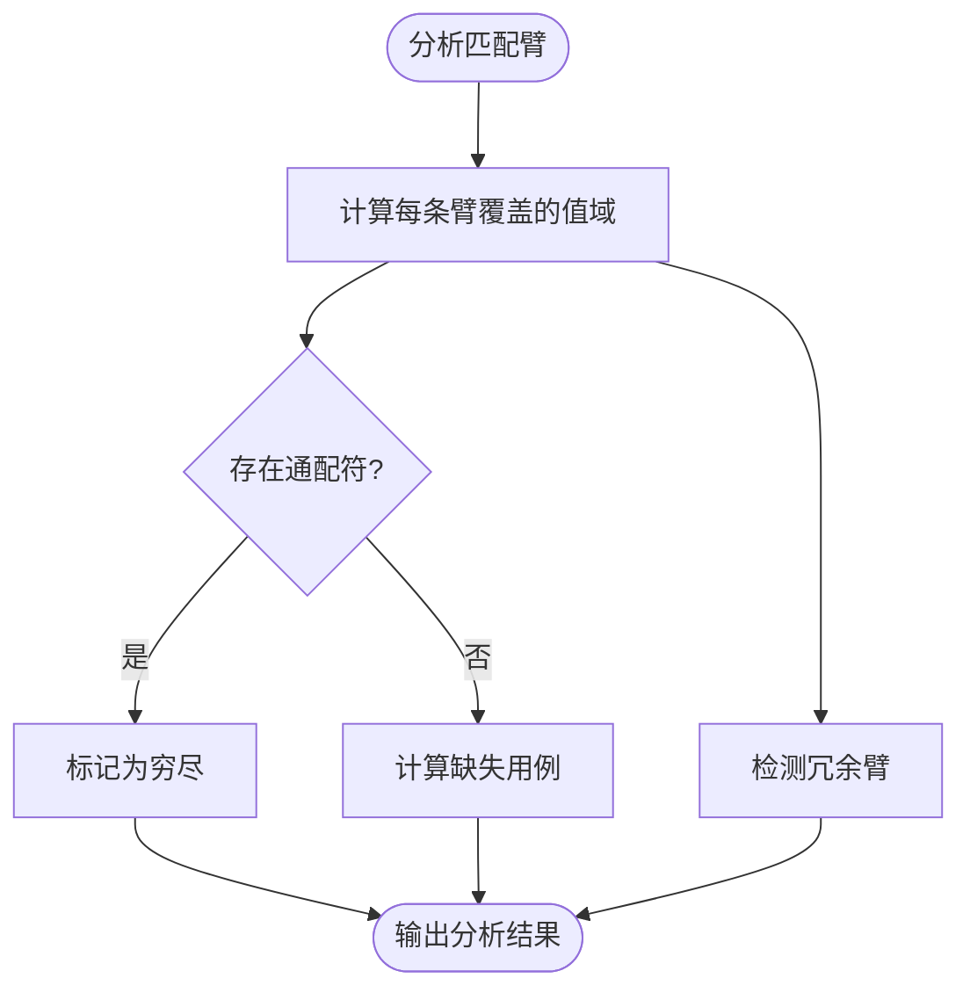
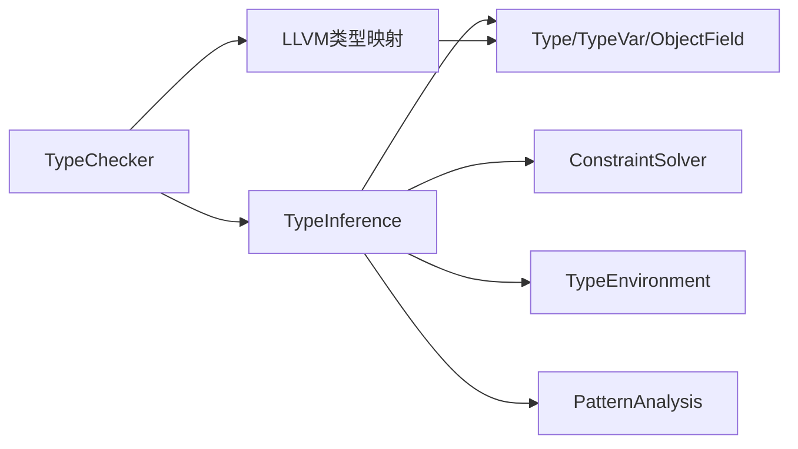

# 渐进式类型系统

<cite>
**本文引用的文件**
- [types.rs](file://crates/ruyic/src/typechecker/types.rs)
- [inference.rs](file://crates/ruyic/src/typechecker/inference.rs)
- [checker.rs](file://crates/ruyic/src/typechecker/checker.rs)
- [constraints.rs](file://crates/ruyic/src/typechecker/constraints.rs)
- [environment.rs](file://crates/ruyic/src/typechecker/environment.rs)
- [patterns.rs](file://crates/ruyic/src/typechecker/patterns.rs)
- [codegen/types.rs](file://crates/ruyic/src/codegen/types.rs)
- [type_system.ry](file://examples/type_system.ry)
- [variables_and_types.ry](file://examples/variables_and_types.ry)
- [type_annotations.ry](file://crates/ruyic/tests/integration/cases/types/type_annotations.ry)
- [type_inference.ry](file://crates/ruyic/tests/integration/cases/types/type_inference.ry)
</cite>

## 目录
1. [引言](#引言)
2. [项目结构](#项目结构)
3. [核心组件](#核心组件)
4. [架构总览](#架构总览)
5. [详细组件分析](#详细组件分析)
6. [依赖关系分析](#依赖关系分析)
7. [性能考量](#性能考量)
8. [故障排查指南](#故障排查指南)
9. [结论](#结论)
10. [附录](#附录)

## 引言
本文件系统化阐述 Ruyi 渐进式类型系统的设计与实现，涵盖静态类型注解、动态类型（dyn）的运行时检查、双向类型推断、类型兼容与转换、以及编译期与运行期之间的平衡策略。文档面向不同技术背景的读者，既提供高层概览，也包含代码级细节与可视化图示，帮助开发者正确使用与扩展类型系统。

## 项目结构
Ruyi 类型系统主要位于 ruyic 包的 typechecker 子模块中，配合 codegen 将类型映射到 LLVM IR；examples 与 tests 提供使用示例与回归验证。

图表来源
- [checker.rs:58-83](file://crates/ruyic/src/typechecker/checker.rs#L58-L83)
- [inference.rs:105-164](file://crates/ruyic/src/typechecker/inference.rs#L105-L164)
- [types.rs:14-60](file://crates/ruyic/src/typechecker/types.rs#L14-L60)
- [constraints.rs:28-83](file://crates/ruyic/src/typechecker/constraints.rs#L28-L83)
- [environment.rs:46-158](file://crates/ruyic/src/typechecker/environment.rs#L46-L158)
- [patterns.rs:20-59](file://crates/ruyic/src/typechecker/patterns.rs#L20-L59)
- [codegen/types.rs:27-103](file://crates/ruyic/src/codegen/types.rs#L27-L103)

章节来源
- [checker.rs:58-83](file://crates/ruyic/src/typechecker/checker.rs#L58-L83)
- [inference.rs:105-164](file://crates/ruyic/src/typechecker/inference.rs#L105-L164)

## 核心组件
- 类型表示与关系：定义了基础类型、可空、数组、元组、对象、函数、泛型、类型变量、特征（trait）、动态类型、Future、错误类型等，并实现子类型判断、一致性判断、最小上界（lub）等。
- 双向类型推断：在表达式合成（synthesize）与期望类型检查（check）之间切换，支持 let 绑定与函数返回类型的本地推断。
- 约束求解：收集等式与子类型约束，通过合一算法求解类型变量，支持 trait 边界。
- 作用域环境：支持嵌套作用域、可变性追踪、类型窄化（narrowing）。
- 模式分析：对 match 语句进行穷尽性与冗余性分析，支持对象、数组、或模式等。
- 代码生成映射：将 Ruyi 类型映射为 LLVM IR 类型，特别处理 dyn 的运行时表示。

章节来源
- [types.rs:14-60](file://crates/ruyic/src/typechecker/types.rs#L14-L60)
- [inference.rs:34-52](file://crates/ruyic/src/typechecker/inference.rs#L34-L52)
- [constraints.rs:28-83](file://crates/ruyic/src/typechecker/constraints.rs#L28-L83)
- [environment.rs:46-158](file://crates/ruyic/src/typechecker/environment.rs#L46-L158)
- [patterns.rs:20-59](file://crates/ruyic/src/typechecker/patterns.rs#L20-L59)
- [codegen/types.rs:27-103](file://crates/ruyic/src/codegen/types.rs#L27-L103)

## 架构总览
Ruyi 类型系统采用“渐进式”设计：允许在编译期静态类型与运行期动态类型之间自由切换。核心流程如下：
- 解析器生成 AST 后，类型检查器构建类型环境并执行双向推断。
- 对未显式标注的变量默认为动态类型（dyn），以保持灵活性。
- 在需要更强保障时，用户可通过类型注解启用静态检查。
- 约束求解器在泛型与复杂表达式中统一处理类型合一与边界检查。
- 最终将类型信息映射到 LLVM IR，实现高效的运行时表示。

图表来源
- [checker.rs:58-83](file://crates/ruyic/src/typechecker/checker.rs#L58-L83)
- [inference.rs:105-164](file://crates/ruyic/src/typechecker/inference.rs#L105-L164)
- [environment.rs:55-158](file://crates/ruyic/src/typechecker/environment.rs#L55-L158)
- [constraints.rs:67-83](file://crates/ruyic/src/typechecker/constraints.rs#L67-L83)
- [codegen/types.rs:27-103](file://crates/ruyic/src/codegen/types.rs#L27-L103)

## 详细组件分析

### 类型系统数据模型
- 基础类型：int、float、bool、string、null、void、never、bigint。
- 复合类型：Nullable、Array、Tuple、Object、Function、Generic、Named、Trait、Future、Error。
- 动态类型：Dynamic，用于运行时类型检查与灵活交互。
- 关系运算：
  - 子类型判断：支持 int ⊂ float（数值提升）、T ⊂ T?、Never ⊂ T、dyn 与一切一致等。
  - 一致性判断：若任一为 dyn 或互相子类型，则一致。
  - 最小上界（lub）：按 spec 定义，dyn 吸收一切，int/float 数值提升，可空与元组逐元素 lub。

图表来源
- [types.rs:14-60](file://crates/ruyic/src/typechecker/types.rs#L14-L60)
- [types.rs:62-75](file://crates/ruyic/src/typechecker/types.rs#L62-L75)

章节来源
- [types.rs:151-383](file://crates/ruyic/src/typechecker/types.rs#L151-L383)

### 双向类型推断
- 推断模式：
  - 合成模式（synthesize）：从表达式结构确定其类型。
  - 检查模式（check）：验证表达式是否符合期望类型。
- 默认行为：未标注变量默认为动态类型（dyn），以保证渐进式迁移。
- 函数返回类型：若未显式标注，先在参数作用域内推断返回类型，再检查函数体。
- 控制流类型窄化：基于条件表达式（如 null 比较、typeof、instanceof）对变量类型进行窄化，提升安全性。

图表来源
- [inference.rs:728-726](file://crates/ruyic/src/typechecker/inference.rs#L728-L726)
- [inference.rs:1436-1509](file://crates/ruyic/src/typechecker/inference.rs#L1436-L1509)

章节来源
- [inference.rs:105-164](file://crates/ruyic/src/typechecker/inference.rs#L105-L164)
- [inference.rs:180-350](file://crates/ruyic/src/typechecker/inference.rs#L180-L350)
- [inference.rs:1436-1509](file://crates/ruyic/src/typechecker/inference.rs#L1436-L1509)

### 约束求解与泛型推断
- 约束类型：等式约束（=）、子类型约束（<:）、trait 边界约束（: Trait）。
- 求解策略：合一算法，处理类型变量、可空、数组、函数、泛型与对象的结构合一；int/float 数值提升；Never 与 dyn 的特殊处理；发生检查防止无限类型。
- 应用替换：将求解得到的类型变量替换回类型树。

图表来源
- [constraints.rs:49-83](file://crates/ruyic/src/typechecker/constraints.rs#L49-L83)
- [constraints.rs:153-274](file://crates/ruyic/src/typechecker/constraints.rs#L153-L274)
- [constraints.rs:85-144](file://crates/ruyic/src/typechecker/constraints.rs#L85-L144)

章节来源
- [constraints.rs:28-83](file://crates/ruyic/src/typechecker/constraints.rs#L28-L83)
- [constraints.rs:153-274](file://crates/ruyic/src/typechecker/constraints.rs#L153-L274)

### 作用域环境与类型窄化
- 支持多层作用域、变量声明、查找与阴影覆盖。
- 类型窄化：在 if/while/for 等控制流中，根据条件表达式对变量类型进行窄化，例如 null 比较后将 T? 窄化为非 null。
- 可变性追踪：区分 let/const，更新时检查可变性。

图表来源
- [environment.rs:115-132](file://crates/ruyic/src/typechecker/environment.rs#L115-L132)
- [inference.rs:1436-1509](file://crates/ruyic/src/typechecker/inference.rs#L1436-L1509)

章节来源
- [environment.rs:46-158](file://crates/ruyic/src/typechecker/environment.rs#L46-L158)
- [inference.rs:1436-1509](file://crates/ruyic/src/typechecker/inference.rs#L1436-L1509)

### 模式穷尽性与冗余性分析
- 分析 match 语句的覆盖情况，支持布尔、null、数组、对象、命名类型等。
- 报告非穷尽与冗余分支，辅助编写健壮的模式匹配。

图表来源
- [patterns.rs:20-59](file://crates/ruyic/src/typechecker/patterns.rs#L20-L59)
- [patterns.rs:195-309](file://crates/ruyic/src/typechecker/patterns.rs#L195-L309)

章节来源
- [patterns.rs:20-59](file://crates/ruyic/src/typechecker/patterns.rs#L20-L59)
- [patterns.rs:195-309](file://crates/ruyic/src/typechecker/patterns.rs#L195-L309)

### 代码生成映射（LLVM）
- 将 Ruyi 类型映射到 LLVM IR 类型，动态类型（dyn）映射为包含类型标签与指针的结构体，便于运行时类型检查。
- 函数签名映射：参数与返回类型分别映射为 LLVM 参数类型与返回类型。

章节来源
- [codegen/types.rs:27-103](file://crates/ruyic/src/codegen/types.rs#L27-L103)
- [codegen/types.rs:105-124](file://crates/ruyic/src/codegen/types.rs#L105-L124)

## 依赖关系分析
- 类型系统内部依赖：
  - inference 依赖 types、constraints、environment、patterns。
  - checker 负责编排 inference、traits 与 diagnostics。
  - codegen 依赖 types 进行 LLVM 映射。
- 外部依赖：
  - Inkwell 用于 LLVM IR 生成。
  - 标准库与内置函数在推断阶段预声明，确保类型检查可用。

图表来源
- [checker.rs:58-83](file://crates/ruyic/src/typechecker/checker.rs#L58-L83)
- [inference.rs:105-164](file://crates/ruyic/src/typechecker/inference.rs#L105-L164)
- [codegen/types.rs:27-103](file://crates/ruyic/src/codegen/types.rs#L27-L103)

章节来源
- [checker.rs:58-83](file://crates/ruyic/src/typechecker/checker.rs#L58-L83)
- [inference.rs:105-164](file://crates/ruyic/src/typechecker/inference.rs#L105-L164)

## 性能考量
- 编译期优化：
  - 双向推断减少重复检查，提高整体效率。
  - 约束求解采用合一算法，避免不必要的回溯。
  - 作用域环境使用向量存储，查找与插入为 O(作用域深度)，通常较小。
- 运行期开销：
  - dyn 类型通过结构体携带类型标签，运行时检查成本可控。
  - 数值提升（int/float）在编译期决定，运行期无额外开销。
- 内存与复杂度：
  - 类型树与约束列表随程序规模增长，但通过局部作用域与一次性遍历降低常数因子。

## 故障排查指南
- 常见问题与定位：
  - 类型不匹配：检查表达式合成与检查模式的调用链，确认 lub 计算与子类型判断。
  - 泛型约束失败：查看约束收集与合一过程，关注发生检查与边界约束。
  - 模式不穷尽：根据分析报告补充缺失用例，或使用通配符。
  - 自引用字段：检查类字段类型是否导致无限大小，必要时改为可空或延迟初始化。
- 诊断工具：
  - 使用 TypeChecker 的诊断接口获取错误与警告集合，结合作用域环境定位变量类型变化点。

章节来源
- [checker.rs:27-39](file://crates/ruyic/src/typechecker/checker.rs#L27-L39)
- [inference.rs:464-726](file://crates/ruyic/src/typechecker/inference.rs#L464-L726)
- [patterns.rs:61-145](file://crates/ruyic/src/typechecker/patterns.rs#L61-L145)

## 结论
Ruyi 渐进式类型系统在编译期与运行期之间实现了平滑过渡：通过动态类型（dyn）保留灵活性，通过显式注解与双向推断提供强类型安全保障。类型系统的核心在于清晰的数据模型、稳健的约束求解与完善的穷尽性分析，辅以 LLVM 映射实现高效运行时表现。该设计既满足快速迭代需求，又能在关键路径上提供静态保障。

## 附录

### 实际使用示例与路径
- 基本类型注解与推断示例
  - 示例路径：[type_annotations.ry](file://crates/ruyic/tests/integration/cases/types/type_annotations.ry)
  - 示例路径：[type_inference.ry](file://crates/ruyic/tests/integration/cases/types/type_inference.ry)
  - 示例路径：[variables_and_types.ry](file://examples/variables_and_types.ry)
- 渐进式类型系统演示
  - 示例路径：[type_system.ry](file://examples/type_system.ry)

章节来源
- [type_annotations.ry:1-9](file://crates/ruyic/tests/integration/cases/types/type_annotations.ry#L1-L9)
- [type_inference.ry:1-15](file://crates/ruyic/tests/integration/cases/types/type_inference.ry#L1-L15)
- [variables_and_types.ry:24-182](file://examples/variables_and_types.ry#L24-L182)
- [type_system.ry:9-185](file://examples/type_system.ry#L9-L185)