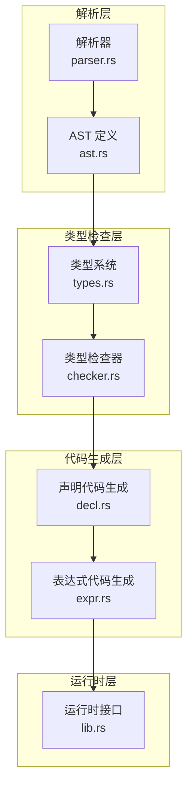
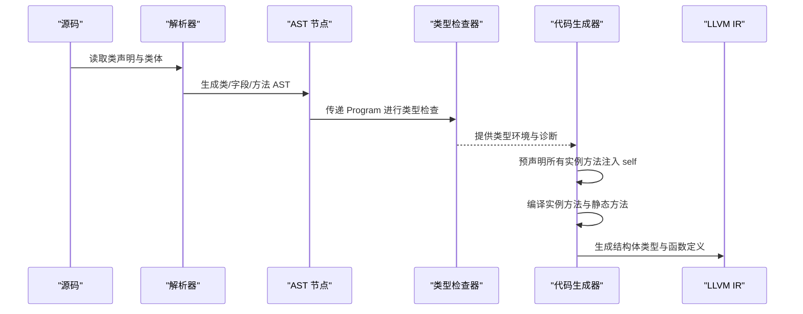
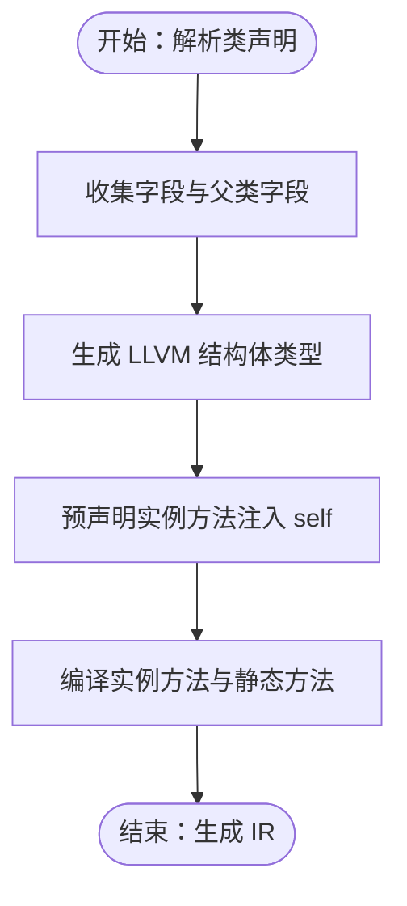
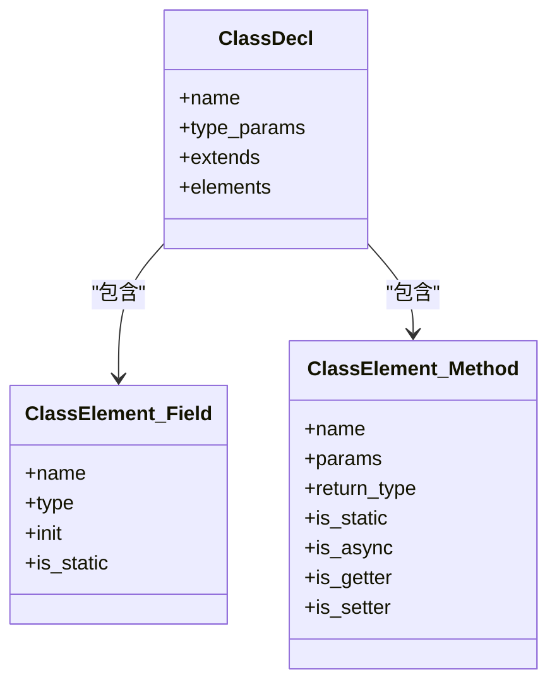

# 类和对象

<cite>
**本文引用的文件**
- [classes_and_objects.ry](file://examples/classes_and_objects.ry)
- [ast.rs](file://crates/ruyic/src/parser/ast.rs)
- [parser.rs](file://crates/ruyic/src/parser/parser.rs)
- [decl.rs](file://crates/ruyic/src/codegen/decl.rs)
- [expr.rs](file://crates/ruyic/src/codegen/expr.rs)
- [types.rs](file://crates/ruyic/src/typechecker/types.rs)
- [checker.rs](file://crates/ruyic/src/typechecker/checker.rs)
- [lib.rs](file://crates/ruyi_runtime/src/lib.rs)
</cite>

## 目录
1. [引言](#引言)
2. [项目结构](#项目结构)
3. [核心组件](#核心组件)
4. [架构总览](#架构总览)
5. [详细组件分析](#详细组件分析)
6. [依赖关系分析](#依赖关系分析)
7. [性能考量](#性能考量)
8. [故障排查指南](#故障排查指南)
9. [结论](#结论)
10. [附录](#附录)

## 引言
本章节围绕 Ruyi 语言的“类与对象”系统，系统性梳理从语法到编译、从类型系统到运行时的关键实现路径，帮助读者理解：
- 类的定义语法（字段、构造函数、方法）
- 对象的创建与初始化流程（含 new 调用与构造函数）
- 继承机制与方法重写规则
- 访问控制与可见性（当前实现中以字段命名约定体现）
- 静态成员与实例成员的差异与使用场景
- this 关键字的使用与作用域规则
- 类的生命周期与内存布局（LLVM 结构体表示）
- 面向对象最佳实践与设计模式应用建议

## 项目结构
Ruyi 的类与对象系统贯穿“解析 → 类型检查 → 代码生成 → 运行时”的完整链路：
- 解析层：在 AST 中定义类声明、类元素（字段/方法）、属性名等节点
- 类型检查层：对类的字段、方法签名、继承关系进行类型一致性校验
- 代码生成层：将类映射为 LLVM 结构体，方法预声明与实现，静态方法与实例方法分别处理
- 运行时层：提供对象内存布局、GC 根集管理、内置对象操作等支持

图示来源
- [parser.rs:466-489](file://crates/ruyic/src/parser/parser.rs#L466-L489)
- [ast.rs:40-69](file://crates/ruyic/src/parser/ast.rs#L40-L69)
- [types.rs:16-60](file://crates/ruyic/src/typechecker/types.rs#L16-L60)
- [checker.rs:58-83](file://crates/ruyic/src/typechecker/checker.rs#L58-L83)
- [decl.rs:311-501](file://crates/ruyic/src/codegen/decl.rs#L311-L501)
- [expr.rs:302-452](file://crates/ruyic/src/codegen/expr.rs#L302-L452)
- [lib.rs:55-119](file://crates/ruyi_runtime/src/lib.rs#L55-L119)

章节来源
- [parser.rs:466-489](file://crates/ruyic/src/parser/parser.rs#L466-L489)
- [ast.rs:40-69](file://crates/ruyic/src/parser/ast.rs#L40-L69)
- [types.rs:16-60](file://crates/ruyic/src/typechecker/types.rs#L16-L60)
- [checker.rs:58-83](file://crates/ruyic/src/typechecker/checker.rs#L58-L83)
- [decl.rs:311-501](file://crates/ruyic/src/codegen/decl.rs#L311-L501)
- [expr.rs:302-452](file://crates/ruyic/src/codegen/expr.rs#L302-L452)
- [lib.rs:55-119](file://crates/ruyi_runtime/src/lib.rs#L55-L119)

## 核心组件
- 类声明与类元素
  - 类声明节点包含名称、泛型参数、继承父类、类体（字段/方法）等信息
  - 类元素分为字段与方法两类，方法可标记为静态或异步
- 字段与构造函数
  - 字段声明支持类型注解与初始值；构造函数通过特殊方法名标识
- 方法与 this
  - 实例方法隐含第一个参数为 self（通过编译期注入），this 在表达式层面映射为 Self 表达式
- 继承与多态
  - extends 指定父类；子类方法可覆盖父类同名方法
- 静态成员
  - 静态方法不带 self 参数，直接由类名调用
- 内存与生命周期
  - 类映射为 LLVM 结构体；对象作为结构体实例存储于堆或栈（受 GC 管理）

章节来源
- [ast.rs:40-69](file://crates/ruyic/src/parser/ast.rs#L40-L69)
- [ast.rs:374-394](file://crates/ruyic/src/parser/ast.rs#L374-L394)
- [parser.rs:466-489](file://crates/ruyic/src/parser/parser.rs#L466-L489)
- [parser.rs:602-702](file://crates/ruyic/src/parser/parser.rs#L602-L702)
- [decl.rs:311-501](file://crates/ruyic/src/codegen/decl.rs#L311-L501)
- [expr.rs:322-322](file://crates/ruyic/src/codegen/expr.rs#L322-L322)
- [lib.rs:55-119](file://crates/ruyi_runtime/src/lib.rs#L55-L119)

## 架构总览
下图展示从源码到 LLVM IR 的关键步骤：解析类声明 → 类型检查 → 预声明方法 → 编译方法与静态方法 → 生成结构体类型。

图示来源
- [parser.rs:466-489](file://crates/ruyic/src/parser/parser.rs#L466-L489)
- [ast.rs:40-69](file://crates/ruyic/src/parser/ast.rs#L40-L69)
- [checker.rs:58-83](file://crates/ruyic/src/typechecker/checker.rs#L58-L83)
- [decl.rs:371-455](file://crates/ruyic/src/codegen/decl.rs#L371-L455)

章节来源
- [parser.rs:466-489](file://crates/ruyic/src/parser/parser.rs#L466-L489)
- [ast.rs:40-69](file://crates/ruyic/src/parser/ast.rs#L40-L69)
- [checker.rs:58-83](file://crates/ruyic/src/typechecker/checker.rs#L58-L83)
- [decl.rs:371-455](file://crates/ruyic/src/codegen/decl.rs#L371-L455)

## 详细组件分析

### 类定义语法与字段声明
- 语法要点
  - class 关键字后跟类名、可选泛型参数、可选 extends 父类、花括号内为类体
  - 类体元素支持字段与方法；字段可标注类型与初始值
- AST 映射
  - 类声明节点包含 name、type_params、extends、body、annotations
  - 类元素包含 Field 与 Method，Method 支持 is_static、is_async、getter/setter 标记
- 示例参考
  - 示例程序展示了字段声明与方法定义的基本形态

章节来源
- [parser.rs:466-489](file://crates/ruyic/src/parser/parser.rs#L466-L489)
- [ast.rs:40-69](file://crates/ruyic/src/parser/ast.rs#L40-L69)
- [ast.rs:374-394](file://crates/ruyic/src/parser/ast.rs#L374-L394)
- [classes_and_objects.ry:11-29](file://examples/classes_and_objects.ry#L11-L29)

### 构造函数与对象初始化
- 构造函数语义
  - 通过特殊方法名标识构造函数；在编译阶段会将其转换为实例方法并注入 self 参数
- 初始化流程
  - 编译器先收集字段列表，再构建组合字段（含父类字段），随后生成结构体类型
  - 方法预声明允许方法内部前向引用
- 调用方式
  - 对象创建通过 new 表达式触发，编译器生成相应调用指令

图示来源
- [decl.rs:294-369](file://crates/ruyic/src/codegen/decl.rs#L294-L369)
- [decl.rs:371-455](file://crates/ruyic/src/codegen/decl.rs#L371-L455)

章节来源
- [decl.rs:294-369](file://crates/ruyic/src/codegen/decl.rs#L294-L369)
- [decl.rs:371-455](file://crates/ruyic/src/codegen/decl.rs#L371-L455)
- [expr.rs:442-442](file://crates/ruyic/src/codegen/expr.rs#L442-L442)

### 继承机制与方法重写
- 单继承
  - extends 指定父类；编译器将父类字段合并至子类字段集合
- 方法重写
  - 子类同名方法会覆盖父类方法；编译器按类名+方法名生成唯一函数符号
- 语法支持
  - super.new(...) 在子类构造函数中调用父类构造函数

章节来源
- [decl.rs:301-308](file://crates/ruyic/src/codegen/decl.rs#L301-L308)
- [decl.rs:353-358](file://crates/ruyic/src/codegen/decl.rs#L353-L358)
- [classes_and_objects.ry:71-86](file://examples/classes_and_objects.ry#L71-L86)

### 访问控制与可见性
- 当前实现
  - 未引入显式的 public/private/protected 关键字
  - 通过字段命名约定（如以下划线开头）表达“受保护”语义
- 建议
  - 使用命名约定统一团队规范；未来可扩展为词法/语法级访问修饰符

章节来源
- [classes_and_objects.ry:110-128](file://examples/classes_and_objects.ry#L110-L128)

### 静态成员与实例成员
- 静态方法
  - 通过类名直接调用；编译时不注入 self 参数
- 实例方法
  - 需要对象实例调用；编译时自动注入 self 参数
- 作用域
  - 静态方法无法访问实例字段；实例方法可访问自身字段与父类字段

章节来源
- [ast.rs:374-394](file://crates/ruyic/src/parser/ast.rs#L374-L394)
- [decl.rs:457-498](file://crates/ruyic/src/codegen/decl.rs#L457-L498)
- [decl.rs:420-433](file://crates/ruyic/src/codegen/decl.rs#L420-L433)

### this 关键字与作用域
- 语法映射
  - this 在表达式层面映射为 Self 表达式，用于访问当前实例字段
- 作用域规则
  - 只能在实例方法中使用；对应变量表中存在 "self" 绑定
- 成员访问
  - 成员访问在编译期解析为结构体字段偏移或运行时对象访问

章节来源
- [expr.rs:322-322](file://crates/ruyic/src/codegen/expr.rs#L322-L322)
- [expr.rs:698-793](file://crates/ruyic/src/codegen/expr.rs#L698-L793)

### 类的生命周期与内存布局
- 结构体布局
  - 类映射为 LLVM 结构体；字段顺序与类型由字段集合决定
- 生命周期
  - 对象作为结构体实例，受运行时 GC 管理；编译器在必要时注册 GC 根
- 运行时支持
  - 提供对象分配、字符串连接、数组操作等基础能力

图示来源
- [ast.rs:40-69](file://crates/ruyic/src/parser/ast.rs#L40-L69)
- [ast.rs:374-394](file://crates/ruyic/src/parser/ast.rs#L374-L394)

章节来源
- [decl.rs:364-369](file://crates/ruyic/src/codegen/decl.rs#L364-L369)
- [lib.rs:55-119](file://crates/ruyi_runtime/src/lib.rs#L55-L119)

### 面向对象最佳实践与设计模式
- 最佳实践
  - 使用构造函数集中初始化逻辑，避免分散赋值
  - 将只读数据设为不可变字段，必要时通过方法返回副本
  - 合理拆分职责，避免“上帝类”
- 设计模式建议
  - 策略模式：通过接口（trait）抽象算法族，配合对象组合
  - 观察者模式：事件发布/订阅，结合异步运行时
  - 工厂模式：静态工厂方法封装复杂创建逻辑
- 注意事项
  - 避免过度继承层级；优先组合优于继承
  - 利用静态方法提供便捷构造器（如工厂方法）

## 依赖关系分析
- 解析到类型检查
  - 解析器将类声明转为 AST；类型检查器基于 AST 构建类型环境并报告诊断
- 类型检查到代码生成
  - 类型检查结果驱动代码生成器进行方法预声明与函数实现
- 代码生成到运行时
  - 生成的 IR 依赖运行时提供的对象与 GC 能力

图示来源
- [ast.rs:40-69](file://crates/ruyic/src/parser/ast.rs#L40-L69)
- [checker.rs:58-83](file://crates/ruyic/src/typechecker/checker.rs#L58-L83)
- [decl.rs:371-455](file://crates/ruyic/src/codegen/decl.rs#L371-L455)
- [lib.rs:55-119](file://crates/ruyi_runtime/src/lib.rs#L55-L119)

章节来源
- [ast.rs:40-69](file://crates/ruyic/src/parser/ast.rs#L40-L69)
- [checker.rs:58-83](file://crates/ruyic/src/typechecker/checker.rs#L58-L83)
- [decl.rs:371-455](file://crates/ruyic/src/codegen/decl.rs#L371-L455)
- [lib.rs:55-119](file://crates/ruyi_runtime/src/lib.rs#L55-L119)

## 性能考量
- 结构体内存布局
  - 字段按声明顺序排列，便于快速字段访问；避免不必要的填充
- 方法调用
  - 预声明方法减少运行时查找开销；静态方法无 self 开销
- GC 与根集
  - 对 GC 管理类型进行根集登记，降低漏标风险；合理划分作用域，及时释放根
- 编译器优化
  - 类型推断与约束求解在编译期完成，运行时仅保留必要的动态信息

## 故障排查指南
- 常见问题
  - 未知字段访问：确认字段是否声明且拼写正确
  - 构造函数签名不匹配：确保 new 方法参数与调用一致
  - 继承冲突：检查父类字段与子类字段是否存在命名冲突
- 诊断来源
  - 类型检查器输出诊断信息，定位错误位置与原因
- 建议
  - 先修复类型错误，再关注运行时行为
  - 使用最小复现样例定位问题

章节来源
- [checker.rs:27-39](file://crates/ruyic/src/typechecker/checker.rs#L27-L39)
- [expr.rs:698-793](file://crates/ruyic/src/codegen/expr.rs#L698-L793)

## 结论
Ruyi 的类与对象系统以清晰的 AST/类型/代码生成链路为基础，提供了类定义、字段与方法、构造函数、继承与静态方法等核心特性。通过 LLVM 结构体映射与运行时 GC 支持，实现了高效的内存布局与生命周期管理。建议在工程实践中遵循命名约定与设计原则，逐步引入更细粒度的访问控制与高级模式，持续提升代码质量与可维护性。

## 附录
- 示例参考
  - 示例程序涵盖类声明、构造函数、静态方法、继承、getter/setter 与对象字面量等主题

章节来源
- [classes_and_objects.ry:11-209](file://examples/classes_and_objects.ry#L11-L209)