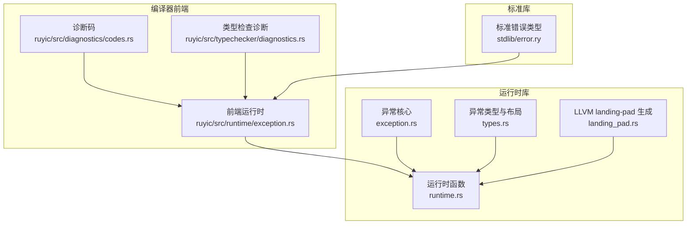
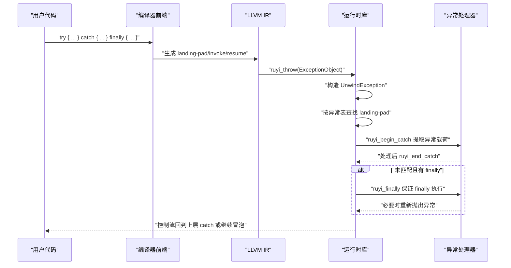
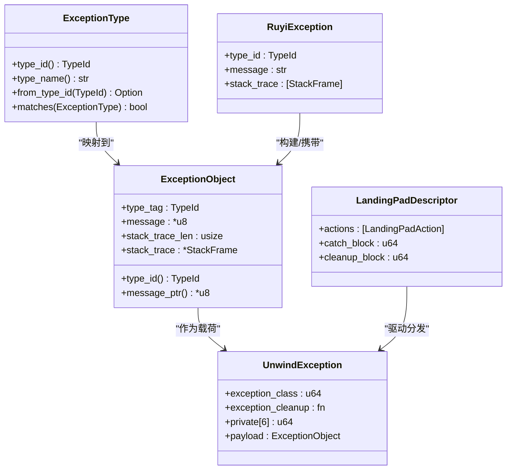
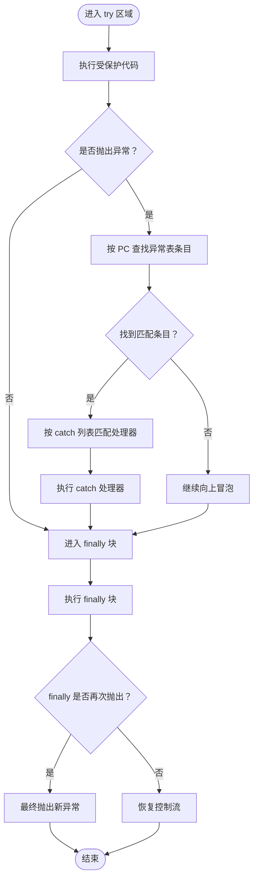
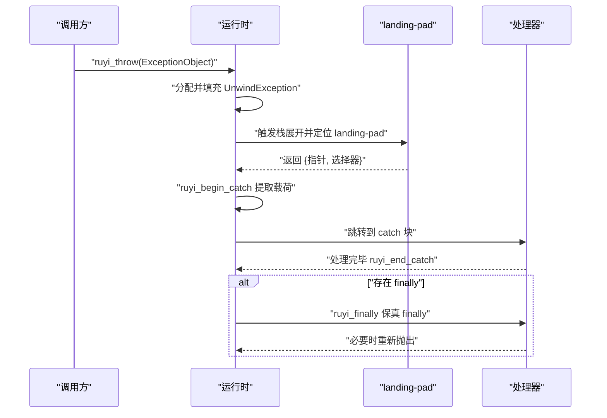
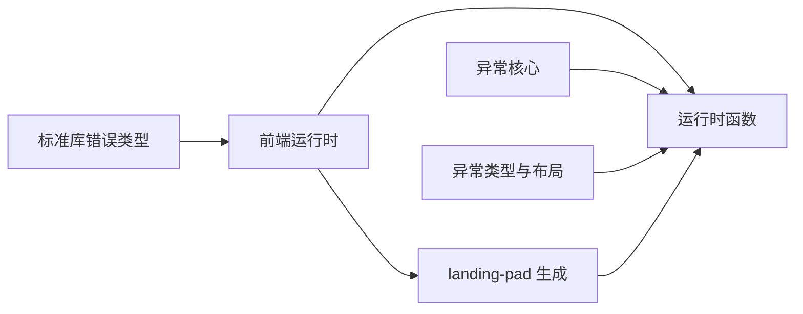

# 错误处理

<cite>
**本文引用的文件**
- [exception.rs](file://crates/ruyi_runtime/src/exception.rs)
- [types.rs](file://crates/ruyi_runtime/src/exception/types.rs)
- [runtime.rs](file://crates/ruyi_runtime/src/exception/runtime.rs)
- [landing_pad.rs](file://crates/ruyi_runtime/src/exception/landing_pad.rs)
- [exception.rs（前端运行时）](file://crates/ruyic/src/runtime/exception.rs)
- [error.ry（标准库）](file://stdlib/error.ry)
- [error_handling.ry（示例）](file://examples/error_handling.ry)
- [try_catch.ry（示例）](file://examples/try_catch.ry)
- [custom_errors.ry（集成测试）](file://crates/ruyic/tests/integration/cases/errors/custom_errors.ry)
- [try_catch.ry（集成测试）](file://crates/ruyic/tests/integration/cases/errors/try_catch.ry)
- [exception.rs（运行时测试）](file://crates/ruyi_runtime/tests/exception.rs)
- [exception_runtime.rs（运行时测试）](file://crates/ruyi_runtime/tests/exception_runtime.rs)
- [codes.rs（诊断码）](file://crates/ruyic/src/diagnostics/codes.rs)
- [diagnostics.rs（类型检查诊断）](file://crates/ruyic/src/typechecker/diagnostics.rs)
</cite>

## 目录
1. [简介](#简介)
2. [项目结构](#项目结构)
3. [核心组件](#核心组件)
4. [架构总览](#架构总览)
5. [详细组件分析](#详细组件分析)
6. [依赖关系分析](#依赖关系分析)
7. [性能考量](#性能考量)
8. [故障排查指南](#故障排查指南)
9. [结论](#结论)
10. [附录](#附录)

## 简介
本文件系统性梳理 Ruyi 的错误处理体系，覆盖以下主题：
- 语法与使用：try/catch/finally 的语法、异常捕获与处理流程、错误传播与冒泡、异常链与堆栈跟踪。
- 自定义异常：如何定义与抛出自定义异常类型，以及错误信息的传递与呈现。
- 运行时实现：基于 Itanium C++ ABI 的 landing-pad 模型、异常表与描述符、抛出与捕获的运行时函数。
- 最佳实践：错误分类、处理策略、运行时异常与编译时错误的区别与处理方式。
- 性能与优化：异常路径的开销来源与优化建议。
- 实战示例：通过示例与测试文件展示不同场景下的错误处理方法与调试技巧。

## 项目结构
Ruyi 的错误处理由“编译器前端”“运行时库”“标准库”三部分协同完成：
- 编译器前端负责将 Ruyi 语言的 try/catch/finally 语法翻译为 LLVM IR，并生成异常表与 landing-pad 指令。
- 运行时库提供异常对象布局、类型 ID 映射、抛出/捕获/finally 的运行时函数，以及 LLVM 代码生成辅助。
- 标准库提供内置错误类型（如 Error、TypeError、RuntimeError、RangeError 等），供用户在程序中直接使用或扩展。

**图表来源**
- [exception.rs:1-377](file://crates/ruyi_runtime/src/exception.rs#L1-L377)
- [types.rs:1-167](file://crates/ruyi_runtime/src/exception/types.rs#L1-L167)
- [runtime.rs:1-359](file://crates/ruyi_runtime/src/exception/runtime.rs#L1-L359)
- [landing_pad.rs:1-222](file://crates/ruyi_runtime/src/exception/landing_pad.rs#L1-L222)
- [exception.rs（前端运行时）:1-22](file://crates/ruyic/src/runtime/exception.rs#L1-L22)
- [error.ry（标准库）:1-106](file://stdlib/error.ry#L1-L106)

**章节来源**
- [exception.rs:1-377](file://crates/ruyi_runtime/src/exception.rs#L1-L377)
- [types.rs:1-167](file://crates/ruyi_runtime/src/exception/types.rs#L1-L167)
- [runtime.rs:1-359](file://crates/ruyi_runtime/src/exception/runtime.rs#L1-L359)
- [landing_pad.rs:1-222](file://crates/ruyi_runtime/src/exception/landing_pad.rs#L1-L222)
- [exception.rs（前端运行时）:1-22](file://crates/ruyic/src/runtime/exception.rs#L1-L22)
- [error.ry（标准库）:1-106](file://stdlib/error.ry#L1-L106)

## 核心组件
- 异常类型与类型 ID：内置异常类型（Error、TypeError、RangeError、RuntimeError）映射到运行时 TypeId；支持“Error”作为通用父类匹配所有子类型。
- 异常对象与布局：遵循 Itanium ABI 的 UnwindException 头部与 ExceptionObject 载荷，包含类型标签、消息指针、堆栈帧数组等。
- 异常表与 landing-pad：每函数维护 FunctionExceptionTable，记录 try 区域、landing-pad 偏移与 catch 子句；LLVM 侧生成 landingpad、invoke、resume 指令。
- 抛出与捕获运行时：ruyi_throw、ruyi_begin_catch、ruyi_end_catch、ruyi_finally；匹配 catch 类型列表，决定处理器分支。
- 栈追踪：当前版本提供占位实现，未来可接入 unwind 库生成真实调用栈。
- 标准库错误类型：提供一组常用错误类型，便于用户直接使用或扩展。

**章节来源**
- [types.rs:8-62](file://crates/ruyi_runtime/src/exception/types.rs#L8-L62)
- [exception.rs:184-229](file://crates/ruyi_runtime/src/exception.rs#L184-L229)
- [runtime.rs:24-121](file://crates/ruyi_runtime/src/exception/runtime.rs#L24-L121)
- [error.ry（标准库）:10-44](file://stdlib/error.ry#L10-L44)

## 架构总览
下图展示了从 Ruyi 语法到 LLVM IR 再到运行时处理的关键流程：

**图表来源**
- [runtime.rs:24-121](file://crates/ruyi_runtime/src/exception/runtime.rs#L24-L121)
- [landing_pad.rs:39-190](file://crates/ruyi_runtime/src/exception/landing_pad.rs#L39-L190)
- [exception.rs:33-100](file://crates/ruyi_runtime/src/exception.rs#L33-L100)

## 详细组件分析

### 语法与使用规则
- try/catch/finally 语法：支持多 catch 子句、无绑定 catch、finally 块保证执行。
- catch 匹配：按声明顺序匹配，命中即停止；catch 绑定变量用于访问错误对象。
- finally 行为：无论正常返回、异常抛出或被捕获，finally 均会执行；若 finally 中再次抛出异常，将覆盖之前的异常。
- 示例参考：
  - 基础 try/catch/finally：[error_handling.ry:21-34](file://examples/error_handling.ry#L21-L34)
  - catch 无绑定：[try_catch.ry:5-10](file://examples/try_catch.ry#L5-L10)
  - 自定义错误类型与嵌套处理：[error_handling.ry:122-161](file://examples/error_handling.ry#L122-L161)
  - 集成测试：[custom_errors.ry:1-29](file://crates/ruyic/tests/integration/cases/errors/custom_errors.ry#L1-L29)、[try_catch.ry:1-11](file://crates/ruyic/tests/integration/cases/errors/try_catch.ry#L1-L11)

**章节来源**
- [error_handling.ry:19-206](file://examples/error_handling.ry#L19-L206)
- [try_catch.ry:1-14](file://examples/try_catch.ry#L1-L14)
- [custom_errors.ry（集成测试）:1-29](file://crates/ruyic/tests/integration/cases/errors/custom_errors.ry#L1-L29)
- [try_catch.ry（集成测试）:1-11](file://crates/ruyic/tests/integration/cases/errors/try_catch.ry#L1-L11)

### 自定义异常的定义与抛出
- 定义方式：用户可像示例一样定义类作为异常类型，或直接使用标准库提供的错误类型。
- 抛出方式：在编译阶段将 throw 语句转换为对运行时抛出函数的调用，随后触发栈展开。
- 标准库错误类型：提供 Error 及其子类（TypeError、RuntimeError、RangeError 等），便于统一处理与扩展。
- 示例参考：
  - 用户自定义异常类：[error_handling.ry:11-16](file://examples/error_handling.ry#L11-L16)
  - 使用标准库错误类型：[error.ry（标准库）:10-44](file://stdlib/error.ry#L10-L44)
  - 抛出字符串（前端运行时）：[exception.rs（前端运行时）:15-22](file://crates/ruyic/src/runtime/exception.rs#L15-L22)

**章节来源**
- [error_handling.ry:11-16](file://examples/error_handling.ry#L11-L16)
- [error.ry（标准库）:10-44](file://stdlib/error.ry#L10-L44)
- [exception.rs（前端运行时）:1-22](file://crates/ruyic/src/runtime/exception.rs#L1-L22)

### 错误传播与冒泡机制
- 异常表与入口选择：每个函数维护 FunctionExceptionTable，按当前指令偏移选择最内层（最具体）的 try 区域。
- catch 匹配：ruyi_match_exception 按 catch 列表顺序匹配，命中即进入对应处理器；否则继续冒泡。
- finally 保证：若未捕获，finally 块仍会被执行；若 finally 内再次抛出异常，则覆盖原异常。
- 示例参考：
  - 异常表查找与处理器分发：[exception_runtime.rs:297-324](file://crates/ruyi_runtime/tests/exception_runtime.rs#L297-L324)
  - finally 保真与异常传递：[exception_runtime.rs:188-205](file://crates/ruyi_runtime/tests/exception_runtime.rs#L188-L205)

**章节来源**
- [exception_runtime.rs:297-324](file://crates/ruyi_runtime/tests/exception_runtime.rs#L297-L324)
- [exception_runtime.rs:188-205](file://crates/ruyi_runtime/tests/exception_runtime.rs#L188-L205)

### 运行时实现与数据结构
- 异常类型与 ID：ExceptionType 与 TypeId 映射，支持“Error”作为通用父类。
- 异常对象布局：UnwindException 头 + ExceptionObject 载荷，包含类型标签、消息指针、堆栈帧数组。
- landing-pad 描述符：LandingPadDescriptor 记录动作序列（Catch/Filter/Cleanup）、catch 块与 cleanup 块标签。
- 运行时函数：
  - ruyi_throw：分配 UnwindException 并调用 _Unwind_RaiseException。
  - ruyi_begin_catch / ruyi_end_catch：ABI 兼容的捕获生命周期管理。
  - ruyi_finally：finally 块入口，保留并可能重抛异常。
- 示例参考：
  - 异常对象与栈帧：[exception.rs:184-229](file://crates/ruyi_runtime/src/exception.rs#L184-L229)
  - landing-pad 生成与分发：[landing_pad.rs:136-190](file://crates/ruyi_runtime/src/exception/landing_pad.rs#L136-L190)
  - 运行时函数行为验证：[runtime.rs:24-121](file://crates/ruyi_runtime/src/exception/runtime.rs#L24-L121)

**图表来源**
- [types.rs:8-91](file://crates/ruyi_runtime/src/exception/types.rs#L8-L91)
- [exception.rs:184-278](file://crates/ruyi_runtime/src/exception.rs#L184-L278)

**章节来源**
- [types.rs:8-91](file://crates/ruyi_runtime/src/exception/types.rs#L8-L91)
- [exception.rs:184-278](file://crates/ruyi_runtime/src/exception.rs#L184-L278)
- [runtime.rs:24-121](file://crates/ruyi_runtime/src/exception/runtime.rs#L24-L121)
- [landing_pad.rs:136-190](file://crates/ruyi_runtime/src/exception/landing_pad.rs#L136-L190)

### 代码级流程图：异常捕获与 finally 保证

**图表来源**
- [exception.rs:138-149](file://crates/ruyi_runtime/src/exception.rs#L138-L149)
- [runtime.rs:102-121](file://crates/ruyi_runtime/src/exception/runtime.rs#L102-L121)
- [landing_pad.rs:136-190](file://crates/ruyi_runtime/src/exception/landing_pad.rs#L136-L190)

### API 时序：抛出与捕获

**图表来源**
- [runtime.rs:24-121](file://crates/ruyi_runtime/src/exception/runtime.rs#L24-L121)
- [landing_pad.rs:39-190](file://crates/ruyi_runtime/src/exception/landing_pad.rs#L39-L190)

## 依赖关系分析
- 编译器前端依赖运行时库提供的运行时函数与 landing-pad 生成器，以确保生成的 IR 能正确调用运行时。
- 运行时库内部模块高度内聚：types.rs 定义类型与布局，exception.rs 提供异常表与描述符，runtime.rs 提供运行时函数，landing_pad.rs 提供 LLVM 代码生成辅助。
- 标准库错误类型被编译器前端与运行时共同使用，形成一致的错误模型。

**图表来源**
- [runtime.rs:123-277](file://crates/ruyi_runtime/src/exception/runtime.rs#L123-L277)
- [landing_pad.rs:1-222](file://crates/ruyi_runtime/src/exception/landing_pad.rs#L1-L222)
- [exception.rs:1-50](file://crates/ruyi_runtime/src/exception.rs#L1-L50)
- [error.ry（标准库）:1-106](file://stdlib/error.ry#L1-L106)

**章节来源**
- [runtime.rs:123-277](file://crates/ruyi_runtime/src/exception/runtime.rs#L123-L277)
- [landing_pad.rs:1-222](file://crates/ruyi_runtime/src/exception/landing_pad.rs#L1-L222)
- [exception.rs:1-50](file://crates/ruyi_runtime/src/exception.rs#L1-L50)
- [error.ry（标准库）:1-106](file://stdlib/error.ry#L1-L106)

## 性能考量
- 异常路径的开销来源：
  - 栈展开与异常表查找：每次抛出都会触发栈展开，需遍历异常表以定位 landing-pad。
  - 消息与堆栈帧复制：异常对象包含消息与堆栈帧数组，分配与拷贝带来额外成本。
  - landing-pad 分支判断：catch 列表越长，匹配耗时越高。
- 优化建议：
  - 将 catch 列表按命中概率排序，把最可能命中的类型放在前面。
  - 避免在热路径频繁抛出异常；优先使用返回值/Option<Result)模式。
  - 控制堆栈帧数量与消息长度，减少异常对象大小。
  - 在 finally 中避免昂贵操作，保持其轻量性。
  - 对于高频错误，考虑使用编译期诊断（见下一节）降低运行时负担。

[本节为通用性能指导，不直接分析特定文件]

## 故障排查指南
- 编译期诊断：
  - 词法、语法、类型、解析错误与警告均有明确的错误码与消息格式，便于定位问题。
  - 参考：[codes.rs（诊断码）:1-345](file://crates/ruyic/src/diagnostics/codes.rs#L1-L345)、[diagnostics.rs（类型检查诊断）:1-207](file://crates/ruyic/src/typechecker/diagnostics.rs#L1-L207)
- 运行时断言与测试：
  - 运行时测试覆盖了异常类型匹配、finally 保真、landing-pad 生成等关键路径，可作为回归依据。
  - 参考：[exception.rs（运行时测试）:1-232](file://crates/ruyi_runtime/tests/exception.rs#L1-L232)、[exception_runtime.rs（运行时测试）:1-588](file://crates/ruyi_runtime/tests/exception_runtime.rs#L1-L588)
- 调试技巧：
  - 使用标准库错误类型（如 Error、TypeError、RangeError）统一错误表示，便于在 catch 中区分与打印。
  - 在 finally 中进行资源清理与状态恢复，确保即使异常也执行。
  - 结合示例与集成测试逐步缩小问题范围，例如先验证基础 try/catch，再加入 finally 与嵌套处理。

**章节来源**
- [codes.rs（诊断码）:1-345](file://crates/ruyic/src/diagnostics/codes.rs#L1-L345)
- [diagnostics.rs（类型检查诊断）:1-207](file://crates/ruyic/src/typechecker/diagnostics.rs#L1-L207)
- [exception.rs（运行时测试）:1-232](file://crates/ruyi_runtime/tests/exception.rs#L1-L232)
- [exception_runtime.rs（运行时测试）:1-588](file://crates/ruyi_runtime/tests/exception_runtime.rs#L1-L588)

## 结论
Ruyi 的错误处理体系以 Itanium ABI 为基础，结合编译器前端的 IR 生成与运行时库的函数实现，提供了完整的异常抛出、捕获、finally 保真与跨函数传播能力。配合标准库的错误类型与编译期诊断，开发者可以在保证性能的前提下，编写清晰、可维护的错误处理逻辑。建议在热路径尽量避免异常，合理组织 catch 列表与 finally 块，并充分利用标准库错误类型与诊断工具提升开发效率与代码质量。

[本节为总结性内容，不直接分析特定文件]

## 附录
- 实际代码示例路径（不含具体代码内容）：
  - 基础 try/catch/finally：[error_handling.ry:21-34](file://examples/error_handling.ry#L21-L34)
  - catch 无绑定：[try_catch.ry:5-10](file://examples/try_catch.ry#L5-L10)
  - 自定义错误类型与嵌套处理：[error_handling.ry:122-161](file://examples/error_handling.ry#L122-L161)
  - 集成测试：[custom_errors.ry（集成测试）:1-29](file://crates/ruyic/tests/integration/cases/errors/custom_errors.ry#L1-L29)、[try_catch.ry（集成测试）:1-11](file://crates/ruyic/tests/integration/cases/errors/try_catch.ry#L1-L11)
  - 标准库错误类型：[error.ry（标准库）:10-44](file://stdlib/error.ry#L10-L44)
  - 抛出字符串（前端运行时）：[exception.rs（前端运行时）:15-22](file://crates/ruyic/src/runtime/exception.rs#L15-L22)