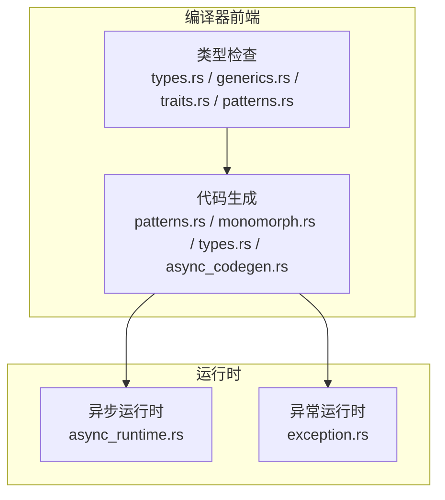
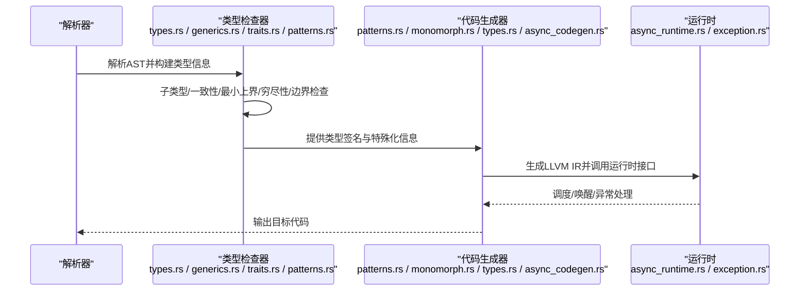
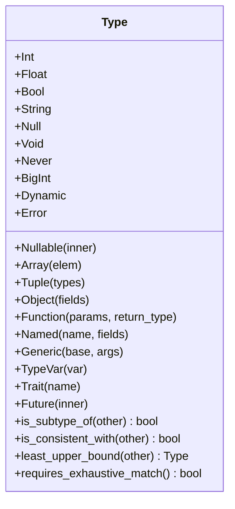
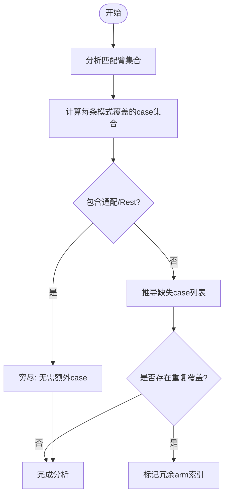
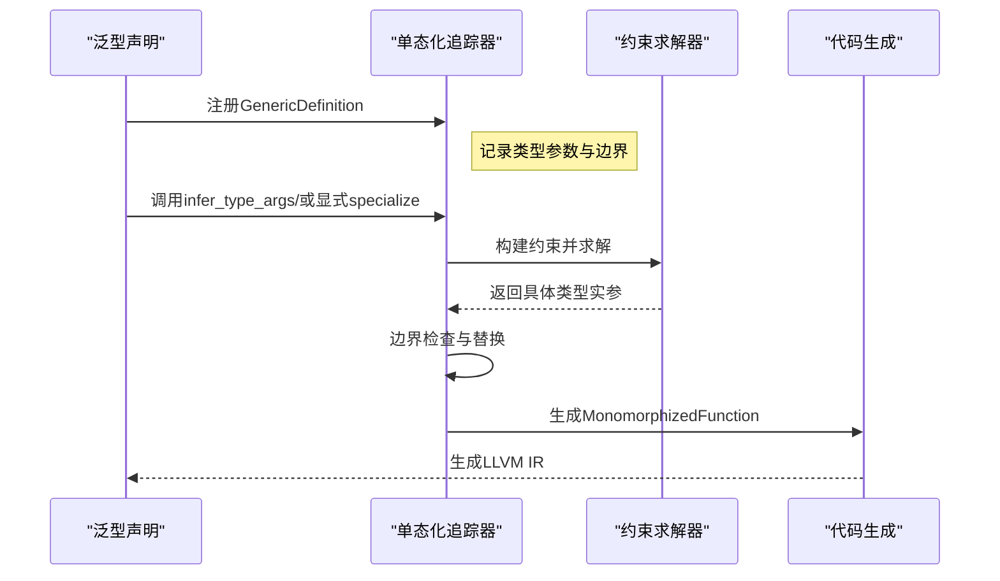
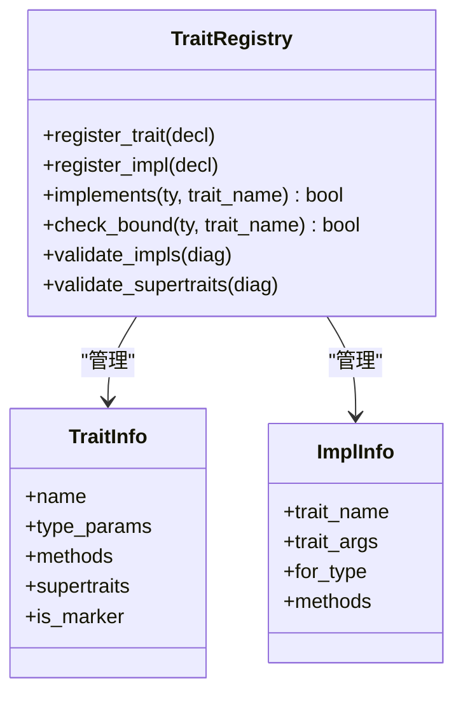
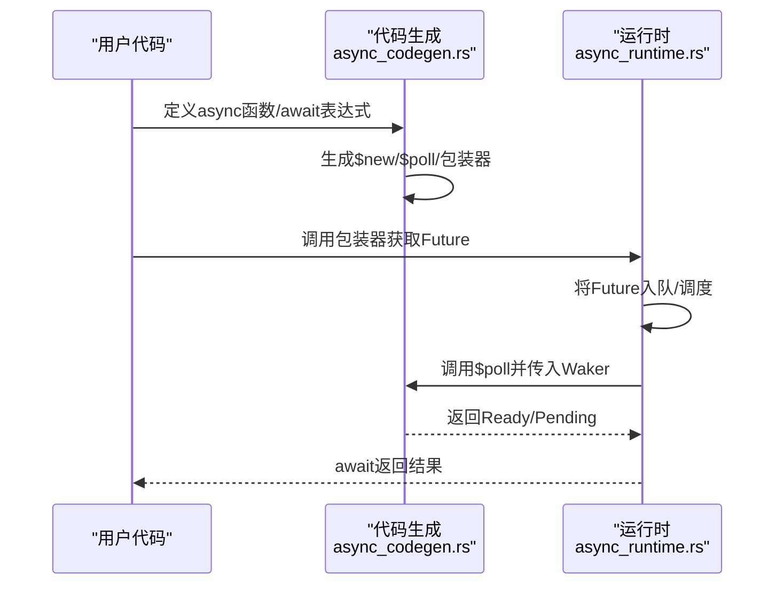
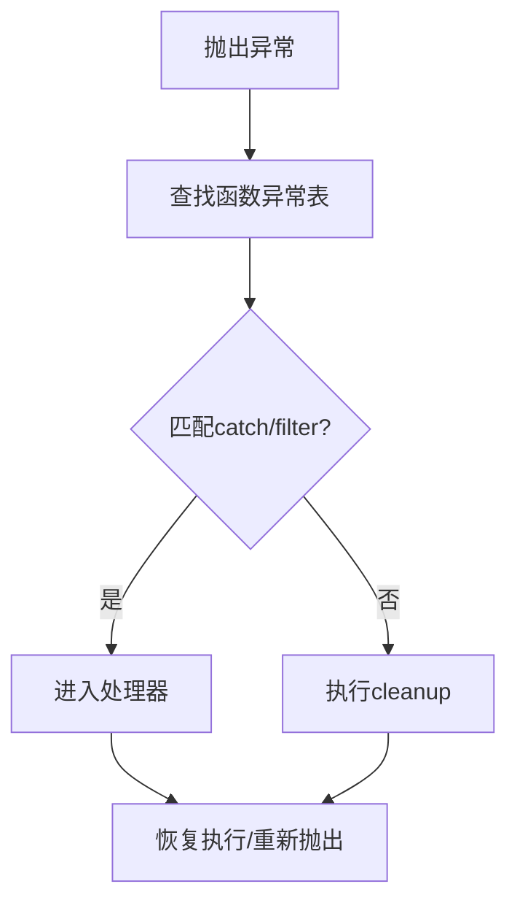
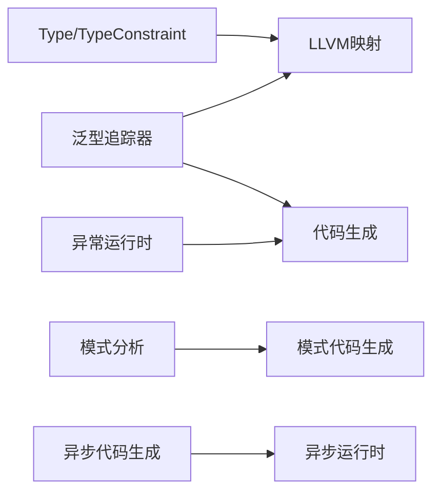

# 高级语言特性

<cite>
**本文引用的文件**
- [types.rs](file://crates/ruyic/src/typechecker/types.rs)
- [generics.rs](file://crates/ruyic/src/typechecker/generics.rs)
- [traits.rs](file://crates/ruyic/src/typechecker/traits.rs)
- [patterns.rs（类型检查）](file://crates/ruyic/src/typechecker/patterns.rs)
- [patterns.rs（代码生成）](file://crates/ruyic/src/codegen/patterns.rs)
- [monomorph.rs](file://crates/ruyic/src/codegen/monomorph.rs)
- [types.rs（代码生成）](file://crates/ruyic/src/codegen/types.rs)
- [async_codegen.rs](file://crates/ruyic/src/codegen/async_codegen.rs)
- [exception.rs（运行时）](file://crates/ruyi_runtime/src/exception.rs)
- [async_runtime.rs（运行时）](file://crates/ruyi_runtime/src/async_runtime.rs)
- [pattern_matching.ry](file://examples/pattern_matching.ry)
- [traits.ry](file://examples/traits.ry)
</cite>

## 目录
1. [引言](#引言)
2. [项目结构](#项目结构)
3. [核心组件](#核心组件)
4. [架构总览](#架构总览)
5. [详细组件分析](#详细组件分析)
6. [依赖关系分析](#依赖关系分析)
7. [性能考量](#性能考量)
8. [故障排查指南](#故障排查指南)
9. [结论](#结论)
10. [附录](#附录)

## 引言
本文件系统性梳理 Ruyi 编程语言的高级语言特性，围绕渐进式类型系统、模式匹配、泛型与单态化、Traits 系统、类与对象、异步编程模型以及错误处理机制展开。文档以代码为依据，结合图示与示例路径，帮助读者从原理到实践全面掌握这些特性。

## 项目结构
Ruyi 的高级特性主要由编译器前端（类型检查、代码生成）与运行时（异常、异步调度）两部分构成：
- 类型系统与泛型：位于类型检查模块，负责类型推断、约束求解、单态化追踪与 LLVM 映射。
- 模式匹配：类型检查阶段进行穷尽性与冗余性分析；代码生成阶段生成高效的 LLVM 分派与绑定逻辑。
- Traits 系统：声明、实现与边界检查，支持默认方法与超 trait 校验。
- 异步：将 async 函数编译为状态机，配合运行时调度器与唤醒机制。
- 错误处理：基于 Itanium ABI 的异常表与落地垫片，支持 try/catch/finally。

**图表来源**
- [types.rs:1-711](file://crates/ruyic/src/typechecker/types.rs#L1-L711)
- [generics.rs:1-968](file://crates/ruyic/src/typechecker/generics.rs#L1-L968)
- [traits.rs:1-409](file://crates/ruyic/src/typechecker/traits.rs#L1-L409)
- [patterns.rs（类型检查）:1-518](file://crates/ruyic/src/typechecker/patterns.rs#L1-L518)
- [patterns.rs（代码生成）:1-1106](file://crates/ruyic/src/codegen/patterns.rs#L1-L1106)
- [monomorph.rs:1-218](file://crates/ruyic/src/codegen/monomorph.rs#L1-L218)
- [types.rs（代码生成）:1-238](file://crates/ruyic/src/codegen/types.rs#L1-L238)
- [async_codegen.rs:1-562](file://crates/ruyic/src/codegen/async_codegen.rs#L1-L562)
- [async_runtime.rs（运行时）:1-655](file://crates/ruyi_runtime/src/async_runtime.rs#L1-L655)
- [exception.rs（运行时）:1-377](file://crates/ruyi_runtime/src/exception.rs#L1-L377)

**章节来源**
- [types.rs:1-711](file://crates/ruyic/src/typechecker/types.rs#L1-L711)
- [generics.rs:1-968](file://crates/ruyic/src/typechecker/generics.rs#L1-L968)
- [traits.rs:1-409](file://crates/ruyic/src/typechecker/traits.rs#L1-L409)
- [patterns.rs（类型检查）:1-518](file://crates/ruyic/src/typechecker/patterns.rs#L1-L518)
- [patterns.rs（代码生成）:1-1106](file://crates/ruyic/src/codegen/patterns.rs#L1-L1106)
- [monomorph.rs:1-218](file://crates/ruyic/src/codegen/monomorph.rs#L1-L218)
- [types.rs（代码生成）:1-238](file://crates/ruyic/src/codegen/types.rs#L1-L238)
- [async_codegen.rs:1-562](file://crates/ruyic/src/codegen/async_codegen.rs#L1-L562)
- [async_runtime.rs（运行时）:1-655](file://crates/ruyi_runtime/src/async_runtime.rs#L1-L655)
- [exception.rs（运行时）:1-377](file://crates/ruyi_runtime/src/exception.rs#L1-L377)

## 核心组件
- 渐进式类型系统：内置类型、可空、数组、元组、对象、函数、命名类型、泛型、类型变量、动态类型、Future、错误类型等；支持子类型判断、一致性判断与最小上界计算。
- 泛型与单态化：类型参数声明、类型实参推断、显式指定、边界检查、替换与消解、符号名混淆、收集与去重。
- Traits 系统：trait 声明、实现、默认方法、超 trait 校验、边界满足检查、方法解析。
- 模式匹配：穷尽性与冗余性分析、字面量/通配/标识符/或模式/对象/数组/Rest/As 模式绑定、守卫条件、LLVM 分派与绑定。
- 异步编程：async/await 编译为状态机，$new/$poll 包装器，await 表达式在同步/异步上下文的不同行为，运行时调度与唤醒。
- 错误处理：Itanium ABI 异常表、落地垫片、catch/filter/cleanup、finally 清理、类型过滤与栈帧记录。

**章节来源**
- [types.rs:14-60](file://crates/ruyic/src/typechecker/types.rs#L14-L60)
- [generics.rs:22-101](file://crates/ruyic/src/typechecker/generics.rs#L22-L101)
- [traits.rs:16-52](file://crates/ruyic/src/typechecker/traits.rs#L16-L52)
- [patterns.rs（类型检查）:11-59](file://crates/ruyic/src/typechecker/patterns.rs#L11-L59)
- [patterns.rs（代码生成）:20-76](file://crates/ruyic/src/codegen/patterns.rs#L20-L76)
- [async_codegen.rs:206-504](file://crates/ruyic/src/codegen/async_codegen.rs#L206-L504)
- [exception.rs（运行时）:33-149](file://crates/ruyi_runtime/src/exception.rs#L33-L149)

## 架构总览
下图展示从类型检查到代码生成再到运行时的关键交互：

**图表来源**
- [types.rs:151-383](file://crates/ruyic/src/typechecker/types.rs#L151-L383)
- [generics.rs:222-264](file://crates/ruyic/src/typechecker/generics.rs#L222-L264)
- [patterns.rs（类型检查）:20-59](file://crates/ruyic/src/typechecker/patterns.rs#L20-L59)
- [patterns.rs（代码生成）:20-76](file://crates/ruyic/src/codegen/patterns.rs#L20-L76)
- [monomorph.rs:50-61](file://crates/ruyic/src/codegen/monomorph.rs#L50-L61)
- [types.rs（代码生成）:27-103](file://crates/ruyic/src/codegen/types.rs#L27-L103)
- [async_codegen.rs:206-504](file://crates/ruyic/src/codegen/async_codegen.rs#L206-L504)
- [async_runtime.rs（运行时）:138-314](file://crates/ruyi_runtime/src/async_runtime.rs#L138-L314)
- [exception.rs（运行时）:118-149](file://crates/ruyi_runtime/src/exception.rs#L118-L149)

## 详细组件分析

### 渐进式类型系统与动态类型（dyn）
- 类型覆盖：整数、浮点、布尔、字符串、空、void、never、大整数、可空、数组、元组、对象、函数、命名类型、泛型、类型变量、动态类型、Future、错误类型。
- 子类型规则：自反、int 向 float 放宽、T <: T?、never 是所有类型的子类型、dyn 与任何类型一致但非严格子类型、对象结构子类型、函数逆变参数协变返回、数组协变、泛型相等或子类型、命名类型可视为 trait 的子类型。
- 一致性判断：若任一为 dyn 或存在子类型关系则一致。
- 最小上界：同型 lub、int+float→float、含 never 的恒等律、含 dyn 的吸收律、子类型链路、可空与元组逐元素 lub。
- 动态类型：在 LLVM 中映射为结构体，支持与任意类型一致，便于渐进迁移。

**图表来源**
- [types.rs:14-60](file://crates/ruyic/src/typechecker/types.rs#L14-L60)
- [types.rs:151-383](file://crates/ruyic/src/typechecker/types.rs#L151-L383)

**章节来源**
- [types.rs:14-60](file://crates/ruyic/src/typechecker/types.rs#L14-L60)
- [types.rs:151-383](file://crates/ruyic/src/typechecker/types.rs#L151-L383)
- [types.rs（代码生成）:27-103](file://crates/ruyic/src/codegen/types.rs#L27-L103)

最佳实践
- 在需要渐进迁移时优先使用 dyn，逐步收紧到具体类型。
- 对可空字段使用可空类型，避免运行时空指针。
- 使用 lub 推导表达式的统一类型，减少重复分支。

### 模式匹配：语法、穷尽性与绑定
- 支持字面量、通配、标识符、或模式、对象/数组/Rest/As 模式、守卫条件。
- 穷尽性分析：根据 scrutinee 类型推导缺失分支；布尔/空/数组/对象/可空/命名类型分别处理；通配或 Rest 可覆盖剩余情况。
- 冗余性检测：若某模式覆盖已覆盖集合中的 case，则标记该分支冗余。
- 代码生成：按类型选择分派策略（switch/icmp 链/条件链），生成 arm 基本块并在合并点汇聚；支持守卫条件与 arm 体编译；对象/数组模式进行字段/元素绑定。

**图表来源**
- [patterns.rs（类型检查）:20-59](file://crates/ruyic/src/typechecker/patterns.rs#L20-L59)
- [patterns.rs（类型检查）:195-309](file://crates/ruyic/src/typechecker/patterns.rs#L195-L309)

**章节来源**
- [patterns.rs（类型检查）:20-59](file://crates/ruyic/src/typechecker/patterns.rs#L20-L59)
- [patterns.rs（类型检查）:195-309](file://crates/ruyic/src/typechecker/patterns.rs#L195-L309)
- [patterns.rs（代码生成）:20-76](file://crates/ruyic/src/codegen/patterns.rs#L20-L76)
- [patterns.rs（代码生成）:310-526](file://crates/ruyic/src/codegen/patterns.rs#L310-L526)

示例参考
- [pattern_matching.ry:11-18](file://examples/pattern_matching.ry#L11-L18)
- [pattern_matching.ry:23-29](file://examples/pattern_matching.ry#L23-L29)
- [pattern_matching.ry:34-41](file://examples/pattern_matching.ry#L34-L41)
- [pattern_matching.ry:46-67](file://examples/pattern_matching.ry#L46-L67)
- [pattern_matching.ry:72-92](file://examples/pattern_matching.ry#L72-L92)
- [pattern_matching.ry:116-125](file://examples/pattern_matching.ry#L116-L125)
- [pattern_matching.ry:130-142](file://examples/pattern_matching.ry#L130-L142)
- [pattern_matching.ry:147-162](file://examples/pattern_matching.ry#L147-L162)

### 泛型编程与单态化
- 类型参数：函数/类/trait 声明中引入类型参数，支持带/不带边界。
- 实参推断：通过参数类型与返回类型建立约束，求解得到具体类型实参。
- 边界检查：对每个类型实参验证是否满足对应类型参数的 trait 边界。
- 替换与消解：将类型变量替换为具体类型，生成具体签名。
- 符号混淆：将类型参数组合编码为唯一名称，用于区分不同实例。
- 单态化收集：在类型检查后收集所有特殊化，代码生成阶段仅生成一次并复用。

**图表来源**
- [generics.rs:222-264](file://crates/ruyic/src/typechecker/generics.rs#L222-L264)
- [generics.rs:266-370](file://crates/ruyic/src/typechecker/generics.rs#L266-L370)
- [monomorph.rs:50-61](file://crates/ruyic/src/codegen/monomorph.rs#L50-L61)

**章节来源**
- [generics.rs:22-101](file://crates/ruyic/src/typechecker/generics.rs#L22-L101)
- [generics.rs:222-264](file://crates/ruyic/src/typechecker/generics.rs#L222-L264)
- [generics.rs:266-370](file://crates/ruyic/src/typechecker/generics.rs#L266-L370)
- [monomorph.rs:50-61](file://crates/ruyic/src/codegen/monomorph.rs#L50-L61)
- [types.rs（代码生成）:27-103](file://crates/ruyic/src/codegen/types.rs#L27-L103)

最佳实践
- 为复杂泛型函数提供明确的类型注解，减少歧义。
- 合理设计边界，避免过度约束导致难以实例化。

### Traits 系统：静态与动态分发
- 声明与实现：trait 声明方法签名，impl 为具体类型提供实现；支持默认方法。
- 边界检查：注册阶段校验实现完整性与超 trait 循环。
- 方法解析：按类型查找实现，支持默认方法回退。
- 运行时：动态类型与 trait 对象在 LLVM 中映射为结构体，便于运行时分发。

**图表来源**
- [traits.rs:46-52](file://crates/ruyic/src/typechecker/traits.rs#L46-L52)
- [traits.rs:167-184](file://crates/ruyic/src/typechecker/traits.rs#L167-L184)
- [traits.rs:211-234](file://crates/ruyic/src/typechecker/traits.rs#L211-L234)

**章节来源**
- [traits.rs:46-52](file://crates/ruyic/src/typechecker/traits.rs#L46-L52)
- [traits.rs:167-184](file://crates/ruyic/src/typechecker/traits.rs#L167-L184)
- [traits.rs:211-234](file://crates/ruyic/src/typechecker/traits.rs#L211-L234)
- [traits.rs:236-247](file://crates/ruyic/src/typechecker/traits.rs#L236-L247)
- [traits.rs:298-318](file://crates/ruyic/src/typechecker/traits.rs#L298-L318)
- [types.rs（代码生成）:78-87](file://crates/ruyic/src/codegen/types.rs#L78-L87)

示例参考
- [traits.ry:11-13](file://examples/traits.ry#L11-L13)
- [traits.ry:15-25](file://examples/traits.ry#L15-L25)
- [traits.ry:49-60](file://examples/traits.ry#L49-L60)
- [traits.ry:65-68](file://examples/traits.ry#L65-L68)
- [traits.ry:86-110](file://examples/traits.ry#L86-L110)

### 类与对象：构造、方法与继承
- 类定义：字段与方法声明，构造函数（通过方法实现）。
- 对象布局：在 LLVM 中以结构体形式存储类型标签、字段计数与字段存储指针。
- 继承：当前实现未见显式类继承，对象多以结构体与方法实现为主。

**章节来源**
- [types.rs（代码生成）:166-177](file://crates/ruyic/src/codegen/types.rs#L166-L177)
- [generics.ry:4-7](file://examples/generics.ry#L4-L7)

### 异步编程模型：async/await 与并发
- 编译：async 函数生成三段实体：$new 构造状态机、$poll 驱动状态机、包装器返回 Future 指针。
- 状态机：包含轮询函数指针、当前状态、参数槽位与结果槽位；$poll 根据状态跳转至相应阶段。
- await：在异步上下文调用运行时轮询函数，加载结果；在同步上下文阻塞等待。
- 运行时：工作窃取队列、任务队列、唤醒器、全局调度器、GC 根注册、并发组合器（JoinAll/Race）。

**图表来源**
- [async_codegen.rs:206-504](file://crates/ruyic/src/codegen/async_codegen.rs#L206-L504)
- [async_runtime.rs（运行时）:138-314](file://crates/ruyi_runtime/src/async_runtime.rs#L138-L314)
- [async_runtime.rs（运行时）:384-455](file://crates/ruyi_runtime/src/async_runtime.rs#L384-L455)

**章节来源**
- [async_codegen.rs:206-504](file://crates/ruyic/src/codegen/async_codegen.rs#L206-L504)
- [async_runtime.rs（运行时）:138-314](file://crates/ruyi_runtime/src/async_runtime.rs#L138-L314)
- [async_runtime.rs（运行时）:384-455](file://crates/ruyi_runtime/src/async_runtime.rs#L384-L455)

### 错误处理：try/catch/finally 与异常
- 异常表：每个函数维护受保护区域、落地垫片与捕获子句；支持 catch/filter/cleanup。
- 类型过滤：内置类型 ID 与 catch-all；按抛出类型匹配处理器。
- 运行时：异常对象携带类型 ID、消息与栈帧；落地垫片决定进入 catch 或 cleanup 分支。

**图表来源**
- [exception.rs（运行时）:33-149](file://crates/ruyi_runtime/src/exception.rs#L33-L149)
- [exception.rs（运行时）:280-291](file://crates/ruyi_runtime/src/exception.rs#L280-L291)

**章节来源**
- [exception.rs（运行时）:33-149](file://crates/ruyi_runtime/src/exception.rs#L33-L149)
- [exception.rs（运行时）:184-229](file://crates/ruyi_runtime/src/exception.rs#L184-L229)
- [exception.rs（运行时）:280-291](file://crates/ruyi_runtime/src/exception.rs#L280-L291)

## 依赖关系分析
- 类型系统依赖：Type 与 TypeConstraint 为类型检查核心数据结构；LLVM 映射依赖 Type。
- 泛型依赖：MonomorphizationTracker 依赖约束求解器与 TraitRegistry；代码生成依赖符号混淆与 LLVM 类型映射。
- 模式匹配依赖：类型检查与代码生成双通道协作，前者保证正确性，后者生成高效 IR。
- 异步依赖：代码生成依赖运行时接口；运行时依赖调度器与 GC 根注册。
- 错误处理依赖：异常表与落地垫片由运行时提供，代码生成器生成对应指令。

**图表来源**
- [types.rs:77-89](file://crates/ruyic/src/typechecker/types.rs#L77-L89)
- [types.rs（代码生成）:27-103](file://crates/ruyic/src/codegen/types.rs#L27-L103)
- [generics.rs:172-182](file://crates/ruyic/src/typechecker/generics.rs#L172-L182)
- [patterns.rs（类型检查）:20-59](file://crates/ruyic/src/typechecker/patterns.rs#L20-L59)
- [patterns.rs（代码生成）:20-76](file://crates/ruyic/src/codegen/patterns.rs#L20-L76)
- [async_codegen.rs:206-504](file://crates/ruyic/src/codegen/async_codegen.rs#L206-L504)
- [async_runtime.rs（运行时）:138-314](file://crates/ruyi_runtime/src/async_runtime.rs#L138-L314)
- [exception.rs（运行时）:118-149](file://crates/ruyi_runtime/src/exception.rs#L118-L149)

**章节来源**
- [types.rs:77-89](file://crates/ruyic/src/typechecker/types.rs#L77-L89)
- [generics.rs:172-182](file://crates/ruyic/src/typechecker/generics.rs#L172-L182)
- [patterns.rs（类型检查）:20-59](file://crates/ruyic/src/typechecker/patterns.rs#L20-L59)
- [patterns.rs（代码生成）:20-76](file://crates/ruyic/src/codegen/patterns.rs#L20-L76)
- [async_codegen.rs:206-504](file://crates/ruyic/src/codegen/async_codegen.rs#L206-L504)
- [async_runtime.rs（运行时）:138-314](file://crates/ruyi_runtime/src/async_runtime.rs#L138-L314)
- [exception.rs（运行时）:118-149](file://crates/ruyi_runtime/src/exception.rs#L118-L149)

## 性能考量
- 单态化：通过符号混淆与去重避免重复生成相同实例，降低二进制体积与提升缓存命中。
- 模式匹配：switch/icmp 链与条件链的选择取决于守卫存在与否；尽量使用穷尽匹配减少分支。
- 异步：工作窃取队列减少锁竞争；GC 根注册确保挂起任务可达对象不被回收。
- LLVM 映射：基础类型直接映射，复合类型采用指针或结构体，动态类型与 trait 对象采用结构体承载 vtable 指针。

[本节为通用指导，无需列出章节来源]

## 故障排查指南
- 类型不兼容：检查子类型与一致性规则，确认是否混用 dyn。
- 泛型实参与边界：核对类型实参数量与边界满足，必要时显式指定类型参数。
- 模式不穷尽：根据缺失 case 列表补齐分支；通配/Rest 可作为兜底。
- 异步卡住：确认 await 上下文与唤醒器设置；检查全局调度器状态。
- 异常未捕获：核对异常表条目与 catch 类型 ID，确保 catch-all 处理。

**章节来源**
- [types.rs:151-309](file://crates/ruyic/src/typechecker/types.rs#L151-L309)
- [generics.rs:222-264](file://crates/ruyic/src/typechecker/generics.rs#L222-L264)
- [patterns.rs（类型检查）:195-309](file://crates/ruyic/src/typechecker/patterns.rs#L195-L309)
- [async_runtime.rs（运行时）:316-357](file://crates/ruyi_runtime/src/async_runtime.rs#L316-L357)
- [exception.rs（运行时）:138-149](file://crates/ruyi_runtime/src/exception.rs#L138-L149)

## 结论
Ruyi 的高级特性以渐进式类型系统为基础，辅以强大的模式匹配、灵活的泛型与单态化、可扩展的 Traits 系统、完善的异步运行时与异常处理机制。通过类型检查与代码生成的紧密协作，既保证了安全性，又兼顾了性能与可移植性。建议在工程实践中充分利用 dyn 的渐进能力、穷尽性检查与单态化优化，以获得更稳健的开发体验。

[本节为总结性内容，无需列出章节来源]

## 附录
- 示例参考
  - 模式匹配：[pattern_matching.ry:11-18](file://examples/pattern_matching.ry#L11-L18)
  - Traits：[traits.ry:11-13](file://examples/traits.ry#L11-L13)

[本节为补充材料，无需列出章节来源]